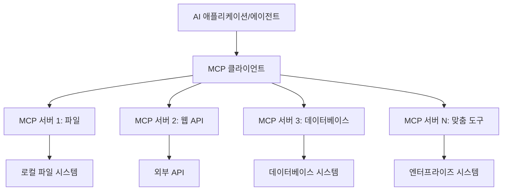

# 🌐 모듈 2: Microsoft Foundry Toolkit 기본을 활용한 MCP

[]()
[]()
[]()

## 📋 학습 목표

이 모듈이 끝나면 다음을 할 수 있습니다:
- ✅ 모델 컨텍스트 프로토콜(MCP) 아키텍처와 이점 이해
- ✅ Microsoft의 MCP 서버 생태계 탐색
- ✅ MCP 서버를 Microsoft Foundry Toolkit Agent Builder와 통합
- ✅ Playwright MCP를 사용하여 기능적 브라우저 자동화 에이전트 구축
- ✅ 에이전트 내에서 MCP 도구 구성 및 테스트
- ✅ 생산 환경용 MCP 기반 에이전트 내보내기 및 배포

## 🎯 모듈 1 기반 확장

모듈 1에서는 Microsoft Foundry Toolkit 기본을 마스터하고 첫 번째 Python 에이전트를 만들었습니다. 이제 혁신적인 <strong>모델 컨텍스트 프로토콜(MCP)</strong>을 통해 에이전트를 외부 도구와 서비스에 연결하여 <strong>강력하게 업그레이드</strong>할 것입니다.

기본 계산기에서 완전한 컴퓨터로 업그레이드하는 것과 같다고 생각하세요 — AI 에이전트가 다음과 같은 기능을 갖겠습니다:
- 🌐 웹사이트 탐색 및 상호작용
- 📁 파일 접근 및 조작
- 🔧 엔터프라이즈 시스템과 통합
- 📊 API로부터 실시간 데이터 처리

## 🧠 모델 컨텍스트 프로토콜(MCP) 이해

### 🔍 MCP란?

모델 컨텍스트 프로토콜(MCP)은 <strong>AI 애플리케이션을 위한 USB-C</strong>와 같은 혁신적인 오픈 표준으로, 대형 언어 모델(LLM)을 외부 도구, 데이터 소스, 서비스와 연결합니다. USB-C가 하나의 보편적 커넥터로 케이블 혼란을 제거한 것처럼, MCP는 하나의 표준화된 프로토콜로 AI 통합의 복잡성을 제거합니다.

### 🎯 MCP가 해결하는 문제

**MCP 이전:**
- 🔧 각 도구마다 맞춤형 통합 필요
- 🔄 독점 솔루션으로 인한 공급 업체 종속
- 🔒 임시 연결로 인한 보안 취약점
- ⏱️ 기본 통합에도 수개월 개발 기간

**MCP 사용 시:**
- ⚡ 플러그 앤 플레이 도구 통합
- 🔄 공급 업체에 구애받지 않는 아키텍처
- 🛡️ 내장된 보안 최고 관행
- 🚀 몇 분 만에 새로운 기능 추가

### 🏗️ MCP 아키텍처 심층 분석

MCP는 안전하고 확장 가능한 생태계를 구축하는 <strong>클라이언트-서버 아키텍처</strong>를 따릅니다:



**🔧 핵심 구성요소:**

| 구성요소 | 역할 | 예시 |
|-----------|------|----------|
| **MCP 호스트** | MCP 서비스를 사용하는 애플리케이션 | Claude Desktop, VS Code, Microsoft Foundry Toolkit |
| **MCP 클라이언트** | 프로토콜 핸들러 (서버와 1:1 매칭) | 호스트 애플리케이션에 내장 |
| **MCP 서버** | 표준 프로토콜로 기능 노출 | Playwright, Files, Azure, GitHub |
| **전송 계층** | 통신 수단 | stdio, HTTP, WebSockets |


## 🏢 Microsoft의 MCP 서버 생태계

Microsoft는 실제 비즈니스 요구를 충족하는 포괄적인 엔터프라이즈급 서버 모음으로 MCP 생태계를 선도합니다.

### 🌟 주요 Microsoft MCP 서버

#### 1. ☁️ Azure MCP 서버
**🔗 저장소**: [azure/azure-mcp](https://github.com/azure/azure-mcp)
**🎯 목적**: AI 통합이 포함된 종합적인 Azure 리소스 관리

**✨ 주요 기능:**
- 선언적 인프라 프로비저닝
- 실시간 리소스 모니터링
- 비용 최적화 권장사항
- 보안 준수 검사

**🚀 활용 사례:**
- AI 지원 인프라스트럭처 코드화
- 자동 리소스 스케일링
- 클라우드 비용 최적화
- DevOps 워크플로우 자동화

#### 2. 📊 Microsoft Dataverse MCP
**📚 문서**: [Microsoft Dataverse Integration](https://go.microsoft.com/fwlink/?linkid=2320176)
**🎯 목적**: 비즈니스 데이터용 자연어 인터페이스

**✨ 주요 기능:**
- 자연어 데이터베이스 쿼리
- 비즈니스 컨텍스트 이해
- 사용자 정의 프롬프트 템플릿
- 엔터프라이즈 데이터 거버넌스

**🚀 활용 사례:**
- 비즈니스 인텔리전스 리포팅
- 고객 데이터 분석
- 세일즈 파이프라인 인사이트
- 규정 준수 데이터 쿼리

#### 3. 🌐 Playwright MCP 서버
**🔗 저장소**: [microsoft/playwright-mcp](https://github.com/microsoft/playwright-mcp)
**🎯 목적**: 브라우저 자동화 및 웹 상호작용 기능 제공

**✨ 주요 기능:**
- 크로스 브라우저 자동화 (Chrome, Firefox, Safari)
- 지능형 요소 감지
- 스크린샷 및 PDF 생성
- 네트워크 트래픽 모니터링

**🚀 활용 사례:**
- 자동화 테스트 워크플로우
- 웹 스크래핑 및 데이터 추출
- UI/UX 모니터링
- 경쟁 분석 자동화

#### 4. 📁 Files MCP 서버
**🔗 저장소**: [microsoft/files-mcp-server](https://github.com/microsoft/files-mcp-server)
**🎯 목적**: 지능적인 파일 시스템 운영

**✨ 주요 기능:**
- 선언적 파일 관리
- 콘텐츠 동기화
- 버전 관리 통합
- 메타데이터 추출

**🚀 활용 사례:**
- 문서 관리
- 코드 저장소 조직화
- 콘텐츠 발행 워크플로우
- 데이터 파이프라인 파일 처리

#### 5. 📝 MarkItDown MCP 서버
**🔗 저장소**: [microsoft/markitdown](https://github.com/microsoft/markitdown)
**🎯 목적**: 고급 Markdown 처리 및 조작

**✨ 주요 기능:**
- 풍부한 Markdown 구문 분석
- 형식 변환 (MD ↔ HTML ↔ PDF)
- 콘텐츠 구조 분석
- 템플릿 처리

**🚀 활용 사례:**
- 기술 문서 워크플로우
- 콘텐츠 관리 시스템
- 보고서 생성
- 지식 베이스 자동화

#### 6. 📈 Clarity MCP 서버
**📦 패키지**: [@microsoft/clarity-mcp-server](https://www.npmjs.com/package/@microsoft/clarity-mcp-server)
**🎯 목적**: 웹 분석 및 사용자 행동 인사이트

**✨ 주요 기능:**
- 히트맵 데이터 분석
- 사용자 세션 녹화
- 성능 지표
- 전환 퍼널 분석

**🚀 활용 사례:**
- 웹사이트 최적화
- 사용자 경험 연구
- A/B 테스트 분석
- 비즈니스 인텔리전스 대시보드

### 🌍 커뮤니티 생태계

Microsoft의 서버 외에도 MCP 생태계에는 다음이 포함됩니다:
- **🐙 GitHub MCP**: 저장소 관리 및 코드 분석
- **🗄️ 데이터베이스 MCP들**: PostgreSQL, MySQL, MongoDB 통합
- **☁️ 클라우드 공급자 MCP들**: AWS, GCP, Digital Ocean 도구
- **📧 커뮤니케이션 MCP들**: Slack, Teams, 이메일 통합

## 🛠️ 실습: 브라우저 자동화 에이전트 구축

**🎯 프로젝트 목표**: Playwright MCP 서버를 사용하여 웹사이트를 탐색, 정보 추출, 복잡한 웹 상호작용을 수행할 수 있는 지능형 브라우저 자동화 에이전트를 만듭니다.

### 🚀 1단계: 에이전트 기본 설정

#### 1단계: 에이전트 초기화
1. **Microsoft Foundry Toolkit Agent Builder 열기**
2. **다음 설정으로 새 에이전트 생성:**
   - <strong>이름</strong>: `BrowserAgent`
   - <strong>모델</strong>: GPT-4o 선택


### 🔧 2단계: MCP 통합 워크플로우

#### 3단계: MCP 서버 통합 추가
1. Agent Builder의 도구 섹션으로 이동
2. "도구 추가" 클릭하여 통합 메뉴 열기
3. 사용 가능한 옵션에서 "MCP 서버" 선택


**🔍 도구 유형 이해:**
- **내장 도구**: 사전 구성된 Microsoft Foundry Toolkit 기능
- **MCP 서버**: 외부 서비스 통합
- **맞춤 API**: 자체 서비스 엔드포인트
- **함수 호출**: 모델 함수 직접 접근

#### 4단계: MCP 서버 선택
1. 계속 진행하려면 "MCP 서버" 옵션 선택


2. MCP 카탈로그를 탐색하여 사용 가능한 통합 보기


### 🎮 3단계: Playwright MCP 구성

#### 5단계: Playwright 선택 및 구성
1. "추천 MCP 서버 사용" 클릭하여 Microsoft 검증 서버 접근
2. 추천 목록에서 "Playwright" 선택
3. 기본 MCP ID 수락 또는 환경에 맞게 사용자화


#### 6단계: Playwright 기능 활성화
**🔑 중요 단계**: 최대한의 기능을 위해 사용 가능한 모든 Playwright 메서드 선택


**🛠️ 필수 Playwright 도구:**
- <strong>탐색</strong>: `goto`, `goBack`, `goForward`, `reload`
- <strong>상호작용</strong>: `click`, `fill`, `press`, `hover`, `drag`
- <strong>추출</strong>: `textContent`, `innerHTML`, `getAttribute`
- <strong>검증</strong>: `isVisible`, `isEnabled`, `waitForSelector`
- <strong>캡처</strong>: `screenshot`, `pdf`, `video`
- <strong>네트워크</strong>: `setExtraHTTPHeaders`, `route`, `waitForResponse`

#### 7단계: 통합 성공 확인
**✅ 성공 지표:**
- 모든 도구가 Agent Builder 인터페이스에 표시됨
- 통합 패널 오류 메시지 없음
- Playwright 서버 상태가 "연결됨"으로 표시


**🔧 일반 문제 해결:**
- **연결 실패**: 인터넷 연결 및 방화벽 설정 확인
- **도구 누락**: 설정 시 모든 기능이 선택되었는지 확인
- **권한 오류**: VS Code의 시스템 권한 확인

### 🎯 4단계: 고급 프롬프트 엔지니어링

#### 8단계: 지능형 시스템 프롬프트 설계
Playwright의 모든 기능을 활용하는 정교한 프롬프트 생성:

```markdown
# Web Automation Expert System Prompt

## Core Identity
You are an advanced web automation specialist with deep expertise in browser automation, web scraping, and user experience analysis. You have access to Playwright tools for comprehensive browser control.

## Capabilities & Approach
### Navigation Strategy
- Always start with screenshots to understand page layout
- Use semantic selectors (text content, labels) when possible
- Implement wait strategies for dynamic content
- Handle single-page applications (SPAs) effectively

### Error Handling
- Retry failed operations with exponential backoff
- Provide clear error descriptions and solutions
- Suggest alternative approaches when primary methods fail
- Always capture diagnostic screenshots on errors

### Data Extraction
- Extract structured data in JSON format when possible
- Provide confidence scores for extracted information
- Validate data completeness and accuracy
- Handle pagination and infinite scroll scenarios

### Reporting
- Include step-by-step execution logs
- Provide before/after screenshots for verification
- Suggest optimizations and alternative approaches
- Document any limitations or edge cases encountered

## Ethical Guidelines
- Respect robots.txt and rate limiting
- Avoid overloading target servers
- Only extract publicly available information
- Follow website terms of service
```

#### 9단계: 동적 사용자 프롬프트 생성
다양한 기능을 시연하는 프롬프트 설계:

**🌐 웹 분석 예시:**
```markdown
Navigate to github.com/kinfey and provide a comprehensive analysis including:
1. Repository structure and organization
2. Recent activity and contribution patterns  
3. Documentation quality assessment
4. Technology stack identification
5. Community engagement metrics
6. Notable projects and their purposes

Include screenshots at key steps and provide actionable insights.
```


### 🚀 5단계: 실행 및 테스트

#### 10단계: 첫 자동화 실행
1. "실행" 클릭하여 자동화 시퀀스 시작
2. 실시간 실행 모니터링:
   - 크롬 브라우저 자동 실행
   - 에이전트가 대상 웹사이트로 이동
   - 주요 단계마다 스크린샷 캡처
   - 분석 결과 실시간 스트리밍


#### 11단계: 결과 및 인사이트 분석
Agent Builder 인터페이스에서 포괄적 분석 검토:


### 🌟 6단계: 고급 기능 및 배포

#### 12단계: 내보내기 및 생산 배포
Agent Builder는 여러 배포 옵션을 지원합니다:


## 🎓 모듈 2 요약 및 다음 단계

### 🏆 성취 달성: MCP 통합 마스터

**✅ 숙련된 기술:**
- [ ] MCP 아키텍처 및 이점 이해
- [ ] Microsoft MCP 서버 생태계 탐색
- [ ] Playwright MCP와 Microsoft Foundry Toolkit 통합
- [ ] 정교한 브라우저 자동화 에이전트 구축
- [ ] 웹 자동화를 위한 고급 프롬프트 엔지니어링

### 📚 추가 자료

- **🔗 MCP 사양**: [공식 프로토콜 문서](https://modelcontextprotocol.io/)
- **🛠️ Playwright API**: [전체 메서드 참고](https://playwright.dev/docs/api/class-playwright)
- **🏢 Microsoft MCP 서버**: [엔터프라이즈 통합 가이드](https://github.com/microsoft/mcp-servers)
- **🌍 커뮤니티 예제**: [MCP 서버 갤러리](https://github.com/modelcontextprotocol/servers)

**🎉 축하합니다!** MCP 통합을 성공적으로 마스터하였으며, 이제 외부 도구 기능을 갖춘 생산 준비 AI 에이전트를 만들 수 있습니다!


### 🔜 다음 모듈로 계속 진행

MCP 기술을 다음 단계로 끌어올릴 준비가 되셨나요? <strong>[모듈 3: Microsoft Foundry Toolkit과 함께하는 고급 MCP 개발](../lab3/README.md)</strong>로 진행하여 다음을 배우세요:
- 맞춤 MCP 서버 직접 만들기
- 최신 MCP Python SDK 구성 및 사용
- 디버깅용 MCP Inspector 설정
- 고급 MCP 서버 개발 워크플로우 마스터
- 날씨 MCP 서버 기초부터 구축하기

---

<!-- CO-OP TRANSLATOR DISCLAIMER START -->
**면책 조항**:
이 문서는 AI 번역 서비스 [Co-op Translator](https://github.com/Azure/co-op-translator)를 사용하여 번역되었습니다. 정확성을 기하기 위해 노력하고 있으나, 자동 번역은 오류나 부정확한 부분이 있을 수 있음을 유의하시기 바랍니다. 원본 문서의 원어본이 권위 있는 자료로 간주되어야 합니다. 중요한 정보의 경우, 전문가의 인간 번역을 권장합니다. 이 번역 사용으로 인해 발생하는 오해나 잘못된 해석에 대해 당사는 책임을 지지 않습니다.
<!-- CO-OP TRANSLATOR DISCLAIMER END -->