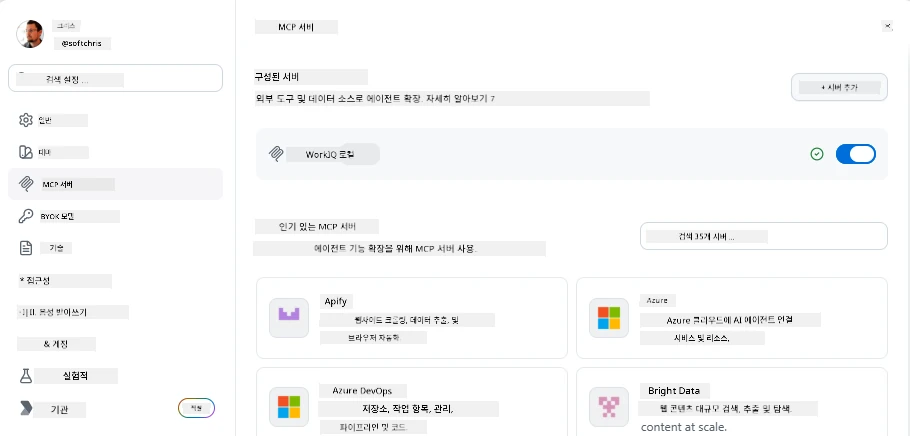
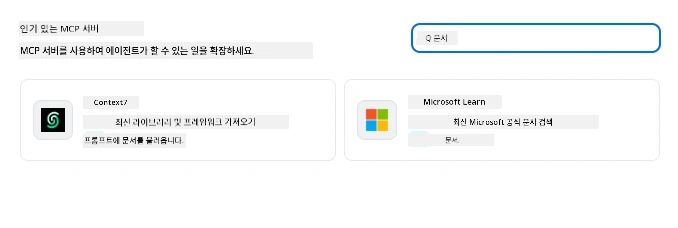
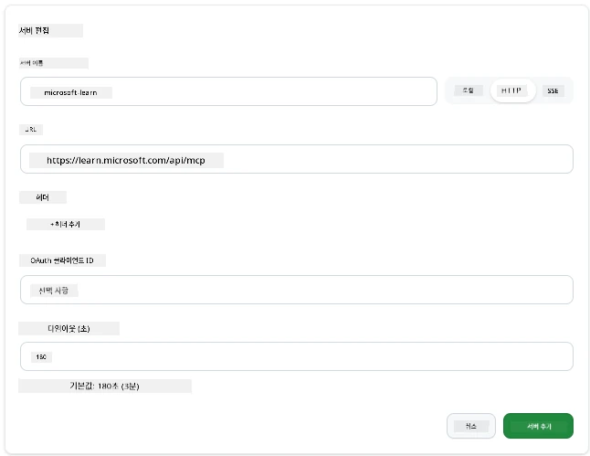
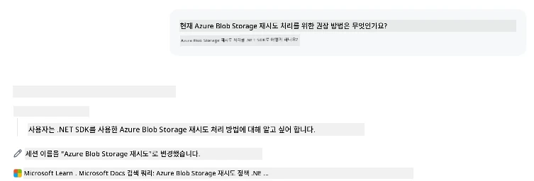
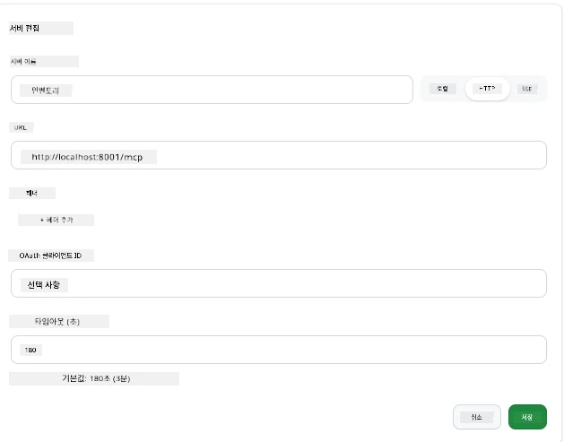
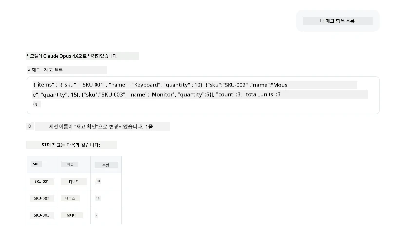
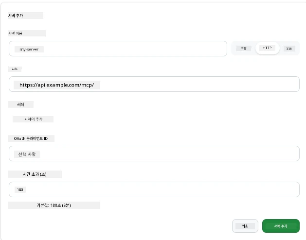
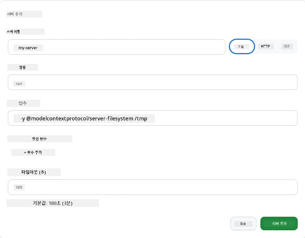

# GitHub Copilot 앱에서 MCP 서버 사용하기

지금쯤이면 MCP가 어떻게 작동하는지 아실 겁니다. 서버를 구축하고, 도구와 리소스를 정의하고, 클라이언트를 연결했습니다. 아직 해보지 않은 것은 관점을 바꾸는 것입니다: 서버를 만드는 쪽이 아니라, MCP를 지원하는 AI 기반 앱의 <em>소비</em> 측면에서는 어떤 모습일까요?

[GitHub Copilot App](https://github.com/github/app)은 MCP 서버를 사용할 수 있는 데스크탑 앱입니다. MCP 서버를 연결하면 한 단계 더 나아갑니다: Copilot이 여러분의 문서를 참조하고, 내부 API를 호출하고, 데이터베이스를 조회하거나, 서버로 래핑한 서비스와 대화할 수 있습니다. 앱이 호스트가 되고, MCP 서버가 도구가 됩니다.

이 강의는 MCP 설정 패널을 찾는 것부터 실제 문서 서버를 연결하고 사용자 정의 서버를 연결하는 경험을 처음부터 끝까지 안내합니다.

## 학습 목표

이 강의를 마치면 다음을 할 수 있습니다:

- Copilot 앱 설정에서 MCP 서버 패널을 찾고 탐색하기
- 호스팅된 문서 서버를 연결하여 세션에서 사용하기
- 사용자 정의 서버를 등록하고 Copilot이 도구를 호출할 수 있는지 확인하기
- 환경 변수 또는 맞춤 헤더(HTTP일 경우)를 제공하여 서버 호출 방법 구성하기

## MCP 호스트로서의 Copilot 앱

기본 아이디어는 다음과 같습니다: **Copilot의 에이전트는 똑똑하지만, 사용자가 알려준 것만 압니다.** 기본적으로 에이전트는 작업 공간의 파일을 읽고 터미널 명령을 실행할 수 있지만, 데이터베이스를 조회하거나 캘린더를 확인하거나 맞춤 API를 호출하려면 도움을 받아야 합니다. MCP 서버가 바로 그 다리 역할을 합니다. 이 서버들은 Copilot과 여러분의 시스템(데이터베이스, 버전 관리, API, 디자인 도구)을 연결하여 작업을 수행하는 데 필요한 정보 및 동작에 접근할 수 있도록 합니다.

먼저 앱에서 MCP 서버 관리를 위한 설정을 찾아봅시다.

## 1단계: MCP 설정 패널 찾기

Copilot 앱을 열고 왼쪽 아래에 있는 톱니바퀴 아이콘을 찾아 클릭하세요.


"MCP Servers"를 선택하면 이미 구성된 서버가 상단에, 인기 있는 서버 마켓플레이스가 하단에 보이고, 상단에 "Add Server" 버튼이 있을 것입니다:



여기가 제어 센터입니다. 서버를 추가, 제거, 활성화, 비활성화할 수 있습니다. 변경 사항은 새 세션에 적용되므로, 세션이 열려 있으면 설정 변경 후 새 세션을 시작해야 합니다.

## 2단계: 문서 서버 연결하기

즉시 유용한 작업부터 해봅시다. Microsoft Docs MCP 서버는 Copilot이 공식 Microsoft 문서에 접근할 수 있게 합니다. Azure, .NET, TypeScript 등을 포함합니다. 에이전트가 훈련 데이터(커트오프 날짜가 있음)에만 의존하지 않고, 쿼리 시점에 최신 문서를 가져올 수 있습니다.

설치 방법은 다음과 같습니다:

1. 인기 서버 그리드에서 <strong>learn</strong>을 입력하고 "Microsoft Learn" 서버를 선택하세요.

   

   클릭하면 이름, 전송 유형, URL이 미리 입력된 양식이 나타납니다. "Add Server"만 클릭하면 됩니다.

2. "Add Server"를 클릭하면 서버에 연결하는 데 몇 초가 걸립니다.

   

   추가하면 구성된 서버로 상단에 표시됩니다. 이제 사용해 봅시다.

3. 대화 상자를 닫고 Quick chat을 선택합니다.

4. 다음 프롬프트를 입력하여 Microsoft Learn 서버의 도구를 작동시켜 보세요.

   ```text
   What's the current recommended approach for handling Azure Blob Storage 
   retries using the .NET SDK?
   ```

   

방금 추가한 MCP 서버를 참조하는 모습을 볼 수 있습니다.

## 3단계: 사용자 정의 stdio 서버 연결하기

프리셋은 편리하지만 진짜 힘은 여러분의 서버를 연결하는 것입니다. 내부 API나 회사 지식 베이스를 노출하는 서버를 직접 만들었거나 제공받았다면, 여기에 연결할 수 있습니다. 이번에는 회사의 재고 관리 기능을 처리하는 MCP 서버를 연결해 봅시다.

1. 톱니바퀴 아이콘을 다시 클릭하고 "MCP servers"를 선택합니다.

2. "Add Server" 버튼을 클릭하고 "+ Add Custom server"를 선택한 후 다음 값을 입력하세요:

   - 이름: `Inventory Server`
   - 오른쪽에서 전송 방식으로 **http** 선택

   "Add Server"를 선택하면 구성된 서버 목록에 나타납니다.

   

4. 시험 삼아 다음과 같은 프롬프트를 실행해 보세요:

    ```
    list inventory
    ```

   

   사용자 정의 서버에서 재고 항목 목록이 반환되는 것을 볼 수 있습니다.

잘했습니다! 이제 외부 서버와 자신만의 MCP 서버를 Copilot 앱에 추가하는 방법을 잘 이해했을 것입니다. 다음으로 비밀과 환경 변수를 다루는 방법을 알아봅시다.

## 4단계: 고급 설정

지금까지 이름과 URL만 입력해 MCP 서버를 추가하는 방법을 보았습니다. 하지만 서버가 API 키나 다른 값을 필요로 한다면 어떻게 할까요? 전송 방식에 따라 필요한 값을 제공할 수 있습니다.

- **http 또는 SSE 전송**: 필요에 따라 헤더를 설정할 수 있습니다.

   인증의 경우 Authorization 헤더를 지정할 수 있습니다. 값은 고정 문자열일 수 있으며, OAuth를 사용하는 경우 OAuth 클라이언트 ID를 전달할 수 있습니다.

   

- **stdio 전송**: 환경 변수를 설정할 수 있습니다.

   서버 시작 시 전달할 필요 환경 변수를 원하는 만큼 지정할 수 있습니다.

   

## 요약

Copilot 앱은 MCP 서버를 에이전트 기능의 1급 확장으로 취급합니다. 이번 강의에서 MCP 서버 추가부터 세션 내 사용까지 전체 과정을 보았습니다. 이제 공개 서버, 내부 API, 맞춤 도구에 연결해 에이전트가 작업을 자율적으로 완료하는 데 필요한 정보와 동작에 접근할 수 있습니다.

## 📚 추가 자료

### 공식 문서

- [GitHub Copilot App](https://github.com/github/app)
- [MCP Specification](https://modelcontextprotocol.io/specification/2025-03-26) - 모델 컨텍스트 프로토콜 명세

### 커뮤니티
- [MCP Community Discord](https://discord.com/invite/ByRwuEEgH4) - 실시간 토론
- [GitHub Discussions](https://github.com/microsoft/MCP-Server-and-PostgreSQL-Sample-Retail/discussions) - 질문과 공유
- [Stack Overflow](https://stackoverflow.com/questions/tagged/model-context-protocol) - 기술 질문

---

<!-- CO-OP TRANSLATOR DISCLAIMER START -->
**면책 조항**:
이 문서는 AI 번역 서비스 [Co-op Translator](https://github.com/Azure/co-op-translator)를 사용하여 번역되었습니다. 정확성을 기하기 위해 노력하고 있으나, 자동 번역은 오류나 부정확한 부분이 있을 수 있음을 유의하시기 바랍니다. 원본 문서의 원어본이 권위 있는 자료로 간주되어야 합니다. 중요한 정보의 경우, 전문가의 인간 번역을 권장합니다. 이 번역 사용으로 인해 발생하는 오해나 잘못된 해석에 대해 당사는 책임을 지지 않습니다.
<!-- CO-OP TRANSLATOR DISCLAIMER END -->