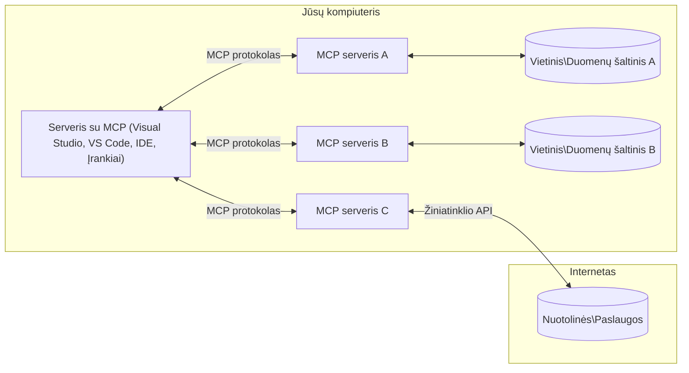

# MCP Pagrindinės Sąvokos: Mastering the Model Context Protocol AI Integracijai

[](https://youtu.be/earDzWGtE84)

_(Spustelėkite aukščiau esančią nuotrauką, kad peržiūrėtumėte šios pamokos video)_

[Model Context Protocol (MCP)](https://github.com/modelcontextprotocol) yra galingas, standartizuotas pagrindas, kuris optimizuoja komunikaciją tarp didelių kalbinių modelių (LLM) ir išorinių įrankių, programų bei duomenų šaltinių.  
Šis vadovas jus supažindins su MCP pagrindinėmis sąvokomis. Išmoksite apie jo klientų-serverių architektūrą, esmines sudedamąsias dalis, komunikacijos mechanizmus bei įgyvendinimo gerąsias praktikas.

- **Išankstinis vartotojo sutikimas**: Visi duomenų prieigos ir operacijos reikalauja aiškaus vartotojo patvirtinimo prieš vykdymą. Vartotojai turi aiškiai suprasti, kokie duomenys bus pasiekiami ir kokie veiksmai bus atliekami, su smulkia kontrole leidimų ir autorizacijų atžvilgiu.

- **Duomenų privatumo apsauga**: Vartotojo duomenys viešinami tik gavus išankstinį sutikimą ir privalo būti saugomi taikant stiprias prieigos kontrolės priemones viso sąveikos ciklo metu. Įgyvendinimas turi užkirsti kelią nesankcionuotam duomenų perdavimui ir išlaikyti griežtas privatumo ribas.

- **Įrankių vykdymo saugumas**: Kiekvienas įrankio kvietimas reikalauja aiškaus vartotojo sutikimo su supratimu apie įrankio funkcionalumą, parametrus ir galimą poveikį. Griežtos saugumo ribos turi užkirsti kelią nenorimam, nesaugiam ar kenksmingam įrankių vykdymui.

- **Transporto sluoksnio saugumas**: Visos komunikacijos kanalos turi naudoti tinkamas šifravimo ir autentifikacijos priemones. Nuotoliniai ryšiai turi būti įgyvendinami taikant saugius transporto protokolus ir tinkamą kredencialų valdymą.

#### Įgyvendinimo gaires:

- **Leidimų valdymas**: Įgyvendinkite smulkiai reguliuojamas leidimų sistemas, kurios leidžia vartotojams kontroliuoti prieigą prie serverių, įrankių ir šaltinių.
- **Autentifikacija ir autorizacija**: Naudokite saugius autentifikacijos metodus (OAuth, API raktus) su tinkamu žetonų valdymu ir galiojimo pabaiga.
- **Įvesties patikra**: Tikrinkite visus parametrus ir duomenų įvestis pagal apibrėžtus schemos formatus, siekiant užkirsti kelią užpildymo atakoms.
- **Auditavimo žurnalas**: Rinkite išsamius operacijų žurnalus saugumo stebėsenai ir atitikties palaikymui.

## Apžvalga

Ši pamoka nagrinėja pagrindinę Model Context Protocol (MCP) ekosistemos architektūrą ir sudedamąsias dalis. Sužinosite apie klientų-serverių architektūrą, svarbiausias sudedamąsias dalis ir komunikacijos mechanizmus, kurie užtikrina MCP sąveikas.

## Pagrindiniai mokymosi tikslai

Pamokos pabaigoje jūs:  

- Suprasite MCP klientų-serverių architektūrą.
- Atpažinsite šeimininkų, klientų ir serverių vaidmenis ir atsakomybę.
- Analizuosite pagrindines MCP lankstumo integracijos ypatybes.
- Išmoksite, kaip informacija cirkuliuoja MCP ekosistemoje.
- Įgysite praktinių žinių per .NET, Java, Python ir JavaScript kodo pavyzdžius.

## MCP Architektūra: Išsamiau

MCP ekosistema yra paremta klientų-serverių modeliu. Ši modulinė struktūra leidžia AI programoms efektyviai sąveikauti su įrankiais, duomenų bazėmis, API ir kontekstiniais ištekliais. Pažiūrėkime detaliau į šią architektūrą pagrindinėmis dalimis.

Iš esmės MCP naudoja klientų-serverių architektūrą, kurioje pagrindinė programa (šeimininkas) gali jungtis prie kelių serverių:  


- **MCP šeimininkai**: programos, tokios kaip VSCode, Claude Desktop, IDE ar AI įrankiai, norintys pasiekti duomenis per MCP
- **MCP klientai**: protokolo klientai, palaikantys 1:1 ryšius su serveriais
- **MCP serveriai**: lengvos programos, kiekviena iš jų per standartizuotą Model Context Protocol pateikia konkrečias galimybes
- **Vietinės duomenų bazės**: jūsų kompiuterio failai, duomenų bazės ir paslaugos, prie kurių MCP serveriai gali saugiai prisijungti
- **Nuotolinės paslaugos**: išorinės sistemos, pasiekiamos internetu, prie kurių MCP serveriai gali prisijungti per API.

MCP protokolas nuolat tobulėja ir naudoja datomis pagrįstą versijavimą (formatu YYYY-MM-DD). Dabartinė protokolo versija yra **2025-11-25**. Naujausias [protokolo specifikacijos](https://modelcontextprotocol.io/specification/2025-11-25/) atnaujinimas yra pasiekiamas internete.

### 1. Šeimininkai

Model Context Protocol (MCP) kontekste **šeimininkai** yra AI programos, kurios veikia kaip pagrindinė sąsaja, per kurią vartotojai sąveikauja su protokolu. Šeimininkai koordinuoja ir valdo ryšius su keliais MCP serveriais, kurdami atskirus MCP klientus kiekvienam serverio ryšiui. Šeimininko pavyzdžiai:

- **AI programos**: Claude Desktop, Visual Studio Code, Claude Code  
- **Kūrimo aplinkos**: IDE ir kodų redaktoriai su MCP integracija  
- **Individualios programos**: specialiai kuriami AI agentai ir įrankiai  

**Šeimininkai** yra programos, koordinuojančios AI modelių sąveiką. Jie:  

- **Orkestra AI modelius**: atlieka arba sąveikauja su LLM generuojant atsakymus ir koordinuojant AI darbo eigą  
- **Valdo klientų ryšius**: kuria ir palaiko po vieną MCP klientą kiekvienam MCP serverio ryšiui  
- **Valdo vartotojo sąsają**: tvarko pokalbių eigą, vartotojų sąveikas ir atsakymų rodymą  
- **Užtikrina saugumą**: kontroliuoja leidimus, saugumo apribojimus ir autentifikaciją  
- **Tvarko vartotojo sutikimą**: valdo vartotojo patvirtinimus dėl duomenų dalijimosi ir įrankių vykdymo  

### 2. Klientai

**Klientai** yra esminės sudedamosios dalys, palaikančios specializuotus vienas prie vieno ryšius tarp šeimininkų ir MCP serverių. Kiekvienas MCP klientas yra sukuriamas šeimininko ir jungiasi prie konkretaus MCP serverio, užtikrindamas organizuotą ir saugią komunikaciją. Keli klientai leidžia šeimininkams vienu metu jungtis prie kelių serverių.

**Klientai** yra jungties komponentai šeimininko programoje. Jie:  

- **Vykdo protokolo komunikaciją**: siunčia JSON-RPC 2.0 užklausas serveriams su užklausomis ir instrukcijomis  
- **Derybos dėl galimybių**: derybų metu su serveriais nustato palaikomas funkcijas ir protokolo versijas  
- **Įrankių vykdymas**: tvarko įrankių vykdymo užklausas iš modelių ir apdoroja atsakymus  
- **Realauju atnaujinimai**: apdoroja pranešimus ir realaus laiko atnaujinimus iš serverių  
- **Atsakymų apdorojimas**: apdoroja ir formatuoja serverių atsakymus, skirtus vartotojams rodyti  

### 3. Serveriai

**Serveriai** yra programos, teikiančios kontekstą, įrankius ir funkcionalumą MCP klientams. Jie gali veikti vietoje (tokioje pačioje mašinoje kaip šeimininkas) arba nuotoliniu būdu (išorinėse platformose) ir atsakingi už klientų užklausų apdorojimą bei struktūruotų atsakymų pateikimą. Serveriai atskleidžia specifinį funkcionalumą per standardizuotą Model Context Protocol.

**Serveriai** yra paslaugos, teikiančios kontekstą ir galimybes. Jie:  

- **Registruoja funkcijas**: registruoja ir pateikia klientams prieinamus primityvus (išteklius, užklausas, įrankius)  
- **Užklausų apdorojimas**: gauna ir vykdo įrankių kvietimus, išteklių užklausas ir užklausas dėl užklausų iš klientų  
- **Teikia kontekstą**: suteikia kontekstinę informaciją ir duomenis, gerinančius modelio atsakymus  
- **Valdo būseną**: palaiko sesijos būseną ir tvarko būsenos priklausomas sąveikas, kai reikia  
- **Realiojo laiko pranešimai**: siunčia pranešimus apie galimybių pasikeitimus ir atnaujinimus prisijungusiems klientams  

Serverius gali kurti bet kas, siekiant išplėsti modelio funkcionalumą specializuota funkcija, ir jie palaiko tiek vietinę, tiek nuotolinę diegimo aplinką.  

### 4. Serverio primityvai

Model Context Protocol (MCP) serveriai teikia tris pagrindinius **primityvus**, kurie apibrėžia pagrindinius elementus turtingoms sąveikoms tarp klientų, šeimininkų ir kalbinių modelių. Šie primityvai nurodo kontekstinės informacijos ir veiksmų tipus, prieinamus per protokolą.

MCP serveriai gali atskleisti bet kokį kombinaciją iš šių trijų pagrindinių primityvų:

#### Ištekliai  

**Ištekliai** yra duomenų šaltiniai, kurie suteikia kontekstinę informaciją AI programoms. Jie reprezentuoja statinį arba dinaminį turinį, kuris suteikia galimybę modeliams geriau suprasti situaciją ir priimti sprendimus:

- **Kontekstiniai duomenys**: struktūruota informacija ir kontekstas AI modeliui  
- **Žinių bazės**: dokumentų kaupimai, straipsniai, vadovėliai ir moksliniai darbai  
- **Vietiniai duomenų šaltiniai**: failai, duomenų bazės ir vietinės sistemos informacija  
- **Išoriniai duomenys**: API atsakymai, žiniatinklio paslaugos ir nuotolinės sistemos duomenys  
- **Dinaminis turinys**: realaus laiko duomenys, keičiantys būseną pagal išorines aplinkybes  

Ištekliai identifikuojami per URI ir palaiko atradimą per `resources/list` bei gavimą per `resources/read` metodus:  

```text
file://documents/project-spec.md
database://production/users/schema
api://weather/current
```
  
#### Užklausos (Prompts)

**Užklausos** yra pakartotinai naudojami šablonai, kurie padeda struktūrizuoti kalbinių modelių sąveikas. Jos teikia standartizuotus sąveikos scenarijus ir šablonines darbo eigas:

- **Šabloninė sąveika**: iš anksto struktūruotos žinutės ir pokalbio pradžios frazės  
- **Darbo eigos šablonai**: standartizuotos sekos dažnoms užduotims ir sąveikoms  
- **Pavyzdžių šablonai**: instrukcijos modeliams, paremtos pavyzdžiais  
- **Sistemos užklausos**: pagrindinės užklausos, apibrėžiančios modelio elgesį ir kontekstą  
- **Dinaminiai šablonai**: parametrizuotos užklausos, adaptuojamos pagal konkretų kontekstą  

Užklausos palaiko kintamųjų pakeitimus ir gali būti randamos per `prompts/list` bei gaunamos per `prompts/get`:  

```markdown
Generate a {{task_type}} for {{product}} targeting {{audience}} with the following requirements: {{requirements}}
```
  
#### Įrankiai

**Įrankiai** yra vykdomos funkcijos, kurias AI modeliai gali iškviesti atlikti konkrečius veiksmus. Jie yra MCP ekosistemos "veiksmažodžiai", leidžiantys modeliams sąveikauti su išorinėmis sistemomis:

- **Vykdomos funkcijos**: atskiros operacijos, kurias modeliai gali iškviesti su konkrečiais parametrais  
- **Išorinės sistemos integracija**: API kvietimai, duomenų užklausos, failių operacijos, skaičiavimai  
- **Unikali tapatybė**: kiekvienas įrankis turi atskirą pavadinimą, aprašymą ir parametrų schemą  
- **Struktūruotas įvesties/išvesties formatas**: įrankiai priima patikrintus parametrus ir grąžina struktūruotus, tipizuotus atsakymus  
- **Veiksmų galimybės**: leidžia modeliams atlikti realaus pasaulio veiksmus ir gauti gyvus duomenis  

Įrankiai apibrėžiami naudojant JSON Schema parametrų validavimui ir randami per `tools/list`, vykdomi per `tools/call`. Įrankiai taip pat gali turėti **ikonas** kaip papildomą metaduomenį geresniam vartotojo sąsajos pateikimui.

**Įrankių anotacijos**: Įrankiai palaiko elgsenos anotacijas (pvz., `readOnlyHint`, `destructiveHint`), kurios nurodo, ar įrankis yra tik skaitomas ar destruktyvus, padedančios klientams pagrįstai spręsti dėl įrankio vykdymo.

Pavyzdinė įrankio aprašymo dalis:  

```typescript
server.tool(
  "search_products", 
  {
    query: z.string().describe("Search query for products"),
    category: z.string().optional().describe("Product category filter"),
    max_results: z.number().default(10).describe("Maximum results to return")
  }, 
  async (params) => {
    // Vykdyti paiešką ir grąžinti struktūruotus rezultatus
    return await productService.search(params);
  }
);
```
  
## Klientų primityvai

Model Context Protocol (MCP) kontekste **klientai** gali atskleisti primityvus, leidžiančius serveriams prašyti papildomų galimybių iš šeimininko programos. Šie klientų pusės primityvai leidžia turtingesnes ir interaktyvesnes serverių įgyvendinimo galimybes, kurios gali naudotis AI modelių galimybėmis ir vartotojo sąveikomis.

### Pavyzdžių generavimas (Sampling)

**Pavyzdžių generavimas** leidžia serveriams paprašyti kalbinių modelių papildymų iš kliento AI programos. Šis primityvas leidžia serveriams naudotis LLM galimybėmis neįtraukiant savo modelio priklausomybių:

- **Modelio nepriklausomas prieinamumas**: serveriai gali paprašyti papildymų be LLM SDK įtraukimo ar modelio prieigos valdymo  
- **Serverio iniciatyva AI**: leidžia serveriams savarankiškai generuoti turinį naudojant kliento AI modelį  
- **Rekursyvios LLM sąveikos**: palaiko sudėtingas situacijas, kai serveriai prašo AI pagalbos apdorojimui  
- **Dinamiškas turinio generavimas**: leidžia serveriams kurti kontekstinius atsakymus naudojant šeimininko modelį  
- **Įrankių kvietimo palaikymas**: serveriai gali įtraukti `tools` ir `toolChoice` parametrus, kad kliento modelis galėtų vykdyti įrankius generavimo metu  

Pavyzdžių generavimas inicijuojamas per `sampling/complete` metodą, kai serveriai siunčia užklausas klientams.

### Šaknys (Roots)

**Šaknys** suteikia standartizuotą metodą klientams atskleisti failų sistemos ribas serveriams, padedant serveriams suprasti, prie kurių katalogų ir failų jie turi prieigą:

- **Failų sistemos ribos**: apibrėžia ribas, kur serveriai gali veikti failų sistemoje  
- **Prieigos kontrolė**: padeda serveriams suprasti, prie kurių katalogų ir failų leidžiama prieiti  
- **Dinamiški atnaujinimai**: klientai gali pranešti serveriams apie šaknų sąrašo pasikeitimą  
- **URI identifikacija**: šaknys identifikuojamos naudojant `file://` URI adresus  

Šaknys randamos per `roots/list` metodą, klientai siunčia pranešimus `notifications/roots/list_changed` keičiant šaknis.

### Informacijos surinkimas (Elicitation)

**Informacijos surinkimas** leidžia serveriams per kliento sąsają prašyti papildomos informacijos ar patvirtinimo iš vartotojų:

- **Vartotojo įvesties užklausos**: serveriai gali prašyti papildomos informacijos, reikalingos įrankio vykdymui  
- **Patvirtinimo dialogai**: prašo vartotojo patvirtinimo jautriems ar svarbiems veiksmams  
- **Interaktyvios darbo eigos**: leidžia serveriams organizuoti etapines vartotojo sąveikas  
- **Dinaminis parametrų surinkimas**: renka trūkstamus ar pasirenkamus parametrus įrankio vykdymo metu  

Informacijos surinkimo užklausos siunčiamos naudojant `elicitation/request` metodą, kad būtų surinkta vartotojo įvestis per kliento sąsają.  

**URL režimo informacijos surinkimas**: serveriai taip pat gali prašyti vartotojo sąveikų per URL, nukreipdami vartotojus į išorines svetaines autentifikacijai, patvirtinimui arba duomenų įvedimui.

### Žurnalas (Logging)

**Žurnalas** leidžia serveriams siųsti struktūruotus žurnalų pranešimus klientams derinimui, stebėsenai ir veiklos skaidrumui:

- **Derinimo palaikymas**: leidžia serveriams pateikti detalius vykdymo žurnalus problemų sprendimui  
- **Veiklos stebėjimas**: siunčia būseno atnaujinimus ir našumo metrikas klientams  
- **Klaidų ataskaitos**: suteikia išsamią klaidų kontekstą ir diagnostinę informaciją  
- **Audito takai**: kuria išsamius serverio operacijų ir sprendimų žurnalus  

Žurnalo pranešimai siunčiami klientams, siekiant suteikti skaidrumą serverio veikloje ir palengvinti derinimą.

## Informacijos srautas MCP

Model Context Protocol (MCP) apibrėžia struktūruotą informacijos srautą tarp šeimininkų, klientų, serverių ir modelių. Šio srauto supratimas padeda paaiškinti, kaip apdorojami vartotojo užklausimai ir kaip išoriniai įrankiai bei duomenys integruojami į modelių atsakymus.
- **Serveris inicijuoja ryšį**  
  Host programėlė (pvz., IDE arba pokalbių sąsaja) užmezga ryšį su MCP serveriu, paprastai per STDIO, WebSocket arba kitą palaikomą transportą.

- **Galimybių derybos**  
  Klientas (įterptas į hostą) ir serveris keičiasi informacija apie palaikomas funkcijas, įrankius, išteklius ir protokolo versijas. Tai užtikrina, kad abi pusės supranta, kokios galimybės yra prieinamos sesijos metu.

- **Vartotojo užklausa**  
  Vartotojas sąveikauja su hostu (pvz., įveda užklausą arba komandą). Hostas surenka šį įvedimą ir perduoda klientui apdorojimui.

- **Ištekliaus arba įrankio naudojimas**  
  - Klientas gali prašyti papildomo konteksto arba išteklių iš serverio (pvz., failų, duomenų bazės įrašų ar žinių bazės straipsnių), kad pagerintų modelio supratimą.  
  - Jei modelis nustato, kad reikia įrankio (pvz., gauti duomenis, atlikti skaičiavimą ar iškviesti API), klientas siunčia serveriui prašymą įrankio iškvėrimui, nurodydamas įrankio pavadinimą ir parametrus.

- **Serverio vykdymas**  
  Serveris gauna išteklių arba įrankio užklausą, atlieka reikalingas operacijas (pvz., vykdo funkciją, užklausia duomenų bazę ar gauna failą) ir grąžina rezultatus klientui struktūruotame formate.

- **Atsakymo generavimas**  
  Klientas integruoja serverio atsakymus (išteklių duomenis, įrankių išvestis ir pan.) į tęstinę modelio sąveiką. Modelis naudoja šią informaciją, kad sugeneruotų išsamų ir kontekstą atitinkantį atsakymą.

- **Rezultato pateikimas**  
  Hostas gauna galutinį išvestį iš kliento ir pateikia ją vartotojui, dažnai įtraukiant tiek modelio sugeneruotą tekstą, tiek bet kokius įrankių vykdymo ar išteklių paieškos rezultatus.

Šis srautas leidžia MCP palaikyti pažangias, interaktyvias ir kontekstą atitinkančias DI programas, sklandžiai sujungiant modelius su išoriniais įrankiais ir duomenų šaltiniais.

## Protokolo architektūra ir sluoksniai

MCP susideda iš dviejų skirtingų architektūrinių sluoksnių, kurie veikia kartu, kad suteiktų pilną komunikacijos sistemą:

### Duomenų sluoksnis

**Duomenų sluoksnis** įgyvendina pagrindinį MCP protokolą, naudodamas **JSON-RPC 2.0** kaip pagrindą. Šis sluoksnis apibrėžia žinučių struktūrą, semantiką ir sąveikos modelius:

#### Pagrindinės sudedamosios dalys:

- **JSON-RPC 2.0 protokolas**: Visa komunikacija vyksta pagal standartizuotą JSON-RPC 2.0 žinutės formatą metodų iškvietimams, atsakymams ir pranešimams
- **Gyvavimo ciklo valdymas**: Valdo ryšio inicializavimą, galimybių derybas ir sesijos užbaigimą tarp klientų ir serverių  
- **Serverio primityvai**: Leidžia serveriams teikti pagrindines funkcijas per įrankius, išteklius ir užklausas  
- **Kliento primityvai**: Leidžia serveriams prašyti LLM pavyzdžių, vartotojo įvedimo ir siųsti logų žinutes  
- **Realaus laiko pranešimai**: Palaiko asinchroninius pranešimus dinamiškiems atnaujinimams be nuolatinio tikrinimo  

#### Pagrindinės savybės:

- **Protokolo versijos derybos**: Naudoja datos pagrindu grindžiamą versijavimą (YYYY-MM-DD), kad užtikrintų suderinamumą  
- **Galimybių atradimas**: Klientai ir serveriai keičiasi palaikomų funkcijų informacija inicializacijos metu  
- **Būsena pagrįstos sesijos**: Išlaiko ryšio būseną per keletą sąveikų, kad užtikrintų konteksto nuoseklumą  

### Transporto sluoksnis

**Transporto sluoksnis** valdo komunikacijos kanalus, žinučių įrėminimą ir autentifikaciją tarp MCP dalyvių:

#### Palaikomi transporto mechanizmai:

1. **STDIO transportas**:  
   - Naudoja standartinius įvesties/išvesties srautus tiesioginiam procesų bendravimui  
   - Optimalus vietiniams procesams tame pačiame įrenginyje be tinklo pertekliaus  
   - Dažnai naudojamas vietinėse MCP serverių įgyvendinimuose  

2. **Streamable HTTP transportas**:  
   - Naudoja HTTP POST klientų-serverių žinutėms  
   - Pasirenkami Server-Sent Events (SSE) serverio-kliento transliacijai  
   - Leidžia nuotolinį serverio bendravimą per tinklus  
   - Palaiko standartinę HTTP autentifikaciją (bearer žetonus, API raktus, pasirinktinius antraštes)  
   - MCP rekomenduoja OAuth saugiai autentifikacijai naudojant žetonus  

#### Transporto abstrakcija:

Transporto sluoksnis atskiria komunikacijos detales nuo duomenų sluoksnio, leidžiant naudoti tą patį JSON-RPC 2.0 žinučių formatą per visus transporto mechanizmus. Ši abstrakcija leidžia programoms sklandžiai pereiti tarp vietinių ir nuotolinių serverių.

### Saugumo aspektai

MCP įgyvendinimai privalo laikytis kelių svarbių saugumo principų, kad užtikrintų saugias, patikimas ir apsaugotas sąveikas per visus protokolo veiksmus:

- **Vartotojo sutikimas ir kontrolė**: Vartotojai privalo aiškiai sutikti prieš bet kokiu duomenų pasiekimu ar veiksmų vykdymu. Jie turi turėti aiškią kontrolę, kokie duomenys dalijami ir kurie veiksmai autorizuoti, remiantis intuityviomis vartotojo sąsajomis veikloms peržiūrėti ir patvirtinti.

- **Duomenų privatumas**: Vartotojų duomenys turi būti atskleisti tik gavus aiškų sutikimą ir apsaugoti tinkamomis prieigos teisėmis. MCP įgyvendinimai turi apsaugoti nuo neautorizuoto duomenų perdavimo ir užtikrinti privatumo laikymąsi per visas sąveikas.

- **Įrankių saugumas**: Prieš kviečiant bet kurį įrankį, reikalingas aiškus vartotojo sutikimas. Vartotojai turi aiškiai suprasti kiekvieno įrankio funkcionalumą, o solidžios saugumo ribos privalo būti įgyvendintos, kad būtų išvengta neplanuotų ar nesaugių įrankių vykdymų.

Laikantis šių saugumo principų MCP užtikrina vartotojų pasitikėjimą, privatumą ir saugumą per visus protokolo veiksmus, tuo pačiu leidžiant galingas DI integracijas.

## Kodo pavyzdžiai: svarbios sudedamosios dalys

Toliau pateikti kelių populiarių programavimo kalbų pavyzdžiai, iliustruojantys, kaip įgyvendinti pagrindines MCP serverio sudedamąsias dalis ir įrankius.

### .NET pavyzdys: paprasto MCP serverio kūrimas su įrankiais

Čia pateiktas praktinis .NET kodo pavyzdys, demonstruojantis, kaip įgyvendinti paprastą MCP serverį su pasirinktinais įrankiais. Šis pavyzdys parodo, kaip apibrėžti ir registruoti įrankius, tvarkyti užklausas ir prisijungti prie serverio naudojant Model Context Protocol.

```csharp
using System;
using System.Threading.Tasks;
using ModelContextProtocol.Server;
using ModelContextProtocol.Server.Transport;
using ModelContextProtocol.Server.Tools;

public class WeatherServer
{
    public static async Task Main(string[] args)
    {
        // Create an MCP server
        var server = new McpServer(
            name: "Weather MCP Server",
            version: "1.0.0"
        );
        
        // Register our custom weather tool
        server.AddTool<string, WeatherData>("weatherTool", 
            description: "Gets current weather for a location",
            execute: async (location) => {
                // Call weather API (simplified)
                var weatherData = await GetWeatherDataAsync(location);
                return weatherData;
            });
        
        // Connect the server using stdio transport
        var transport = new StdioServerTransport();
        await server.ConnectAsync(transport);
        
        Console.WriteLine("Weather MCP Server started");
        
        // Keep the server running until process is terminated
        await Task.Delay(-1);
    }
    
    private static async Task<WeatherData> GetWeatherDataAsync(string location)
    {
        // This would normally call a weather API
        // Simplified for demonstration
        await Task.Delay(100); // Simulate API call
        return new WeatherData { 
            Temperature = 72.5,
            Conditions = "Sunny",
            Location = location
        };
    }
}

public class WeatherData
{
    public double Temperature { get; set; }
    public string Conditions { get; set; }
    public string Location { get; set; }
}
```

### Java pavyzdys: MCP serverio komponentai

Šis pavyzdys demonstruoja tą patį MCP serverio ir įrankių registravimą kaip anksčiau pateiktame .NET pavyzdyje, tačiau įgyvendintą Java kalba.

```java
import io.modelcontextprotocol.server.McpServer;
import io.modelcontextprotocol.server.McpToolDefinition;
import io.modelcontextprotocol.server.transport.StdioServerTransport;
import io.modelcontextprotocol.server.tool.ToolExecutionContext;
import io.modelcontextprotocol.server.tool.ToolResponse;

public class WeatherMcpServer {
    public static void main(String[] args) throws Exception {
        // Sukurkite MCP serverį
        McpServer server = McpServer.builder()
            .name("Weather MCP Server")
            .version("1.0.0")
            .build();
            
        // Užregistruokite oro sąlygų įrankį
        server.registerTool(McpToolDefinition.builder("weatherTool")
            .description("Gets current weather for a location")
            .parameter("location", String.class)
            .execute((ToolExecutionContext ctx) -> {
                String location = ctx.getParameter("location", String.class);
                
                // Gaukite oro sąlygų duomenis (supaprastinta)
                WeatherData data = getWeatherData(location);
                
                // Grąžinkite suformatuotą atsakymą
                return ToolResponse.content(
                    String.format("Temperature: %.1f°F, Conditions: %s, Location: %s", 
                    data.getTemperature(), 
                    data.getConditions(), 
                    data.getLocation())
                );
            })
            .build());
        
        // Prisijunkite prie serverio naudodami stdio transportą
        try (StdioServerTransport transport = new StdioServerTransport()) {
            server.connect(transport);
            System.out.println("Weather MCP Server started");
            // Laikykite serverį veikiančią tol, kol procesas bus nutrauktas
            Thread.currentThread().join();
        }
    }
    
    private static WeatherData getWeatherData(String location) {
        // Realizacijoje būtų kviečiama oro sąlygų API
        // Supaprastinta pavyzdžio tikslams
        return new WeatherData(72.5, "Sunny", location);
    }
}

class WeatherData {
    private double temperature;
    private String conditions;
    private String location;
    
    public WeatherData(double temperature, String conditions, String location) {
        this.temperature = temperature;
        this.conditions = conditions;
        this.location = location;
    }
    
    public double getTemperature() {
        return temperature;
    }
    
    public String getConditions() {
        return conditions;
    }
    
    public String getLocation() {
        return location;
    }
}
```

### Python pavyzdys: MCP serverio kūrimas

Šis pavyzdys naudoja fastmcp, todėl įsitikinkite, kad jį įdiegėte:

```python
pip install fastmcp
```
Kodo pavyzdys:

```python
#!/usr/bin/env python3
import asyncio
from fastmcp import FastMCP
from fastmcp.transports.stdio import serve_stdio

# Sukurkite FastMCP serverį
mcp = FastMCP(
    name="Weather MCP Server",
    version="1.0.0"
)

@mcp.tool()
def get_weather(location: str) -> dict:
    """Gets current weather for a location."""
    return {
        "temperature": 72.5,
        "conditions": "Sunny",
        "location": location
    }

# Alternatyvus požiūris naudojant klasę
class WeatherTools:
    @mcp.tool()
    def forecast(self, location: str, days: int = 1) -> dict:
        """Gets weather forecast for a location for the specified number of days."""
        return {
            "location": location,
            "forecast": [
                {"day": i+1, "temperature": 70 + i, "conditions": "Partly Cloudy"}
                for i in range(days)
            ]
        }

# Užregistruokite klasės įrankius
weather_tools = WeatherTools()

# Paleiskite serverį
if __name__ == "__main__":
    asyncio.run(serve_stdio(mcp))
```

### JavaScript pavyzdys: MCP serverio kūrimas

Šis pavyzdys rodo MCP serverio kūrimą JavaScript kalba ir kaip užregistruoti du su oru susijusius įrankius.

```javascript
// Naudojant oficialų Model Context Protocol SDK
import { McpServer } from "@modelcontextprotocol/sdk/server/mcp.js";
import { StdioServerTransport } from "@modelcontextprotocol/sdk/server/stdio.js";
import { z } from "zod"; // Parametrų patikrinimui

// Sukurti MCP serverį
const server = new McpServer({
  name: "Weather MCP Server",
  version: "1.0.0"
});

// Apibrėžti oro sąlygų įrankį
server.tool(
  "weatherTool",
  {
    location: z.string().describe("The location to get weather for")
  },
  async ({ location }) => {
    // Paprastai tai būtų kvietimas į oro sąlygų API
    // Supaprastinta demonstracijai
    const weatherData = await getWeatherData(location);
    
    return {
      content: [
        { 
          type: "text", 
          text: `Temperature: ${weatherData.temperature}°F, Conditions: ${weatherData.conditions}, Location: ${weatherData.location}` 
        }
      ]
    };
  }
);

// Apibrėžti prognozavimo įrankį
server.tool(
  "forecastTool",
  {
    location: z.string(),
    days: z.number().default(3).describe("Number of days for forecast")
  },
  async ({ location, days }) => {
    // Paprastai tai būtų kvietimas į oro sąlygų API
    // Supaprastinta demonstracijai
    const forecast = await getForecastData(location, days);
    
    return {
      content: [
        { 
          type: "text", 
          text: `${days}-day forecast for ${location}: ${JSON.stringify(forecast)}` 
        }
      ]
    };
  }
);

// Pagalbinės funkcijos
async function getWeatherData(location) {
  // Simuliuoti API kvietimą
  return {
    temperature: 72.5,
    conditions: "Sunny",
    location: location
  };
}

async function getForecastData(location, days) {
  // Simuliuoti API kvietimą
  return Array.from({ length: days }, (_, i) => ({
    day: i + 1,
    temperature: 70 + Math.floor(Math.random() * 10),
    conditions: i % 2 === 0 ? "Sunny" : "Partly Cloudy"
  }));
}

// Prijungti serverį naudojant stdio transportą
const transport = new StdioServerTransport();
server.connect(transport).catch(console.error);

console.log("Weather MCP Server started");
```

Šis JavaScript pavyzdys demonstruoja, kaip sukurti MCP serverį naudojant Model Context Protocol SDK. Jame parodyta, kaip užregistruoti du įrankius `weatherTool` ir `forecastTool` ir padaryti juos prieinamus MCP klientams per `StdioServerTransport`.

## Saugumas ir autorizacija

MCP apima kelias įdiegtas sąvokas ir mechanizmus saugumui ir autorizacijai valdyti viso protokolo metu:

1. **Įrankių leidimų valdymas**:  
   Klientai gali nurodyti, kuriuos įrankius modelis gali naudoti sesijos metu. Tai užtikrina, kad pasiekiami tik aiškiai autorizuoti įrankiai, sumažinant netyčinių ar nesaugių veiksmų riziką. Leidimai gali būti dinamiškai konfigūruojami remiantis vartotojų pageidavimais, organizacijų politika ar sąveikos kontekstu.

2. **Autentifikacija**:  
   Serveriai gali reikalauti autentifikacijos prieš suteikdami prieigą prie įrankių, išteklių ar jautrių veiksmų. Tai gali apimti API raktus, OAuth žetonus arba kitus autentifikacijos mechanizmus. Tinkama autentifikacija užtikrina, kad tik patikimi klientai ir vartotojai gali iškviesti serverio galimybes.

3. **Patikra**:  
   Visiems įrankių iškvietimams taikoma parametrų patikra. Kiekvienas įrankis apibrėžia laukiamus tipų, formatų ir apribojimų parametrus, o serveris atitinkamai tikrina gaunamas užklausas. Tai užkerta kelią netinkamam arba kenksmingam įvesties pateikimui į įrankių įgyvendinimus ir padeda išlaikyti operacijų integralumą.

4. **Ribojimas pagal dažnumą**:  
   Siekiant išvengti piktnaudžiavimo ir užtikrinti teisingą serverio išteklių naudojimą, MCP serveriai gali įgyvendinti iškvietimų ir išteklių prieigos ribojimus pagal dažnumą. Ribojimai gali būti taikomi pagal vartotoją, sesiją arba globaliai ir padeda apsaugoti nuo paslaugų atsisakymo atakų ar pernelyg didelio išteklių naudojimo.

Derinant šiuos mechanizmus, MCP suteikia saugią platformą kalbų modelių integracijai su išoriniais įrankiais ir duomenų šaltiniais, suteikiant naudotojams ir kūrėjams smulkų prieigos ir naudojimo valdymą.

## Protokolo žinutės ir komunikacijos srautas

MCP komunikacija naudoja struktūrizuotas **JSON-RPC 2.0** žinutes, kad palengvintų aiškias ir patikimas sąveikas tarp hostų, klientų ir serverių. Protokolas apibrėžia specifinius žinučių modelius skirtingų operacijų tipams:

### Pagrindiniai žinučių tipai:

#### **Inicializavimo žinutės**  
- **`initialize` užklausa**: Užmezga ryšį ir derasi dėl protokolo versijos bei galimybių  
- **`initialize` atsakymas**: Patvirtina palaikomas funkcijas ir serverio informaciją  
- **`notifications/initialized`**: Signalizuoja, kad inicializavimas baigtas ir sesija pasiruošusi  

#### **Atrankos žinutės**  
- **`tools/list` užklausa**: Ieško serverio turimų įrankių  
- **`resources/list` užklausa**: Nurodo prieinamus išteklius (duomenų šaltinius)  
- **`prompts/list` užklausa**: Gauna prieinamus užklausų šablonus  

#### **Vykdymo žinutės**  
- **`tools/call` užklausa**: Vykdo konkretų įrankį su pateiktais parametrais  
- **`resources/read` užklausa**: Gauna turinį iš konkretaus išteklių  
- **`prompts/get` užklausa**: Pasiekia užklausos šabloną su pasirinktiniais parametrais  

#### **Kliento pusės žinutės**  
- **`sampling/complete` užklausa**: Serveris prašo LLM baigiamojo rezultato iš kliento  
- **`elicitation/request`**: Serveris prašo vartotojo įvesties per kliento sąsają  
- **Logų žinutės**: Serveris siunčia struktūruotas logų žinutes klientui  

#### **Pranešimų žinutės**  
- **`notifications/tools/list_changed`**: Serveris praneša klientui apie įrankių pakeitimus  
- **`notifications/resources/list_changed`**: Serveris praneša klientui apie išteklių pakeitimus  
- **`notifications/prompts/list_changed`**: Serveris praneša klientui apie užklausų pakeitimus  

### Žinučių struktūra:

Visos MCP žinutės atitinka JSON-RPC 2.0 formatą su:  
- **Užklausų žinutėmis**: Turi `id`, `method` ir pasirinktinus `params`  
- **Atsakymų žinutėmis**: Turi `id` ir arba `result`, arba `error`  
- **Pranešimų žinutėmis**: Turi `method` ir pasirinktinus `params` (be `id` arba atsakymo)

Ši struktūruota komunikacija užtikrina patikimą, sekamą ir išplėstinę sąveiką, palaikydama pažangias scenarijas kaip realaus laiko atnaujinimai, įrankių grandinimas ir tvirta klaidų valdymas.

### Užduotys (eksperimentinės)

**Užduotys** yra eksperimentinė funkcija, suteikianti patvarias vykdymo apvalkales, leidžiančias atidėtiną rezultatų gavimą ir būsenos stebėjimą MCP užklausoms:

- **Ilgalaikės operacijos**: Stebėti sudėtingus skaičiavimus, darbo eigų automatizavimą ir masinį apdorojimą  
- **Atidėti rezultatai**: Tikrinti užduoties būseną ir gauti rezultatus po operacijų užbaigimo  
- **Būsenos sekimas**: Stebėti užduoties eigą per apibrėžtas gyvavimo ciklo būsenas  
- **Daugiapakopės operacijos**: Palaikyti sudėtingas darbo eigas, apimančias kelias sąveikas  

Užduotys supakuoja standartines MCP užklausas, kad leistų asinchroninius vykdymo modelius operacijoms, kurios negali būti atliktos iš karto.

## Pagrindinės išvados

- **Architektūra**: MCP naudoja klientų-serverių architektūrą, kur hostai valdo kelis klientų prisijungimus prie serverių  
- **Dalyviai**: Ekosistemoje yra hostai (DI programėlės), klientai (protokolo jungtys) ir serveriai (galimybių tiekėjai)  
- **Transporto mechanizmai**: Komunikacija palaiko STDIO (vietinę) ir srautinį HTTP su pasirenkamais SSE (nuotolinė)  
- **Pagrindiniai primityvai**: Serveriai atskleidžia įrankius (vykdomas funkcijas), išteklius (duomenų šaltinius) ir užklausas (šablonus)  
- **Kliento primityvai**: Serveriai gali prašyti pavyzdžių (LLM baigtys su įrankių kvietimų palaikymu), išvedimo (vartotojo įvestis įtraukiant URL režimą), ribų (failų sistemos ribos) ir žurnalų iš klientų  
- **Eksperimentinės funkcijos**: Užduotys suteikia patvarias vykdymo apvalkales ilgalaikėms operacijoms  
- **Protokolo pagrindas**: Sukurtas JSON-RPC 2.0 su datos pagrindu versijavimu (dabartinė: 2025-11-25)  
- **Realaus laiko galimybės**: Palaiko pranešimus dinamiškiems atnaujinimams ir realaus laiko sinchronizavimui  
- **Saugumas pirmiausia**: Aiškus vartotojo sutikimas, duomenų privatumo apsauga ir saugus transportas yra pagrindiniai reikalavimai  

## Užduotis

Sukurkite paprastą MCP įrankį, kuris būtų naudingas jūsų srityje. Apibrėžkite:  
1. Kaip būtų pavadintas įrankis  
2. Kokius parametrus priimtų  
3. Kokį rezultatą grąžintų  
4. Kaip modelis galėtų panaudoti šį įrankį sprendžiant vartotojo problemas  

---

## Kas toliau

Toliau: [2 skyrius: Saugumas](../02-Security/README.md)

---

<!-- CO-OP TRANSLATOR DISCLAIMER START -->
**Atsakomybės apribojimas**:
Šis dokumentas išverstas naudojant AI vertimo paslaugą [Co-op Translator](https://github.com/Azure/co-op-translator). Nors stengiamės užtikrinti tikslumą, prašome atkreipti dėmesį, kad automatizuoti vertimai gali turėti klaidų ar netikslumų. Originalus dokumentas gimtąja kalba turi būti laikomas autoritetingu šaltiniu. Esant svarbiai informacijai, rekomenduojama naudotis profesionalaus žmogaus vertimu. Mes neatsakome už bet kokius nesusipratimus ar klaidingas interpretacijas, kylančias dėl šio vertimo naudojimo.
<!-- CO-OP TRANSLATOR DISCLAIMER END -->