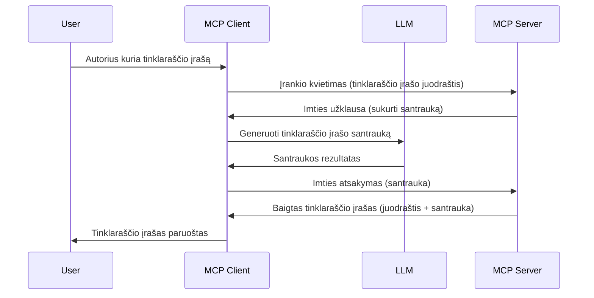

# Imties ėmimas - funkcijų delegavimas klientui

Kartais reikia, kad MCP klientas ir MCP serveris bendradarbiautų siekdami bendro tikslo. Gali būti atvejis, kai serveriui reikalinga pagalba iš LLM, kuris veikia kliento pusėje. Tokiu atveju reikia naudoti imties ėmimą (sampling).

Pažiūrėkime keletą panaudojimo atvejų ir kaip sukurti sprendimą, susijusį su imties ėmimu.

## Apžvalga

Šioje pamokoje aptarsime, kada ir kur naudoti imties ėmimą bei kaip jį konfigūruoti.

## Mokymosi tikslai

Šiame skyriuje mes:

- Paaiškinsime, kas yra imties ėmimas ir kada jį naudoti.
- Parodysime, kaip konfigūruoti imties ėmimą MCP.
- Pateiksime imties ėmimo veikimo pavyzdžių.

## Kas yra imties ėmimas ir kodėl ją naudoti?

Imties ėmimas yra pažangi funkcija, veikianti taip:



### Imties užklausa

Gerai, dabar turime plataus masto patikimą scenarijų, aptarkime, kokia yra užklausa, kurią serveris siunčia atgal klientui. Štai kaip tokia užklausa gali atrodyti JSON-RPC formatu:

```json
{
  "jsonrpc": "2.0",
  "id": 1,
  "method": "sampling/createMessage",
  "params": {
    "messages": [
      {
        "role": "user",
        "content": {
          "type": "text",
          "text": "Create a blog post summary of the following blog post: <BLOG POST>"
        }
      }
    ],
    "modelPreferences": {
      "hints": [
        {
          "name": "claude-3-sonnet"
        }
      ],
      "intelligencePriority": 0.8,
      "speedPriority": 0.5
    },
    "systemPrompt": "You are a helpful assistant.",
    "maxTokens": 100
  }
}
```

Čia verta atkreipti dėmesį į keletą dalykų:

- Promptas, esantis content -> text, yra mūsų užklausa, instrukcija LLM apibendrinti tinklaraščio įrašo turinį.

- **modelPreferences**. Ši dalis yra pageidavimų skyrius, rekomendacija, kokią konfigūraciją naudoti su LLM. Vartotojas gali pasirinkti naudoti šias rekomendacijas arba jas pakeisti. Šiuo atveju pateikiamos rekomendacijos dėl naudojamo modelio bei prioritetų, susijusių su greičiu ir protingumu.
- **systemPrompt**, tai įprastas sistemos promptas, suteikiantis LLM asmenybę ir turintis gairių.
- **maxTokens**, dar viena savybė, nurodanti, kiek žetonų rekomenduojama naudoti šiai užduočiai.

### Imties atsakymas

Šis atsakymas yra tai, ką MCP klientas siunčia atgal MCP serveriui ir yra rezultatas kliento iškvietusio LLM, palaukusio atsakymo ir tada sukūrusio šį pranešimą. Štai kaip tai gali atrodyti JSON-RPC:

```json
{
  "jsonrpc": "2.0",
  "id": 1,
  "result": {
    "role": "assistant",
    "content": {
      "type": "text",
      "text": "Here's your abstract <ABSTRACT>"
    },
    "model": "gpt-5",
    "stopReason": "endTurn"
  }
}
```

Atkreipkite dėmesį, kaip atsakymas yra tinklaraščio įrašo santrauka, kaip ir prašėme. Taip pat pastebėkite, kad naudotas modelis nėra tas, kurį prašėme, bet "gpt-5" vietoje "claude-3-sonnet". Tai iliustruoja, kad vartotojas gali keisti savo nuomonę apie tai, ką naudoti, o jūsų imties užklausa yra rekomendacija.

Gerai, dabar kai suprantame pagrindinį srautą ir naudingą užduotį, kuriai ją naudoti - „tinklaraščio įrašo kūrimas + santrauka“, pažiūrėkime, ką turime padaryti, kad tai veiktų.

### Pranešimų tipai

Imties ėmimo pranešimai nėra ribojami tik tekstui – galite siųsti ir vaizdus, ir garsus. Štai kaip JSON-RPC atrodo skirtingiems duomenų tipams:

**Tekstas**

```json
{
  "type": "text",
  "text": "The message content"
}
```

**Vaizdo turinys**

```json
{
  "type": "image",
  "data": "base64-encoded-image-data",
  "mimeType": "image/jpeg"
}
```

**Garso turinys**

```json
{
  "type": "audio",
  "data": "base64-encoded-audio-data",
  "mimeType": "audio/wav"
}
```

> PASTABA: Daugiau informacijos apie imties ėmimą rasite [oficialiose dokumentacijose](https://modelcontextprotocol.io/specification/2025-11-25/client/sampling)

## Kaip konfigūruoti imties ėmimą kliente

> Pastaba: jei kuriate tik serverį, čia daug daryti nereikia.

Kliente jums reikia nurodyti šią funkciją taip:

```json
{
  "capabilities": {
    "sampling": {}
  }
}
```

Tai bus atpažinta atitinkamai, kai pasirinktas klientas prisijungs prie serverio.

## Imties ėmimo veikimo pavyzdys – tinklaraščio įrašo kūrimas

Programuokime imties ėmimo serverį kartu, turėsime atlikti šiuos veiksmus:

1. Sukurti įrankį serveryje.
2. Šis įrankis turėtų inicijuoti imties užklausą.
3. Įrankis turėtų laukti kliento imties užklausos atsakymo.
4. Tuomet turi būti pateiktas įrankio rezultatas.

Pažiūrėkime kodą žingsnis po žingsnio:

### -1- Sukurti įrankį

**python**

```python
@mcp.tool()
async def create_blog(title: str, content: str, ctx: Context[ServerSession, None]) -> str:
    """Create a blog post and generate a summary"""

```

### -2- Sukurti imties užklausą

Pratęskite savo įrankį tokiu kodu:

**python**

```python
post = BlogPost(
        id=len(posts) + 1,
        title=title,
        content=content,
        abstract=""
    )

prompt = f"Create an abstract of the following blog post: title: {title} and draft: {content} "

result = await ctx.session.create_message(
        messages=[
            SamplingMessage(
                role="user",
                content=TextContent(type="text", text=prompt),
            )
        ],
        max_tokens=100,
)

```

### -3- Laukti atsakymo ir jį grąžinti

**python**

```python
post.abstract = result.content.text

posts.append(post)

# grąžinti visišką produktą
return json.dumps({
    "id": post.title,
    "abstract": post.abstract
})
```

### -4- Pilnas kodas

**python**

```python
from starlette.applications import Starlette
from starlette.routing import Mount, Host

from mcp.server.fastmcp import Context, FastMCP

from mcp.server.session import ServerSession
from mcp.types import SamplingMessage, TextContent

import json


from uuid import uuid4
from typing import List
from pydantic import BaseModel


mcp = FastMCP("Blog post generator")

# app = FastAPI()

posts = []

class BlogPost(BaseModel):
    id: int
    title: str
    content: str
    abstract: str

posts: List[BlogPost] = []

@mcp.tool()
async def create_blog(title: str, content: str, ctx: Context[ServerSession, None]) -> str:
    """Create a blog post and generate a summary"""

    post = BlogPost(
        id=len(posts) + 1,
        title=title,
        content=content,
        abstract=""
    )

    prompt = f"Create an abstract of the following blog post: title: {title} and draft: {content} "

    result = await ctx.session.create_message(
        messages=[
            SamplingMessage(
                role="user",
                content=TextContent(type="text", text=prompt),
            )
        ],
        max_tokens=100,
    )

    post.abstract = result.content.text

    posts.append(post)

    # grąžinti pilną tinklaraščio įrašą
    return json.dumps({
        "id": post.title,
        "abstract": post.abstract
    })

if __name__ == "__main__":
    print("Starting server...")
    # mcp.run()
    mcp.run(transport="streamable-http")

# paleisti programą su: python server.py
```

### -5- Testavimas Visual Studio Code aplinkoje

Kad išbandytumėte tai Visual Studio Code, atlikite šiuos veiksmus:

1. Paleiskite serverį terminale
2. Įrašykite jį į *mcp.json* (ir įsitikinkite, kad jis paleistas), pvz., taip:

   ```json
   "servers": {
      "blog-server": {
        "type": "http",
        "url": "http://localhost:8000/mcp"
      }
   }
   ```

3. Įveskite užklausą:

   ```text
   create a blog post named "Where Python comes from", the content is "Python is actually named after Monty Python Flying Circus"
   ```

4. Leiskite vykdyti imties ėmimą. Pirmą kartą tai testuodami, pamatysite papildomą dialogą, kurį reikės patvirtinti, tada matysite įprastą dialogą, prašantį paleisti įrankį.

5. Patikrinkite rezultatus. Matysite rezultatus gražiai pateiktus GitHub Copilot Chat, bet taip pat galite peržiūrėti žalią JSON atsakymą.

**Papildomi patarimai.** Visual Studio Code įrankiai puikiai palaiko imties ėmimą. Galite konfigūruoti imties prieigą savo įdiegtam serveriui taip:

1. Eikite į plėtinių skyrių.
2. Pasirinkite krumpliaračio piktogramą savo įdiegto serverio skiltyje „MCP SERVERS - INSTALLED“.
3. Pasirinkite „Configure Model Access“, čia galite pasirinkti, kuriuos modelius GitHub Copilot gali naudoti atliekant imties ėmimą. Taip pat galite matyti visų neseniai įvykusių imties užklausų sąrašą spustelėdami „Show Sampling requests“.

## Namų darbai

Šiame namų darbe sukursite kiek kitokį imties ėmimą – integraciją, kuri generuotų produkto aprašymą. Štai jūsų scenarijus:

**Scenarijus**: E-komercijos administratoriaus darbas užtrunka per daug kuriant produktų aprašymus. Todėl turite sukurti sprendimą, kuriame galite iškviesti įrankį "create_product" su argumentais "title" ir "keywords" ir jis turėtų sugeneruoti pilną produktą, įskaitant lauką "description", kuris būtų užpildytas kliento LLM pagalba.

Patarimas: naudokite tai, ką išmokote anksčiau, kad sukurtumėte šį serverį ir jo įrankį naudojant imties užklausą.

## Sprendimas

[Sprendimas](./solution/README.md)

## Pagrindinės išvados

Imties ėmimas yra galinga funkcija, leidžianti serveriui deleguoti užduotis klientui, kai reikalinga LLM pagalba.

## Kas toliau

- [4 skyrius – praktinė įgyvendinimas](../../04-PracticalImplementation/README.md)

---

<!-- CO-OP TRANSLATOR DISCLAIMER START -->
**Atsakomybės apribojimas**:
Šis dokumentas buvo išverstas naudojant dirbtinio intelekto vertimo paslaugą [Co-op Translator](https://github.com/Azure/co-op-translator). Nors siekiame tikslumo, prašome atkreipti dėmesį, kad automatiniai vertimai gali turėti klaidų ar netikslumų. Originalus dokumentas jo gimtąja kalba laikomas autoritetingu šaltiniu. Svarbiai informacijai rekomenduojama naudoti profesionalų žmogiškąjį vertimą. Mes neatsakome už jokius nesusipratimus ar neteisingą interpretaciją, kilusią naudojantis šiuo vertimu.
<!-- CO-OP TRANSLATOR DISCLAIMER END -->