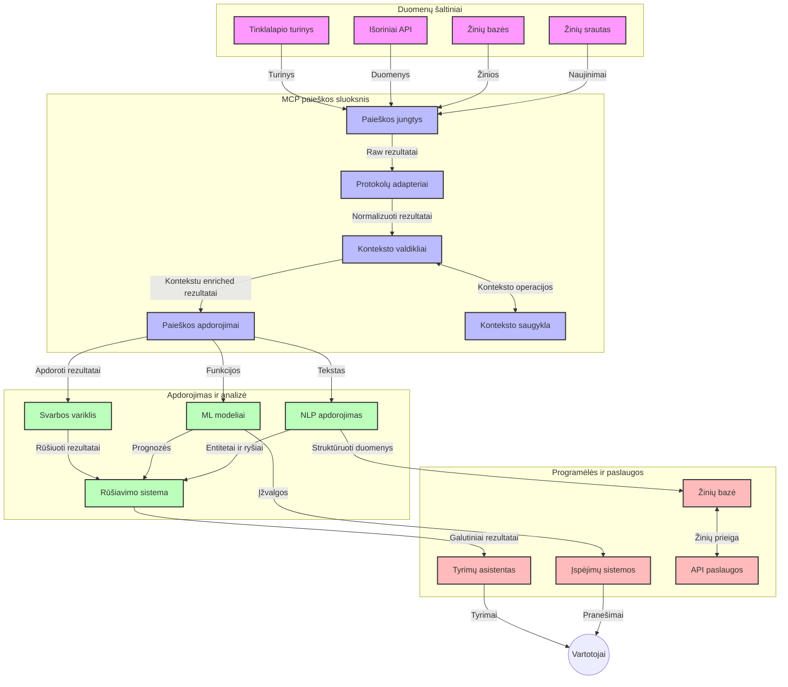
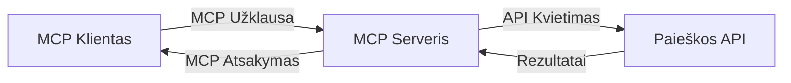
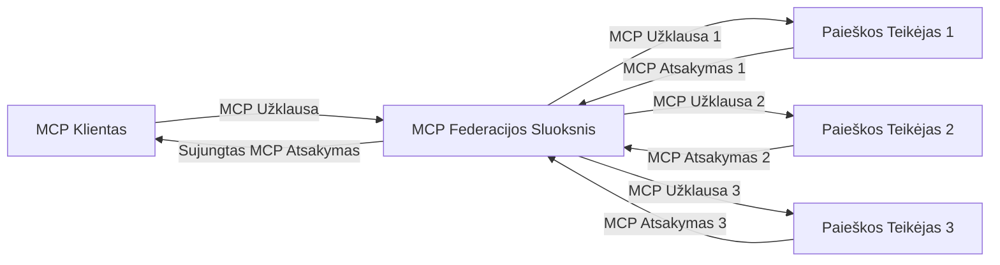
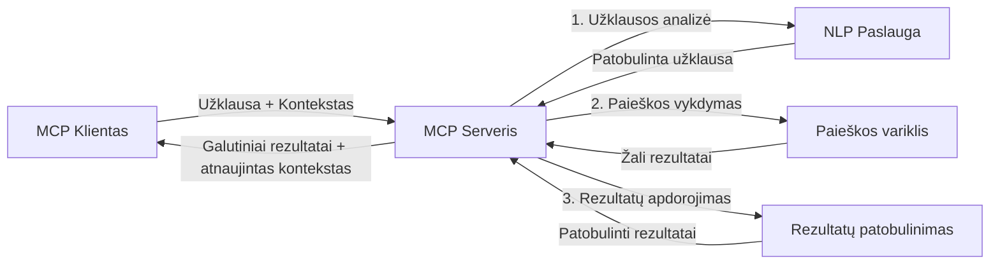

# Modelio konteksto protokolas realaus laiko internetinei paieškai

## Apžvalga

Realaus laiko internetinė paieška tapo esmine šiandieninėje informacijos amžiuje, kai programėlėms reikalinga greita prieiga prie naujausios informacijos visame internete, kad būtų pateikti aktualūs ir laiku pateikti atsakymai. Modelio konteksto protokolas (MCP) žymi reikšmingą pažangą optimizuojant šiuos realaus laiko paieškos procesus, gerinant paieškos efektyvumą, išlaikant kontekstinę vientisumą ir didinant bendrą sistemos našumą.

Šis modulis nagrinėja, kaip MCP transformuoja realaus laiko internetinę paiešką, suteikdamas standartizuotą požiūrį į konteksto valdymą tarp AI modelių, paieškos sistemų ir programėlių.

### Ko išmoksite

Šioje išsamioje instrukcijoje sužinosite:

- Kaip MCP sukuria nepertraukiamą tiltą tarp AI modelių ir realaus laiko internetinės paieškos galimybių
- Architektūrinius šablonus efektyvioms ir masteliu pritaikomoms paieškos sprendimams įgyvendinti su MCP
- Technikas, kaip išlaikyti paieškos kontekstą per kelis užklausimus ir sąveikas
- Praktines kodo realizacijas Python ir JavaScript kalbomis įvairioms paieškos situacijoms
- Metodus, kaip subalansuoti aktualumą, naujumą ir našumą MCP pagrįstose paieškos sistemose

## Įvadas į realaus laiko internetinę paiešką

Realaus laiko internetinė paieška yra technologinis požiūris, leidžiantis nuolat užklausti, apdoroti ir analizuoti internetinę informaciją, kai ji publikuojama arba atnaujinama, leidžiant sistemoms pateikti šviežią ir aktualią informaciją su minimaliu vėlavimu. Skirtingai nuo tradicinių paieškos sistemų, kurios veikia su indeksuotais duomenimis, galinčiais būti valandų ar dienų senumo, realaus laiko paieška apdoroja tiesioginius tinklo duomenis, pateikdama įžvalgas ir informaciją, atitinkančią dabartinę turinio internete būklę.

### Pagrindinės realaus laiko internetinės paieškos sąvokos:

- **Nuolatinis užklausų apdorojimas**: Paieškos užklausos apdorojamos nuolat atnaujinamų duomenų šaltinių pagrindu
- **Naujumo prioritetizavimas**: Sistemos sukurtos taip, kad prioritetu teiktų šviežią informaciją
- **Aktualumo balansavimas**: Išlaikomas balansas tarp aktualumo ir naujumo
- **Mastelio architektūra**: Sistemos turi tvarkyti kintamą užklausų krūvį ir duomenų apimtis
- **Kontekstinis suvokimas**: Svarbu išlaikyti vartotojo kontekstą per paieškos iteracijas, kad būtų pasiekti prasmingi rezultatai
- **Dinaminis užklausų perdarymas**: Adaptuojant užklausas pagal kontekstą ir ankstesnius rezultatus
- **Daugiashaltinis integravimas**: Kelių paieškos tiekėjų ir interneto šaltinių rezultatų sujungimas
- **Semantinis supratimas**: Užklausų ir turinio apdorojimas pagal prasmę, o ne vien raktinius žodžius
- **Realaus laiko reitingavimas**: Nuolatinis rezultatų reitingų koregavimas atsirandant naujai informacijai

### Modelio konteksto protokolas ir realaus laiko internetinė paieška

Modelio konteksto protokolas (MCP) sprendžia kelias pagrindines problemas realaus laiko internetinės paieškos aplinkose:

1. **Paieškos konteksto išsaugojimas**: MCP standartizuoja, kaip kontekstas išlaikomas per paskirstytas paieškos dalis, užtikrindamas, kad AI modeliai ir apdorojimo mazgai turėtų prieigą prie reikšmingos užklausų istorijos ir vartotojo nuostatų.

2. **Efektyvus užklausų valdymas**: Teikiant struktūruotas konteksto perdavimo mechanikas, MCP sumažina konteksto kartojimo prievolę kiekvienoje paieškos iteracijoje.

3. **Sąveikumas**: MCP sukuria bendrą kalbą konteksto dalijimuisi tarp įvairių paieškos technologijų ir AI modelių, leidžiant lankstesnes ir plėtojamas architektūras.

4. **Paieškai optimizuotas kontekstas**: MCP diegimai gali prioritetizuoti, kurie konteksto elementai yra svarbiausi veiksmingai paieškai, optimizuodami tiek našumą, tiek tikslumą.

5. **Adaptuojamas paieškos apdorojimas**: Naudojant tinkamą MCP konteksto valdymą, paieškos sistemos gali dinamiškai keisti apdorojimą pagal kintančius vartotojo poreikius ir informacijos aplinką.

Šiuolaikinėse programėlėse, pradedant naujienų agregavimu ir baigiant moksliniais asistentais, MCP integracija su internetinės paieškos technologijomis leidžia kurti protingesnę, kontekstą atitinkančią paiešką, kuri su vartotojo sąveika tampa vis aktualesnė.

## Mokymosi tikslai

Baigę šią pamoką, galėsite:

- Suprasti realaus laiko internetinės paieškos pagrindus ir jos iššūkius šiuolaikinėse programėlėse
- Paaiškinti, kaip Modelio konteksto protokolas (MCP) pagerina realaus laiko internetinės paieškos galimybes
- Įgyvendinti MCP pagrįstus paieškos sprendimus naudojant populiarius karkasus ir API
- Kurti ir diegti mastelio, didelio našumo paieškos architektūras su MCP
- Taikyti MCP koncepcijas įvairiuose naudojimo atvejuose, įskaitant semantinę paiešką, mokslinių tyrimų pagalbą ir AI papildomą naršymą
- Vertinti vystančias tendencijas ir būsimas inovacijas MCP pagrįstose paieškos technologijose
- Kurti kontekstą suvokiančias paieškos sistemas, kurios mokosi iš vartotojo sąveikų
- Integruoti internetinės paieškos galimybes į AI asistentus naudojant standartizuotus MCP protokolus
- Kurti daugiapakopes paieškos grandines, kurios palaipsniui tobulina rezultatus pagal kontekstą
- Optimizuoti paieškos našumą išlaikant išsamų konteksto suvokimą

### Apibrėžimas ir reikšmė

Realaus laiko internetinė paieška apima nuolatinį užklausų teikimą, gavimą ir internetinės informacijos pateikimą su minimaliu vėlavimu. Skirtingai nuo tradicinių paieškos variklių, kurie periodiškai skenuoja ir indeksuoja tinklą, realaus laiko paieška siekia pateikti informaciją iš karto, kai ji tampa prieinama, užtikrindama greitą prieigą prie naujausio turinio.

Pagrindinės realaus laiko internetinės paieškos ypatybės:

- **Šviežumas**: Pirmiausia pateikiamas naujausias turinys ir atnaujinimai
- **Nuolatinis apdorojimas**: Nuolat stebima nauja informacija
- **Užklausų adaptavimas**: Užklausos tobulinamos pagal kontekstą ir atsiliepimus
- **Momentinis pateikimas**: Rezultatai pateikiami su minimaliu delsimu
- **Konteksto laikymas**: Išnaudojama ankstesnių užklausų informacija, siekiant geresnio aktualumo

### Iššūkiai tradicinėje internetinėje paieškoje

Tradicinės internetinės paieškos požiūriai susiduria su keliais apribojimais, taikant realaus laiko scenarijus:

1. **Konteksto fragmentacija**: Sunku išlaikyti paieškos kontekstą per keletą užklausų
2. **Informacijos naujumo iššūkiai**: Problemos priėjime prie naujausios informacijos ir jos prioritetizavime
3. **Integracijos sudėtingumas**: Sąveikos tarp paieškos sistemų ir programėlių problemos
4. **Vėlavimo problemos**: Balansavimas tarp išsamios paieškos ir atsakymo laiko reikalavimų
5. **Aktualumo reguliavimas**: Užtikrinti tikslumą ir aktualumą prioritetizuojant naujumą

## Modelio konteksto protokolo (MCP) supratimas paieškose

### Kas yra MCP paieškos kontekste?

Modelio konteksto protokolas (MCP) yra standartizuotas komunikacijos protokolas, skirtas užtikrinti efektyvią sąveiką tarp AI modelių ir programėlių. Realio laiko internetinės paieškos kontekste MCP suteikia sistemą:

- Išlaikyti paieškos kontekstą visų užklausų sekoje
- Standartizuoti paieškos užklausų ir rezultatų formatus
- Optimizuoti paieškos parametrų ir rezultatų perdavimą
- Pagerinti komunikaciją tarp modelių ir paieškos variklių

### Pagrindinės sudedamosios dalys ir architektūra

MCP architektūra realaus laiko internetinei paieškai susideda iš kelių pagrindinių komponentų:

1. **Užklausų konteksto valdytojai**: Tvarko ir palaiko paieškos kontekstą per kelias užklausas
2. **Paieškos apdorojimo sistemos**: Apdoroja gaunamas užklausas naudojant kontekstą suprantančias technologijas
3. **Protokolų adapteriai**: Konvertuoja tarp skirtingų paieškos API išsaugodami kontekstą
4. **Konteksto saugykla**: Efektyviai saugo ir gautų paieškos istoriją bei nuostatas
5. **Paieškos jungtys**: Jungiasi prie įvairių paieškos variklių ir interneto API



### Kaip MCP gerina realaus laiko internetinę paiešką

MCP sprendžia tradicines internetinės paieškos problemas per:

- **Kontekstinę tęstinumą**: Išlaikant ryšius tarp užklausų visos paieškos sesijos metu
- **Optimizuotą perdavimą**: Mažinant nereikalingą parametrų kartojimą per inteligentišką konteksto valdymą
- **Standartizuotus sąsajos**: Suteikdama nuoseklias API paieškos komponentams
- **Mažinant vėlavimą**: Sumažinant apdorojimo apkrovą per veiksmingą konteksto tvarkymą
- **Pagerintą aktualumą**: Gerinant paieškos aktualumą išlaikant vartotojo ketinimus per kelias užklausas

## Integracija ir įgyvendinimas

Realaus laiko internetinės paieškos sistemos reikalauja atsargaus architektūrinio dizaino ir įgyvendinimo, kad būtų išlaikytas tiek našumas, tiek kontekstinė vientisumas. Modelio konteksto protokolas siūlo standartizuotą požiūrį į AI modelių ir paieškos technologijų integraciją, leidžiantį kurti pažangesnes, kontekstą suvokiančias paieškos grandines.

### MCP integracijos į paieškos architektūras apžvalga

MCP diegimas realaus laiko internetinės paieškos aplinkoje apima keletą pagrindinių aspektų:

1. **Paieškos konteksto serializavimas**: MCP suteikia efektyvius mechanizmus koduoti kontekstinę informaciją paieškos užklausose, užtikrinant, kad svarbus kontekstas keliautų kartu su užklausa visame apdorojimo kelyje. Tai apima standartizuotus seralizavimo formatus, optimizuotus paieškai būdingiems metaduomenims.

2. **Valstybės (stateful) paieškos apdorojimas**: MCP leidžia pažangesnį valstybės palaikymą apdorojimo procese, išlaikant nuoseklią konteksto reprezentaciją per paieškos iteracijas. Tai ypač naudinga daugiaetapėse paieškos grandinėse, kur konteksto tobulinimas gerina rezultatus.

3. **Užklausų plėtra ir tobulinimas**: MCP diegimai paieškos sistemose gali padėti sudėtingam užklausų plėtimui ir tobulinimui, remiantis sukauptu kontekstu, leidžiant gauti vis aktualesnius rezultatus, nes paieškos sesija pažengia.

4. **Rezultatų talpinimas ir prioritetizavimas**: Standartizuodama konteksto valdymą, MCP padeda kontroliuoti rezultatų talpinimą ir prioritetus, leidžiant komponentams prisitaikyti prie kintančio paieškos konteksto.

5. **Federacija ir agregavimas**: MCP leidžia sudėtingesnę paieškos federaciją daugybėje galinių sistemų, pateikdama struktūruotas paieškos konteksto reprezentacijas, leidžiančias prasmingai agreguoti rezultatus iš įvairių šaltinių.

MCP įgyvendinimas įvairiose paieškos technologijose sukuria vieningą požiūrį į konteksto valdymą, sumažindamas poreikį rašyti individualų integracijos kodą ir gerindamas sistemos galimybes išlaikyti prasmingą kontekstą, kai paieškos užklausos kinta.

### MCP įvairiose internetinės paieškos realizacijose

Šie pavyzdžiai remiasi esama MCP specifikacija, kuri pagrįsta JSON-RPC protokolu kartu su skirtingais transporto mechanizmais. Koduose demonstruojama, kaip galite įgyvendinti pasirinktines paieškos integracijas išlaikant visišką MCP protokolo suderinamumą.

<details>
<summary>Python įgyvendinimas su bendriniu paieškos API</summary>

```python
import asyncio
import json
import aiohttp
from typing import Dict, Any, Optional, List
from contextlib import asynccontextmanager
from collections.abc import AsyncIterator

# Importuoti standartines MCP bibliotekas
from mcp.client.session import ClientSession
from mcp.client.streamable_http import streamablehttp_client
from mcp.types import TextContent, CreateMessageRequestParams, CreateMessageResult
from mcp.server.fastmcp import FastMCP

# Sukurti FastMCP serverį internetinei paieškai
search_server = FastMCP("WebSearch")

# Klasė, skirta valdyti internetinės paieškos operacijas
class WebSearchHandler:
    def __init__(self, api_endpoint: str, api_key: str):
        self.api_endpoint = api_endpoint
        self.api_key = api_key
        self.session = None
        
    async def initialize(self):
        """Initialize the HTTP session"""
        self.session = aiohttp.ClientSession(
            headers={"Authorization": f"Bearer {self.api_key}"}
        )
    
    async def close(self):
        """Close the HTTP session"""
        if self.session:
            await self.session.close()
            
    async def perform_search(self, query: str, max_results: int = 5, 
                           include_domains: List[str] = None, 
                           exclude_domains: List[str] = None,
                           time_period: str = "any") -> Dict[str, Any]:
        """Perform web search using the search API"""
        # Sudaryti paieškos parametrus
        search_params = {
            "q": query,
            "limit": max_results,
            "time": time_period
        }
        
        if include_domains:
            search_params["site"] = ",".join(include_domains)
            
        if exclude_domains:
            search_params["exclude_site"] = ",".join(exclude_domains)
        
        # Atlikti paieškos užklausą
        try:
            async with self.session.get(
                self.api_endpoint,
                params=search_params
            ) as response:
                if response.status != 200:
                    error_text = await response.text()
                    raise Exception(f"Search API error: {response.status} - {error_text}")
                
                search_data = await response.json()
                
                # Paversti API specifinį atsakymą į standartinį formatą
                results = []
                for item in search_data.get("results", []):
                    results.append({
                        "title": item.get("title", ""),
                        "url": item.get("url", ""),
                        "snippet": item.get("snippet", ""),
                        "date": item.get("published_date", ""),
                        "source": item.get("source", "")
                    })
                
                return {
                    "query": query,
                    "totalResults": len(results),
                    "results": results
                }
        except Exception as e:
            print(f"Search API request error: {e}")
            raise

# Inicializuoti paieškos valdiklį
search_handler = WebSearchHandler(
    api_endpoint="https://api.search-service.example/search",
    api_key="your-api-key-here"
)

# Nustatyti gyvavimo laikotarpį paieškos valdiklio valdymui
@asyncio.asynccontextmanager
async def app_lifespan(server: FastMCP):
    """Manage application lifecycle"""
    await search_handler.initialize()
    try:
        yield {"search_handler": search_handler}
    finally:
        await search_handler.close()

# Nustatyti serverio gyvavimo laikotarpį
search_server = FastMCP("WebSearch", lifespan=app_lifespan)

# Užregistruoti internetinės paieškos įrankį
@search_server.tool()
async def web_search(query: str, max_results: int = 5, 
                   include_domains: List[str] = None,
                   exclude_domains: List[str] = None,
                   time_period: str = "any") -> Dict[str, Any]:
    """
    Search the web for information
    
    Args:
        query: The search query
        max_results: Maximum number of results to return (default: 5)
        include_domains: List of domains to include in search results
        exclude_domains: List of domains to exclude from search results
        time_period: Time period for results ("day", "week", "month", "any")
        
    Returns:
        Dictionary containing search results
    """
    ctx = search_server.get_context()
    search_handler = ctx.request_context.lifespan_context["search_handler"]
    
    results = await search_handler.perform_search(
        query=query,
        max_results=max_results,
        include_domains=include_domains,
        exclude_domains=exclude_domains,
        time_period=time_period
    )
    
    return results

# Pavyzdinis kliento naudojimas
async def client_example():
    # Prisijungti prie paieškos serverio naudojant Streamable HTTP transportą
    async with streamablehttp_client("http://localhost:8000/mcp") as (read, write, _):
        async with ClientSession(read, write) as session:
            # Inicializuoti ryšį
            await session.initialize()
            
            # Iškvieti web_search įrankį
            search_results = await session.call_tool(
                "web_search", 
                {
                    "query": "latest developments in AI and Model Context Protocol",
                    "max_results": 5,
                    "time_period": "day",
                    "include_domains": ["github.com", "microsoft.com"]
                }
            )
            
            print(f"Search results: {search_results}")

# Serverio vykdymo pavyzdys
if __name__ == "__main__":
    # Vykdyti serverį su Streamable HTTP transportu
    search_server.run(transport="streamable-http")
```
</details> 

<details>
<summary>JavaScript įgyvendinimas su naršyklės pagrindu veikiančia paieška</summary>

```javascript
// MCP serverio įgyvendinimas tinklo paieškai
import { McpServer, ResourceTemplate } from '@modelcontextprotocol/sdk/server/mcp.js';
import { StreamableHTTPServerTransport } from '@modelcontextprotocol/sdk/server/streamableHttp.js';
import { z } from 'zod';

// Sukurti MCP serverį tinklo paieškai
const searchServer = new McpServer({
    name: "BrowserSearch",
    description: "A server that provides web search capabilities"
});

// Paieškos paslaugos klasė
class SearchService {
    constructor(searchApiUrl, apiKey) {
        this.searchApiUrl = searchApiUrl;
        this.apiKey = apiKey;
    }

    async performSearch(parameters) {
        const {
            query = '',
            maxResults = 5,
            includeDomains = [],
            excludeDomains = [],
            timePeriod = 'any'
        } = parameters;
        
        // Sudaryti paieškos URL su parametrais
        const url = new URL(this.searchApiUrl);
        url.searchParams.append('q', query);
        url.searchParams.append('limit', maxResults);
        url.searchParams.append('time', timePeriod);
        
        if (includeDomains.length > 0) {
            url.searchParams.append('site', includeDomains.join(','));
        }
        
        if (excludeDomains.length > 0) {
            url.searchParams.append('exclude_site', excludeDomains.join(','));
        }
        
        try {
            const response = await fetch(url.toString(), {
                method: 'GET',
                headers: {
                    'Authorization': `Bearer ${this.apiKey}`,
                    'Content-Type': 'application/json'
                }
            });
            
            if (!response.ok) {
                const errorText = await response.text();
                throw new Error(`Search API error: ${response.status} - ${errorText}`);
            }
            
            const searchData = await response.json();
            
            // Paversti API specifinį atsakymą į standartinį formatą
            const results = searchData.results?.map(item => ({
                title: item.title || '',
                url: item.url || '',
                snippet: item.snippet || '',
                date: item.published_date || '',
                source: item.source || ''
            })) || [];
            
            return {
                query,
                totalResults: results.length,
                results
            };
        } catch (error) {
            console.error('Search API request error:', error);
            throw error;
        }
    }
}

// Inicializuoti paieškos paslaugą
const searchService = new SearchService(
    'https://api.search-service.example/search',
    'your-api-key-here'
);

// Nustatyti konteksto tiekėją serveriui
searchServer.setContextProvider(() => {
    return {
        searchService
    };
});

// Užregistruoti tinklo paieškos įrankį
searchServer.tool({
    name: 'web_search',
    description: 'Search the web for information',
    parameters: {
        type: 'object',
        properties: {
            query: {
                type: 'string',
                description: 'The search query'
            },
            maxResults: {
                type: 'integer',
                description: 'Maximum number of results to return',
                default: 5
            },
            includeDomains: {
                type: 'array',
                items: { type: 'string' },
                description: 'List of domains to include in search results'
            },
            excludeDomains: {
                type: 'array',
                items: { type: 'string' },
                description: 'List of domains to exclude from search results'
            },
            timePeriod: {
                type: 'string',
                description: 'Time period for results',
                enum: ['day', 'week', 'month', 'any'],
                default: 'any'
            }
        },
        required: ['query']
    },
    handler: async (params, context) => {
        const { searchService } = context;
        return await searchService.performSearch(params);
    }
});

// Pavyzdinis kliento kodas prisijungimui prie paieškos serverio
import { Client } from '@modelcontextprotocol/sdk/client/index.js';
import { StreamableHTTPClientTransport } from '@modelcontextprotocol/sdk/client/streamableHttp.js';

async function connectToSearchServer() {
    // Prisijungti prie paieškos serverio
    const transport = new StreamableHTTPClientTransport(
        new URL('http://localhost:8000/mcp')
    );
    
    const client = new Client({
        name: 'search-client',
        version: '1.0.0'
    });
    
    await client.connect(transport);
    
    // Vykdyti paieškos įrankį
    const searchResults = await client.callTool({
        name: 'web_search',
        arguments: {
            query: 'Model Context Protocol implementation examples',
            maxResults: 10,
            timePeriod: 'week',
            includeDomains: ['github.com', 'docs.microsoft.com']
        }
    });
    
    console.log('Search results:', searchResults);
    
    // Išvalymas
    await client.disconnect();
}

// Paleisti serverį
const transport = new StreamableHTTPServerTransport();
await searchServer.connect(transport);
console.log('Search server running at http://localhost:8000/mcp');

// Atkirtame procese arba po serverio paleidimo
// connectToSearchServer().catch(console.error);
```
</details> 

## Kodo pavyzdžių atsakomybė

> **Svarbi pastaba**: žemiau pateikti kodo pavyzdžiai demonstruoja Modelio konteksto protokolo (MCP) integraciją su internetine paieška. Nors jie seka oficialių MCP SDK struktūras ir šablonus, jie supaprastinti mokymosi tikslams.
> 
> Šie pavyzdžiai iliustruoja:
> 
> 1. **Python įgyvendinimą**: FastMCP serverio realizaciją, suteikiančią internetinės paieškos įrankį ir jungtį į išorinį paieškos API. Šiame pavyzdyje demonstruojamas tinkamas resursų valdymas, konteksto tvarkymas ir įrankių realizacija pagal [oficialaus MCP Python SDK](https://github.com/modelcontextprotocol/python-sdk) šablonus. Serveris naudoja rekomenduojamą Streamable HTTP transportą, kuris pakeitė senesnį SSE transportą gamybinėms diegimo aplinkoms.
> 
> 2. **JavaScript įgyvendinimą**: TypeScript/JavaScript realizaciją, naudojant FastMCP šabloną iš [oficialaus MCP TypeScript SDK](https://github.com/modelcontextprotocol/typescript-sdk), kurianti paieškos serverį su tinkamu įrankių apibrėžimu ir kliento jungtimis. Ši realizacija atitinka naujausius rekomenduojamus sesijų valdymo ir konteksto išlaikymo šablonus.
> 
> Šie pavyzdžiai gamyboje reikalaus papildomo klaidų valdymo, autentifikacijos ir specifinių API integracijos kodų. Paieškos API pavyzdžių taškai (`https://api.search-service.example/search`) yra laikini, juos reikėtų pakeisti tikrais paieškos paslaugų adresais.
> 
> Pilni įgyvendinimo duomenys ir naujausios praktikos yra prieinamos oficialioje MCP specifikacijoje ([https://spec.modelcontextprotocol.io/](https://spec.modelcontextprotocol.io/)) ir SDK dokumentacijoje.

## Pagrindinės sąvokos

### Modelio konteksto protokolo (MCP) sistema

Pagrinde Modelio konteksto protokolas suteikia standartizuotą būdą AI modeliams, programoms ir paslaugoms keistis kontekstu. Realaus laiko internetinėje paieškoje ši sistema yra būtina kuriant nuoseklias, daugiasluoksnes paieškos patirtis. Pagrindiniai komponentai:

1. **Klientų ir serverių architektūra**: MCP nustato aiškią atskirtį tarp paieškos klientų (užklausėjų) ir paieškos serverių (paslaugų teikėjų), leidžiant lanksčius diegimo modelius.

2. **JSON-RPC komunikacija**: Protokolas naudoja JSON-RPC pranešimų mainams, todėl suderinamas su internetinėmis technologijomis ir lengvai įgyvendinamas įvairiose platformose.

3. **Konteksto valdymas**: MCP įtvirtina struktūruotus metodus konteksto palaikymui, atnaujinimui ir naudojimui per kelis sąveikos ciklus.

4. **Įrankių apibrėžimai**: Paieškos galimybės pateikiamos kaip standartizuoti įrankiai su aiškiai apibrėžtais parametrais ir grąžinamomis reikšmėmis.

5. **Srautinio perdavimo palaikymas**: Protokolas palaiko rezultatų transliavimą, svarbų realaus laiko paieškai, kur rezultatai gali atkeliauti palaipsniui.

### Internetinės paieškos integravimo šablonai

Integruojant MCP su internetine paieška, išryškėja keli šablonai:

#### 1. Tiesioginė paieškos tiekėjo integracija



Šiame šablone MCP serveris tiesiogiai sąveikauja su vienu ar keliais paieškos API, verčiant MCP užklausas į konkrečius API kvietimus ir formatuojant rezultatus kaip MCP atsakymus.

#### 2. Federuota paieška su konteksto išlaikymu



Šis šablonas paskirsto paieškos užklausas tarp kelių MCP suderinamų paieškos tiekėjų, kiekvienas galimai specializuojasi skirtingų turinio tipų ar paieškos galimybių srityse, išlaikant vieningą kontekstą.

#### 3. Kontekstą papildanti paieškos grandinė



Šiame šablone paieškos procesas yra padalintas į kelis etapus, kuriuose kontekstas kiekviename žingsnyje praturtinamas, gaunant palaipsniui aktualesnius rezultatus.

### Paieškos konteksto komponentai

MCP pagrįstoje internetinėje paieškoje kontekstas paprastai apima:

- **Užklausų istorija**: Ankstesnės paieškos sesijos užklausos
- **Vartotojo nuostatos**: Kalba, regionas, saugios paieškos nustatymai
- **Sąveikų istorija**: Kurie rezultatai buvo paspausti, laikas praleistas su rezultatais
- **Paieškos parametrai**: Filtrai, rūšiavimo tvarkos ir kiti paieškos keitikliai
- **Domeno žinios**: Teminės srities kontekstas, susijęs su paieška
- **Laiko kontekstas**: Laiko pagrindo aktualumo veiksniai
- **Šaltinių nuostatos**: Patikimi ar pageidaujami informacijos šaltiniai

## Naudojimo atvejai ir pritaikymai

### Tyrimai ir informacijos rinkimas

MCP pagerina tyrimų darbo eigą:

- Išlaikant tyrimų kontekstą per paieškos sesijas
- Leidžiant sudėtingesnes ir kontekstą atitinkančias užklausas
- Remiantis daugiashaltine paieškos federacija
- Palengvinant žinių išgavimą iš paieškos rezultatų

### Realaus laiko naujienų ir tendencijų stebėjimas

MCP pagrįsta paieška siūlo pranašumus naujienų stebėjime:

- Praktiniu laiku aptinka naujas naujienų temas
- Kontextinis svarbios informacijos filtravimas
- Temos ir objektų stebėjimas keliose šaltinių vietose
- Personalizuoti naujienų įspėjimai pagal vartotojo kontekstą

### AI papildomas naršymas ir tyrimai

MCP atveria naujas galimybes AI papildomam naršymui:

- Kontextualios paieškos rekomendacijos pagal naršymo veiklą
- Sklandus internetinės paieškos integravimas su LLM pagrįstais asistentais
- Daugiasluoksnė paieškos tobulinimo grandinė palaikant kontekstą
- Pagerintas faktų tikrinimas ir informacijos patikra

## Ateities tendencijos ir inovacijos

### MCP raida internetinėje paieškoje

Žvelgiant į ateitį, tikimasi, kad MCP vystysis, siekiant spręsti:
- **Daugiapratinis paieška**: Teksto, vaizdo, garso ir vaizdo paieškos integravimas, išlaikant kontekstą  
- **Decentralizuota paieška**: Palaikyti paskirstytas ir federuotas paieškos ekosistemas  
- **Paieškos privatumas**: Kontekstą atitinkančios privatumo apsaugos paieškos mechanizmai  
- **Užklausų supratimas**: Gili natūralios kalbos paieškos užklausų semantinė analizė  

### Potenciali technologijų pažanga

Atsirandančios technologijos, kurios formuos MCP paieškos ateitį:

1. **Neuroninės paieškos architektūros**: Imtinių paieškos sistemos, optimizuotos MCP  
2. **Personalizuotas paieškos kontekstas**: Individualių vartotojų paieškos modelių mokymasis laikui bėgant  
3. **Žinių grafų integracija**: Kontekstinė paieška, pagerinta domeno specifinių žinių grafų pagalba  
4. **Kryžminio modalumo kontekstas**: Išlaikyti kontekstą tarp skirtingų paieškos modalumų  

## Praktinės užduotys

### Užduotis 1: Bazinės MCP paieškos grandinės nustatymas

Šioje užduotyje sužinosite, kaip:  
- Konfigūruoti bazinę MCP paieškos aplinką  
- Įgyvendinti konteksto tvarkyklius interneto paieškai  
- Testuoti ir patvirtinti konteksto išlaikymą keliuose paieškos etapuose  

### Užduotis 2: Tyrimų asistento kūrimas su MCP paieška

Sukurkite visapusišką programą, kuri:  
- Apdoroja natūralios kalbos tyrimų klausimus  
- Atlieka kontekstinę interneto paiešką  
- Sintezuoja informaciją iš įvairių šaltinių  
- Pateikia organizuotus tyrimų rezultatus  

### Užduotis 3: Daugiaprieigos paieškos federacijos įgyvendinimas su MCP

Išplėstinė užduotis, apimanti:  
- Kontekstinį užklausų išsiuntimą keliems paieškos varikliams  
- Rezultatų reitingavimą ir sujungimą  
- Kontekstinį paieškos rezultatų dublikatų šalinimą  
- Šaltiniams būdingų metaduomenų valdymą  

## Papildomi ištekliai

- [Model Context Protocol Specification](https://spec.modelcontextprotocol.io/) – Oficialus MCP specifikacijos ir išsamus protokolo dokumentavimas  
- [Model Context Protocol Documentation](https://modelcontextprotocol.io/) – Išsamūs mokymai ir diegimo gairės  
- [MCP Python SDK](https://github.com/modelcontextprotocol/python-sdk) – Oficialus MCP protokolo Python įgyvendinimas  
- [MCP TypeScript SDK](https://github.com/modelcontextprotocol/typescript-sdk) – Oficialus MCP protokolo TypeScript įgyvendinimas  
- [MCP Reference Servers](https://github.com/modelcontextprotocol/servers) – MCP serverių pavyzdinės įgyvendinimo versijos  
- [Bing Web Search API Documentation](https://learn.microsoft.com/en-us/bing/search-apis/bing-web-search/overview) – Microsoft interneto paieškos API  
- [Google Custom Search JSON API](https://developers.google.com/custom-search/v1/overview) – „Google“ programuojamas paieškos variklis  
- [SerpAPI Documentation](https://serpapi.com/search-api) – Paieškos rezultatų puslapio API  
- [Meilisearch Documentation](https://www.meilisearch.com/docs) – Atviro kodo paieškos variklis  
- [Elasticsearch Documentation](https://www.elastic.co/guide/index.html) – Paskirstyta paieškos ir analizės sistema  
- [LangChain Documentation](https://python.langchain.com/docs/get_started/introduction) – Programėlių kūrimas su LLM  

## Mokymosi rezultatai

Baigę šį modulį galėsite:  

- Suprasti realaus laiko interneto paieškos pagrindus ir jos iššūkius  
- Paaiškinti, kaip Model Context Protocol (MCP) pagerina realaus laiko interneto paieškos galimybes  
- Įgyvendinti MCP pagrįstas paieškos sprendimus naudojant populiarias sistemas ir API  
- Kurti ir diegti skalaujamas, aukšto našumo paieškos architektūras su MCP  
- Taikyti MCP koncepcijas įvairiems naudojimo atvejams, įskaitant semantinę paiešką, tyrimų pagalbą ir AI praturtintą naršymą  
- Įvertinti atsirandančias tendencijas ir būsimas inovacijas MCP pagrinduose paieškos technologijose  

### Pasitikėjimo ir saugumo aspektai

Įgyvendindami MCP pagrindu veikiančius interneto paieškos sprendimus, atkreipkite dėmesį į šiuos svarbius MCP specifikacijos principus:

1. **Vartotojų sutikimas ir kontrolė**: Vartotojai turi aiškiai sutikti ir suprasti visą duomenų prieigą bei operacijas. Tai ypač svarbu interneto paieškos sprendimams, kurie gali pasiekti išorinius duomenų šaltinius.

2. **Duomenų privatumas**: Užtikrinkite tinkamą paieškos užklausų ir rezultatų tvarkymą, ypač jei juose gali būti jautrios informacijos. Įgyvendinkite tinkamas prieigos kontrolės priemones, kad apsaugotumėte vartotojų duomenis.

3. **Įrankių saugumas**: Įgyvendinkite tinkamą autorizavimą ir patikrinimą paieškos įrankiams, nes jie kelia saugumo riziką per savavališką kodo vykdymą. Įrankių elgesio aprašymai turėtų būti laikomi nepatikimais, jei nėra gaunami iš patikimo serverio.

4. **Aiški dokumentacija**: Suteikite aiškią dokumentaciją apie savo MCP pagrįsto paieškos įgyvendinimo galimybes, ribotumus ir saugumo aspektus, vadovaudamiesi MCP specifikacijos diegimo gairėmis.

5. **Patikimos sutikimo procedūros**: Sukurkite patikimas sutikimo ir autorizacijos procedūras, kurios aiškiai išaiškina, ką kiekvienas įrankis atlieka prieš leidžiant jį naudoti, ypač įrankiams, kurie sąveikauja su išoriniais interneto ištekliais.

Išsamesnei informacijai apie MCP saugumo ir patikimumo principus, žr. [oficialią dokumentaciją](https://modelcontextprotocol.io/specification/2025-11-25/basic/security_best_practices).

## Kas toliau

- [5.12 Entra ID autentifikacija Model Context Protocol serveriams](../mcp-security-entra/README.md)

---

<!-- CO-OP TRANSLATOR DISCLAIMER START -->
**Atsakomybės apribojimas**:
Šis dokumentas buvo išverstas naudojant dirbtinio intelekto vertimo paslaugą [Co-op Translator](https://github.com/Azure/co-op-translator). Nors siekiame tikslumo, prašome atkreipti dėmesį, kad automatiniai vertimai gali turėti klaidų ar netikslumų. Originalus dokumentas jo gimtąja kalba laikomas autoritetingu šaltiniu. Svarbiai informacijai rekomenduojama naudoti profesionalų žmogiškąjį vertimą. Mes neatsakome už jokius nesusipratimus ar neteisingą interpretaciją, kilusią naudojantis šiuo vertimu.
<!-- CO-OP TRANSLATOR DISCLAIMER END -->