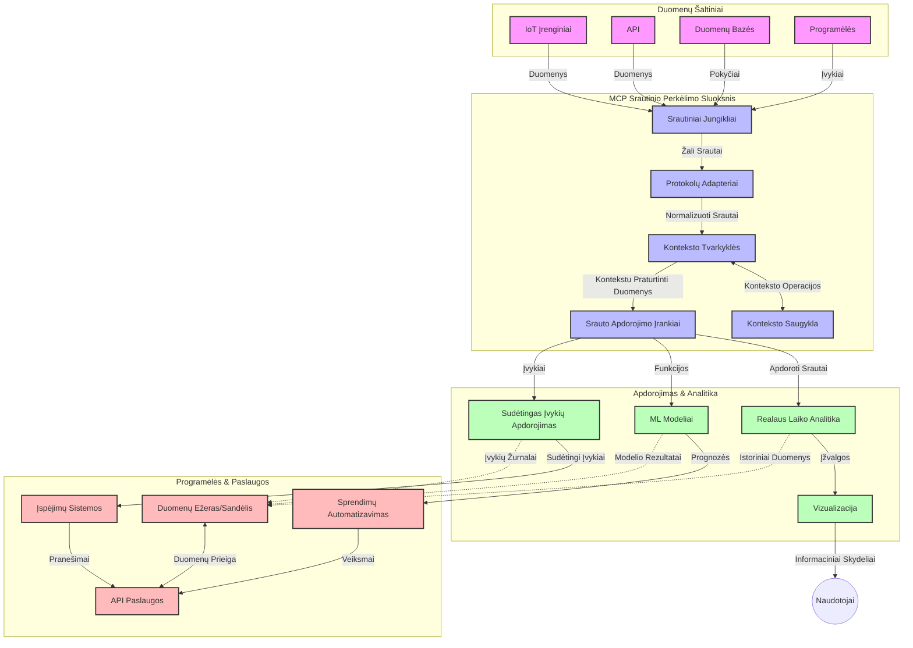

# Modelio konteksto protokolas realaus laiko duomenų transliavimui

## Apžvalga

Realaus laiko duomenų transliavimas tapo esminis šiandienos duomenimis pagrįstame pasaulyje, kur verslai ir programos reikalauja skubaus prieigos prie informacijos, kad galėtų priimti laiku sprendimus. Modelio konteksto protokolas (MCP) žymi reikšmingą pažangą optimizuojant šiuos realaus laiko transliavimo procesus, gerinant duomenų apdorojimo efektyvumą, išlaikant kontekstinį integralumą ir gerinant bendrą sistemos veikimą.

Šis modulis nagrinėja, kaip MCP transformuoja realaus laiko duomenų transliavimą, suteikdamas standartizuotą požiūrį į konteksto valdymą tarp dirbtinio intelekto modelių, transliavimo platformų ir programų.

## Įvadas į realaus laiko duomenų transliavimą

Realaus laiko duomenų transliavimas yra technologinė paradigma, leidžianti nuolat perduoti, apdoroti ir analizuoti duomenis tuo metu, kai jie gaminami, leidžianti sistemoms iš karto reaguoti į naują informaciją. Skirtingai nei tradicinis partijinis apdorojimas, kuris veikia su statiniais duomenų rinkiniais, transliavimas apdoroja judančius duomenis, suteikdamas įžvalgas ir veiksmus su minimaliu delsimo laiku.

### Pagrindinės realaus laiko duomenų transliavimo sąvokos:

- **Nuolatinis duomenų srautas**: Duomenys apdorojami kaip nenutrūkstamas, niekada nesibaigiantis įvykių arba įrašų srautas.
- **Mažas delsimo laikas apdorojant**: Sistemos sukurtos sumažinti laiką tarp duomenų generavimo ir apdorojimo.
- **Mastelio keičiamumas**: Transliavimo architektūros turi sugebėti tvarkyti kintamą duomenų kiekį ir greitį.
- **Gedimų tolerancija**: Sistemos turi būti atsparios gedimams, kad užtikrintų nepertraukiamą duomenų srautą.
- **Valstybės laikymas**: Konteksto palaikymas tarp įvykių yra svarbus prasmingai analizei.

### Modelio konteksto protokolas ir realaus laiko transliavimas

Modelio konteksto protokolas (MCP) sprendžia kelias svarbias problemas realaus laiko transliavimo aplinkose:

1. **Kontekstinė tęstinumas**: MCP standartizuoja, kaip kontekstas palaikomas tarp paskirstytų transliavimo komponentų, užtikrindamas, kad DI modeliai ir apdorojimo mazgai turėtų prieigą prie svarbios istorinės ir aplinkos konteksto.

2. **Efektyvus būsenos valdymas**: Pateikdamas struktūruotus mechanizmus konteksto perdavimui, MCP sumažina būsenos valdymo naštą transliavimo vamzdynuose.

3. **Sąveikumas**: MCP sukuria bendrą kalbą konteksto dalinimuisi tarp įvairių transliavimo technologijų ir DI modelių, leidžiant lankstesnes ir išplečiamos architektūras.

4. **Transliavimui optimizuotas kontekstas**: MCP įgyvendinimai gali prioritetizuoti, kurie konteksto elementai yra svarbiausi realaus laiko sprendimų priėmimui, optimizuojant tiek našumą, tiek tikslumą.

5. **Adaptuojamas apdorojimas**: Tinkamai valdant kontekstą per MCP, transliavimo sistemos gali dinamiškai reguliuoti apdorojimą pagal kintančias sąlygas ir modelius duomenyse.

Šiuolaikinėse programose, pradedant nuo IoT jutiklių tinklų iki finansinių prekybos platformų, MCP integracija su transliavimo technologijomis leidžia atlikti intelektualesnį, kontekstualiai suvokiamą apdorojimą, galintį tinkamai reaguoti į sudėtingas, besikeičiančias situacijas realiuoju laiku.

## Mokymosi tikslai

Pasibaigus pamokai, jūs galėsite:

- Suprasti realaus laiko duomenų transliavimo pagrindus ir jo iššūkius
- Paaiškinti, kaip Modelio konteksto protokolas (MCP) pagerina realaus laiko duomenų transliavimą
- Įgyvendinti MCP pagrindu veikiančius transliavimo sprendimus naudojant populiarias sistemas, tokias kaip Kafka ir Pulsar
- Projektuoti ir diegti gedimų tolerantiškas, didelio našumo transliavimo architektūras su MCP
- Taikyti MCP koncepcijas IoT, finansinių sandorių ir DI pagrindu atliekamos analizės atvejuose
- Vertinti naujus trendus ir būsimus MCP pagrindu sukuriamus transliavimo technologijų sprendimus


### Apibrėžimas ir reikšmė

Realaus laiko duomenų transliavimas apima nuolatinį duomenų generavimą, apdorojimą ir tiekimą su minimaliu vėlavimu. Skirtingai nuo partijinio apdorojimo, kai duomenys renkami ir apdorojami grupėmis, transliuojami duomenys apdorojami palaipsniui jiems atvykstant, leidžiant nedelsiant gauti įžvalgas ir atlikti veiksmus.

Pagrindinės realaus laiko duomenų transliavimo savybės yra:

- **Mažas vėlavimas**: Duomenų apdorojimas ir analizė per milisekundes ar sekundes
- **Nuolatinis srautas**: Nenutrūkstami duomenų srautai iš įvairių šaltinių
- **Nedelsiantis apdorojimas**: Duomenų analizė atkeliavus, o ne partijomis
- **Įvykių varoma architektūra**: Reagavimas į įvykius juos įvykstant

### Iššūkiai tradiciniame duomenų transliavime

Tradiciniai duomenų transliavimo metodai susiduria su keliais apribojimais:

1. **Konteksto praradimas**: Sunku palaikyti kontekstą paskirstytose sistemose
2. **Mastelio keitimo problemos**: Iššūkiai tvarkant didelio tūrio ir spartaus duomenų srautus
3. **Integracijos sudėtingumas**: Sąveikos problemos tarp skirtingų sistemų
4. **Delsimo valdymas**: Balansavimo tarp pralaidumo ir apdorojimo laiko klausimai
5. **Duomenų nuoseklumas**: Užtikrinti duomenų tikslumą ir pilnumą sraute

## Modelio konteksto protokolo (MCP) supratimas

### Kas yra MCP?

Modelio konteksto protokolas (MCP) yra standartizuotas komunikacijos protokolas, sukurtas palengvinti efektyvų bendravimą tarp DI modelių ir programų. Realaus laiko duomenų transliavimo kontekste MCP suteikia pagrindą:

- Konteksto išlaikymui per duomenų vamzdyną
- Standartizuoti duomenų mainų formatus
- Optimizuoti didelių duomenų rinkinių perdavimą
- Pagerinti modelių tarpusavio bei modelių ir programų komunikaciją

### Pagrindinės sudedamosios dalys ir architektūra

MCP architektūra realaus laiko transliavimui susideda iš kelių svarbių komponentų:

1. **Konteksto tvarkytojai**: Valdo ir palaiko kontekstinę informaciją per transliavimo vamzdyną
2. **Srautų procesoriai**: Apdoroja įeinančius duomenų srautus naudojant kontekstualiai jautrias technikas
3. **Protokolo adapteriai**: Konvertuoja tarp skirtingų transliavimo protokolų išlaikant kontekstą
4. **Konteksto saugykla**: Efektyviai saugo ir atkūria kontekstinę informaciją
5. **Transliavimo jungtys**: Susijungia su įvairiomis transliavimo platformomis (Kafka, Pulsar, Kinesis ir kt.)



### Kaip MCP pagerina realaus laiko duomenų apdorojimą

MCP sprendžia tradicinius transliavimo iššūkius per:

- **Kontekstinį integralumą**: Išlaikant ryšius tarp duomenų taškų per visą vamzdyną
- **Optimizuotą perdavimą**: Sumažinant duomenų mainų perteklinumą per intelektualų konteksto valdymą
- **Standartizuotas sąsajas**: Suteikiant nuoseklius API transliavimo komponentams
- **Sumažintą delsimą**: Mažinant apdorojimo naštą per efektyvų konteksto tvarkymą
- **Pagerintą mastelio keitimą**: Remiant horizontalaus mastelio keitimo galimybes išlaikant kontekstą

## Integracija ir įgyvendinimas

Realaus laiko duomenų transliavimo sistemos reikalauja kruopštaus architektūrinio dizaino ir įgyvendinimo, siekiant išlaikyti tiek našumą, tiek kontekstinį integralumą. Modelio konteksto protokolas suteikia standartizuotą požiūrį integruojant DI modelius ir transliavimo technologijas, leidžiant sudėtingesnius ir kontekstualiai suvokiamus apdorojimo vamzdynus.

### MCP integracijos apžvalga transliavimo architektūrose

Įgyvendinant MCP realaus laiko transliavimo aplinkoje reikia atsižvelgti į keletą svarbių aspektų:

1. **Konteksto serializacija ir perdavimas**: MCP suteikia efektyvius mechanizmus kontekstinei informacijai koduoti transliavimo duomenų paketuose, užtikrinant, kad esminis kontekstas keliauja kartu su duomenimis per apdorojimo vamzdyną. Tai apima standartizuotus serializacijos formatus, optimizuotus transliavimo perdavimui.

2. **Valstybės laikymas srautuose**: MCP leidžia protingesnį valstybės apdorojimą palaikant nuoseklų konteksto vaizdavimą per apdorojimo mazgus. Tai ypač vertinga paskirstytose transliavimo architektūrose, kur būsenos valdymas tradiciškai yra sudėtingas.

3. **Įvykio laikas vs. apdorojimo laikas**: MCP įgyvendinimai transliavimo sistemose turi spręsti įprastą iššūkį atskirti, kada įvykiai įvyko ir kada jie apdoroti. Protokolas gali įtraukti laiko kontekstą, saugantį įvykių laiko semantiką.

4. **Atgalinio spaudimo valdymas**: Standartizuodamas konteksto tvarkymą, MCP padeda valdyti atgalinį spaudimą transliavimo sistemose, leidžiant komponentams perduoti savo apdorojimo galimybes ir pagal tai reguliuoti srautus.

5. **Konteksto langų ir agregavimas**: MCP palengvina sudėtingesnes langų operacijas, pateikdamas struktūrizuotus temporalaus ir reliatyvaus konteksto vaizdavimus, leidžiančius prasmingesnes agregacijas per įvykių srautus.

6. **Tikslus vienkartinis apdorojimas**: Transliavimo sistemose, kur reikalingas tikslus vienkartinis apdorojimas, MCP gali įtraukti apdorojimo metaduomenis, padedančius sekti ir patvirtinti apdorojimo būklę paskirstytuose komponentuose.

Įgyvendinimas MCP daugybėje transliavimo technologijų sukuria vieningą konteksto valdymo būdą, mažindamas poreikį rašyti specialų integracijos kodą ir pagerindamas sistemos gebėjimą išlaikyti prasmingą kontekstą, kai duomenys teka vamzdynu.

### MCP įvairiose duomenų transliavimo sistemose

Šie pavyzdžiai atitinka dabartinę MCP specifikaciją, kuri remiasi JSON-RPC pagrindu sukurtu protokolu su atskiromis perdavimo mechanikomis. Kode parodyta, kaip galite įgyvendinti pasirinktinius perdavimus, integruojančius transliavimo platformas, tokias kaip Kafka ir Pulsar, išlaikant visišką suderinamumą su MCP protokolu.

Pavyzdžiai skirti parodyti, kaip transliavimo platformos gali būti integruotos su MCP, kad suteiktų realaus laiko duomenų apdorojimą išlaikant esminį MCP kontekstualų suvokimą. Šis požiūris užtikrina, kad kodo pavyzdžiai tiksliai atspindi dabartinę MCP specifikacijos būklę 2025 metų birželio mėn.

MCP gali būti integruotas su populiariomis transliavimo sistemomis, įskaitant:

#### Apache Kafka integracija

```python
import asyncio
import json
from typing import Dict, Any, Optional
from confluent_kafka import Consumer, Producer, KafkaError
from mcp.client import Client, ClientCapabilities
from mcp.core.message import JsonRpcMessage
from mcp.core.transports import Transport

# Tinkinta transporto klasė MCP ir Kafka tiltui
class KafkaMCPTransport(Transport):
    def __init__(self, bootstrap_servers: str, input_topic: str, output_topic: str):
        self.bootstrap_servers = bootstrap_servers
        self.input_topic = input_topic
        self.output_topic = output_topic
        self.producer = Producer({'bootstrap.servers': bootstrap_servers})
        self.consumer = Consumer({
            'bootstrap.servers': bootstrap_servers,
            'group.id': 'mcp-client-group',
            'auto.offset.reset': 'earliest'
        })
        self.message_queue = asyncio.Queue()
        self.running = False
        self.consumer_task = None
        
    async def connect(self):
        """Connect to Kafka and start consuming messages"""
        self.consumer.subscribe([self.input_topic])
        self.running = True
        self.consumer_task = asyncio.create_task(self._consume_messages())
        return self
        
    async def _consume_messages(self):
        """Background task to consume messages from Kafka and queue them for processing"""
        while self.running:
            try:
                msg = self.consumer.poll(1.0)
                if msg is None:
                    await asyncio.sleep(0.1)
                    continue
                
                if msg.error():
                    if msg.error().code() == KafkaError._PARTITION_EOF:
                        continue
                    print(f"Consumer error: {msg.error()}")
                    continue
                
                # Parsinti žinutės reikšmę kaip JSON-RPC
                try:
                    message_str = msg.value().decode('utf-8')
                    message_data = json.loads(message_str)
                    mcp_message = JsonRpcMessage.from_dict(message_data)
                    await self.message_queue.put(mcp_message)
                except Exception as e:
                    print(f"Error parsing message: {e}")
            except Exception as e:
                print(f"Error in consumer loop: {e}")
                await asyncio.sleep(1)
    
    async def read(self) -> Optional[JsonRpcMessage]:
        """Read the next message from the queue"""
        try:
            message = await self.message_queue.get()
            return message
        except Exception as e:
            print(f"Error reading message: {e}")
            return None
    
    async def write(self, message: JsonRpcMessage) -> None:
        """Write a message to the Kafka output topic"""
        try:
            message_json = json.dumps(message.to_dict())
            self.producer.produce(
                self.output_topic,
                message_json.encode('utf-8'),
                callback=self._delivery_report
            )
            self.producer.poll(0)  # Sukelti atgalinius kvietimus
        except Exception as e:
            print(f"Error writing message: {e}")
    
    def _delivery_report(self, err, msg):
        """Kafka producer delivery callback"""
        if err is not None:
            print(f'Message delivery failed: {err}')
        else:
            print(f'Message delivered to {msg.topic()} [{msg.partition()}]')
    
    async def close(self) -> None:
        """Close the transport"""
        self.running = False
        if self.consumer_task:
            self.consumer_task.cancel()
            try:
                await self.consumer_task
            except asyncio.CancelledError:
                pass
        self.consumer.close()
        self.producer.flush()

# Pavyzdinis Kafka MCP transporto naudojimas
async def kafka_mcp_example():
    # Sukurti MCP klientą su Kafka transportu
    client = Client(
        {"name": "kafka-mcp-client", "version": "1.0.0"},
        ClientCapabilities({})
    )
    
    # Sukurti ir prijungti Kafka transportą
    transport = KafkaMCPTransport(
        bootstrap_servers="localhost:9092",
        input_topic="mcp-responses",
        output_topic="mcp-requests"
    )
    
    await client.connect(transport)
    
    try:
        # Inicializuoti MCP sesiją
        await client.initialize()
        
        # Pavyzdys, kaip vykdyti įrankį per MCP
        response = await client.execute_tool(
            "process_data",
            {
                "data": "sample data",
                "metadata": {
                    "source": "sensor-1",
                    "timestamp": "2025-06-12T10:30:00Z"
                }
            }
        )
        
        print(f"Tool execution response: {response}")
        
        # Švarus išjungimas
        await client.shutdown()
    finally:
        await transport.close()

# Paleisti pavyzdį
if __name__ == "__main__":
    asyncio.run(kafka_mcp_example())
```

#### Apache Pulsar įgyvendinimas

```python
import asyncio
import json
import pulsar
from typing import Dict, Any, Optional
from mcp.core.message import JsonRpcMessage
from mcp.core.transports import Transport
from mcp.server import Server, ServerOptions
from mcp.server.tools import Tool, ToolExecutionContext, ToolMetadata

# Sukurkite pasirinktą MCP transportą, kuris naudoja Pulsar
class PulsarMCPTransport(Transport):
    def __init__(self, service_url: str, request_topic: str, response_topic: str):
        self.service_url = service_url
        self.request_topic = request_topic
        self.response_topic = response_topic
        self.client = pulsar.Client(service_url)
        self.producer = self.client.create_producer(response_topic)
        self.consumer = self.client.subscribe(
            request_topic,
            "mcp-server-subscription",
            consumer_type=pulsar.ConsumerType.Shared
        )
        self.message_queue = asyncio.Queue()
        self.running = False
        self.consumer_task = None
    
    async def connect(self):
        """Connect to Pulsar and start consuming messages"""
        self.running = True
        self.consumer_task = asyncio.create_task(self._consume_messages())
        return self
    
    async def _consume_messages(self):
        """Background task to consume messages from Pulsar and queue them for processing"""
        while self.running:
            try:
                # Neblokuojantis gavimas su laiko limitu
                msg = self.consumer.receive(timeout_millis=500)
                
                # Apdorokite pranešimą
                try:
                    message_str = msg.data().decode('utf-8')
                    message_data = json.loads(message_str)
                    mcp_message = JsonRpcMessage.from_dict(message_data)
                    await self.message_queue.put(mcp_message)
                    
                    # Patvirtinkite pranešimą
                    self.consumer.acknowledge(msg)
                except Exception as e:
                    print(f"Error processing message: {e}")
                    # Neigiamai patvirtinkite, jei įvyko klaida
                    self.consumer.negative_acknowledge(msg)
            except Exception as e:
                # Tvarkykite laiko limitą arba kitas išimtis
                await asyncio.sleep(0.1)
    
    async def read(self) -> Optional[JsonRpcMessage]:
        """Read the next message from the queue"""
        try:
            message = await self.message_queue.get()
            return message
        except Exception as e:
            print(f"Error reading message: {e}")
            return None
    
    async def write(self, message: JsonRpcMessage) -> None:
        """Write a message to the Pulsar output topic"""
        try:
            message_json = json.dumps(message.to_dict())
            self.producer.send(message_json.encode('utf-8'))
        except Exception as e:
            print(f"Error writing message: {e}")
    
    async def close(self) -> None:
        """Close the transport"""
        self.running = False
        if self.consumer_task:
            self.consumer_task.cancel()
            try:
                await self.consumer_task
            except asyncio.CancelledError:
                pass
        self.consumer.close()
        self.producer.close()
        self.client.close()

# Apibrėžkite pavyzdinį MCP įrankį, kuris apdoroja srautinį duomenį
@Tool(
    name="process_streaming_data",
    description="Process streaming data with context preservation",
    metadata=ToolMetadata(
        required_capabilities=["streaming"]
    )
)
async def process_streaming_data(
    ctx: ToolExecutionContext,
    data: str,
    source: str,
    priority: str = "medium"
) -> Dict[str, Any]:
    """
    Process streaming data while preserving context
    
    Args:
        ctx: Tool execution context
        data: The data to process
        source: The source of the data
        priority: Priority level (low, medium, high)
        
    Returns:
        Dict containing processed results and context information
    """
    # Pavyzdinis apdorojimas, naudojantis MCP kontekstą
    print(f"Processing data from {source} with priority {priority}")
    
    # Pasiekite pokalbio kontekstą iš MCP
    conversation_id = ctx.conversation_id if hasattr(ctx, 'conversation_id') else "unknown"
    
    # Grąžinkite rezultatus su patobulintu kontekstu
    return {
        "processed_data": f"Processed: {data}",
        "context": {
            "conversation_id": conversation_id,
            "source": source,
            "priority": priority,
            "processing_timestamp": ctx.get_current_time_iso()
        }
    }

# Pavyzdinė MCP serverio įgyvendinimas naudojant Pulsar transportą
async def run_mcp_server_with_pulsar():
    # Sukurkite MCP serverį
    server = Server(
        {"name": "pulsar-mcp-server", "version": "1.0.0"},
        ServerOptions(
            capabilities={"streaming": True}
        )
    )
    
    # Užregistruokite mūsų įrankį
    server.register_tool(process_streaming_data)
    
    # Sukurkite ir prijunkite Pulsar transportą
    transport = PulsarMCPTransport(
        service_url="pulsar://localhost:6650",
        request_topic="mcp-requests",
        response_topic="mcp-responses"
    )
    
    try:
        # Paleiskite serverį su Pulsar transportu
        await server.run(transport)
    finally:
        await transport.close()

# Vykdykite serverį
if __name__ == "__main__":
    asyncio.run(run_mcp_server_with_pulsar())
```

### Diegimo gerosios praktikos

Diegiant MCP realaus laiko transliavimui:

1. **Kurkite gedimų tolerancijai**:
   - Įgyvendinkite tinkamą klaidų tvarkymą
   - Naudokite dead-letter queues nesėkmingoms žinutėms
   - Projektuokite idempotentines apdorojimo funkcijas

2. **Optimizuokite našumui**:
   - Suplanuokite tinkamus buferių dydžius
   - Naudokite grupavimą, kai tinka
   - Įdiekite atgalinio spaudimo mechanizmus

3. **Stebėkite ir analizuokite**:
   - Sekite srauto apdorojimo metrikas
   - Stebėkite konteksto plitimą
   - Nustatykite perspėjimus anomalijoms

4. **Užtikrinkite srautų saugumą**:
   - Įgyvendinkite šifravimą jautriems duomenims
   - Naudokite autentifikaciją ir autorizaciją
   - Taikykite teisingas prieigos kontrolės priemones


### MCP IoT ir krašto kompiuterijoje

MCP pagerina IoT transliavimą per:

- Įrenginių konteksto išlaikymą per apdorojimo vamzdyną
- Efektyvų duomenų transliavimą iš krašto iki debesies
- Realaus laiko analizę IoT duomenų srautuose
- Įrenginių tiesioginę komunikaciją su kontekstu

Pavyzdys: Išmaniųjų miestų jutiklių tinklai
```
Sensors → Edge Gateways → MCP Stream Processors → Real-time Analytics → Automated Responses
```

### Vaidmuo finansiniuose sandoriuose ir didelio dažnio prekyboje

MCP suteikia reikšmingų privalumų finansinių duomenų transliavimui:

- Labai mažas vėlavimas prekybos sprendimams
- Sandorių konteksto palaikymas per visą apdorojimą
- Sudėtingas įvykių apdorojimas su kontekstiniu suvokimu
- Duomenų nuoseklumo užtikrinimas paskirstytose prekybos sistemose

### DI pagrįstos duomenų analizės tobulinimas

MCP kuria naujas galimybes transliavimo analitikai:

- Realaus laiko modelių mokymas ir išvados
- Nuolatinis mokymasis iš transliuojamų duomenų
- Kontekstualiai informuota požymių išgavimas
- Daugmodelių išvadų vamzdynai su išlaikytu kontekstu

## Ateities tendencijos ir naujovės

### MCP evoliucija realaus laiko aplinkose

Žvelgiant į priekį, tikimasi, kad MCP vystysis spręsdamas:

- **Kvantinį skaičiavimą**: Pasiruošimą kvantinius pagrindžiamoms transliavimo sistemoms
- **Krašto gimtąjį apdorojimą**: Daugiau kontekstualiai svarbaus apdorojimo perkėlimą į krašto įrenginius
- **Autonominį srautų valdymą**: Savioptimizuojančius transliavimo vamzdynus
- **Federuotą transliavimą**: Paskirstytą apdorojimą išlaikant privatumo apsaugą

### Potencialūs technologiniai patobulinimai

Atsirandančios technologijos, formuosiančios MCP transliavimą ateityje:

1. **AI optimizuoti transliavimo protokolai**: Specialiai DI užduotims sukurti protokolai
2. **Neuromorfinis skaičiavimas**: Smegenų įkvėptas skaičiavimas srautų apdorojimui
3. **Serverless transliavimas**: Įvykių valdomas, keičiantis mastą transliavimas be infrastruktūros valdymo
4. **Paskirstytos konteksto saugyklos**: Pasaulinės paskirstytos, bet labai nuoseklios konteksto valdymo sistemos

## Praktiniai užsiėmimai

### Užduotis 1: Pagrindinio MCP transliavimo vamzdyno nustatymas

Šioje užduotyje sužinosite, kaip:
- Suplanuoti pagrindinę MCP transliavimo aplinką
- Įgyvendinti konteksto tvarkytojus srautų apdorojimui
- Ištestuoti ir patvirtinti konteksto išsaugojimą

### Užduotis 2: Realaus laiko analizės informacijos panelio kūrimas

Sukurkite visą programą, kuri:
- Priima duomenis naudojant MCP
- Apdoroja srautą išlaikydama kontekstą
- Vizualizuoja rezultatus realiu laiku

### Užduotis 3: Sudėtingo įvykių apdorojimo įgyvendinimas su MCP

Pažangi užduotis apimanti:
- Modelių aptikimą srautuose
- Kontekstinę koreliaciją tarp kelių srautų
- Sudėtingų įvykių generavimą išlaikant kontekstą

## Papildomi ištekliai

- [Model Context Protocol Specification](https://modelcontextprotocol.io) - Oficialioji MCP specifikacija ir dokumentacija
- [Apache Kafka Documentation](https://kafka.apache.org/documentation/) - Sužinokite apie Kafka srautų apdorojimą
- [Apache Pulsar](https://pulsar.apache.org/) - Vieninga žinučių ir transliavimo platforma
- [Streaming Systems: The What, Where, When, and How of Large-Scale Data Processing](https://www.oreilly.com/library/view/streaming-systems/9781491983867/) - Išsamus knygos šaltinis apie transliavimo architektūras
- [Microsoft Azure Event Hubs](https://learn.microsoft.com/azure/event-hubs/event-hubs-about) - Valdomos įvykių transliavimo paslaugos
- [MLflow Documentation](https://mlflow.org/docs/latest/index.html) - Skirta ML modelių sekimui ir diegimui
- [Real-Time Analytics with Apache Storm](https://storm.apache.org/releases/current/index.html) - Realaus laiko skaičiavimo apdorojimo sistema
- [Flink ML](https://nightlies.apache.org/flink/flink-ml-docs-master/) - Mašinų mokymosi biblioteka Apache Flink
- [LangChain Documentation](https://python.langchain.com/docs/get_started/introduction) - Programų kūrimas su LLMs


## Mokymosi rezultatai

Baigę šį modulį galėsite:

- Suprasti realaus laiko duomenų transliavimo pagrindus ir jo iššūkius
- Paaiškinti, kaip Modelio konteksto protokolas (MCP) pagerina realaus laiko duomenų transliavimą
- Įgyvendinti MCP pagrindu veikiančius transliavimo sprendimus naudojant populiarias sistemas, tokias kaip Kafka ir Pulsar
- Projektuoti ir diegti gedimų tolerantiškas, didelio našumo transliavimo architektūras su MCP
- Taikyti MCP koncepcijas IoT, finansinių sandorių ir DI pagrindu atliekamos analizės atvejuose
- Vertinti naujus trendus ir būsimus MCP pagrindu sukuriamus transliavimo technologijų sprendimus

## Kas toliau

- [5.11 Realtime Search](../mcp-realtimesearch/README.md)

---

<!-- CO-OP TRANSLATOR DISCLAIMER START -->
**Atsakomybės apribojimas**:
Šis dokumentas buvo išverstas naudojant dirbtinio intelekto vertimo paslaugą [Co-op Translator](https://github.com/Azure/co-op-translator). Nors siekiame tikslumo, prašome atkreipti dėmesį, kad automatiniai vertimai gali turėti klaidų ar netikslumų. Originalus dokumentas jo gimtąja kalba laikomas autoritetingu šaltiniu. Svarbiai informacijai rekomenduojama naudoti profesionalų žmogiškąjį vertimą. Mes neatsakome už jokius nesusipratimus ar neteisingą interpretaciją, kilusią naudojantis šiuo vertimu.
<!-- CO-OP TRANSLATOR DISCLAIMER END -->