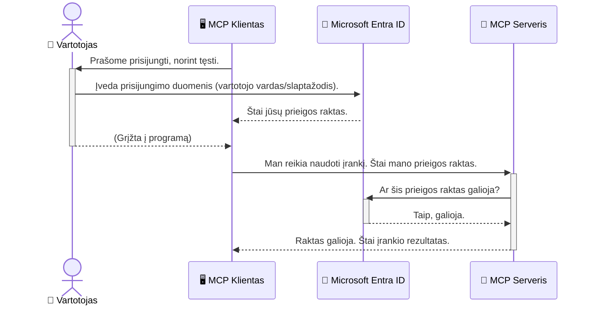

# AI darbo eigų apsauga: Entra ID autentifikavimas Model Context Protocol serveriams

## Įvadas
Jūsų Model Context Protocol (MCP) serverio apsauga yra tokia pat svarbi, kaip ir namų durų užrakinimas. Palikus MCP serverį atvirą, jūsų įrankiai ir duomenys tampa pažeidžiami neteisėtam prieigos gavimui, kas gali lemti saugumo pažeidimus. Microsoft Entra ID siūlo tvirtą debesyje pagrįstą tapatybės ir prieigos valdymo sprendimą, užtikrinantį, kad su jūsų MCP serveriu sąveikautų tik autorizuoti vartotojai ir programos. Šiame skyriuje sužinosite, kaip apsaugoti savo AI darbo eigas naudojant Entra ID autentifikavimą.

## Mokymosi tikslai
Šio skyriaus pabaigoje galėsite:

- Suprasti MCP serverių apsaugos svarbą.
- Išaiškinti Microsoft Entra ID ir OAuth 2.0 autentifikavimo pagrindus.
- Atpažinti skirtumą tarp viešųjų ir konfidencialių klientų.
- Įgyvendinti Entra ID autentifikavimą tiek vietiniuose (viešojo kliento), tiek nuotoliniuose (konfidencialaus kliento) MCP serverių scenarijuose.
- Taikyti geriausias saugumo praktikas kuriant AI darbo eigas.

## Saugumas ir MCP

Kaip ir neužrakintumėte namų priekinės durys, neturėtumėte palikti MCP serverio atviro bet kam. AI darbo eigų apsauga yra būtina stiprioms, patikimoms ir saugioms programoms kurti. Šiame skyriuje susipažinsite, kaip naudoti Microsoft Entra ID MCP serverių apsaugai, užtikrinant, kad tik autorizuoti vartotojai ir programos galėtų naudotis jūsų įrankiais ir duomenimis.

## Kodėl saugumas svarbus MCP serveriams

Įsivaizduokite, kad jūsų MCP serveryje yra įrankis, galintis siųsti el. laiškus arba pasiekti klientų duomenų bazę. Nesaugus serveris reikštų, kad bet kas galėtų naudotis šiuo įrankiu, kas leistų neteisėtai prieiti prie duomenų, siųsti šlamštą ar vykdyti kitas kenksmingas veiklas.

Įgyvendindami autentifikaciją, užtikrinate, kad kiekvienas užklausos atsiuntimas į serverį būtų patikrintas, patvirtinant užklausos pateikėjo tapatybę. Tai pirmasis ir svarbiausias žingsnis apsaugant jūsų AI darbo eigas.

## Įvadas į Microsoft Entra ID

[**Microsoft Entra ID**](https://adoption.microsoft.com/microsoft-security/entra/) yra debesyje veikianti tapatybės ir prieigos valdymo paslauga. Galvokite apie ją kaip universalią apsaugą jūsų programoms. Ji tvarko sudėtingą vartotojų tapatybės patikros (autentifikacijos) procesą ir nustato, ką vartotojai gali daryti (autorizaciją).

Naudodami Entra ID galite:

- Leisti vartotojams saugiai prisijungti.
- Apsaugoti API ir paslaugas.
- Valdyti prieigos politiką iš centrinės vietos.

MCP serveriams Entra ID suteikia tvirtą ir plačiai patikimą sprendimą, leidžiantį valdyti, kas gali pasiekti jūsų serverio funkcijas.

---

## Suprasti magiją: kaip veikia Entra ID autentifikacija

Entra ID naudoja atvirus standartus, tokius kaip **OAuth 2.0**, autentifikacijos valdymui. Nors detalės gali būti sudėtingos, pagrindinė idėja paprasta ir gali būti suprasta naudojant analogiją.

### Švelnus įvadas į OAuth 2.0: Valet rakto pavyzdys

Įsivaizduokite OAuth 2.0 kaip valet paslaugą jūsų automobiliui. Kai atvykstate į restoraną, jūs neįteikiate valetyje pilno automobilio rakto. Vietoj to duodate **valet raktą**, kuris turi ribotas teises – gali užvesti automobilį ir užrakinti duris, bet negali atidaryti bagažinės ar pirštinės skyrelio.

Šioje analogijoje:

- **Jūs** esate **vartotojas**.
- **Jūsų automobilis** yra **MCP serveris** su vertingais įrankiais ir duomenimis.
- **Valet** yra **Microsoft Entra ID**.
- **Automobilių stovėjimo prižiūrėtojas** yra **MCP klientas** (programa, bandanti prisijungti prie serverio).
- **Valet raktas** yra **prieigos žetonas**.

Prieigos žetonas yra saugus teksto eilutė, kurią MCP klientas gauna iš Entra ID prisijungus. Klientas kiekvienam užklausos atsiuntimui pateikia šį žetoną MCP serveriui. Serveris patikrina žetoną, kad įsitikintų, jog užklausa yra teisėta ir kad klientas turi reikiamas teises, o tai daroma be faktinio slaptažodžio valdymo.

### Autentifikacijos eiga

Štai kaip šis procesas veikia praktiškai:



### Microsoft Authentication Library (MSAL) pristatymas

Prieš pradedant su kodu, svarbu pristatyti pagrindinę dalį, kurią pamatysite pavyzdžiuose: **Microsoft Authentication Library (MSAL)**.

MSAL yra Microsoft sukurta biblioteka, kuri palengvina kūrėjams autentifikacijos valdymą. Vietoje to, kad rašytumėte sudėtingą kodą saugumo žetonų tvarkymui, prisijungimų valdymui ir sesijų atnaujinimui, MSAL atlieka šiuos darbus už jus.

Naudoti MSAL labai rekomenduojama, nes:

- **Ji saugi:** įgyvendina pramonės standartų protokolus ir geriausias saugumo praktikas, mažindama riziką savo kode turėti spragų.
- **Palengvina kūrimą:** abstrahuoja OAuth 2.0 ir OpenID Connect sudėtingumą, leidžiant vos keliomis eilutėmis pridėti tvirtą autentifikaciją į programą.
- **Ji palaikoma:** Microsoft aktyviai atnaujina ir prižiūri MSAL, kad apsaugotų nuo naujų saugumo grėsmių ir atnaujintų platformų pokyčius.

MSAL palaiko daug programavimo kalbų ir programų karkasų, įskaitant .NET, JavaScript/TypeScript, Python, Java, Go bei mobiliąsias platformas kaip iOS ir Android. Tai reiškia, kad galite taikyti nuoseklius autentifikacijos modelius visame savo technologijų komplekte.

Daugiau apie MSAL galite sužinoti oficialioje [MSAL apžvalgos dokumentacijoje](https://learn.microsoft.com/entra/identity-platform/msal-overview).

---

## Jūsų MCP serverio apsauga naudojant Entra ID: žingsnis po žingsnio

Dabar pereikime, kaip apsaugoti vietinį MCP serverį (kuris bendrauja per `stdio`) naudojant Entra ID. Šis pavyzdys naudoja **viešą klientą**, tinkantį programoms, veikiančioms vartotojo mašinoje, pavyzdžiui, darbalaukio programai ar vietinio vystymo serveriui.

### Scenarijus 1: Vietinio MCP serverio apsauga (su viešu klientu)

Šiame scenarijuje aptarsime MCP serverį, kuris veikia vietoje, bendrauja per `stdio` ir naudoja Entra ID vartotojo autentifikavimui prieš suteikdamas prieigą prie įrankių. Serveryje bus įrankis, kuris gauna vartotojo profilio informaciją iš Microsoft Graph API.

#### 1. Programos sukūrimas Entra ID

Prieš rašant kodą, turite užregistruoti savo programą Microsoft Entra ID. Tai informuoja Entra ID apie jūsų programą ir suteikia teises naudotis autentifikacijos paslauga.

1. Eikite į **[Microsoft Entra portalą](https://entra.microsoft.com/)**.
2. Pasirinkite **App registrations** ir spustelėkite **New registration**.
3. Suteikite programai pavadinimą (pvz., „My Local MCP Server“).
4. Skiltyje **Supported account types** pasirinkite **Accounts in this organizational directory only**.
5. Šiame pavyzdyje **Redirect URI** palikite tuščią.
6. Spauskite **Register**.

Užregistravus, užsirašykite **Application (client) ID** ir **Directory (tenant) ID** – šios reikės kodo rašyme.

#### 2. Kodo analizė

Pažiūrėkime pagrindines kodo dalis, valdančias autentifikaciją. Visas šio pavyzdžio kodas yra [Entra ID - Local - WAM](https://github.com/Azure-Samples/mcp-auth-servers/tree/main/src/entra-id-local-wam) kataloge [mcp-auth-servers GitHub saugykloje](https://github.com/Azure-Samples/mcp-auth-servers).

**`AuthenticationService.cs`**

Ši klasė atsakinga už sąveiką su Entra ID.

- **`CreateAsync`**: inicializuoja `PublicClientApplication` iš MSAL. Ji konfigūruojama jūsų programos `clientId` ir `tenantId`.
- **`WithBroker`**: leidžia naudoti brokerį (pvz., Windows Web Account Manager), suteikiantį saugesnį ir sklandesnį vieno prisijungimo patirtį.
- **`AcquireTokenAsync`**: pagrindinis metodas. Iš pradžių bando tyliai gauti žetoną (jei vartotojas jau turi galiojančią sesiją, jam nereikia vėl prisijungti). Jei tyliai žetonas negali būti gautas, vartotojui bus pasiūlyta prisijungti interaktyviai.

```csharp
// Simplified for clarity
public static async Task<AuthenticationService> CreateAsync(ILogger<AuthenticationService> logger)
{
    var msalClient = PublicClientApplicationBuilder
        .Create(_clientId) // Your Application (client) ID
        .WithAuthority(AadAuthorityAudience.AzureAdMyOrg)
        .WithTenantId(_tenantId) // Your Directory (tenant) ID
        .WithBroker(new BrokerOptions(BrokerOptions.OperatingSystems.Windows))
        .Build();

    // ... cache registration ...

    return new AuthenticationService(logger, msalClient);
}

public async Task<string> AcquireTokenAsync()
{
    try
    {
        // Try silent authentication first
        var accounts = await _msalClient.GetAccountsAsync();
        var account = accounts.FirstOrDefault();

        AuthenticationResult? result = null;

        if (account != null)
        {
            result = await _msalClient.AcquireTokenSilent(_scopes, account).ExecuteAsync();
        }
        else
        {
            // If no account, or silent fails, go interactive
            result = await _msalClient.AcquireTokenInteractive(_scopes).ExecuteAsync();
        }

        return result.AccessToken;
    }
    catch (Exception ex)
    {
        _logger.LogError(ex, "An error occurred while acquiring the token.");
        throw; // Optionally rethrow the exception for higher-level handling
    }
}
```

**`Program.cs`**

Čia nustatomas MCP serveris ir integruojama autentifikacijos paslauga.

- **`AddSingleton<AuthenticationService>`**: registruoja `AuthenticationService` priklausomybių injekcijos konteineryje, kad kitos programos dalys (pvz., mūsų įrankis) galėtų jį naudoti.
- **`GetUserDetailsFromGraph` įrankis**: šis įrankis reikalauja `AuthenticationService` egzemplioriaus. Prieš pradėdamas veikti, jis kviečia `authService.AcquireTokenAsync()`, kad gautų galiojantį prieigos žetoną. Jei autentifikacija pavyksta, žetonas naudojamas kvietimui Microsoft Graph API gauti vartotojo duomenis.

```csharp
// Simplified for clarity
[McpServerTool(Name = "GetUserDetailsFromGraph")]
public static async Task<string> GetUserDetailsFromGraph(
    AuthenticationService authService)
{
    try
    {
        // This will trigger the authentication flow
        var accessToken = await authService.AcquireTokenAsync();

        // Use the token to create a GraphServiceClient
        var graphClient = new GraphServiceClient(
            new BaseBearerTokenAuthenticationProvider(new TokenProvider(authService)));

        var user = await graphClient.Me.GetAsync();

        return System.Text.Json.JsonSerializer.Serialize(user);
    }
    catch (Exception ex)
    {
        return $"Error: {ex.Message}";
    }
}
```

#### 3. Kaip viskas veikia kartu

1. Kai MCP klientas bando naudoti įrankį `GetUserDetailsFromGraph`, įrankis pirmiausia kviečia `AcquireTokenAsync`.
2. `AcquireTokenAsync` iškviečia MSAL biblioteką, kuri tikrina ar yra galiojantis žetonas.
3. Jei žetonas nerandamas, MSAL per brokerį paprašo vartotojo prisijungti su Entra ID paskyra.
4. Prisijungus vartotojui, Entra ID išduoda prieigos žetoną.
5. Įrankis gauna žetoną ir naudoja jį saugiam kvietimui į Microsoft Graph API.
6. Vartotojo duomenys grąžinami MCP klientui.

Šis procesas užtikrina, kad įrankį gali naudoti tik autentifikuoti vartotojai, efektyviai apsaugant jūsų vietinį MCP serverį.

### Scenarijus 2: Nuotolinio MCP serverio apsauga (su konfidencialiu klientu)

Kai jūsų MCP serveris veikia nuotoliniame įrenginyje (pvz., debesų serveryje) ir bendrauja per protokolą kaip HTTP Streaming, saugumo reikalavimai skiriasi. Tokiu atveju turėtumėte naudoti **konfidencialų klientą** ir **Authorization Code Flow**. Tai saugesnis metodas, nes programos slaptažodžiai niekada nėra atskleidžiami naršyklei.

Šis pavyzdys naudoja TypeScript MCP serverį, kuris naudoja Express.js HTTP užklausų tvarkymui.

#### 1. Programos sukūrimas Entra ID

Entra ID nustatymai panašūs kaip viešam klientui, bet su svarbiu skirtumu: jums reikia sukurti **kliento slaptažodį**.

1. Eikite į **[Microsoft Entra portalą](https://entra.microsoft.com/)**.
2. Jūsų programos registracijoje pasirinkite skirtuką **Certificates & secrets**.
3. Spauskite **New client secret**, pridėkite aprašymą ir spauskite **Add**.
4. **Svarbu:** Nedelsdami nukopijuokite slaptažodžio reikšmę. Jos daugiau negalėsite peržiūrėti.
5. Taip pat turite konfigūruoti **Redirect URI**. Eikite į skirtuką **Authentication**, spustelėkite **Add a platform**, pasirinkite **Web** ir įveskite savo programos redirect URI (pvz., `http://localhost:3001/auth/callback`).

> **⚠️ Svarbus saugumo patarimas:** Produkcijai Microsoft labai rekomenduoja naudoti **autentifikaciją be slaptumo** metodus, kaip **Managed Identity** arba **Workload Identity Federation**, o ne naudoti kliento slaptažodžius. Kliento slaptažodžiai gali būti paviešinti arba kompromituoti. Valdomos tapatybės suteikia saugesnį būdą, nes nereikia laikyti prisijungimo duomenų programos kode ar konfigūracijoje.
>
> Daugiau apie valdomas tapatybes ir kaip jas įgyvendinti žr. [Managed identities for Azure resources apžvalgą](https://learn.microsoft.com/entra/identity/managed-identities-azure-resources/overview).

#### 2. Kodo analizė

Šis pavyzdys naudoja sesijų pagrindu veikiančią sistemą. Vartotojui autentifikavus, serveris saugo prieigos ir atnaujinimo žetonus sesijoje ir suteikia vartotojui sesijos žetoną. Šis sesijos žetonas naudojamas tolimesnėms užklausoms. Visas pavyzdžio kodas yra [Entra ID - Confidential client](https://github.com/Azure-Samples/mcp-auth-servers/tree/main/src/entra-id-cca-session) kataloge [mcp-auth-servers GitHub saugykloje](https://github.com/Azure-Samples/mcp-auth-servers).

**`Server.ts`**

Šis failas nustato Express serverį ir MCP transporto sluoksnį.

- **`requireBearerAuth`**: tarpinė programinė įranga, sauganti `/sse` ir `/message` galinius taškus. Ji tikrina ar užklausos `Authorization` antraštėje yra galiojantis nešėjo žetonas.
- **`EntraIdServerAuthProvider`**: tai pasirinktinė klasė, įgyvendinanti `McpServerAuthorizationProvider` sąsają. Ji tvarko OAuth 2.0 procesą.
- **`/auth/callback`**: šis galinis taškas tvarko nukreipimą iš Entra ID po to, kai vartotojas prisijungė. Jis keičia autorizacijos kodą į prieigos ir atnaujinimo žetonus.

```typescript
// Supaprastinta aiškumui
const app = express();
const { server } = createServer();
const provider = new EntraIdServerAuthProvider();

// Apsaugokite SSE galinį tašką
app.get("/sse", requireBearerAuth({
  provider,
  requiredScopes: ["User.Read"]
}), async (req, res) => {
  // ... prisijungti prie transporto ...
});

// Apsaugokite žinutės galinį tašką
app.post("/message", requireBearerAuth({
  provider,
  requiredScopes: ["User.Read"]
}), async (req, res) => {
  // ... apdoroti žinutę ...
});

// Tvarkyti OAuth 2.0 atgalinį kvietimą
app.get("/auth/callback", (req, res) => {
  provider.handleCallback(req.query.code, req.query.state)
    .then(result => {
      // ... tvarkyti sėkmę ar nesėkmę ...
    });
});
```

**`Tools.ts`**

Šis failas apibrėžia MCP serverio teikiamus įrankius. Įrankis `getUserDetails` yra panašus į ankstesnį, bet gauna prieigos žetoną iš sesijos.

```typescript
// Supaprastinta aiškumui
server.setRequestHandler(CallToolRequestSchema, async (request) => {
  const { name } = request.params;
  const context = request.params?.context as { token?: string } | undefined;
  const sessionToken = context?.token;

  if (name === ToolName.GET_USER_DETAILS) {
    if (!sessionToken) {
      throw new AuthenticationError("Authentication token is missing or invalid. Ensure the token is provided in the request context.");
    }

    // Gauti Entra ID žetoną iš sesijos saugyklos
    const tokenData = tokenStore.getToken(sessionToken);
    const entraIdToken = tokenData.accessToken;

    const graphClient = Client.init({
      authProvider: (done) => {
        done(null, entraIdToken);
      }
    });

    const user = await graphClient.api('/me').get();

    // ... grąžinti vartotojo duomenis ...
  }
});
```

**`auth/EntraIdServerAuthProvider.ts`**

Ši klasė valdo logiką:

- Vartotojo nukreipimą į Entra ID prisijungimo puslapį.
- Autorizacijos kodo keitimą į prieigos žetoną.
- Žetonų saugojimą `tokenStore`.
- Prieigos žetono atnaujinimą jam pasibaigus.

#### 3. Kaip viskas veikia kartu

1. Kai vartotojas pirmą kartą bando prisijungti prie MCP serverio, `requireBearerAuth` tarpinė programinė įranga nustato, kad nėra galimos galiojančios sesijos ir nukreipia vartotoją į Entra ID prisijungimo puslapį.
2. Vartotojas prisijungia naudodamas savo Entra ID paskyrą.
3. Entra ID nukreipia vartotoją atgal į `/auth/callback` galinį tašką su autorizacijos kodu.  
4. Serveris keičia kodą į prieigos raktą ir atnaujinimo raktą, juos saugo ir sukuria sesijos raktą, kuris siunčiamas klientui.  
5. Klientas dabar gali naudoti šį sesijos raktą `Authorization` antraštėje visiems būsimams MCP serverio užklausoms.  
6. Kai kviečiamas `getUserDetails` įrankis, jis naudoja sesijos raktą, kad gautų Entra ID prieigos raktą, o tada naudoja jį kviesdamas Microsoft Graph API.

Šis srautas yra sudėtingesnis nei viešo kliento srautas, tačiau reikalingas interneto galiniams taškams. Kadangi nuotoliniai MCP serveriai yra pasiekiami per viešą internetą, jiems reikia stipresnių saugumo priemonių, kad apsisaugotų nuo neteisėtos prieigos ir galimų atakų.

## Saugumo Geriausios Praktikos

- **Visada naudokite HTTPS**: Užšifruokite ryšį tarp kliento ir serverio, kad apsaugotumėte raktus nuo perėmimo.  
- **Įgyvendinkite rolėmis pagrįstą prieigos valdymą (RBAC)**: Ne tik tikrinkite, *ar* vartotojas yra autentifikuotas, bet ir *ką* jis yra įgaliotas daryti. Galite apibrėžti roles Entra ID ir tikrinti jas savo MCP serveryje.  
- **Stebėkite ir audituokite**: Registruokite visas autentifikacijos įvykius, kad galėtumėte aptikti ir reaguoti į įtartiną veiklą.  
- **Valdykite užklausų dažnio ribojimą ir srauto kontroliavimą**: Microsoft Graph ir kitos API naudoja užklausų dažnio ribojimą, kad apsisaugotų nuo piktnaudžiavimo. Įgyvendinkite eksponentinį atsitraukimą ir bandymų pakartojimo logiką savo MCP serveryje, kad tvarkingai apdorotumėte HTTP 429 (per daug užklausų) atsakymus. Apsvarstykite galimybę kešuoti dažnai naudojamus duomenis, kad sumažintumėte API kvietimų skaičių.  
- **Saugus raktų saugojimas**: Prieigos ir atnaujinimo raktus saugokite saugiai. Vietinėms programoms naudokite sistemos saugaus saugojimo mechanizmus. Serverinėms programoms apsvarstykite galimybę naudoti užšifruotą saugyklą arba saugias raktų valdymo paslaugas, kaip Azure Key Vault.  
- **Raktų galiojimo terminų valdymas**: Prieigos raktams taikoma ribota galiojimo trukmė. Įgyvendinkite automatinį raktų atnaujinimą naudojant atnaujinimo raktus, kad užtikrintumėte sklandžią vartotojo patirtį be būtinybės pakartotinai autentifikuotis.  
- **Apsvarstykite Azure API Management naudojimą**: Nors saugumą tiesiogiai MCP serveryje įgyvendinti leidžia tiksliau kontroliuoti, API vartai, tokie kaip Azure API Management, gali automatiškai valdyti daug šių saugumo aspektų, įskaitant autentifikavimą, autorizavimą, užklausų dažnio ribojimą ir stebėjimą. Jie suteikia centralizuotą saugumo sluoksnį, kuris stovi tarp jūsų klientų ir MCP serverių. Daugiau informacijos apie API vartų naudojimą su MCP rasite mūsų [Azure API Management Your Auth Gateway For MCP Servers](https://techcommunity.microsoft.com/blog/integrationsonazureblog/azure-api-management-your-auth-gateway-for-mcp-servers/4402690).

## Pagrindinės Išvados

- Jūsų MCP serverio saugumas yra esminis duomenų ir įrankių apsaugai.  
- Microsoft Entra ID suteikia patikimą ir pritaikomą sprendimą autentifikavimui ir autorizavimui.  
- Naudokite **viešą klientą** vietinėms programoms ir **konfidencialų klientą** nuotoliniams serveriams.  
- **Autorizacijos kodo srautas** yra saugiausias pasirinkimas žiniatinklio programoms.

## Užduotis

1. Pagalvokite apie MCP serverį, kurį galėtumėte sukurti. Ar jis būtų vietinis, ar nuotolinis serveris?  
2. Remdamiesi atsakymu, ar naudotumėte viešą ar konfidencialų klientą?  
3. Kokius leidimus jūsų MCP serveris prašytų atlikti veiksmus su Microsoft Graph?

## Praktinės Užduotys

### Užduotis 1: Registruoti programą Entra ID  
Nukeliaukite į Microsoft Entra portalą.  
Užregistruokite naują programą savo MCP serveriui.  
Užsirašykite Programos (kliento) ID ir katalogo (nuomininko) ID.

### Užduotis 2: Saugoti vietinį MCP serverį (Viešas klientas)  
- Sekite kodo pavyzdį, kad integruotumėte MSAL (Microsoft Authentication Library) vartotojo autentifikavimui.  
- Išbandykite autentifikacijos srautą kviesdami MCP įrankį, kuris paima vartotojo informaciją iš Microsoft Graph.

### Užduotis 3: Saugoti nuotolinį MCP serverį (Konfidencialus klientas)  
- Užregistruokite konfidencialų klientą Entra ID ir sukurkite kliento slaptąjį raktą.  
- Konfigūruokite savo Express.js MCP serverį naudoti autorizacijos kodo srautą.  
- Išbandykite apsaugotus galinius taškus ir patvirtinkite prieigą pagal raktą.

### Užduotis 4: Taikyti geriausias saugumo praktikas  
- Įjunkite HTTPS savo vietiniam ar nuotoliniam serveriui.  
- Įgyvendinkite rolėmis pagrįstą prieigos valdymą (RBAC) serveryje.  
- Pridėkite raktų galiojimo terminų valdymą ir saugų raktų saugojimą.

## Ištekliai

1. **MSAL apžvalgos dokumentacija**  
Sužinokite, kaip Microsoft Authentication Library (MSAL) užtikrina saugų raktų gavimą įvairiose platformose:  
[MSAL Overview on Microsoft Learn](https://learn.microsoft.com/en-gb/entra/msal/overview)

2. **Azure-Samples/mcp-auth-servers GitHub repozitorijus**  
MCP serverių autentifikacijos srautų pavyzdžiai:  
[Azure-Samples/mcp-auth-servers on GitHub](https://github.com/Azure-Samples/mcp-auth-servers)

3. **Valdomų tapatybių apžvalga Azure ištekliams**  
Sužinokite, kaip atsikratyti slaptųjų raktų naudojant sistemos arba vartotojo priskirtas valdomas tapatybes:  
[Managed Identities Overview on Microsoft Learn](https://learn.microsoft.com/en-us/entra/identity/managed-identities-azure-resources/)

4. **Azure API Management: jūsų autentifikacijos vartai MCP serveriams**  
Gilus panirimas į APIM kaip saugų OAuth2 vartų sprendimą MCP serveriams:  
[Azure API Management Your Auth Gateway For MCP Servers](https://techcommunity.microsoft.com/blog/integrationsonazureblog/azure-api-management-your-auth-gateway-for-mcp-servers/4402690)

5. **Microsoft Graph leidimų nuoroda**  
Išsamus deleguotų ir programos leidimų sąrašas Microsoft Graph:  
[Microsoft Graph Permissions Reference](https://learn.microsoft.com/zh-tw/graph/permissions-reference)

## Mokymosi Rezultatai  
Baigę šią dalį sugebėsite:

- Paaiškinti, kodėl autentifikacija yra svarbi MCP serveriams ir DI darbo eigoms.  
- Nustatyti ir konfigūruoti Entra ID autentifikaciją vietiniuose ir nuotoliniuose MCP serverio scenarijuose.  
- Pasirinkti tinkamą kliento tipą (viešas ar konfidencialus) pagal serverio diegimą.  
- Įgyvendinti saugaus programavimo praktikas, įskaitant raktų saugojimą ir rolėmis pagrįstą autorizaciją.  
- Užtikrintai apsaugoti savo MCP serverį ir jo įrankius nuo neteisėtos prieigos.

## Kas toliau

- [5.13 Model Context Protocol (MCP) integracija su Microsoft Foundry](../mcp-foundry-agent-integration/README.md)

---

<!-- CO-OP TRANSLATOR DISCLAIMER START -->
**Atsakomybės apribojimas**:
Šis dokumentas buvo išverstas naudojant dirbtinio intelekto vertimo paslaugą [Co-op Translator](https://github.com/Azure/co-op-translator). Nors siekiame tikslumo, prašome atkreipti dėmesį, kad automatiniai vertimai gali turėti klaidų ar netikslumų. Originalus dokumentas jo gimtąja kalba laikomas autoritetingu šaltiniu. Svarbiai informacijai rekomenduojama naudoti profesionalų žmogiškąjį vertimą. Mes neatsakome už jokius nesusipratimus ar neteisingą interpretaciją, kilusią naudojantis šiuo vertimu.
<!-- CO-OP TRANSLATOR DISCLAIMER END -->