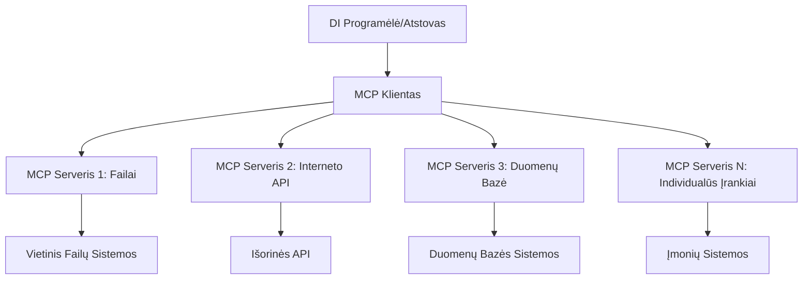

# 🌐 Modulis 2: MCP su Microsoft Foundry Toolkit pagrindais

[]()
[]()
[]()

## 📋 Mokymosi tikslai

Šio modulio pabaigoje jūs gebėsite:
- ✅ Suprasti Modelio konteksto protokolo (MCP) architektūrą ir naudą
- ✅ Išnagrinėti Microsoft MCP serverių ekosistemą
- ✅ Integruoti MCP serverius su Microsoft Foundry Toolkit Agent Builder
- ✅ Kurti funkcinį naršyklės automatizavimo agentą naudojant Playwright MCP
- ✅ Konfigūruoti ir testuoti MCP įrankius savo agentuose
- ✅ Eksportuoti ir diegti MCP palaikomus agentus gamybos naudojimui

## 🎯 Toliau nuo 1 modulio

Pirmame modulyje mes išmokome Microsoft Foundry Toolkit pagrindus ir sukūrėme pirmą Python agentą. Dabar mes **įkrausime** jūsų agentus susietais su išoriniais įrankiais ir paslaugomis per novatorišką **Modelio konteksto protokolą (MCP)**.

Įsivaizduokite tai kaip perėjimą nuo paprasto skaičiuotuvo prie pilnos kompiuterinės sistemos – jūsų AI agentai įgis galimybes:
- 🌐 Naršyti ir bendrauti su svetainėmis
- 📁 Prieiti prie failų ir juos valdyti
- 🔧 Integruotis su įmonių sistemomis
- 📊 Apdoroti realaus laiko duomenis iš API

## 🧠 Kas yra Modelio konteksto protokolas (MCP)?

### 🔍 Kas yra MCP?

Modelio konteksto protokolas (MCP) yra **„USB-C AI programoms“** – novatoriškas atviras standartas, jungiantis Didelius kalbos modelius (LLM) su išoriniais įrankiais, duomenų šaltiniais ir paslaugomis. Kaip USB-C panaikino laidų chaosas suteikdamas vieną universalų jungtį, taip MCP pašalina AI integracijos sudėtingumą per vieną standartizuotą protokolą.

### 🎯 Problemų sprendimas su MCP

**Prieš MCP:**
- 🔧 Kiekvienam įrankiui unikalios integracijos
- 🔄 Tiekėjo užrakinimas su patentuotais sprendimais
- 🔒 Saugumo spragos dėl laikinų jungčių
- ⏱️ Mėnesiai vystant paprastas integracijas

**Su MCP:**
- ⚡ Prijunk ir naudok įrankius
- 🔄 Tiekėjams nepriklausoma architektūra
- 🛡️ Įmontuotos saugumo geriausios praktikos
- 🚀 Naujas funkcionalumas per kelias minutes

### 🏗️ MCP architektūros giliai

MCP naudoja **kliento-serverio architektūrą**, sukurdama saugią, išplečiamą ekosistemą:


  
**🔧 Pagrindinės sudedamosios dalys:**

| Komponentas | Rolė | Pavyzdžiai |
|-------------|------|------------|
| **MCP Hostai** | Programos vartojančios MCP paslaugas | Claude Desktop, VS Code, Microsoft Foundry Toolkit |
| **MCP Klientai** | Protokolo tvarkytojai (1:1 su serveriais) | Integruota į host programinę įrangą |
| **MCP Serveriai** | Teikia galimybes per standartinį protokolą | Playwright, Files, Azure, GitHub |
| **Transporto sluoksnis** | Komunikacijos metodai | stdio, HTTP, WebSockets |

## 🏢 Microsoft MCP serverių ekosistema

Microsoft vadovauja MCP ekosistemai su pilnu verslo klasės serverių paketu, sprendžiančiu realias verslo problemas.

### 🌟 Pagrindiniai Microsoft MCP serveriai

#### 1. ☁️ Azure MCP Serveris  
**🔗 Repozitorija**: [azure/azure-mcp](https://github.com/azure/azure-mcp)  
**🎯 Paskirtis**: Išsamus Azure išteklių valdymas su AI integracija

**✨ Pagrindinės savybės:**
- Deklaratyvus infrastruktūros paleidimas
- Išteklių realaus laiko stebėjimas
- Sąnaudų optimizavimo rekomendacijos
- Saugumo atitikties patikra

**🚀 Naudojimo atvejai:**
- Infrastruktūra-kodas su AI pagalba
- Išteklių automatinis mastelio keitimas
- Debesijos sąnaudų optimizavimas
- DevOps darbo srautų automatizavimas

#### 2. 📊 Microsoft Dataverse MCP  
**📚 Dokumentacija**: [Microsoft Dataverse Integracija](https://go.microsoft.com/fwlink/?linkid=2320176)  
**🎯 Paskirtis**: Natūralios kalbos sąsaja verslo duomenims

**✨ Pagrindinės savybės:**
- Natūralios kalbos duomenų bazės užklausos
- Verslo konteksto supratimas
- Individualios glaustinių šablonai
- Įmonių duomenų valdymas

**🚀 Naudojimo atvejai:**
- Verslo analizės ataskaitos
- Klientų duomenų analizė
- Pardavimų proceso įžvalgos
- Atitikties duomenų užklausos

#### 3. 🌐 Playwright MCP Serveris  
**🔗 Repozitorija**: [microsoft/playwright-mcp](https://github.com/microsoft/playwright-mcp)  
**🎯 Paskirtis**: Naršyklės automatizavimas ir tinklo sąveika

**✨ Pagrindinės savybės:**
- Kryžminė naršyklių automatizacija (Chrome, Firefox, Safari)
- Išmanus elementų aptikimas
- Ekrano nuotraukų ir PDF generavimas
- Tinklo srauto stebėjimas

**🚀 Naudojimo atvejai:**
- Automatizuotos testavimo darbo eigos
- Svetainių duomenų rinkimas ir analizė
- UI/UX stebėjimas
- Konkurencinės analizės automatizavimas

#### 4. 📁 Files MCP Serveris  
**🔗 Repozitorija**: [microsoft/files-mcp-server](https://github.com/microsoft/files-mcp-server)  
**🎯 Paskirtis**: Išmanioji failų sistemos valdymas

**✨ Pagrindinės savybės:**
- Deklaratyvus failų valdymas
- Turinys sinchronizavimas
- Versijų valdymo integracija
- Metaduomenų išgavimas

**🚀 Naudojimo atvejai:**
- Dokumentacijos valdymas
- Kodo saugyklos organizavimas
- Turinys publikavimo darbo eigos
- Duomenų srauto failų tvarkymas

#### 5. 📝 MarkItDown MCP Serveris  
**🔗 Repozitorija**: [microsoft/markitdown](https://github.com/microsoft/markitdown)  
**🎯 Paskirtis**: Išplėstinis Markdown apdorojimas ir manipuliacija

**✨ Pagrindinės savybės:**
- Išsamus Markdown analizė
- Formatų konvertavimas (MD ↔ HTML ↔ PDF)
- Turinys struktūros analizė
- Šablonų apdorojimas

**🚀 Naudojimo atvejai:**
- Techninės dokumentacijos darbo eigos
- Turinys valdymo sistemos
- Ataskaitų generavimas
- Žinių bazės automatizavimas

#### 6. 📈 Clarity MCP Serveris  
**📦 Paketas**: [@microsoft/clarity-mcp-server](https://www.npmjs.com/package/@microsoft/clarity-mcp-server)  
**🎯 Paskirtis**: Svetainių analizė ir vartotojų elgsenos atskleidimas

**✨ Pagrindinės savybės:**
- Šilumos žemėlapių analizė
- Vartotojų sesijų įrašai
- Veiklos metrikos
- Konversijų tunelio analizė

**🚀 Naudojimo atvejai:**
- Svetainių optimizavimas
- Vartotojų patirties tyrimai
- A/B testavimo analizė
- Verslo analitikos skydeliai

### 🌍 Bendruomenės ekosistema

Be Microsoft serverių MCP ekosistema apima:
- **🐙 GitHub MCP**: Saugyklų valdymas ir kodo analizė
- **🗄️ Duomenų bazės MCP**: PostgreSQL, MySQL, MongoDB integracijos
- **☁️ Debesų tiekėjų MCP**: AWS, GCP, Digital Ocean įrankiai
- **📧 Komunikacijos MCP**: Slack, Teams, El. pašto integracijos

## 🛠️ Praktinė užduotis: Naršyklės automatizavimo agentas

**🎯 Projekto tikslas**: Sukurti išmanų naršyklės automatizavimo agentą, naudojant Playwright MCP serverį, kuris gali naršyti svetaines, išgauti informaciją ir atlikti sudėtingas internetines sąveikas.

### 🚀 1 etapas: Agento pagrindo sukūrimas

#### 1 žingsnis: Inicializuokite agentą  
1. **Atidarykite Microsoft Foundry Toolkit Agent Builder**  
2. **Sukurkite naują agentą** su šia konfigūracija:  
   - **Vardas**: `BrowserAgent`  
   - **Modelis**: Pasirinkite GPT-4o


### 🔧 2 etapas: MCP integracijos darbo eiga

#### 3 žingsnis: Pridėkite MCP serverio integraciją  
1. **Nueikite į įrankių skiltį** Agent Builder’e  
2. **Spauskite „Add Tool“ (Pridėti įrankį)**, kad atidarytumėte integravimo meniu  
3. **Pasirinkite „MCP Server“** iš pateiktų parinkčių


**🔍 Įrankių tipų supratimas:**
- **Įmontuoti įrankiai**: Iš anksto sukonfigūruotos Microsoft Foundry Toolkit funkcijos
- **MCP serveriai**: Išorinės paslaugų integracijos
- **Individualūs API**: Jūsų asmeniniai paslaugų taškai
- **Funkcijų iškvietimas**: Tiesioginis modelio funkcijų naudojimas

#### 4 žingsnis: MCP serverio pasirinkimas  
1. **Pasirinkite „MCP Server“** ir tęskite  


2. **Naršykite MCP katalogą** ir peržiūrėkite galimas integracijas  


### 🎮 3 etapas: Playwright MCP konfigūracija

#### 5 žingsnis: Pasirinkite ir konfigūruokite Playwright  
1. **Spauskite „Use Featured MCP Servers“** ir pasiekti Microsoft patvirtintus serverius  
2. **Pasirinkite „Playwright“** iš pasiūlymų sąrašo  
3. **Patvirtinkite numatytą MCP ID** arba pritaikykite savo aplinkai


#### 6 žingsnis: Įjunkite Playwright galimybes  
**🔑 Kritinis žingsnis**: Pasirinkite **VISAS** prieinamas Playwright funkcijas maksimaliai veikimui


**🛠️ Esminiai Playwright įrankiai:**
- **Naršymas**: `goto`, `goBack`, `goForward`, `reload`
- **Sąveika**: `click`, `fill`, `press`, `hover`, `drag`
- **Išgavimas**: `textContent`, `innerHTML`, `getAttribute`
- **Patikra**: `isVisible`, `isEnabled`, `waitForSelector`
- **Fiksavimas**: `screenshot`, `pdf`, `video`
- **Tinklas**: `setExtraHTTPHeaders`, `route`, `waitForResponse`

#### 7 žingsnis: Patikrinkite integracijos sėkmę  
**✅ Sėkmės rodikliai:**
- Visi įrankiai rodomi Agent Builder sąsajoje
- Integracijos lange nėra klaidų pranešimų
- Playwright serverio statusas rodo „Connected“


**🔧 Dažniausių problemų sprendimas:**
- **Nepavyko prisijungti**: Patikrinkite interneto ryšį ir ugniasienės nustatymus
- **Trūksta įrankių**: Įsitikinkite, kad visos funkcijos buvo pasirinktos konfigūracijos metu
- **Leidimų klaidos**: Patikrinkite, ar VS Code turi reikiamus sistemos leidimus

### 🎯 4 etapas: Pažangi užklausų inžinerija

#### 8 žingsnis: Kurkite išmanius sistemos užklausimus  
Sukurkite sudėtingus užklausimus, išnaudojančius visas Playwright galimybes:

```markdown
# Web Automation Expert System Prompt

## Core Identity
You are an advanced web automation specialist with deep expertise in browser automation, web scraping, and user experience analysis. You have access to Playwright tools for comprehensive browser control.

## Capabilities & Approach
### Navigation Strategy
- Always start with screenshots to understand page layout
- Use semantic selectors (text content, labels) when possible
- Implement wait strategies for dynamic content
- Handle single-page applications (SPAs) effectively

### Error Handling
- Retry failed operations with exponential backoff
- Provide clear error descriptions and solutions
- Suggest alternative approaches when primary methods fail
- Always capture diagnostic screenshots on errors

### Data Extraction
- Extract structured data in JSON format when possible
- Provide confidence scores for extracted information
- Validate data completeness and accuracy
- Handle pagination and infinite scroll scenarios

### Reporting
- Include step-by-step execution logs
- Provide before/after screenshots for verification
- Suggest optimizations and alternative approaches
- Document any limitations or edge cases encountered

## Ethical Guidelines
- Respect robots.txt and rate limiting
- Avoid overloading target servers
- Only extract publicly available information
- Follow website terms of service
```
  
#### 9 žingsnis: Sukurkite dinamiškus vartotojo užklausimus  
Sukurkite užklausimus, demonstruojančius įvairias funkcijas:

**🌐 Svetainės analizės pavyzdys:**  
```markdown
Navigate to github.com/kinfey and provide a comprehensive analysis including:
1. Repository structure and organization
2. Recent activity and contribution patterns  
3. Documentation quality assessment
4. Technology stack identification
5. Community engagement metrics
6. Notable projects and their purposes

Include screenshots at key steps and provide actionable insights.
```
  


### 🚀 5 etapas: Vykdymas ir testavimas

#### 10 žingsnis: Vykdykite pirmą automatiką  
1. **Spauskite „Run“** paleisti automatizacijos seką  
2. **Stebėkite vykdymą realiu laiku**:  
   - Automatiškai paleidžiama Chrome naršyklė  
   - Agentas naršo tiksline svetainę  
   - Ekrano nuotraukos fiksuoja kiekvieną svarbų žingsnį  
   - Analizės rezultatai srautu gaunami realiu laiku


#### 11 žingsnis: Analizuokite rezultatus ir įžvalgas  
Peržiūrėkite išsamią analizę Agent Builder sąsajoje:


### 🌟 6 etapas: Pažangios galimybės ir diegimas

#### 12 žingsnis: Eksportavimas ir gamybinis diegimas  
Agent Builder palaiko kelias diegimo parinktis:


## 🎓 Modulio 2 santrauka ir tolesni žingsniai

### 🏆 Pasiekimas atrakintas: MCP integracijos meistras

**✅ Įvaldyti įgūdžiai:**
- [ ] MCP architektūros ir naudos supratimas
- [ ] Microsoft MCP serverių ekosistemos pažinimas
- [ ] Playwright MCP integracija su Microsoft Foundry Toolkit
- [ ] Kompleksiški naršyklės automatizavimo agentai
- [ ] Pažangioji užklausų inžinerija internetinės automatikos srityje

### 📚 Papildomi ištekliai

- **🔗 MCP specifikacija**: [Oficiali protokolo dokumentacija](https://modelcontextprotocol.io/)
- **🛠️ Playwright API**: [Visi metodai ir aprašymai](https://playwright.dev/docs/api/class-playwright)
- **🏢 Microsoft MCP serveriai**: [Įmonių integracijos vadovas](https://github.com/microsoft/mcp-servers)
- **🌍 Bendruomenės pavyzdžiai**: [MCP serverių galerija](https://github.com/modelcontextprotocol/servers)

**🎉 Sveikiname!** Jūs sėkmingai įvaldėte MCP integraciją ir dabar galite kurti gamybai parengtus AI agentus su išoriniais įrankių gebėjimais!

### 🔜 Toliau į kitą modulį

Norite pakelti savo MCP žinias į aukštesnį lygį? Eikite į **[Modulį 3: Pažangus MCP vystymas su Microsoft Foundry Toolkit](../lab3/README.md)**, kur sužinosite kaip:
- Kurti savo pasirinktinius MCP serverius
- Konfigūruoti ir naudoti naujausią MCP Python SDK
- Nustatyti MCP inspektorių derinimui
- Įvaldyti pažangius MCP serverių kūrimo darbo srautus
- Sukurti Meteorologijos MCP serverį nuo pagrindų

---

<!-- CO-OP TRANSLATOR DISCLAIMER START -->
**Atsakomybės apribojimas**:
Šis dokumentas buvo išverstas naudojant dirbtinio intelekto vertimo paslaugą [Co-op Translator](https://github.com/Azure/co-op-translator). Nors siekiame tikslumo, prašome atkreipti dėmesį, kad automatiniai vertimai gali turėti klaidų ar netikslumų. Originalus dokumentas jo gimtąja kalba laikomas autoritetingu šaltiniu. Svarbiai informacijai rekomenduojama naudoti profesionalų žmogiškąjį vertimą. Mes neatsakome už jokius nesusipratimus ar neteisingą interpretaciją, kilusią naudojantis šiuo vertimu.
<!-- CO-OP TRANSLATOR DISCLAIMER END -->