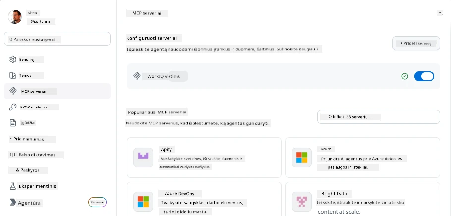
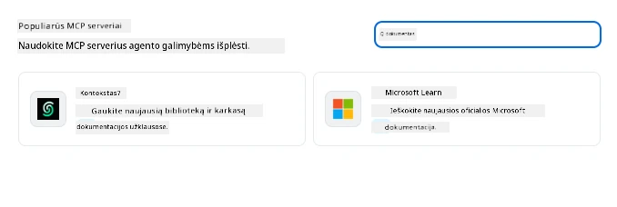
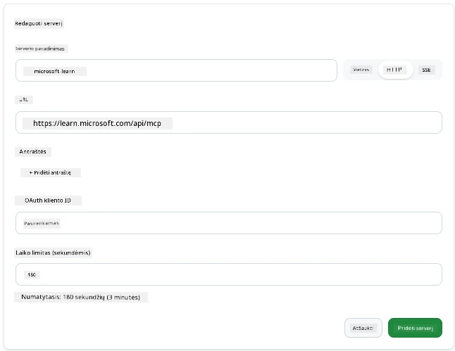
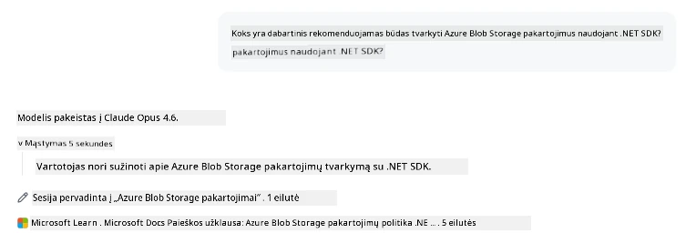
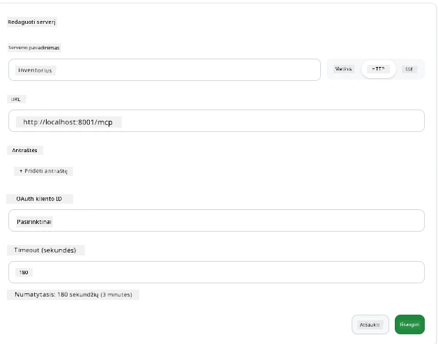
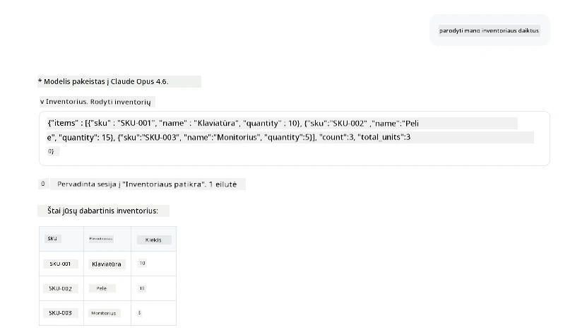
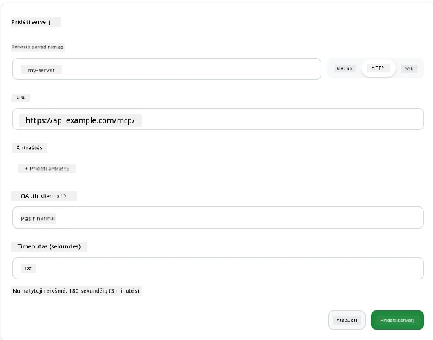
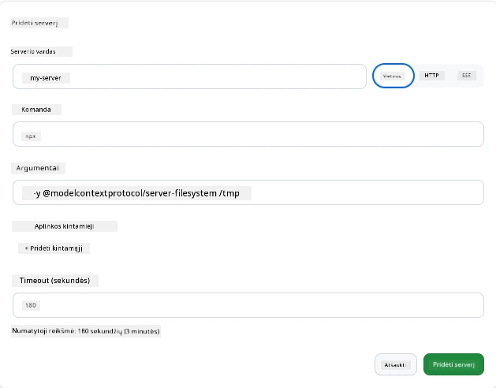

# MCP serverių naudojimas GitHub Copilot programoje

Jau žinote, kaip veikia MCP. Jūs sukūrėte serverius, apibrėžėte įrankius ir išteklius, ir sujungėte klientus. Tai, ko dar nepadarėme, yra pakeisti perspektyvą: vietoje to, kad jūs statytumėte serverį, kaip atrodo būti *vartotoju* – AI varomos programos, palaikančios MCP?

[GitHub Copilot App](https://github.com/github/app) yra darbalaukio programa, galinti naudoti MCP serverius. Prijungę MCP serverius prie jos, atrakinate naują lygį: Copilot dabar gali pasiekti jūsų dokumentaciją, iškviesti vidinius API, užklausti jūsų duomenų bazę arba kalbėtis su bet kokia paslauga, kurią apvyniojote serveryje. Programa tampa šeimininku; jūsų MCP serveriai tampa jos įrankiais.

Ši pamoka veda jus per šią patirtį nuo pradžios iki pabaigos – nuo MCP nustatymų skydelio radimo iki tikro dokumentacijos serverio prijungimo ir savo pasirinktinio serverio prijungimo.

## Mokymosi tikslai

Pamokos pabaigoje sugebėsite:

- Rasti ir naršyti MCP serverių skyrių Copilot programos nustatymuose.
- Prijungti talpinamą dokumentacijos serverį ir naudoti jį sesijoje.
- Užregistruoti pasirinktinį serverį ir patikrinti, kad Copilot galėtų iškviesti jo įrankius.
- Konfigūruoti, kaip serveris kviečiamas, pateikdami aplinkos kintamuosius arba pasirinktinius antraštes (jei HTTP)

## Copilot programa kaip MCP šeimininkas

Pagrindinė idėja: **Copilot agentai yra protingi, bet jie žino tik tai, ką jiems sakote.** Pagal numatytuosius nustatymus agentas gali skaityti failus jūsų darbo aplinkoje ir vykdyti terminalo komandas, bet jis negali užklausti jūsų duomenų bazės, patikrinti kalendoriaus ar iškviesti pasirinktinio API be pagalbos. Čia ir atsiranda MCP serveriai. Jie veikia kaip tiltai tarp Copilot ir jūsų sistemų – duomenų bazių, versijų valdymo, API, dizaino įrankių – suteikdami agentams prieigą prie informacijos ir veiksmų, būtinių užduotims atlikti.

Pradėkime nuo MCP serverių valdymo nustatymų radimo.

## 1 žingsnis: Surasti MCP nustatymų skydelį

Atidarykite Copilot programą, raskite varpelio piktogramą apatiniame kairiajame kampe ir spustelėkite ją.


Įsitikinkite, kad pasirinkote "MCP Servers" ir dabar turėtumėte matyti jau sukonfigūruotus serverius viršuje, populiarių serverių turgų apačioje ir mygtuką "Add Server" viršuje, panašiai kaip čia:



Tai jūsų valdymo centras. Čia pridėsite, pašalinsite, įgalinsite ir išjungsit serverius. Pakeitimai įsigalioja naujoms sesijoms; jei turite atidarytą sesiją, turėsite paleisti naują po šio sąrašo pakeitimų.

## 2 žingsnis: Dokumentacijos serverio prijungimas

Padarykime ką nors naudingo iš karto. Microsoft Docs MCP serveris suteikia Copilot prieigą prie oficialios Microsoft dokumentacijos. Tai apima Azure, .NET, TypeScript ir dar daugiau. Vietoje to, kad agentas remtųsi savo mokymo duomenimis (kurie turi galiojimo datą), jis gali gauti dabartinę dokumentaciją užklausos metu.

Štai kaip jį pridėti:

1. Populiarių serverių skirtuke įveskite **learn** ir pasirinkite serverį "Microsoft Learn".

   

   Spustelėjus, pasirodys forma, kurioje vardas, transporto tipas ir URL yra užpildyti iš anksto, jums tereikia paspausti "Add Server".

2. Spustelėkite "Add Server", ryšys su serveriu turėtų užtrukti kelias sekundes.

   

   Pridėjus, jis turėtų pasirodyti viršutinėje srityje kaip sukonfigūruotas serveris. Išbandykime jį dabar.

3. Uždarykite dialogą ir pasirinkite Quick chat.

4. Įveskite žemiau pateiktą užklausą, kad suaktyvintumėte įrankį Microsoft Learn serveryje.

   ```text
   What's the current recommended approach for handling Azure Blob Storage 
   retries using the .NET SDK?
   ```

   

Turėtumėte matyti, kaip jis nurodo ką tik pridėtą MCP serverį.

## 3 žingsnis: Custom stdio serverio prijungimas

Išankstiniai nustatymai yra patogūs, bet tikroji galia yra prijungiant savo serverius. Tarkime, sukūrėte serverį (ar gavote jį), kuris atskleidžia jūsų vidinį API arba įmonės žinių bazę. Šiuo atveju naudosime MCP serverį, kurį sukūrėme – jis valdo mūsų įmonės inventoriaus valdymą.

1. Paspauskite varpelio piktogramą ir vėl pasirinkite „MCP servers“.

2. Pasirinkite mygtuką "Add Server" ir "+ Add Custom server", įveskite šias reikšmes:

   - Vardas: `Inventory Server`
   - Transporto tipas (dešinėje), **http**

   Paspauskite "Add Server", jis turėtų atsirasti sukonfigūruotų serverių sąraše.

   

4. Norėdami išbandyti, paleiskite užklausą tokiu būdu:

    ```
    list inventory
    ```

   

Turėtumėte matyti inventoriaus sąrašą, grąžintą iš jūsų pasirinktinai sukurto serverio.

Puiku, dabar turėtumėte gerai suprasti, kaip pridėti išorinius ir savo MCP serverius prie Copilot programos. Toliau aptarsime, kaip tvarkyti paslaptis ir aplinkos kintamuosius.

## 4 žingsnis: Išplėstiniai nustatymai

Iki šiol matėte, kaip pridėti MCP serverius, kuriuose pateikiate tik vardą ir URL. Bet kas, jei jūsų serveriui reikia API rakto ar kitos reikšmės? Priklausomai nuo transporto tipo, galime jam suteikti reikalingus duomenis.

- **http arba SSE transportas**: Čia galime nustatyti antraštes pagal poreikį.

   Pvz., autentifikacijai galite nurodyti Authorization antraštę. Reikšmė gali būti statinis tekstas. Jei naudojate OAuth, galite vietoje to pateikti OAuth kliento ID.

   

- **stdio transportas**: Gali būti nustatyti aplinkos kintamieji.

   Čia galite nurodyti bet kokius aplinkos kintamuosius, kurių reikia, ir jie bus perduoti serveriui paleidžiant.

   

## Santrauka

Copilot programa laiko MCP serverius kaip agento galimybių pirmojo lygio plėtinius. Šioje pamokoje pamatėte pilną kelią – nuo MCP serverių pridėjimo iki jų naudojimo sesijoje. Dabar galite jungtis prie viešųjų serverių, vidinių API ir pasirinktinių įrankių, suteikdami agentams galimybę gauti informaciją ir vykdyti veiksmus, reikalingus užduotims autonomiškai atlikti.

## 📚 Papildomi ištekliai

### Oficiali dokumentacija

- [GitHub Copilot App](https://github.com/github/app)
- [MCP Specification](https://modelcontextprotocol.io/specification/2025-03-26) - Model Context Protocol specifikacija

### Bendruomenė

- [MCP Community Discord](https://discord.com/invite/ByRwuEEgH4) - Gyvos diskusijos
- [GitHub Discussions](https://github.com/microsoft/MCP-Server-and-PostgreSQL-Sample-Retail/discussions) - Klausimai ir atsakymai bei dalijimasis
- [Stack Overflow](https://stackoverflow.com/questions/tagged/model-context-protocol) - Techniniai klausimai

---

<!-- CO-OP TRANSLATOR DISCLAIMER START -->
**Atsakomybės apribojimas**:
Šis dokumentas buvo išverstas naudojant dirbtinio intelekto vertimo paslaugą [Co-op Translator](https://github.com/Azure/co-op-translator). Nors siekiame tikslumo, prašome atkreipti dėmesį, kad automatiniai vertimai gali turėti klaidų ar netikslumų. Originalus dokumentas jo gimtąja kalba laikomas autoritetingu šaltiniu. Svarbiai informacijai rekomenduojama naudoti profesionalų žmogiškąjį vertimą. Mes neatsakome už jokius nesusipratimus ar neteisingą interpretaciją, kilusią naudojantis šiuo vertimu.
<!-- CO-OP TRANSLATOR DISCLAIMER END -->