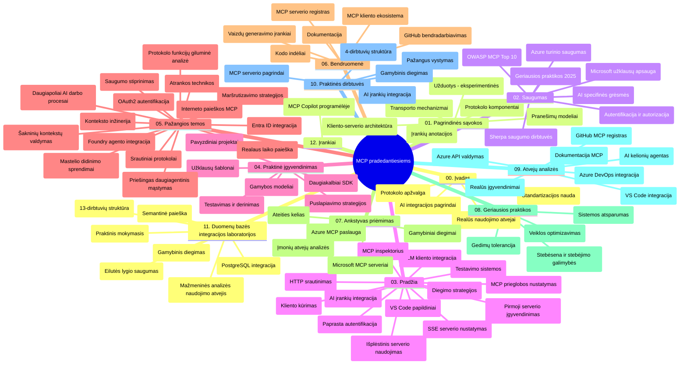

# Modelio konteksto protokolas (MCP) pradedantiesiems – studijų vadovas

Šis studijų vadovas pateikia apžvalgą apie saugyklos struktūrą ir turinį kursui „Modelio konteksto protokolas (MCP) pradedantiesiems“. Naudokite šį vadovą, kad efektyviai naršytumėte saugyklą ir maksimaliai išnaudotumėte turimus išteklius.

## Saugyklos apžvalga

Modelio konteksto protokolas (MCP) yra standartizuota sąveikos tarp DI modelių ir klientų programų sistema. Pirmiausia sukurtas Anthropic, MCP dabar palaikomas platesnės MCP bendruomenės per oficialią GitHub organizaciją. Ši saugykla siūlo išsamų mokymo programą su praktiniais kodo pavyzdžiais C#, Java, JavaScript, Python ir TypeScript kalbomis, skirtą DI kūrėjams, sistemų architektams ir programinės įrangos inžinieriams.

## Vizualus mokymo programos žemėlapis

## Saugyklos struktūra

Saugykla organizuota į dvylika pagrindinių skyrių, kiekvienas skirtas skirtingiems MCP aspektams:

1. **Įvadas (00-Introduction/)**
   - Modelio konteksto protokolo apžvalga
   - Kodėl standartizacija svarbi DI grandinėse
   - Praktiniai panaudojimo atvejai ir naudos

2. **Pagrindinės sąvokos (01-CoreConcepts/)**
   - Klientų-serverių architektūra
   - Pagrindinės protokolo sudedamosios dalys
   - Pranešimų siuntimo modeliai MCP

3. **Saugumas (02-Security/)**
   - Saugumo grėsmės MCP pagrindu veikiančiose sistemose
   - Geriausia praktika diegiant saugumą
   - Autentifikacijos ir autorizacijos strategijos
   - **Išsami saugumo dokumentacija**:
     - MCP saugumo geriausios praktikos 2025
     - Azure turinio saugumo diegimo vadovas
     - MCP saugumo valdikliai ir technikos
     - MCP geriausios praktikos greitoji nuoroda
   - **Pagrindinės saugumo temos**:
     - Promptų injekcijos ir įrankių užnuodijimo atakos
     - Sesijos perėmimas ir painų sekretorių problemos
     - Žetonų praleidimo pažeidžiamumai
     - Per didelės teisės ir prieigos valdymas
     - Tiekimo grandinės saugumas DI komponentams
     - Microsoft Prompt Shields integracija

4. **Pradžia (03-GettingStarted/)**
   - Aplinkos nustatymas ir konfigūracija
   - Pirmųjų MCP serverių ir klientų kūrimas
   - Integracija su esamomis programomis
   - Įtraukti skyriai:
     - Pirmojo serverio įgyvendinimas
     - Klientų kūrimas
     - LLM kliento integracija
     - VS Code integracija
     - Server-Sent Events (SSE) serveris
     - Sudėtingesnis serverio naudojimas
     - HTTP srautas
     - AI įrankių rinkinio integracija
     - Testavimo strategijos
     - Diegimo gairės

5. **Praktinis įgyvendinimas (04-PracticalImplementation/)**
   - SDK naudojimas įvairiomis programavimo kalbomis
   - Derinimas, testavimas ir patvirtinimo technikos
   - Pernaudojamų promptų šablonų ir darbo eigos kūrimas
   - Pavyzdiniai projektai su įgyvendinimo pavyzdžiais

6. **Pažangios temos (05-AdvancedTopics/)**
   - Konteksto inžinerijos technikos
   - Foundry agentų integracija
   - Multi-modalios DI darbo eigos
   - OAuth2 autentifikacijos demonstracijos
   - Realaus laiko paieškos galimybės
   - Realaus laiko srautinimas
   - Šakninio konteksto įgyvendinimas
   - Maršrutizavimo strategijos
   - Imčių ėmimo technikos
   - Mastelio didinimo metodai
   - Saugumo aspektai
   - Entra ID saugumo integracija
   - Internetinės paieškos integracija
   - Konkurencinė daugiaagentų analizė (debato modeliai)

7. **Bendruomenės indėliai (06-CommunityContributions/)**
   - Kaip prisidėti prie kodo ir dokumentacijos
   - Bendradarbiavimas per GitHub
   - Bendruomenės varomos naujinimų ir atsiliepimų iniciatyvos
   - Įvairių MCP klientų naudojimas (Claude Desktop, Cline, VSCode)
   - Darbas su populiariais MCP serveriais, įskaitant vaizdų generavimą

8. **Patirtis iš ankstyvosios adopcijos (07-LessonsfromEarlyAdoption/)**
   - Tikroviški įgyvendinimai ir sėkmės istorijos
   - MCP pagrindu kuriamų sprendimų kūrimas ir diegimas
   - Tendencijos ir ateities gairės
   - **Microsoft MCP serverių vadovas**: išsamus vadovas apie 10 gamybai paruoštų Microsoft MCP serverių, įskaitant:
     - Microsoft Learn Docs MCP serveris
     - Azure MCP serveris (15+ specializuotų jungčių)
     - GitHub MCP serveris
     - Azure DevOps MCP serveris
     - MarkItDown MCP serveris
     - SQL Server MCP serveris
     - Playwright MCP serveris
     - Dev Box MCP serveris
     - Microsoft Foundry MCP serveris
     - Microsoft 365 Agents Toolkit MCP serveris

9. **Geriausios praktikos (08-BestPractices/)**
   - Našumo optimizavimas ir tuningas
   - Gedimams atsparių MCP sistemų projektavimas
   - Testavimo ir atsparumo strategijos

10. **Atvejų analizės (09-CaseStudy/)**
    - **Septynios išsamios atvejų analizės** demonstruoja MCP universalumą įvairiose situacijose:
    - **Azure DI kelionių agentai**: daugiaagentų orkestravimas su Azure OpenAI ir AI Search
    - **Azure DevOps integracija**: darbo eigos procesų automatizavimas su YouTube duomenų atnaujinimais
    - **Realaus laiko dokumentų gavimas**: Python konsolinis klientas su HTTP srautu
    - **Interaktyvus mokymosi plano generatorius**: Chainlit žiniatinklio programa su pokalbių DI
    - **Dokumentacija redaktoriuje**: VS Code integracija su GitHub Copilot darbo eigomis
    - **Azure API valdymas**: įmonių API integracija ir MCP serverio kūrimas
    - **GitHub MCP registras**: ekosistemos kūrimas ir agentų integravimo platforma
    - Įgyvendinimo pavyzdžiai, apimantys įmonių integraciją, kūrėjų produktyvumą ir ekosistemos plėtrą

11. **Praktinis seminaras (10-StreamliningAIWorkflowsBuildingAnMCPServerWithAIToolkit/)**
    - Išsamus praktinis seminaras, derinantis MCP su AI įrankių rinkiniu
    - Protingų programų kūrimas, sujungiant DI modelius su realaus pasaulio įrankiais
    - Praktiniai moduliai, apimantys pagrindus, individualaus serverio kūrimą ir gamybos diegimo strategijas
    - **Laboratorijų struktūra**:
      - Laboratorija 1: MCP serverio pagrindai
      - Laboratorija 2: Pažangus MCP serverio kūrimas
      - Laboratorija 3: AI įrankių rinkinio integracija
      - Laboratorija 4: Gamybos diegimas ir mastelio didinimas
    - Mokymasis laboratorijomis su nuosekliomis instrukcijomis

12. **MCP serverio duomenų bazės integracijos laboratorijos (11-MCPServerHandsOnLabs/)**
    - **Išsamus 13 laboratorijų mokymosi kelias** gamybai paruoštų MCP serverių su PostgreSQL integracija kūrimui
    - **Tikroviška mažmeninės prekybos analizės įgyvendinimo praktika** naudojant Zava Retail pavyzdį
    - **Įmonių lygio modeliai** įskaitant eilutės lygio saugumą (RLS), semantinę paiešką ir daugiafunkcinę duomenų prieigą
    - **Visas laboratorijų turinys**:
      - **Laboratorijos 00-03: Pagrindai** – Įvadas, architektūra, saugumas, aplinkos nustatymas
      - **Laboratorijos 04-06: MCP serverio kūrimas** – Duomenų bazės projektavimas, MCP serverio įgyvendinimas, įrankių kūrimas
      - **Laboratorijos 07-09: Pažangios funkcijos** – Semantinė paieška, testavimas ir derinimas, VS Code integracija
      - **Laboratorijos 10-12: Gamyba ir geriausios praktikos** – Diegimas, stebėjimas, optimizavimas
    - **Naudojamos technologijos**: FastMCP pagrindas, PostgreSQL, Azure OpenAI, Azure konteinerių programos, Application Insights
    - **Mokymosi rezultatai**: gamybai paruošti MCP serveriai, duomenų bazės integracijos modeliai, DI pagrindu veikianti analizė, įmonių saugumas

13. **Įrankiai (12-tooling/)**
    - Sužinokite, kaip naudoti MCP Copilot programėlėje ir kituose įrankiuose

## Papildomi ištekliai

Saugykla įtraukia papildomus išteklius:

- **Paveikslėlių aplankas**: diagramų ir iliustracijų rinkinys, naudojamas visoje mokymo programoje
- **Vertimai**: daugialypės kalbos palaikymas su automatizuotais dokumentacijos vertimais
- **Oficialūs MCP ištekliai**:
  - [MCP dokumentacija](https://modelcontextprotocol.io/)
  - [MCP specifikacija](https://spec.modelcontextprotocol.io/)
  - [MCP GitHub saugykla](https://github.com/modelcontextprotocol)

## Kaip naudotis šia saugykla

1. **Nuoseklus mokymasis**: Eikite per skyrius iš eilės (nuo 00 iki 11) struktūruotai mokymosi patirčiai.
2. **Kalbos specifinis dėmesys**: Jei domina tam tikra programavimo kalba, tyrinėkite atitinkamus pavyzdžių katalogus norima kalba.
3. **Praktinis įgyvendinimas**: Pradėkite nuo skyriaus „Pradžia“, kad nustatytumėte aplinką ir sukurtumėte pirmą MCP serverį ir klientą.
4. **Pažangesnė eksploatacija**: Įgiję pagrindus, gilinkitės į pažangias temas žinioms plėsti.
5. **Bendruomenės dalyvavimas**: Prisijunkite prie MCP bendruomenės per GitHub diskusijas ir Discord kanalus, kad susisiektumėte su ekspertais ir kolegomis kūrėjais.

## MCP klientai ir įrankiai

Mokymo programa apima įvairius MCP klientus ir įrankius:

1. **Oficialūs klientai**:
   - Visual Studio Code
   - MCP Visual Studio Code
   - Claude Desktop
   - Claude VSCode
   - Claude API

2. **Bendruomenės klientai**:
   - Cline (terminalinis)
   - Cursor (kodo redaktorius)
   - ChatMCP
   - Windsurf

3. **MCP valdymo įrankiai**:
   - MCP CLI
   - MCP Manager
   - MCP Linker
   - MCP Router

## Populiarūs MCP serveriai

Saugykla pristato įvairius MCP serverius:

1. **Oficialūs Microsoft MCP serveriai**:
   - Microsoft Learn Docs MCP serveris
   - Azure MCP serveris (15+ specializuotų jungčių)
   - GitHub MCP serveris
   - Azure DevOps MCP serveris
   - MarkItDown MCP serveris
   - SQL Server MCP serveris
   - Playwright MCP serveris
   - Dev Box MCP serveris
   - Microsoft Foundry MCP serveris
   - Microsoft 365 Agents Toolkit MCP serveris

2. **Oficialūs referenciniai serveriai**:
   - Failų sistema
   - Fetch
   - Atmintis
   - Nuoseklus mąstymas

3. **Vaizdų generavimas**:
   - Azure OpenAI DALL-E 3
   - Stable Diffusion WebUI
   - Replicate

4. **Kūrimo įrankiai**:
   - Git MCP
   - Terminal Control
   - Code Assistant

5. **Specializuoti serveriai**:
   - Salesforce
   - Microsoft Teams
   - Jira & Confluence

## Prisidėjimas

Ši saugykla laukią bendruomenės indėlio. Žr. skyrių „Bendruomenės indėliai“ dėl gairių, kaip efektyviai prisidėti prie MCP ekosistemos.

----

*Šis studijų vadovas paskutinį kartą atnaujintas 2026 m. vasario 5 d. atsižvelgiant į naujausią MCP Specifikaciją 2025-11-25 ir pateikia saugyklos apžvalgą pagal tą datą. Saugyklos turinys gali būti atnaujintas po šios datos.*

---

<!-- CO-OP TRANSLATOR DISCLAIMER START -->
**Atsakomybės apribojimas**:
Šis dokumentas buvo išverstas naudojant dirbtinio intelekto vertimo paslaugą [Co-op Translator](https://github.com/Azure/co-op-translator). Nors siekiame tikslumo, prašome atkreipti dėmesį, kad automatiniai vertimai gali turėti klaidų ar netikslumų. Originalus dokumentas jo gimtąja kalba laikomas autoritetingu šaltiniu. Svarbiai informacijai rekomenduojama naudoti profesionalų žmogiškąjį vertimą. Mes neatsakome už jokius nesusipratimus ar neteisingą interpretaciją, kilusią naudojantis šiuo vertimu.
<!-- CO-OP TRANSLATOR DISCLAIMER END -->