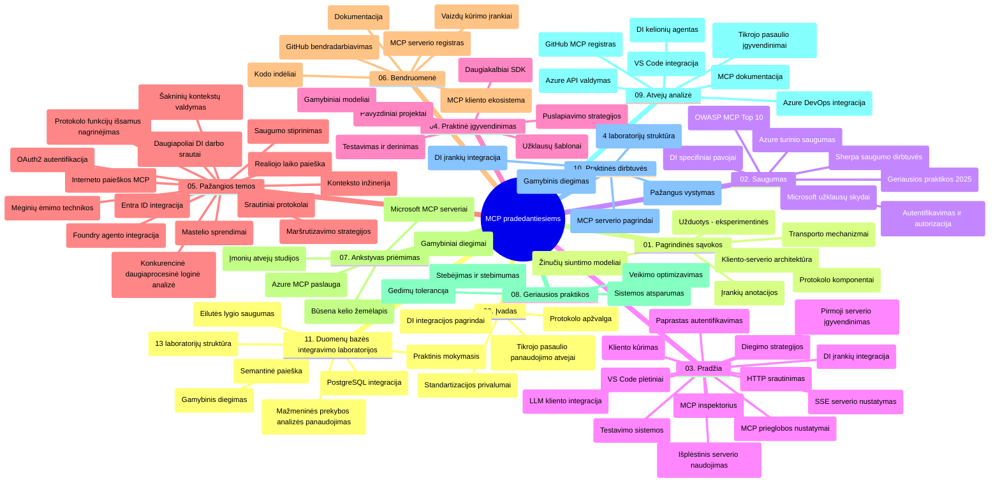

# Modelio konteksto protokolas (MCP) pradedantiesiems – studijų vadovas

Šis studijų vadovas pateikia apžvalgą apie saugyklos struktūrą ir turinį „Modelio konteksto protokolo (MCP) pradedantiesiems“ mokymo programai. Naudokite šį vadovą efektyviai naršyti saugykloje ir maksimaliai išnaudoti turimus išteklius.

## Saugyklos apžvalga

Modelio konteksto protokolas (MCP) yra standartizuotas pagrindas sąveikoms tarp DI modelių ir kliento programų. Iš pradžių sukurtas Anthropic, MCP dabar yra prižiūrimas platesnės MCP bendruomenės per oficialią GitHub organizaciją. Ši saugykla pateikia visapusišką mokymo programą su praktiniais kodo pavyzdžiais C#, Java, JavaScript, Python ir TypeScript kalbomis, skirtą DI kūrėjams, sistemų architektams ir programinės įrangos inžinieriams.

## Vizualinė mokymo programa

## Saugyklos struktūra

Saugykla organizuota į vienuolika pagrindinių skyrių, kiekvienas skirtas skirtingiems MCP aspektams:

1. **Įvadas (00-Introduction/)**
   - Modelio konteksto protokolo apžvalga
   - Kodėl standartizacija svarbi DI srityje
   - Praktiniai naudojimo atvejai ir nauda

2. **Pagrindinės sąvokos (01-CoreConcepts/)**
   - Kliento-serverio architektūra
   - Pagrindiniai protokolo komponentai
   - Pranešimų modeliai MCP

3. **Saugumas (02-Security/)**
   - Saugumo grėsmės MCP pagrindu veikiančiose sistemose
   - Geriausios praktikos saugumo įgyvendinimui
   - Autentifikavimo ir autorizavimo strategijos
   - **Išsami saugumo dokumentacija**:
     - MCP saugumo geriausios praktikos 2025
     - Azure turinio saugos įgyvendinimo vadovas
     - MCP saugumo kontrolės ir technikos
     - MCP geriausių praktikų greitoji santrauka
   - **Pagrindinės saugumo temos**:
     - Komandų injekcijos ir įrankių užnuodijimo atakos
     - Sesijų pagrobimas ir painūs atstovai (confused deputy)
     - Žetonų praleidimo pažeidžiamumai
     - Per didelės teisės ir prieigos kontrolė
     - Tiekimo grandinės saugumas DI komponentams
     - Microsoft Prompt Shields integracija

4. **Pradžia (03-GettingStarted/)**
   - Aplinkos parengimas ir konfigūravimas
   - Paprastų MCP serverių ir klientų kūrimas
   - Integracija su esamomis programomis
   - Įskaitant skyrius:
     - Pirmojo serverio įgyvendinimas
     - Klientų kūrimas
     - LLM kliento integracija
     - VS Code integracija
     - Serverio siunčiami įvykiai (SSE) serveris
     - Pažangus serverio naudojimas
     - HTTP srautinimas
     - DI įrankių rinkinys integracija
     - Testavimo strategijos
     - Diegimo gairės

5. **Praktinis įgyvendinimas (04-PracticalImplementation/)**
   - SDK naudojimas įvairiomis programavimo kalbomis
   - Derinimo, testavimo ir tikrinimo metodai
   - Pakartotinai naudojamų komandos šablonų ir darbo eigos kūrimas
   - Pavyzdiniai projektai su įgyvendinimo pavyzdžiais

6. **Pažangios temos (05-AdvancedTopics/)**
   - Konteksto inžinerijos technikos
   - Foundry agentų integracija
   - Daugiarūšių DI darbo eiga
   - OAuth2 autentifikacijos demonstracijos
   - Realiojo laiko paieškos galimybės
   - Realiojo laiko srautinimas
   - Šakninių kontekstų įgyvendinimas
   - Maršrutizavimo strategijos
   - Imties paėmimo technikos
   - Masto didinimo požiūriai
   - Saugumo aspektai
   - Entra ID saugumo integracija
   - Internetinės paieškos integracija
   - Priešinio daugiagentinio mąstymo (debatų šablonai)

7. **Bendruomenės indėliai (06-CommunityContributions/)**
   - Kaip prisidėti prie kodo ir dokumentacijos
   - Bendradarbiavimas per GitHub
   - Bendruomenės vedami patobulinimai ir grįžtamasis ryšys
   - Įvairių MCP klientų naudojimas (Claude Desktop, Cline, VSCode)
   - Darbas su populiariais MCP serveriais, įskaitant vaizdų generavimą

8. **Pamokos iš ankstyvosios priėmimo (07-LessonsfromEarlyAdoption/)**
   - Realaus pasaulio įgyvendinimai ir sėkmės istorijos
   - MCP pagrindu sukurtų sprendimų kūrimas ir diegimas
   - Tendencijos ir ateities planas
   - **Microsoft MCP serverių vadovas**: Išsamus 10 gamybai paruoštų Microsoft MCP serverių vadovas, įskaitant:
     - Microsoft Learn Docs MCP Serverį
     - Azure MCP Serverį (15+ specializuotų jungčių)
     - GitHub MCP Serverį
     - Azure DevOps MCP Serverį
     - MarkItDown MCP Serverį
     - SQL Server MCP Serverį
     - Playwright MCP Serverį
     - Dev Box MCP Serverį
     - Microsoft Foundry MCP Serverį
     - Microsoft 365 Agents Toolkit MCP Serverį

9. **Geriausios praktikos (08-BestPractices/)**
   - Veikimo derinimas ir optimizavimas
   - Atsparių MCP sistemų projektavimas
   - Testavimo ir atsparumo strategijos

10. **Atvejų analizės (09-CaseStudy/)**
    - **Septynios išsamios atvejų analizės**, demonstruojančios MCP universalumą įvairiose situacijose:
    - **Azure DI kelionių agentai**: Daugiagentė orchestracija su Azure OpenAI ir DI paieška
    - **Azure DevOps integracija**: Darbo eigos procesų automatizavimas su YouTube duomenų atnaujinimais
    - **Realiojo laiko dokumentų paieška**: Python konsolės klientas su HTTP srautinimu
    - **Interaktyvus mokymosi plano generatorius**: Chainlit internetinė programa su pokalbių DI
    - **Dokumentacija redaktoriuje**: VS Code integracija su GitHub Copilot darbo eigomis
    - **Azure API valdymas**: Įmonių API integracija su MCP serverio kūrimu
    - **GitHub MCP registras**: Ekosistemos kūrimas ir agentinė integracijos platforma
    - Įgyvendinimų pavyzdžiai apimantys įmonių integraciją, kūrėjų produktyvumą ir ekosistemos plėtrą

11. **Praktinis seminaras (10-StreamliningAIWorkflowsBuildingAnMCPServerWithAIToolkit/)**
    - Išsamus praktinis seminaras, derinantis MCP su DI įrankių rinkiniu
    - Protingų programų kūrimas, jungianti DI modelius su realaus pasaulio įrankiais
    - Praktiniai moduliai, apimantys pagrindus, pasirinktinių serverių kūrimą ir gamybos diegimo strategijas
    - **Laboratorijos struktūra**:
      - Laboratorija 1: MCP serverio pagrindai
      - Laboratorija 2: Pažangus MCP serverio kūrimas
      - Laboratorija 3: DI įrankių rinkinio integracija
      - Laboratorija 4: Gamybos diegimas ir masto didinimas
    - Mokymasis laboratorijų forma su nuosekliomis instrukcijomis

12. **MCP serverių duomenų bazės integracijos laboratorijos (11-MCPServerHandsOnLabs/)**
    - **Išsamus 13 laboratorijų mokymosi kelias** gamybai paruoštų MCP serverių kūrimui su PostgreSQL integracija
    - **Realaus pasaulio mažmeninės prekybos analizės įgyvendinimas** naudojant Zava Retail naudingo atvejo pavyzdį
    - **Įmonių lygio šablonai**, įskaitant Row Level Security (RLS), semantinę paiešką ir daugnuomonių duomenų prieigą
    - **Pilna laboratorijų struktūra**:
      - **00-03 laboratorijos: pagrindai** – įvadas, architektūra, saugumas, aplinkos paruošimas
      - **04-06 laboratorijos: MCP serverio kūrimas** – duomenų bazės dizainas, MCP serverio įgyvendinimas, įrankių kūrimas
      - **07-09 laboratorijos: pažangios funkcijos** – semantinė paieška, testavimas ir derinimas, VS Code integracija
      - **10-12 laboratorijos: gamyba ir geriausios praktikos** – diegimas, stebėsena, optimizavimas
    - **Naudojamos technologijos**: FastMCP karkasas, PostgreSQL, Azure OpenAI, Azure Container Apps, Application Insights
    - **Mokymosi rezultatai**: gamybai paruošti MCP serveriai, duomenų bazių integracijos šablonai, DI pagrįsta analizė, įmonių saugumas

## Papildomi ištekliai

Saugykloje yra papildomų išteklių:

- **Paveikslėlių aplankas**: talpina diagramas ir iliustracijas, naudojamas mokymo programoje
- **Vertimai**: daugakalbė parama su automatizuotais dokumentacijos vertimais
- **Oficialūs MCP ištekliai**:
  - [MCP dokumentacija](https://modelcontextprotocol.io/)
  - [MCP specifikacija](https://spec.modelcontextprotocol.io/)
  - [MCP GitHub saugykla](https://github.com/modelcontextprotocol)

## Kaip naudotis šia saugykla

1. **Sekamas mokymasis**: vykdykite skyrius tvarkingai (nuo 00 iki 11) struktūruotam mokymuisi.
2. **Kalbai skirtas dėmesys**: jei domina konkreti programavimo kalba, peržiūrėkite pavyzdžių katalogus su pasirinktų kalbų įgyvendinimais.
3. **Praktinis įgyvendinimas**: pradėkite nuo „Pradžios“ skyriaus, kad parengtumėte aplinką ir sukurtumėte pirmąjį MCP serverį bei klientą.
4. **Pažangi tyrinėjimas**: įvaldę pagrindus, gilinkitės į pažangias temas, kad išplėstumėte savo žinias.
5. **Bendruomenės bendradarbiavimas**: prisijunkite prie MCP bendruomenės per GitHub diskusijas ir Discord kanalus, kad susijungtumėte su ekspertais ir kolegomis kūrėjais.

## MCP klientai ir įrankiai

Mokymo programa apima įvairius MCP klientus ir įrankius:

1. **Oficialūs klientai**:
   - Visual Studio Code
   - MCP Visual Studio Code aplinkoje
   - Claude Desktop
   - Claude VSCode aplinkoje
   - Claude API

2. **Bendruomenės klientai**:
   - Cline (terminalo pagrindu)
   - Cursor (kodo redaktorius)
   - ChatMCP
   - Windsurf

3. **MCP valdymo įrankiai**:
   - MCP CLI
   - MCP Manager
   - MCP Linker
   - MCP Router

## Populiarūs MCP serveriai

Saugykloje pristatomi įvairūs MCP serveriai, įskaitant:

1. **Oficialūs Microsoft MCP serveriai**:
   - Microsoft Learn Docs MCP serveris
   - Azure MCP serveris (15+ specializuotų jungčių)
   - GitHub MCP serveris
   - Azure DevOps MCP serveris
   - MarkItDown MCP serveris
   - SQL Server MCP serveris
   - Playwright MCP serveris
   - Dev Box MCP serveris
   - Microsoft Foundry MCP serveris
   - Microsoft 365 Agents Toolkit MCP serveris

2. **Oficialūs atpažinimo serveriai**:
   - Failų sistema
   - Fetch
   - Atmintis
   - Sekvencinis mąstymas

3. **Vaizdų generavimas**:
   - Azure OpenAI DALL-E 3
   - Stable Diffusion WebUI
   - Replicate

4. **Vystymo įrankiai**:
   - Git MCP
   - Terminalo valdymas
   - Kodo asistentas

5. **Specializuoti serveriai**:
   - Salesforce
   - Microsoft Teams
   - Jira & Confluence

## Prisidėjimas

Ši saugykla laukiama bendruomenės prisidėjimų. Žr. skyrių „Bendruomenės indėliai“ dėl gairių, kaip veiksmingai prisidėti prie MCP ekosistemos.

----

*Šis studijų vadovas paskutinį kartą atnaujintas 2026 m. vasario 5 d., atspindint naujausią MCP specifikaciją 2025-11-25 ir pateikia saugyklos apžvalgą iki šios datos. Saugyklos turinys gali būti atnaujinamas po šios datos.*

---

<!-- CO-OP TRANSLATOR DISCLAIMER START -->
**Atsakomybės apribojimas**:
Šis dokumentas buvo išverstas naudojant dirbtinio intelekto vertimo paslaugą [Co-op Translator](https://github.com/Azure/co-op-translator). Nors siekiame tikslumo, prašome atkreipti dėmesį, kad automatiniai vertimai gali turėti klaidų ar netikslumų. Originalus dokumentas jo gimtąja kalba laikomas autoritetingu šaltiniu. Svarbiai informacijai rekomenduojama naudoti profesionalų žmogiškąjį vertimą. Mes neatsakome už jokius nesusipratimus ar neteisingą interpretaciją, kilusią naudojantis šiuo vertimu.
<!-- CO-OP TRANSLATOR DISCLAIMER END -->