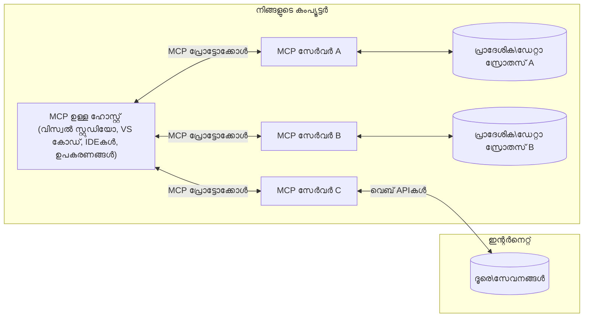

# MCP കോർ ആശയങ്ങൾ: AI സംയോജനത്തിന് മാതൃകാ കോൺടെക്‌സ്‌റ്റ് പ്രോട്ടോക്കോൾ നൈപുണ്യം നേടൽ

[](https://youtu.be/earDzWGtE84)

_(ഈ പാഠത്തിന്റെ വീഡിയൊ കാണാൻ മുകളിലുള്ള ചിത്രം ക്ലിക്ക് ചെയ്യുക)_

[Model Context Protocol (MCP)](https://github.com/modelcontextprotocol) വലിയ ഭാഷ മോഡലുകൾ (LLMs) ഒരു ബഹിര്ഭാഗതools, അപ്‌ളിക്കേഷനുകൾ, ഡേറ്റാ സ്രോതസ്സ് എന്നിവക്കിടയിലെ സംവാദം മെച്ചപ്പെടുത്തുന്നതിനുള്ള ശക്തിപ്പെടുത്തിയ, മാനകീയ ഘടനയാണ്.  
ഈ മാർഗ്ഗനിർദ്ദേശം MCPയുടെ കോർ ആശയങ്ങൾ നിങ്ങൾക്ക് വിശദീകരിക്കും. ഇതിൽ കമ്പിപ്പിൽ ക്ലയന്റ്-സർവർ ആർമിച്ച്, അവശ്യ ഘടകങ്ങൾ, ആശയവിനിമയ രീതി, നടപ്പാക്കൽ മികച്ച രീതികൾ എന്നിവയെക്കുറിച്ച് പഠിക്കും.

- **സ്പഷ്ട ഉപയോക്തൃ സമ്മതി**: എല്ലാ ഡാറ്റ ആക്‌സസ്, പ്രവർത്തനങ്ങൾ നടത്തുന്നത് മുൻപ് ഉപയോക്തൃ അംഗീകാരം വേണം. ഉപയോക്താക്കൾക്ക് ആക്‌സസ് ചെയ്യപ്പെടുന്ന ഡാറ്റ എന്താണ്, എന്ത് നടപടി കൈക്കൊള്ളും എന്നതിൽ വ്യക്തമായ അറിവ് ഉണ്ടായിരിക്കണം, അവകാശങ്ങൾ പരിമിതീകരിക്കാൻ വിശദമായ നിയന്ത്രണം വേണം.

- **ഡാറ്റാ സ്വകാര്യത സംരക്ഷണം**: ഉപയോക്തൃ ഡാറ്റ മാതൃകാ അനുമതിയിൽ മാത്രം പരസ്യമാക്കപ്പെടണം; മുഴുവൻ ഇടപെടൽ ചക്രത്തിനും ഉറപ്പുള്ള ആക്‌സസ് നിയന്ത്രണമുണ്ടാകണം. അനധികൃത ഡാറ്റ സംപ്രേഷണം തടയുകയും കർശന സ്വകാര്യത അതിർത്തികൾ പാലിക്കുകയും വേണം.

- **ടൂൾപ്രവർത്തന സുരക്ഷ**: ഓരോ ടൂൾ ഇറക്കുമതി ഉപയോക്തൃ സമ്മതത്തോടെയും ടൂളിന്റെ ഫംഗ്ഷണാലിറ്റി, പാരാമീറ്ററുകൾ, ықരം അറിയപ്പെടേണ്ടതുമുണ്ട്. പരിരക്ഷിത സുരക്ഷാ അതിർത്തികൾ നിരീക്ഷണം നൽകണം അനുപോലും ദുഷ്പ്രവർത്തനങ്ങൾ തടയണം.

- **ട്രാൻസ്പോർട്ട് ലെയർ സുരക്ഷ**: എല്ലാ ആശയവിനിമയ ചാനലുകളും യോജിച്ച എൻക്രിപ്ഷനും സാക്ഷ്യപ്പെടുത്തലും പ്രയോഗിക്കണം. ദൂരസംബന്ധങ്ങൾ സുരക്ഷിത ട്രാൻസ്പോർട്ട് പ്രോട്ടോക്കോളുകൾ ഉപയോഗിച്ച് ക്രെഡൻഷ്യൽ മാനേജ്മെന്റ് ശരിയായി നടപ്പാക്കണം.

#### നടപ്പാക്കൽ മാർഗ്ഗനിർദ്ദേശങ്ങൾ:

- **അവകാശം മാനേജ്മെന്റ്**: ഉപയോക്താക്കൾക്ക് ഏത് സെർവർ, ടൂൾ, വിഭവങ്ങൾ ആക്‌സസ്സാകുമെന്നു നിയന്ത്രിക്കാൻ സങ്കീർണ്ണമായ അവകാശ വിഭാഗങ്ങൾ നടപ്പാക്കുക  
- **സാക്ഷ്യപ്പെടുത്തൽ & അധികാരനൽകൽ**: സുരക്ഷിതമായ സാക്ഷ്യപ്പെടുത്തി മാർഗ്ഗങ്ങൾ (OAuth, API കീകൾ) ഉപയോഗിച്ച് ടോക്കൺ മാനേജ്മെന്റ്, കാലഹരണവും നടപ്പാക്കുക  
- **ഇൻപുട്ട് സാധുത പരിശോധന**: നിർവ്വചിച്ച സ്കീമകൾ പ്രകാരം എല്ലാ പാരാമീറ്ററുകളും ഡാറ്റ ഇന്പുട്ടുകളും സാധുത പരിശോധിക്കുക ഇൻജക്ഷൻ ആക്രമണം ഒഴിവാക്കാൻ  
- **ഓഡിറ്റ് ലോഗിങ്ങ്**: സുരക്ഷാ മേൽനോട്ടത്തിനും പാലനത്തിനും എല്ലാ പ്രവർത്തനങ്ങളുടെ സമ്പൂർണ്ണ ലോഗുകൾ സൂക്ഷിക്കുക  

## അവലോകനം

ഈ പാഠത്തിൽ Model Context Protocol (MCP) എക്കോസിസ്റ്റത്തിന്റെ അടിസ്ഥാനഘടനയും ഘടകങ്ങളും പരിശോധിക്കും. സഹദി ക്ലയന്റ്-സർവർ ആർക്കിടെക്‌ചർ, പ്രധാന ഘടകങ്ങൾ, ആശയവിനിമയ രീതി എന്നിവയെക്കുറിച്ച് പഠിക്കും.

## പ്രധാന പഠന ലക്ഷ്യങ്ങൾ

ഈ പാഠം കൈമാറ്റം ചെയ്ത ശേഷം, നിങ്ങൾക്ക് തികഞ്ഞ:

- MCP ക്ലയന്റ്-സർവർ ആർക്കിടെക്‌ചർ മനസ്സിലാക്കണം.
- ഹോസ്റ്റുകൾ, ക്ലയന്റുകൾ, സർവറുകളുടെ പങ്കും ഉത്തരവാദിത്വവും തിരിച്ചറിയുക.
- MCPയെ ലർബ്ധമായ സംയോജനം നൽകുന്ന കോർ ഫീച്ചറുകൾ വിശകലനം ചെയ്യുക.
- MCP ഇക്കോസിസ്റ്റത്തിൽ വിവരങ്ങൾ എങ്ങനെ ഒഴുകുന്നു എന്ന് പഠിക്കുക.
- .NET, ജावा, പൈതൺ, ജാവാസ്ക്രിപ്റ്റ് കോഡ് ഉദാഹരണങ്ങളിലൂടെ പ്രായോഗിക അറിവുകൾ നേടുക.

## MCP ആർക്കിടെക്ചർ: ഉതകും നോക്കുക

MCP ഇക്കോസിസ്റ്റം ക്ലയന്റ്-സർവർ മോഡലിൽ വടക്കുന്നു. ഈ ഘടന AI അപ്ലിക്കേഷനുകൾ ടൂളുകൾ, ഡാറ്റാബേസുകൾ, APIs, കോൺടെക്‌സ്റ്റൽ റിസോഴ്സുകളുമായി കാര്യക്ഷമമായി ഇടപെടാൻ സഹായിക്കുന്നു. ഈ ഘടനയുടെ പ്രധാന ഘടകങ്ങൾ നാം ഇതിൽ പൊളിച്ചറിയാം.

MCP അടിസ്ഥാനത്തിൽ ഒരു ക്ലയന്റ്-സർവർ ആർക്കിടെക്ചർ പിന്തുടരുന്നു, അതിൽ ഒരു ഹോസ്റ്റ് അപ്ലിക്കേഷൻ ഒരേ സമയം ഒന്നിലധികം സർവറുകളുമായി കണക്റ്റ് ചെയ്യാം:


- **MCP ഹോസ്റ്റുകൾ**: VSCode, Claude Desktop, IDEകൾ, MCP വഴി ഡാറ്റ ആക്സസ് ചെയ്യാൻ ആഗ്രഹിക്കുന്ന AI ടൂൾസ് പോലുള്ള പ്രോഗ്രാമുകൾ  
- **MCP ക്ലയന്റുകൾ**: MCP സർവറുകളോട് ഏകോപിതമായ 1:1 കണക്ഷൻ നിലനിർത്തുന്ന പ്രോട്ടോക്കോൾ ക്ലയന്റുകൾ  
- **MCP സർവറുകൾ**: ഒരു സ്റ്റാൻഡേർഡൈസ് ചെയ്ത Model Context Protocol വഴി വ്യക്തിഗത കഴിവുകൾ അവകാശപ്പെടുന്ന ലഘുഭാര പ്രോഗ്രാമുകൾ  
- **പ്രാദേശിക ഡാറ്റ സ്രോതസ്സുകൾ**: നിങ്ങളുടെ കമ്പ്യൂട്ടറിലെ ഫയലുകൾ, ഡാറ്റാബേസുകൾ, MCP സർവറുകൾ സുരക്ഷിതമായി ആക്‌സസ് ചെയ്യാൻ കഴിയുന്ന സേവനങ്ങൾ  
- **ദൂരസേവനങ്ങൾ**: ഇന്റർനെറ്റിലൂടെ ലഭ്യമായ ബഹിര്ഭാഗ സംവിധാനങ്ങൾ, APIകൾ വഴി കണക്റ്റ് ചെയ്യുന്നതായി MCP സർവറുകൾ  

MCP പ്രോട്ടോക്കോൾ ആധുനിക കാലഘട്ടത്തിലേക്ക് ഉയരുന്ന യാഥാർത്ഥ്യമാണ്, പ്രോട്ടോക്കോൾ പതിപ്പ് (YYYY-MM-DD ഫോർമാറ്റിൽ) എപ്പോഴും പുതുക്കുന്നു. നിലവിലെ പതിപ്പ് **2025-11-25** ആണ്. ഏറ്റവും പുതിയ അപ്ഡേറ്റുകൾ [പ്രോട്ടോക്കോൾ സ്‌പെസിഫിക്കേഷൻ](https://modelcontextprotocol.io/specification/2025-11-25/)യിൽ കാണാം.

### 1. ഹോസ്റ്റുകൾ

Model Context Protocol (MCP)ൽ, **ഹോസ്റ്റുകൾ** ഉപയോക്താക്കൾ പ്രോട്ടോക്കോളുമായി ഇടപെടുന്ന പ്രധാന ഇന്റർഫേസായി സേവനം ചെയ്യുന്ന AI അപ്ലിക്കേഷനുകളാണ്. ഹോസ്റ്റുകൾ MCP സർവറുകളുമായി ബന്ധം നടത്താനും നിയന്ത്രിക്കാനും MCP ക്ലയന്റുകൾ സൃഷ്ടിക്കുന്നു. ഹൈവിധ ഹോസ്റ്റ് ഉദാഹരണങ്ങൾ:

- **AI അപ്ലിക്കേഷനുകൾ**: Claude Desktop, Visual Studio Code, Claude Code  
- **ഡെവലപ്‌മെന്റ് പരിസ്ഥിതികൾ**: MCP സംയോജനം ഉള്ള IDEകൾ, കോഡ് എഡിറ്ററുകൾ  
- **കസ്റ്റം അപ്ലിക്കേഷനുകൾ**: ലക്ഷ്യമിട്ട AI ഏജൻറുകളായും ടൂളുകളായും  

**ഹോസ്റ്റുകൾ** AI മോഡലുകളുടെ ഇടപെടൽ ഏകോപിപ്പിക്കാനാണ്:  
- **AI മോഡലുകൾ ഏകോപിപ്പിക്കൽ**: LLMs പ്രവർത്തിപ്പിച്ച് പ്രതികരണങ്ങൾ സൃഷ്ടിക്കുന്നു, AI പ്രവൃത്തി പ്രവാഹങ്ങൾ ക്രമീകരിക്കുന്നു  
- **ക്ലയന്റ് കണക്ഷനുകൾ നിയന്ത്രണം**: MCP സർവർ കണക്ഷൻ ഓരോത്തിലും ഓരോ ക്ലയന്റും സൃഷ്ടിക്കുകയും സൂക്ഷിക്കുകയും ചെയ്യുന്നു  
- **ഉപയോക്തൃ ഇന്റർഫെയിസ് നിയന്ത്രണം**: സംഭാഷണ പ്രവാഹം, ഉപയോക്ഭവങ്ങൾ, പ്രതികരണ പ്രദർശനം കൈകാര്യം ചെയ്യുന്നു  
- **സുരക്ഷ ഉറപ്പാക്കൽ**: അവകാശ നിയന്ത്രണവും, സുരക്ഷാ നിയന്ത്രണങ്ങളും, സാക്ഷ്യപ്പെടുത്തലും നടത്തുന്നു  
- **ഉപയോക്തൃ സമ്മതി കൈകാര്യം**: ഡാറ്റ പങ്കുവയ്ക്കലിനും ടൂൾ പ്രവർത്തനത്തിനും ഉപയോക്തൃ അംഗീകാരം കൈകാര്യം ചെയ്യുന്നു  

### 2. ക്ലയന്റുകൾ

**ക്ലയന്റുകൾ** MCP സർവർ-ഹോസ്റ്റ് ഇടയിൽ 1:1 കണക്ഷൻ നിലനിർത്തുന്ന പ്രധാന ഘടകങ്ങളാണ്. ഓരോ MCP ക്ലയന്റും പ്രത്യേക MCP സർവറുമായി ബന്ധിപ്പിക്കാൻ ഹോസ്റ്റ് സൃഷ്ടിക്കുന്നു, അടങ്കൽപ്പരമായ ഒളിച്ചുള്ള, സുരക്ഷിതമായ കണക്ഷൻ ഉറപ്പാക്കാൻ. നിരവധി ക്ലയന്റുകൾ ആവശ്യമേൽക്കുന്നതുകൾക്ക് ഒരേ സമയം ബഹുവിധ സർവറുകളുമായി കണക്റ്റുചെയ്യാനാകും.

**ക്ലയന്റ് ഘടകങ്ങൾ** ഹോസ്റ്റ് അപ്ലിക്കേഷനിൽ കോണക്ടർസ് പോലെയാണ്:  
- **പ്രോട്ടോക്കോൾ ആശയവിനിമയം**: JSON-RPC 2.0 അഭ്യർത്ഥനകൾ പ്രംപ്റ്റുകളും നിർദ്ദേശങ്ങളും ഉൾപ്പെടുത്തി സർവറുകളിലേക്ക് അയയ്ക്കുന്നു  
- **ക്ഷമത സമന്വയം**: ആരംഭ ഘട്ടത്തിൽ ഫീച്ചറുകളും പ്രോട്ടോക്കോൾ പതിപ്പുകളും സർവറുകളുമായി ചർച്ച ചെയ്യുന്നു  
- **ടൂൾ പ്രവർത്തന നിയന്ത്രണം**: മോഡലുകളിൽ നിന്നുള്ള ടൂൾ പ്രവർത്തന അഭ്യർത്ഥനകൾ കൈകാര്യം ചെയ്യുകയും പ്രതികരണങ്ങൾ ശേഖരിക്കുകയും ചെയ്യുന്നു  
- **റിയൽ-ടൈം അപ്‌ഡേറ്റുകൾ**: സർവറുകളിൽ നിന്നുള്ള അറിയിപ്പുകളും അപ്ഡേറ്റുകളും കൈകാര്യം ചെയ്യുന്നു  
- **പ്രതികരണം പ്രോസസ്സിംഗ്**: സര്‍വറിന്റെ പ്രതികരണങ്ങൾ പ്രോസസ് ചെയ്ത് ഉപയോക്താക്കൾക്ക് പ്രദർശിപ്പിക്കാൻ രൂപപ്പെടുത്തുന്നു  

### 3. സർവറുകൾ

**സർവറുകൾ** MCP ക്ലയന്റുകൾക്ക് കോൺടെക്‌സ്‌റ്റ്, ടൂൾകൾ, കഴിവുകൾ നൽകുന്ന പ്രോഗ്രാമുകളാണ്. ഇവ ഹോസ്റ്റിന്റെ പ്രാദേശിക യന്ത്രവും അല്ലെങ്കിൽ ദൂരസ്ഥ പ്ലാറ്റ്ഫോമുകളിലും പ്രവർത്തിക്കാം. ക്ലയന്റ് അഭ്യർത്ഥനകൾ കൈകാര്യം ചെയ്ത് ഘടനയോടെയുള്ള പ്രതികരണങ്ങൾ നൽകുന്നത് ഇവയുടെ ഉത്തരവാദിത്വമാണ്. MCP പ്രോട്ടോക്കോളിന്റെ മാനകീയ ഘടന വഴി സവിശേഷ ഫംഗ്ഷണാലിറ്റി അവകാശപ്പെടും.

**സർവറുകൾ** ഉൾപ്പെടെയുള്ള സേവനങ്ങൾ:  
- **ഫീച്ചർ രജിസ്ട്രേഷൻ**: ക്ലയന്റുകൾക്ക് പരമാവധി ലഭ്യമാക്കാൻ പ്രിമിറ്റിവുകൾ (വനരം, പ്രംപ്റ്റുകൾ, ടൂൾകൾ) രജിസ്റ്റർ ചെയ്യുന്നു  
- **അഭ്യർത്ഥനാ പ്രോസസ്സിംഗ്**: ടൂൾ കോളുകൾ, വിഭവ അഭ്യർത്ഥനകൾ, പ്രംപ്റ്റ് അഭ്യർത്ഥനകൾ ഏറ്റെടുക്കുന്നു, നടപ്പിലാക്കുന്നു  
- **കോൺടെക്‌സ്‌റ്റൽ ഡാറ്റ നൽകൽ**: മോഡൽ പ്രതികരണങ്ങൾക്ക് സഹായിക്കുന്ന സന്ദർഭവും ഡാറ്റയും നൽകുന്നു  
- **സ്റ്റേറ്റ് മാനേജ്മെന്റ്**: സെഷൻ അവസ്ഥ സൂക്ഷിക്കുകയും ആവശ്യമെങ്കിൽ സംസ്ഥാനപരമായ ഇടപെടലുകൾ കൈകാര്യം ചെയ്യുകയും ചെയ്യുന്നു  
- **റിയൽ-ടൈം അറിയിപ്പുകൾ**: കഴിവുകളുടെ മാറ്റങ്ങളെക്കുറിച്ച് ക്ലയന്റുകളെ അറിയിക്കുന്നു  

സർവറുകൾ ഏതൊരാൾക്കും മോഡൽ കഴിവുകൾ കൂടുതൽ വിപുലീകരിക്കാൻ വികസിപ്പിക്കാം. പ്രാദേശികവും ദൂരസേവന ഭേദഗതികളുമെല്ലാം പിന്തുണയ്ക്കുന്നു.

### 4. സർവർ പ്രിമിറ്റിവുകൾ

Model Context Protocol (MCP) സർവറുകൾ മൂന്ന് കോർ **പ്രിമിറ്റിവുകൾ** നൽകുന്നു, ക്ലയന്റുകൾ, ഹോസ്റ്റുകൾ, ഭാഷാ മോഡലുകൾ എന്നിവിടങ്ങളിൽ സമ്പുഷ്ടമായ ഇടപെടലുകൾക്കായി അടിസ്ഥാന ഘടന വികസിപ്പിക്കുന്നു. ഈ പ്രിമിറ്റീവുകൾ പ്രോട്ടോക്കോൾ വഴി ലഭ്യമാകുന്ന കോൺടെക്‌സ്‌റ്ററുകളും പ്രവർത്തനങ്ങളുമാണ് നിർവചിക്കുന്നത്.

MCP സർവർമാർ താഴെ കാണുന്ന മൂന്ന് പ്രധാന പ്രിമിറ്റീവുകളുടെ ഏതെങ്കിലും സംയോജനം അവതരിപ്പിക്കാം:

#### വിഭവങ്ങൾ (Resources)

**വ വിഭവങ്ങൾ** AI അപ്ലിക്കേഷനുകൾക്ക് കോൺടെക്‌സ്‌റ്റൽ ഡാറ്റ നൽകുന്ന സ്രോതസ്സുകളാണ്. ഇവ മാതൃകയുടെ അവബോധത്തിനും തീരുമാനമെടുക്കലിനും സഹായിക്കുന്ന നിർത്തിവെക്കപ്പെട്ട അല്ലെങ്കിൽ ശ്രേഷ്ഠമായ ഉള്ളടക്കമാണ്:

- **കോൺടെക്‌സ്‌റ്റൽ ഡാറ്റ**: AI മോഡലിന് ആവശ്യമായ ഘടിതമായ ഡാറ്റയും കോൺടെക്‌സ്‌റ്റും  
- **ജ്ഞാനകോശങ്ങൾ**: ഡോക്യുമെന്റ് സഞ്ചയങ്ങൾ, ലേഖനങ്ങൾ, മാനുവലുകൾ, ഗവേഷണ പേപ്പറുകൾ  
- **പ്രാദേശിക ഡാറ്റാ സ്രോതസ്സുകൾ**: ഫയലുകൾ, ഡാറ്റാബേസുകൾ, പ്രാദേശിക സിസ്റ്റം വിവരങ്ങൾ  
- **ബഹിര്ഭാഗ ഡാറ്റ**: API പ്രതികരണങ്ങൾ, വെബ് സേവനങ്ങൾ, ദൂരസ്ഥ സിസ്റ്റം ഡാറ്റ  
- **ഡൈനാമിക് ഉള്ളടക്കം**: ബാഹ്യ സാഹചര്യങ്ങൾ അനുസരിച്ച് പുതുക്കുന്ന റിയൽ-ടൈം ഡാറ്റ  

വ വിഭവങ്ങൾ URI ആയി തിരിച്ചറിയപ്പെടുന്നു; കണ്ടെത്തലിനും വായനയ്ക്കും `resources/list` ഉം `resources/read` ഉം ഉപയോഗിക്കുന്നു:

```text
file://documents/project-spec.md
database://production/users/schema
api://weather/current
```

#### പ്രംപ്റ്റുകൾ (Prompts)

**പ്രംപ്റ്റുകൾ** ഭാഷാ മോഡലുകളുമായി ഇടപെടൽ ഘടന പുനഃപരസ്യമായ ടെംപ്ലേറ്റുകളാണ്. ഇവ സാധാരണ ഇടപെടൽ മാതൃകകളും ടെംപ്ലേറ്റുചെയ്ത പ്രവാഹങ്ങളുമാണ്:

- **ടെംപ്ലേറ്റ് അടിസ്ഥാന ഇടപെടൽ**: മുൻകൂട്ടി ഘടനയാക്കിയ സന്ദേശങ്ങളും സംഭാഷണ ആരംഭകങ്ങളുമുള്ളവ  
- **പ്രവാഹ ടെംപ്ലേറ്റുകൾ**: സാധാരണ ജോലികൾക്കും ഇടപെടലുകൾക്കുമായി സ്റ്റാൻഡേർഡായ അനുഗമനങ്ങൾ  
- **ചുരുങ്ങിയ ഉദാഹരണങ്ങൾ**: മോഡൽ നിർദ്ദേശത്തിനായി ഉദാഹരണ അടിസ്ഥാന ടെംപ്ലേറ്റുകൾ  
- **സിസ്റ്റം പ്രംപ്റ്റുകൾ**: മോഡൽ പെരുമാറ്റവും കോൺടെക്‌സ്‌റ്റും നിർവചിക്കുന്ന അടിസ്ഥാന പ്രംപ്റ്റുകൾ  
- **ഡൈനാമിക് ടെംപ്ലേറ്റുകൾ**: പ്രത്യേക കോൺടെക്‌സ്‌റ്റിനായി പരിഷ്കരിക്കാവുന്ന പാരാമീറ്ററ മുഖേനയുടെ പ്രംപ്റ്റുകൾ  

പ്രംപ്റ്റുകൾ വേരിയബിൾ മാറ്റികളുമായി പിന്തുണയ്ക്കുന്നു; കണ്ടെത്തലിനും പ്രാപ്തമാക്കലിനും `prompts/list` ഉം `prompts/get` ഉം ഉപയോഗിക്കുന്നു:

```markdown
Generate a {{task_type}} for {{product}} targeting {{audience}} with the following requirements: {{requirements}}
```

#### ടൂൾകൾ (Tools)

**ടൂൾകൾ** AI മോഡലുകൾ പ്രത്യേക പ്രവർത്തനങ്ങൾ നടത്താൻ വിളിക്കാൻ കഴിയുന്ന നിർവ്വഹണ ഫംഗ്ഷനുകളാണ്. MCP ഇക്കോസിസ്റ്റത്തിലെ "ക്രിയാപദങ്ങൾ" ആയി ഇവ പ്രവർത്തിക്കുന്നു, മോഡലുകൾ ബാഹ്യ സിസ്റ്റങ്ങളുമായി ഇടപഴകാൻ സഹായിക്കുന്നു:

- **നിർവ്വഹണ ഫംഗ്ഷനുകൾ**: മോഡലുകൾക്ക് നിർവചിച്ച പാരാമീറ്ററുകളോടെ വിളിക്കാവുന്ന വ്യത്യസ്ത പ്രവർത്തനങ്ങൾ  
- **ബഹിര്ഭാഗ സിസ്റ്റം സംയോജനം**: API കോളുകൾ, ഡാറ്റാബേസ് ചോദനകൾ, ഫയൽ പ്രവർത്തനങ്ങൾ, കണക്കുകൂട്ടലുകൾ  
- **തിരഞ്ഞെടുത്ത തിരിച്ചറിയൽ**: ഓരോ ടൂൾക്കും വ്യക്തമായ പേര്, വിവരണം, പാരാമീറ്റർ സ്കീമ ഉണ്ടാകണം  
- **ഘടിത I/O**: ടൂൾകൾ സാധുതപ്പെടുത്തിയ പാരാമീറ്ററുകൾ സ്വീകരിച്ച് ഘടിത, ടൈപ് ചെയ്ത പ്രതികരണങ്ങൾ നൽകും  
- **പ്രവൃത്തിബാധ്യതകൾ**: മോഡലുകൾക്ക് യഥാർത്ഥ പ്രവർത്തനങ്ങൾ നടത്താനും ലൈവ് ഡാറ്റ വീണ്ടെടുക്കാനും സാധിക്കും  

ടൂൾ definiiton JSON സ്കീമ ഉപയോഗിച്ചാണ് സാധുത പരിശോധന; കണ്ടെത്തലിനും പ്രവർത്തനത്തിനും `tools/list` ഉം `tools/call` ഉം ഉപയോഗിക്കുന്നു. UI പ്രദർശനത്തിന് മെച്ചപ്പെട്ട **ഐക്കണുകൾ** അടർപ്പ് ചെയ്യാവുന്നതും ടൂളിന് സാധ്യമാണ്.

**ടൂൾ അനോടേഷനുകൾ**: ടൂളുകൾക്ക് പ്രവർത്തനാനുകൂല ഒഴിവുകൾ (ഉദാ: `readOnlyHint`, `destructiveHint`) ലഭ്യമാക്കി, ടൂൾ വായന മാത്രമോ അതോ ദുരിതപ്രദമായി പ്രവർത്തിക്കുമോ എന്നതിന്റെ സൂചന കൈകാര്യം ചെയ്യുന്നു, ക്ലയന്റുകൾക്ക് ടൂൾ ഉപയോഗത്തെക്കുറിച്ചുള്ള ചർച്ചക്കായി.

ടൂൾ നിർവചനത്തിന്റെ ഉദാഹരണം:

```typescript
server.tool(
  "search_products", 
  {
    query: z.string().describe("Search query for products"),
    category: z.string().optional().describe("Product category filter"),
    max_results: z.number().default(10).describe("Maximum results to return")
  }, 
  async (params) => {
    // തിരയൽ നടത്തുകയും ഘടനയുള്ള ഫലങ്ങൾ മടക്കിപ്പിന്റുകയും ചെയ്യുക
    return await productService.search(params);
  }
);
```

## ക്ലയന്റ് പ്രിമിറ്റിവുകൾ

Model Context Protocol (MCP)യിൽ, **ക്ലയന്റുകൾ** ഹോസ്റ്റ് അപ്ലിക്കേഷനിൽ നിന്നും സർവറുകൾക്ക് അധിക ശേഷികൾ അഭ്യർത്ഥിക്കാൻ പ്രിമിറ്റിവുകൾ പ്രദാനം ചെയ്യാം. ഈ ക്ലയന്റ്-പുറം പ്രിമിറ്റിവുകൾ വൈവിധ്യപരവും കൂടുതൽ ഇടപെടലുറപ്പും ഉള്ള സർവർ നടപ്പാക്കലുകൾക്ക് സഹായിക്കുന്നു, AI മോഡൽ കഴിവുകളും ഉപയോക്തൃ ഇടപെടലുകളും ആക്സസ് ചെയ്യാൻ കഴിയും.

### സാമ്പിൾ ചെയ്തൽ (Sampling)

**സാമ്പിൾ ചെയ്തൽ** സർവറുകൾക്ക് ക്ലയന്റിന്റെ AI അപ്ലിക്കേഷനിൽ നിന്നും ഭാഷാ മോഡൽ പൂർത്തീകരണങ്ങൾ അഭ്യർത്ഥിക്കാൻ അനുവദിക്കുന്നു. ഇത് സർവറുകൾക്ക് സ്വന്തം മോഡൽ ആശ്രയം ഉൾപ്പെടുത്താതെ LLM കഴിവ് ഉപയോഗപ്പെടുത്താമെന്ന് സൂചിപ്പിക്കുന്നു:

- **മോഡൽ സ്വതന്ത്ര ആക്‌സസ്**: LLM SDKകൾ ഉൾപ്പെടുത്താതെ സർവർ പൂർത്തീകരണങ്ങൾ അഭ്യർത്ഥിക്കാം  
- **സർവർ-ആര്എമ്പിക്കുന്ന AI**: ക്ലയന്റിന്റെ AI മോഡൽ ഉപയോഗിച്ച് സ്വയം ആമുഖം സൃഷ്ടിക്കാനുള്ള കഴിവ്  
- **പരസ്പര LLM ഇടപെടലുകൾ**: പ്രോസ്സസിങ്ങിന് AI സഹായം ആവശ്യമുള്ള സങ്കീർണ സാഹചര്യങ്ങൾക്കുള്ള പിന്തുണ  
- **ഡൈനാമിക് ഉള്ളടക്ക സൃഷ്ടി**: ഹോസ്റ്റ് മോഡൽ ഉപയോഗിച്ചെ contextual പ്രതികരണങ്ങൾ നിർമ്മിക്കാനാകും  
- **ടൂൾ കോളിംഗ് പിന്തുണ**: sampling/complete കാലത്ത് സർവർগুলിൽ `tools` , `toolChoice` പാരാമീറ്ററുകൾ നൽകിയാൽ ക്ലയന്റിലെ മോഡൽ sampling സമയത്ത് ടൂൾ ഉപയോഗിക്കാം  

സാമ്പിൾ ചെയ്യൽ `sampling/complete`ുസ_METHOD വഴി ആരംഭിക്കും, സർവർ ക്ലയന്റിന് പൂർത്തീകരണ അഭ്യർത്ഥന അയക്കും.

### റൂട്ടുകൾ (Roots)

**Roots** ക്ലയന്റുകൾക്ക് സർവർക്ക് ഫയൽസിസ്റ്റം അതിർത്തികൾ വ്യക്തമാക്കാനുള്ള മാനകീയ മാർഗ്ഗം ആണ്, ഇത് സർവറുകൾക്ക് പ്രവേശനം ഉളള ഡയറക്ടറികളും ഫയലുകളും അറിയാനായി സഹായിക്കുന്നു:

- **ഫയൽസിസ്റ്റം അതിർത്തികൾ**: സർവറുകൾ പ്രവർത്തിക്കാൻ അനുമതിയുള്ള സ്ഥലത്തിന്റെ പരിധി നിർവ്വചിക്കുക  
- **ആക്‌സസ് നിയന്ത്രണം**: സർവറുകൾക്ക് അനുമതി ലഭിച്ച ഡയറക്ടറികളും ഫയലുകളും അറിയിക്കുക  
- **ഡൈനാമിക് അപ്‌ഡേറ്റുകൾ**: റൂട്ടുകളുടെ ലിസ്റ്റിൽ മാറ്റം വന്നാൽ ക്ലയന്റ് സർവർക്ക് അറിയിക്കാം  
- **URI അധിഷ്ഠിത തിരിച്ചറിയൽ**: റൂട്ടുകൾ `file://` URI ഉപയോഗിച്ച് തിരിച്ചറിയുന്നു  

Roots കണ്ടെത്താൻ `roots/list` മെത്തഡ് ഉപയോഗിക്കുക, റൂട്ടുകൾ മാറുമ്പോൾ ക്ലയന്റുകൾ `notifications/roots/list_changed` അയയ്ക്കുന്നു.

### elicitation

**Elicitation** സർവറുകൾക്ക് ഉപയോക്തൃ ഇന്റർഫേസിലൂടെ കൂടുതൽ വിവരങ്ങൾ അല്ലെങ്കിൽ സ്ഥിരീകരണം അഭ്യർത്ഥിക്കാൻ അനുവദിക്കുന്നു:

- **ഉപയോക്തൃ ഇൻപുട്ട് അഭ്യർത്ഥനകൾ**: ടൂൾ പ്രവർത്തനത്തിന് ആവശ്യമുള്ള അധിക വിവരങ്ങൾ ആവശ്യപ്പെടാം  
- **സ്ഥിരീകരണ സംവാദങ്ങൾ**: ബാധകമോ പ്രভাবശാലിയോ ആയ പ്രവർത്തനങ്ങൾക്ക് ഉപയോക്തൃ അംഗീകാരം ആവശ്യമാണെന്ന് അറിയിക്കും  
- **ഇന്ററാക്ടീവ് പ്രവൃത്തി പ്രവാഹങ്ങൾ**: അഞ്ച് കലാർ വഴി ഉപയോക്തൃ ഇടപെടലുകൾ സൃഷ്ടിക്കും  
- **ഡൈനാമിക് പാരാമീറ്റർ ശേഖരണം**: ടൂൾ പ്രവർത്തന സമയത്ത് മിസ്സിംഗ് അല്ലെങ്കിൽ ഓപ്ഷണൽ പാരാമീറ്ററുകൾ സമാഹരിക്കും  

Elicitation അഭ്യർത്ഥനകൾ `elicitation/request` വഴി ക്ലയന്റിന്റെ ഇന്റർഫേസിലൂടെ ഉപയോക്തൃതിനെ കൊള്ളുന്നു.

**URL മോർഡ് Elicitation**: സർവറുകൾ URL അടിസ്ഥാനമായ ഉപയോക്തൃ ഇടപെടലുകളും അഭ്യർത്ഥിക്കാമെന്ന്, ഉപയോക്താക്കളെ പുറം വെബ് പേജുകളിലേക്ക് റീഡയറക്ട് ചെയ്ത് സാക്ഷ്യപ്പെടുത്തൽ, സ്ഥിരീകരണം, ഡാറ്റ എൻട്രി നടത്താൻ കഴിയും.

### ലോക്കിംഗ് (Logging)

**Logging** സർവർമാർക്ക് ക്ലയന്റുകളിലേക്കുള്ള ഘടിത ലോഗ് സന്ദേശങ്ങൾ അയയ്ക്കാൻ അനുവദിക്കുന്നു, ഇത debugging, മേൽനോട്ടം, ഓപ്പറേഷൻ ദൃശ്യത എന്നിവയ്ക്ക് വേണ്ടിയാണ്:

- **ഡിബഗ് പിന്തുണ**: പ്രശ്‌നപരിഹാരത്തിനായി വിശദമായ പ്രവൃത്തി ലോഗുകൾ സർവർ നൽകും  
- **ഓപ്പറേഷൻ മേൽനോട്ടം**: ക്ലയന്റുകൾക്ക് സ്റ്റാറ്റസ് അപ്ഡേറ്റുകളും പ്രകടന സൂചകങ്ങളും അയയ്ക്കുക  
- **പിശകുകൾ റിപ്പോർട്ട് ചെയ്യൽ**: വിശദമായ പിശക് സാഹചര്യവും നിദാന വിവരങ്ങളും നൽകുക  
- **ഓഡിറ്റ് ട്രെയിൽസ്**: സർവർ പ്രവർത്തനങ്ങൾക്കും തീരുമാനങ്ങൾക്കും സമഗ്രമായ ലോഗുകൾ സൃഷ്ടിക്കുക  

ലോഗിംഗ് സന്ദേശങ്ങൾ സർവർ പ്രവർത്തനങ്ങളിൽ പരദർശിത്വം നൽകാൻ, debugging സുഗമീകരിക്കാൻ ക്ലയന്റുകൾക്ക് അയയ്ക്കുന്നു.

## MCP-ൽ വിവര പ്രതിച്ഛായ

Model Context Protocol (MCP) ഹോസ്റ്റുകൾ, ക്ലയന്റുകൾ, സർവറുകൾ, മോഡലുകൾ എന്നിവിടങ്ങളിൽ ഘടിതമായ വിവര പ്രവാഹം നിർവചിക്കുന്നു. ഈ പ്രവാഹം മനസ്സിലാക്കുന്നത് ഉപയോക്തൃ അഭ്യർത്ഥന എങ്ങനെ പ്രോസസ് ചെയ്യപ്പെടുന്നു, ബാഹ്യ ടൂളുകളും ഡാറ്റയും മോഡൽ പ്രതികരണങ്ങളിൽ എങ്ങനെ സംയോജിപ്പിക്കപ്പെടുന്നു എന്ന കാര്യത്തിൽ വ്യക്തത നൽകുന്നു.
- **ഹോസ്റ്റ് കണക്ഷൻ ആരംഭിക്കുന്നു**  
  ഹോസ്റ്റ് ആപ്ലിക്കേഷൻ (IDE അല്ലെങ്കിൽ ചാറ്റ് ഇന്റർഫേസ് പോലുള്ളത്) സാധാരണയായി STDIO, വെബ്‌സോക്കറ്റ്, അല്ലെങ്കിൽ മറ്റ് പിന്തുണയുള്ള ട്രാൻസ്പോർട്ടിനായി MCP സർവറിൽ കണക്ഷൻ സ്ഥാപിക്കുന്നു.

- **ക്ഷമത നിഷേധം**  
  ഹോസ്റ്റിൽ ഉൾപ്പെടുത്തിയ ക്ലയന്റ്-server അവരുടെ പിന്തുണയുള്ള സവിശേഷതകൾ, ഉപകരണങ്ങൾ, വിഭവങ്ങൾ, പ്രോട്ടോക്കോൾ പതിപ്പുകൾ എന്നിവയുടെ വിവരങ്ങൾ കൈമാറുന്നു. ഇതോടെ ഇരുവശങ്ങളും സെഷനിൽ ലഭ്യമായ കഴിവുകൾ മനസ്സിലാക്കുന്നു.

- **ഉപയോഗকারী അഭ്യർത്ഥന**  
  ഉപഭോക്താവ് ഹോസ്റ്റുമായി ഇടപെടുന്നു (ഉദാഹരണത്തിന്, പ്രാപ്റ്റ് അല്ലെങ്കിൽ കമാൻഡ് നൽകുന്നു). ഹോസ്റ്റ് ഈ ഇൻപുട്ട് ശേഖരിച്ച് ക്ലയന്റിന് പ്രോസസ്സിംഗ്‌ക്കായി കൈമാറുന്നു.

- **വളരം അല്ലെങ്കിൽ ഉപകരണം പ്രയോഗം**  
  - മോഡലിന്റെ മനസ്സിലാക്കലുണ്ടാക്കാൻ കൂടുതൽ പശ്ചാത്തലം അല്ലെങ്കിൽ വിഭവങ്ങൾ (ഫയലുകൾ, ഡാറ്റാബേസ് എൻട്രികൾ, വിജ്ഞാന ശേഖര ലേഖനങ്ങൾ) ക്ലയന്റ് സർവറിൽ നിന്ന് അഭ്യർത്ഥിക്കാം.  
  - മോഡൽ ഒരു ഉപകരണം വേണ്ടെന്ന് തീരുമാനിച്ചാൽ (ഉദാ: ഡാറ്റാ ലഭ്യമാക്കൽ, കാൽക്കുലേഷൻ നടത്തൽ, API വിളിക്കൽ), ഉപകരണത്തിന്റെ പേര്, പാരാമീറ്ററുകൾ വ്യക്തമാക്കി ക്ലയന്റ് ഉപകരണം ആവശ്യപ്പെടും.

- **സർവർ നിർവ്വഹണം**  
  സർവർ വിഭവം അല്ലെങ്കിൽ ഉപകരണ അഭ്യർത്ഥന സ്വീകരിച്ച് ആവശ്യമായ പ്രവർത്തനങ്ങൾ (ഫങ്‌ഷൻ റൺ ചെയ്‌ത്, ഡാറ്റാബേസ് ആര്ഷി, ഫയൽ ലഭ്യമാക്കൽ) നിർവ്വഹിച്ച് ഫലം ഘടിത ഫോർമാറ്റിൽ ക്ലയന്റിന് തിരിച്ചു നൽകുന്നു.

- **പ്രതിനിധാനം സൃഷ്ടിക്കൽ**  
  ക്ലയന്റ് സർവറിന്റെ പ്രതികരണങ്ങൾ (വിഭവ ഡാറ്റ, ഉപകരണം ഫലങ്ങൾ, തുടങ്ങിയവ) മോഡൽ ഇടപെടുത്തലിൽ സംയോജിപ്പിക്കുന്നു. മോഡൽ ഈ വിവരങ്ങൾ ഉപയോഗിച്ച് സമഗ്രവും പശ്ചാത്തല അനുയോജ്യവുമായ പ്രതികരണം സൃഷ്ടിച്ചു നൽകുന്നു.

- **ഫലം പ്രദർശനം**  
  ഹോസ്റ്റ് ക്ലയന്റിൽ നിന്നുള്ള അന്തിമ ഔട്ട്പുട്ട് സ്വീകരിച്ച് ഉപഭോക്തൃക്ക് പ്രദർശിപ്പിക്കുന്നു, സാധാരണയായി മോഡൽ സൃഷ്ടിച്ച ടെക്സ്റ്റും ഉപകരണം നിർവ്വഹണ ഫലവും ഉൾപ്പെടെ.

ഈ പ്രവാഹം MCP ഒരു മോഡലുകളും ബാഹ്യ ഉപകരണങ്ങളും ഡാറ്റാ ഉറവിടങ്ങളും സൗകര്യപ്രദമായി ബന്ധിപ്പിച്ച് പരിണംതമായ, ഇടപെടൽ സുഖമുള്ള, പശ്ചാത്തലക്കണക്കിലുള്ള AI ആപ്ലിക്കേഷനുകൾക്ക് പിന്തുണ നൽകുന്നു.

## പ്രോട്ടോക്കോൾ ആർക്കിടെക്ചർ & പാളികൾ

MCP രണ്ട് വ്യത്യസ്ത معماری പാളികൾ ഉൾക്കൊള്ളുന്നു, ഇവ ഒന്നിച്ച് പൂര്‍ണമായ സംവാദ ഘടകങ്ങൾ പ്രദാനം ചെയ്യുന്നു:

### ഡാറ്റാ ലയർ

**ഡാറ്റാ ലയർ** **JSON-RPC 2.0** അടിസ്ഥാനമാക്കിയുള്ള MCP പ്രോട്ടോക്കോള്‍ വായ്പ്പാടുകൾ പ്രവർത്തിപ്പിക്കുന്നു. ഇതിൽ സന്ദേശ ഘടന, അർത്ഥങ്ങൾ, ഇടപെടൽ മാതൃകകൾ നിർവചിക്കുന്നു:

#### മുഖ്യ ഘടകങ്ങൾ:

- **JSON-RPC 2.0 പ്രോട്ടോക്കോൾ**: എല്ലാ വിവരം കൈമാറ്റവും നിലവർത്തെ JSON-RPC 2.0 സന്ദേശരൂപത്തിൽ (മേത്തഡ് കോൾസ്, പ്രതികരണങ്ങൾ, അറിയിപ്പുകൾ) നടക്കുന്നു  
- **ലൈഫ്‌സൈക്കിൾ മാനേജ്‌മെന്റ്**: ക്ലയന്റ്-സർവർ ബന്ധം ആരംഭിക്കൽ, ശേഷിപ്പുകൾ നിരീക്ഷിക്കൽ, കണക്ഷൻ അവസാനിപ്പിക്കൽ എന്നിവ നിയന്ത്രിക്കുന്നു  
- **സർവർ പ്രിമിറ്റീവുകൾ**: ഉപകരണങ്ങൾ, വിഭവങ്ങൾ, പ്രോംപ്റ്റുകൾ വഴി സർവറുകൾ അടിസ്ഥാന ഫംഗ്ഷനാലിറ്റി നൽകാൻ സാധിക്കുന്നു  
- **ക്ലയന്റ് പ്രിമിറ്റീവുകൾ**: LLM സെംപ്ലിംഗ് ആവശ്യപ്പെടൽ, ഉപയോക്തൃ ഇൻപുട്ട് എളുപ്പിപ്പിക്കൽ, ലോഗുകൾ അയയ്ക്കൽ എന്നിവയ്ക്ക് സഹായിക്കുന്നു  
- **ഏകദേശം അറിയിപ്പുകൾ**: പോളിംഗ് ഇല്ലാതെ ഡൈനാമിക് അപ്‌ഡേറ്റുകൾക്ക് അസംക്രോണസ് അറിയിപ്പുകൾ ഉപയോഗിച്ചു സഹായിക്കുന്നു  

#### പ്രധാന സവിശേഷതകൾ:

- **പ്രോട്ടോക്കോൾ പതിപ്പ് നിഷേധം**: തീയതി അടിസ്ഥാനത്തിലുള്ള പതിപ്പുകൾ (YYYY-MM-DD) ഉപയോഗിച്ച് പൊരുത്തക്കേട് അളക്കുന്നു  
- **ക്ഷമത കണ്ടെത്തലുകൾ**: മുൻകൂട്ടി സവിശേഷതകൾ എവിടെ കാണാം എന്നറിയാൻ ക്ലയന്റും സർവറും ആശയവിനിമയം നടത്തുന്നു  
- **സ്റ്റേറ്റ്‌ഫുൾ സെഷനുകൾ**: പരമ്പരയായ ഇടപെടലുകൾക്കായി കണക്ഷൻ നില നിലനിർത്തുന്നു

### ട്രാൻസ്പോർട്ട് ലയർ

**ട്രാൻസ്പോർട്ട് ലയർ** MCP പങ്കാളികളുടെ തമ്മിലുള്ള ആശയവിനിമയം, സന്ദേശ ഫ്രെയിമിംഗ്, സേവിയ്ക്കുന്ന പ്രാമാണീകരണം എന്നിവ നിയന്ത്രിക്കുന്നു:

#### പിന്തുണയുള്ള ട്രാൻസ്പോർട്ട് രീതി:

1. **STDIO ട്രാൻസ്പോർട്ട്**:  
   - സ്റ്റാൻഡേർഡ് ഇൻപുട്ട്/ഔട്ട്പുട്ട് ഉപയോഗിച്ച് നേരിട്ട് പ്രക്രിയ ആശയവിനിമയം  
   - ഒരേ യന്ത്രത്തിൽ പ്രക്രിയകൾക്കായി ഏറ്റവും അനുയോജ്യമാണ്, നെറ്റ് വേർക്ക് ഭാരമില്ലാതെ  
   - മിക്കപ്പലവട്ടവും ലൊക്കൽ MCP സർവർ നടപ്പാക്കലുകൾക്കാണ് ഉപയോഗിക്കപ്പെടുന്നത്  

2. **Streamable HTTP ട്രാൻസ്പോർട്ട്**:  
   - ക്ലയന്റ്-സർവർ സന്ദേശങ്ങൾക്കായി HTTP POST ഉപയോഗിക്കുന്നു  
   - ഓപ്ഷണൽ സെർവർ-സെന്റ് ഇവൻറുകൾ (SSE) സഹായത്തോടെ സർവർ-ക്ലയന്റ് സ്റ്റ്രീമിംഗ്  
   - നെറ്റ്‌വർക്കുകൾക്ക് മുകളിലായി റിമോട്ട് സർവർ കമ്മ്യൂണിക്കേഷൻ കൈകാര്യം ചെയ്യുന്നു  
   - സാധാരണ HTTP പ്രാമാണീകരണം (ബെയർ ടോക്കൺസ്, API കീകൾ, കസ്റ്റം ഹെഡേഴ്‌സുകൾ) പിന്തുണയ്ക്കുന്നു  
   - MCP സുരക്ഷിത ടോക്കൺ അടിസ്ഥാനത്തിലുള്ള പ്രമാണീകരണത്തിനായി OAuth ഉപയോഗം ശുപാർശ ചെയ്യുന്നു  

#### ട്രാൻസ്പോർട്ട് ആബ്സ്ട്രാക്ഷൻ:

ട്രാൻസ്പോർട്ട് ലെയർ ഡാറ്റാ ലെയറിൽ നിന്നും ആശയവിനിമയ വിശദാംശങ്ങൾ വേർതിരിക്കുന്നു, ഇത് എല്ലാ ട്രാൻസ്പോർട്ട് രീതി വഴി ഒരേ JSON-RPC 2.0 സന്ദേശരൂപം ഉപയോഗിക്കാൻ സഹായിക്കുന്നു. അതുവഴി പ്രാഥമികം പരിവർത്തനം മുൻപും പിന്നെയും ലൊക്കലും റിമോട്ടും MCP സർവറുകൾ സൗകര്യപ്രദമായി മേക്കാം.

### സെക്യൂരിറ്റി പരിഗണനകൾ

MCP നടപ്പാക്കലുകൾ എല്ലാ പ്രോട്ടോക്കോൾ പ്രവർത്തനങ്ങളിലും സുരക്ഷിതവും വിശ്വസനീയവുമായ ഇടപെടലുകൾ ഉറപ്പാക്കാൻ വിവിധ പ്രധാന സുരക്ഷാ സിദ്ധാന്തങ്ങൾ പാലിക്കണം:

- **ഉപയോക്തൃ സമ്മതി & നിയന്ത്രണം**: ഡാറ്റ എത്താനും പ്രവർത്തനങ്ങൾ ചെയ്യാനും മുൻപ് ഉപഭോഗ്താവ് വ്യക്തമായ സമ്മതി നൽകണം. അവർക്ക് പങ്കുവെയ്ക്കുന്ന വിവരങ്ങൾക്കും അനുവാദമുള്ള പ്രവർത്തനങ്ങൾക്കും വ്യക്തമായ നിയന്ത്രണം ഉണ്ടായിരിക്കണം. ഇത് പ്രാമാണിക സൗകര്യങ്ങളുള്ള ഉപയോക്തൃ ഇന്റർഫേസ് വഴി സന്ധിയ്ലേഖനം ചെയ്യുന്നു.  
- **ഡാറ്റാ സ്വകാര്യത**: ഉപയോക്തൃ ഡാറ്റ നിർബന്ധിത സമ്മതിയോടെ മാത്രമേ പുറത്തുവരൂ, അനുയോജ്യമായ ആക്‌സസ് നിയന്ത്രണങ്ങൾ ഉറപ്പുവരുത്തണം. MCP നടപ്പാക്കലുകൾ അനധികൃത ഡാറ്റ പകര്ത്തലിൽ നിന്ന് രക്ഷിക്കുകയും സ്വകാര്യതയിലാണ് നിലനിർത്തുകയും ചെയ്യണം.  
- **ഉപകരണ സുരക്ഷ**: ഉപകരണം വിളിക്കുന്ന മുമ്പ് വ്യക്തമായ ഉപയോക്തൃ സമ്മതി വേണം. ഉപകരണത്തിന്റെ പ്രവർത്തനം സംബന്ധിച്ച വ്യക്തമായ അറിവ് ഉപഭോക്തൃക്ക് ലഭിക്കണം. അനാവശ്യ അല്ലെങ്കിൽ അപകടകാരിയാണ് പ്രവർത്തനങ്ങൾ തടയാൻ ശക്തിവായ സുരക്ഷാ പരിധികൾ കൂർത്തുതീർക്കണം.

ഈ സുരക്ഷാ നയങ്ങൾ പാലിച്ച് MCP ഉപയോക്തൃ വിശ്വാസവും സ്വകാര്യതയും സുരക്ഷയും നിലനിർത്തുന്നു, ശക്തമായി AI ഐന്റഗ്രേഷനുകൾ സാധ്യമാക്കുന്നു.

## കോഡ് ഉദാഹരണങ്ങൾ: പ്രധാന ഘടകങ്ങൾ

താഴെ ചില ജനപ്രിയ പ്രോഗ്രാമിംഗ് ഭാഷകളിൽ MCP സർവർ ഘടകങ്ങളും ഉപകരണങ്ങളും എങ്ങനെ നടപ്പിലാക്കാമെന്ന് കാണിക്കുന്ന ഉദാഹരണങ്ങൾ ലഭ്യമാണ്.

### .NET ഉദാഹരണം: ഉപകരണങ്ങളുള്ള ലളിതമായ MCP സർവർ സൃഷ്ടിക്കൽ

സ്വതന്ത്ര ഉപകരണങ്ങളോടുകൂടിയ ലളിതമായ MCP സർവർ രൂപപ്പെടുത്തുന്നതിന് പ്രായോഗികമായ .NET കോഡ് ഉദാഹരണം ഇവിടെ നൽകുന്നു. ഉപകരണങ്ങൾ നിർവചിക്കാനും രജിസ്റ്റർ ചെയ്യാനും അഭ്യർത്ഥനകൾ കൈകാര്യം ചെയ്യാനും MCP ഉപയോഗിച്ച് സർവർ കണക്ട് ചെയ്യുന്നതിനും ഇത് ഉദാഹരണമാണ്.

```csharp
using System;
using System.Threading.Tasks;
using ModelContextProtocol.Server;
using ModelContextProtocol.Server.Transport;
using ModelContextProtocol.Server.Tools;

public class WeatherServer
{
    public static async Task Main(string[] args)
    {
        // Create an MCP server
        var server = new McpServer(
            name: "Weather MCP Server",
            version: "1.0.0"
        );
        
        // Register our custom weather tool
        server.AddTool<string, WeatherData>("weatherTool", 
            description: "Gets current weather for a location",
            execute: async (location) => {
                // Call weather API (simplified)
                var weatherData = await GetWeatherDataAsync(location);
                return weatherData;
            });
        
        // Connect the server using stdio transport
        var transport = new StdioServerTransport();
        await server.ConnectAsync(transport);
        
        Console.WriteLine("Weather MCP Server started");
        
        // Keep the server running until process is terminated
        await Task.Delay(-1);
    }
    
    private static async Task<WeatherData> GetWeatherDataAsync(string location)
    {
        // This would normally call a weather API
        // Simplified for demonstration
        await Task.Delay(100); // Simulate API call
        return new WeatherData { 
            Temperature = 72.5,
            Conditions = "Sunny",
            Location = location
        };
    }
}

public class WeatherData
{
    public double Temperature { get; set; }
    public string Conditions { get; set; }
    public string Location { get; set; }
}
```

### ജावा ഉദാഹരണം: MCP സർവർ ഘടകങ്ങൾ

.NET ഉദാഹരണത്തിൽ പോലെ MCP സർവർ, ഉപകരണ രജിസ്ട്രേഷന്‍ ജാവയിൽ നടപ്പിലാക്കിയിരിക്കുന്നത് ഇവിടെ കാണാം.

```java
import io.modelcontextprotocol.server.McpServer;
import io.modelcontextprotocol.server.McpToolDefinition;
import io.modelcontextprotocol.server.transport.StdioServerTransport;
import io.modelcontextprotocol.server.tool.ToolExecutionContext;
import io.modelcontextprotocol.server.tool.ToolResponse;

public class WeatherMcpServer {
    public static void main(String[] args) throws Exception {
        // ഒരു MCP സെർവർ സൃഷ്ടിക്കുക
        McpServer server = McpServer.builder()
            .name("Weather MCP Server")
            .version("1.0.0")
            .build();
            
        // ഒരു കാലാവസ്ഥ ഉപകരണം രജിസ്റ്റർ ചെയ്യുക
        server.registerTool(McpToolDefinition.builder("weatherTool")
            .description("Gets current weather for a location")
            .parameter("location", String.class)
            .execute((ToolExecutionContext ctx) -> {
                String location = ctx.getParameter("location", String.class);
                
                // കാലാവസ്ഥ ഡാറ്റ നേടുക (സരളമാക്കിയിരിക്കുന്നു)
                WeatherData data = getWeatherData(location);
                
                // ഫോർമാറ്റ് ചെയ്ത പ്രതികരണം മടക്കുക
                return ToolResponse.content(
                    String.format("Temperature: %.1f°F, Conditions: %s, Location: %s", 
                    data.getTemperature(), 
                    data.getConditions(), 
                    data.getLocation())
                );
            })
            .build());
        
        // stdio ട്രാൻസ്പോർട്ട് ഉപയോഗിച്ച് സെർവർ ബന്ധിപ്പിക്കുക
        try (StdioServerTransport transport = new StdioServerTransport()) {
            server.connect(transport);
            System.out.println("Weather MCP Server started");
            // പ്രക്രിയ അവസാനിക്കുന്നത് വരെ സെർവർ പ്രവർത്തനക്ഷമമാക്കുക
            Thread.currentThread().join();
        }
    }
    
    private static WeatherData getWeatherData(String location) {
        // ഉപയോഗപ്പെടുത്തൽ ഒരു കാലാവസ്ഥ API വിളിക്കും
        // ഉദാഹരണ ആവശ്യങ്ങൾക്കായി സരളമാക്കിയത്
        return new WeatherData(72.5, "Sunny", location);
    }
}

class WeatherData {
    private double temperature;
    private String conditions;
    private String location;
    
    public WeatherData(double temperature, String conditions, String location) {
        this.temperature = temperature;
        this.conditions = conditions;
        this.location = location;
    }
    
    public double getTemperature() {
        return temperature;
    }
    
    public String getConditions() {
        return conditions;
    }
    
    public String getLocation() {
        return location;
    }
}
```

### പൈത്തൺ ഉദാഹരണം: MCP സർവർ നിർമ്മാണം

ഫാസ്റ്റ് MCP ഉപയോഗിക്കുന്ന ഉദാഹരണമാണ്, ആദ്യം അത് ഇൻസ്റ്റാൾ ചെയ്യുക:

```python
pip install fastmcp
```
കോഡ് സാമ്പിൾ:

```python
#!/usr/bin/env python3
import asyncio
from fastmcp import FastMCP
from fastmcp.transports.stdio import serve_stdio

# ഒരു ഫാസ്റ്റ് എംസിപി സർവർ സൃഷ്‌ടിക്കുക
mcp = FastMCP(
    name="Weather MCP Server",
    version="1.0.0"
)

@mcp.tool()
def get_weather(location: str) -> dict:
    """Gets current weather for a location."""
    return {
        "temperature": 72.5,
        "conditions": "Sunny",
        "location": location
    }

# ഒരു ക്ലാസ്സ് ഉപയോഗിച്ചുള്ള പര്യായ സമീപനം
class WeatherTools:
    @mcp.tool()
    def forecast(self, location: str, days: int = 1) -> dict:
        """Gets weather forecast for a location for the specified number of days."""
        return {
            "location": location,
            "forecast": [
                {"day": i+1, "temperature": 70 + i, "conditions": "Partly Cloudy"}
                for i in range(days)
            ]
        }

# ക്ലാസ് ടൂൾസ് രജിസ്റ്റർ ചെയ്യുക
weather_tools = WeatherTools()

# സർവർ ആരംഭിക്കുക
if __name__ == "__main__":
    asyncio.run(serve_stdio(mcp))
```

### ജാവാസ്ക്രിപ്റ്റ് ഉദാഹരണം: MCP സർവർ സൃഷ്ടിക്കൽ

ജാവാസ്ക്രിപ്റ്റിൽ MCP സര്‍വര്‍ സൃഷ്ടിച്ച് കാലാവസ്ഥയുമായി ബന്ധമുള്ള രണ്ട് ഉപകരണങ്ങൾ എങ്ങനെ രജിസ്റ്റർ ചെയ്യാമെന്ന് ഇവിടെ കാണിക്കുന്നു.

```javascript
// ഔദ്യോഗിക Model Context Protocol SDK ഉപയോഗിക്കുന്നു
import { McpServer } from "@modelcontextprotocol/sdk/server/mcp.js";
import { StdioServerTransport } from "@modelcontextprotocol/sdk/server/stdio.js";
import { z } from "zod"; // പാരാമീറ്റർ പരിശോധിക്കുന്നതിനായി

// ഒരു MCP സർവർ സൃഷ്ടിക്കുക
const server = new McpServer({
  name: "Weather MCP Server",
  version: "1.0.0"
});

// ഒരു കാലാവസ്ഥ ഉപകരണം നിർവചിക്കുക
server.tool(
  "weatherTool",
  {
    location: z.string().describe("The location to get weather for")
  },
  async ({ location }) => {
    // സാധാരണയായി ഇതിലൂടെ ഒരു കാലാവസ്ഥ API വിളിക്കും
    // പ്രദർശനത്തിനായി ലളിതമാക്കിയത്
    const weatherData = await getWeatherData(location);
    
    return {
      content: [
        { 
          type: "text", 
          text: `Temperature: ${weatherData.temperature}°F, Conditions: ${weatherData.conditions}, Location: ${weatherData.location}` 
        }
      ]
    };
  }
);

// ഒരു പ്രവചന ഉപകരണം നിർവചിക്കുക
server.tool(
  "forecastTool",
  {
    location: z.string(),
    days: z.number().default(3).describe("Number of days for forecast")
  },
  async ({ location, days }) => {
    // സാധാരണയായി ഇതിലൂടെ ഒരു കാലാവസ്ഥ API വിളിക്കും
    // പ്രദർശനത്തിനായി ലളിതമാക്കിയത്
    const forecast = await getForecastData(location, days);
    
    return {
      content: [
        { 
          type: "text", 
          text: `${days}-day forecast for ${location}: ${JSON.stringify(forecast)}` 
        }
      ]
    };
  }
);

// സഹായക ഫംഗ്ഷനുകൾ
async function getWeatherData(location) {
  // API വിളി അനുകരിക്കുക
  return {
    temperature: 72.5,
    conditions: "Sunny",
    location: location
  };
}

async function getForecastData(location, days) {
  // API വിളി അനുകരിക്കുക
  return Array.from({ length: days }, (_, i) => ({
    day: i + 1,
    temperature: 70 + Math.floor(Math.random() * 10),
    conditions: i % 2 === 0 ? "Sunny" : "Partly Cloudy"
  }));
}

// stdio ട്രാൻസ്പോർട്ട് ഉപയോഗിച്ച് സർവർ ബന്ധിപ്പിക്കുക
const transport = new StdioServerTransport();
server.connect(transport).catch(console.error);

console.log("Weather MCP Server started");
```

ഈ ജാവാസ്ക്രിപ്റ്റ് ഉദാഹരണം Model Context Protocol SDK ഉപയോഗിച്ച് MCP സർവർ സൃഷ്ടിക്കുന്നതു കാണിക്കുന്നു. `weatherTool` , `forecastTool` എന്ന പേരിലുള്ള രണ്ട് ഉപകരണങ്ങൾ സർവറിൽ രജിസ്റ്റർ ചെയ്ത് MCP ക്ലയന്റുകൾക്ക് `StdioServerTransport` വഴിയിൽ ലഭ്യമാക്കുന്നു.

## സുരക്ഷയും അനുവാദവും

MCP പ്രോട്ടോക്കോളിലെ സുരക്ഷയും അനുവാദവും കൈകാര്യം ചെയ്യാൻ നിരവധി മൗലിക ആശയങ്ങളും രീതി മാർഗ്ഗങ്ങളും ഉൾക്കൊള്ളുന്നു:

1. **ഉപകരണം അനുമതി നിയന്ത്രണം**:  
  സെഷനിൽ മോഡലിന് ഏത് ഉപകരണങ്ങൾ ഉപയോഗിക്കാമെന്ന് ക്ലയന്റുകൾ വ്യക്തമാക്കുന്നു. ഇതോടെ എക്‌സ് പ്രിസിറ്റ് തരത്തിൽ അനുമതിയുള്ള ഉപകരണങ്ങൾ മാത്രമാണ് ആക്സസ് ചെയ്യുന്നതെന്ന് ഉറപ്പാക്കുന്നു; അപ്രസക്തമായ പ്രവർത്തനങ്ങൾ ഒഴിവാക്കുന്നു. ഉപയോക്തൃ ഇഷ്ടാനുസരണം, സംഘടനാനയം, ഇടപെടൽ പശ്ചാത്തലം എന്നിവയനുസരിച്ച് അനുവാദം ക്രമീകരിക്കാം.

2. **പ്രാമാണീകരണം**:  
  ഉപകരണങ്ങൾ, വിഭവങ്ങൾ, സെൻസിറ്റീവ് പ്രവർത്തനങ്ങൾ ഉപയോഗിക്കുന്നതിന് മുൻപ് സർവർ പ്രാമാണീകരണമുണ്ടാകണം. API കീകൾ, OAuth ടോക്കണുകൾ, മറ്റ് പ്രാമാണീകരണ രീതികൾ സ്വീകരിക്കാം. ഇത് വിശ്വസനീയമായ ക്ലയന്റുകളും ഉപയോഗക്കാരും മാത്രം പ്രവർത്തനങ്ങൾ ഉണ്ടാക്കാൻ സഹായിക്കുന്നു.

3. **സത്യപത്രം**:  
  എല്ലാ ഉപകരണ വിളിക്കലുകൾക്കും പാരാമീറ്റർ സാധുത പരിശോധന നിർബന്ധമാണ്. ഓരോ ഉപകരണം പാരാമീറ്ററുകളുടെ പ്രതീക്ഷിക്കുന്ന തരങ്ങൾ, ഫോർമാറ്റുകൾ, നിർബന്ധങ്ങൾ നിർവചിക്കുകയും സർവർ വരുന്ന അഭ്യർത്ഥനകൾ പരിശോധിക്കുകയും ചെയ്യുന്നു. ഇത് തെറ്റായ, ആത്മഹത്യാപരമായ ഇൻപുട്ട് തടയുകയും പ്രവർത്തനങ്ങളുടെ അഖണ്ഡത ഉറപ്പാക്കുകയും ചെയ്യുന്നു.

4. **റേറ്റ് ലിമിറ്റിംഗ്**:  
  ദुरുപയോഗം തടയാനും സർവർ വിഭവങ്ങൾ ന്യായമായായി ഉപയോഗിക്കാനുമുള്ള നിയന്ത്രണമാണ് ഇത്. ഉപയോക്താവ്, സെഷൻ, ആഗോളമായി റേറ്റ് ലിമിറ്റ് ഏർപ്പെടുത്താം. ഇത് DDoS ആക്രമണങ്ങളെ പ്രതിരോധിക്കുകയും അധിക വിഭവ ഉപഭോഗം നിയന്ത്രിക്കുകയും ചെയ്യുന്നു.

ഈ സംവിധാനം ചേർന്ന് MCP ബാഹ്യ ഉപകരണങ്ങളും ഡാറ്റ ഉറവിടങ്ങളും ലാംഗ್ವേജ് മോഡലുകളുമായി സുരക്ഷിതമായി സംയോജിപ്പിക്കാൻ ബലമേകുന്നു, ഉപയോക്താക്കളും ഡെവലപ്പർമാരും കൃത്യമായ നിയന്ത്രണം പുലർത്തുന്നതിനു.

## പ്രോട്ടോക്കോൾ സന്ദേശങ്ങളും ആശയവിനിമയ പ്രവാഹവും

MCP խոսակցയ്ക്ക് ഘടിതമായ **JSON-RPC 2.0** സന്ദേശങ്ങൾ ഉപയോഗിക്കുന്നു, ഹോസ്റ്റുകൾ, ക്ലയന്റുകൾ, സർവർ ഇടയിൽ സുതാര്യവും വിശ്വസനീയവുമായ ഇടപെടലുകൾക്കായി പ്രത്യേക സന്ദേശ മാതൃകകൾ നിർവചിച്ചിരിക്കുന്നു:

### പ്രധാന സന്ദേശ തരം:

#### **ആരംഭം സന്ദേശങ്ങൾ**  
- **`initialize` അഭ്യർത്ഥന**: കണക്ഷൻ സ്ഥാപിക്കുകയും പ്രോട്ടോക്കോൾ പതിപ്പ്, കഴിവുകൾ നിഷേധിക്കുകയും ചെയ്യുന്നു  
- **`initialize` പ്രതികരണം**: പിന്തുണയുള്ള സവിശേഷതകളും സർവർ വിവരങ്ങളും സ്ഥിരീകരിക്കുന്നു  
- **`notifications/initialized`**: ആരംഭം പൂർത്തിയായി സെഷൻ സജ്ജമായി എന്നത് സൂചിപ്പിക്കുന്നു  

#### **കണ്ടെത്തൽ സന്ദേശങ്ങൾ**  
- **`tools/list` അഭ്യർത്ഥന**: സർവറിൽ ലഭ്യമായ ഉപകരണങ്ങൾ കണ്ടെത്തുന്നു  
- **`resources/list` അഭ്യർത്ഥന**: ലഭ്യമായ വിഭവങ്ങളുടെ പട്ടിക നൽകുന്നു  
- **`prompts/list` അഭ്യർത്ഥന**: ലഭ്യമായ പ്രോംപ്റ്റ് ടെംപ്ലേറ്റുകൾ തിരികെ നൽകുന്നു  

#### **നിർവഹണ സന്ദേശങ്ങൾ**  
- **`tools/call` അഭ്യർത്ഥന**: നൽകിയ പാരാമീറ്ററുകൾ ഉപയോഗിച്ച് ഒരു ഉപകരണം പ്രവർത്തിപ്പിക്കുന്നു  
- **`resources/read` അഭ്യർത്ഥന**: ഒരു പ്രത്യേക വിഭവത്തിൽ നിന്നുള്ള ഉള്ളടക്കം തിരികെ നൽകുന്നു  
- **`prompts/get` അഭ്യർത്ഥന**: ഓപ്ഷണൽ പാരാമീറ്ററുകളോടെ പ്രോംപ്റ്റ് ടെംപ്ലേറ്റ് നേടുന്നു  

#### **ക്ലയന്റ്-സൈഡ് സന്ദേശങ്ങൾ**  
- **`sampling/complete` അഭ്യർത്ഥന**: LLM പൂർത്തീകരണം ക്ലയന്റിൽ നിന്ന് സർവറെ അഭ്യർത്ഥിക്കുന്നു  
- **`elicitation/request`**: ക്ലയന്റ് ഇന്റർഫേസിൽ ഉപയോക്തෘ ഇൻപുട്ട് നൽകാൻ സര്‍വർ അഭ്യർത്ഥിക്കുന്നു  
- **ലോഗിംഗ് സന്ദേശങ്ങൾ**: ക്ലയന്റിലേക്ക് രൂപകല്‍പ്പന ചെയ്ത ലോഗ് സന്ദേശങ്ങൾ സർവർ അയയ്‌ക്കുന്നു  

#### **അറിയിപ്പ് സന്ദേശങ്ങൾ**  
- **`notifications/tools/list_changed`**: ഉപകരണങ്ങളിലെ മാറ്റം സർവർ ക്ലയന്റിന് അറിയിക്കുന്നു  
- **`notifications/resources/list_changed`**: വിഭവങ്ങളിൽ മാറ്റം അറിയിക്കുന്നു  
- **`notifications/prompts/list_changed`**: പ്രോംപ്റ്റ് മാറ്റം അറിയിക്കുന്നു  

### സന്ദേശ ഘടന:

എല്ലാ MCP സന്ദേശങ്ങളും JSON-RPC 2.0 ഫോർമാറ്റിൽ;  
- **അഭ്യർത്ഥനകൾ**: `id`, `method`, ഓപ്ഷണൽ `params` ഉൾക്കൊള്ളുന്നു  
- **പ്രതി ക്രിയകൾ**: `id` തമ്മിൽ കൂടിയുള്ള `result` അല്ലെങ്കിൽ `error`  
- **അറിയിപ്പുകൾ**: `method` , ഓപ്ഷണൽ `params` (id ഇല്ല, പ്രതികരണത്തിന് സാധ്യത ഇല്ല)  

ഈ ഘടിത ആശയവിനിമയം വിശ്വസനീയവും ട്രേസ് ചെയ്യാവുന്നതുമായ ഇടപെടലുകൾക്ക് സഹായിക്കുകയും, വാസ്തവ സമയ അപ്‌ഡേറ്റുകൾ, ഉപകരണ ലിങ്ക് ചെയ്യൽ, ശക്തമായ പിഴവ് കൈകാര്യം എന്നിവയ്ക്ക് പിന്തുണ നൽകുന്നു.

### ടാസ്കുകൾ (പരീക്ഷണാവസ്ഥ)

**ടാസ്കുകൾ** MCP അഭ്യർത്ഥനകളുടെ ദീർഘകാല പ്രവർത്തനത്തിനും ഫലം പിന്നീട് ചോദിക്കാൻ​បាន പൊതുവായ ആരംഭം, നില നിരീക്ഷണം തുടങ്ങിയവയ്ക്ക് ദൃഢമായ പ്രവർത്തന വ്രാപ്പറുകൾ നൽകുന്ന പരീക്ഷണ സവിശേഷതയാണ്: 

- **ദീർഘനടത്തുന്ന പ്രവർത്തനങ്ങൾ**: ഭാരമുള്ള കണക്കുകൾ, പ്രവൃത്തി ഓട്ടോമേഷൻ, ബാച്ച് പ്രോസസ്സിംഗ് നിരീക്ഷണം  
- **ഫലം വൈകിപ്പിക്കൽ**: പ്രവർത്തനം പൂർത്തിയായപ്പോൾ ഫലം തിരുമാനിക്കാൻ ടാസ്ക് നില പരിശോധിക്കൽ  
- **നില നിരീക്ഷണം**: നിർവചിച്ച ലൈഫ് സൈക്കിൾ നിലകളിലൂടെയുള്ള പുരോഗതി പിന്തുടർച്ച  
- **ബഹുജടില പ്രവർത്തനങ്ങൾ**: ഒട്ടേറെ ഇടപെടലുകൾ കടന്നു പോകുന്ന സമ്പ്രദായസമൂഹങ്ങൾ പിന്തുണയ്ക്കുന്നു  

ടാസ്കുകൾ സാധാരണ MCP അഭ്യർത്ഥനകൾക്ക് അസംക്രമ പ്രവർത്തന മാതൃകകൾ സൃഷ്ടിക്കുന്നു, ഉടൻ പൂർത്തിയാകാത്ത പ്രവർത്തനങ്ങൾക്കായി.

## പ്രധാന ബിന്ദുക്കൾ

- **ആർക്കിടെക്ചർ**: MCP ഒരു ക്ലയന്റ്-സർവർ മുറ.Tween-has-മെട്രിക്ക് ആണ്, ഹോസ്റ്റുകൾക്ക് ഒന്നിലധികം ക്ലയന്റ് കണക്ഷനുകൾ സർവറുകളെ നിയന്ത്രിക്കുന്നു  
- **പങ്കാളികൾ**: ഇക്കോസിസ്റ്റം ഹോസ്റ്റുകൾ (AI ആപ്ലിക്കേഷനുകൾ), ക്ലയന്റുകൾ (പ്രോട്ടോക്കോൾ കണക്റ്ററുകൾ), സർവർ (ക്ഷമതകൾ നൽകുന്നവ)  
- **ട്രാൻസ്പോർട്ട് മെക്കാനിസങ്ങൾ**: STDIO (ലൊക്കൽ), Streamable HTTP ഒപ്പം ഓപ്ഷണൽ SSE (റിമോട്ട്)  
- **പ്രധാന പ്രിമിറ്റീവുകൾ**: സർവർ ഉപകരണങ്ങൾ (പ്രവർത്തന ഫങ്‌ഷനുകൾ), വിഭവങ്ങൾ (ഡാറ്റാ ഉറവിടങ്ങൾ), പ്രോംപ്റ്റ് ടെംപ്ലേറ്റുകൾ നടത്തുന്നു  
- **ക്ലയന്റ് പ്രിമിറ്റീവുകൾ**: സെംപ്ലിംഗ്, ഉപയോക്തൃ അഭ്യർത്ഥന, രൂട്ട് കൃത്യത, ലോഗിംഗ് എന്നിവ സർവറിന് ആവശ്യപ്പെട്ട് MCP ക്ലയന്റുകൾ നൽകുന്നു  
- **പരീക്ഷണവശങ്ങൾ**: ടാസ്കുകൾ ദീർഘനടത്തുന്ന പ്രവർത്തനങ്ങൾക്കായി വ്രാപ്പറുകൾ ಒದಗിക്കുന്നു  
- **പ്രോട്ടോക്കോൾ അടിസ്ഥാനത്തിലുള്ളത്**: JSON-RPC 2.0, തീയതി അടിസ്ഥാന പതിപ്പ് (ഇപ്പോഴത്തെ: 2025-11-25)  
- **വാസ്തവ കാല ശേഷിപ്പുകൾ**: ഡൈനാമിക് അപ്‌ഡേറ്റുകൾക്കും റിയൽ-ടൈം സമന്വയത്തിനും പിന്തുണ  
- **സുരക്ഷ ആദ്യകാലം**: വ്യക്തമായ ഉപയോക്തൃ സമ്മതം, ഡാറ്റ സ്വകാര്യത സംരക്ഷണം, സുരക്ഷിത ട്രാൻസ്പോർട്ട് പ്രധാന ആവശ്യങ്ങൾ

## അഭ്യാസം

നിങ്ങളുടെ മേഖലയ്ക്ക് പ്രയോജനപ്രദമായ ലളിതമായ ഒരു MCP ഉപകരണം രൂപകല്പന ചെയ്യുക. നിർവചിക്കുക:  
1. ഉപകരണത്തിന്റെ പേര് എന്താകും  
2. സ്വീകരിക്കുന്ന പാരാമീറ്ററുകൾ  
3. തിരികെ നൽകുന്ന ഔട്ട്പുട്ട്  
4. ഉപகரണം ഉപയോഗിച്ച് മോഡൽ ഉപയോക്തൃ പ്രശ്‌നങ്ങൾ പരിഹരിക്കാൻ എങ്ങനെ സഹായിക്കും

---

## What's next

Next: [Chapter 2: Security](../02-Security/README.md)

---

<!-- CO-OP TRANSLATOR DISCLAIMER START -->
**വ്യവസ്ഥാ വിജ്ഞാപനം**:
ഈ രേഖ AI വിവർത്തന സേവനം [Co-op Translator](https://github.com/Azure/co-op-translator) ഉപയോഗിച്ച് വിവർത്തനം ചെയ്തതാണ്. ഞങ്ങൾ സത്യസന്ധതയ്ക്ക് ശ്രമിക്കുമ്പോഴും, സ്വയമാറ്റം വിവർത്തനങ്ങളിൽ പിശകുകളും അശുദ്ധികളും ഉണ്ടാകാമെന്ന് ദയവായി ശ്രദ്ധിക്കുക. ജന്മഭാഷയിലുള്ള മൂലരേഖയാണ് വിശ്വസനീയമായ സ്രോതസ്സ് എന്നതായി കണക്കാക്കപ്പെടുന്നത്. നിർണായക വിവരങ്ങൾക്ക്, പ്രൊഫഷണൽ മനുഷ്യ വിവർത്തനം ശുപാർശ ചെയ്യുന്നു. ഈ വിവർത്തനത്തിന്റെ ഉപയോഗത്തിൽ ഉണ്ടാകുന്ന തലയെടുപ്പുകൾക്കും തെറ്റിദ്ധാരണകൾക്കും ഞങ്ങൾ ഉത്തരവാദികളല്ല.
<!-- CO-OP TRANSLATOR DISCLAIMER END -->