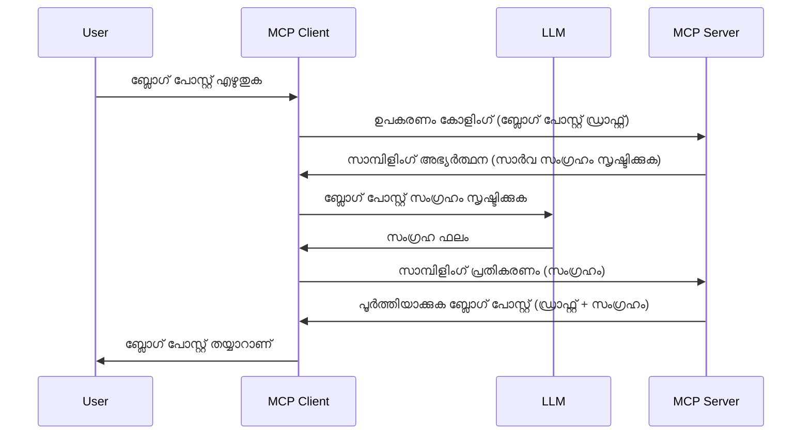

# സാംപ്ലിംഗ് - ക്ലയന്റിനു ഫീച്ചറുകൾ ഏൽപ്പിക്കുക

ഇടയ്ക്ക്, നിങ്ങൾക്ക് MCP ക്ലയന്റും MCP സെർവറും സഹകരിക്കേണ്ട അവശ്യമാണ് പൊതുവായ ഒരു ഉദ്ദേശ്യം നേടുന്നതിന്. സെർവർക്ക് ക്ലയന്റിൽ സീറ്റു ചെയ്യുന്ന LLM (ലാർജ്ജ് ലാംഗ്വേജ് മോഡൽ) യുടെ സഹായം ആവശ്യമായ ഒരു സാഹചര്യം ഉണ്ടായിരിക്കാം. അത്തരത്തിലുള്ള സാഹചര്യത്തിനായി, നിങ്ങൾ ഉപയോഗിക്കേണ്ടത് സാംപ്ലിങ്ങാണ്.

സാംപ്ലിംഗുമായി ബന്ധപ്പെട്ട ചില ഉപയോഗകേസുകൾ പരിശോധിക്കാം, സാംപ്ലിംഗ് ഉൾപ്പെടുത്തിയുള്ള ഒരു സ്ഥാപനം എങ്ങനെ നിർമ്മിക്കാമെന്ന് കണ്ടു നോക്കാം.

## ആമുഖം

ഈ പാഠത്തിൽ, സാംപ്ലിംഗ് എപ്പോൾ, എവിടെ ഉപയോഗിക്കണമെന്ന്, അത് എങ്ങനെ ക്രമീകരിക്കാമെന്നു വിശദീകരിക്കുന്നതിൽ ഞങ്ങൾ ശ്രദ്ധ കേന്ദ്രീകരിക്കും.

## പഠന ലക്ഷ്യങ്ങൾ

ഈ അധ്യായത്തിൽ, നമുക്ക് ചെയ്യേണ്ടത്:

- സാംപ്ലിംഗ് എന്താണെന്നും അത് എപ്പോൾ ഉപയോഗിക്കണമെന്ന് വിശദീകരിക്കുക.
- MCP-ലൂടെ സാംപ്ലിംഗ് എങ്ങനെ ക്രമീകരിക്കാമെന്ന് പ്രദർശിപ്പിക്കുക.
- സാംപ്ലിംഗിന്റെ പ്രവർത്തന ഉദാഹരണങ്ങൾ നൽകുക.

## സാംപ്ലിംഗ് എന്താണു, അത് എന്തിനാണു ഉപയോഗിക്കുന്നത്?

സാംപ്ലിംഗ് ഒരു എഡ്വാൻസ്ഡ് ഫീച്ചറാണ്, അത് താഴെ പറയുന്ന വിധത്തിൽ പ്രവർത്തിക്കുന്നു:



### സാംപ്ലിംഗ് അഭ്യർത്ഥനം

ശരത്, ഇപ്പോൾ വിശ്വാസയോഗ്യമായ ഒരു രംഗത്തിന്റെ ഉയരത്തിലുള്ള ഒരു കാഴ്ചയുണ്ട്, സാംപ്ലിംഗ് അഭ്യർത്ഥനയെക്കുറിച്ച് സംസാരിക്കാം, സെർവർ ക്ലയന്റിനു തിരികെ അയക്കുന്ന സാംപ്ലിംഗ് അഭ്യർത്ഥന ഇങ്ങനെ JSON-RPC ഫോർമാറ്റിൽ കാണപ്പെടും:

```json
{
  "jsonrpc": "2.0",
  "id": 1,
  "method": "sampling/createMessage",
  "params": {
    "messages": [
      {
        "role": "user",
        "content": {
          "type": "text",
          "text": "Create a blog post summary of the following blog post: <BLOG POST>"
        }
      }
    ],
    "modelPreferences": {
      "hints": [
        {
          "name": "claude-3-sonnet"
        }
      ],
      "intelligencePriority": 0.8,
      "speedPriority": 0.5
    },
    "systemPrompt": "You are a helpful assistant.",
    "maxTokens": 100
  }
}
```

ഇവിടെ ശ്രദ്ധിക്കുവാൻ ചില കാര്യങ്ങൾ ഉണ്ട്:

- Prompt, content -> text എന്നതിന്റെ കീഴിൽ, ഞങ്ങളുടെ പ്രോംപ്‌ട്ട് ആണ്, LLM നെ ബ്ലോഗ് പോസ്റ്റ് ഉള്ളടക്കം സംഗ്രഹിക്കാൻ നിർദ്ദേശിക്കുകയും ചെയ്യുന്നു.

- **modelPreferences**. ഈ വിഭാഗം വളരെ സാദാരണമാണ്, LLM ഉപയോഗിക്കാൻ എന്ത് ക്രമീകരണം വേണമെന്ന് ഒരു ഇഷ്‌ടാനുസരണം നിർദ്ദേശം. ഉപഭോക്താവിന് ഈ നിർദ്ദേശങ്ങൾ സ്വീകരിക്കാനും മാറ്റാൻ കൂടി കഴിയും. ഈ സാഹചര്യത്തിൽ മോഡൽ ഉപയോഗിക്കുന്നതും വേഗം, ബുദ്ധിമുട്ട് മുൻഗണനയും ഇവിടെ നിർദ്ദേശങ്ങളായി ഉണ്ട്.
- **systemPrompt**, ഇത് നിങ്ങളുടെ സാധാരണ സിസ്റ്റം പ്രോംപ്റ്റാണ്, LLM-ന് ഒരു വ്യക്തിത്വം നൽകുകയും മാർഗ്ഗനിർദ്ദേശങ്ങൾ ഉൾക്കൊള്ളുകയും ചെയ്യുന്നു.
- **maxTokens**, ഈ പ്രോപ്പർട്ടി ഈ പണിക്ക് എത്ര ടോക്കൺ ഉപയോഗിക്കണമെന്ന് നിർദ്ദേശിക്കാൻ വേണ്ടി ഉപയോഗിക്കുന്നു.

### സാംപ്ലിംഗ് പ്രതികരണം

MCP ക്ലയന്റ് സെർവറിലേക്ക് തിരികെ അയക്കുന്ന പ്രതികരണം ഇത്, ഇത് ക്ലയന്റ് LLM നെ വിളിച്ച്, പ്രതികരണം ലഭിച്ച് ഈ സന്ദേശം നിർമ്മിക്കുന്ന സമയത്ത് ഉണ്ടാക്കുന്ന ഫലം ആണ്. JSON-RPC ഫോർമാറ്റിൽ ഇത് ഇങ്ങനെ കാണാം:

```json
{
  "jsonrpc": "2.0",
  "id": 1,
  "result": {
    "role": "assistant",
    "content": {
      "type": "text",
      "text": "Here's your abstract <ABSTRACT>"
    },
    "model": "gpt-5",
    "stopReason": "endTurn"
  }
}
```

ഞങ്ങൾ അഭ്യർത്ഥിച്ചതുപോലെ ബ്ലോഗ് പോസ്റ്റിന്റെ ഒരു സർവകലാശാലയുടെ ശേഖരം ആണ് ഈ പ്രതികരണം എന്ന് ശ്രദ്ധിക്കുക. കൂടാതെ `model` ഉപയോഗിച്ചിട്ടുള്ളത് ഞങ്ങൾ അഭ്യർത്ഥിച്ച "claude-3-sonnet" അല്ല, പകരം "gpt-5" ആണ്. ഇത് ഉപഭോക്താവ് മോഡൽ മാറ്റാൻ കഴിയും എന്നത് കാണിക്കുന്നതിന് ഉദാഹരണമാണ്, നിങ്ങളുടെ സാംപ്ലിംഗ് അഭ്യർത്ഥന ഒരു നിർദ്ദേശം മാത്രമാണ്.

ശരേ, ഇപ്പോൾ മുഖ്യ പ്രവാഹം മനസ്സിലായി, "ബ്ലോഗ് പോസ്റ്റ് സൃഷ്ടി + സർവകലാശാല" എന്ന പ്രയോജനപ്രദമായ ടാസ്കിന് ഇത് ഉപയോഗിക്കാൻ വേണ്ടത് എന്തൊക്കെയെന്ന് നോക്കാം.

### സന്ദേശ തരംകൾ

സാംപ്ലിംഗ് സന്ദേശങ്ങൾ ടെക്സ്റ്റ് മാത്രമാകാത്ത, ചിത്രങ്ങളും ഓഡിയോവും വെക്കാം. JSON-RPC യിൽ ഇങ്ങനെ വ്യത്യാസപ്പെടുന്നു:

**ടെക്സ്റ്റ്**

```json
{
  "type": "text",
  "text": "The message content"
}
```

**ചിത്ര ഉള്ളടക്കം**

```json
{
  "type": "image",
  "data": "base64-encoded-image-data",
  "mimeType": "image/jpeg"
}
```

**ഓഡിയോ ഉള്ളടക്കം**

```json
{
  "type": "audio",
  "data": "base64-encoded-audio-data",
  "mimeType": "audio/wav"
}
```

> NOTE: സാംപ്ലിങിനെക്കുറിച്ചുള്ള കൂടുതൽ വിശദമായ വിവരങ്ങൾക്ക്, [അധികൃത ഡോക്യുമെന്റേഷൻ](https://modelcontextprotocol.io/specification/2025-11-25/client/sampling) പരിശോധിക്കുക

## ക്ലയന്റിൽ സാംപ്ലിംഗ് എങ്ങനെ ക്രമീകരിക്കാം

> ശ്രദ്ധിക്കുക: നിങ്ങൾ ഒരു സെർവർ മാത്രം നിർമ്മിക്കുകയാണെങ്കിൽ, ഇവിടെ അധികം ഒന്നും ചെയ്യേണ്ടതില്ല.

ഒരു ക്ലയന്റിൽ, താഴെ കാണിക്കുന്ന ഫീച്ചർ ഇങ്ങനെ വ്യക്തമാക്കണം:

```json
{
  "capabilities": {
    "sampling": {}
  }
}
```

നിന്ന് ഇതു തിരഞ്ഞെടുക്കുന്ന ക്ലയന്റ് സെർവറുമായി ഇൻഷാലൈസ് ചെയ്യുമ്പോൾ ഇത് സ്വീകരിക്കും.

## സാംപ്ലിംഗിന്റെ നടപ്പിലാക്കൽ ഉദാഹരണം - ബ്ലോഗ് പോസ്റ്റ് സൃഷ്ടി

നമുക്ക് ഒരു സാംപ്ലിംഗ് സെർവർ കോഡ് ചെയ്യാം, ഞങ്ങൾ ചെയ്യേണ്ടത്:

1. സെർവറിൽ ഒരു ചുമരുണ്ടാക്കുക.
1. ആ ടൂൾ ഒരു സാംപ്ലിംഗ് അഭ്യർത്ഥന സൃഷ്ടിക്കണം.
1. ടൂൾ ക്ലയന്റിന്റെ സാംപ്ലിംഗ് അഭ്യർത്ഥനക്ക് മറുപടി ലഭിക്കാൻ കാത്തിരിക്കണം.
1. പിന്നെ ടൂൾ ഫലം നിർമ്മിക്കണം.

കോഡ് ഘട്ടം ഘട്ടമായി നോക്കാം:

### -1- ടൂൾ ഉണ്ടാക്കൽ

**python**

```python
@mcp.tool()
async def create_blog(title: str, content: str, ctx: Context[ServerSession, None]) -> str:
    """Create a blog post and generate a summary"""

```

### -2- സാംപ്ലിംഗ് അഭ്യർത്ഥന സൃഷ്ടിക്കൽ

നിങ്ങളുടെ ടൂളിൽ താഴെ കാണുന്ന കോഡ് ചേർക്കുക:

**python**

```python
post = BlogPost(
        id=len(posts) + 1,
        title=title,
        content=content,
        abstract=""
    )

prompt = f"Create an abstract of the following blog post: title: {title} and draft: {content} "

result = await ctx.session.create_message(
        messages=[
            SamplingMessage(
                role="user",
                content=TextContent(type="text", text=prompt),
            )
        ],
        max_tokens=100,
)

```

### -3- പ്രതികരണം കാത്തിരിക്കുക, പ്രതികരണം തിരിച്ചുവിടുക

**python**

```python
post.abstract = result.content.text

posts.append(post)

# പൂർണ്ണമായ ഉത്പന്നം തിരികെ നൽകുക
return json.dumps({
    "id": post.title,
    "abstract": post.abstract
})
```

### -4- മുഴുവൻ കോഡ്

**python**

```python
from starlette.applications import Starlette
from starlette.routing import Mount, Host

from mcp.server.fastmcp import Context, FastMCP

from mcp.server.session import ServerSession
from mcp.types import SamplingMessage, TextContent

import json


from uuid import uuid4
from typing import List
from pydantic import BaseModel


mcp = FastMCP("Blog post generator")

# app = FastAPI()

posts = []

class BlogPost(BaseModel):
    id: int
    title: str
    content: str
    abstract: str

posts: List[BlogPost] = []

@mcp.tool()
async def create_blog(title: str, content: str, ctx: Context[ServerSession, None]) -> str:
    """Create a blog post and generate a summary"""

    post = BlogPost(
        id=len(posts) + 1,
        title=title,
        content=content,
        abstract=""
    )

    prompt = f"Create an abstract of the following blog post: title: {title} and draft: {content} "

    result = await ctx.session.create_message(
        messages=[
            SamplingMessage(
                role="user",
                content=TextContent(type="text", text=prompt),
            )
        ],
        max_tokens=100,
    )

    post.abstract = result.content.text

    posts.append(post)

    # സമ്പൂർണ്ണ ബ്ലോഗ് പോസ്റ്റ് തിരികെ നൽകുക
    return json.dumps({
        "id": post.title,
        "abstract": post.abstract
    })

if __name__ == "__main__":
    print("Starting server...")
    # mcp.run()
    mcp.run(transport="streamable-http")

# ആപ്പ് ഈ വിധം இயக்கുക: python server.py
```

### -5- Visual Studio Code-ൽ പരീക്ഷിക്കൽ

Visual Studio Code-ൽ ഇത് പരീക്ഷിക്കാൻ, ഇങ്ങനെ ചെയ്യുക:

1. ടെർമിനലിൽ സെർവർ ആരംഭിക്കുക
1. അത് *mcp.json* ഫയലിൽ ചേർക്കുക (ആരോഗ്യപ്രദമായി ആരംഭിച്ചിരിക്കുന്നതിനു ഉറപ്പു വരുത്തുക), ഉദാഹരണത്തിന് ഇങ്ങനെ:

   ```json
   "servers": {
      "blog-server": {
        "type": "http",
        "url": "http://localhost:8000/mcp"
      }
   }
   ```

1. ഒരു പ്രോംപ്‌റ് ടൈപ്പ് ചെയ്യുക:

   ```text
   create a blog post named "Where Python comes from", the content is "Python is actually named after Monty Python Flying Circus"
   ```

1. സാംപ്ലിംഗ് നടക്കാൻ അനുവദിക്കുക. ആദ്യം പരീക്ഷിക്കുമ്പോൾ നിങ്ങൾക്ക് ഒരു അധിക സംവാദം കാണിക്കപെടും, അത് അംഗീകരിക്കേണ്ടതാണ്, തുടർന്ന് സാധാരണ ടൂൾ റൺ ചെയ്യുമെന്ന് ചോദിക്കുന്ന സംവാദം കാണിക്കും.

1. ഫലങ്ങൾ പരിശോധിക്കുക. ഫലങ്ങൾ GitHub Copilot Chat-ൽ നന്നായി പ്രത്യക്ഷപ്പെടും. കൂടാതെ അശുദ്ധ JSON പ്രതികരണം പരിശോധിക്കാനും കഴിയും.

**ബോണസ്**. Visual Studio Code ടൂളിങ്ങ് സാംപ്ലിംഗിന് മികച്ച പിന്തുണ നൽകുന്നു. നിങ്ങളുടെ ഇൻസ്റ്റാൾ ചെയ്ത സെർവറിന്റെ സാംപ്ലിംഗ് ആക്‌സസ് ക്രമീകരിക്കാൻ ഇതുപോലെ പോകുക:

1. എക്സ്റ്റൻഷൻ സെക്ഷനിലേക്ക് പോകുക.
1. "MCP SERVERS - INSTALLED" സെക്ഷനിൽ ഇൻസ്റ്റാൾ ചെയ്ത സെർവറിന്റെ കോഗ് ഐക്കൺ തിരഞ്ഞെടുക്കുക.
1. "Configure Model Access" തിരഞ്ഞെടുക്കുക, ഇവിടെ GitHub Copilot സാംപ്ലിംഗ് പ്രവർത്തിപ്പിക്കുമ്പോൾ ഉപയോഗിക്കാനാവുന്ന മോഡലുകൾ തിരഞ്ഞെടുക്കാം. "Show Sampling requests" തിരഞ്ഞെടുക്കുന്നത് നിങ്ങൾക്ക് കഴിഞ്ഞകാല സാംപ്ലിംഗ് അഭ്യർത്ഥനകൾ കാണിക്കാൻ സഹായിക്കും.

## അസൈൻമെന്റ്

ഈ അസൈൻമെന്റിൽ, നിങ്ങൾ ഒന്നുകിൽ വ്യത്യസ്തമായ ഒരു സാംപ്ലിംഗ് ഉണ്ടാക്കണമെന്നു പറയാം, പ്രത്യേകിച്ച് ഒരു സൊമ്പ്ലിംഗ് സംയോജനം, ഉൽപ്പന്ന വിവരണം സൃഷ്ടിക്കാൻ പിന്തുണ നൽകുന്നതായുള്ളത്. നിങ്ങളുടെ രംഗം ഇങ്ങനെ ആണ്:

**രംഗം**: ഒരു ഇ-കൊമേഴ്സ് ബാക്ക് ഓഫ്‌ഫീസ് തൊഴിലാളിക്ക് സഹായം ആവശ്യമുണ്ട്, ഉൽപ്പന്ന വിവരണങ്ങൾ നിർമ്മിക്കാൻ ഏറെ സമയമെടുക്കുന്നു. അതുകൊണ്ട്, നിങ്ങൾ നിർമിക്കേണ്ടത് ഒരു ടൂൾ "create_product" എന്ന പേരിൽ "title"നും "keywords"നും ഓർഗ്യുമെന്റുകളായി വിളിക്കാവുന്നതും, ക്ലയന്റിന്റെ LLM ഉപയോഗിച്ച് പൂർണ്ണമായ ഉൽപ്പന്നം "description" ഫീൽഡോടെ സൃഷ്ടിക്കുന്നതുമാണ്.

TIP: മുമ്പ് പഠിച്ച ഘടകങ്ങൾ ഉപയോഗിച്ച് ഈ സെർവർ ടൂൾ സാംപ്ലിംഗ് അഭ്യർത്ഥന ഉപയോഗിച്ച് നിർമ്മിക്കുക.

## പരിഹാരം

[പരിഹാരം](./solution/README.md)

## പ്രധാന പാഠങ്ങൾ

സാംപ്ലിംഗ് ശക്തമായ ഒരു ഫീച്ചറാണ്, സെർവർക്ക് LLM സഹായത്തിനായി ടാസ്ക്കുകൾ ക്ലയന്റിന് ഏൽപ്പിക്കാനാകും.

## അടുത്തത് എന്ത്

- [അദ്ധ്യായം 4 - പ്രായോഗിക നടപ്പാക്കൽ](../../04-PracticalImplementation/README.md)

---

<!-- CO-OP TRANSLATOR DISCLAIMER START -->
**അറിയിപ്പ്**:
ഈ രേഖ AI പരിഭാഷാ സേവനം [Co-op Translator](https://github.com/Azure/co-op-translator) ഉപയോഗിച്ച് പരിഭാഷപ്പെടുത്തിയതാണ്. ഞങ്ങൾ കൃത്യതയ്ക്കായി ശ്രമിക്കുന്നുവെങ്കിലും, ഓട്ടോമേറ്റഡ് പരിഭാഷകളിൽ പിഴവുകൾ അല്ലെങ്കിൽ തെറ്റായ വിവരങ്ങൾ ഉണ്ടാകാൻ സാധ്യതയുണ്ട്. അതിന്റെ സ്വാഭാവിക ഭാഷയിലുള്ള അസൽ രേഖയാണ് പ്രാമാണികമായ ഉറവിടമായി പരിഗണിക്കേണ്ടത്. നിർണായകമായ വിവരങ്ങൾക്ക്, പ്രൊഫഷണൽ മനുഷ്യ പരിഭാഷ ശുപാർശ ചെയ്യുന്നു. ഈ പരിഭാഷ ഉപയോഗിച്ച് ഉണ്ടാകുന്ന തെറ്റിദ്ധാരണകൾ അല്ലെങ്കിൽ തെറ്റായ വ്യാഖ്യാനങ്ങൾക്കായി ഞങ്ങൾ ഉത്തരവാദികളല്ല.
<!-- CO-OP TRANSLATOR DISCLAIMER END -->