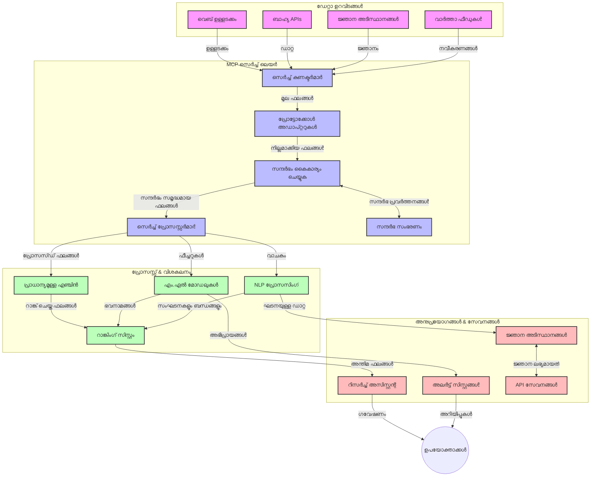
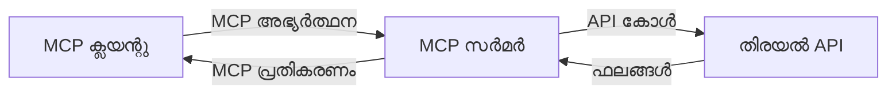
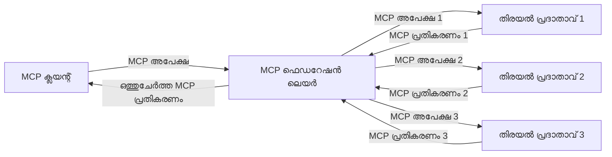
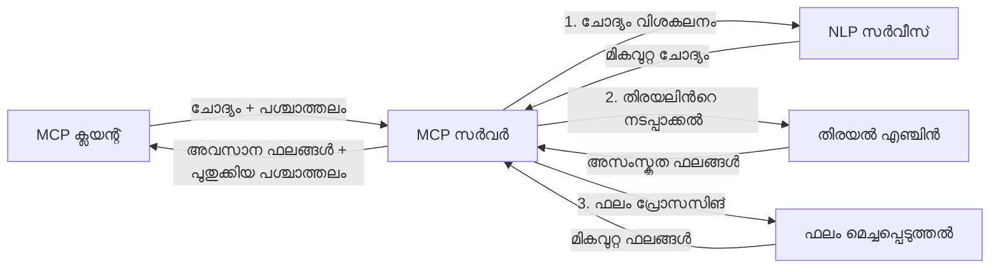

# റിയൽ-ടൈം വെബ് സെർച്ച് ഉപയോഗിക്കുന്നത് സംബന്ധിച്ച മോഡൽ കോൺടെക്സ്‌റ്റ് പ്രോട്ടോക്കോൾ

## അവലോകനം

ഇന്നത്തെ വിവരബന്ധിത പരിസ്ഥിതിയിൽ, അതിവേഗം പുതുക്കപ്പെടുന്ന വെബ്-അന്വേഷണ സേവനങ്ങൾ ആപ്ലിക്കേഷനുകൾക്ക് തൽക്ഷണവും പ്രസക്തവുമായ പ്രതികരണങ്ങൾ നൽകാൻ അനിവാര്യമായിരിക്കുന്നു. മോഡൽ കോൺടെക്സ്‌റ്റ് പ്രോട്ടോക്കോൾ (MCP) ഈ റിയൽ-ടൈം സെർച്ച് പ്രക്രിയകളുടെ കാര്യക്ഷമത മെച്ചപ്പെടുത്തുന്നതിൽ, കോൺടെക്സ്‌റ്റ് സംരക്ഷണം ഉറപ്പാക്കുന്നതിൽ, യഥാർഥ പെർഫോമൻസിൽ ശ്രദ്ധ കേന്ദ്രീകരിച്ച് അത്യന്തം പ്രമേയമായ പുരോഗതിയാണ്.

ഈ മോഡ്യൂളിൽ MCP എങ്ങനെ AI മോഡലുകൾ, സെർച്ച് എൻജിനുകൾ, ആപ്ലിക്കേഷനുകൾ എന്നിവയ്ക്ക് ഇടയിൽ കോൺടെക്സ്‌റ്റ് മാനേജ്മെന്റിന്റെ സ്റ്റാൻഡേർഡായ സമീപനംവഴി റിയൽ-ടൈം വെബ് സെർച്ചിനെ പരിവർത്തനം ചെയ്യുന്നുവെന്ന് പരിശോധിക്കുന്നു.

### നിങ്ങൾക്കു പഠിക്കാനിരിക്കുന്നത്

ഈ വിപുലമായ മാർഗ്ഗനിർദ്ദേശത്തിൽ, നിങ്ങൾക്ക് ഇതുകൾ മനസ്സിലാക്കാം:

- MCP എങ്ങനെ AI മോഡലുകളെയും റിയൽ-ടൈം വെബ് സെർച് ശേഷികളെയും പദംകൂർപ്പുള്ള ഒരു പാലത്തിലാക്കുന്നു
- MCP ഉപയോഗിച്ച് മികവുറ്റയും സ്കെയിലബിൾവുമായ സെർച്ച് പരിഹാരങ്ങൾ നടപ്പാക്കുന്നതിനുള്ള സ്ഥാപനരൂപ ശൈലികൾ
- അനേകം ക്വെറികൾക്കും ഇടപെടലുകൾക്കും ഇടയിൽ സെർച്ച് കോൺടെക്സ്‌റ്റ് സൂക്ഷിക്കുന്ന സാങ്കേതിക വിദ്യകൾ
- വിവിധ സെർച്ച് അനുഭവങ്ങളിൽ പൈതൺ, ജാവാസ്ക്രിപ്റ്റ് എന്നിവയിൽ പ്രായോഗിക കോഡ് നടപ്പാക്കലുകൾ
- MCP-നിർമ്മിത സെർച്ച് സംവിധാനങ്ങളിൽ പ്രസക്തി, പുതിയത്വം, പ്രകടനം എന്നിവയുടെ തുല്യത പാലിക്കുന്ന മാർഗ്ഗങ്ങൾ

## റിയൽ-ടൈം വെബ് സെർച്ചിന്റെ പരിചയം

റിയൽ-ടൈം വെബ് സെർച്ച് என்பது നവീകരിക്കുന്നതും പ്രസിദ്ധീകരിക്കുന്നതുമായ വെബ് അടിസ്ഥാനത്തിലുള്ള വിവരങ്ങളെ തുടർച്ചയായി അന്വേഷിച്ച്, പ്രോസസ് ചെയ്ത്, വിശകലനം ചെയ്ത്, കുറഞ്ഞ സമയ വൈകിയോടെയാണ് പുതിയവും പ്രസക്തവുമായ വിവരങ്ങൾ നൽകുന്ന സാങ്കേതിക സമീപനമാണ്. പരമ്പരാഗത സെർച്ച് സിസ്റ്റങ്ങൾ ഏഴ് മണിക്കൂറുകൾ മുതൽ ദിവസങ്ങൾ വരെയുള്ള ഇൻഡക്സ് ചെയ്ത ഡാറ്റ ഉപയോഗിക്കുന്നതിനു പകരം, റിയൽ-ടൈം സെർച്ച് ഓൺലൈൻ ഉള്ളടക്കത്തിന്റെ നിലവിലെ അവസ്ഥ പ്രതിഫലിപ്പിക്കുന്ന ലൈവ് ഡാറ്റ പ്രോസസ്സ് ചെയ്യുന്നു.

### റിയൽ-ടൈം വെബ് സെർച്ചിന്റെ പ്രധാന ആശയങ്ങൾ:

- **തുടർച്ചയായ ക്വെറി പ്രോസസ്സിംഗ്**: നിരന്തരം പുതുക്കപ്പെടുന്ന ഡാറ്റ സ്രോതസ്സുകളെതിരെ സെർച്ച് ക്വെറികൾ പ്രവർത്തിപ്പിക്കുന്നു  
- **പുതിയത്വം മുൻഗണന നൽകൽ**: പുതിയ വിവരങ്ങൾ മുൻഗണന നൽകാൻ സിസ്റ്റങ്ങൾ രൂപകൽപന ചെയ്തിരിക്കുന്നു  
- **പ്രസക്തി തുല്യം**: പുതിയത്വത്തിനും പ്രസക്തിക്കും ഇടയിൽ ബാലൻസ് കൃത്യമായി പാലിക്കുന്നു  
- **സ്കെയിലബിൾ ആർക്കിടെക്ചർ**: വ്യത്യസ്തമായ ക്വറി ഭാരത്തിനും ഡാറ്റ വാള്യത്തിനും കൈകാര്യം ചെയ്‌തുകൊണ്ടിരിക്കുന്ന സാഹചര്യം  
- **കോൺടെക്സ്‌റ്റ് മനസ്സിലാക്കൽ**: വാർത്താമുദ്രകൾക്കിടയിൽ ഉപയോക്തൃ കോൺടെക്സ്‌റ്റ് നിലനിർത്തുന്നത് ഫലപ്രദമായ ഫലങ്ങൾക്ക് നിർണായകമാണ്  
- **ഡൈനാമിക് ക്വെറി പുനർവ്യാഖ്യാനം**: മുൻ ഫലങ്ങളും കോൺടെക്സ്‌റ്റും അടിസ്ഥാനമാക്കി ക്വെറികൾ ജീർണ്ണവും മാറ്റുകയും ചെയ്യുന്നു  
- **മൾട്ടി-സോഴ്‌സ് സംയോജനം**: അനേകം സെർച്ച് പ്രൊവൈഡർമാരിൽ നിന്നുള്ള ഫലങ്ങൾ സംയോജിപ്പിക്കൽ  
- **സെമാന്റിക്ക് മനസ്സിലാക്കൽ**: കീーワードുകളിൽ മാത്രമല്ല; അർത്ഥത്തിൽ അടിസ്ഥാനപ്പെടുത്തി ക്വെറികളും ഉള്ളടക്കവും പ്രോസസ്സ് ചെയ്യുന്നു  
- **റിയൽ-ടൈം റാങ്കിംഗ്**: പുതിയ വിവരം ലഭിച്ചതിനൊപ്പം ഫലങ്ങളുടെ പരമ്പര ക്രമം ക്രമസമീകരിക്കുന്നു  

### മോഡൽ കോൺടെക്സ്‌റ്റ് പ്രോട്ടോക്കോൾ (MCP) അത് സംബന്ധിച്ചും റിയൽ-ടൈം വെബ് സെർച്ച്

 മോഡൽ കോൺടെക്സ്‌റ്റ് പ്രോട്ടോക്കോൾ (MCP) റിയൽ-ടൈം വെബ് സെർച്ച് മേഖലയിൽ താഴെ പറഞ്ഞ പ്രധാന വെല്ലുവിളികൾ പരിഹരിക്കുന്നു:

1. **സെർച്ച് കോൺടെക്സ്‌റ്റ് സംരക്ഷണം**: MCP വിപരീത സെർച്ച് ഘടകങ്ങളുടെ ഇടയിൽ കോൺടെക്സ്‌റ്റ് നിലനിർത്തുന്നതിന് സ്റ്റാൻഡേർഡ് നിർദ്ദേശങ്ങൾ നൽകുന്നു, AI മോഡലുകൾക്കും പ്രോസസ്സിംഗ് നോട്ടുകൾക്കും പ്രസക്തമായ ക്വെറി ചരിത്രവും ഉപയോക്തൃ മുൻഗണനകളും ലഭ്യമാക്കുന്നു.

2. **ഫലപ്രദമായ ക്വെറി മാനേജ്മെന്റ്**: കോൺടെക്സ്‌റി ദിശാബോധനത്തോടെ ഡേറ്റാ ഒതുക്കൽ വർദ്ധിപ്പിക്കാതെ MCP ഓരോ സെർച്ച് ചുറ്റിലും കോൺടെക്സ്‌റ്റ് പതിവ് ആവർത്തിക്കുന്നത് കുറക്കുന്നു.

3. **ഇന്റർഓപ്പറബിലിറ്റി**: MCP വ്യത്യസ്ത സെർച്ച് സാങ്കേതികവിദ്യകളും AI മോഡലുകളും തമ്മിലുള്ള കോൺടെക്സ്‌റ്റ് പങ്കുവെയ്ക്കാനായി സാധാരണ സാങ്കേതിക ഭാഷ വികസിപ്പിക്കുന്നു.

4. **സെർച്ച്-ഓപ്റ്റിമൈസ്ഡ് കോൺടെക്സ്‌റ്റ്**: MCP നടപ്പാക്കൽ സെർച്ച് കാര്യക്ഷമതക്കും കൃത്യതയ്ക്കും പ്രധാന പ്രാധാന്യമുള്ള കോൺടെക്സ്‌റ്റ് ഘടകങ്ങൾ മുൻഗണന നൽകാൻ കഴിയും.

5. **അഡാപ്റ്റീവ് സെർച്ച് പ്രോസസ്സിംഗ്**: MCP വഴി ശരിയായ കോൺടെക്സ്‌റ്റ് മാനേജ്മെന്റോടെ സിസ്റ്റങ്ങൾ ഉപയോക്തൃ ആവശ്യങ്ങളുടെയും വിവര സാഹചര്യങ്ങളുടെയും മാറലിനനുസരിച്ച് പ്രോസസ്സിംഗ് സ്വയം ക്രമീകരിക്കാം.

വാർത്താ ഏകീകരണങ്ങളിൽ നിന്ന് ഗവേഷണ സഹായി ആപ്പുകൾ വരെ, MCP വെബ് സെർച്ച് സാങ്കേതികവിദ്യകളുമായി സംയോജിപ്പിക്കുന്നത് കൂടുതൽ ബുദ്ധിമാനായ, കോൺടെക്സ്‌റ്റ്-ജ്ഞാനമുള്ള സെർച്ച് ഫലങ്ങൾ ഉപഭോക്തൃ ഇടപെടലുകൾക്കൊപ്പം കൂടുതൽ പ്രസക്തിയോടെ നൽകാൻ സഹായിക്കുന്നു.

## പഠന ലക്ഷ്യങ്ങൾ

ഈ അധ്യായം അവസാനിക്കുമ്പോൾ നിങ്ങൾക്ക്:

- റിയൽ-ടൈം വെബ് സെർച്ചിന്റെ അടിസ്ഥാനവും അതിൽ നേരിടുന്ന വെല്ലുവിളികളും മനസ്സിലാക്കുക  
- മോഡൽ കോൺടെക്സ്‌റ്റ് പ്രോട്ടോക്കോൾ (MCP) റിയൽ-ടൈം സെർച്ച് കഴിവുകൾ എങ്ങനെയാണ് മെച്ചപ്പെടുത്തുന്നത് എന്ന് വിശദീകരിക്കണം  
- ജനപ്രിയ ഫ്രെയിംവർക്കുകളും API-കളും ഉപയോഗിച്ച് MCP ആധാരിത സെർച്ചുകൾ നടപ്പാക്കുക  
- MCP ഉപയോഗിച്ച് സ്കെയിലബിൾ, ഉയർന്ന പെർഫോമൻസുള്ള സെർച്ച് ആർക്കിടെക്ചറുകൾ രൂപകൽപ്പന ചെയ്ത് വിന്യാസം ചെയ്യുക  
- സെമാന്റിക് സെർച്ച്, ഗവേഷണ സഹായം, AI-ആഗ്മെന്റഡ് ബ്രൗസിംഗ് തുടങ്ങിയ വിവിധ ഉപയോഗ കേസുകളിൽ MCP ആശയങ്ങൾ പ്രയോഗിക്കുക  
- MCP-അധിഷ്ഠിത സെർച്ച് സാങ്കേതിക സാധ്യതകളിൽ ഉയരുന്ന പ്രവണതകളും ഭാവി നവീകരണങ്ങളും വിലയിരുത്തുക  
- ഉപയോക്തൃ ഇടപെടലുകളിൽ നിന്നു പഠിക്കുന്ന കോൺടെക്സ്‌റ്റ്-അവബോധമുള്ള സെർച്ച് സിസ്റ്റങ്ങൾ വികസിപ്പിക്കുക  
- സ്റ്റാൻഡേർഡ് MCP പ്രോട്ടോക്കോളുകൾ വഴി വെബ് സെർച്ച് കഴിവുകൾ AI സഹകരണികളിലേക്ക് സംയോജിപ്പിക്കുക  
- കോൺടെക്സ്‌റിന്റെ അടിസ്ഥാനത്തിൽ ഫലങ്ങൾ ക്രമാതീതമായി വിശകലനം ചെയ്യുന്ന ബഹുമുഖ-ഘട്ട സെർച്ച് പൈപ്പ്‌ലൈനുകൾ സൃഷ്ടിക്കുക  
- സമഗ്രമായ കോൺടെക്സ്‌റ്റ് അവബോധം പാലിച്ചുകൊണ്ടുള്ള സെർച്ച് പ്രകടനം മെച്ചപ്പെടുത്തുക  

### നിർവചനവും പ്രാധാന്യവും

റിയൽ-ടൈം വെബ് സെർച്ച് കുറഞ്ഞ വൈകിയോടെ വെബ് അടിസ്ഥാനത്തിലുള്ള വിവരങ്ങളെ തുടർച്ചയായി അന്വേഷിച്ച്, തിരികെ നൽകുന്നതിനുള്ള സാങ്കേതികവുമാണ്. പരമ്പരാഗത സെർച്ച് എൻജിനുകൾ വെബ് ക്രോൾ ചെയ്ത് ഇടയ്ക്കിടെ ഇൻഡെക്സുകാരണം നടത്തുമ്പോൾ, റിയൽ-ടൈം സെർച്ച് ഏറ്റവും പുതിയ ഉള്ളടക്കത്തെ ഉടൻ പ്രദർശിപ്പിക്കാനുള്ള ശ്രമമാണ്.

റിയൽ-ടൈം വെബ് സെർച്ചിന്റെ പ്രധാന സവിശേഷതകൾ:

- **പുതിയത്വം**: പ്രസക്തവും തൽസമയവും ഉള്ള ഉള്ളടക്കം മുൻഗണന നൽകുന്നു  
- **തുടർച്ചയായ പ്രോസസ്സിംഗ്**: പുതിയ വിവരങ്ങൾക്കായി നിരന്തരം നിരീക്ഷണം  
- **ക്വെറി അനുയോജ്യം**: കോൺടെക്സ്‌റ്റ്, പ്രതികരണങ്ങളെ അടിസ്ഥാനമാക്കി തിരഞ്ഞെടുത്ത ക്വെറികൾ തിരുത്തുന്നു  
- **തൽക്ഷണ വിതരണങ്ങൾ**: കുറഞ്ഞ വൈകിയോടെ സെർച്ച് ഫലങ്ങൾ നൽകുന്നു  
- **കോൺടെക്സ്‌റ്റ് നിലനിർത്തൽ**: മുൻകൂറുള്ള ക്വെറികളിൽ നിന്നും മെച്ചപ്പെടുത്തിയ പ്രസക്തിക്ക് അടിസ്ഥാനമാകുന്നു  

### പരമ്പരാഗത വെബ് സെർച് നേരിടുന്ന വെല്ലുവിളികൾ

പരമ്പരാഗത വെബ് സെർച്ച് രീതികൾ റിയൽ-ടൈം സാഹചര്യങ്ങളിൽ ഉപയോഗിച്ചാൽ ചില പരിമിതികൾ കാണിക്കുന്നു:

1. **കോൺടെക്സ്‌റ്റ് പിരിച്ചുവിടൽ**: അനേകം ക്വെറികളിൽ സെർച്ച് കോൺടെക്സ്‌റ്റ് നിലനിർത്താൻ പ്രയാസം  
2. **വിവരത്തിലെ പുതുമ**: ഏറ്റവും പുതിയ വിവരങ്ങൾ ലഭിക്കലിലും മുൻഗണനയിലും വെല്ലുവിളികൾ  
3. **ഇൻറഗ്രേഷൻ സങ്കീർണത**: സെർച്ച് സിസ്റ്റങ്ങൾക്കും ആപ്ലിക്കേഷനുകൾക്കും ഇടയിലെ അനുരൂപം കുറവ്  
4. **വൈകി പ്രശ്നങ്ങൾ**: സമგൃഹിത സെർച്ച് പ്രক্রിയക്കും പ്രതികരണ സമയത്തിനുമിടയിലെ തുല്യഭാരം  
5. **പ്രസക്തി ക്രമീകരണം**: പുതിയത്വത്തെ മുൻഗണന നൽകിയാലും കൃത്യതയും പ്രസക്തിയും ഉറപ്പാക്കൽ  

## സെർച്ചിനുള്ള മോഡൽ കോൺടെക്സ്‌റ്റ് പ്രോട്ടോക്കോൾ (MCP) മനസ്സിലാക്കൽ

### സെർച്ച് കോൺടെക്സ്‌റ്റുകളിൽ MCP എന്താണ്?

മോഡൽ കോൺടെക്സ്‌റ്റ് പ്രോട്ടോക്കോൾ (MCP) AI മോഡലുകളും ആപ്ലിക്കേഷനുകളും തമ്മിലുള്ള കാര്യക്ഷമമായ ആശയവിനിമയം സജ്ജമാക്കാൻ രൂപകൽപ്പന ചെയ്ത സ്റ്റാൻഡേർഡഡ് പ്രോട്ടോക്കോൾ ആണ്. റിയൽ-ടൈം വെബ് സെർച്ച് സാഹചര്യത്തിൽ MCP താഴെ പറയുന്ന കാര്യങ്ങൾക്ക് രൂപരേഖ നൽകുന്നു:

- ക്വെറി സീക്വൻസുകൾക്കിടയിൽ സെർച്ച് കോൺടെക്സ്‌റ്റ് സംരക്ഷിക്കൽ  
- സെർച്ച് ക്വെറി, ഫലം ഫോർമാറ്റുകളുടെ സ്റ്റാൻഡേർഡൈസേഷൻ  
- സെർച്ച് പാരാമീറ്ററുകളും ഫലങ്ങളും കൊടുക്കുന്നതിന്റെ ട്രാൻസ്മിഷൻ മെച്ചപ്പെടുത്തിയതിനുള്ള ഓപ്റ്റിമൈസേഷൻ  
- മോഡൽ-ടു-സെർച്ച് എൻജിൻ ആശയവിനിമയം കൂട്ടിച്ചേർക്കൽ  

### പ്രധാന ഘടകങ്ങളും ആർക്കിടെക്ചറും

റിയൽ-ടൈം വെബ് സെർച്ച് MCP ആർക്കിടെക്ചർ ചില പ്രധാന ഘടകങ്ങൾ:

1. **ക്വെറി കോൺടെക്സ്‌റ്റ് ഹാൻഡ്ലറുകൾ**: അനേകം ക്വെറികളിലും സെർച്ച് കോൺടെക്സ്‌റ്റ് മാനേജും നിലനിർത്തും  
2. **സെർച്ച് പ്രോസസ്സറുകൾ**: കോൺടെക്സ്‌റ്റ് ജ്ഞാനത്തോടെ വരുന്ന സെർച്ച് അഭ്യർത്ഥനകൾ പ്രോസസ് ചെയ്യും  
3. **പ്രോട്ടോക്കോൾ അഡാപ്റ്റർമാർ**: വ്യത്യസ്ത സെർച്ച് API-കൾ തമ്മിൽ കോൺടെക്സ്‌റ്റ് സൂക്ഷിച്ച് പരിവർത്തനം ചെയ്യും  
4. **കോൺടെക്സ്‌റ്റ് സ്റ്റോർ**: സെർച്ച് ചരിത്രവും മുൻഗണനകളും കാര്യക്ഷമമായി സൂക്ഷിക്കും, തിരിച്ചു നൽകും  
5. **സെർച്ച് കണക്ടറുകൾ**: വിവിധ സെർച്ച് എൻജിനുകളും വെബ് API-കളും കണക്ട് ചെയ്യും  



### MCP റിയൽ-ടൈം വെബ് സെർച്ച് എങ്ങനെ മെച്ചപ്പെടുത്തുന്നു

MCP പരമ്പരാഗത വെബ് സെർച്ച് വെല്ലുവിളികൾക്ക് മറുപടി നൽകുന്നു:

- **കോൺടെക്സ്‌റ്റ് തുടർച്ച**: മുഴുവൻ സെർച്ച് സെഷനിലും ക്വെറികൾ തമ്മിലുള്ള ബന്ധം നിലനിർത്തുന്നു  
- **ഓപ്റ്റിമൈസ്ഡ് ട്രാൻസ്മിഷൻ**: ബുദ്ധിമുട്ടില്ലാത്ത കോൺടെക്സ്‌റ്റ് മാനേജ്മെന്റിലൂടെ സെർച്ച് പാരാമീറ്ററുകളുടെ ആവർത്തനം കുറയ്ക്കുന്നു  
- **സ്റ്റാൻഡേർഡൈസ്ഡ് ഇന്റർഫെയ്സുകൾ**: സെർച്ച് ഘടകങ്ങൾക്ക് ഏകസമാന APIകളിലൂടെ സേവനം നൽകുന്നു  
- **വൈകി കുറവ്**: കാര്യക്ഷമ കോൺടെക്സ്‌റ്റ് കൈകാര്യം ചെയ്തുകൊണ്ട് പ്രോസസ്സിംഗ് ഓവർഹെഡ് കുറയ്ക്കുന്നു  
- **ഉയർന്ന പ്രസക്തി**: ഒരേ ഉപയോക്താവിന്റെ പല ക്വെറികളിലേക്കും അവരുടെ ഉദ്ദേശ്യങ്ങൾ സംരക്ഷിച്ച് സെർച്ച് പ്രസക്തി മെച്ചപ്പെടുത്തുന്നു  

## സംയോജനം, നടപ്പാക്കൽ

റിയൽ-ടൈം വെബ് സെർച്ച് സിസ്റ്റങ്ങൾ പ്രകടനവും കോൺടെക്സ്‌റ്റ് അഖണ്ഡതയും നിലനിർത്താൻ സൂക്ഷ്മമായ ആർക്കിടെക്ചറൽ രൂപകൽപ്പനയും നടപ്പാക്കലും ആവശ്യമാണ്. മോഡൽ കോൺടെക്സ്‌റ്റ് പ്രോട്ടോക്കോൾ AI മോഡലുകളും സെർച്ച് സാങ്കേതികവിദ്യകളും സംയോജിപ്പിക്കാൻ സ്റ്റാൻഡേർഡായ സമീപനം നൽകുന്നു, ഇതിലൂടെ കൂടുതൽ ബുദ്ധിമാനായ, കോൺടെക്സ്‌റ്റ്-അവബോധമുള്ള സെർച്ച് പൈപ്പ്‌ലൈനുകൾ സൃഷ്ടിക്കാം.

### സെർച്ച് ആർക്കിടെക്ചറുകളിൽ MCP സംയോജനം - അവലോകനം

റിയൽ-ടൈം വെബ് സെർച്ച് പരിസ്ഥിതികളിൽ MCP നടപ്പാക്കുമ്പോൾ പല കാരണങ്ങൾ പരിഗണിക്കേണ്ടതാണ്:

1. **സെർച്ച് കോൺടെക്സ്‌റ്റ് സീരിയലൈസേഷൻ**: MCP സെർച്ച് അഭ്യർത്ഥനകളിൽ കോൺടെക്സ്‌റ്റ് വിവരങ്ങൾ കോഡ് ചെയ്ത് അടിസ്ഥാനപരമായി അതിവേഗം കൈമാറ്റം സാധ്യമാക്കുന്നു. ഇതിൽ സെർച്ച്-സംവരണ മെടാഡേറ്റയുമായി ബന്ധപ്പെട്ട സ്റ്റാൻഡേർഡ് സീരിയലൈസേഷൻ ഫോർമാറ്റുകളും ഉൾപ്പെടുന്നു.

2. **സ്റ്റേറ്റ്‌ഫുൾ സെർച്ച് പ്രോസസ്സിംഗ്**: MCP ധാരാളം സെർച്ച് ചുറ്റുകളിലൂടെ സ്ഥിരമായ കോൺടെക്സ്‌റ്റ് പ്രതിനിധാനം നിലനിർത്താൻ കഴിയുന്ന ബുദ്ധിമതികൾ ഒഴിവാക്കുന്നു. പ്രത്യേകിച്ച് മൾട്ടി-സ്റ്റേജ് സെർച്ച് പൈപ്പ്‍ലൈനുകളിൽ കോൺടെക്സ്‌റ്റ് പൂർത്തീകരിക്കുന്നത് ഫലം മെച്ചപ്പെടുത്തുന്നതിന് പ്രസക്തമാണ്.

3. **ക്വെറി വികസനം, പൂർത്തീകരണം**: MCP ആധാരിച്ചുള്ള సెർച്ച് സിസ്റ്റങ്ങൾക്കു സമാഹരിച്ച കോൺടെക്സ്‌റ്റിന്റെ അടിസ്ഥാനത്തിൽ ബുദ്ധിമാനായി ക്വെറി വികസിപ്പിക്കാനും പൂർത്തികരണത്തിനും സഹായം നൽകുന്നു, ഇതുമായി ചേർന്ന് സെഷൻ പുരോഗമിക്കെത്തിക്കുമ്പോൾ കൂടുതൽ പ്രസക്തവുമായ ഫലങ്ങൾ ലഭിക്കും.

4. **ഫലങ്ങളുടെ കാഷിങ്ങും മുൻഗണനയും**: MCP കോൺടെക്സ്‌റ്റ് കൈകാര്യം സ്റ്റാൻഡേർഡ് ആക്കിയതിനാൽ ഫലങ്ങൾ കാഷ് ചെയ്തെടുക്കാനും മുൻഗണന നൽകാനും ഇത് സഹായിക്കുന്നു, ഇതോടെ ഘടകങ്ങൾ വികസിക്കുന്ന കോൺടെക്സ്‌റ്റിന്റെ അടിസ്ഥാനത്തിൽ താല്പര്യം സെക്രട്ടാകും.

5. **സെർച്ച് ഫെഡറേഷൻ, ഏകീകരണം**: MCP നിരവധി ബാക്ക്‌എൻഡുകളിൽ നിന്ന് സെർച്ച് ഫെഡറേഷൻക്ക് സഹായകമായി സംയോജിത കോൺടെക്സ്‌റ്റ് പ്രതിനിധാനങ്ങൾ നൽകുന്നു, വ്യത്യസ്ത സ്രോതസ്സുകളിൽ നിന്നുള്ള ഫലങ്ങളുടെ മാന്യമായ ഏകീകരണം സാധ്യമാക്കുന്നു.

വിവിധ സെർച്ച് സാങ്കേതിക വിദ്യകളിൽ MCP നടപ്പാക്കൽ കൊണ്ട് കോൺടെക്സ്‌റ്റ് മാനേജ്മെന്റിനുള്ള സംയോജിത സമീപനം രൂപപ്പെടുന്നുണ്ട്, ഇതുവഴി ഉപയോക്തൃ ഇഷ്ടാനുഷ്ടാനങ്ങൾക്കനുസരിച്ച് സെർച്ച് ക്വെറികൾ സങ്കീർണ്ണമാകുമ്പോൾ അതിനെ ഫലപ്രദമായി കൈകാര്യം ചെയ്യുന്നതിന് സാങ്കേതിക സൗകര്യം നൽകുന്നു.

### വെബ് സെർച്ച് നടപ്പിലാക്കലുകളിൽ MCP

ഈ ഉദാഹരണങ്ങളിൽ ഇപ്പോഴത്തെ MCP സ്പെസിഫിക്കേഷനുമായി പൊരുത്തപ്പെടുന്ന JSON-RPC അടിസ്ഥാനത്തിലുള്ള പ്രോട്ടോക്കോൾ, വ്യത്യസ്ത ട്രാൻസ്പോർട്ട് രീതികൾ ഉൾപ്പെടുന്നു. താഴെ കാണുന്ന കോഡ് MCP പ്രോട്ടോക്കോൾ പൂർണമായും പിന്തുടർന്ന് കസ്റ്റം സെർച്ച് സംയോജനങ്ങൾ എങ്ങനെയാണ് നടപ്പിലാക്കുന്നത് എന്നത് വിശദീകരിക്കുന്നു.

<details>
<summary>Python - ജനറിക് സെർച്ച് API ഉപയോഗിച്ചുകളയൽ</summary>

```python
import asyncio
import json
import aiohttp
from typing import Dict, Any, Optional, List
from contextlib import asynccontextmanager
from collections.abc import AsyncIterator

# സ്റ്റാൻഡേർഡ് MCP ലൈബ്രറികൾ ഇമ്പോർട്ട് ചെയ്യുക
from mcp.client.session import ClientSession
from mcp.client.streamable_http import streamablehttp_client
from mcp.types import TextContent, CreateMessageRequestParams, CreateMessageResult
from mcp.server.fastmcp import FastMCP

# വെബ് തിരച്ചിനായി ഒരു ഫാസ്റ്റ്MCP സെർവർ സൃഷ്ടിക്കുക
search_server = FastMCP("WebSearch")

# വെബ് തിരച്ചിൽ പ്രവർത്തനങ്ങൾ കൈകാര്യം ചെയ്യാനുള്ള ക്ലാസ്
class WebSearchHandler:
    def __init__(self, api_endpoint: str, api_key: str):
        self.api_endpoint = api_endpoint
        self.api_key = api_key
        self.session = None
        
    async def initialize(self):
        """Initialize the HTTP session"""
        self.session = aiohttp.ClientSession(
            headers={"Authorization": f"Bearer {self.api_key}"}
        )
    
    async def close(self):
        """Close the HTTP session"""
        if self.session:
            await self.session.close()
            
    async def perform_search(self, query: str, max_results: int = 5, 
                           include_domains: List[str] = None, 
                           exclude_domains: List[str] = None,
                           time_period: str = "any") -> Dict[str, Any]:
        """Perform web search using the search API"""
        # തിരച്ചിൽ പാരാമീറ്ററുകൾ നിർമിക്കുക
        search_params = {
            "q": query,
            "limit": max_results,
            "time": time_period
        }
        
        if include_domains:
            search_params["site"] = ",".join(include_domains)
            
        if exclude_domains:
            search_params["exclude_site"] = ",".join(exclude_domains)
        
        # തിരച്ചിൽ അഭ്യർത്ഥന നിർവഹിക്കുക
        try:
            async with self.session.get(
                self.api_endpoint,
                params=search_params
            ) as response:
                if response.status != 200:
                    error_text = await response.text()
                    raise Exception(f"Search API error: {response.status} - {error_text}")
                
                search_data = await response.json()
                
                # API-നിർദിഷ്ട പ്രതികരണം ഒരു സ്റ്റാൻഡേർഡ് ഫോർമാറ്റിലേക്ക് മാറ്റുക
                results = []
                for item in search_data.get("results", []):
                    results.append({
                        "title": item.get("title", ""),
                        "url": item.get("url", ""),
                        "snippet": item.get("snippet", ""),
                        "date": item.get("published_date", ""),
                        "source": item.get("source", "")
                    })
                
                return {
                    "query": query,
                    "totalResults": len(results),
                    "results": results
                }
        except Exception as e:
            print(f"Search API request error: {e}")
            raise

# തിരച്ചിൽ ഹാൻഡ്ലർ ആരംഭിക്കുക
search_handler = WebSearchHandler(
    api_endpoint="https://api.search-service.example/search",
    api_key="your-api-key-here"
)

# തിരച്ചിൽ ഹാൻഡ്ലർ നിയന്ത്രിക്കാൻ ലൈഫ്സ്പാൻ സജ്ജമാക്കുക
@asyncio.asynccontextmanager
async def app_lifespan(server: FastMCP):
    """Manage application lifecycle"""
    await search_handler.initialize()
    try:
        yield {"search_handler": search_handler}
    finally:
        await search_handler.close()

# സെർവറിനുള്ള ലൈഫ്സ്പാൻ സെറ്റ് ചെയ്യുക
search_server = FastMCP("WebSearch", lifespan=app_lifespan)

# ഒരു വെബ് തിരച്ചിൽ ഉപകരണം രജിസ്റ്റർ ചെയ്യുക
@search_server.tool()
async def web_search(query: str, max_results: int = 5, 
                   include_domains: List[str] = None,
                   exclude_domains: List[str] = None,
                   time_period: str = "any") -> Dict[str, Any]:
    """
    Search the web for information
    
    Args:
        query: The search query
        max_results: Maximum number of results to return (default: 5)
        include_domains: List of domains to include in search results
        exclude_domains: List of domains to exclude from search results
        time_period: Time period for results ("day", "week", "month", "any")
        
    Returns:
        Dictionary containing search results
    """
    ctx = search_server.get_context()
    search_handler = ctx.request_context.lifespan_context["search_handler"]
    
    results = await search_handler.perform_search(
        query=query,
        max_results=max_results,
        include_domains=include_domains,
        exclude_domains=exclude_domains,
        time_period=time_period
    )
    
    return results

# ഉദാഹരണ ക്ലയന്റ് ഉപയോഗം
async def client_example():
    # Streamable HTTP ട്രാൻസ്പോട്ടിലൂടെ തിരച്ചിൽ സെർവർക്ക് കണക്ട് ചെയ്യുക
    async with streamablehttp_client("http://localhost:8000/mcp") as (read, write, _):
        async with ClientSession(read, write) as session:
            # കണക്ഷൻ ആരംഭിക്കുക
            await session.initialize()
            
            # web_search ഉപകരണം വിളിക്കുക
            search_results = await session.call_tool(
                "web_search", 
                {
                    "query": "latest developments in AI and Model Context Protocol",
                    "max_results": 5,
                    "time_period": "day",
                    "include_domains": ["github.com", "microsoft.com"]
                }
            )
            
            print(f"Search results: {search_results}")

# സെർവർ പ്രവർത്തന ഉദാഹരണം
if __name__ == "__main__":
    # Streamable HTTP ട്രാൻസ്പോട്ടോടെ സെർവർ പ്രവർത്തിപ്പിക്കുക
    search_server.run(transport="streamable-http")
```
</details>

<details>
<summary>ജാവാസ്ക്രിപ്റ്റ് - ബ്രൗസർ അധിഷ്ഠിത സെർച്ച് നടപ്പാക്കൽ</summary>

```javascript
// വെബ് തിരയലിനുള്ള MCP സർവർ നടപ്പാക്കൽ
import { McpServer, ResourceTemplate } from '@modelcontextprotocol/sdk/server/mcp.js';
import { StreamableHTTPServerTransport } from '@modelcontextprotocol/sdk/server/streamableHttp.js';
import { z } from 'zod';

// വെബ് തിരയലിനായി ഒരു MCP സർവർ സൃഷ്ടിക്കുക
const searchServer = new McpServer({
    name: "BrowserSearch",
    description: "A server that provides web search capabilities"
});

// തിരയൽ സേവന ക്ലാസ്
class SearchService {
    constructor(searchApiUrl, apiKey) {
        this.searchApiUrl = searchApiUrl;
        this.apiKey = apiKey;
    }

    async performSearch(parameters) {
        const {
            query = '',
            maxResults = 5,
            includeDomains = [],
            excludeDomains = [],
            timePeriod = 'any'
        } = parameters;
        
        // പാരാമീറ്ററുകളുമായി തിരയൽ URL നിർമ്മിക്കുക
        const url = new URL(this.searchApiUrl);
        url.searchParams.append('q', query);
        url.searchParams.append('limit', maxResults);
        url.searchParams.append('time', timePeriod);
        
        if (includeDomains.length > 0) {
            url.searchParams.append('site', includeDomains.join(','));
        }
        
        if (excludeDomains.length > 0) {
            url.searchParams.append('exclude_site', excludeDomains.join(','));
        }
        
        try {
            const response = await fetch(url.toString(), {
                method: 'GET',
                headers: {
                    'Authorization': `Bearer ${this.apiKey}`,
                    'Content-Type': 'application/json'
                }
            });
            
            if (!response.ok) {
                const errorText = await response.text();
                throw new Error(`Search API error: ${response.status} - ${errorText}`);
            }
            
            const searchData = await response.json();
            
            // API-നിർദ്ദിഷ്ട പ്രതികരണം ഒരു സ്റ്റാൻഡേർഡ് ഫോർമാറ്റിലേക്ക് മാറ്റുക
            const results = searchData.results?.map(item => ({
                title: item.title || '',
                url: item.url || '',
                snippet: item.snippet || '',
                date: item.published_date || '',
                source: item.source || ''
            })) || [];
            
            return {
                query,
                totalResults: results.length,
                results
            };
        } catch (error) {
            console.error('Search API request error:', error);
            throw error;
        }
    }
}

// തിരയൽ സേവനം പ്രാരംഭപ്പെടുത്തുക
const searchService = new SearchService(
    'https://api.search-service.example/search',
    'your-api-key-here'
);

// സർവറിനുള്ള കോൺടെക്സ്‌റ്റ് പ്രൊവൈഡർ സജ്ജമാക്കുക
searchServer.setContextProvider(() => {
    return {
        searchService
    };
});

// വെബ് തിരയൽ ടൂൾ രജിസ്റ്റർ ചെയ്യുക
searchServer.tool({
    name: 'web_search',
    description: 'Search the web for information',
    parameters: {
        type: 'object',
        properties: {
            query: {
                type: 'string',
                description: 'The search query'
            },
            maxResults: {
                type: 'integer',
                description: 'Maximum number of results to return',
                default: 5
            },
            includeDomains: {
                type: 'array',
                items: { type: 'string' },
                description: 'List of domains to include in search results'
            },
            excludeDomains: {
                type: 'array',
                items: { type: 'string' },
                description: 'List of domains to exclude from search results'
            },
            timePeriod: {
                type: 'string',
                description: 'Time period for results',
                enum: ['day', 'week', 'month', 'any'],
                default: 'any'
            }
        },
        required: ['query']
    },
    handler: async (params, context) => {
        const { searchService } = context;
        return await searchService.performSearch(params);
    }
});

// തിരയൽ സർവറുമായി കണക്റ്റ് ചെയ്യാനുള്ള ഉദാഹരണ ക്ലയന്റ് കോഡ്
import { Client } from '@modelcontextprotocol/sdk/client/index.js';
import { StreamableHTTPClientTransport } from '@modelcontextprotocol/sdk/client/streamableHttp.js';

async function connectToSearchServer() {
    // തിരയൽ സർവറുമായി കണക്റ്റ് ചെയ്യുക
    const transport = new StreamableHTTPClientTransport(
        new URL('http://localhost:8000/mcp')
    );
    
    const client = new Client({
        name: 'search-client',
        version: '1.0.0'
    });
    
    await client.connect(transport);
    
    // തിരയൽ ടൂൾ നിർവഹിക്കുക
    const searchResults = await client.callTool({
        name: 'web_search',
        arguments: {
            query: 'Model Context Protocol implementation examples',
            maxResults: 10,
            timePeriod: 'week',
            includeDomains: ['github.com', 'docs.microsoft.com']
        }
    });
    
    console.log('Search results:', searchResults);
    
    // ക്ലീൻഅപ്പ്
    await client.disconnect();
}

// സർവർ ആരംഭിക്കുക
const transport = new StreamableHTTPServerTransport();
await searchServer.connect(transport);
console.log('Search server running at http://localhost:8000/mcp');

// ഒരു പ്രത്യേക പ്രോസസ്സിൽ അല്ലെങ്കിൽ സർവർ തുടങ്ങിയതിന് ശേഷം
// connectToSearchServer().catch(console.error);
```
</details> 


## കോഡ് ഉദാഹരണങ്ങൾ സംബന്ധിച്ച കുറിപ്പ്

> **പ്രധാന കുറിപ്പ്**: താഴെ കൊടുത്തിരിക്കുന്ന കോഡ് ഉദാഹരണങ്ങൾ മോഡൽ കോൺടെക്സ്‌റ്റ് പ്രോട്ടോക്കോൾ (MCP) വെബ് സെർച്ച് ഫങ്‌ഷനാലിറ്റിയുമായി സംയോജിപ്പിക്കുന്നവിധമാണ്. ഔദ്യോഗിക MCP SDK-കളുടെ മാതൃകയും ഘടനകളും പിന്തുടരുന്നെങ്കിലും വിദ്യാഭ്യാസ ആവശ്യങ്ങൾക്ക് ഇത് ലളിതമാക്കിയിരിക്കുന്നു.  
>   
> ഈ ഉദാഹരണങ്ങൾ ഉൾപ്പെടുന്നു:  
>   
> 1. **Python നടപ്പായ FastMCP സർവർ**: ഒരു വെബ് സെർച്ച് ടൂൾ നൽകുകയും ബാഹ്യ സെർച്ച് API-യിൽ ബന്ധിപ്പിക്കുകയും ചെയ്യുന്നതാണ്. ഈ ഉദാഹരണം MCP Python SDKയുടെ ഔദ്യോഗിക രീതികൾ (https://github.com/modelcontextprotocol/python-sdk) പാലിച്ച് ജീവപരിധി മാനേജ്മെന്റ്, കോൺടെക്സ്‌റ്റ് കൈകാര്യം എന്നിവ തെളിയിക്കുന്നു. ഈ സർവർ പഴയ SSE ട്രാൻസ്പോർട്ടിന് പകരം ശുപാർശ ചെയ്ത Streamable HTTP ട്രാൻസ്പോർട്ട് ഉപയോഗിക്കുന്നു.  
>   
> 2. **JavaScript നടപ്പായ FastMCP പാറ്റേൺ**: MCP TypeScript SDK (https://github.com/modelcontextprotocol/typescript-sdk) അനുസരിച്ച് TypeScript/JavaScript ഉപയോഗിച്ച് നിർമ്മിച്ച സെർച്ച് സർവർ, ടൂൾ നിർവചനങ്ങളും ക്ലയന്റ് കണക്ഷനുകളും ഉൾക്കൊള്ളുന്നു. സെഷൻ മാനേജ്മെന്റ്, കോൺടെക്സ്‌റ്റ് സംരക്ഷണത്തിന് ഏറ്റവും പുതിയ ശുപാർശകൾ പിന്തുടരുന്നു.  
>   
> ഈ ഉദാഹരണങ്ങൾ പ്രായോഗിക ഉപയോഗത്തിനായി കൂടുതൽ പിശക് കൈകാര്യം ചെയ്യലുകൾ, ശരിയായ ഓതന്റിക്കേഷനും പ്രത്യേക API സ്രോതസ്സ് കോഡും ആവശ്യമാണ്. (`https://api.search-service.example/search`) സെർച്ച് API എൻഡ്പോയിന്റുകൾ പൊതു ഉദാഹരണമാണ്, അവ യഥാർത്ഥ സെർച്ച് സേവന എൻഡ്പോയിന്റുകളായി മാറ്റേണ്ടതാണ്.  
>   
> സമ്പൂർണ നടപ്പാക്കൽ വിവരങ്ങൾക്കും പ്രധാന MCP സ്‌പെസിഫിക്കേഷനും SDK ഡോക്യുമെന്റേഷനും https://spec.modelcontextprotocol.io/ സന്ദർശിക്കുക.

## മുഖ്യ ആശയങ്ങൾ

### മോഡൽ കോൺടെക്സ്‌റ്റ് പ്രോട്ടോക്കോൾ (MCP) ഫ്രെയിംവർക്ക്

ഏകദേശം, മോഡൽ കോൺടെക്സ്‌റ്റ് പ്രോട്ടോക്കോൾ AI മോഡലുകൾ, ആപ്ലിക്കേഷനുകൾ, സേവനങ്ങൾ തമ്മിൽ കോൺടെക്സ്‌റ്റ് കൈമാറ്റത്തിന് സ്റ്റാൻഡേർഡ് മാർഗം നൽകുന്നു. റിയൽ-ടൈം വെബ് സെർച്ച് സദസ്സുകളിൽ ഇത് സുസ്ഥിരമായ, മൾട്ടി-ടേൺ സെർച്ച് അനുഭവങ്ങൾ സൃഷ്ടിക്കാൻ അനിവാര്യമാണ്. പ്രധാന ഘടകങ്ങൾ:

1. **ക്ലയന്റ്-സർവർ ആർക്കിടെക്ചർ**: MCP സെർച്ച് ക്ലയന്റുകൾ (അഭ്യർത്ഥകർ) സെർച്ച് സർവറുകൾ (പ്രൊവൈഡർമാർ) സ്പഷ്ടമായി വേർതിരിച്ച് വഴിയൊരുക്കുന്നു, നിരവധിയായ വിന്യാസ മാതൃകകൾ അനുവദിക്കുന്നു.

2. **JSON-RPC ആശയവിനിമയം**: പ്രോട്ടോക്കോൾ സന്ദേശങ്ങൾ JSON-RPC ഉപയോഗിച്ച് കൈമാറുന്നു, വെബ് സാങ്കേതികവിദ്യകൾക്ക് അനുയോജ്യമാണ്, വ്യത്യസ്ത പ്ലാറ്റ്ഫോമുകളിൽ എളുപ്പത്തിൽ നടപ്പാക്കാം.

3. **കോൺടെക്സ്‌റ്റ് മാനേജ്മെന്റ്**: MCP മുഖാന്തിരം നിരവധി ഇടപെടലുകളിൽ സെർച്ച് കോൺടെക്സ്‌റ്റ് നിലനിർത്താനും നവീകരിക്കാനും ഉപയോഗിക്കുന്ന ഘടനാപരമായ രീതികൾ നിർവചിക്കുന്നു.

4. **ടൂൾ നിർവചനങ്ങൾ**: സെർച്ച് കഴിവുകൾ നിശ്ചിത പാരാമീറ്ററുകളിൽ ഉൾപ്പെടുത്തിയ സ്റ്റാൻഡേർഡ് ടൂളുകളായി പ്രദർശിപ്പിക്കുന്നു.

5. **സ്റ്റ്രീമിംഗ് പിന്തുണ**: ഫലങ്ങൾ എടുപ്പത്തോടെ ലഭിക്കാൻ സ്ട്രീമിംഗ് പിന്തുണിക്കുന്നു, പ്രത്യേകിച്ചും റിയൽ-ടൈം സെർച്ചിൽ അനിവാര്യമാണ്.

### വെബ് സെർച്ച് ഇന്റഗ്രേഷൻ പാറ്റേണുകൾ

MCP വെബ് സെർച്ചുമായി സംയോജിപ്പിക്കുമ്പോൾ പല സമാന മാതൃകകൾ കാണപ്പെടുന്നു:

#### 1. നേരിട്ടുള്ള സെർച്ച് പ്രൊവൈഡർ ഇന്റഗ്രേഷൻ


  
ഈ മാതൃകയിൽ, MCP സർവർ മുകളിൽ പറഞ്ഞ MCP അഭ്യർത്ഥനകൾ API പ്രത്യേക വിളികളായി തർജ്ജമ ചെയ്ത് ഫലങ്ങൾ MCP മറുപടികൾ ആക്കുകയും ചെയ്യും.

#### 2. കോൺടെക്സ്‌റ്റ് സംരക്ഷിക്കുന്ന ഫെഡറേറ്റഡ് സെർച്ച്


  
ഈ മാതൃക MCP-സമർത്ഥ സേർച്ച് പ്രൊവൈഡറുകളെ വലിയ തോതിൽ വിതരിച്ച്, ഉള്ളടക്ക തരം അല്ലെങ്കിൽ സെർച്ച് കഴിവുകളിൽ പ്രത്യേകത പുലർത്തുന്നവയെ തുടരുന്നു, ഏകോപിത കോൺടെക്സ്‌റ്റ് നിലനിർത്തുന്നു.

#### 3. കോൺടെക്സ്‌റ്റ് മെച്ചപ്പെടുത്തിയ സെർച്ച് ചൈനുകൾ


  
ഈ മാതൃകയിൽ സെർച്ച് പ്രക്രിയ പല ഘട്ടങ്ങളായി വിഭജിച്ച്, ഓരോ ഘട്ടത്തിലും കോൺടെക്സ്‌റ്റ് സമൃദ്ധമാക്കി, ക്രമീകൃതമായി കൂടുതൽ പ്രസക്തമായ ഫലങ്ങൾ ഉൽപാദിപ്പിക്കുന്നു.

### സെർച്ച് കോൺടെക്സ്‌റ്റിന്റെ ഘടകങ്ങൾ

MCP അടിസ്ഥാനത്തിലുള്ള വെബ് സെർച്ചിൽ കോൺടെക്സ്‌റ്റ് സാധാരണയായി ഉൾക്കൊള്ളുന്നു:

- **ക്വെറി ചരിത്രം**: സെഷനിലെ മുൻസരിയുടെ സെർച്ച് ക്വെറികൾ  
- **ഉപയോക്തൃ മുൻഗണനകൾ**: ഭാഷ, പ്രദേശം, സുരക്ഷിത സെർച്ച് ക്രമീകരണങ്ങൾ  
- **ഇടപെടൽ ചരിത്രം**: ക്ലിക്കുചെയ്ത ഫലങ്ങൾ, ഫലങ്ങളിൽ ചെലവഴിച്ച സമയം  
- **സെർച്ച് പാരാമീറ്ററുകൾ**: ഫിൽട്ടറുകൾ, ക്രമീകരണങ്ങൾ, മറ്റ് സെർച്ച് മാറ്റുകൾ  
- **വിഷയപരമായ അറിവ്**: സെർച്ച് പ്രാസക്തമായ വിഷയം സംബന്ധിച്ച കോൺടെക്സ്‌റ്റ്  
- **കാലക്രമത്തിലായ കോൺടെക്സ്‌റ്റ്**: സമയബന്ധിത പ്രസക്തി ഘടകങ്ങൾ  
- **സ്രോതസ്സിന്റെ മുൻഗണനകൾ**: വിശ്വാസയോഗ്യമായ അല്ലെങ്കിൽ ഇഷ്ടപ്പെട്ട വിവര സ്രോതസ്സ്  

## ഉപയോഗ കേസുകളും ആപ്ലിക്കേഷനുകളും

### ഗവേഷണവും വിവര ശേഖരണവും

MCP ഗവേഷണ പ്രവൃത്തികളിൽ മെച്ചപ്പെടുത്തുന്നു:

- ഗവേഷണ കോൺടെക്സ്‌റ്റ് വിവിധ സെർച്ച് സെഷനുകളിൽ നിലനിർത്തുന്നു  
- കൂടുതൽ പുരോഗമന മികവുറ്റ, കോൺടെക്സ്‌റ്റ് അനുസരിച്ചുള്ള ക്വെറികൾ സാധ്യമാക്കുന്നു  
- മൾട്ടി-സോഴ്‌സ് സെർച്ചിന്റെ ഫെഡറേഷൻ പിന്തുണ  
- സെർച്ച് ഫലങ്ങളിൽ നിന്ന് അറിവ് സ്വാധീനിക്കാൻ സജ്ജീകരണം  

### റിയൽ-ടൈം വാർത്താ, ട്രെൻഡ് നിരീക്ഷണം

MCP-ആധാരംവെച്ച സെർച്ച് വാർത്താ നിരീക്ഷണംക്കായി നൽകുന്നത്:

- ഉദയമാകുന്ന വാർത്തകളുടെ തൽസമയ കണ്ടെത്തൽ  
- പ്രസക്ത വിവരങ്ങളിൽ കോൺടെക്സ്‌റ്റ് അടിസ്ഥാനത്തിലുള്ള ഓർക്കൽ  
- വിവിധ സ്രോതസ്സുകളിൽ വിഷയം, ഘടകം ട്രാക്കിംഗ്  
- ഉപയോക്തൃ കോൺടെക്സ്‌റ്റ് അടിസ്ഥാനമാക്കിയ പേരണലൈസ്ഡ് വാർത്താ അറിയിപ്പുകൾ  

### AI-ആഗ്മെന്റഡ് ബ്രൗസിംഗ്, ഗവേഷണം

MCP പുതിയ സാധ്യതകൾ സൃഷ്ടിക്കുന്നു AI-ഓഗ്മെന്റഡ് ബ്രൗസിംഗിനായി:

- നിലവിലുള്ള ബ്രൗസർ പ്രവർത്തനത്തെ അടിസ്ഥാനമാക്കി പ്രസക്ത സെർച്ച് നിർദ്ദേശങ്ങൾ  
- വെബ് സെർച്ച് LLM-പ്രേരിത സഹകരണികളുമായി ക്രമരഹിത സംയോജനം  
- കോൺടെക്സ്‌റ്റ് നിലനിർത്തുന്ന മൾട്ടി-ടേൺ സെർച്ച് ശൈലികൾ  
- വിശദീകരണവും വിവര പരിശോധനയും മെച്ചപ്പെടുത്തൽ  

## ഭാവി പ്രവണതകളും നവീകരണങ്ങളും

### MCP-ന്റെ വെബ് സെർചിൽ പരിണാമം

ഭാവിയിൽ MCP താഴെപ്പറയുന്ന വിഷയങ്ങളെ അഭിമുഖീകരിക്കുന്നതിൽ കൂടുതൽ വളരാൻ സാധ്യതയുണ്ട്:
- **മൾട്ടിമോഡൽ സെർച്ച്**: പ്രസ്തുത സാന്ദർഭ്യം സംരക്ഷിച്ച് വാചകം, ചിത്രം, ശബ്ദം, വീഡിയൊ സെർച്ച് സംയോജിപ്പിക്കൽ
- **ഡെസെൻട്രലൈസ്ഡ് സെർച്ച്**: വിന്യസിതവും ഫെഡറേറ്റഡ് സെർച്ച് പരിസ്ഥിതികൾക്ക് പിന്തുണ നൽകുക
- **സേർച്ച് പ്രൈവസി**: സാന്ദർഭ്യ-മനസ്സിലാക്കിയ സ്വകാര്യത പരിരക്ഷിക്കുന്ന സെർച്ച് മെക്കാനിസങ്ങൾ
- **ക്വറിയി അണ്ഡർസ്റ്റാൻഡിംഗ്**: സ്വാഭാവിക ഭാഷ സെർച്ച് ക്വറി ദൃഢമായ സെമാന്റിക് പാർസിംഗ്

### സാങ്കേതികവിദ്യയില്‍ സാധ്യതയുള്ള പുരോഗതികൾ

ഭാവി MCP സെർച്ച് രൂപപ്പെടുത്തുന്ന ഉദയാസിക്കുന്ന സാങ്കേതികവിദ്യകൾ:

1. **ന്യൂറൽ സെർച്ച് ആർക്കിടെക്ചර්സ്**: MCP-യ്ക്ക് ഒപ്റ്റിമൈസ് ചെയ്ത എംബഡ്ഡിംഗ്-അധിഷ്ഠിത സെർച്ച് സിസ്റ്റങ്ങൾ
2. **വ്യക്തിഗതമാക്കപ്പെട്ട സെർച്ച് സാന്ദർഭ്യം**: വ്യക്തിഗത ഉപയോക്തൃ സെർച്ച് മാതൃകകൾ സമയക്രമത്തിലുള്ള പഠനം
3. **നൊളജ്ജ് ഗ്രാഫ് ഇന്റഗ്രേഷൻ**: ഡൊമെയ്ൻ-സ്പെസിഫിക് നൊളജ്ജ് ഗ്രാഫുകൾ കൊണ്ട് വർധിപ്പിച്ച സാന്ദർഭ്യ-അധികൃത സെർച്ച്
4. **ക്രോസ്-മോഡൽ സാന്ദർഭ്യം**: വ്യത്യസ്ത സെർച്ച് മോഡാലിറ്റികളിലൂടെ സാന്ദർഭ്യം നിലനിർത്തൽ

## ഹാൻഡ്‌സ്-ഓൺ അഭ്യാസങ്ങൾ

### അഭ്യാസം 1: അടിസ്ഥാന MCP സെർച്ച് പൈപ്പ്‌ലൈൻ സജ്ജീകരിക്കൽ

ഈ അഭ്യാസത്തിൽ, നിങ്ങൾ പഠിക്കും:
- ഒരു അടിസ്ഥാന MCP സെർച്ച് പരിസ്ഥിതി കോൺഫിഗർ ചെയ്യുന്നത്
- വെബ് സെർച്ചിനുള്ള സാന്ദർഭ്യ ഹാൻഡ്ലറുകൾ നടപ്പിലാക്കുന്നത്
- സെർച്ച് ആവൃത്തികൾക്ക് ഇടയിൽ സാന്ദർഭ്യ സംരക്ഷണം പരിശോധിച്ചു സ്ഥിരീകരിക്കുക

### അഭ്യാസം 2: MCP സെർച്ച് ഉപയോഗിച്ച് റിസർച്ച് അസിസ്റ്റന്റ് നിർമ്മാണം

സമ്പൂർണ അപ്ലിക്കേഷൻ സൃഷ്ടിക്കുക, അത്:
- സ്വാഭാവിക ഭാഷാ ഗവേഷണ ചോദ്യങ്ങൾ പ്രോസസ്സ് ചെയ്യുന്നു
- സാന്ദർഭ്യ-അധികൃത വെബ് സെർച്ച് നടത്തുന്നു
- നിരവധി സ്രോതസ്സുകളിൽ നിന്നുള്ള വിവരങ്ങൾ സംയോജിപ്പിക്കുന്നു
- സംഘടനാപരമായ ഗവേഷണ കണ്ടെത്തലുകൾ അവതരിപ്പിക്കുന്നു

### അഭ്യാസം 3: MCP ഉപയോഗിച്ച് മൾട്ടി-സ്രോതസ്സ് സെർച്ച് ഫെഡറേഷൻ നടപ്പിലാക്കൽ

ഉന്നത തല അഭ്യാസം:
- നിരവധി സെർച്ച് എഞ്ചിനുകളിൽ സാന്ദർഭ്യ-അധികൃത ക്വറിയി വിതരണം
- ഫലങ്ങളുടെ റാങ്കിംഗ്, സമാഹാരം
- സെർച്ച് ഫലങ്ങളുടെ സാന്ദർഭ്യ-അധികൃത ഡെഡുപ്ലിക്കേഷൻ
- സ്രോതസ്സ്-സ്പെസിഫിക് മെറ്റാഡേറ്റ കൈകാര്യം ചെയ്യൽ

## അധികമായ വിഭവങ്ങൾ

- [Model Context Protocol Specification](https://spec.modelcontextprotocol.io/) - ഔദ്യോഗിക MCP സ്‌പെസിഫിക്കേഷൻ, വിവരണാത്മക പ്രോട്ടോക്കോൾ ഡോക്യുമെന്റേഷൻ
- [Model Context Protocol Documentation](https://modelcontextprotocol.io/) - വിശദമായ ട്യൂട്ടോറിയലുകളും നടപ്പിലാക്കൽ മാർഗ്ഗനിർദ്ദേശങ്ങളും
- [MCP Python SDK](https://github.com/modelcontextprotocol/python-sdk) - MCP പ്രോട്ടോക്കോൾ Python നടപ്പിലാക്കൽ
- [MCP TypeScript SDK](https://github.com/modelcontextprotocol/typescript-sdk) - MCP പ്രോട്ടോക്കോൾ TypeScript നടപ്പിലാക്കൽ
- [MCP Reference Servers](https://github.com/modelcontextprotocol/servers) - MCP സർവറുകളുടെ റഫറൻസ് നടപ്പിലാക്കലുകൾ
- [Bing Web Search API Documentation](https://learn.microsoft.com/en-us/bing/search-apis/bing-web-search/overview) - Microsoft-ന്റെ വെബ് സെർച്ച് API
- [Google Custom Search JSON API](https://developers.google.com/custom-search/v1/overview) - ഗൂഗിൾ പ്രോഗ്രാമബിൾ സെർച്ച് എഞ്ചിൻ
- [SerpAPI Documentation](https://serpapi.com/search-api) - സെർച്ച് എഞ്ചിൻ ഫലങ്ങൾ API
- [Meilisearch Documentation](https://www.meilisearch.com/docs) - ഓപ്പൺ സോഴ്സ് സെർച്ച് എഞ്ചിൻ
- [Elasticsearch Documentation](https://www.elastic.co/guide/index.html) - വിന്യസിത സെർച്ച്, വിശകലന എഞ്ചിൻ
- [LangChain Documentation](https://python.langchain.com/docs/get_started/introduction) - LLM-കളോടെ അപ്ലിക്കേഷനുകൾ നിർമ്മിക്കൽ

## പഠനഫലങ്ങൾ

ഈ മഡ്യൂൾ പൂർത്തിയാക്കിയാൽ, നിങ്ങൾ შეძლുന്നതാണ്:

- പ്രത്യക്ഷ സമയത്തിലെ വെബ് സെർച്ച് അടിസ്ഥാനങ്ങളും അതിന്റെ വെല്ലുവിളികളും മനസ്സിലാക്കുക
- Model Context Protocol (MCP) പ്രത്യക്ഷ സമയം വെബ് സെർച്ച് കഴിവുകൾ എങ്ങനെ മെച്ചപ്പെടുത്തുന്നു എന്ന് വിശദീകരിക്കുക
- പ്രശസ്ത ഫ്രെയിംവർക്കുകളും API-കളും ഉപയോഗിച്ച് MCP ആധാരിത സെർച്ച് പരിഹാരങ്ങൾ നടപ്പിലാക്കുക
- MCP ഉപയോഗിച്ച് സ്കെയിലബിൾ, ഉയർന്ന പ്രകടന ശേഷിയുള്ള സെർച്ച് ആർക്കിടെക്ചറുകൾ രൂപകల్పനയും ഡിപ്പ്ലോയ്മെന്റും ചെയ്യുക
- സെമാന്റിക് സെർച്ച്, ഗവേഷണ സഹായം, AI കൂട്ടിച്ചേർക്കൽ ബ്രൗസിംഗ് ഉൾപ്പെടേയാണ് MCP ആശയങ്ങൾ വിവിധ ഉപയോഗ കേസുകളിൽ പ്രയോഗിക്കുക
- MCP ആധാരിത സെർച്ച് സാങ്കേതികവിദ്യകളിലെ ഉദയാസിക്കുന്ന തരങ്ങള്‍ക്കും ഭാവി നവീകരണങ്ങൾക്കുമായി വിലയിരുത്തൽ നടത്തുക

### വിശ്വാസവും സുരക്ഷയും സംബന്ധിച്ച പരിഗണനകൾ

MCP-ആധാരിത വെബ് സെർച്ച് പരിഹാരങ്ങൾ നടപ്പിലാക്കുമ്പോൾ, MCP സ്‌പെസിഫിക്കേഷനിൽ നിന്നുള്ള ഈ പ്രധാന സിദ്ധാന്തങ്ങൾ ഓർമ്മിക്കുക:

1. **ഉപയോക്തൃ സമ്മതവും നിയന്ത്രണവും**: എല്ലാ ഡാറ്റ ആക്‌സസിനും പ്രവർത്തനങ്ങൾക്കും ഉപയോക്താക്കൾ വ്യക്തമായ സമ്മതവും മനസ്സിലാക്കലും ഉണ്ടായിരിക്കണം. പ്രത്യേകിച്ച്, ബാഹ്യ ഡാറ്റ സ്രോതസ്സുകളിൽ പ്രവേശിക്കാവുന്ന വെബ് സെർച്ച് നടപ്പിലാക്കലുകൾക്കിത് അത്യന്താപേക്ഷിതമാണ്.

2. **ഡാറ്റാ സ്വകാര്യത**: സെർച്ച് ക്വറികളുടേയും ഫലങ്ങളുടേയും ശാസ്ത്രീയ കൈകാര്യം ഉറപ്പാക്കുക, പ്രത്യേകിച്ച് അത് അതിസംബന്ധപ്പെട്ട വിവരങ്ങൾ ഉൾപ്പെടുന്നതെങ്കിൽ. ഉപയോക്തൃ ഡാറ്റ സംരക്ഷിക്കാൻ പ്രസക്തമായ ആക്‌സസ് നിയന്ത്രണങ്ങൾ നടപ്പാക്കുക.

3. **ടൂൾ സുരക്ഷ**: സെർച്ച് ടൂളുകൾക്ക് ശരിയായ അവകാശപത്രവും പരിശോധനയും നടപ്പിലാക്കുക, കാരണം അവ അനിയന്ത്രിത കോഡ് പ്രവർത്തനത്തിലൂടെ സുരക്ഷാ അപകടസാധ്യതകൾ പ്രതിനിധീകരിക്കുന്നു. ടൂൾ പെരുമാറ്റത്തിന്റെ വിവരണങ്ങൾ വിശ്വസനീയമായി കണക്കാക്കരുത്, അവ വിശ്വസനീയമായ സർവറിൽ നിന്നല്ലെങ്കിൽ.

4. **വിവരസൂചകം**: MCP ആധാരിത സെർച്ച് നടപ്പിലാക്കലിന്റെ ശേഷികൾ, പരിമിതികൾ, സുരക്ഷാ പരിഗണനകൾക്കുറിച്ച് തെളിവു വ്യക്തമാക്കി ഡോക്യുമെന്റേഷൻ നൽകുക, MCP സ്‌പെസിഫിക്കേഷന്റെ നടപ്പിലാക്കൽ മാർഗ്ഗനിർദ്ദേശങ്ങൾ പാലിച്ചുകൊണ്ട്.

5. **ഉറച്ച ശരിയായ സമ്മത ഫ്‌ളോകൾ**: ഓരോ ടൂളിന്റെയും ഉപയോഗത്തിന് അനുയോജ്യമായ അനുവാദം നൽകുന്നതിന് മുമ്പ്, പ്രത്യേകിച്ചും ബാഹ്യ വെബ് സ്രോതസ്സുകളുമായി ഇടപഴകുന്ന ടൂളുകൾക്കായി, ടൂൾ ചെയ്യുന്ന പ്രവൃത്തി വ്യക്തമായി വിശദീകരിക്കുന്ന ഉറച്ച സമ്മതവും അവകാശവാദ ഫ്‌ളോകൾ നിർമ്മിക്കുക.

MCP സുരക്ഷയും വിശ്വാസ പരിഗണനകളും സംബന്ധിച്ച പൂർണ്ണ വിവരങ്ങൾക്ക്, [ഓഫീഷ്യൽ ഡോക്യുമെന്റേഷൻ](https://modelcontextprotocol.io/specification/2025-11-25/basic/security_best_practices) കാണുക.

## അടുത്തത് 

- [5.12 Entra ID Authentication for Model Context Protocol Servers](../mcp-security-entra/README.md)

---

<!-- CO-OP TRANSLATOR DISCLAIMER START -->
**അറിയിപ്പ്**:
ഈ രേഖ AI പരിഭാഷാ സേവനം [Co-op Translator](https://github.com/Azure/co-op-translator) ഉപയോഗിച്ച് പരിഭാഷപ്പെടുത്തിയതാണ്. ഞങ്ങൾ കൃത്യതയ്ക്കായി ശ്രമിക്കുന്നുവെങ്കിലും, ഓട്ടോമേറ്റഡ് പരിഭാഷകളിൽ പിഴവുകൾ അല്ലെങ്കിൽ തെറ്റായ വിവരങ്ങൾ ഉണ്ടാകാൻ സാധ്യതയുണ്ട്. അതിന്റെ സ്വാഭാവിക ഭാഷയിലുള്ള അസൽ രേഖയാണ് പ്രാമാണികമായ ഉറവിടമായി പരിഗണിക്കേണ്ടത്. നിർണായകമായ വിവരങ്ങൾക്ക്, പ്രൊഫഷണൽ മനുഷ്യ പരിഭാഷ ശുപാർശ ചെയ്യുന്നു. ഈ പരിഭാഷ ഉപയോഗിച്ച് ഉണ്ടാകുന്ന തെറ്റിദ്ധാരണകൾ അല്ലെങ്കിൽ തെറ്റായ വ്യാഖ്യാനങ്ങൾക്കായി ഞങ്ങൾ ഉത്തരവാദികളല്ല.
<!-- CO-OP TRANSLATOR DISCLAIMER END -->