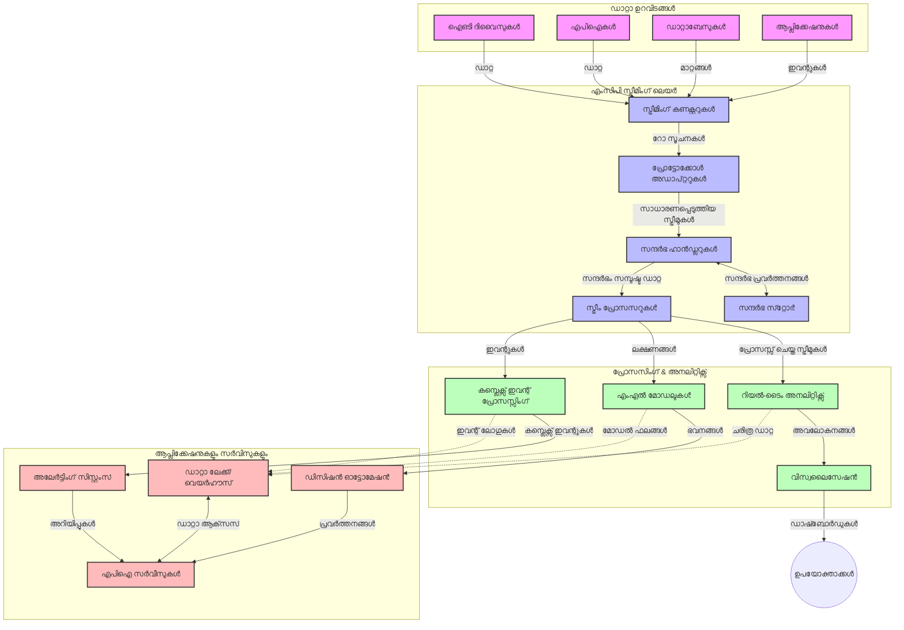

# റിയൽ-ടൈം ഡാറ്റാ സ്ട്രീമിംഗിനായി മോഡൽ കോൺടെക്സ് പ്രോട്ടോക്കോൾ

## അവലോകനം

ഇന്നത്തെ ഡാറ്റാ അധിഷ്ഠിത ലോകത്ത്, ബിസിനസുകളും ആപ്ലിക്കേഷനുകളും സമയബന്ധിത തീരുമാനങ്ങൾ എടുക്കുന്നതിനായി ഉടൻ വിവരങ്ങളിലേക്ക് പ്രവേശനം ആവശ്യപ്പെടുന്ന സാഹചര്യത്തിൽ റിയൽ-ടൈം ഡാറ്റാ സ്ട്രീമിംഗ് അനിവാര്യമായിട്ടുണ്ട്. മോഡൽ കോൺടെക്സ് പ്രോട്ടോക്കോൾ (MCP) ഈ റിയൽ-ടൈം സ്ട്രീമിംഗ് പ്രക്രിയകളെ മെച്ചപ്പെടുത്തുന്നതിൽ അർഥവത്തായ പുരോഗതിയാണ്, ഡാറ്റാ പ്രോസസ്സിങ് കാര്യക്ഷമത വർദ്ധിപ്പിക്കുകയും, കോൺടെക്സ് സംരക്ഷിക്കുകയും, സമഗ്ര സിസ്റ്റം പ്രകടനം മെച്ചപ്പെടുത്തുകയും ചെയ്യുന്നു.

ഈ മോഡ്യൂൾ MCP യെ എങ്ങനെ റിയൽ-ടൈം ഡാറ്റാ സ്ട്രീമിംഗ് പരിസ്ഥിതികളിൽ AI മോഡളുകളും സ്ട്രീമിംഗ് പ്ലാറ്റ്‌ഫോമുകളും ആപ്ലിക്കേഷനുകളും തമ്മിലുള്ള കോൺടെക്സ് മാനേജ്മെന്റിന് ഒരു മാനദണ്ഡപരമായ സമീപനം നൽകിക്കൊണ്ട് രൂപാന്തരപ്പെടുത്തുന്നതായാണ് പരിശോധിക്കുന്നത്.

## റിയൽ-ടൈം ഡാറ്റാ സ്ട്രീമിംഗിന്റെ പരിചയം

റിയൽ-ടൈം ഡാറ്റാ സ്രോതസം സൃഷ്ടിച്ചോടിരിക്കുന്നതോടൊപ്പം തുടർച്ചയായ ഡാറ്റാ സംവഹനം, പ്രോസസ്സിങ്, വിശകലനം എന്നിവക്ക് ಅವಕಾಶം നൽകുന്ന സാങ്കേതിക പരിസരമാണ്, പുതിയ വിവരങ്ങൾക്ക് ഉടൻ പ്രതികരിക്കാനാകും. പരമ്പരാഗത ബാച്ച് പ്രോസസ്സിങ്ങ് സ്റ്റാറ്റിക് ഡാറ്റാസെറ്റുകളെ അടിസ്ഥാനമാക്കിയുള്ളതിന്റെ വ്യത്യാസത്തോടെ, സ്ട്രീമിംഗ് സിസ്റ്റങ്ങൾ ജലജിബോധിതമായി ഡാറ്റാ കൈകാര്യം ചെയ്ത് കുറഞ്ഞ വൈകിപ്പുറവും ഉപയോഗخشം അറിയിക്കുകയും ചെയ്യും.

### റിയൽ-ടൈം ഡാറ്റാ സ്ട്രീമിംഗിന്റെ അടിസ്ഥാന ആശയങ്ങൾ:

- **തുടർച്ചയായ ഡാറ്റാ സ്രോതസം**: ഡാറ്റ തിരിച്ചറിയലുകൾ അല്ലെങ്കിൽ രേഖകൾ ഒരവസാനമില്ലാത്ത തുടർച്ചയായ സ്ട്രീമായി പ്രോസസ്സ് ചെയ്യപ്പെടുന്നു.
- **കുറഞ്ഞ വൈകിപ്പുറം പ്രോസസ്സിങ്**: ഡാറ്റാ സൃഷ്ടിയും പ്രോസസ്സിങും തമ്മിലുള്ള സമയത്തിൻറെ കുറവാക്കലിന് സിസ്റ്റങ്ങൾ രൂപകൽപ്പന ചെയ്യപ്പെട്ടിട്ടുണ്ട്.
- **സ്കേച്ചബിലിറ്റിയാണ്**: വ്യത്യസ്ത ഡാറ്റാ വോളിയങ്ങളും വേഗതകളും കൈകാര്യം ചെയ്യാനുള്ള സ്ട്രീമിംഗ് ആർക്കിടെക്ചറുകൾ ആവശ്യമാണ്.
- **ഫോൾട്ട് ടോളറൻസ്**: നിരന്തരമായ ഡാറ്റാ സ്രോതസം ഉറപ്പാക്കാൻ പരാജയങ്ങളിൽ നിന്നുള്ള ലാഠ്യത ചെയ്യണം.
- **സ്റ്റേറ്റ്‌ഫുൾ പ്രോസസ്സിങ്**: സംഭവങ്ങൾക്ക് ഇടയിൽ കോൺടെക്സ് നിലനിർത്തുന്നത് ഗൂഢാർത്ഥപരമായ വിശകലനത്തിന് അനിവാര്യമാണ്.

### മോഡൽ കോൺടെക്സ് പ്രോട്ടോക്കോൾ (MCP)യും റിയൽ-ടൈം സ്ട്രീമിംഗും

Model Context Protocol (MCP) റിയൽ-ടൈം സ്ട്രീമിംഗ് പരിസ്ഥിതികളിലെ പല പ്രധാനം പ്രശ്‌നങ്ങൾ പരിഹരിക്കുന്നു:

1. **കോൺടെക്സ് തുടർച്ച**: MCC സ്ട്രീമിംഗ് ഘടകങ്ങൾക്കിടയിലെ കോൺടെക്സ് എങ്ങനെ നിലനിർത്തിക്കൊണ്ടിരിക്കണം എന്നതിൽ മാനദണ്ഡം സൃഷ്ടിക്കുന്നു, AI മോഡളുകൾക്കും പ്രോസസ്സിങ് നോമുകൾക്കും പ്രസക്തമായ ചരിത്രപരവും പാരിസ്ഥിതികവും ഉള്ള കോൺടെക്സ് ലഭ്യമാക്കുന്നു.

2. ** കാര്യക്ഷമ സ്റ്റേറ്റ് മാനേജ്‌മെന്റ്**: കോൺടെക്സ് സംപ്രേഷണത്തിന് ഘടനാപരമായ സംവിധാനങ്ങൾ നൽകി, MCP സ്ട്രീമിംഗ് പൈപ്പ്ലൈനുകളിൽ സ്റ്റേറ്റ് മാനേജ്മെന്റിന്റെ മുകളിലെ ഭാരക്കുറയ്ക്കുന്നു.

3. **ഇന്റർഓപ്പറബിലിറ്റി**: MCP വ്യത്യസ്ത സ്ട്രീമിംഗ് സാങ്കേതികവിദ്യകളും AI മോഡളുകളും തമ്മിലുള്ള കോൺടെക്സ് പങ്കുവைப்பിന് ഏകഭാഷ സൃഷ്ടിക്കുന്നു, കൂടുതൽ വഴുക്കും നീളനിലയിലും ആർക്കിടെക്ചറുകൾ രൂപപ്പെടുത്തുന്നു.

4. **സ്ട്രീമിംഗ്-अപ്റ്റിമൈസ്ഡ് കോൺടെക്സ്**: MCP നടപ്പാക്കിയപ്പോൾ, കോൺടെക്സ് ഘടകങ്ങളിൽ യാതൊന്നാണ് റിയൽ-ടൈം തീരുമാനങ്ങൾക്കായി കൂടുതലായി പ്രസക്തമാണെന്ന് മുൻഗണന നൽകാൻ കഴിയും, പ്രകടനവും കൃത്യതയും ഉഭവിച്ച് മെച്ചപ്പെടുത്തുന്നു.

5. **അഡാപ്റ്റീവ് പ്രോസസ്സിങ്**: MCP മുഖേന ശരിയായ കോൺടെക്സ് മാനേജ്മെന്റ് ഉണ്ടായപ്പോൾ, ഡാറ്റയിലെ മാറുന്ന സ്ഥിതികളും മാതൃകകളും അടിസ്ഥാനപ്പെടുത്തി സ്ട്രീമിംഗ് സിസ്റ്റങ്ങൾ ഡൈനാമിക്ക് ആകാം.

ഇന്ന് IoT സെൻസർ നെറ്റ്‌വർക്കുകളിൽ നിന്ന് ഫിനാൻഷ്യൽ ട്രേഡിംഗ് പ്ലാറ്റ്‌ഫോമുകളിലേക്കുള്ള ആധുനിക ആപ്ലിക്കേഷനുകളിൽ MCP സംയോജനം കൂടുതൽ ബുദ്ധിയുള്ള, കോൺടെക്സ്-അവബോധമുള്ള പ്രോസസ്സിങ് സാധ്യമാക്കുന്നു, സങ്കീർണമായ, മാറുന്ന സാഹചര്യങ്ങൾക്ക് യോജിച്ച മറുപടി നൽകാൻ.

## പഠനലക്ഷ്യങ്ങൾ

ഈ പാഠത്തിന് അവസാനം നിങ്ങൾക്ക് സാധിക്കേണ്ടത്:

- റിയൽ-ടൈം ഡാറ്റാ സ്ട്രീമിംഗിന്റെ അടിസ്ഥാനവും വെല്ലുവിളികളും മനസിലാക്കുക
- മോഡൽ കോൺടെക്സ് പ്രോട്ടോക്കോൾ (MCP) റിയൽ-ടൈം ഡാറ്റാ സ്ട്രീമിംഗ് എങ്ങനെ മെച്ചപ്പെടുത്തുന്നു വിശദീകരിക്കുക
- Kafka, Pulsar പോലുള്ള പ്രശസ്ത ഫ്രെയിംവർക്ക് ഉപയോഗിച്ച് MCP-അധിഷ്ഠിത സ്ട്രീമിംഗ് പരിഹാരങ്ങൾ നടപ്പിലാക്കുക
- MCP ഉപയോഗിച്ച് ഫോൾട്ട്-ടോളറന്റ്, ഉയർന്ന പ്രകടനം വഹിക്കുന്ന സ്ട്രീമിംഗ് ആർക്കിടെക്ചറുകൾ രൂപകൽപ്പന ചെയ്ത് വിന്യസിക്കുക
- IoT, ഫിനാൻഷ്യൽ ട്രേഡിംഗ്, AI-നിർദേശിത അനലിറ്റിക്സ് ഉപയോഗകേസുകളിലേക്ക് MCP സിദ്ധാന്തങ്ങൾ പ്രയോഗിക്കുക
- MCP-അധിഷ്ഠിത സ്ട്രീമിംഗ് സാങ്കേതികവിദ്യകളിലെ പുതിയ രൂപങ്ങൾക്കും ഭാവി നവീകരണങ്ങൾക്കും വിലയിരുത്തൽ നടത്തുക

### നിർവചനം ഒപ്പം പ്രസക്തി

റിയൽ-ടൈം ഡാറ്റാ സ്ട്രീമിംഗ് കുറഞ്ഞ വൈകിപ്പുറത്തോടെയാണ് ഡാറ്റാ തുടർച്ചയായി സൃഷ്ടിക്കുകയും പ്രോസസ്സ് ചെയ്യുകയും നൽകുകയും ചെയ്യുന്നത്. ബാച്ച് പ്രോസസ്സിങ്ങിൽ ഡാറ്റ സമുച്ചയങ്ങൾകൂടി ശേഖരിച്ചു പ്രോസസ്സ് ചെയ്യുന്നതിൻറെ വ്യത്യസ്തമായി, സ്ട്രീമിംഗ് ഡാറ്റ സഞ്ചാരിക്കുമ്പോഴേയും പ്രോസസ്സിംഗ് നടക്കുന്നു, ഇതെന്തെങ്കിലും ഒരു നിമിഷത്തിൽ വീക്ഷണവും നടപടികളും നടത്താൻ അവസരം നൽകുന്നു.

റിയൽ-ടൈം ഡാറ്റാ സ്ട്രീമിംഗിന്റെ മുഖ്യ ലക്ഷണങ്ങൾ:

- **കുറഞ്ഞ വൈകിപ്പുറം**: മില്ലിസെക്കൻഡുകൾ മുതൽ സെക്കൻഡുകൾ വരെ ഡാറ്റ പ്രോസസ്സിംഗും വിശകലനവും
- **തുടർച്ചയായ ഫ്ലോ**: വിവിധ ഉറവിടങ്ങളിൽ നിന്നും തടസ്സമില്ലാത്ത ഡാറ്റാ സ്ട്രീമുകൾ
- **ഉടൻ പ്രോസസ്സിംഗ്**: ബാച്ചുകളിൽ അല്ല, വരുമ്പോഴേ ഡാറ്റ വിശകലനം ചെയ്യുന്നത്
- **ഇവന്റ്-ഡ്രിവൻ ആർക്കിടെക്ചർ**: സംഭവങ്ങളുണ്ടാകുമ്പോൾ അവയ്ക്ക് പ്രതികരിക്കൽ

### പരമ്പരാഗത ഡാറ്റാ സ്ട്രീമിംഗിലെ വെല്ലുവിളികൾ

പരമ്പരാഗത സ്ട്രീമിംഗ് സമീപനങ്ങൾ പല ബധിതങ്ങളാണ് നേരിടുന്നത്:

1. **കോൺടെക്സ് നഷ്ടം**: വിതരിച്ചിട്ടുള്ള സിസ്റ്റങ്ങളിലുടനീളം കോൺടെക്സ് നിലനിർത്താൻ പ്രയാസം
2. **സ്‌കെയിലബിലിറ്റി പ്രശ്‌നങ്ങൾ**: ഉയർന്ന വോളിയം, വീതികരിച്ച വേഗത കൈകാര്യം ചെയ്യുന്നതിൽ വെല്ലുവിളികൾ
3. **ഇന്റഗ്രേഷൻ സങ്കീർണത**: വ്യത്യസ്ത സിസ്റ്റങ്ങൾ തമ്മിലുള്ള ഇന്റർാപറബിലിറ്റിയിൽ പ്രശ്‌നങ്ങൾ
4. **വൈകിപ്പുറം മാനേജ്മെന്റ്**: ത്രൂപ്പുട്ട് മെച്ചപ്പെടുത്തുന്നതിനും പ്രോസസ്സിംഗ് സമയത്തിനും മദ്ധ്യേ ബാലൻസ് കണ്ടെത്തൽ
5. **ഡാറ്റാ സ്ഥിരത**: സ്ട്രീമിലുടനീളം ഡാറ്റയുടെ കൃത്യതയും പരിപൂർണതയും ഉറപ്പാക്കൽ

## മോഡൽ കോൺടെക്സ് പ്രോട്ടോക്കോൾ (MCP) മനസ്സിലാക്കൽ

### MCP എന്താണ്?

Model Context Protocol (MCP) ഒരു മാനദണ്ഡപരമായ ആശയവിനിമയ പ്രോട്ടോക്കോൾ ആണ്, AI മോഡളുകളും ആപ്ലിക്കേഷനുകളും തമ്മിലുള്ള കാര്യക്ഷമ ഇടപെടലിന് രൂപകൽപ്പന ചെയ്തതാണ്. റിയൽ-ടൈം ഡാറ്റാ സ്ട്രീമിംഗ് സന്ദർഭത്തിൽ MCP ഇതിനായി പ്രദാനം ചെയ്യുന്നു:

- ഡാറ്റ പൈപ്പ്‌ലൈൻ മുഴുവൻ കോൺടെക്സ് പാലനം
- ഡാറ്റാ എക്സ്ചേഞ്ചിന്റെ ഫോർമാറ്റുകൾ മാനദണ്ഡീകരണം
- വലിയ ഡാറ്റാസെറ്റുകളുടെ സംപ്രേഷണം ഓപ്റ്റിമൈസ് ചെയ്യൽ
- മോഡൽ-ടു-മോഡൽ, മോഡൽ-ടു-ആപ്ലിക്കേഷൻ ആശയവിനിമയം മെച്ചപ്പെടുത്തൽ

### അടിസ്ഥാന ഘടകങ്ങളും ആർക്കിടെക്ചറും

MCP ആർക്കിടെക്ചർ റിയൽ-ടൈം സ്ട്രീമിംഗ് ആവശ്യങ്ങൾക്കായി വിവിധ അടിസ്ഥാന ഘടകങ്ങളടങ്ങുന്നു:

1. **കോൺടെക്സ് ഹാൻഡലർമാർ**: സ്ട്രീമിംഗ് പൈപ്പ്‌ലൈനിലുടനീളം കോൺടെക്സ് ഇൻഫർമേഷൻ കൈകാര്യം ചെയ്ത് നിലനിർത്തുന്നു
2. **സ്ട്രീം പ്രോസസ്സറുകൾ**: കോൺടെക്സ്-പ്രവർത്തകമായ സാങ്കേതികവിദ്യകൾ ഉപയോഗിച്ച് ഡാറ്റastream പ്രോസസ്സ് ചെയ്യുന്നു
3. **പ്രോട്ടോക്കോൾ അഡാപ്റ്റർമാർ**: വ്യത്യസ്ത സ്ട്രീമിംഗ് പ്രോട്ടോക്കോളുകൾ തമ്മിൽ കോൺടെക്സ് സംരക്ഷിച്ച് പരിവർത്തനം ചെയ്യുന്നു
4. **കോൺടെക്സ് സ്റ്റോർ**: കോൺടെക്സ് ഇൻഫർമേഷൻ കാര്യക്ഷമമായ ശേഖരണം, വീണ്ടെടുക്കൽ നടത്തുന്നു
5. **സ്ട്രീമിംഗ് കണക്റ്റർമാർ**: വിവിധ സ്ട്രീമിംഗ് പ്ലാറ്റ്‌ഫോമുകളിലേക്ക് (Kafka, Pulsar, Kinesis മുതലായവ) കണക്ട് ചെയ്യുന്നു



### MCP റിയൽ-ടൈം ഡാറ്റാ കൈകാര്യം മെച്ചപ്പെടുത്തുന്നത് ഏങ്ങനെ?

MCP പരമ്പരാഗത സ്ട്രീമിംഗ് വെല്ലുവിളികൾ ചർച്ച ചെയ്യുന്നു:

- **കോൺടെക്സ് സർഗ്ഗാത്മകത**: പൈപ്പ്‌ലൈനിന്റെ മുഴുവൻ ഘട്ടങ്ങളിലുടനീളം ഡാറ്റാ പോയിന്റുകൾക്കിടയിലെ ബന്ധങ്ങൾ നിലനിർത്തുന്നു
- **ഓപ്റ്റിമൈസ് ചെയ്ത സംപ്രേഷണം**: ബുദ്ധിമുട്ടുസഹിതമായ കോൺടെക്സ് മാനേജ്മെന്റിലൂടെ ഡാറ്റ എക്സ്ചേഞ്ചിലെ കുറവുകൾ കുറയ്ക്കുന്നു
- **മാനദണ്ഡം ഇൻഫേസുകൾ**: സ്ട്രീമിംഗ് ഘടകങ്ങൾക്കായി ഏകരൂപ APIs നൽകരുന്നു
- **വൈകിപ്പുറ കുറവ്**: കാര്യക്ഷമ കോൺടെക്സ് കൈകാര്യം മുഖേന പ്രോസസിങ്ങ് മേല്മుట్టൽ കുറയ്ക്കുന്നു
- **മെച്ചപ്പെട്ട സ്‌കെയിലബിലിറ്റി**: കോൺടെക്സ് സംരക്ഷണത്തോടെ ആഡംബരമുണ്ടാക്കാതെ സ്കെയിലിംഗ് പിന്തുണയ്ക്കുന്നു

## സംയോജനം ഒപ്പം പിൻവലിക്കൽ

റിയൽ-ടൈം ഡാറ്റാ സ്ട്രീമിംഗ് സിസ്റ്റങ്ങൾ പ്രകടനവും കോൺടെക്സ് സമഗ്രതയും നിലനിർത്താൻ സൂക്ഷ്മമായ ആർക്കിടെക്ചറൽ ഡിസൈൻ ആവശ്യമാണ്. Model Context Protocol AI മോഡളുകളും സ്ട്രീമിംഗ് സാങ്കേതികവിദ്യകളും സംയോജിപ്പിക്കാനുള്ള മാനദണ്ഡപരമായ സമീപനം നൽകുന്നു, കൂടുതൽ സങ്കീർണതയുള്ള കോൺടെക്സ്-അവബോധമുള്ള പ്രോസസ്സിങ് പൈപ്പ്ലൈനുകൾ സാധ്യമാണ്.

### സ്ട്രീമിംഗ് ആർക്കിടെക്ചറുകളിൽ MCP സംയോജനം - ഒരു അവലോകനം

റിയൽ-ടൈം സ്ട്രീമിംഗ് പരിസരങ്ങളിലെ MCP നടപ്പിലാക്കൽ താഴെ പറയുന്ന പ്രധാന കാര്യങ്ങൾ ഉൾക്കൊള്ളുന്നു:

1. **കോൺടെക്സ് സീരിയലൈസേഷൻ, ട്രാൻസ്പോർട്ട്**: MCP സ്ട്രീമിംഗ് ഡേറ്റാ പാക്കറ്റുകളിൽ കോൺടെക്സ് വിവരങ്ങൾ എടുക്കാൻ എളുപ്പവും കാര്യക്ഷമവും ആയ കോഡ് നൽകുന്നു, പ്രോസസ്സിങ് പൈപ്പ്‌ലൈൻ മുഴുവൻ സുപ്രധാന കോൺടെക്സ് പിന്തുടരുന്നു. ഇത് സ്ട്രീമിംഗ് ട്രാൻസ്പോർട്ടിനായി ഓപ്റ്റിമൈസ്ഡ് മാനദണ്ഡപരമായ സീരിയലൈസേഷൻ ഫോർമാറ്റുകൾ ഉൾക്കൊള്ളുന്നു.

2. **സ്റ്റേറ്റ്‌ഫുൾ സ്ട്രീം പ്രോസസ്സിംഗ്**: MCP സ്ഥിരമായ കോൺടെക്സ് പ്രതിനിധാനത്തിനായി പ്രോസസ്സിങ് നോഡുകൾക്കിടയിൽ സഹായം നൽകുന്നു, വിതരണമേഖല സ്ട്രീമിംഗ് ആർക്കിടെക്ചറുകളിൽ ചെറുപ്പമില്ലാത്ത സ്റ്റേറ്റ് മാനേജ്മെന്റിന് പ്രധാനമാണ്.

3. **ഇവന്റ്-ടൈം vs പ്രോസസ്സിങ്-ടൈം**: സ്ട്രീമിംഗ് സിസ്റ്റങ്ങളിൽ സംഭവമെപ്പോൾ സംഭവിച്ചതും എപ്പോഴാണു പ്രോസസ്സ് ചെയ്യുന്നതെന്നതും വ്യത്യസ്തം തിരിച്ചറിയുക MCP പ്രസക്തമായ ഒരു സവിശേഷതയാണ്. പ്രോട്ടോക്കോൾ ഇവന്റ് ടൈം സെമാന്റിക്സ് സംരക്ഷിക്കുന്ന താപോരായിക കോൺടെക്സ് ഉൾപ്പെടുത്താം.

4. **ബാക്ക്പ്രഷർ മാനേജ്മെന്റ്**: MCP കോൺടെക്സ് കൈകാര്യം മാനദണ്ഡമാക്കുന്നതിലൂടെ സ്ട്രീമിംഗ് സിസ്റ്റങ്ങളിൽ ബാക്ക്പ്രഷർ നിയന്ത്രണം നൽകുന്നു, ഘടകങ്ങൾ അവരുടെ പ്രോസസ്സിംഗ് ശേഷി പങ്കുവച്ച് പ്രവാഹം ക്രമീകരിക്കാൻ കഴിയും.

5. **കോൺടെക്സ് വിൻഡോഇങ്ങ്, ഒത്തുകൂടൽ**: MCP ടൈംയും ബന്ധപരതയും പ്രകടമാക്കുന്ന ഘടനാപരമായ പ്രതിനിധാനങ്ങൾ നൽകുന്നുവെന്നും, ഇത് സങ്കീർണമായ ഒത്തുചേർക്കലുകൾ ചെയ്യാൻ പ്രസക്തമാണ്.

6. **എഗ്സാക്റ്റ്‌ലി-വൺസ് പ്രോസസ്സിങ്**: എഗ്സാക്റ്റ്-വൺസ് സെമാന്റിക്സ് ആവശ്യമായ സ്ട്രീമിംഗ് സംവിധാനങ്ങൾക്കായി MCP പ്രോസസ്സിങ് മെറ്റാഡാറ്റ ഉൾക്കൊണ്ട് വിതരണ ഘടകങ്ങളിൽ ശരിയായ ട്രാക്കിംഗ് സാധ്യമാക്കുന്നു.

മറ്റ് സ്ട്രീമിംഗ് സാങ്കേതികവിദ്യകളുടെയും MCP നടപ്പിലാക്കലും കോൺടെക്സ് മാനേജ്മെന്റിൽ ഏകീകൃത സമീപനം സൃഷ്ടിക്കുന്നു, കസ്റ്റം ഇന്റഗ്രേഷൻ കോഡ് ആവശ്യം കുറയ്ക്കുകയും, ഡാറ്റ പൈപ്പ്‌ലൈനിലൂടെ ചരിത്രപരമാക്കുന്നതിന്റെ സാധുത മെച്ചപ്പെടുത്തുകയും ചെയ്യുന്നു.

### വിവിധ ഡാറ്റാ സ്ട്രീമിംഗ് ഫ്രെയിംവർക്കുകളിലെ MCP

ഇവിടെ കൊടുത്ത ഉദാഹരണങ്ങൾ MCP യുടെ നിലവിലെ JSON-RPC അടിസ്ഥാന പ്രോട്ടോക്കോൾ ഫോര്‍മാറ്റും വ്യത്യസ്ത ട്രാൻസ്പോർട്ട് വിനിമയങ്ങൾ ഉൾക്കൊള്ളുന്നതുമായ സ്പെസിഫിക്കേഷനായി രൂപകൽപ്പന ചെയ്തതാണെന്ന് കാണിക്കുന്നു. കോഡ് Kafka, Pulsar പോലുളള സ്ട്രീമിംഗ് പ്ലാറ്റ്‌ഫോമുകളുമായി സംയോജിപ്പിക്കുന്നതിനു MCP ഫോർമാറ്റ് പൂർണമായി പിന്തുണയ്ക്കുന്ന കസ്റ്റം ട്രാൻസ്പോർട്ടുകളും എങ്ങനെ നടപ്പിലാക്കാമെന്ന് കാണിക്കുന്നു.

ഈ ഉദാഹരണങ്ങൾ സ്ട്രീമിങ് പ്ലാറ്റ്ഫോമുകൾ MCP യുമായി എങ്ങനെ ഇന്റഗ്രേറ്റ് ചെയ്യാമെന്ന് കാണിക്കാൻ രൂപകൽപ്പനചെയ്തതാണ്, MCP യുടെ കോൺടെക്സ്-അവബോധം സംരക്ഷിക്കാനാണ് പ്രമേയം. ഇത് 2025 ജൂൺ മാസത്തിൽ നിലവിലുള്ള MCP സ്പെസിഫിക്കേഷന്റെ നിലവാരം പ്രതിഫലിപ്പിക്കുന്നു.

MCP പ്രശസ്തമായ സ്ട്രീമിംഗ് ഫ്രെയിംവർക്കുകളുമായി സംയോജിപ്പിക്കാം:

#### Apache Kafka സമന്വയം

```python
import asyncio
import json
from typing import Dict, Any, Optional
from confluent_kafka import Consumer, Producer, KafkaError
from mcp.client import Client, ClientCapabilities
from mcp.core.message import JsonRpcMessage
from mcp.core.transports import Transport

# MCP-നെ Kafka-യുമായി ബന്ധിപ്പിക്കുന്ന കസ്റ്റം ട്രാൻസ്പോർട്ട് ക്ലാസ്
class KafkaMCPTransport(Transport):
    def __init__(self, bootstrap_servers: str, input_topic: str, output_topic: str):
        self.bootstrap_servers = bootstrap_servers
        self.input_topic = input_topic
        self.output_topic = output_topic
        self.producer = Producer({'bootstrap.servers': bootstrap_servers})
        self.consumer = Consumer({
            'bootstrap.servers': bootstrap_servers,
            'group.id': 'mcp-client-group',
            'auto.offset.reset': 'earliest'
        })
        self.message_queue = asyncio.Queue()
        self.running = False
        self.consumer_task = None
        
    async def connect(self):
        """Connect to Kafka and start consuming messages"""
        self.consumer.subscribe([self.input_topic])
        self.running = True
        self.consumer_task = asyncio.create_task(self._consume_messages())
        return self
        
    async def _consume_messages(self):
        """Background task to consume messages from Kafka and queue them for processing"""
        while self.running:
            try:
                msg = self.consumer.poll(1.0)
                if msg is None:
                    await asyncio.sleep(0.1)
                    continue
                
                if msg.error():
                    if msg.error().code() == KafkaError._PARTITION_EOF:
                        continue
                    print(f"Consumer error: {msg.error()}")
                    continue
                
                # സന്ദേശ മൂല്യം JSON-RPC ആയി പാഴ്‌സ് ചെയ്യുക
                try:
                    message_str = msg.value().decode('utf-8')
                    message_data = json.loads(message_str)
                    mcp_message = JsonRpcMessage.from_dict(message_data)
                    await self.message_queue.put(mcp_message)
                except Exception as e:
                    print(f"Error parsing message: {e}")
            except Exception as e:
                print(f"Error in consumer loop: {e}")
                await asyncio.sleep(1)
    
    async def read(self) -> Optional[JsonRpcMessage]:
        """Read the next message from the queue"""
        try:
            message = await self.message_queue.get()
            return message
        except Exception as e:
            print(f"Error reading message: {e}")
            return None
    
    async def write(self, message: JsonRpcMessage) -> None:
        """Write a message to the Kafka output topic"""
        try:
            message_json = json.dumps(message.to_dict())
            self.producer.produce(
                self.output_topic,
                message_json.encode('utf-8'),
                callback=self._delivery_report
            )
            self.producer.poll(0)  # കോൾബാക്കുകൾ ട്രിഗർ ചെയ്യുക
        except Exception as e:
            print(f"Error writing message: {e}")
    
    def _delivery_report(self, err, msg):
        """Kafka producer delivery callback"""
        if err is not None:
            print(f'Message delivery failed: {err}')
        else:
            print(f'Message delivered to {msg.topic()} [{msg.partition()}]')
    
    async def close(self) -> None:
        """Close the transport"""
        self.running = False
        if self.consumer_task:
            self.consumer_task.cancel()
            try:
                await self.consumer_task
            except asyncio.CancelledError:
                pass
        self.consumer.close()
        self.producer.flush()

# Kafka MCP ട്രാൻസ്പോർട്ടിന്റെ ഉദാഹരണ გამოყენം
async def kafka_mcp_example():
    # Kafka ട്രാൻസ്പോർട്ട് ഉപയോഗിച്ച് MCP ക്ലയന്റ് സൃഷ്‌ടിക്കുക
    client = Client(
        {"name": "kafka-mcp-client", "version": "1.0.0"},
        ClientCapabilities({})
    )
    
    # Kafka ട്രാൻസ്പോർട്ട് സൃഷ്‌ടിച്ച് കണക്റ്റ് ചെയ്യുക
    transport = KafkaMCPTransport(
        bootstrap_servers="localhost:9092",
        input_topic="mcp-responses",
        output_topic="mcp-requests"
    )
    
    await client.connect(transport)
    
    try:
        # MCP സെഷൻ ആരംഭിക്കുക
        await client.initialize()
        
        # MCP വഴിയിൽ ഒരു ടൂൾ പ്രവർത്തിപ്പിക്കുന്ന ഉദാഹരണം
        response = await client.execute_tool(
            "process_data",
            {
                "data": "sample data",
                "metadata": {
                    "source": "sensor-1",
                    "timestamp": "2025-06-12T10:30:00Z"
                }
            }
        )
        
        print(f"Tool execution response: {response}")
        
        # വൃത്തിയുള്ള ഷട്ട് ഡൗൺ
        await client.shutdown()
    finally:
        await transport.close()

# ഉദാഹരണം പ്രവർത്തിപ്പിക്കുക
if __name__ == "__main__":
    asyncio.run(kafka_mcp_example())
```

#### Apache Pulsar നടപ്പാക്കൽ

```python
import asyncio
import json
import pulsar
from typing import Dict, Any, Optional
from mcp.core.message import JsonRpcMessage
from mcp.core.transports import Transport
from mcp.server import Server, ServerOptions
from mcp.server.tools import Tool, ToolExecutionContext, ToolMetadata

# പുല്സർ ഉപയോഗിക്കുന്ന ഒരു കസ്റ്റം MCP ട്രാൻസ്പോർട്ട് സൃഷ്‌ടിക്കുക
class PulsarMCPTransport(Transport):
    def __init__(self, service_url: str, request_topic: str, response_topic: str):
        self.service_url = service_url
        self.request_topic = request_topic
        self.response_topic = response_topic
        self.client = pulsar.Client(service_url)
        self.producer = self.client.create_producer(response_topic)
        self.consumer = self.client.subscribe(
            request_topic,
            "mcp-server-subscription",
            consumer_type=pulsar.ConsumerType.Shared
        )
        self.message_queue = asyncio.Queue()
        self.running = False
        self.consumer_task = None
    
    async def connect(self):
        """Connect to Pulsar and start consuming messages"""
        self.running = True
        self.consumer_task = asyncio.create_task(self._consume_messages())
        return self
    
    async def _consume_messages(self):
        """Background task to consume messages from Pulsar and queue them for processing"""
        while self.running:
            try:
                # ടൈംഔട്ടോടുകൂടിയ നॉन-ബ്ലോക്കിംഗ് റിസീവുചെയ്യൽ
                msg = self.consumer.receive(timeout_millis=500)
                
                # സന്ദേശം പ്രോസസ് ചെയ്യുക
                try:
                    message_str = msg.data().decode('utf-8')
                    message_data = json.loads(message_str)
                    mcp_message = JsonRpcMessage.from_dict(message_data)
                    await self.message_queue.put(mcp_message)
                    
                    # സന്ദേശം അംഗീകരിക്കുക
                    self.consumer.acknowledge(msg)
                except Exception as e:
                    print(f"Error processing message: {e}")
                    # പിഴവ് ഉണ്ടെങ്കിൽ നെഗറ്റീവ് അംഗീകാരം നൽകുക
                    self.consumer.negative_acknowledge(msg)
            except Exception as e:
                # ടൈംഔട്ട് അല്ലെങ്കിൽ മറ്റ് wyjąന്തങ്ങള kezelിക്കുക
                await asyncio.sleep(0.1)
    
    async def read(self) -> Optional[JsonRpcMessage]:
        """Read the next message from the queue"""
        try:
            message = await self.message_queue.get()
            return message
        except Exception as e:
            print(f"Error reading message: {e}")
            return None
    
    async def write(self, message: JsonRpcMessage) -> None:
        """Write a message to the Pulsar output topic"""
        try:
            message_json = json.dumps(message.to_dict())
            self.producer.send(message_json.encode('utf-8'))
        except Exception as e:
            print(f"Error writing message: {e}")
    
    async def close(self) -> None:
        """Close the transport"""
        self.running = False
        if self.consumer_task:
            self.consumer_task.cancel()
            try:
                await self.consumer_task
            except asyncio.CancelledError:
                pass
        self.consumer.close()
        self.producer.close()
        self.client.close()

# സ്റ്റ്രീമിംഗ് ഡേറ്റ പ്രോസസ്സ് ചെയ്യുന്ന ഒരു സാമ്പിൾ MCP ടൂൾ നിർവചിക്കുക
@Tool(
    name="process_streaming_data",
    description="Process streaming data with context preservation",
    metadata=ToolMetadata(
        required_capabilities=["streaming"]
    )
)
async def process_streaming_data(
    ctx: ToolExecutionContext,
    data: str,
    source: str,
    priority: str = "medium"
) -> Dict[str, Any]:
    """
    Process streaming data while preserving context
    
    Args:
        ctx: Tool execution context
        data: The data to process
        source: The source of the data
        priority: Priority level (low, medium, high)
        
    Returns:
        Dict containing processed results and context information
    """
    # MCP കോണ്ടെക്‌സ്റ്റ് ഉപയോഗിക്കുന്ന സാമ്പിൾ പ്രോസസിങ്ങ്
    print(f"Processing data from {source} with priority {priority}")
    
    # MCP-യിൽ നിന്ന് സംഭാഷണ കോണ്ടെക്‌സ്റ്റ് ആക്‌സസ് ചെയ്യുക
    conversation_id = ctx.conversation_id if hasattr(ctx, 'conversation_id') else "unknown"
    
    # മെച്ചപ്പെട്ട കോണ്ടെക്‌സ്റ്റോടെ ഫലങ്ങൾ തിരിച്ച് നൽകുക
    return {
        "processed_data": f"Processed: {data}",
        "context": {
            "conversation_id": conversation_id,
            "source": source,
            "priority": priority,
            "processing_timestamp": ctx.get_current_time_iso()
        }
    }

# പുല്സർ ട്രാൻസ്പോർട്ട് ഉപയോഗിക്കുന്ന MCP സെർവർ നടപ്പിലാക്കൽ ഉദാഹരണം
async def run_mcp_server_with_pulsar():
    # MCP സെർവർ സൃഷ്‌ടിക്കുക
    server = Server(
        {"name": "pulsar-mcp-server", "version": "1.0.0"},
        ServerOptions(
            capabilities={"streaming": True}
        )
    )
    
    # ഞങ്ങളുടെ ടൂൾ രജിസ്റ്റർ ചെയ്യുക
    server.register_tool(process_streaming_data)
    
    # പുല്സർ ട്രാൻസ്പോർട്ട് സൃഷ്‌ടിച്ച് കണക്റ്റ് ചെയ്യുക
    transport = PulsarMCPTransport(
        service_url="pulsar://localhost:6650",
        request_topic="mcp-requests",
        response_topic="mcp-responses"
    )
    
    try:
        # പുല്സർ ട്രാൻസ്പോർട്ടോടെ സെർവർ ആരംഭിക്കുക
        await server.run(transport)
    finally:
        await transport.close()

# സെർവർ ഓടിക്കുക
if __name__ == "__main__":
    asyncio.run(run_mcp_server_with_pulsar())
```

### വിന്യസനത്തിന് മികച്ച രീതികൾ

 MCP റിയൽ-ടൈം സ്ട്രീമിംഗിനായി നടപ്പിലാക്കുമ്പോൾ:

1. **ഫോൾട്ട് ടോളറൻസിനായി ഡിസൈൻ ചെയ്യുക**:
   - യുക്തമായ തെറ്റ് കൈകാര്യം ചെയ്യൽ ക്രമീകരിക്കുക
   - പരാജയപ്പെട്ട സന്ദേശങ്ങൾക്ക് ഡെഡ്-ലെറ്റർ ക്യൂകൾ ഉപയോഗിക്കുക
   - ഐഡംപൊറ്റന്റ് പ്രോസസ്സറുകൾ രൂപകൽപ്പന ചെയ്യുക

2. **പ്രകടനത്തിന് ഓപ്റ്റിമൈസ് ചെയ്യുക**:
   - അനുയോജ്യമായ ബഫർ വലിപ്പങ്ങൾ ക്രമീകരിക്കുക
   - ആവശ്യത്തിന് ബാച്ചിംഗ് ഉപയോഗിക്കുക
   - ബാക്ക്പ്രഷർ സംവിധാനങ്ങൾ നടപ്പിലാക്കുക

3. **മോണിറ്റർ ചെയ്യുകയും നിരീക്ഷിക്കുകയും ചെയ്യുക**:
   - സ്ട്രീം പ്രോസസ്സിങ് മെട്രിക്സ് ട്രാക്ക് ചെയ്യുക
   - കോൺടെക്സ് പ്രൊപ്പഗേഷൻ നിരീക്ഷിക്കുക
   - അനോമലികൾക്കുള്ള അലേർട്ടുകൾ ക്രമീകരിക്കുക

4. **നിങ്ങളുടെ സ്ട്രീമുകൾ സുരക്ഷിതമാക്കുക**:
   - സെൻസിറ്റീവ് ഡാറ്റയ്ക്ക് എൻക്രിപ്ഷൻ നടപ്പിലാക്കുക
   - പ്രാമാണീകരണവും അനുമതിയും ഉപയോഗിക്കുക
   - അനുയോജ്യമായ ആക്സസ് നിയന്ത്രണങ്ങൾ പ്രയോഗിക്കുക

### IoT യിലും എഡ്ജ് കംപ്യൂട്ടിംഗിലുമുള്ള MCP

MCP IoT സ്ട്രീമിംഗ് മെച്ചപ്പെടുത്തുന്നു:

- പ്രോസസ്സിങ് പൈപ്പ്‌ലൈനിലുടനീളം ഉപകരണ കോൺടെക്സ് സംരക്ഷിക്കുന്നു
- കാര്യക്ഷമമായ എഡ്ജ്-ടു-ക്ലൗഡ് ഡാറ്റാ സ്ട്രീമിംഗ് സാധ്യമാക്കുന്നു
- IoT ഡാറ്റാ സ്ട്രീമുകളിൽ റിയൽ-ടൈം അനലിറ്റിക്സ് പിന്തുണയ്ക്കുന്നു
- കോൺടെക്സ് ഉൾക്കൊള്ളുന്ന ഉപകരണത്തിന് ഉപകരണ ഇടപഴകൽ സൗകര്യമാക്കുന്നു

ഉദാഹരണം: സ്മാർട്ട് സിറ്റി സെൻസർ നെറ്റ്വർക്കുകൾ
```
Sensors → Edge Gateways → MCP Stream Processors → Real-time Analytics → Automated Responses
```

### ഫിനാൻഷ്യൽ ഇടപാടുകളിലും ഹൈ-ഫ്രീക്വൻസി ട്രേഡിങ്ങിലും MCP യുടെ പങ്ക്

ഫിനാൻഷ്യൽ ഡാറ്റാ സ്ട്രീമിങ്ങിനു MCP നൽകിയ പ്രധാന പ്രയോജനങ്ങൾ:

- ട്രേഡിംഗ് തീരുമാനങ്ങൾക്കായി അളവ് കുറഞ്ഞ വൈകിപ്പുറം പ്രോസസ്സ് ചെയ്യൽ
- ഇടപാട് കോൺടെക്സ് പ്രോസസിങ് മുഴുവൻ നിലനിർത്തൽ
- കോൺടെക്സ് അവബോധമുള്ള സങ്കീർണ ഇവന്റ് പ്രോസസ്സിങ് പിന്തുണയ്ക്ക്
- വിതരണ പ്രവർത്തനങ്ങളിൽ ഡാറ്റ ഏകോപന ഉറപ്പാക്കൽ

### AI-സഹായിത ഡാറ്റ തുറന്ന അന്വേഷണങ്ങൾ മെച്ചപ്പെടുത്തൽ

MCP സ്ട്രീമിംഗ് അനലിറ്റിക്സിന് പുതിയ സാധ്യതകൾ സൃഷ്ടിക്കുന്നു:

- റിയൽ-ടൈം മോഡൽ പരിശീലനവും ഇൻഫറൻസും
- സ്ട്രീമിംഗ് ഡാറ്റയിൽ നിന്നുള്ള തുടർച്ചയായ പഠനം
- കോൺടെക്സ്-അവബോധമുള്ള ഫീച്ചർ എക്സ്ട്രാക്ഷൻ
- സംരക്ഷിത കോൺടെക്സ് ഉള്ള മൾട്ടി-മോഡൽ ഇൻഫറൻസ് പൈപ്പ്‌ലൈനുകൾ

## ഭാവി പ്രവണതകളും നവീകരണങ്ങളും

### MCP യുടെ റിയൽ-ടൈം പരിസ്ഥിതികളിലെ പരിണാമം

ഭാവിയിൽ MCP താഴെ പറയുന്ന കാര്യങ്ങൾ പരിഹരിക്കാൻ വികസിക്കുമെന്നാണ് പ്രതീക്ഷ:

- **ക്വാണ്ടം കംപ്യൂട്ടിംഗ് ഇന്റഗ്രേഷൻ**: ക്വാണ്ടം അടിസ്ഥാനമാക്കിയ സ്ട്രീമിംഗ് സിസ്റ്റങ്ങൾക്കായി സജ്ജമാകൽ
- **എഡ്ജ്-നേറ്റീവ് പ്രോസസ്സിങ്**: കൂടുതൽ കോൺടെക്സ്-അവബോധമുള്ള പ്രോസസ്സിങ് എഡ്ജ് ഉപകരണങ്ങളിലേക്കു മാറ്റം
- **സ്വയം നിലവാരം മെച്ചപ്പെടുത്തിയ സ്ട്രീം മാനേജ്‌മെന്റ്**: സ്വയം ആപ്റ്റിമൈസ് ചെയ്യുന്ന സ്ട്രീമിംഗ് പൈപ്പ്‌ലൈനുകൾ
- **ഫെഡറേറ്റഡ് സ്ട്രീമിംഗ്**: സ്വകാര്യത സംരക്ഷിക്കപ്പെടുന്ന വിതരണ പ്രോസസ്സിങ്

### സാങ്കേതിക നവീകരണ സാധ്യതകൾ

MCP സ്ട്രീമിംഗിന്റെ ഭാവി ആകൃതിയിൽ രൂപം കൊള്ളാനുള്ള പുതിയ സാങ്കേതികവിദ്യകൾ:

1. **AI-ഓപ്റ്റിമൈസ്ഡ് സ്ട്രീമിംഗ് പ്രോട്ടോക്കോളുകൾ**: AI ലോഡ്‌വർക്കുകൾക്കായി പ്രത്യേകമായി രൂപകൽപ്പന ചെയ്ത പ്രോട്ടോക്കോളുകൾ
2. **ന്യൂറോമോർഫിക് കംപ്യൂട്ടിംഗ് ഇന്റഗ്രേഷൻ**: സ്ട്രീം പ്രോസസ്സിംഗിനായി മസ്തിഷ്കാത്മക കമ്പ്യൂട്ടിങ്ങ്
3. **സർവർലെസ് സ്ട്രീമിംഗ്**: സംഭവ-ചാലിതവും, ഇൻഫ്രാസ്ട്രക്ചർ മാനേജ്മെന്റ് ഇല്ലാത്ത സ്കെയിലബിൾ സ്ട്രീമിംഗ്
4. **വിതരണ കോൺടെക്സ് സ്റ്റോറുകൾ**: ആഗോള തലത്തിൽ വിതരണം ചെയ്തിട്ടും ഉയർന്ന സ്ഥിരതയുള്ള കോൺടെക്സ് മാനേജ്മെന്റ്

## പ്രായോഗിക അഭ്യാസങ്ങൾ

### അഭ്യാസം 1: അടിസ്ഥാന MCP സ്ട്രീമിംഗ് പൈപ്പ്‌ലൈൻ സജ്ജീകരിക്കൽ

ഈ അഭ്യാസത്തിൽ നിങ്ങൾ പഠിക്കും:
- അടിസ്ഥാന MCP സ്ട്രീമിംഗ് പരിസ്ഥിതി ക്രമീകരിക്കുക
- സ്ട്രീം പ്രോസസ്സിംഗിനായുള്ള കോൺടെക്സ് ഹാൻഡലർമാർ നടപ്പിലാക്കുക
- കോൺടെക്സ് സംരക്ഷണം പരിശോധന നടത്തുക

### അഭ്യാസം 2: റിയൽ-ടൈം അനലിറ്റിക്‌സ് ഡാഷ്ബോർഡ് നിർമ്മാണം

സമ്പൂർണ്ണ ആപ്ലിക്കേഷൻ സൃഷ്ടിക്കുക:
- MCP ഉപയോഗിച്ച് സ്ട്രീമിംഗ് ഡാറ്റ എടുക്കുക
- കോൺടെക്സ് സംരക്ഷിച്ച് സ്ട്രീം പ്രോസസ്സ് ചെയ്യുക
- ഫലങ്ങൾ റിയൽ-ടൈമിൽ ദൃശ്യമാക്കുക

### അഭ്യാസം 3: MCP ഉപയോഗിച്ച് സങ്കീർണ ഇവന്റ് പ്രോസസ്സിങ് നടത്തുക

ഉയർന്നതല അഭ്യാസം:
- സ്ട്രീമുകളിൽ മുറുകിയ പാറ്റേൺ കണ്ടെത്തൽ
- നിരവധി സ്ട്രീമുകൾക്കിടയിൽ കോൺടെക്സ് ബന്ധം പരിശോധിക്കൽ
- സംരക്ഷിത കോൺടെക്സ് ഉള്ള സങ്കീർണ ഇവന്റ് സൃഷ്ടിക്കൽ

## കൂടുതൽ വിഭവങ്ങൾ

- [Model Context Protocol Specification](https://modelcontextprotocol.io) - ഔദ്യോഗിക MCP സ്പെസിഫിക്കേഷനും ഡോക്യുമെന്റേഷനും
- [Apache Kafka Documentation](https://kafka.apache.org/documentation/) - Kafka സ്ട്രീം പ്രോസസ്സിങിനായി പഠിക്കുക
- [Apache Pulsar](https://pulsar.apache.org/) - ഏകീകൃത മെസേജിംഗ് ഒപ്പം സ്ട്രീമിംഗ് പ്ലാറ്റ്‌ഫോം
- [Streaming Systems: The What, Where, When, and How of Large-Scale Data Processing](https://www.oreilly.com/library/view/streaming-systems/9781491983867/) - സ്ട്രീമിംഗ് ആർക്കിടെക്ചറുകളെക്കുറിച്ചുള്ള സമഗ്ര പുസ്തകം
- [Microsoft Azure Event Hubs](https://learn.microsoft.com/azure/event-hubs/event-hubs-about) - മാനേജുചെയ്യുന്ന ഇവന്റ് സ്ട്രീമിംഗ് സേവനം
- [MLflow Documentation](https://mlflow.org/docs/latest/index.html) - ML മോഡൽ ട്രാക്കിങ്ങിനും വിന്യാസത്തിനും
- [Real-Time Analytics with Apache Storm](https://storm.apache.org/releases/current/index.html) - റിയൽ-ടൈം കംപ്യൂട്ടേഷനുള്ള പ്രോസസ്സിംഗ് ഫ്രെയിംവർക്ക്
- [Flink ML](https://nightlies.apache.org/flink/flink-ml-docs-master/) - Apache Flink-ന് വേണ്ടി മെഷീൻ ലേണിംഗ് ലൈബ്രറി
- [LangChain Documentation](https://python.langchain.com/docs/get_started/introduction) - LLM ആധാരമാക്കി ആപ്ലിക്കേഷനുകൾ നിർമ്മിക്കൽ

## പഠനഫലങ്ങൾ

ഈ മോഡ്യൂൾ പൂർത്തിയാക്കിയാൽ നിങ്ങൾക്ക് സാധിക്കുമെന്ന്:

- റിയൽ-ടൈം ഡാറ്റാ സ്ട്രീമിംഗിന്റെ അടിസ്ഥാനവും വെല്ലുവിളികളും മനസിലാക്കുക
- മോഡൽ കോൺടെക്സ് പ്രോട്ടോക്കോൾ (MCP) എങ്ങനെ റിയൽ-ടൈം ഡാറ്റാ സ്ട്രീമിംഗ് മെച്ചപ്പെടുത്തുന്നു വിശദീകരിക്കുക
- Kafka, Pulsar പോലുള്ള പ്രശസ്ത ഫ്രെയിംവർക്ക് ഉപയോഗിച്ച് MCP-അഡിഷ്ടിത സ്ട്രീമിംഗ് പരിഹാരങ്ങൾ നടപ്പിലാക്കുക
- MCP ഉപയോഗിച്ച് ഫോൾട്ട്-ടോളറന്റ്, ഉയർന്ന പ്രകടനം വഹിക്കുന്ന സ്ട്രീമിംഗ് ആർക്കിടെക്ചറുകൾ രൂപകൽപ്പന ചെയ്ത് വിന്യസിക്കുക
- IoT, ഫിനാൻഷ്യൽ ട്രേഡിംഗ്, AI-സഹായിത അനലിറ്റിക്സ് ഉപയോഗകേസുകളിലേക്ക് MCP സിദ്ധാന്തങ്ങൾ പ്രയോഗിക്കുക
- MCP-അധിഷ്ഠിത സ്ട്രീമിംഗ് സാങ്കേതികവിദ്യകളിലെ പുതിയ പ്രവണതകളും ഭാവിയിൽ ഉണ്ടാകുന്ന നവീകരണങ്ങളും വിലയിരുത്തുക

## അടുത്തത്

- [5.11 Realtime Search](../mcp-realtimesearch/README.md)

---

<!-- CO-OP TRANSLATOR DISCLAIMER START -->
**അറിയിപ്പ്**:
ഈ രേഖ AI പരിഭാഷാ സേവനം [Co-op Translator](https://github.com/Azure/co-op-translator) ഉപയോഗിച്ച് പരിഭാഷപ്പെടുത്തിയതാണ്. ഞങ്ങൾ കൃത്യതയ്ക്കായി ശ്രമിക്കുന്നുവെങ്കിലും, ഓട്ടോമേറ്റഡ് പരിഭാഷകളിൽ പിഴവുകൾ അല്ലെങ്കിൽ തെറ്റായ വിവരങ്ങൾ ഉണ്ടാകാൻ സാധ്യതയുണ്ട്. അതിന്റെ സ്വാഭാവിക ഭാഷയിലുള്ള അസൽ രേഖയാണ് പ്രാമാണികമായ ഉറവിടമായി പരിഗണിക്കേണ്ടത്. നിർണായകമായ വിവരങ്ങൾക്ക്, പ്രൊഫഷണൽ മനുഷ്യ പരിഭാഷ ശുപാർശ ചെയ്യുന്നു. ഈ പരിഭാഷ ഉപയോഗിച്ച് ഉണ്ടാകുന്ന തെറ്റിദ്ധാരണകൾ അല്ലെങ്കിൽ തെറ്റായ വ്യാഖ്യാനങ്ങൾക്കായി ഞങ്ങൾ ഉത്തരവാദികളല്ല.
<!-- CO-OP TRANSLATOR DISCLAIMER END -->