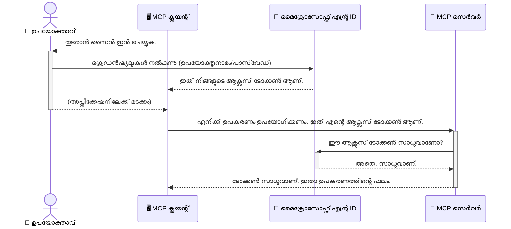

# AI വർക്‌ഫ്ലോകൾ സുരക്ഷിതമാക്കൽ: മോഡൽ കോൺ ടെക്സ്റ്റ് പ്രോട്ടോക്കോൾ സർവറുകൾക്ക് Entra ID അംഗീകാരം

## പരിചയം
നിങ്ങളുടെ മോഡൽ കോൺ ടെക്സ്റ്റ് പ്രോട്ടോക്കോൾ (MCP) സർവർ സുരക്ഷിതമാക്കുന്നത് നിങ്ങളുടെ വീട് മുന്നറിയിപ്പു് ആദ്യം താത്പര്യമുള്ളതുപോലെ ആണു്. MCP സർവർ തുറന്നിരിക്കുകയാണെങ്കിൽ, നിങ്ങളുടെ ഉപകരണങ്ങളുമായി കൂടിയുള്ള നിങ്ങളുടെ ഡാറ്റ അനധികൃത ആക്‌സസിനുശേഷം തുറക്കപ്പെടും, ഇത് സുരക്ഷാ ലംഘനങ്ങൾക്ക് കാരണമാകാം. Microsoft Entra ID ശക്തമായ ഒരു ക്ലൗഡ് അധിഷ്ഠിത തിരിച്ചറിയൽ ആക്‌സസ് മാനേജ്മെന്റ് പരിഹാരമാണ്, ഇത് അനുവദനീയമായ ഉപയോക്താക്കളും ആപ്ലിക്കേഷനുകളും മാത്രമേ നിങ്ങളുടെ MCP സർവറുമായി ഇടപഴകാൻ കഴിയൂ എന്നുറപ്പാക്കുന്നു. ഈ വിഭാഗത്തിൽ, Entra ID അംഗീകാരത്തിന്റെ സഹായത്തോടെ നിങ്ങളുടെ AI വർക്‌ഫ്ലോകൾ എങ്ങനെ സംരക്ഷിക്കാമെന്ന് നിങ്ങൾക്കു് പഠിപ്പിക്കും.

## പഠന ലക്ഷ്യങ്ങൾ
ഈ ഭാഗം കഴിഞ്ഞ ശേഷം, നിങ്ങൾക്ക് സാധിക്കുമെന്നും:

- MCP സർവർസിന്റെ സുരക്ഷിതത്വത്തിന്റെ പ്രാധാന്യം മനസ്സിലാക്കുക.
- Microsoft Entra ID ഉം OAuth 2.0 അംഗീകാരണത്തിന്റെ അടിസ്ഥാനങ്ങൾ വിശദീകരിക്കുക.
- പബ്ലിക് ക്ലയന്റ്‌മാരും കോൺഫിഡൻഷ്യൽ ക്ലയന്റ്‌മാരുമിടയിലെ വ്യത്യാസം തിരിച്ചറിയുക.
- ലൊക്കൽ (പബ്ലിക് ക്ലയന്റ്) සහ റിമോട്ട് (കോൺഫിഡൻഷ്യൽ ക്ലയന്റ്) MCP സർവർ അനുഭവങ്ങളിലും Entra ID അംഗീകാരം നടപ്പിലാക്കുക.
- AI വർക്‌ഫ്ലോകൾ വികസിപ്പിക്കുമ്പോൾ മികച്ച സുരക്ഷാ രീതികൾ പ്രയോഗിക്കുക.

## സുരക്ഷയും MCPയും

നിങ്ങളുടെ വീട്ടിലെ മുന്നോട്ടൂരു തുറന്നിരിക്കണോ എന്ന് നിങ്ങൾ വേണ്ടെന്ന് കരുതാത്തപ്പോഴേക്കും, MCP സർവർ എല്ലാവർക്കും തുറന്നിരിക്കുമ്പോൾ നിങ്ങൾക്കും അതുപോലെ തന്നെ ആയിരിക്കും. നിങ്ങളുടെ AI വർക്‌ഫ്ലോകൾ സുരക്ഷിതമാക്കുന്നത് ശക്തമായ, വിശ്വസനീയമായ, സുരക്ഷിതമായ ആപ്ലിക്കേഷനുകൾ നിർമിക്കാൻ വളരെ ആവശ്യമാണ്. ഈ അധ്യായം Microsoft Entra ID ഉപയോഗിച്ച് MCP സർവർ സുരക്ഷിതമാക്കുന്നത് പരിചയപ്പെടുത്തും, അതിനാൽ അനുവദിച്ചോടുള്ള ഉപയോക്താക്കളും ആപ്ലിക്കേഷനുകളും മാത്രമേ നിങ്ങളുടെ ടൂളുകളും ഡാറ്റയുമായി ഇടപഴകാൻ കഴിയൂ.

## MCP സർവറുകൾക്കായുളള സുരക്ഷയുടെ പ്രാധാന്യം

എന്തെങ്കിലും ഉപകരണം ഇമെയിൽ അയച്ചേക്കാനും ഉപഭോക്തൃ ഡാറ്റാബേസ് ആക്‌സസ് ചെയ്‌തേക്കാനുള്ള ടൂളുകൾ നിങ്ങളുടെ MCP സർവറിലുണ്ടെന്ന് തോന്നിക്കൂ. ഒരു സുരക്ഷിതമല്ലാത്ത MCP സർവർ ഉണ്ടായാൽ, ആരും ആ ഉപകരണങ്ങൾ ഉപയോഗിക്കാനാകും എന്നതും മാന്യമായ ഡാറ്റാ ആക്‌സസും സ്ഫാം, അല്ലെങ്കില് മറ്റ് ദുഷ്കൃത്യങ്ങളും ഉണ്ടാകാം.

അധികാര പരിശോധന നടപ്പിലാക്കുന്നതിലൂടെ, സെർവറിലേക്കുള്ള എല്ലാ അഭ്യർത്ഥനകളും ശരിയെന്നും അവ ഉപയോഗിക്കുന്ന ഉപയോക്താവിന്റെയും ആപ്ലിക്കേഷനുടെയും തിരിച്ചറിയൽ സ്ഥിരീകരിക്കുന്നതുമാണ്. ഇത് നിങ്ങളുടെ AI വർക്‌ഫ്ലോകൾ സുരക്ഷിതമാക്കാനുള്ള ഏറ്റവും പ്രഥമവും നിർണായകവുമായ ഘട്ടമാണ്.

## Microsoft Entra ID പരിചയം

[**Microsoft Entra ID**](https://adoption.microsoft.com/microsoft-security/entra/) ഒരു ക്ലൗഡ് അധിഷ്ഠിത തിരിച്ചറിയൽ ആക്‌സസ് മാനേജ്മെന്റ് സേവനമാണ്. ഇത് നിങ്ങളുടെ ആപ്ലിക്കേഷനുകളുടെ സർവ‍സുകൾക്കു് സർവത്ര സുരക്ഷാ ഗാർഡെന്ന നിലയിൽ പ്രവർത്തിക്കുന്നു. ഉപയോക്തൃ തിരിച്ചറിയലുകൾ സത്യവാങ്മൂലം ചെയ്യാനും (അംഗീകാരം) അവർക്ക് ചെയ്യാൻ അനുവാദമുണ്ടോയെന്ന് നിശ്ചയിക്കാനും (അധികാരം) ഇതു് പിടിച്ചുകൊണ്ടിരിക്കുന്നു.

Entra ID ഉപയോഗിച്ച് നിങ്ങൾക്ക്:

- ഉപയോക്താക്കൾക്കായി സുരക്ഷിതമായി സൈൻ-ഇൻ പ്രദാനം ചെയ്യാൻ.
- API കളും സേവനങ്ങളും സംരക്ഷിക്കാൻ.
- ആക്‌സസ് നയങ്ങൾ കേന്ദ്രത്തിൽ നിന്നും കൈകാര്യം ചെയ്യാൻ കഴിയും.

MCP സർവറുകളുടെ കാര്യത്തിൽ, Entra ID നിങ്ങളുടെ സർവറിന്റെ ശേഷികൾക്ക് ആര്ക്കാണു് ആക്‌സസ് കൊടുക്കുക എന്ന് ഇടപാടു ചെയ്യാനുള്ള കരുത്തും വിശ്വസനീയതയും ഉള്ള പരിഹാരമാണ്.

---

## മാജിക്ക് മനസ്സിലാക്കൽ: Entra ID അംഗീകാരം എങ്ങനെ പ്രവർത്തിക്കുന്നു

Entra ID അംഗീകാരം കൈകാര്യം ചെയ്യുവാൻ **OAuth 2.0** പോലുള്ള തുറന്ന മാനദണ്ഡങ്ങൾ ഉപയോഗിക്കുന്നു. വിശദാംശങ്ങൾ നന്നാവാം സങ്കീർണമെങ്കിൽ, ഈ സംജ്ഞാനം സുഖമായി മനസ്സിലാക്കാൻ ഒരു ഉത്തമമായ ഉപമ ഉപയോഗിക്കാം.

### OAuth 2.0 ലേക്കായുള്ള സൗമ്യമായ പരിചയം: വാലറ്റ് കീ

OAuth 2.0 ന്റെ ഉപമയായി നിങ്ങളുടെ കാർക്കു വേണ്ടി വാലറ്റ് സർവീസ് ഒരു പോലെ ആണെന്ന് കരുതാം. നിങ്ങൾ റസ്റ്റോറന്റിൽ എത്തുമ്പോൾ, വാലറ്റിന് നിങ്ങളുടെ മാസ്റ്റർ കീ കൊടുക്കാറില്ല. പകരം നിങ്ങൾ ഒരു **വാലറ്റ് കീ** നൽകുന്നു, അതിനുള്ള അധികാരങ്ങൾ കുറവാണ് — കാർ തുടക്കം കൊള്ളാനും കარები തുരയ്ക്കാനും കഴിയും, പക്ഷേ ട്രങ്ക് അല്ലെങ്കിൽ കളവത്തട്ടിൽത്തോറേയ്ക്ക് പ്രവേശനം തരില്ല.

ഈ ഉപമയിൽ:

- **നിങ്ങൾ** ആണ് **ഉപയോക്താവ്**.
- **നിങ്ങളുടെ കാർ** ആണ് **MCP സർവർ** അതിന്റെ വിലപ്പെട്ട ഉപകരണങ്ങളുമായി ഡാറ്റയോടുകൂടി.
- **വാലറ്റ്** ആണ് **Microsoft Entra ID**.
- **പാർക്കിംഗ് അറ്റൻഡന്റ്** ആണ് **MCP ക്ലയന്റ്** (സർവറിൽ പ്രവേശിക്കാൻ ശ്രമിക്കുന്ന ആപ്ലിക്കേഷൻ).
- **വാലറ്റ് കീ** ആണ് **ആക്‌സസ് ടോക്കൺ**.

ആക്‌സസ് ടോക്കൺ സെക്യുർ ആണു്, ഇത് MCP ക്ലയന്റ് Entra ID യിൽ നിന്നു് സൈൻ ഇൻ ചെയ്ത ശേഷം ലഭിക്കുന്നു. ക്ലയന്റ് ഈ ടോക്കൺ MCP സർവറിനു് ഓരോ അഭ്യർത്ഥനായും നൽകിയുകൊണ്ട്, സർവർ ടോക്കൺ ശരിയാണെന്ന് പരിശോധിച്ച്, വിദഗ്ധമായ അനധികൃത അഭ്യർത്ഥനകളിൽ നിന്നും സംരക്ഷിക്കുന്നു. ഇതിലൂടെ നിങ്ങളുടെ യഥാർത്ഥ പാസ്വേഡുകൾ കൈകാര്യം ചെയ്യേണ്ടി വരാറില്ല.

### അംഗീകാരം പ്രവാഹം

പ്രവൃത്തി എങ്ങനെയാണെന്ന് കാണാം:



### Microsoft Authentication Library (MSAL) പരിചയം

കോഡ് കാണുന്നതിനു മുമ്പായി, നിങ്ങൾ ഉദാഹരണങ്ങളിൽ കാണുന്നതിൽ പ്രധാന ഘടകം ആയ **Microsoft Authentication Library (MSAL)** പരിചയപ്പെടുത്തുന്നത് പ്രധാനമാണ്.

MSAL Microsoft വികസിപ്പിച്ച ഒരു ലൈബ്രറിയാണ്, എളുപ്പത്തിൽ ഡെവലപ്പർമാർക്ക് അംഗീകാരത്തിന് വേണ്ട കോഡ് കൈകാര്യം ചെയ്യാൻ. സുരക്ഷ ടോക്കണുകൾ കൈകാര്യം ചെയ്യുകയും, സൈൻ ഇൻ പ്രക്രിയ നടത്തുകയും, സെഷൻ പുതുക്കുകയും നടത്താൻ MSAL എല്ലാം ചെയ്യുന്നുണ്ട്.

MSAL ഉപയോഗിക്കുന്നത് ശുപാർശ ചെയ്യുന്നത് കാരണം:

- **സുരക്ഷിതമാണ്**: വ്യവസായ നിലവാരത്തിലുള്ള പ്രോട്ടോക്കോളുകളും മികച്ച സുരക്ഷാ രീതികൾ അടക്കം കൊണ്ടുവരുന്നു, നിങ്ങളുടെ കോഡിലെ സുരക്ഷാപ്രശ്നങ്ങൾ കുറച്ച്.
- **വികസനം ലളിതമാക്കുന്നു**: OAuth 2.0, OpenID Connect പോലുള്ള പ്രോട്ടോക്കോളുകൾ എളുപ്പത്തിൽ ആപ്ലിക്കേഷനിൽ ചേർക്കാൻ സഹായിക്കുന്നു, വളരെ കുറച്ച് കോഡിലൂടെ.
- **നിർമ്മിച്ചുപ്രവർത്തനുമാണ്**: Microsoft MSAL എപ്പോഴും പുതുക്കി വികസിപ്പിച്ച് പുതിയ സുരക്ഷാ അപകടങ്ങളിൽ നിന്നും സംരക്ഷിക്കുന്നു.

MSAL .NET, JavaScript/TypeScript, Python, Java, Go, iOS, Android പോലുള്ള വിവിധ ഭാഷകളും ഫ്രെയിംവർകുകളും പിന്തുണയ്ക്കുന്നു. അതുവഴി നിങ്ങൾക്ക് സമം സുതാര്യമായ അംഗീകാരം എല്ലാ സാങ്കേതിക ചട്ടങ്ങളിലും കൊണ്ടുപോകാനാകും.

MSAL കുറിച്ച് കൂടുതൽ അറിയാൻ, ഔദ്യോഗിക [MSAL അവലോകന ഡോക്യുമെന്റേഷൻ](https://learn.microsoft.com/entra/identity-platform/msal-overview) കാണുക.

---

## Entra ID ഉപയോഗിച്ച് MCP സർവർ സുരക്ഷിതമാക്കൽ: ഒരു ഘട്ടം-ഘട്ടം മാർഗ്ഗനിർദേശം

ഇപ്പോൾ, Entra ID ഉപയോഗിച്ച് ഒരു ലൊക്കൽ MCP സർവർ (`stdio` വഴി ആശയവിനിമയമാക്കുന്ന) എങ്ങനെ സുരക്ഷിതമാക്കാമെന്ന് നോക്കാം. ഈ ഉദാഹരണത്തിൽ **പബ്ലിക് ക്ലയന്റ്** ഉപയോഗിക്കുന്നു, ഇത് ഉപയോക്താക്കളുടെ ഉപകരണങ്ങളിൽ പ്രവർത്തിക്കുന്ന ആപ്ലിക്കേഷനുകൾക്ക് അനുയോജ്യമാണ്, ഉദാഹരണത്തിന് ഡെസ്ക്ടോപ്പ് ആപ്പ് അല്ലെങ്കിൽ ലൊക്കൽ വികസന സർവർ.

### ഘട്ടം 1: ഒരു ലൊക്കൽ MCP സർവർ സുരക്ഷിതമാക്കൽ (പബ്ലിക് ക്ലയന്റ് ഉപയോഗിച്ച്)

ഈ ഘട്ടത്തിൽ, MCP സർവർ ലോക്കലായി പ്രവർത്തിക്കുന്നു, `stdio` വഴിയfrastruktur קשרം പുലർത്തുന്നു, ഉപയോക്താവിന്റെ അംഗീകാരം Entra ID വഴി ഉറപ്പാക്കുന്നു, പിന്നീട് ഉപകരണങ്ങളിൽ പ്രവേശനം അനുവദിക്കുന്നു. സർവറിന് വകവരുന്ന ഉപകരണം Microsoft Graph API യിൽ നിന്നും ഉപയോക്തൃ പ്രൊഫൈൽ വിവരങ്ങൾ ഉറവിടം ചെയ്യുകയാണ്.

#### 1. Entra ID ൽ ആപ്ലിക്കേഷൻ രജിസ്റ്റർ ചെയ്യുക

എന്തെങ്കിലും കോഡ് എഴുതുന്നത് മുമ്പ്, നിങ്ങളുടെ ആപ്ലിക്കേഷൻ Microsoft Entra ID യിൽ രജിസ്റ്റർ ചെയ്യണം. ഇതു് Entra ID യെ നിങ്ങളുടെ ആപ്ലിക്കേഷൻ അറിയിക്കുകയും അംഗീകാര സേവനം ഉപയോഗിക്കാൻ അവകാശം നൽകുകയും ചെയ്യുന്നു.

1. **[Microsoft Entra പോർട്ടൽ](https://entra.microsoft.com/)** തുറക്കൂ.
2. **App registrations** ലേക്ക് പോയി **New registration** ക്ലിക്ക് ചെയ്യുക.
3. ആപ്ലിക്കേഷന്റെ പേര് കൊടുക്കുക (ഉദാ: "My Local MCP Server").
4. **Supported account types** ൽ **Accounts in this organizational directory only** തിരഞ്ഞെടുക്കുക.
5. ഈ ഉദാഹരണത്തിനായി **Redirect URI** രാജിവെക്കാം.
6. **Register** ക്ലിക്ക് ചെയ്യുക.

രജിസ്റ്റർ ചെയ്ത ശേഷം, **Application (client) ID** ഉം **Directory (tenant) ID** ഉം ശ്രദ്ധിക്കുക. കോഡിൽ ഇവ ഉപയോഗിക്കും.

#### 2. കോഡ്: ഒരു വിശദീകരണം

അംഗീകാരതൊഴിൽ കൈകാര്യം ചെയ്യുന്ന കോഡിന്റെ പ്രധാന ഭാഗങ്ങൾ കാണാം. ഈ ഉദാഹരണത്തിന് പൂർണ്ണ കോഡ് [Entra ID - Local - WAM](https://github.com/Azure-Samples/mcp-auth-servers/tree/main/src/entra-id-local-wam) ലൈബ്രറിയിലുള്ള [mcp-auth-servers GitHub റീപോസിറ്ററിയിൽ](https://github.com/Azure-Samples/mcp-auth-servers) ലഭ്യമാണ്.

**`AuthenticationService.cs`**

ഈ ക്ലാസ് Entra ID യുമായുള്ള ഇടപെടലുകൾ നിയന്ത്രിക്കുന്നു.

- **`CreateAsync`**: MSAL (Microsoft Authentication Library) ൽ നിന്നുള്ള `PublicClientApplication` ആരംഭിക്കുന്നു. നിങ്ങളുടെ ആപ്ലിക്കേഷൻ `clientId` ഉം `tenantId` ഉം ഉപയോഗി ക്രമീകരിക്കുന്നു.
- **`WithBroker`**: Windows Web Account Manager പോലുള്ള ബ്രോക്കർ ഉപയോഗത്തെ സജീവമാക്കുന്നു, സുരക്ഷയും ഏകദേശം സൈൻ-ഓൺ അനുഭവവും മെച്ചപ്പെടുത്തുന്നു.
- **`AcquireTokenAsync`**: പ്രധാന മെത്തഡ്. ആദ്യം ഉപയോക്താവിന് മുൻപുള്ള ടോക്കൺ ദേശീയമായി ലഭ്യമാണോ എന്ന് പരിശോധിക്കുന്നു, ഇല്ലെങ്കിൽ ഉപയോക്താവിനെ പുതിയതായി സൈൻ ഇൻ ചെയ്യാൻ പ്രേരിപ്പിക്കുന്നു.

```csharp
// Simplified for clarity
public static async Task<AuthenticationService> CreateAsync(ILogger<AuthenticationService> logger)
{
    var msalClient = PublicClientApplicationBuilder
        .Create(_clientId) // Your Application (client) ID
        .WithAuthority(AadAuthorityAudience.AzureAdMyOrg)
        .WithTenantId(_tenantId) // Your Directory (tenant) ID
        .WithBroker(new BrokerOptions(BrokerOptions.OperatingSystems.Windows))
        .Build();

    // ... cache registration ...

    return new AuthenticationService(logger, msalClient);
}

public async Task<string> AcquireTokenAsync()
{
    try
    {
        // Try silent authentication first
        var accounts = await _msalClient.GetAccountsAsync();
        var account = accounts.FirstOrDefault();

        AuthenticationResult? result = null;

        if (account != null)
        {
            result = await _msalClient.AcquireTokenSilent(_scopes, account).ExecuteAsync();
        }
        else
        {
            // If no account, or silent fails, go interactive
            result = await _msalClient.AcquireTokenInteractive(_scopes).ExecuteAsync();
        }

        return result.AccessToken;
    }
    catch (Exception ex)
    {
        _logger.LogError(ex, "An error occurred while acquiring the token.");
        throw; // Optionally rethrow the exception for higher-level handling
    }
}
```

**`Program.cs`**

MCP സർവർ ക്രമീകരിക്കുകയും അംഗീകാര സേവനം ഇതിനൊപ്പം ചേർക്കുകയും ചെയ്യുന്ന കോർഡ്.

- **`AddSingleton<AuthenticationService>`**: `AuthenticationService` നെ ഡിപ്പൻഡൻസി ഇൻജക്ഷൻ കോൺറ്റെയിനറിൽ രജിസ്റ്റർ ചെയ്യുന്നു, ആപ്ലിക്കേഷന്റെ മറ്റ് ഭാഗങ്ങളിലും ഉപയോഗിക്കാം.
- **`GetUserDetailsFromGraph` ടൂൾ**: ഈ ടൂൾ `AuthenticationService` ന്റെ ഇൻസ്റ്റൻസ് ആവശ്യമാണ്. ആദ്യമേ `authService.AcquireTokenAsync()` വിളിച്ചു ടോക്കൺ നേടുന്നു. അംഗീകാരം വിജയിച്ചാൽ, Microsoft Graph API കാൾ ചെയ്ത് ഉപയോക്തൃ വിവരങ്ങൾ വരെക്കുന്നു.

```csharp
// Simplified for clarity
[McpServerTool(Name = "GetUserDetailsFromGraph")]
public static async Task<string> GetUserDetailsFromGraph(
    AuthenticationService authService)
{
    try
    {
        // This will trigger the authentication flow
        var accessToken = await authService.AcquireTokenAsync();

        // Use the token to create a GraphServiceClient
        var graphClient = new GraphServiceClient(
            new BaseBearerTokenAuthenticationProvider(new TokenProvider(authService)));

        var user = await graphClient.Me.GetAsync();

        return System.Text.Json.JsonSerializer.Serialize(user);
    }
    catch (Exception ex)
    {
        return $"Error: {ex.Message}";
    }
}
```

#### 3. എല്ലാം എങ്ങനെ ചേർന്ന് പ്രവർത്തിക്കുന്നു

1. MCP ക്ലയന്റ് `GetUserDetailsFromGraph` ടൂൾ ഉപയോഗിക്കാൻ ശ്രമിക്കുമ്പോൾ, ടൂൾ ആദ്യം `AcquireTokenAsync` വിളിക്കുന്നു.
2. `AcquireTokenAsync` MSAL ലൈബ്രറിയെ ടോക്കൺ പരിശോധിക്കാൻ പ്രേരിപ്പിക്കുന്നു.
3. ടോക്കൺ ഇല്ലെങ്കിൽ MSAL ബ്രോക്കർ വഴി ഉപയോക്താവിനെ Entra ID അക്കൗണ്ട് ഉപയോഗിച്ച് സൈൻ ഇൻ സഹായിക്കുന്നു.
4. ഉപയോക്താവ് സൈൻ ഇൻ ചെയ്തപ്പോൾ, Entra ID ആക്‌സസ് ടോക്കൺ നൽകുന്നു.
5. ടൂൾ ടോക്കൺ ഉപയോഗിച്ച് Microsoft Graph API കാൾ ചെയ്ത് വിവരങ്ങൾക്കു അഭിമുഖീകരിക്കുന്നു.
6. ഉപയോക്തൃ വിവരങ്ങൾ MCP ക്ലയന്റിന് തിരികെ നൽകുന്നു.

ഈ പ്രക്രിയ ഉറപ്പു നൽകുന്നു, അംഗീകൃത ഉപയോക്താക്കളേ മാത്രം ടൂൾ ഉപയോഗിക്കാനും ലൊക്കൽ MCP സർവർ സുരക്ഷിതമാക്കാനും സാധിക്കുന്നതായി.

### ഘട്ടം 2: റിമോട്ട് MCP സർവർ സുരക്ഷിതമാക്കൽ (കോൺഫിഡൻഷ്യൽ ക്ലയന്റ് ഉപയോഗിച്ച്)

നിങ്ങളുടെ MCP സർവർ റിമോട്ട് മെഷീനിൽ പ്രവർത്തിച്ചുകൊണ്ടിരിക്കുമ്പോൾ (ഉദാ: ക്ലൗഡ് സർവർ), HTTP Streaming പോലുള്ള പ്രോട്ടോക്കോൾ വഴി ആശയവിനിമയം നടക്കുമ്പോൾ സുരക്ഷാ ആവശ്യകതകൾ വ്യത്യസ്തമാണ്. ഈ സാഹചര്യത്തിൽ, **കോൺഫിഡൻഷ്യൽ ക്ലയന്റ്** ഉപയോഗിച്ച് **അധികാരം കോഡ് ഫ്ലോ** പ്രയോഗിക്കണം. ഉപയോഗത്തിലെ രഹസ്യങ്ങളോൾ ബ്രൗസറിൽ വെളിച്ചം കാണാതെ സൂക്ഷിക്കുന്നത് ഈ രീതി കൂടുതൽ സുരക്ഷിതമാണ്.

ഈ ഉദാഹരണം TypeScript-ആധാരിത MCP സർവർ ആയി Express.js ഉപയോഗിച്ച് HTTP അഭ്യർത്ഥനകൾ കൈകാര്യം ചെയ്യും.

#### 1. Entra ID യിൽ ആപ്ലിക്കേഷൻ ക്രമീകരിക്കുക

Entra ID നൊപ്പം ക്രമീകരണം പബ്ലിക് ക്ലയന്റിനോട് സമാനമാണ്, പക്ഷേ ഇവിടെ **ക്ലയന്റ് രഹസ്യം** സൃഷ്ടிக்கണം.

1. **[Microsoft Entra പോർട്ടൽ](https://entra.microsoft.com/)** തൊട്ട്.
2. നിങ്ങളുടെ ആപ്പിന്റെ രജിസ്ട്രേഷനിൽ **Certificates & secrets** ടാബിൽ പോകുക.
3. **New client secret** അമർത്തി, ഒരു വിവരണം കൊടുത്ത് **Add** ക്ലിക്ക് ചെയ്യുക.
4. **മുൻകൂർ ശ്രദ്ധിക്കുക:** രഹസ്യ മൂല്യം ഉടനെ പകർത്തിക്കോണ്ട് വെക്കൂ. ഇത് പിന്നീട് കാണാനില്ല.
5. **Redirect URI** ക്രമീകരണം വേണം. **Authentication** ടാബിൽ **Add a platform** തിരഞ്ഞെടുക്കുക, **Web** തിരഞ്ഞെടുക്കി നിങ്ങളുടെ ആപ്ലിക്കേഷന്റെ Redirect URI നൽകുക (ഉദാ. `http://localhost:3001/auth/callback`).

> **⚠️ പ്രധാന സുരക്ഷാ കുറിപ്പ്:** പ്രൊഡക്ഷൻ ആപ്ലിക്കേഷനുകൾക്ക് Microsoft ശക്തമായി **സീക്രറ്റ് രഹിത അംഗീകാരം** മാർഗ്ഗങ്ങൾ ഉപദേശിക്കുന്നു, ജത: **Managed Identity** അല്ലെങ്കിൽ **Workload Identity Federation** പോലുള്ളവ. ക്ലയന്റ് രഹസ്യങ്ങൾ സുരക്ഷാ അപകടത്തിന് വിധേയമാണ്, വെളിച്ചം കാണാനോ നഷ്ടപ്പെടാനോ കഴിയും. മാനേജ്ഡ് ഐഡൻറിറ്റികൾ കോഡിലും കോൺഫിഗറേഷനിലുമുള്ള ക്രെഡൻഷ്യലുകൾ സൂക്ഷിക്കാത്തതിനാൽ കൂടുതൽ സുരക്ഷിതമാണ്.
>
> മാനേജ്ഡ് ഐഡൻറിറ്റികളുടെ വിശദാംശങ്ങൾക്കും പ്രയോഗത്തിനും [Managed identities for Azure resources overview](https://learn.microsoft.com/entra/identity/managed-identities-azure-resources/overview) കാണുക.

#### 2. കോഡ്: വിശദീകരണം

ഈ ഉദാഹരണത്തിൽ സെഷൻ അടിസ്ഥാനമുള്ള സമീപനം ഉപയോഗിക്കുന്നു. ഉപയോക്താവ് അംഗീകൃതമാകുമ്പോൾ, സർവർ ആക്‌സസ് ടോക്കണും റിഫ്രെഷ് ടോക്കണും സെഷനിൽ സൂക്ഷിക്കുന്നു, പിന്നെ ഉപയോക്താവിന് സെഷൻ ടോക്കൺ നൽകുന്നു. ഈ സെഷൻ ടോക്കൺ പിന്നീട് അഭ്യർത്ഥനകളിൽ ഉപയോഗിക്കുന്നു. പൂർണ്ണ കോഡ് [Entra ID - Confidential client](https://github.com/Azure-Samples/mcp-auth-servers/tree/main/src/entra-id-cca-session) ഫോൾഡറിൽ [mcp-auth-servers GitHub റീപോസിറ്ററിയിൽ](https://github.com/Azure-Samples/mcp-auth-servers) കാണാം.

**`Server.ts`**

Express സർവർയും MCP ട്രാൻസ്‌പോർട്ട് ലെയറും ക്രമീകരിക്കുന്നു.

- **`requireBearerAuth`**: ഈ മിഡിൽവേർ `/sse` ഉം `/message` റൂട്ടുകളെയും സംരക്ഷിക്കുന്നു. അഭ്യർത്ഥനയുടെ `Authorization` ഹെഡറിൽ സാധുവായ ബിയറർ ടോക്കൺ ഉണ്ടെന്ന് പരിശോധിക്കുന്നു.
- **`EntraIdServerAuthProvider`**: `McpServerAuthorizationProvider` ഇൻറർഫെയ്‌സ് നടപ്പിലാക്കുന്ന കസ്റ്റം ക്ലാസ് ആണ്. OAuth 2.0 ഫ്ലോ കൈകാര്യം ചെയ്യുന്നു.
- **`/auth/callback`**: ഉപയോക്താവ് അംഗീകൃതമാകുമ്പോൾ Entra ID നിന്നുള്ള റീഡ്രൈറെ കാണുന്ന എൻഡ്‌പോയിന്റ്, അധികാരം കോഡ് ആക്‌സസ് ടോക്കണും റിഫ്രെഷ് ടോക്കണുമായി പരിഹരിക്കുന്നു.

```typescript
// വ്യക്തതയ്ക്കായി ലളിതമാക്കി
const app = express();
const { server } = createServer();
const provider = new EntraIdServerAuthProvider();

// SSE എൻഡ്‌പോയിന്റ് സംരക്ഷിക്കുക
app.get("/sse", requireBearerAuth({
  provider,
  requiredScopes: ["User.Read"]
}), async (req, res) => {
  // ... ട്രാൻസ്പോർട്ടുമായി ബന്ധിപ്പിക്കുക ...
});

// സന്ദേശ എൻഡ്‌പോയിന്റ് സംരക്ഷിക്കുക
app.post("/message", requireBearerAuth({
  provider,
  requiredScopes: ["User.Read"]
}), async (req, res) => {
  // ... സന്ദേശം കൈകാര്യം ചെയ്യുക ...
});

// OAuth 2.0 കോൾബാക്ക് കൈകാര്യം ചെയ്യുക
app.get("/auth/callback", (req, res) => {
  provider.handleCallback(req.query.code, req.query.state)
    .then(result => {
      // ... വിജയമോ പരാജയമോ കൈകാര്യം ചെയ്യുക ...
    });
});
```

**`Tools.ts`**

MCP സർവർ നൽകുന്ന ഉപകരണങ്ങൾ നിർവ്വചിക്കുന്നു. `getUserDetails` ഉപകരണം മുമ്പത്തെ ഉദാഹരണത്തോട് സമാനമാണ്, എന്നാൽ സെഷനിൽ നിന്നും ആക്‌സസ് ടോക്കൺ ശേഖരിക്കുന്നു.

```typescript
// വ്യക്തതയ്ക്കായി ലളിതമാക്കിയിരിക്കുന്നു
server.setRequestHandler(CallToolRequestSchema, async (request) => {
  const { name } = request.params;
  const context = request.params?.context as { token?: string } | undefined;
  const sessionToken = context?.token;

  if (name === ToolName.GET_USER_DETAILS) {
    if (!sessionToken) {
      throw new AuthenticationError("Authentication token is missing or invalid. Ensure the token is provided in the request context.");
    }

    // സെഷൻ സ്റ്റോറിൽ നിന്ന് Entra ID ടോക്കൺ ലഭിക്കുക
    const tokenData = tokenStore.getToken(sessionToken);
    const entraIdToken = tokenData.accessToken;

    const graphClient = Client.init({
      authProvider: (done) => {
        done(null, entraIdToken);
      }
    });

    const user = await graphClient.api('/me').get();

    // ... ഉപയോക്തൃ വിശദാംശങ്ങൾ മടക്കുക ...
  }
});
```

**`auth/EntraIdServerAuthProvider.ts`**

ഈ ക്ലാസ് രജിസ്ട്രി ചെയ്യും:

- ഉപയോക്താവിനെ Entra ID സൈൻ-ഇൻ പേജിലേക്ക് റീഡയരക്ട് ചെയ്യുക.
- അധികാരം കോഡ് ആക്‌സസ് ടോക്കണായി മാറ്റുക.
- ടോക്കണുകൾ `tokenStore` ൽ സൂക്ഷിക്കുക.
- ആക്‌സസ് ടോക്കൺ കാലഹരണപ്പെട്ടാൽ പുതുക്കുക.

#### 3. എല്ലാം എങ്ങനെ ചേർന്ന് പ്രവർത്തിക്കുന്നു

1. ഉപയോക്താവ് ആദ്യമായി MCP സർവറുമായി ബന്ധപ്പെടാൻ ശ്രമിക്കുമ്പോൾ, `requireBearerAuth` മിഡിൽവേർ അവശേഷിക്കുന്ന സെഷൻ ഇല്ലെന്ന് കണ്ടെത്തി അവരെ Entra ID സൈൻ-ഇൻ പേജിലേക്ക് റീഡയറക്ട് ചെയ്യും.
2. ഉപയോക്താവ് അവരുടെ Entra ID അക്കൗണ്ടിലൂടെ സൈൻ-ഇൻ ചെയ്യുന്നു.
3. Entra ID ഉപയോക്താവിനെ `/auth/callback` എൻഡ്‌പോയിന്റിലേക്കുള്ള ഓത്തറൈസേഷൻ കോഡോടുകൂടി തിരികെ നയിക്കുന്നു.  
4. സെർവർ കോഡ് ഒരു ആക്‌സസ് ടോക്കനും ഒരു റിഫ്രെഷ് ടോക്കനും കൈമാറി, അവ സൂക്ഷിച്ച് ഒരു സെഷൻ ടോക്കൺ സൃഷ്ടിക്കുന്നു, അത് ക്ലയന്റിന് അയയ്ക്കുന്നു.  
5. ഈ സെഷൻ ടോക്കൺ ഇനി ക്ലയന്റ് MCP സെർവറിലേക്ക് എല്ലാ ഭാവി അഭ്യർത്ഥനകൾക്കും `Authorization` ഹെഡറിൽ ഉപയോഗിക്കാം.  
6. `getUserDetails` ടൂൾ വിളിക്കുമ്പോൾ, സെഷൻ ടോക്കൺ ഉപയോഗിച്ച് Entra ID ആക്‌സസ് ടോക്കൺ കണ്ടെത്തി അതിലൂടെ Microsoft Graph API കാൾ ചെയ്യുന്നു.  

ഈ ഫ്ലോ പബ്ലിക് ക്ലയന്റ് ഫ്ലോളേക്കാൾ സങ്കീർണ്ണമാണ്, എന്നാൽ ഇന്റർനെറ്റ്-ഫേസിംഗ് എൻഡ്‌പോയിന്റുകൾക്കായി ഇത് ആവശ്യമാണ്. റിമോട്ട് MCP സെർവ്വറുകൾ പൊതു ഇന്റർനെറ്റിലൂടെ ആക്സസിബിൾ ആയതിനാൽ, അനധികൃത ആക്സസിനും സാധ്യതയുള്ള ആക്രമണങ്ങൾക്കുമെതിരെ ശക്തമായ സുരക്ഷാ നടപടികൾ ആവശ്യമാണ്.  


## Security Best Practices

- **എപ്പോഴും HTTPS ഉപയോഗിക്കുക**: ടോക്കണുകൾ ഇടപെടുന്നതിൽ നിന്നും സംരക്ഷിക്കാൻ ക്ലയന്റിനും സെർവറിനും ഇടയിലെ-komംക്ഷണമുൾപ്പെടെ എൻക്രീപ്‌ട് ചെയ്യുക.  
- **Role-Based Access Control (RBAC) നടപ്പിലാക്കുക**: ഉപയോക്താവ് Authenticate ചെയ്തിട്ടുള്ളോ എന്നത് മാത്രം പരിശോധിക്കാതെ, അവർ എന്ത് അനുമതികളുള്ളവരാണ് എന്നതും പരിശോധിക്കുക. Entra ID-യിൽ റോളുകൾ നിർവചിച്ച് നിങ്ങളുടെ MCP സെർവറിൽ അവർ പരിശോധിക്കാം.  
- **മോണിറ്റർ ചെയ്യുകയും ഓഡിറ്റ് ചെയ്യുകയും ചെയ്യുക**: എല്ലാ ഓത്തന്റിക്കേഷൻ ഇവന്റുകളും ലോഗ് ചെയ്ത് സംശയാസ്പദ പ്രവർത്തനങ്ങൾ കണ്ടെത്താനും പ്രതികരിക്കാനും സാധിക്കും.  
- **റേറ്റ് ലിമിറ്റിങ് ആൻഡ് ത്രോട്ട്ലിംഗ് കൈകാര്യം ചെയ്യുക**: Microsoft Graph लगायत മറ്റു APIs റേറ്റ് ലിമിറ്റിങ് നടപ്പിലാക്കി ദുരുപയോഗം തടയുന്നു. HTTP 429 (Too Many Requests) പ്രതികരണങ്ങൾ Gracefully കൈകാര്യം ചെയ്യാൻ MCP സെർവറിൽ എക്സ്പോണൻഷ്യൽ ബാക്ക് ɔഫും റിട്രൈ ലാജിക്കും നടപ്പിലാക്കുക. API കാൾز കുറയ്ക്കാൻ തവണ തവണ അഭ്യർത്ഥിക്കുന്ന ഡാറ്റ കാഷെ ചെയ്‌തുക.  
- **സുരക്ഷിതമായ ടോക്കൺ സംഭരണം**: ആക്‌സസ് ടോക്കണുകളും റിഫ്രെഷ് ടോക്കണുകളും സുരക്ഷിതമായി സൂക്ഷിക്കുക. ലോക്കൽ അപ്ലിക്കേഷനുകളിൽ സിസ്റ്റത്തിന്റെ സുരക്ഷിത സ്റ്റോറേജ് മെക്കാനിസങ്ങൾ ഉപയോഗിക്കുക. സെർവർ അപ്ലിക്കേഷനുകളിലായി, എൻക്രിപ്റ്റഡ് സ്റ്റോറേജ് അല്ലെങ്കിൽ Azure Key Vault പോലുള്ള സുരക്ഷിത കീ മാനേജ്‌മെന്റ് സർവീസുകൾ പരിഗണിക്കുക.  
- **ടോക്കൺ കാലാവധി കൈകാര്യംചെയ്യൽ**: ആക്‌സസ് ടോക്കണുകൾക്ക് പരിധിയുള്ള ജീവിതകാലമുണ്ട്. റിഫ്രെഷ് ടോക്കണുകൾ ഉപയോഗിച്ച് ഓട്ടോമാറ്റിക് ടോക്കൺ റിഫ്രഷ് നടപ്പിലാക്കി ഉപയോക്താവിനായി റീ-ഓത്തന്റിക്കേഷൻ ആവശ്യമില്ലാതെ സുസ്ഥിര അനുഭവം ഉറപ്പാക്കുക.  
- **Azure API Management ഉപയോഗിക്കുക പരിഗണിക്കുക**: MCP സെർവറിൽ നേരിട്ട് സുരക്ഷ നടപ്പിലാക്കുന്നത് സുതാര്യ നിയന്ത്രണം നൽകുന്നുവെങ്കിലും, Azure API Management പോലുള്ള API ഗേറ്റ്വേസ് ഓത്തന്റിക്കേഷൻ, ഓത്തറൈസേഷൻ, റേറ്റ് ലിമിറ്റിങ്, മോണിറ്ററിംഗ് തുടങ്ങിയവ സ്വയം കൈകാര്യം ചെയ്ത് സെൻട്രലൈസ്ഡ് ഒരു സുരക്ഷാ ലെയർ നൽകുന്നു. MCP-സെർവറുകളുമായി API ഗേറ്റ്വേസ് ഉപയോഗിക്കുന്നതിന്റെ വിശദാംശങ്ങൾക്ക് ഞങ്ങളുടെ [Azure API Management Your Auth Gateway For MCP Servers](https://techcommunity.microsoft.com/blog/integrationsonazureblog/azure-api-management-your-auth-gateway-for-mcp-servers/4402690) കാണുക.  


## Key Takeaways

- നിങ്ങളുടെ MCP സെർവർ സുരക്ഷിതമാക്കുക എന്നത് നിങ്ങളുടെ ഡാറ്റയും ടൂളുകളും സംരക്ഷിക്കുന്നതിന് അത്യന്താപേക്ഷിതമാണ്.  
- Microsoft Entra ID ഓത്തന്റിക്കേഷനും ഓത്തറൈസേഷനും വേണ്ടി ശക്തവും സ്കെയിലായേക്കാവുന്നതുമായ പരിഹാരം നൽകുന്നു.  
- ലൊക്കൽ അപ്ലിക്കേഷനുകൾക്കായി **പബ്ലിക് ക്ലയന്റും** റിമോട്ട് സെർവറുകൾക്കായി **കോൺഫിഡൻഷ്യൽ ക്ലയന്റും** ഉപയോഗിക്കുക.  
- വെബ് അപ്ലിക്കേഷനുകൾക്കായുള്ള ഏറ്റവും സുരക്ഷിത ഓപ്ഷൻ **Authorization Code Flow** ആണ്.  


## Exercise

1. നിങ്ങൾ പണിയാനാഗ്രഹിക്കുന്ന ഒരു MCP സെർവർ ലൊക്കലായിരിക്കും അതേയും റിമോട്ടായിരിക്കും?  
2. നിങ്ങളുടെ ഉത്തരത്തിന് അനുസരിച്ച് നിങ്ങള് വേണ്ടത് പബ്ലിക് ക്ലയന്റോ കോൺഫിഡൻഷ്യൽ ക്ലയന്റോ?  
3. Microsoft Graph-നു എതിരെ പ്രവർത്തനങ്ങൾ നടത്താൻ നിങ്ങളുടെ MCP സെർവർ ലഭിക്കേണ്ട അനുമതി എന്ത്?  


## Hands-on Exercises

### Exercise 1: Entra ID-യിൽ ഒരു അപ്ലിക്കേഷൻ രജിസ്റ്റർ ചെയ്യുക  
Microsoft Entra പോർട്ടലിൽ പോവുക.  
നിങ്ങളുടെ MCP സെർവറിന് പുതിയ ഒരു അപ്ലിക്കേഷൻ രജിസ്റ്റർ ചെയ്യുക.  
അപ്പ്ലിക്കേഷൻ (ക്ലയന്റ്) IDയും ഡയറക്ടറി (ടെനന്റ്) IDയും രേഖപ്പെടുത്തുക.  

### Exercise 2: ലോക്കൽ MCP സെർവർ സുരക്ഷിതമാക്കുക (പബ്ലിക് ക്ലയന്റ്)  
- ഉപയോക്തൃ ഓത്തന്റിക്കേഷനായി MSAL (Microsoft Authentication Library) സംയോജിപ്പിക്കാൻ കോഡ് ഉദാഹരണം പിന്തുടരുക.  
- Microsoft Graph-നിന്ന് ഉപയോക്തൃ വിശദാംശങ്ങൾ എത്തിക്കുന്ന MCP ടൂൾ വിളിച്ച് ഓത്തന്റിക്കേഷൻ ഫ്ലോ ടെസ്റ്റ് ചെയ്യുക.  

### Exercise 3: റിമോട്ട് MCP സെർവർ സുരക്ഷിതമാക്കുക (കോൺഫിഡൻഷ്യൽ ക്ലയന്റ്)  
- Entra ID-യിൽ കോൺഫിഡൻഷ്യൽ ക്ലയന്റ് രജിസ്റ്റർ ചെയ്ത് ഒരു ക്ലയന്റ് സീക്രട്ട് ഉണ്ടാക്കുക.  
- നിങ്ങളുടെ Express.js MCP സെർവറിൽ Authorization Code Flow ക്രമീകരിക്കുക.  
- സംരക്ഷിത എൻഡ്‌പോയിന്റുകൾ പരീക്ഷിച്ച് ടോക്കൺ അടിസ്ഥാനമാക്കിയുള്ള ആക്‌സസ് സ്ഥിരീകരിക്കുക.  

### Exercise 4: Security Best Practices പ്രയോഗിക്കുക  
- നിങ്ങളുടെ ലോക്കൽ അല്ലെങ്കിൽ റിമോട്ട് സെർവറിനായി HTTPS സജ്ജമാക്കുക.  
- സെർവർ ലാജിക്കിൽ റോളുകൾ അടിസ്ഥാനമാക്കിയുള്ള ആക്‌സസ് കൺട്രോൾ (RBAC) നടപ്പിലാക്കുക.  
- ടോക്കൺ കാലാവധി കൈകാര്യംചെയ്യൽ, സുരക്ഷിത ടോക്കൺ സ്റ്റോറേജ് എന്നിവ ചേർക്കുക.  


## Resources

1. **MSAL Overview Documentation**  
   Microsoft Authentication Library (MSAL) വ്യത്യസ്ത പ്ലാറ്റ്ഫോമുകളിൽ സുരക്ഷിത ടോക്കൺ അക്വിസിഷൻ എങ്ങനെ സാധ്യമാക്കുന്നതാണ് എന്ന് അറിയുക:  
   [MSAL Overview on Microsoft Learn](https://learn.microsoft.com/en-gb/entra/msal/overview)  

2. **Azure-Samples/mcp-auth-servers GitHub Repository**  
   ഓത്തന്റിക്കേഷൻ ഫ്ലോകൾ കാണിക്കുന്ന MCP സെർവർ പ്രകടന രീതി:  
   [Azure-Samples/mcp-auth-servers on GitHub](https://github.com/Azure-Samples/mcp-auth-servers)  

3. **Managed Identities for Azure Resources Overview**  
   സിസ്റ്റം അല്ലെങ്കിൽ ഉപയോ​ഗ്തൃ-നിയോഗിത മാനേജ് ചെയ്ത ഐഡന്റിറ്റികൾ ഉപയോഗിച്ച് രഹസ്യങ്ങൾ ഒഴിവാക്കുന്ന രീതി:  
   [Managed Identities Overview on Microsoft Learn](https://learn.microsoft.com/en-us/entra/identity/managed-identities-azure-resources/)  

4. **Azure API Management: Your Auth Gateway for MCP Servers**  
   MCP സെർവറുകൾക്കായുള്ള OAuth2 സുരക്ഷിത ഗേറ്റ്വേയായി APIM ഉപയോഗിക്കുന്നതിന്റെ വിശദമായ വീക്ഷണം:  
   [Azure API Management Your Auth Gateway For MCP Servers](https://techcommunity.microsoft.com/blog/integrationsonazureblog/azure-api-management-your-auth-gateway-for-mcp-servers/4402690)  

5. **Microsoft Graph Permissions Reference**  
   Microsoft Graphയ്ക്ക് വേണ്ടി ഡെലിഗേറ്റഡ്, അപ്ലിക്കേഷൻ അനുമതികളുടെ സമഗ്ര പട്ടിക:  
   [Microsoft Graph Permissions Reference](https://learn.microsoft.com/zh-tw/graph/permissions-reference)  


## Learning Outcomes  
ഈ അദ്ധ്യായം പൂർത്തിയാക്കിയ ശേഷം, നിങ്ങൾക്ക്:

- MCP സെർവറുകൾക്കും AI വർക്ക്‌ഫ്ലോകൾക്കും ഓത്തന്റിക്കേഷൻ എന്തുകൊണ്ട് നിർണായകമാണെന്ന് വിശദീകരിക്കാൻ കഴിയുന്നതും,  
- ലൊക്കൽ, റിമോട്ട് MCP സെർവർ സാന്റ്യങ്ങൾക്കായി Entra ID ഓത്തന്റിക്കേഷൻ സജ്ജമാക്കുകയും ക്രമീകരിക്കുകയും ചെയ്യാൻ സാധിക്കുന്നതും,  
- സെർവർ ഡിപ്ലോയ്മെന്റിന്റെ അടിസ്ഥാനത്തിൽ (പബ്ലിക് അല്ലെങ്കിൽ കോൺഫിഡൻഷ്യൽ) അനുയോജ്യമായ ക്ലയന്റ് വയർ ചെയ്യാൻ കഴിയും,  
- ടോക്കൺ സംഭരണം, റോളുകൾ അടിസ്ഥാനമാക്കിയുള്ള ഓത്തറൈസേഷൻ തുടങ്ങിയ സുരക്ഷിത കോഡിംഗ് ശീലങ്ങൾ നടപ്പിലാക്കാനും,  
- അനധികൃത ആക്‌സസിൽ നിന്ന് MCP സെർവർ മുറിവില്ലാതെ സംരക്ഷിക്കാനും കഴിയും.  


## What's next  

- [5.13 Model Context Protocol (MCP) Integration with Microsoft Foundry](../mcp-foundry-agent-integration/README.md)

---

<!-- CO-OP TRANSLATOR DISCLAIMER START -->
**അറിയിപ്പ്**:
ഈ രേഖ AI പരിഭാഷാ സേവനം [Co-op Translator](https://github.com/Azure/co-op-translator) ഉപയോഗിച്ച് പരിഭാഷപ്പെടുത്തിയതാണ്. ഞങ്ങൾ കൃത്യതയ്ക്കായി ശ്രമിക്കുന്നുവെങ്കിലും, ഓട്ടോമേറ്റഡ് പരിഭാഷകളിൽ പിഴവുകൾ അല്ലെങ്കിൽ തെറ്റായ വിവരങ്ങൾ ഉണ്ടാകാൻ സാധ്യതയുണ്ട്. അതിന്റെ സ്വാഭാവിക ഭാഷയിലുള്ള അസൽ രേഖയാണ് പ്രാമാണികമായ ഉറവിടമായി പരിഗണിക്കേണ്ടത്. നിർണായകമായ വിവരങ്ങൾക്ക്, പ്രൊഫഷണൽ മനുഷ്യ പരിഭാഷ ശുപാർശ ചെയ്യുന്നു. ഈ പരിഭാഷ ഉപയോഗിച്ച് ഉണ്ടാകുന്ന തെറ്റിദ്ധാരണകൾ അല്ലെങ്കിൽ തെറ്റായ വ്യാഖ്യാനങ്ങൾക്കായി ഞങ്ങൾ ഉത്തരവാദികളല്ല.
<!-- CO-OP TRANSLATOR DISCLAIMER END -->