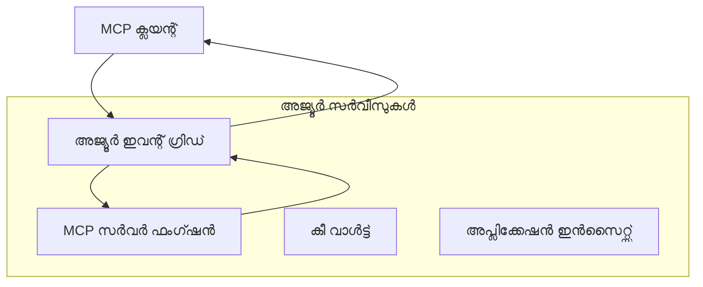
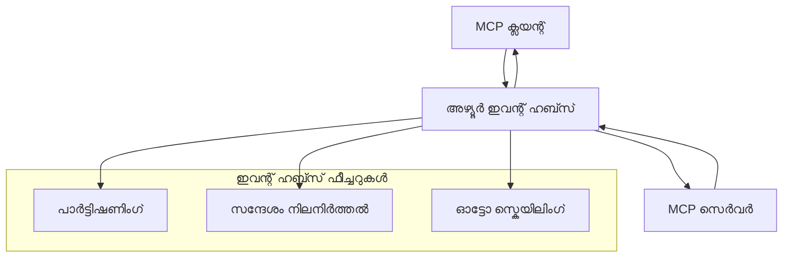

# MCP കസ്റ്റം ട്രാൻസ്പോർട്ടുകൾ - ആഡ്വാൻസ്ഡ് നിലവിലുള്ള ഗൈഡ്

Model Context Protocol (MCP) ട്രാൻസ്പോർട്ട് സംവിധാനങ്ങളിൽ ലാഘവത്വം നൽകുന്നു, പ്രത്യേക എന്റർപ്രൈസ് പരിസരങ്ങൾക്ക് വിപുലമായ കസ്റ്റം നടപ്പാക്കലുകൾ അനുവദിക്കുന്നു. ഈ ആഡ്വാൻസ്ഡ് ഗൈഡ് സ്‌കെയിലബിൾ, ക്ലൗഡ്-നെറ്റീവ് MCP പരിഹാരങ്ങൾ നിർമ്മിക്കാൻ Azure Event Grid, Azure Event Hubs എന്നിവ ഉപയോഗിക്കുന്ന കസ്റ്റം ട്രാൻസ്പോർട്ട് നടപ്പാക്കലുകൾ പ്രായോഗിക ഉദാഹരണങ്ങളായി പരിശോധിക്കുന്നു.

## പരിചയം

MCPയുടെ സാധാരണ ട്രാൻസ്പോർട്ടുകൾ (stdio, HTTP 스트്രീമിംഗ്) മിക്കവാറും ആവശ്യങ്ങൾ നിറവേറ്റുന്നുവെങ്കിലും, എന്റർപ്രൈസ് പരിസരങ്ങൾ উন্নതമായ സ്കെയിലബിലിറ്റി, വിശ്വാസ്യത, നിലവിലുള്ള ക്ലൗഡ് ഇൻഫ്‌റാസ്ട്രക്ചർ ഇന്റഗ്രേഷൻ എന്നിവയ്‌ക്ക് പ്രത്യേക ട്രാൻസ്പോർട്ട് സംവിധാനങ്ങൾ ആവശ്യപ്പെടുന്നു. കസ്റ്റം ട്രാൻസ്പോർട്ടുകൾ MCP ക്ളൗഡ്-നെറ്റീവ് മെസ്സേജിംഗ് സേവനങ്ങൾ ഉപയോഗിച്ച് അസിങ്ക്രോണസ് കമ്മ്യൂണിക്കേഷൻ, ഇവന്റ്-ഡ്രിവൻ സാങ്കേതികതകൾ, വിതരണപ്രോസസ്സ് തുടങ്ങിയവക്ക് പ്രയോജനപ്പെടുത്താൻ സഹായിക്കുന്നു.

ഈ പാഠം ഏറ്റവും പുതിയ MCP സ്പെസിഫിക്കേഷൻ (2025-11-25), Azure മെസ്സേജിംഗ് സേവനങ്ങൾ, സ്ഥിരം എന്റർപ്രൈസ് ഇന്റഗ്രേഷൻ പാറ്റേണുകൾ അടിസ്ഥാനമാക്കി ആഡ്വാൻസ്ഡ് ട്രാൻസ്പോർട്ട് നടപ്പാക്കലുകൾ പരിശോധിക്കുന്നു.

### **MCP ട്രാൻസ്പോർട്ട് ആർക്കിടെക്ചർ**

**MCP സ്പെസിഫിക്കേഷൻ (2025-11-25) മുതൽ:**

- **സ്റ്റാൻഡേർഡ് ട്രാൻസ്പോർട്ടുകൾ**: stdio (ശിഫാരসি), HTTP 스트്രീമിംഗ് (റിമോട്ട് സാഹചര്യങ്ങൾക്കു)
- **കസ്റ്റം ട്രാൻസ്പോർട്ടുകൾ**: MCP മെസ്സേജ് എക്സ്ചേഞ്ച് പ്രോട്ടോക്കോൾ നടപ്പാക്കിയ ഏത് ട്രാൻസ്പോർട്ട് കൂടിയായാലും
- **മെസ്സേജ് ഫോർമാറ്റ്**: MCP-നിർദേശിത JSON-RPC 2.0   
- **ബൈഡിരക്ഷണൽ കമ്മ്യൂണിക്കേഷൻ**: അറിയിപ്പുകൾക്കും പ്രതികരണങ്ങൾക്കും പൂർണ്ണ ഡുപ്പ്ലെക്സ് കമ്മ്യൂണിക്കേഷൻ ആവശ്യമാണ്

## പഠന ലക്ഷ്യങ്ങൾ

ഈ ആഡ്വാൻസ്ഡ് പാഠം അവസാനിക്കുന്നപ്പോൾ, നിങ്ങൾക്ക് സാധിക്കും:

- **കസ്റ്റം ട്രാൻസ്പോർട്ട് ആവശ്യങ്ങൾ മനസ്സിലാക്കുക**: MCP പ്രോട്ടോക്കോൾ പാലിച്ചുകൊണ്ട് ഏതൊരു ട്രാൻസ്പോർട്ട് ലെയർ മേൽ നടപ്പാക്കുക
- **Azure Event Grid ട്രാൻസ്പോർട്ട് നിർമ്മിക്കുക**: സർവറ്ലെസ് സ്കെയിലബിലിറ്റിക്ക് വേണ്ടി ഇവന്റ്-ഡ്രിവൻ MCP സർവറുകൾ സൃഷ്ടിക്കുക
- **Azure Event Hubs ട്രാൻസ്പോർട്ട് നടപ്പാക്കുക**: റിയൽടൈം 스트്രീമിംഗിന് ഹൈ-ത്രൂപുട്ട് MCP പരിഹാരങ്ങൾ രൂപകൽപ്പനചെയ്യുക
- **എന്റർപ്രൈസ് പാറ്റേണുകൾ പ്രയോഗിക്കുക**: നിലവിലുള്ള Azure ഇൻഫ്‌റാസ്ട്രക്ചർ, സുരക്ഷാ മോഡലുകളുമായി കസ്റ്റം ട്രാൻസ്പോർട്ടുകൾ ഇന്റഗ്രേറ്റ് ചെയ്യുക
- **ട്രാൻസ്പോർട്ട് വിശ്വാസ്യത കൈകാര്യം ചെയ്യുക**: വ്യവസായ സാഹചര്യങ്ങളിൽ മെസ്സേജ് ഇരുപ്പത, ഓർഡറിംഗ്, പിശക് കൈകാര്യം ഘടകങ്ങൾ നടപ്പാക്കുക
- **പ്രകടനം മികവുറപ്പിക്കുക**: സ്കെയിൽ, ലാറ്റൻസി, ത്രൂപുട്ട് ആവശ്യങ്ങൾക്കായി ട്രാൻസ്പോർട്ട് പരിഹാരങ്ങൾ രൂപകൽപ്പന ചെയ്യുക

## **ട്രാൻസ്പോർട്ട് ആവശ്യങ്ങൾ**

### **MCP സ്പെസിഫിക്കേഷൻ (2025-11-25) അടിസ്ഥാന ആവശ്യങ്ങൾ:**

```yaml
Message Protocol:
  format: "JSON-RPC 2.0 with MCP extensions"
  bidirectional: "Full duplex communication required"
  ordering: "Message ordering must be preserved per session"
  
Transport Layer:
  reliability: "Transport MUST handle connection failures gracefully"
  security: "Transport MUST support secure communication"
  identification: "Each session MUST have unique identifier"
  
Custom Transport:
  compliance: "MUST implement complete MCP message exchange"
  extensibility: "MAY add transport-specific features"
  interoperability: "MUST maintain protocol compatibility"
```

## **Azure Event Grid ട്രാൻസ്പോർട്ട് നടപ്പാക്കൽ**

Azure Event Grid ഒരു സർവറ്ലെസ് ഇവന്റ് റൂട്ടിംഗ് സേവനമാണ്, ഇവന്റ്-ഡ്രിവൻ MCP ആർക്കിടെക്ചറებისთვის അനുയോജ്യം. ഈ നടപ്പാക്കൽ സ്‌കെയിലബിൾ, ലൂസ്ലി-കപ്പിള്‍ഡ് MCP സിസ്റ്റങ്ങൾ നിർമ്മിക്കാനുള്ള മാർഗ്ഗം കാണിക്കുന്നു.

### **ആർക്കിടെക്ചർ അവലോകനം**



### **C# നടപ്പാക്കൽ - Event Grid ട്രാൻസ്പോർട്ട്**

```csharp
using Azure.Messaging.EventGrid;
using Microsoft.Extensions.Azure;
using System.Text.Json;

public class EventGridMcpTransport : IMcpTransport
{
    private readonly EventGridPublisherClient _publisher;
    private readonly string _topicEndpoint;
    private readonly string _clientId;
    
    public EventGridMcpTransport(string topicEndpoint, string accessKey, string clientId)
    {
        _publisher = new EventGridPublisherClient(
            new Uri(topicEndpoint), 
            new AzureKeyCredential(accessKey));
        _topicEndpoint = topicEndpoint;
        _clientId = clientId;
    }
    
    public async Task SendMessageAsync(McpMessage message)
    {
        var eventGridEvent = new EventGridEvent(
            subject: $"mcp/{_clientId}",
            eventType: "MCP.MessageReceived",
            dataVersion: "1.0",
            data: JsonSerializer.Serialize(message))
        {
            Id = Guid.NewGuid().ToString(),
            EventTime = DateTimeOffset.UtcNow
        };
        
        await _publisher.SendEventAsync(eventGridEvent);
    }
    
    public async Task<McpMessage> ReceiveMessageAsync(CancellationToken cancellationToken)
    {
        // Event Grid is push-based, so implement webhook receiver
        // This would typically be handled by Azure Functions trigger
        throw new NotImplementedException("Use EventGridTrigger in Azure Functions");
    }
}

// Azure Function for receiving Event Grid events
[FunctionName("McpEventGridReceiver")]
public async Task<IActionResult> HandleEventGridMessage(
    [EventGridTrigger] EventGridEvent eventGridEvent,
    ILogger log)
{
    try
    {
        var mcpMessage = JsonSerializer.Deserialize<McpMessage>(
            eventGridEvent.Data.ToString());
        
        // Process MCP message
        var response = await _mcpServer.ProcessMessageAsync(mcpMessage);
        
        // Send response back via Event Grid
        await _transport.SendMessageAsync(response);
        
        return new OkResult();
    }
    catch (Exception ex)
    {
        log.LogError(ex, "Error processing Event Grid MCP message");
        return new BadRequestResult();
    }
}
```

### **TypeScript നടപ്പാക്കൽ - Event Grid ട്രാൻസ്പോർട്ട്**

```typescript
import { EventGridPublisherClient, AzureKeyCredential } from "@azure/eventgrid";
import { McpTransport, McpMessage } from "./mcp-types";

export class EventGridMcpTransport implements McpTransport {
    private publisher: EventGridPublisherClient;
    private clientId: string;
    
    constructor(
        private topicEndpoint: string,
        private accessKey: string,
        clientId: string
    ) {
        this.publisher = new EventGridPublisherClient(
            topicEndpoint,
            new AzureKeyCredential(accessKey)
        );
        this.clientId = clientId;
    }
    
    async sendMessage(message: McpMessage): Promise<void> {
        const event = {
            id: crypto.randomUUID(),
            source: `mcp-client-${this.clientId}`,
            type: "MCP.MessageReceived",
            time: new Date(),
            data: message
        };
        
        await this.publisher.sendEvents([event]);
    }
    
    // ഇവന്റ്-ഡ്രിവൻ സ്വീകരണം അസ്യൂർ ഫങ്ഷൻസിലൂടെ
    onMessage(handler: (message: McpMessage) => Promise<void>): void {
        // നിർവഹണം അസ്യൂർ ഫങ്ഷൻസിന്റെ ഇവന്റ് ഗ്രിഡ് ട്രിഗ്ഗർ ഉപയോഗിക്കുന്നതാണ്
        // ഇത് വെബ്‌ഹുക്ക് സ്വീകരകത്തിനുള്ള ഒരു ആശയാത്മക ഇന്റർഫേസ് ആണ്
    }
}

// അസ്യൂർ ഫങ്ഷൻസിന്റെ നിർവഹണം
import { app, InvocationContext, EventGridEvent } from "@azure/functions";

app.eventGrid("mcpEventGridHandler", {
    handler: async (event: EventGridEvent, context: InvocationContext) => {
        try {
            const mcpMessage = event.data as McpMessage;
            
            // MCP സന്ദേശം പ്രോസസ് ചെയ്യുക
            const response = await mcpServer.processMessage(mcpMessage);
            
            // ഇവന്റ് ഗ്രിഡ് വഴി പ്രതികരണം അയയ്ക്കുക
            await transport.sendMessage(response);
            
        } catch (error) {
            context.error("Error processing MCP message:", error);
            throw error;
        }
    }
});
```

### **Python നടപ്പാക്കൽ - Event Grid ട്രാൻസ്പോർട്ട്**

```python
from azure.eventgrid import EventGridPublisherClient, EventGridEvent
from azure.core.credentials import AzureKeyCredential
import asyncio
import json
from typing import Callable, Optional
import uuid
from datetime import datetime

class EventGridMcpTransport:
    def __init__(self, topic_endpoint: str, access_key: str, client_id: str):
        self.client = EventGridPublisherClient(
            topic_endpoint, 
            AzureKeyCredential(access_key)
        )
        self.client_id = client_id
        self.message_handler: Optional[Callable] = None
    
    async def send_message(self, message: dict) -> None:
        """Send MCP message via Event Grid"""
        event = EventGridEvent(
            data=message,
            subject=f"mcp/{self.client_id}",
            event_type="MCP.MessageReceived",
            data_version="1.0"
        )
        
        await self.client.send(event)
    
    def on_message(self, handler: Callable[[dict], None]) -> None:
        """Register message handler for incoming events"""
        self.message_handler = handler

# ആസ്യൂർ ഫംഗ്ഷൻസ് നടപ്പാക്കൽ
import azure.functions as func
import logging

def main(event: func.EventGridEvent) -> None:
    """Azure Functions Event Grid trigger for MCP messages"""
    try:
        # ഇവന്റ് ഗ്രിഡ് ഇവന്റിൽ നിന്ന് MCP സന്ദേശം പാഴ്‌സ് ചെയ്യുക
        mcp_message = json.loads(event.get_body().decode('utf-8'))
        
        # MCP സന്ദേശം പ്രോസസ്സ് ചെയ്യുക
        response = process_mcp_message(mcp_message)
        
        # ഇവന്റ് ഗ്രിഡിലൂടെ പ്രതികരണം തിരിച്ചു അയക്കുക
        # (നടപ്പാക്കൽ പുതിയ ഇവന്റ് ഗ്രിഡ് ക്ലയന്റ് സൃഷ്ടിക്കും)
        
    except Exception as e:
        logging.error(f"Error processing MCP Event Grid message: {e}")
        raise
```

## **Azure Event Hubs ട്രാൻസ്പോർട്ട് നടപ്പാക്കൽ**

Azure Event Hubs ഏറ്റവും ഉയർന്ന ത്രൂപുട്ട്, റിയൽടൈം 스트്രീമിംഗ് സാദ്ധ്യതകൾ MCP അനുഭവങ്ങൾക്ക് ആവശ്യമായ ലാറ്റൻസി കുറഞ്ഞ, വലിയ മെസ്സേജ് വോളിയം കൈകാര്യം ചെയ്യുന്നു.

### **ആർക്കിടെക്ചർ അവലോകനം**



### **C# നടപ്പാക്കൽ - Event Hubs ട്രാൻസ്പോർട്ട്**

```csharp
using Azure.Messaging.EventHubs;
using Azure.Messaging.EventHubs.Producer;
using Azure.Messaging.EventHubs.Consumer;
using System.Text;

public class EventHubsMcpTransport : IMcpTransport, IDisposable
{
    private readonly EventHubProducerClient _producer;
    private readonly EventHubConsumerClient _consumer;
    private readonly string _consumerGroup;
    private readonly CancellationTokenSource _cancellationTokenSource;
    
    public EventHubsMcpTransport(
        string connectionString, 
        string eventHubName,
        string consumerGroup = "$Default")
    {
        _producer = new EventHubProducerClient(connectionString, eventHubName);
        _consumer = new EventHubConsumerClient(
            consumerGroup, 
            connectionString, 
            eventHubName);
        _consumerGroup = consumerGroup;
        _cancellationTokenSource = new CancellationTokenSource();
    }
    
    public async Task SendMessageAsync(McpMessage message)
    {
        var messageBody = JsonSerializer.Serialize(message);
        var eventData = new EventData(Encoding.UTF8.GetBytes(messageBody));
        
        // Add MCP-specific properties
        eventData.Properties.Add("MessageType", message.Method ?? "response");
        eventData.Properties.Add("MessageId", message.Id);
        eventData.Properties.Add("Timestamp", DateTimeOffset.UtcNow);
        
        await _producer.SendAsync(new[] { eventData });
    }
    
    public async Task StartReceivingAsync(
        Func<McpMessage, Task> messageHandler)
    {
        await foreach (PartitionEvent partitionEvent in _consumer.ReadEventsAsync(
            _cancellationTokenSource.Token))
        {
            try
            {
                var messageBody = Encoding.UTF8.GetString(
                    partitionEvent.Data.EventBody.ToArray());
                var mcpMessage = JsonSerializer.Deserialize<McpMessage>(messageBody);
                
                await messageHandler(mcpMessage);
            }
            catch (Exception ex)
            {
                // Handle deserialization or processing errors
                Console.WriteLine($"Error processing message: {ex.Message}");
            }
        }
    }
    
    public void Dispose()
    {
        _cancellationTokenSource?.Cancel();
        _producer?.DisposeAsync().AsTask().Wait();
        _consumer?.DisposeAsync().AsTask().Wait();
        _cancellationTokenSource?.Dispose();
    }
}
```

### **TypeScript നടപ്പാക്കൽ - Event Hubs ട്രാൻസ്പോർ‍ട്ട്**

```typescript
import { 
    EventHubProducerClient, 
    EventHubConsumerClient, 
    EventData 
} from "@azure/event-hubs";

export class EventHubsMcpTransport implements McpTransport {
    private producer: EventHubProducerClient;
    private consumer: EventHubConsumerClient;
    private isReceiving = false;
    
    constructor(
        private connectionString: string,
        private eventHubName: string,
        private consumerGroup: string = "$Default"
    ) {
        this.producer = new EventHubProducerClient(
            connectionString, 
            eventHubName
        );
        this.consumer = new EventHubConsumerClient(
            consumerGroup,
            connectionString,
            eventHubName
        );
    }
    
    async sendMessage(message: McpMessage): Promise<void> {
        const eventData: EventData = {
            body: JSON.stringify(message),
            properties: {
                messageType: message.method || "response",
                messageId: message.id,
                timestamp: new Date().toISOString()
            }
        };
        
        await this.producer.sendBatch([eventData]);
    }
    
    async startReceiving(
        messageHandler: (message: McpMessage) => Promise<void>
    ): Promise<void> {
        if (this.isReceiving) return;
        
        this.isReceiving = true;
        
        const subscription = this.consumer.subscribe({
            processEvents: async (events, context) => {
                for (const event of events) {
                    try {
                        const messageBody = event.body as string;
                        const mcpMessage: McpMessage = JSON.parse(messageBody);
                        
                        await messageHandler(mcpMessage);
                        
                        // കുറഞ്ഞപക്ഷം ഒരെണ്ണം ഡെലിവറിക്ക് പ്രത്യേക മാന്ദ്യപ്പെടുത്തൽ പുതിയതായി അപ്ഡേറ്റ് ചെയ്യുക
                        await context.updateCheckpoint(event);
                    } catch (error) {
                        console.error("Error processing Event Hubs message:", error);
                    }
                }
            },
            processError: async (err, context) => {
                console.error("Event Hubs error:", err);
            }
        });
    }
    
    async close(): Promise<void> {
        this.isReceiving = false;
        await this.producer.close();
        await this.consumer.close();
    }
}
```

### **Python നടപ്പാക്കൽ - Event Hubs ട്രാൻസ്പോർട്ട്**

```python
from azure.eventhub import EventHubProducerClient, EventHubConsumerClient
from azure.eventhub import EventData
import json
import asyncio
from typing import Callable, Dict, Any
import logging

class EventHubsMcpTransport:
    def __init__(
        self, 
        connection_string: str, 
        eventhub_name: str,
        consumer_group: str = "$Default"
    ):
        self.producer = EventHubProducerClient.from_connection_string(
            connection_string, 
            eventhub_name=eventhub_name
        )
        self.consumer = EventHubConsumerClient.from_connection_string(
            connection_string,
            consumer_group=consumer_group,
            eventhub_name=eventhub_name
        )
        self.is_receiving = False
    
    async def send_message(self, message: Dict[str, Any]) -> None:
        """Send MCP message via Event Hubs"""
        event_data = EventData(json.dumps(message))
        
        # MCP-വിശിഷ്ട ഗുണങ്ങള്‍ ചേര്‍ക്കുക
        event_data.properties = {
            "messageType": message.get("method", "response"),
            "messageId": message.get("id"),
            "timestamp": "2025-01-14T10:30:00Z"  # യഥാര്‍ഥ ടൈംസ്റ്റാമ്പ് ഉപയോഗിക്കുക
        }
        
        async with self.producer:
            event_data_batch = await self.producer.create_batch()
            event_data_batch.add(event_data)
            await self.producer.send_batch(event_data_batch)
    
    async def start_receiving(
        self, 
        message_handler: Callable[[Dict[str, Any]], None]
    ) -> None:
        """Start receiving MCP messages from Event Hubs"""
        if self.is_receiving:
            return
        
        self.is_receiving = True
        
        async with self.consumer:
            await self.consumer.receive(
                on_event=self._on_event_received(message_handler),
                starting_position="-1"  # തുടക്കത്തില്‍ നിന്ന് ആരംഭിക്കുക
            )
    
    def _on_event_received(self, handler: Callable):
        """Internal event handler wrapper"""
        async def handle_event(partition_context, event):
            try:
                # Event Hubs ഇവന്റ് നിന്ന് MCP സന്ദേശം പാഴ്‌സുചെയ്യുക
                message_body = event.body_as_str(encoding='UTF-8')
                mcp_message = json.loads(message_body)
                
                # MCP സന്ദേശം പ്രോസസ് ചെയ്യുക
                await handler(mcp_message)
                
                # കുറഞ്ഞത് ഒരു കVeterinaryi കള്‍ക്കു് checkpoint അപ്‌ഡേറ്റ് ചെയ്യുക
                await partition_context.update_checkpoint(event)
                
            except Exception as e:
                logging.error(f"Error processing Event Hubs message: {e}")
        
        return handle_event
    
    async def close(self) -> None:
        """Clean up transport resources"""
        self.is_receiving = False
        await self.producer.close()
        await self.consumer.close()
```

## **ആഡ്വാൻസ്ഡ് ട്രാൻസ്പോർട്ട് പാറ്റേണുകൾ**

### **മെസ്സേജ് ഇരുപ്പതയും വിശ്വാസ്യതയും**

```csharp
// Implementing message durability with retry logic
public class ReliableTransportWrapper : IMcpTransport
{
    private readonly IMcpTransport _innerTransport;
    private readonly RetryPolicy _retryPolicy;
    
    public async Task SendMessageAsync(McpMessage message)
    {
        await _retryPolicy.ExecuteAsync(async () =>
        {
            try
            {
                await _innerTransport.SendMessageAsync(message);
            }
            catch (TransportException ex) when (ex.IsRetryable)
            {
                // Log and retry
                throw;
            }
        });
    }
}
```

### **ട്രാൻസ്പോർട്ട് സുരക്ഷാ ഇന്റഗ്രേഷൻ**

```csharp
// Integrating Azure Key Vault for transport security
public class SecureTransportFactory
{
    private readonly SecretClient _keyVaultClient;
    
    public async Task<IMcpTransport> CreateEventGridTransportAsync()
    {
        var accessKey = await _keyVaultClient.GetSecretAsync("EventGridAccessKey");
        var topicEndpoint = await _keyVaultClient.GetSecretAsync("EventGridTopic");
        
        return new EventGridMcpTransport(
            topicEndpoint.Value.Value,
            accessKey.Value.Value,
            Environment.MachineName
        );
    }
}
```

### **ട്രാൻസ്പോർട്ട് ശ്രദ്ധാപൂർവ്വം നിരീക്ഷണം**

```csharp
// Adding telemetry to custom transports
public class ObservableTransport : IMcpTransport
{
    private readonly IMcpTransport _transport;
    private readonly ILogger _logger;
    private readonly TelemetryClient _telemetryClient;
    
    public async Task SendMessageAsync(McpMessage message)
    {
        using var activity = Activity.StartActivity("MCP.Transport.Send");
        activity?.SetTag("transport.type", "EventGrid");
        activity?.SetTag("message.method", message.Method);
        
        var stopwatch = Stopwatch.StartNew();
        
        try
        {
            await _transport.SendMessageAsync(message);
            
            _telemetryClient.TrackDependency(
                "EventGrid",
                "SendMessage",
                DateTime.UtcNow.Subtract(stopwatch.Elapsed),
                stopwatch.Elapsed,
                true
            );
        }
        catch (Exception ex)
        {
            _telemetryClient.TrackException(ex);
            throw;
        }
    }
}
```

## **എന്റർപ്രൈസ് ഇന്റഗ്രേഷൻ സാഹചര്യങ്ങൾ**

### **സന്ദർഭം 1: വിതരണ MCP പ്രോസസ്സിംഗ്**

മികച്ച പ്രോസസ്സ് നോട്ടുകളിലേക്ക് MCP അഭ്യർത്ഥനകൾ വിതരണം ചെയ്യാൻ Azure Event Grid ഉപയോഗിക്കൽ:

```yaml
Architecture:
  - MCP Client sends requests to Event Grid topic
  - Multiple Azure Functions subscribe to process different tool types
  - Results aggregated and returned via separate response topic
  
Benefits:
  - Horizontal scaling based on message volume
  - Fault tolerance through redundant processors
  - Cost optimization with serverless compute
```

### **സന്ദർഭം 2: റിയൽടൈം MCP 스트്രീമിംഗ്**

അത്യുച്ച തിവ്രത MCP ഇടപെടലുകൾക്ക് Azure Event Hubs ഉപയോഗിക്കൽ:

```yaml
Architecture:
  - MCP Client streams continuous requests via Event Hubs
  - Stream Analytics processes and routes messages
  - Multiple consumers handle different aspect of processing
  
Benefits:
  - Low latency for real-time scenarios
  - High throughput for batch processing
  - Built-in partitioning for parallel processing
```

### **സന്ദർഭം 3: ഹൈബ്രിഡ് ട്രാൻസ്പോർട്ട് ആർക്കിടെക്ചർ**

വിവിധ ആവശ്യങ്ങൾക്ക് ഒരുമിച്ച് നിരവധി ട്രാൻസ്പോർട്ടുകൾ ഉപയോഗിക്കൽ:

```csharp
public class HybridMcpTransport : IMcpTransport
{
    private readonly IMcpTransport _realtimeTransport; // Event Hubs
    private readonly IMcpTransport _batchTransport;    // Event Grid
    private readonly IMcpTransport _fallbackTransport; // HTTP Streaming
    
    public async Task SendMessageAsync(McpMessage message)
    {
        // Route based on message characteristics
        var transport = message.Method switch
        {
            "tools/call" when IsRealtime(message) => _realtimeTransport,
            "resources/read" when IsBatch(message) => _batchTransport,
            _ => _fallbackTransport
        };
        
        await transport.SendMessageAsync(message);
    }
}
```

## **പ്രകടനം മെച്ചപ്പെടുത്തൽ**

### **Event Grid-ക്കായുള്ള മെസ്സേജ് ബാച്ചിംഗ്**

```csharp
public class BatchingEventGridTransport : IMcpTransport
{
    private readonly List<McpMessage> _messageBuffer = new();
    private readonly Timer _flushTimer;
    private const int MaxBatchSize = 100;
    
    public async Task SendMessageAsync(McpMessage message)
    {
        lock (_messageBuffer)
        {
            _messageBuffer.Add(message);
            
            if (_messageBuffer.Count >= MaxBatchSize)
            {
                _ = Task.Run(FlushMessages);
            }
        }
    }
    
    private async Task FlushMessages()
    {
        List<McpMessage> toSend;
        lock (_messageBuffer)
        {
            toSend = new List<McpMessage>(_messageBuffer);
            _messageBuffer.Clear();
        }
        
        if (toSend.Any())
        {
            var events = toSend.Select(CreateEventGridEvent);
            await _publisher.SendEventsAsync(events);
        }
    }
}
```

### **Event Hubs-ക്കായുള്ള പാർട്ടീഷനിംഗ് തന്ത്രം**

```csharp
public class PartitionedEventHubsTransport : IMcpTransport
{
    public async Task SendMessageAsync(McpMessage message)
    {
        // Partition by client ID for session affinity
        var partitionKey = ExtractClientId(message);
        
        var eventData = new EventData(JsonSerializer.SerializeToUtf8Bytes(message))
        {
            PartitionKey = partitionKey
        };
        
        await _producer.SendAsync(new[] { eventData });
    }
}
```

## **കസ്റ്റം ട്രാൻസ്പോർട്ടുകൾ ടെസ്റ്റിംഗ്**

### **ടെസ്റ്റ് ഡബിൾസിനോടുള്ള യൂണിറ്റ് ടെസ്റ്റിംഗ്**

```csharp
[Test]
public async Task EventGridTransport_SendMessage_PublishesCorrectEvent()
{
    // Arrange
    var mockPublisher = new Mock<EventGridPublisherClient>();
    var transport = new EventGridMcpTransport(mockPublisher.Object);
    var message = new McpMessage { Method = "tools/list", Id = "test-123" };
    
    // Act
    await transport.SendMessageAsync(message);
    
    // Assert
    mockPublisher.Verify(
        x => x.SendEventAsync(
            It.Is<EventGridEvent>(e => 
                e.EventType == "MCP.MessageReceived" &&
                e.Subject == "mcp/test-client"
            )
        ),
        Times.Once
    );
}
```

### **Azure ടെസ്റ്റ് കണ്ടെയ്‌നറുകളുമായി സംയോജിത ടെസ്റ്റിംഗ്**

```csharp
[Test]
public async Task EventHubsTransport_IntegrationTest()
{
    // Using Testcontainers for integration testing
    var eventHubsContainer = new EventHubsContainer()
        .WithEventHub("test-hub");
    
    await eventHubsContainer.StartAsync();
    
    var transport = new EventHubsMcpTransport(
        eventHubsContainer.GetConnectionString(),
        "test-hub"
    );
    
    // Test message round-trip
    var sentMessage = new McpMessage { Method = "test", Id = "123" };
    McpMessage receivedMessage = null;
    
    await transport.StartReceivingAsync(msg => {
        receivedMessage = msg;
        return Task.CompletedTask;
    });
    
    await transport.SendMessageAsync(sentMessage);
    await Task.Delay(1000); // Allow for message processing
    
    Assert.That(receivedMessage?.Id, Is.EqualTo("123"));
}
```

## **മികച്ച ജ്ഞാനങ്ങളും മാർഗരേഖകളും**

### **ട്രാൻسپോർട്ട് ഡിസൈൻ പ്രിൻസിപ്പിൾസ്**

1. **ഐഡംപോട്ടൻസി**: ഡ്യൂപ്ലിക്കേറ്റുകൾ കൈകാര്യം ചെയ്യാൻ മെസ്സേജ് പ്രോസസ്സിംഗ് ഐഡംപോട്ടൻറാക്കുക  
2. **പിശക് കൈകാര്യം**: സമഗ്രമായ പിശക് കൈകാര്യം, ഡെഡ് ലെറ്റർ ക്യൂകൾ നടപ്പാക്കുക  
3. **നിരീക്ഷണം**: വിശദമായ ടെലിമെട്രി, ഹെൽത്ത് ചെക്കുകൾ ചേർക്കുക  
4. **സുരക്ഷ**: മാനേജ്ഡ് ഐഡന്റിറ്റികൾ, കുറഞ്ഞ അധികാര ആക്‌സസ് ഉപയോഗിക്കുക  
5. **പ്രകടനം**: നിങ്ങളുടെ പ്രത്യേക ലാറ്റൻസി, ത്രൂപുട്ട് ആവശ്യങ്ങൾക്കായി രൂപകൽപ്പന ചെയ്യുക

### **Azure-സ്പെസിഫിക് ശുപാർശകൾ**

1. **മാനേജ്ഡ് ഐഡന്റിറ്റി ഉപയോഗിക്കുക**: പ്രോഡക്ഷനിൽ കണക്ഷൻ സ്ട്രിങ്ങുകൾ ഒഴിവാക്കുക  
2. **സർക്കിറ്റ് ബ്രേക്കറുകൾ നടപ്പാക്കുക**: Azure സേവന അസംപൂർണതകളെതിരെ സംരക്ഷിക്കുക  
3. **ച്ചാർജ് നിരീക്ഷിക്കുക**: മെസ്സേജ് വോളിയവും പ്രോസസ്സിംഗ് ചെലവുകളും ട്രാക്ക് ചെയ്യുക  
4. **സ്കെയിൽപോഷണം**: പാർട്ടീഷനിംഗ്, സ്കെയിലിംഗ് തന്ത്രങ്ങൾ നേരത്തെ രൂപകൽപ്പന ചെയ്യുക  
5. **തെറ്റ് പരീക്ഷണം**: Azure DevTest Labs ഉപയോഗിച്ച് സമഗ്രമായ ടെസ്റ്റിംഗ് നടത്തുക

## **നിഗമനം**

കസ്റ്റം MCP ട്രാൻസ്പോർട്ടുകൾ Azure മെസ്സേജിംഗ് സേവനങ്ങൾ ഉപയോഗിച്ച് ശക്തമായ എന്റർപ്രൈസ് അനുഭവങ്ങൾ സൃഷ്ടിക്കുന്നു. Event Grid അതോ Event Hubs ട്രാൻസ്പോർട്ടുകൾ നടപ്പാക്കി, നിങ്ങൾക്ക് സ്കെയിലബിൾ, വിശ്വാസ്യതയുള്ള MCP പരിഹാരങ്ങൾ നിർമ്മിക്കാം, ഇത് നിലവിലുള്ള Azure ഇൻഫ്‌റാസ്ട്രക്ചറുമായി നന്നായി ഇന്റഗ്രേറ്റ് ചെയ്യുന്നു.

നൽകിയ ഉദാഹരണങ്ങൾ MCP പ്രോട്ടോക്കോൾ പാലനവും Azure മികച്ച പാരാമർഷങ്ങളും പാലിച്ച് കസ്റ്റം ട്രാൻസ്പോർട്ടുകൾ നടപ്പാക്കുന്നതിനുള്ള പ്രൊഡക്ഷൻ-തയാർ പാറ്റേണുകൾ കാണിക്കുന്നു.

## **കൂടുതൽ സ്രോതസംകൾ**

- [MCP Specification 2025-11-25](https://modelcontextprotocol.io/specification/2025-11-25/)
- [Azure Event Grid Documentation](https://docs.microsoft.com/azure/event-grid/)
- [Azure Event Hubs Documentation](https://docs.microsoft.com/azure/event-hubs/)
- [Azure Functions Event Grid Trigger](https://docs.microsoft.com/azure/azure-functions/functions-bindings-event-grid)
- [Azure SDK for .NET](https://github.com/Azure/azure-sdk-for-net)
- [Azure SDK for TypeScript](https://github.com/Azure/azure-sdk-for-js)
- [Azure SDK for Python](https://github.com/Azure/azure-sdk-for-python)

---

> *ഈ ഗൈഡ് MCP ഉൽപ്പാദന സംവിധാനങ്ങൾക്ക് പ്രായോഗിക നടപ്പാക്കൽ പാറ്റേണുകളിൽ കേന്ദ്രീകരിക്കുന്നു. നിങ്ങളുടെ പ്രത്യേക ആവശ്യങ്ങളും Azure സേവന പരിധികളും അടിസ്ഥാനമായി ട്രാൻസ്പോർട്ട് നടപ്പാക്കലുകൾ എല്ലായ്പ്പോഴും പരിശോധിക്കുക.*  
> **നിലവിലെ സ്റ്റാൻഡേർഡ്**: ഈ ഗൈഡ് [MCP Specification 2025-11-25](https://modelcontextprotocol.io/specification/2025-11-25/) ട്രാൻസ്പോർട്ട് ആവശ്യങ്ങളും എന്റർപ്രൈസ് പരിസരങ്ങൾക്കുള്ള ആഡ്വാൻസ്ഡ് ട്രാൻസ്പോർട്ട് പാറ്റേണുകളും പ്രതിഫലിപ്പിക്കുന്നു.


## What's Next
- [6. Community Contributions](../../06-CommunityContributions/README.md)

---

<!-- CO-OP TRANSLATOR DISCLAIMER START -->
**അറിയിപ്പ്**:
ഈ രേഖ AI പരിഭാഷാ സേവനം [Co-op Translator](https://github.com/Azure/co-op-translator) ഉപയോഗിച്ച് പരിഭാഷപ്പെടുത്തിയതാണ്. ഞങ്ങൾ കൃത്യതയ്ക്കായി ശ്രമിക്കുന്നുവെങ്കിലും, ഓട്ടോമേറ്റഡ് പരിഭാഷകളിൽ പിഴവുകൾ അല്ലെങ്കിൽ തെറ്റായ വിവരങ്ങൾ ഉണ്ടാകാൻ സാധ്യതയുണ്ട്. അതിന്റെ സ്വാഭാവിക ഭാഷയിലുള്ള അസൽ രേഖയാണ് പ്രാമാണികമായ ഉറവിടമായി പരിഗണിക്കേണ്ടത്. നിർണായകമായ വിവരങ്ങൾക്ക്, പ്രൊഫഷണൽ മനുഷ്യ പരിഭാഷ ശുപാർശ ചെയ്യുന്നു. ഈ പരിഭാഷ ഉപയോഗിച്ച് ഉണ്ടാകുന്ന തെറ്റിദ്ധാരണകൾ അല്ലെങ്കിൽ തെറ്റായ വ്യാഖ്യാനങ്ങൾക്കായി ഞങ്ങൾ ഉത്തരവാദികളല്ല.
<!-- CO-OP TRANSLATOR DISCLAIMER END -->