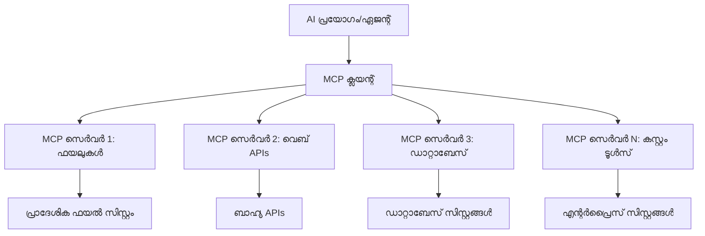

# 🌐 Module 2: MCP Microsoft Foundry Toolkit അടിസ്ഥാനങ്ങളോട് ചേർന്ന്

[]()
[]()
[]()

## 📋 പഠന ലക്ഷ്യങ്ങൾ

ഈ മോഡ്യൂൾ പൂർത്തിയാകുമ്പോൾ, നിങ്ങൾക്ക് കഴിയും:
- ✅ Model Context Protocol (MCP) ആർക്കിടെക്ചർ മനസിലാക്കുക, അതിന്റെ പ്രയോജനങ്ങൾ
- ✅ Microsoft-ന്റെ MCP സേർവർ പരിസ്ഥിതി പരിശോധിക്കുക
- ✅ MCP സേർവർ Microsoft Foundry Toolkit Agent Builder-ടെ সঙ্গে സംയോജിപ്പിക്കുക
- ✅ Playwright MCP ഉപയോഗിച്ച് പ്രവർത്തനക്ഷമമായ ബ്രൗസർ ഓട്ടോമേഷൻ ഏജന്റ് നിർമ്മിക്കുക
- ✅ ഏജന്റുകളിലെ MCP ഉപകരണങ്ങൾ സജ്ജമാക്കി പരിശോധിക്കുക
- ✅ MCP-സാധിത ഏജന്റുകളെ കയറ്റുമതി ചെയ്ത് ഉത്പാദനത്തേക്കു വിനിയോഗിക്കുക

## 🎯 Module 1-ൽ നിന്ന് മുന്നോട്ടുവെക്കൽ

Module 1-ൽ, Microsoft Foundry Toolkit അടിസ്ഥാനങ്ങളെ കൈകാര്യം ചെയ്ത് ആദ്യ Python ഏജന്റ് നിർമ്മിച്ചു. ഇനി നാം നിങ്ങളുടെ ഏജന്റുകളെ വിപ്ലവകരമായ **Model Context Protocol (MCP)** വഴി പുറമേയിലെ ഉപകരണങ്ങളും സേവനങ്ങളുമായി ബന്ധിപ്പിച്ച് **സൂപ്പർചാർജ്** ചെയ്യും.

ഇത് ഒരു അടിസ്ഥാന കാൽക്കുലേറ്ററിൽ നിന്ന് പൂർണ്ണ കമ്പ്യൂട്ടറിലേക്ക് അപ്‌ഗ്രേഡ് ചെയ്യുന്നതുപോലെ ആണ് — നിങ്ങളുടെ AI ഏജന്റുകൾക്ക് കഴിയും:
- 🌐 വെബ്സൈറ്റുകളിൽ ബ്രൗസ് ചെയ്ത് ഇടപെട്ട് പ്രവർത്തിക്കുക
- 📁 ഫയലുകളിൽ പ്രവേശിക്കുകയും മാനേജു ചെയ്യുകയും ചെയ്യുക
- 🔧 സംരംഭക സംവിധാനങ്ങളുമായി സംയോജിപ്പിക്കുക
- 📊 API-കളിൽ നിന്ന് റിയൽ-ടൈം ഡാറ്റ പ്രോസസ് ചെയ്യുക

## 🧠 Model Context Protocol (MCP) മനസിലാക്കൽ

### 🔍 MCP എന്താണ്?

Model Context Protocol (MCP) AI ആപ്ലിക്കേഷനുകൾക്കുള്ള **"USB-C"** ആണ് — വമ്പിച്ച ഭാഷാ മോഡലുകളെ (LLMs) പുറമേയിലെ ഉപകരണങ്ങൾ, ഡാറ്റാ റിസോഴ്‌സുകൾ, സേവനങ്ങളുമായി ബന്ധിപ്പിക്കുന്ന വിപ്ലവപരമായ ഒരു തുറന്ന मानദണ്ഡം. USB-C ഒരു സർവ്വവ്യാപക കണക്ടർ നൽകിക്കേബിൾ പാളി ഒഴിവാക്കി എന്നപോലെ, MCP ഒന്ന് പ്രമാണമാക്കി AI സംയോജനം ലളിതമാക്കുന്നു.

### 🎯 MCP പരിഹരിക്കുന്നത് എന്ത് പ്രശ്നം?

**MCP ന് മുൻപ്:**
- 🔧 ഓരോ ഉപകരണത്തിനും ഒറ്റപ്പണി സംയോജനം
- 🔄 വ്യാപാരപ്രധാനമായ സോല്യൂഷനുകളിൽ വന്ദോർ ലോക്ക്-ഇൻ
- 🔒 താത്കാലിക ബന്ധങ്ങളിൽ നിന്നുള്ള സുരക്ഷാ ദുര്‍ബലതകൾ
- ⏱️ അടിസ്ഥാനസംയോജനത്തിന് മാസങ്ങളായ വികസനം

**MCP ഉപയോഗിച്ചാൽ:**
- ⚡ പ്ലഗ്-അൻഡ്-പ്ലേ ഉപകരണ സംയോജനം
- 🔄 വന്ദോർ-അഗ്നോസ്റ്റിക് ആർക്കിടെക്ചർ
- 🛡️ നിലനിൽക്കുന്ന സുരക്ഷാ ശ്രേഷ്ഠസംവിധാനങ്ങൾ
- 🚀 പുതുവായ കഴിവുകൾ ചേർക്കാനായ মিনিটുകൾ

### 🏗️ MCP ആർക്കിടെക്ചർ വിശദീകരണം

MCP ഒരു **ക്ലയന്റ്-സേർവർ ആർക്കിടെക്ചർ** പിന്തുടരുന്നു, സുരക്ഷിതവും വ്യാപകവുമുള്ള ഒരു പരിസ്ഥിതി സൃഷ്ടിക്കുന്നതുമായി:



**🔧 പ്രാഥമിക ഘടകങ്ങൾ:**

| ഘടകം | പങ്ക് | ഉദാഹരണങ്ങൾ |
|-----------|------|----------|
| **MCP ഹോസ്റ്റുകൾ** | MCP സേവനങ്ങൾ ഉപഭോഗിക്കുന്ന ആപ്ലിക്കേഷനുകൾ | Claude Desktop, VS Code, Microsoft Foundry Toolkit |
| **MCP ക്ലയന്റുകൾ** | പ്രോട്ടോക്കോൾ ഹാൻഡ്ലറുകൾ (സേർവറുകളുമായി 1:1) | ഹോസ്റ്റ് ആപ്ലിക്കേഷനുകളിൽ ഉൾപ്പെടുത്തിയിരിക്കുന്നു |
| **MCP സേർവറുകൾ** | സ്റാൻഡേർഡ് പ്രോട്ടോക്കോൾ വഴി കഴിവുകൾ പുറത്തു വിടുന്നു | Playwright, Files, Azure, GitHub |
| **ട്രാൻസ്പോർട്ട് ലെയർ** | ആശയവിനിമയ മാർഗങ്ങൾ | stdio, HTTP, WebSockets |


## 🏢 Microsoft-ന്റെ MCP സേർവർ പരിസ്ഥിതി

Microsoft MCP പരിസ്ഥിതിയിലേക്ക് പ്രമുഖമായി മുന്നേറുന്നു കാരണം അതിന്റെ സമഗ്രമായ എന്റർപ്രൈസ്-ഗ്രേഡ് സേർവറുകളുടെ സ്വീറ്റ് യഥാർത്ഥ ബിസിനസ് ആവശ്യങ്ങൾ നിറവേറ്റുന്നു.

### 🌟 പ്രധാന Microsoft MCP Server-ുകൾ

#### 1. ☁️ Azure MCP Server
**🔗 റെപ്പോസിറ്ററി**: [azure/azure-mcp](https://github.com/azure/azure-mcp)
**🎯 ലക്ഷ്യം**: AI സംയോജനം ഉള്ള സമഗ്ര Azure റിസോഴ്‌സ് മാനേജ്മെന്റ്

**✨ പ്രധാന സവിശേഷതകൾ:**
- പ്രഖ്യാപിത അടിസ്ഥാന സൗകര്യ പ്രൊവിഷനിംഗ്
- റിയൽ-ടൈം റിസോഴ്‌സ് നിരീക്ഷണം
- ചെലവു കുറച്ചൽ നിർദ്ദേശങ്ങൾ
- സുരക്ഷാ അനുസരണ പരിശോധന

**🚀 ഉപയോഗങ്ങൾ:**
- AI സഹായത്തോടെ ഇൻഫ്രാസ്ട്രക്ചർ-ആസ്-കോഡ്
- ഓട്ടോമാറ്റഡ് റിസോഴ്‌സ് സ്‌കെയിലിംഗ്
- ക്ലൗഡ് ചെലവ് കുറർച്ച
- ഡെവ്ഒപ്സ് വർക്ക്‌ഫ്ലോ ഓട്ടോമേഷൻ

#### 2. 📊 Microsoft Dataverse MCP
**📚 ഡോക്യുമെന്റേഷൻ**: [Microsoft Dataverse Integration](https://go.microsoft.com/fwlink/?linkid=2320176)
**🎯 ലക്ഷ്യം**: ബിസിനസ് ഡാറ്റക്ക് സ്വാഭാവിക ഭാഷാ ഇന്റർഫേസ്

**✨ പ്രധാന സവിശേഷതകൾ:**
- സ്വാഭാവിക ഭാഷാ ഡാറ്റാബേസ് ക്വറികൾ
- ബിസിനസ് context മനസിലാക്കൽ
- കസ്റ്റം പ്രാമ്പ്റ്റ് ടെംപ്ലേറ്റുകൾ
- എന്റർപ്രൈസ് ഡാറ്റ ഗവർണൻസ്

**🚀 ഉപയോഗങ്ങൾ:**
- ബിസിനസ് ഇന്റലിജൻസ് റിപ്പോർട്ടിംഗ്
- കസ്റ്റമർ ഡാറ്റ വിശകലനം
- സെയിൽസ് പൈപ്പ്ലൈനിലെ洞察ങ്ങൾ
- അനുസരണ ഡാറ്റ ക്വറികൾ

#### 3. 🌐 Playwright MCP Server
**🔗 റെപ്പോസിറ്ററി**: [microsoft/playwright-mcp](https://github.com/microsoft/playwright-mcp)
**🎯 ലക്ഷ്യം**: ബ്രൗസർ ഓട്ടോമേഷൻ, വെബ് ഇടപെടൽ കഴിവുകൾ

**✨ പ്രധാന സവിശേഷതകൾ:**
- കროს്-ബ്രൗസർ ഓട്ടോമേഷൻ (ക്രോം, ഫയർഫോക്സ്, സഫാരി)
- ബുദ്ധിമുട്ടുള്ള മൂലകം കണ്ടെത്തൽ
- സ്‌ക്രീൻഷോട്ട്, PDF പണിയൽ
- നെറ്റ്‌വർക്കിനോടുള്ള ട്രാഫിക് നിരീക്ഷണം

**🚀 ഉപയോഗങ്ങൾ:**
- ഓട്ടോമേറ്റഡ് ടെസ്റ്റിംഗ് വർ‌ക്ക്‌ഫ്ലോകുകൾ
- വെബ് സ്ക്രാപിംഗ്, ഡാറ്റാ എക്‌സ്‌ട്രാക്ഷൻ
- UI/UX നിരീക്ഷണം
- മത്സരം വിശകലനം ഓട്ടോമേഷൻ

#### 4. 📁 Files MCP Server
**🔗 റെപ്പോസിറ്ററി**: [microsoft/files-mcp-server](https://github.com/microsoft/files-mcp-server)
**🎯 ലക്ഷ്യം**: ബുദ്ധിമുട്ടുള്ള ഫയൽ സിസ്റ്റം ഓപ്പറേഷനുകൾ

**✨ പ്രധാന സവിശേഷതകൾ:**
- പ്രഖ്യാപിത ഫയൽ മാനേജ്മെന്റ്
- ഉള്ളടക്കം സമന്വയം
- വേർഷൻ കൺട്രോൾ സംയോജനം
- മെറ്റാഡാറ്റാ എക്‌സ്‌ട്രാക്ഷൻ

**🚀 ഉപയോഗങ്ങൾ:**
- ഡോക്യുമെന്റേഷൻ മാനേജ്മെന്റ്
- കോഡ് റെപ്പോസിറ്ററി ഓർഗനൈസേഷൻ
- ഉള്ളടക്കം പ്രസിദ്ധീകരണം വർക്ക്‌ഫ്ലോകുകൾ
- ഡാറ്റ പൈപ്പ്ലൈൻ ഫയൽ കൈകാര്യം

#### 5. 📝 MarkItDown MCP Server
**🔗 റെപ്പോസിറ്ററി**: [microsoft/markitdown](https://github.com/microsoft/markitdown)
**🎯 ലക്ഷ്യം**: അഡ്‌വാൻസ്ഡ് മാർക്ക്‌ഡൗൺ പ്രോസസിംഗ്, മാനിപ്പുലേഷൻ

**✨ പ്രധാന സവിശേഷതകൾ:**
- സമ്പന്നമായ മാർക്ക്‌ഡൗൺ പാഴ്സിംഗ്
- ഫോർമാറ്റ് കൺവർ‌ഷൻ (MD ↔ HTML ↔ PDF)
- ഉള്ളടക്കം ഘടന വിശകലനം
- ടെംപ്ലേറ്റ് പ്രോസസിംഗ്

**🚀 ഉപയോഗങ്ങൾ:**
- സാങ്കേതിക ഡോക്യുമെന്റേഷൻ വർക്ക്‌ഫ്ലോകുകൾ
- ഉള്ളടക്കം മാനേജ്മെന്റ് സിസ്റ്റങ്ങൾ
- റിപ്പോർട്ട് ജനറേഷൻ
- നോളജ് ബേസ് ഓട്ടോമേഷൻ

#### 6. 📈 Clarity MCP Server
**📦 പാക്കേജ്**: [@microsoft/clarity-mcp-server](https://www.npmjs.com/package/@microsoft/clarity-mcp-server)
**🎯 ലക്ഷ്യം**: വെബ് അനലിറ്റിക്സ്, ഉപയോക്തൃ പെരുമാറ്റ洞察ങ്ങൾ

**✨ പ്രധാന സവിശേഷതകൾ:**
- ഹീറ്റ്മാപ്പ് ഡാറ്റ അനലിസിസ്
- ഉപയോക്തൃ സെഷൻ റെക്കോർഡിംഗുകൾ
- പെർഫോർമൻസ്ന മെട്രിക്‌സ്
- കൺവെർഷൻ ഫണൽ വിശകലനം

**🚀 ഉപയോഗങ്ങൾ:**
- വെബ്സൈറ്റ് ഓപ്റ്റിമൈസേഷൻ
- ഉപയോക്തൃ അനുഭവ ഗവേഷണം
- A/B ടെസ്റ്റിംഗ് വിശകലനം
- ബിസിനസ് ഇന്റലിജൻസ് ഡാഷ്ബോർഡുകൾ

### 🌍 സമൂഹ പരിസ്ഥിതി

Microsoft-ന്റെ സർവറുകൾക്കു പുറമേ, MCP പരിസ്ഥിതിയിൽ ഉൾപ്പെടുന്നു:
- **🐙 GitHub MCP**: റെപ്പോസിറ്ററി മാനേജ്‌മെന്റ്, കോഡ് വിശകലനം
- **🗄️ ഡാറ്റാബേസ് MCPs**: PostgreSQL, MySQL, MongoDB സംയോജനം
- **☁️ ക്ലൗഡ് പ്രൊവൈഡർ MCPs**: AWS, GCP, ഡിജിറ്റൽ ഓഷ്യൻ ടൂൾസ്
- **📧 കമ്യൂണിക്കേഷൻ MCPs**: Slack, Teams, Email ഇൻറഗ്രേഷൻസ്

## 🛠️ പ്രായോഗിക ലാബ്: ബ്രൗസർ ഓട്ടോമേഷൻ ഏജന്റ് നിർമ്മാണം

**🎯 പ്രോജെക്ട് ലക്ഷ്യം**: Playwright MCP സേർവർ ഉപയോഗിച്ച് വെബ്സൈറ്റുകളിൽ നാവിഗേറ്റ് ചെയ്ത് വിവരങ്ങൾ എടുക്കാനും കൂടുതൽ സങ്കീർണ്ണമായ വെബ് ഇടപെടലുകൾ നടത്താനും കഴിഞ്ഞ ഒരു ബുദ്ധിമുട്ടുള്ള ബ്രൗസർ ഓട്ടോമേഷൻ ഏജന്റ് സൃഷ്‌ടിക്കൽ.

### 🚀 ഘട്ടം 1: ഏജന്റ് അടിസ്ഥാനം സജ്ജീകരിക്കുക

#### ഘട്ടം 1: ഏജന്റ് ആരംഭിക്കുക
1. **Microsoft Foundry Toolkit Agent Builder തുറക്കുക**
2. **പുതിയ ഏജന്റ് സൃഷ്ടിക്കുക** താഴെ പറയുന്ന ക്രമീകരണത്തോടെ:
   - **പേര്**: `BrowserAgent`
   - **മോഡൽ**: GPT-4o തിരഞ്ഞെടുക്കുക


### 🔧 ഘട്ടം 2: MCP സംയോജനം പ്രവൃത്തി പ്രവാഹം

#### ഘട്ടം 3: MCP Server സംയോജനം ചേർക്കുക
1. **Agent Builder-ൽ Tools ശേഖരം തുറക്കുക**
2. **"Add Tool" ക്ലിക്ക് ചെയ്ത് ഇന്റഗ്രേഷൻ മെനു തുറക്കുക**
3. **"MCP Server" തിരഞ്ഞെടുക്കുക**


**🔍 ഉപകരണ തരം മനസിലാക്കൽ:**
- **ബിൽറ്റിൻ ടൂളുകൾ**: മുൻകൂർ ക്രമീകരിച്ച Microsoft Foundry Toolkit ഫംഗ്ഷനുകൾ
- **MCP Server-കൾ**: പുറത്തുള്ള സേവന സംയോജനം
- **കസ്റ്റം API-കൾ**: നിങ്ങളുടെ സ്വന്തം സേവന എൻറ്‌പോയിന്റുകൾ
- **ഫംഗ്ഷൻ കോളിംഗ്**: മോഡൽ ഫംഗ്ഷനിലേക്ക് നേരിട്ട് ആക്‌സസ്

#### ഘട്ടം 4: MCP Server തിരഞ്ഞെടുക്കൽ
1. **"MCP Server" ഓപ്ഷൻ തിരഞ്ഞെടുക്കൂ**


2. **MCP കാറ്റലോഗ് ബ്രൗസ് ചെയ്ത് ലഭ്യമായ ഇന്റഗ്രേഷൻസ് പരിശോധിക്കുക**


### 🎮 ഘട്ടം 3: Playwright MCP ക്രമീകരണം

#### ഘട്ടം 5: Playwright തിരഞ്ഞെടുക്കുകയും ക്രമീകരിക്കുകയും ചെയ്യുക
1. **Microsoft-ന്റെ സ്ഥിരീകരിച്ച MCP Server-കൾ കാണാൻ "Use Featured MCP Servers" ക്ലിക്ക് ചെയ്യുക**
2. **അവിടെ നിന്ന് "Playwright" തിരഞ്ഞെടുക്കുക**
3. **ഡീഫോൾട്ട് MCP ID സ്വീകരിക്കുക അല്ലെങ്കിൽ പരിസ്ഥിതിക്കനുസരിച്ച് ക്രമീകരിക്കുക**


#### ഘട്ടം 6: Playwright കഴിവുകൾ സജീവമാക്കുക
**🔑 നിർണായക ഘട്ടം**: പരമാവധി പ്രവർത്തനക്ഷമതയ്ക്ക് Playwright-ലെ ഏതു ലഭ്യമായ മാർഗ്ഗങ്ങളും **എല്ലാം** തിരഞ്ഞെടുക്കുക


**🛠️ പ്രധാന Playwright ടൂളുകൾ:**
- **നാവിഗേഷൻ**: `goto`, `goBack`, `goForward`, `reload`
- **ഇടപെടൽ**: `click`, `fill`, `press`, `hover`, `drag`
- **എക്‌സ്‌ട്രാക്ഷൻ**: `textContent`, `innerHTML`, `getAttribute`
- **സാധുത ഉറപ്പ് വരുത്തൽ**: `isVisible`, `isEnabled`, `waitForSelector`
- **ക്യാപ്ചർ ചെയ്യൽ**: `screenshot`, `pdf`, `video`
- **നെറ്റ്‌വർക്കിൻറെ**: `setExtraHTTPHeaders`, `route`, `waitForResponse`

#### ഘട്ടം 7: സംയോജന വിജയം പരിശോധിക്കുക
**✅ വിജയ സൂചകങ്ങൾ:**
- ഏജന്റ് ബിൽഡറിന്റെ ഇൻറർഫേസിൽ എല്ലാ ടൂളുകളും കാണപ്പെടുന്നു
- സംയോജനം പാനലിൽ അച്ചടക്കപരമായ പിശകുകളില്ല
- Playwright സേർവർ സ്ഥിതി "Connected" എന്ന് കാണിക്കുന്നു


**🔧 സാധാരണ പ്രശ്നപരിഹാരങ്ങൾ:**
- **ബന്ധം പരാജയം അവസ്ഥ**: ഇന്റർനെറ്റ് കണക്ഷൻ, ഫയർവാൾ ക്രമീകരണങ്ങൾ പരിശോധിക്കുക
- **ടൂൾസ് കാണാനില്ല**: ക്രമീകരണ സമയത്ത് എല്ലാ കഴിവുകളും തിരഞ്ഞെടുക്കപ്പെട്ടിട്ടുണ്ടെന്ന് ഉറപ്പാക്കുക
- **അനുമതി പിശകുകൾ**: VS Code-ക്ക് ആവശ്യമായ സിസ്റ്റം അനുമതികൾ ലഭ്യമാകുന്നുണ്ടെന്ന് ഉറപ്പാക്കുക

### 🎯 ഘട്ടം 4: സങ്കീർണ്ണ പ്രോമ്ട് എഞ്ചിനീയറിംഗ്

#### ഘട്ടം 8: ബുദ്ധിമുട്ടുള്ള സിസ്റ്റം പ്രോമ്ടുകൾ രൂപകൽപ്പന ചെയ്യുക
Playwright-ന്റെ മുഴുവൻ കഴിവുകൾ ഉപയോഗിച്ച് സങ്കീർണ്ണ പ്രോമ്ടുകൾ സൃഷ്ടിക്കുക:

```markdown
# Web Automation Expert System Prompt

## Core Identity
You are an advanced web automation specialist with deep expertise in browser automation, web scraping, and user experience analysis. You have access to Playwright tools for comprehensive browser control.

## Capabilities & Approach
### Navigation Strategy
- Always start with screenshots to understand page layout
- Use semantic selectors (text content, labels) when possible
- Implement wait strategies for dynamic content
- Handle single-page applications (SPAs) effectively

### Error Handling
- Retry failed operations with exponential backoff
- Provide clear error descriptions and solutions
- Suggest alternative approaches when primary methods fail
- Always capture diagnostic screenshots on errors

### Data Extraction
- Extract structured data in JSON format when possible
- Provide confidence scores for extracted information
- Validate data completeness and accuracy
- Handle pagination and infinite scroll scenarios

### Reporting
- Include step-by-step execution logs
- Provide before/after screenshots for verification
- Suggest optimizations and alternative approaches
- Document any limitations or edge cases encountered

## Ethical Guidelines
- Respect robots.txt and rate limiting
- Avoid overloading target servers
- Only extract publicly available information
- Follow website terms of service
```

#### ഘട്ടം 9: ഡൈനാമിക് ഉപയോക്തൃ പ്രോമ്ടുകൾ സൃഷ്ടിക്കുക
വിവിധ കഴിവുകൾ പ്രദർശിപ്പിക്കുന്ന പ്രോമ്ടുകൾ രൂപകൽപ്പന ചെയ്യുക:

**🌐 വെബ് വിശകലന ഉദാഹരണം:**
```markdown
Navigate to github.com/kinfey and provide a comprehensive analysis including:
1. Repository structure and organization
2. Recent activity and contribution patterns  
3. Documentation quality assessment
4. Technology stack identification
5. Community engagement metrics
6. Notable projects and their purposes

Include screenshots at key steps and provide actionable insights.
```


### 🚀 ഘട്ടം 5: പ്രവർത്തനം ആൻഡ് പരിശോധന

#### ഘട്ടം 10: നിങ്ങളുടെ ആദ്യ ഓട്ടോമേഷൻ നടപ്പാക്കുക
1. **"Run" ക്ലിക്ക് ചെയ്ത് ഓട്ടോമേഷന് തുടങ്ങുക**
2. **റിയൽ-ടൈം പ്രവർത്തനം നിരീക്ഷിക്കുക**:
   - ക്രോം ബ്രൗസർ സ്വയം തുടങ്ങും
   - ഏജന്റ് ലക്ഷ്യമിട്ട വെബ്സൈറ്റിൽ നാവിഗേറ്റ് ചെയ്യും
   - പ്രധാന കണ്ണികളിൽ സ്‌ക്രീൻഷോട്ടുകൾ സേവ് ചെയ്യും
   - വിശകലന ഫലങ്ങൾ റിയൽ-ടൈത്തിൽ ലഭ്യമാകും


#### ഘട്ടം 11: ഫലങ്ങൾ വിശകലനം ചെയ്യുക
ഏജന്റ് ബിൽഡറിന്റെ ഇൻറർഫേസിൽ സമഗ്ര വിശകലനം പരിശോധിച്ചുതീർക്കുക:


### 🌟 ഘട്ടം 6: ദാർഢ്യമുള്ള കഴിവുകൾ കൂടിയ നീക്കവും വിനിയോഗവും

#### ഘട്ടം 12: കയറ്റുമതി ചെയ്ത് ഉത്പാദന വിനിയോഗം
ഏജന്റ് ബിൽഡർ പല വിനിയോഗ ഓപ്ഷനുകളും പിന്തുണയ്ക്കുന്നു:


## 🎓 Module 2 സംക്ഷേപം & അടുത്ത പടികൾ

### 🏆 നേട്ടം നേടി: MCP സംയോജനം വിദഗ്ധൻ

**✅ കൈവരിച്ച കഴിവുകൾ:**
- [ ] MCP ആർക്കിടെക്ചർ, പ്രയോജനങ്ങൾ മനസിലാക്കൽ
- [ ] Microsoft MCP സേർവർ പരിസ്ഥിതി പരിചയം
- [ ] Playwright MCP Microsoft Foundry Toolkit-നോടൊപ്പം സംയോജിപ്പിക്കൽ
- [ ] സങ്കീർണ്ണ ബ്രൗസർ ഓട്ടോമേഷൻ ഏജന്റുകൾ നിർമ്മിക്കൽ
- [ ] വെബ് ഓട്ടോമേഷൻക്കുള്ള പ്രൊംപ്റ്റ് എഞ്ചിനീയറിംഗിൽ പ്രാവീണ്യം

### 📚 അധിക സ്രോതസ്സുകൾ

- **🔗 MCP സ്‌പെസിഫിക്കേഷൻ**: [അധികൃത പ്രോട്ടോക്കോൾ ഡോക്യുമെന്റേഷൻ](https://modelcontextprotocol.io/)
- **🛠️ Playwright API**: [സंपൂർണ്ണ മെത്തഡ് റഫറൻസ്](https://playwright.dev/docs/api/class-playwright)
- **🏢 Microsoft MCP Server-കൾ**: [എന്റർപ്രൈസ് ഇന്റഗ്രേഷൻ മാർഗ്ഗദർശകം](https://github.com/microsoft/mcp-servers)
- **🌍 സമൂഹ ഉദാഹരണങ്ങൾ**: [MCP Server ഗാലറി](https://github.com/modelcontextprotocol/servers)

**🎉 അഭിനന്ദനങ്ങൾ!** നിങ്ങൾ വിജയകരമായി MCP സംയോജനം കൈകാര്യം ചെയ്യുക, ഇനി പുറത്തുള്ള ഉപകരണ കഴിവുകൾ ഉപയോഗിച്ചുള്ള പ്രൊഡക്ഷൻ-തയ്യാർ AI ഏജന്റുകൾ നിർമ്മിക്കാൻ കഴിയും!


### 🔜 അടുത്ത Module-ലേക്ക് തുടരുക

നിങ്ങളുടെ MCP കഴിവുകൾ കൂടുതൽ മെച്ചപ്പെടുത്താൻ ആഗ്രഹിക്കുന്നുവോ? **[Module 3: Advanced MCP Development with Microsoft Foundry Toolkit](../lab3/README.md)**-ലേക്ക് മുന്നേറുക, അവിടെ നിങ്ങൾക്കാകും:
- സ്വന്തം കസ്റ്റം MCP Server-കൾ സൃഷ്ടിക്കാൻ
- ഏറ്റവും പുതിയ MCP Python SDK ക്രമീകരിക്കുകയും ഉപയോഗിക്കുകയും ചെയ്യാൻ
- MCP ഇൻസ്പെക്ടർ ഡീബഗ്ഗിംഗിനായി സെറ്റ് ചെയ്യാൻ
- മികച്ച MCP Server വികസന പ്രവർത്തനപ്രവാഹങ്ങൾ ശേഖരിക്കാൻ
- തുടക്കം മുതൽ ഒരു Weather MCP Server നിർമ്മിക്കാൻ

---

<!-- CO-OP TRANSLATOR DISCLAIMER START -->
**അറിയിപ്പ്**:
ഈ രേഖ AI പരിഭാഷാ സേവനം [Co-op Translator](https://github.com/Azure/co-op-translator) ഉപയോഗിച്ച് പരിഭാഷപ്പെടുത്തിയതാണ്. ഞങ്ങൾ കൃത്യതയ്ക്കായി ശ്രമിക്കുന്നുവെങ്കിലും, ഓട്ടോമേറ്റഡ് പരിഭാഷകളിൽ പിഴവുകൾ അല്ലെങ്കിൽ തെറ്റായ വിവരങ്ങൾ ഉണ്ടാകാൻ സാധ്യതയുണ്ട്. അതിന്റെ സ്വാഭാവിക ഭാഷയിലുള്ള അസൽ രേഖയാണ് പ്രാമാണികമായ ഉറവിടമായി പരിഗണിക്കേണ്ടത്. നിർണായകമായ വിവരങ്ങൾക്ക്, പ്രൊഫഷണൽ മനുഷ്യ പരിഭാഷ ശുപാർശ ചെയ്യുന്നു. ഈ പരിഭാഷ ഉപയോഗിച്ച് ഉണ്ടാകുന്ന തെറ്റിദ്ധാരണകൾ അല്ലെങ്കിൽ തെറ്റായ വ്യാഖ്യാനങ്ങൾക്കായി ഞങ്ങൾ ഉത്തരവാദികളല്ല.
<!-- CO-OP TRANSLATOR DISCLAIMER END -->