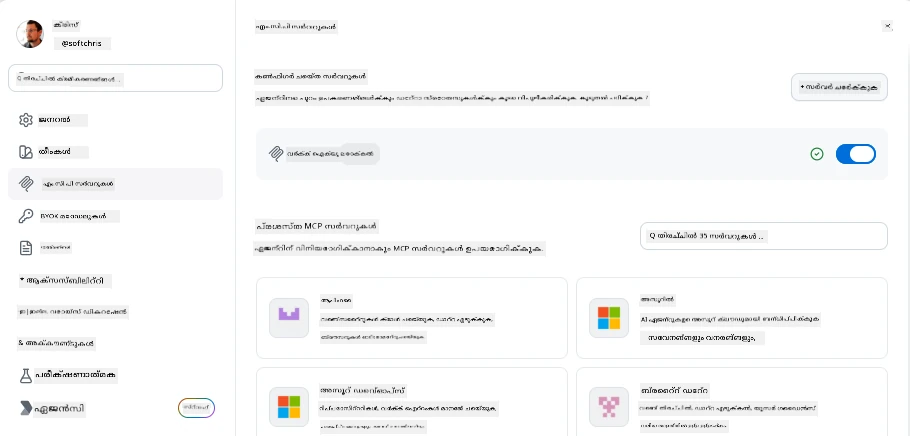
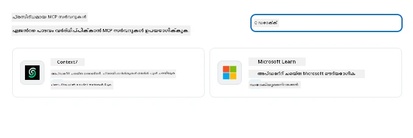
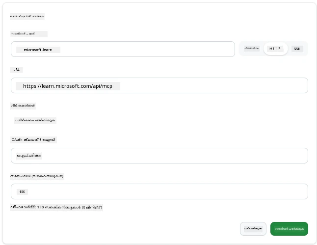
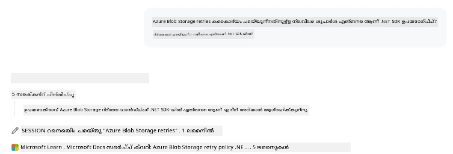
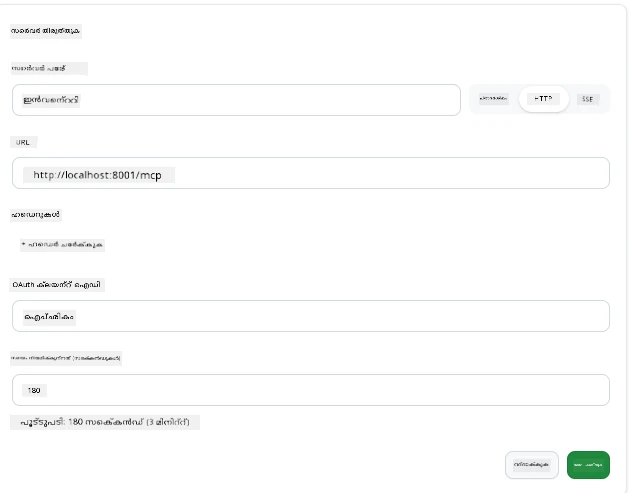
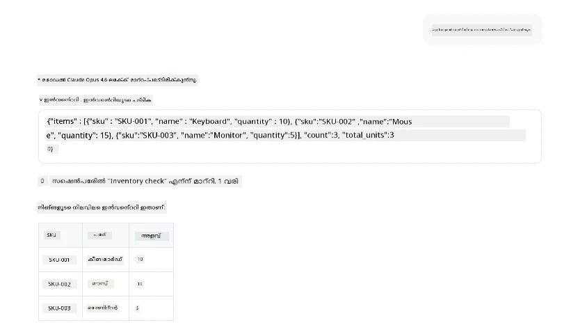
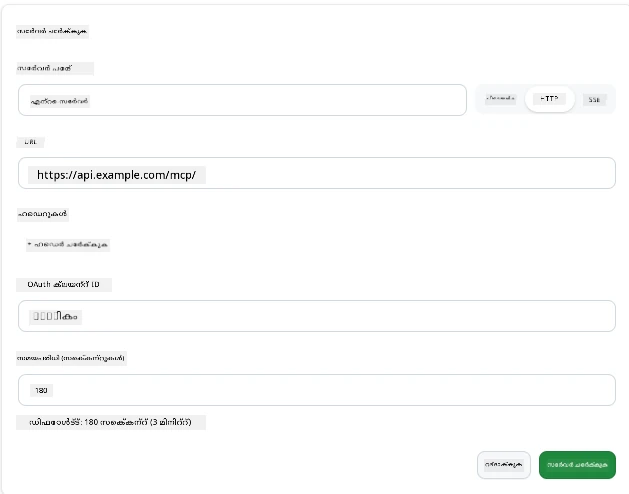
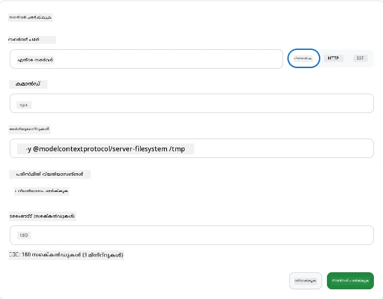

# GitHub കോപൈലറ്റ് ആപ്പിൽ MCP സെർവറുകൾ ഉപയോഗിക്കുന്നത്

ഇതുവരെ നിങ്ങൾ MCP എങ്ങനെ പ്രവർത്തിക്കുന്നുവെന്ന് അറിയുന്നു. നിങ്ങൾ സെർവറുകൾ നിർമ്മിച്ചിട്ടുണ്ട്, ടൂളുകളും സ്രോതസ്സുകളും നിർവചിച്ചിട്ടുണ്ട്, ക്ലയന്റുകളെ കണക്റ്റ് ചെയ്തിട്ടുണ്ട്. എന്നാൽ ഇതുവരെ ഞങ്ങൾ വ്യത്യാസമായ കാഴ്‌ചമാറ്റം ചെയ്തിട്ടില്ല: നിങ്ങൾ സെർവർ നിർമ്മിക്കുന്നവനായിരിക്കേണ്ടതിന് പകരം, AI-ശക്തികരിച്ച MCP പിന്തുണയുള്ള ആപ്പിന്റെ ഉപയോക്താവായി *ഉപയോഗിക്കുന്ന* ഭാഗത്ത് നിന്ന് അത് എങ്ങനെ തോന്നും?

[GitHub Copilot App](https://github.com/github/app) MCP സെർവറുകൾ ഉപയോഗിക്കാൻ കഴിയുന്ന ഡെസ്‌ക്ടോപ് ആപ്പാണ്. MCP സെർവറുകൾ അതിൽ കണക്റ്റ് ചെയ്താൽ, നിങ്ങൾ ഒരു പുതിയ നില തുറക്കുന്നു: കോപൈലറ്റ് ഇനി നിങ്ങളുടെ ഡോക്യുമെന്റേഷൻ ലഭ്യമാക്കാൻ, നിങ്ങളുടെ ഉൾമുഖ APഇകൾക്ക് കോൾ ചെയ്യാൻ, നിങ്ങളുടെ ഡാറ്റാബേസ് ക്വറി ചെയ്യാൻ, അല്ലെങ്കിൽ നിങ്ങൾ ഒരു സെർവറിൽ ചുറ്റിപ്പറ്റിയിരിക്കുന്ന യാതൊരു സർവീസിനെയും സംസാരിക്കാൻ കഴിയും. ആപ്പ് ഹോസ്റ്റായി പണി നോക്കുന്നു; നിങ്ങളുടെ MCP സെർവറുകൾ അതിന്റെ ടൂളുകളായി മാറുന്നു.

ഈ പാഠം ആ അനുഭവം അവസാനത്തോളം വഴി നിങ്ങളെ എത്തിക്കുന്നു—MCP സെറ്റിങ്ങുകൾ പാനൽ കണ്ടെത്താനുള്ളത് മുതൽ ഒരു യഥാർത്ഥ ഡോക്യുമെന്റേഷൻ സെർവർ കണക്റ്റ് ചെയ്യുക, പിന്നെ നിങ്ങളുടെ സ്വന്തം കസ്റ്റം സെർവർ വയർ ചെയ്യുക വരെ.

## പഠന ലക്ഷ്യങ്ങൾ

ഈ പാഠം അവസാനിച്ചതോടെ നിങ്ങൾക്ക് കഴിയും:

- കോപൈലറ്റ് ആപ്പ് സെറ്റിങ്ങുകളിൽ MCP സെർവറുകളുടെ പാൻൽ കണ്ടെത്താനും നാവിഗേറ്റ് ചെയ്യാനും.
- ഹോസ്റ്റുചെയ്യപ്പെട്ട ഒരു ഡോക്യുമെന്റേഷൻ സെർവർ കണക്റ്റ് ചെയ്ത് സെഷനിൽ ഉപയോഗിക്കാനും.
- ഒരു കസ്റ്റം സെർവർ രജിസ്റ്റർ ചെയ്ത് കോപൈലറ്റ് അതിന്റെ ടൂളുകൾ വിളിക്കാനാകും എന്ന് സ്ഥിരീകരിക്കാനും.
- സെർവർ എങ്ങനെ വിളിക്കപ്പെടുന്നു എന്ന് പരിസ്ഥിതി വ്യത്യാസങ്ങൾ അല്ലെങ്കിൽ കസ്റ്റം ഹെഡറുകൾ (HTTP ആയാൽ) നൽകിയും ക്രമീകരിക്കാനും.

## MCP ഹോസ്റ്റായി കോപൈലറ്റ് ആപ്പ്

അവിടെ അടിസ്ഥാന ആശയം ഇങ്ങനെ: **കോപൈലറ്റിന്റെ ഏജന്റുകൾ ഫുൾ സ്കിളി സ്മാർട്ടാണ്, പക്ഷേ അവർക്ക് നിങ്ങൾ പറഞ്ഞതുതന്നെ മാത്രമേ അറിയയുള്ളൂ.** ഡീഫാൾട്ടായി, ഏജന്റ് നിങ്ങളുടെ വർക്ക്‌സ്‌പെയ്‌സിലുള്ള ഫയലുകൾ വായിക്കാനും ടെർമിനൽ കമാൻഡുകൾ ഓടിക്കാനുമാണ് കഴിവുള്ളത്, എന്നാൽ അത് നിങ്ങളുടെ ഡാറ്റാബേസ് ക്വറി ചെയ്യാനോ കലണ്ടർ നോക്കാനോ അല്ലെങ്കിൽ ഒരു കസ്റ്റം API കോൾ ചെയ്യാനോ സഹായം കൂടാതെ കഴിയില്ല. അവിട് MCP സെർവറുകൾ ഇടപാടുകാരുടെ വേഷം‍റെർ എടുക്കുന്നു. അവ കോപൈലറ്റിനും നിങ്ങളുടെ സിസ്റ്റത്തിലെയും—ഡാറ്റാബേസുകൾ, വേർഷൻ കൺട്രോൾ, APIകൾ, ഡിസൈനിംഗ് ടൂളുകൾ— മധ്യസ്ഥം നൽകുന്നു, ഏജൻ്റുകൾക്ക് ജോലി പൂർത്തിയാക്കാൻ ആവശ്യമായ വിവരങ്ങളെയും പ്രവർത്തനങ്ങളെയും.

നിങ്ങളുടെ ആപ്പ് MCP സെർവറുകൾ മാനേജ് ചെയ്യാനുള്ള സെറ്റിങ്ങുകൾ കണ്ടെത്തുന്നതിൽ നിന്ന് തുടക്കം കുറിക്കാം.

## ഘട്ടം 1: MCP സെറ്റിങ്ങ് പാനൽ കണ്ടെത്തൽ

കോപൈലറ്റ് ആപ്പ് തുറന്ന് താഴ്ന്ന വലത് കോണിലുള്ള ഒരു കോഗ് ഐക്കൺ കണ്ടെത്തി അതിൽ ക്ലിക്ക് ചെയ്യുക.


"MCP Servers" തിരഞ്ഞെടുക്കാൻ ഉറപ്പാക്കുക; നിങ്ങൾ നേരത്തെ കോൺഫിഗർ ചെയ്തിരിക്കുന്ന സെർവറുകൾ മുകളിൽ കാണുമെന്നും, പ്രശസ്ത സെർവറുകളുടെ മാർക്കറ്റ്‌പ്ലേസ് താഴെ കാണാനും, മുകളിൽ "Add Server" ബട്ടൺ കാണാനുമാകും:



ഇത് നിങ്ങളുടെ കൺട്രോൾ സെന്ററാണ്. ഇവിടെ നിങ്ങൾ സെർവറുകൾ ചേർക്കുകയും നീക്കം ചെയ്യുകയും സജ്ജമാക്കുകയും അപ്രാപ്തമാക്കുകയും ചെയ്യാൻ കഴിയും. മാറ്റങ്ങൾ പുതിയ സെഷനുകളിലേക്ക് ബാധകമാണ്; സെഷൻ തുറന്നിരിക്കുകയാണെങ്കിൽ, ഈ ലൈസ്റ്റ് മാറ്റിയതിന് ശേഷം പുതിയ സെഷൻ തുടങ്ങേണ്ടി വരാം.

## ഘട്ടം 2: ഒരു ഡോക്യുമെന്റേഷൻ സെർവർ കണക്റ്റ് ചെയ്യൽ

ഇപ്പോളേക്ക് ഒന്ന് ഫലപ്രദമായ ഒരു ജോലി നോക്കാം. Microsoft Docs MCP സെർവർ കോപൈലറ്റിന് ഔദ്യോഗിക Microsoft ഡോക്യുമെന്റേഷനിലെ പ്രവേശനം നൽകുന്നു. ഇതിൽ Azure, .NET, TypeScript തുടങ്ങി ഉൾപ്പെടുന്നു. ഏജന്റ് തന്റെ പരിശീലന ഡേറ്റയിൽ ആശ്രയിക്കുന്നതു പകരം (cutoff തീയതി ഉണ്ട്), ക്വറി സമയത്ത് പ്രവൃത്തി പ്രചോദനം ഉൾപ്പെടെ ഉള്ള നിലവിലുള്ള ഡോക്സ് പിഴുക്കാൻ കഴിയും.

ഇത് ചേർക്കുന്നതിന് ഞാൻ പറയുന്നത്:

1. പ്രശസ്ത സെർവർ ഗ്രിഡിൽ "learn" എന്ന് ടൈപ്പ് ചെയ്ത് "Microsoft Learn" എന്ന് പേരുള്ള സെർവർ തിരഞ്ഞെടുക്കുക.

   

   ക്ലിക്കുചെയ്‌താൽ, ഒരു ഫോമ്കൾ നിങ്ങൾക്ക് കാണിക്കും, അതിൽ പേര്, ട്രാൻസ്‌പോർട്ട് തരം, URL മുന്നേൽപ്പെടുത്തിയിരിക്കും, നിങ്ങൾ ചെയ്യുന്നത് "Add Server" ക്ലിക്ക് ചെയ്യുന്നതത്രേ.

2. "Add Server" ക്ലിക്ക് ചെയ്യുക, സെർവറുമായി കണക്റ്റ് ചെയ്യാൻ കുറച്ച് സെക്കൻഡുകൾ എടുക്കും.

   

   ചേർത്തതിനു ശേഷം, അത് മുകളിൽ കോൺഫിഗർ ചെയ്ത സെർവറായിത്തന്നെ കാണിക്കും. അടുത്തതായി അത് പരീക്ഷിക്കാം.

3. ഡയലോഗ് അടച്ച്, Quick chat തിരഞ്ഞെടുക്കുക.

4. താഴെയുള്ള പ്രോപ്റ്റ് ടൈപ്പ് ചെയ്ത് Microsoft Learn സെർവറിലെ ഒരു ടൂൾ ട്രിഗർ ചെയ്യുക.

   ```text
   What's the current recommended approach for handling Azure Blob Storage 
   retries using the .NET SDK?
   ```

   

നിങ്ങൾ ചേർത്ത MCP സെർവറിനെ ഇത് എങ്ങനെ പരാമർശിക്കുന്നുവെന്ന് കാണണം.

## ഘട്ടം 3: കസ്റ്റം stdio സെർവർ കണക്റ്റ് ചെയ്യൽ

പ്രിസെറ്റുകൾ സൗകര്യപ്രദമാണ്, പക്ഷേ യഥാർത്ഥ ശേഷി നിങ്ങളുടെ സ്വന്തം സെർവറുകൾ കണക്റ്റ് ചെയ്യാനാണ്. നിങ്ങൾ ഒരു സെർവർ നിർമ്മിച്ചിരിക്കുന്നു അല്ലെങ്കിൽ ലഭിച്ചിട്ടുണ്ട് എന്ന് കരുതുക, അത് നിങ്ങളുടെ ഉൾമുഖ API അല്ലെങ്കിൽ കമ്പനിയുടെ അറിവ് ഭേദഗതി നൽകുന്നു. ഇവിടെ, ഞങ്ങൾ നിർമ്മിച്ച MCP സെർവർ ഉപയോഗിച്ച് നമ്മുടെ കമ്പനിയുടെ ഇൻവെന്ററി മാനേജ്മെന്റിനെ കൈകാര്യം ചെയ്യുന്നു.

1. കോഗ് ക്ലിക്ക് ചെയ്ത് വീണ്ടും "MCP servers" തിരഞ്ഞെടുക്കുക.

2. "Add Server" ബട്ടൺ ഞെക്കി "+ Add Custom server" തിരഞ്ഞെടുക്കുക, താഴെ പറയുന്ന മൂല്യങ്ങൾ നൽകുക:

   - പേര്: `Inventory Server`
   - ട്രാൻസ്‌പോർട്ട് തിരഞ്ഞെടുക്കുക (വലതുവശത്ത്), **http**

   "Add Server" തിരഞ്ഞെടുക്കുക, ഇപ്പോൾ അത് നിങ്ങളുടെ കോൺഫിഗർ ചെയ്ത സെർവറുകളുടെ ലിസ്റ്റിൽ കാണണം.

   

4. പരീക്ഷിക്കാൻ, താഴെ പറയുന്ന പ്രൊമ്പ്റ്റ് ഉപയോഗിക്കുക:

    ```
    list inventory
    ```

   

   ഇപ്പോൾ നിങ്ങളുടെ കസ്റ്റം നിർമ്മിച്ച സെർവറിൽ നിന്നുള്ള ഇൻവെന്ററി ഇനം ലിസ്റ്റ് തിരികെ ലഭിക്കുന്നുണ്ടെന്ന് കാണണം.

ശ്രേയസ്സായി, നിങ്ങൾക്ക് ഇപ്പോൾ കോപൈലറ്റ് ആപ്പിൽ ബാഹ്യവും സ്വന്തം MCP സെർവറുകൾ ചേർക്കുന്നതിൽ നല്ല പരിജ്ഞാനം ഉണ്ടായിരിക്കും. പിന്നീട്, രഹസ്യങ്ങളും പരിസ്ഥിതി വ്യത്യാസങ്ങളും കൈകാര്യം ചെയ്യുന്നതിനെക്കുറിച്ച് ചർച്ച ചെയ്യാം.

## ഘട്ടം 4: പുരോഗതിയുടെ ക്രമീകരണങ്ങൾ

ഇതിന് മുമ്പ്, നിങ്ങൾ പേര് നൽകുകയും URL നൽകുകയും ചെയ്തുകൊണ്ട് MCP സെർവർ ചേർക്കുന്നത് കണ്ടിട്ടുണ്ട്. എന്നാൽ നിങ്ങളുടെ സെർവർക്ക് API കീ അല്ലെങ്കിൽ മറ്റേതെങ്കിലും മൂല്യം ആവശ്യമുണ്ടെങ്കിൽ? ട്രാൻസ്‌പോർട്ട് തരം അനുസരിച്ച്, അതിന് ആവശ്യമുള്ളതു നൽകാം.

- **http അല്ലെങ്കിൽ SSE ട്രാൻസ്‌പോർട്ട്**: ഇവിടെ ആവശ്യമുള്ള ഹെഡറുകൾ സെറ്റുചെയ്യാം.

   ഉടമസ്ഥാവകാശത്തിനായി, ഉദാഹരണത്തിന് Authorization ഹെഡർ പകർപ്പിക്കുക. മൂല്യം സ്റ്റാറ്റിക് സ്ട്രിംഗ് ആയിരിക്കാം. OAuth ഉപയോഗിക്കുകയാണെങ്കിൽ, OAuth ക്ലയന്റ് ഐഡി നൽകാം.

   

- **stdio ട്രാൻസ്‌പോർട്ട്**: പാരിസ്ഥിതിക വ്യത്യാസങ്ങൾ ക്രമീകരിക്കാം.

   സെർവർ സ്റ്റാർട്ട് ചെയ്യുമ്പോൾ പാസ് ചെയ്യേണ്ട ആവശ്യമായപാരിസ്ഥിതിക വ്യത്യാസങ്ങൾ സംവരണം ചെയ്യാം.

   

## സംഗ്രഹം

കോപ്പൈലറ്റ് ആപ്പ് MCP സെർവറുകളെ ഏജന്റിന്റെ ശേഷികളുടെ ആദ്യനിരക്ക് വിപുലീകരണങ്ങളായി ആദരിക്കുന്നു. ഈ പാഠത്തിൽ MCP സെർവർ ചേർക്കുന്നതിൽ നിന്ന് അവ സെഷനിൽ ഉപയോഗിക്കുന്നത് വരെ പൂർത്തിയായ യാത്ര നിങ്ങൾ കണ്ടു. നിങ്ങൾക്ക് പൊതു സെർവറുകളിലും ഉൾമുഖ APഇകളിലും കസ്റ്റം ടൂളുകളിലും കണക്ടുചെയ്യാം, ഏജന്റുകൾക്ക് സ്വയം നടത്തുന്നതിന് ആവശ്യമായ വിവരങ്ങളും പ്രവർത്തനങ്ങളും ആക്സസ് ചെയ്യാനുള്ള കഴിവ് നൽകുന്നു.

## 📚 അധിക സ്രോതസുകൾ

### ഔദ്യോഗിക ഡോക്യുമെന്റുകൾ

- [GitHub Copilot App](https://github.com/github/app)
- [MCP Specification](https://modelcontextprotocol.io/specification/2025-03-26) - മോഡൽ കോൺടെക്സ്റ്റ് പ്രോട്ടോക്കോൾ വിശദാംശങ്ങൾ

### കമ്മ്യൂണിറ്റി
- [MCP Community Discord](https://discord.com/invite/ByRwuEEgH4) - തത്സമയം ചർച്ചകൾ
- [GitHub Discussions](https://github.com/microsoft/MCP-Server-and-PostgreSQL-Sample-Retail/discussions) - ചോദ്യോത്തരവും പങ്കുകൊളളലും
- [Stack Overflow](https://stackoverflow.com/questions/tagged/model-context-protocol) - സാങ്കേതിക ചോദ്യങ്ങൾ

---

<!-- CO-OP TRANSLATOR DISCLAIMER START -->
**അറിയിപ്പ്**:
ഈ രേഖ AI പരിഭാഷാ സേവനം [Co-op Translator](https://github.com/Azure/co-op-translator) ഉപയോഗിച്ച് പരിഭാഷപ്പെടുത്തിയതാണ്. ഞങ്ങൾ കൃത്യതയ്ക്കായി ശ്രമിക്കുന്നുവെങ്കിലും, ഓട്ടോമേറ്റഡ് പരിഭാഷകളിൽ പിഴവുകൾ അല്ലെങ്കിൽ തെറ്റായ വിവരങ്ങൾ ഉണ്ടാകാൻ സാധ്യതയുണ്ട്. അതിന്റെ സ്വാഭാവിക ഭാഷയിലുള്ള അസൽ രേഖയാണ് പ്രാമാണികമായ ഉറവിടമായി പരിഗണിക്കേണ്ടത്. നിർണായകമായ വിവരങ്ങൾക്ക്, പ്രൊഫഷണൽ മനുഷ്യ പരിഭാഷ ശുപാർശ ചെയ്യുന്നു. ഈ പരിഭാഷ ഉപയോഗിച്ച് ഉണ്ടാകുന്ന തെറ്റിദ്ധാരണകൾ അല്ലെങ്കിൽ തെറ്റായ വ്യാഖ്യാനങ്ങൾക്കായി ഞങ്ങൾ ഉത്തരവാദികളല്ല.
<!-- CO-OP TRANSLATOR DISCLAIMER END -->