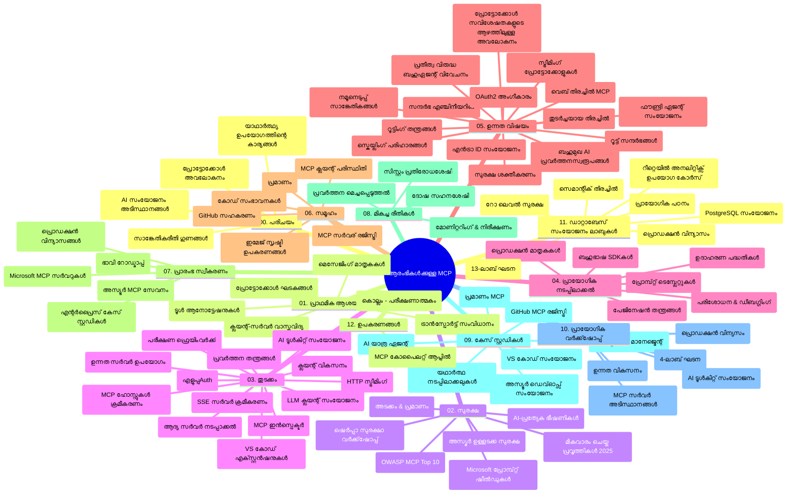

# മോഡൽ കോൺറ്റക്സ് പ്രോട്ടോകോൾ (MCP) začetμίക്കാർക്കുള്ള - പഠന മാർഗ്ദർശി

ഈ പഠന മാർഗ്ഗനിർദ്ദേശം "മോഡൽ കോൺറക്സ് പ്രോട്ടോകോൾ (MCP) začetμίക്കാർക്കുള്ള" പാഠ്യപദ്ധതിക്കായി സംഭരണം ഘടനയും ഉള്ളടക്കവും സംബന്ധിച്ച അവലോകനം നൽകുന്നു. ഖജനാവിൽ ഫണ്ട് അതിവേഗം കണ്ടെത്താനും ലഭ്യമായ സ്രോതസുകളുടെ പരമാവധി പ്രയോജനപ്പെടുത്താനും ഈ മാർഗ്ഗനിർദ്ദേശം ഉപയോഗിക്കുക. 

## റിപ്പോസിറ്ററി അവലോകനം

മോഡൽ കോൺറക്സ് പ്രോട്ടോകോൾ (MCP) AI മോഡലുകളും ഉപഭോക്തൃ ആപ്ലിക്കേഷനുകളും തമ്മിലുള്ള ഇടപെടലുകൾക്കായുള്ള ഒരു പതിവുസ്ഥാപിത ഫ്രെയിംവർക്ക് ആണ്. ആദ്യം Anthropic നിർമ്മിച്ച MCP ഇപ്പോൾ ഔദ്യോഗിക GitHub സംഘടന മുഖാന്തിരം MCP സമൂഹം സംരക്ഷിക്കുന്നു. ഈ റിപ്പോസിറ്ററി C#, Java, JavaScript, Python, TypeScript എന്നിവയിൽ പ്രായോഗിക കോഡ് ഉദാഹരണങ്ങളോടുകൂടെ സമഗ്ര പാഠ്യപദ്ധതികൾ നൽകുന്നു, AI ഡെവലപ്പർമാർക്കും സിസ്റ്റം ആർക്കിടെക്ടുമാരിനും സോഫ്റ്റ്വെയർ എഞ്ചിനീയർമാർക്കും ഇത് ലക്ഷ്യമിടുന്നു.

## ദൃശ്യപാഠ്യപ്പട്ടിക

## റിപ്പോസിറ്ററി ഘടന

റിപ്പോസിറ്ററി പന്ത്രണ്ട് പ്രധാനവിഭാഗങ്ങളായി വിന്യസിച്ചിരിക്കുന്നു, ഓരോന്നും MCPയുടെ വ്യത്യസ്ത ഉള്ളടക്കങ്ങളിലേക്ക് ശ്രദ്ധ കേന്ദ്രീകരിക്കുന്നു:

1. **പരിചയം (00-Introduction/)**
   - മോഡൽ കോൺറക്സ് പ്രോട്ടോകോൾ അവലോകനം
   - AI പൈപ്പ്ലೈನുകളിൽ സ്റ്റാന്റേർഡൈസേഷന്റെ പ്രാധാന്യം
   - പ്രായോഗിക ഉപയോഗവും ലാഭങ്ങളും

2. **മൂല ആശയങ്ങൾ (01-CoreConcepts/)**
   - ക്ലയന്റ്-സർവർ ആർക്കിടെക്ചർ
   - പ്രധാന പ്രോട്ടോകോൾ ഘടകങ്ങൾ
   - MCP-യിലെ മെസേജിംഗ് പാറ്റേണുകൾ

3. **സുരക്ഷ (02-Security/)**
   - MCP അടിസ്ഥാനത്തിലെ സിസ്റ്റങ്ങളിലുള്ള സുരക്ഷാ ഭീഷണികൾ
   - നടപ്പാക്കൽ സുരക്ഷിതമാക്കാനുള്ള പറ്റായ മാർഗ്ഗങ്ങൾ
   - സ്ഥിരീകരണവും അധികാരനിർദ്ദേശ 策 (അക്സസ് കൺട്രോൾ) നിലപാടുകൾ
   - **സമഗ്ര സുരക്ഷാ ഡോക്യുമെന്റേഷൻ**:
     - MCP സുരക്ഷാ മികച്ച പ്രായോഗിക മാർഗ്ഗങ്ങൾ 2025
     - അസ്യൂർ ഉള്ളടക്ക സുരക്ഷ നടപ്പാക്കൽ ഗൈഡ്
     - MCP സുരക്ഷ നിയന്ത്രണങ്ങളും സാങ്കേതികങ്ങളും
     - MCP മികച്ച പ്രായോഗികസ് ക്വിക്ക് റഫറൻസ്
   - **പ്രധാന സുരക്ഷാ വിഷയങ്ങൾ**:
     - പ്രോംപ്റ്റ് ഇന്‍ജക്ഷൻ, ടൂൾ വിഷപ്രയോഗ ആക്രമണങ്ങൾ
     - സെഷൻ_highjack_വും 혼란പ്പെട്ട ഡെപ്യൂട്ടി പ്രശ്നങ്ങളും
     - ടോക്കൺ പാസ്സ്ത്രൂ ക്ഷാമങ്ങൾ
     - അധികാനുമതികളും ആക്‌സസ് നിയന്ത്രണവും
     - AI ഘടകങ്ങൾക്ക് സപ്ലൈ ചെയിൻ സുരക്ഷ
     - മൈക്രോസോഫ്റ്റ് പ്രോംപ്റ്റ് ഷീൽഡ്സ് സംയോജനം

4. **ആരംഭം (03-GettingStarted/)**
   - പരിസ്ഥിതി ക്രമീകരണവും സജ്ജീകരണവും
   - അടിസ്ഥാന MCP സർവരും ക്ലയന്റും സൃഷ്ടിക്കൽ
   - നിലവിലുള്ള ആപ്ലിക്കേഷനുകളോടുള്ള സംയോജനം
   - ചർച്ച ചെയ്യപ്പെടുന്ന വിഭാഗങ്ങൾ:
     - ആദ്യ സർവർ നടപ്പിലാക്കൽ
     - ക്ലയന്റ് развити
     - LLM ക്ലയന്റ് സംയോജനം
     - VS കോഡ് സംയോജനം
     - സർവർ-സെന്റ് ഇവന്റ്സ് (SSE) സർവർ
     - ആധികാരിക സർവർ ഉപയോഗം
     - HTTP സ്ട്രീമിംഗ്
     - AI ടൂൾകിറ്റ് സംയോജനം
     - ടെസ്റ്റിംഗ് തന്ത്രങ്ങൾ
     - വിന്യാസ മാർഗ്ഗരേഖകൾ

5. **പ്രായോഗിക നടപ്പാക്കൽ (04-PracticalImplementation/)**
   - വിവിധ പ്രോഗ്രാമിംഗ് ഭാഷകളിൽ SDK-കൾ ഉപയോഗിക്കൽ
   - ഡീബഗ്ഗിംഗ്, പരിശോധന, ശരീരം സ്ഥിരീകരിക്കൽ
   - പുനഃഉപയോഗം ചെയ്യാൻ സാധിക്കുന്ന പ്രോംപ്റ്റ് ടെംപ്ലേറ്റുകളും പ്രവാഹങ്ങളും രൂപപ്പെടുത്തൽ
   - നടപ്പിലാക്കലിനുള്ള സാമ്പിൾ പ്രോജക്റ്റുകൾ

6. **പരിഷ്കൃത വിഷയങ്ങൾ (05-AdvancedTopics/)**
   - കോൺറക്സ് എഞ്ചിനീയറിംഗ് സാങ്കേതികങ്ങൾ
   - Foundry ഏജന്റ് സംയോജനം
   - മൾട്ടിമോഡൽ AI പ്രവാഹങ്ങൾ
   - OAuth2 സ്ഥിരീകരണ ഡെമോകൾ
   - πραγματικό-സമയം തിരയൽ ശേഷികൾ
   - πραγματικό-സമയം സ്ട്രീമിംഗ്
   - റൂട്ടു കോൺറക്സ് നടപ്പാക്കൽ
   - റൂട്ടിങ്ങ് തന്ത്രങ്ങൾ
   - സാമ്പ്ലിംഗ് സാങ്കേതികങ്ങൾ
   - സ്കെയിലിംഗ് സമീപനങ്ങൾ
   - സുരക്ഷ പരിഗണനകൾ
   - Entra ID സുരക്ഷ സംയോജനം
   - വെബ് തിരയൽ സംയോജനം
   - എതിരാളി മൾട്ടി ഏജന്റ് ചിന്തനം (തർക്ക പാറ്റേണുകൾ)

7. **സമൂഹ സംഭാവനകൾ (06-CommunityContributions/)**
   - കോഡ്, ഡോക്യുമെന്റേഷൻ സംഭാവനപ്പെടുത്താനുള്ള മാർഗ്ഗങ്ങൾ
   - GitHub വഴി സഹകരണം
   - സമൂഹം നയിക്കുന്ന മെച്ചപ്പെടുത്തലുകളും പ്രതികരണവും
   - വിവിധ MCP ക്ലയന്റുകൾ ഉപയോഗിക്കൽ (Claude Desktop, Cline, VSCode)
   - പടർന്ന MCP സർവറുകളുമായി പ്രവർത്തിക്കല്‍ ഉൾപ്പെടുന്ന ചിത്രം സൃഷ്ടി

8. **ആദിത്യ സ്വീകരണത്തിൽ നിന്നുള്ള പാഠങ്ങൾ (07-LessonsfromEarlyAdoption/)**
   - യഥാർത്ഥ ലോക നടപ്പിലാക്കലുകളും വിജയകഥകളും
   - MCP അധിഷ്ഠിത പരിഹാരങ്ങൾ നിർമ്മിക്കുകയും വിന്യസിക്കുകയും ചെയ്യൽ
   - പ്രവണതകളും ഭാവി റോഡ്‌മാപ്പും
   - **Microsoft MCP സർവറുകൾ മാർഗ്ഗനിർദ്ദേശം**: 10 പ്രൊഡക്ഷൻ റെഡി Microsoft MCP സർവറുകൾക്കായുള്ള സമഗ്ര മാർഗ്ഗനിർദ്ദേശം:
     - Microsoft Learn Docs MCP Server
     - അസ്യൂർ MCP സർവർ (15+ പ്രത്യേക കണക്ടറുകൾ)
     - GitHub MCP Server
     - അസ്യൂർ DevOps MCP Server
     - MarkItDown MCP Server
     - SQL Server MCP Server
     - Playwright MCP Server
     - Dev Box MCP Server
     - Microsoft Foundry MCP Server
     - Microsoft 365 Agents Toolkit MCP Server

9. **മികച്ച പ്രായോഗിക മാർഗ്ഗങ്ങൾ (08-BestPractices/)**
   - പ്രകടന ട്യൂണിംഗ്, ഓപ്റ്റിമൈസേഷൻ
   - ഫാള്‍ട്ട്-ടോളറന്റ് MCP സിസ്റ്റം രൂപകൽപ്പന
   - ടെസ്റ്റിംഗ്, പ്രതിരോധ തന്ത്രങ്ങൾ

10. **കേസു പഠനങ്ങൾ (09-CaseStudy/)**
    - MCP വ്യത്യസ്ത സാഹചര്യങ്ങളിൽ വൈവിധ്യമാർന്ന ഉപയോഗം പ്രകടിപ്പിക്കുന്ന **ഏഴു സമഗ്ര കേസ്സ് പഠനങ്ങൾ**:
    - **അസ്യൂർ AI ട്രാവൽ ഏജന്റുമാർ**: അസ്യൂർ OpenAI, AI Search എന്നിവയുമായി മൾട്ടി ഏജന്റ് ഒർക്കസ്ട്രേഷൻ
    - **അസ്യൂർ DevOps സംയോജനം**: YouTube ഡാറ്റ അപ്ഡേറ്റുകളോടെ പ്രവാഹ പ്രക്രിയകൾ ഓട്ടോമേറ്റുചെയ്യൽ
    - **സ്വതന്ത്ര സമയം ഡോക്യുമെന്റ് റിട്രീവൽ**: Python കോൺസോൾ ക്ലയന്റ് HTTP സ്ട്രീമിംഗോടുകൂടെ
    - **ഇന്ററാക്ടീവ് സ്റ്റഡീ പ്ലാൻ ജനറേറ്റർ**: Chainlit വെബ് ആപ്പ് സംഭാഷണ AI-ോടുകൂടെ
    - **എഡിറ്ററിലേയ്ക്കുള്ള ഡോക്യുമെന്റേഷൻ**: GitHub Copilot പ്രവാഹങ്ങളോടുകൂടെ VS കോഡ് സംയോജനം
    - **അസ്യൂർ API മാനേജ്മെന്റ്**: MCP സർവർ സൃഷ്ടിക്കണമെന്നതിലൂടെ എന്റർപ്രൈസ് API സംയോജനം
    - **GitHub MCP രജിസ്ട്രി**: ഇവോസിസ്റ്റം വികസനവും ഏജന്റിക് സംയോജനവും പ്ലാറ്റ്ഫോം
    - എന്റർപ്രൈസ് സംയോജനം, ഡെവലപ്പർ ഉത്പാദ്യത, ഇവോസിസ്റ്റം വികസനം എന്നിവയെ ഉൾക്കൊള്ളുന്ന നടപ്പിലാക്കൽ ഉദാഹരണങ്ങൾ

11. **ഹാൻഡ്‌സോണ്‍ വർ‌ക്ക്‌ഷോപ്പ് (10-StreamliningAIWorkflowsBuildingAnMCPServerWithAIToolkit/)**
    - MCP, AI ടൂൾകിറ്റ് എന്നിവ സംയോജിപ്പിക്കുന്ന സമഗ്ര ഹാൻഡ്‌സോണ്‍ വേർക്ക്‌ഷോപ്പ്
    - ബുദ്ധിമുട്ടുകൾ പരിഹരിക്കാൻ, വാസ്തവ ലോക ഉപകരണങ്ങളുമായി AI മോഡലുകൾ പണിയുന്നത്
    - അടിസ്ഥാനകുറിപ്പുകൾ, കസ്റ്റം സർവർ വികസനം, പ്രൊഡക്ഷൻ വിന്യാസം തുടങ്ങിയ പ്രായോഗിക ഘടകങ്ങൾ ഉൾക്കൊള്ളുന്നു
    - **ലാബ് ഘടന**:
      - ലാബ് 1: MCP സർവർ അടിസ്ഥാനങ്ങൾ
      - ലാബ് 2: പരമാവധി MCP സർവർ വികസനം
      - ലാബ് 3: AI ടൂൾകിറ്റ് സംയോജനം
      - ലാബ് 4: പ്രൊഡക്ഷൻ വിന്യാസം, സ്കെയിലിംഗ്
    - ലാബ് അടിസ്ഥാന പഠനരീതി, ഘട്ടം ഘട്ടം നിർദേശങ്ങൾ

12. **MCP സർവർ ഡാറ്റാബേസ് സംയോജനം ലാബുകൾ (11-MCPServerHandsOnLabs/)**
    - പ്രൊഡക്ഷൻ-തയാറായ MCP സർവർ നിർമ്മിക്കാനുള്ള പോസ്റ്റ്ഗ്രെയ്സ്‌ക്യुएൽ സംയോജിത സമഗ്ര 13 ലാബുകളും പഠനപാതകളും
    - തിയേറ്റർ റീറ്റെയിൽ അനുഭവം - Zava Retail യഥാർത്ഥ സദൃശ്യപ്രയോഗം
    - എന്റർപ്രൈസ് നിലവാരപ്പെട്ട പാറ്റേണുകൾ: Row Level Security (RLS), സാംടിമാന്റിക് സെർച്ച്, മൾട്ടി-ടെന്നന്റ് ഡാറ്റ ആക്‌സസ്
    - **സമ്പൂർണ ലാബ് ഘടന**:
      - **ലാബുകൾ 00-03: അടിസ്ഥാനങ്ങൾ** - പരിചയം, ആർക്കിടെക്ചർ, സുരക്ഷ, പരിസ്ഥിതി ക്രമീകരണം
      - **ലാബുകൾ 04-06: MCP സർവർ നിർമ്മാണം** - ഡാറ്റാബേസ് രൂപകൽപ്പന, MCP സർവർ നടപ്പാക്കൽ, ടൂൾ വികസനം
      - **ലാബുകൾ 07-09: പരമാവധി സവിശേഷതകൾ** - സാംടിമാന്റിക് സെർച്ച്, പരിശോധന & ഡീബഗ്ഗിംഗ്, VS കോഡ് സംയോജനം
      - **ലാബുകൾ 10-12: പ്രൊഡക്ഷൻ & മികച്ച പ്രായോഗികസ്** - വിന്യാസം, മേൽനോട്ടം, ഓപ്റ്റിമൈസേഷൻ
    - **സാങ്കേതികവിദ്യകൾ**: FastMCP ഫ്രെയിംവർക്ക്, PostgreSQL, അസ്യൂർ OpenAI, അസ്യൂർ കണ്ടെയ്‌നർ ആപ്സ്, ആപ്ലിക്കേഷൻ ഇൻസൈറ്റ്സ്
    - **പഠന ഫലങ്ങൾ**: പ്രൊഡക്ഷൻ റെഡി MCP സർവറുകൾ, ഡാറ്റാബേസ് സംയോജനം പാറ്റേണുകൾ, AI-പവർഡ് അനലിറ്റിക്സ്, എന്റർപ്രൈസ് സുരക്ഷ

13. **ടൂളിംഗ് (12-tooling/)**
    - MCP ഉപയോഗിച്ച് Copilot ആപ്പും മറ്റ് ടൂളുകളും എങ്ങനെ ഉപയോഗിക്കാമെന്ന് പഠിക്കുക

## അധിക സ്രോതസുകൾ

റിപ്പോസിറ്ററി പിന്തുണയുള്ള സ്രോതസുകൾ ഉൾക്കൊള്ളുന്നു:

- **ചിത്രങ്ങൾ ഫോൾഡർ**: പാഠ്യപദ്ധതിയിൽ ഉപയോഗിക്കുന്ന രേഖാചിത്രങ്ങളും ചിത്രംവിവരണങ്ങളും
- **ഭಾಷಾಂತರങ്ങൾ**: ഡോക്യുമെന്റേഷന്റെ ഓട്ടോമേറ്റഡ് നിരവധി ഭാഷാ പിന്തുണ
- **അധികാരം പ്രാപിച്ച MCP സ്രോതസുകൾ**:
  - [MCP ഡോക്യുമെന്റേഷൻ](https://modelcontextprotocol.io/)
  - [MCP സ്പെസിഫിക്കേഷൻ](https://spec.modelcontextprotocol.io/)
  - [MCP GitHub റിപ്പോസിറ്ററി](https://github.com/modelcontextprotocol)

## ഈ റിപ്പോസിറ്ററി എങ്ങനെ ഉപയോഗിക്കുക

1. **അനുക്രമത്തിലൂടെ പഠനം**: ഘട്ടങ്ങളിലുള്ള അദ്ധ്യായങ്ങൾ (00 മുതൽ 11 വരെ) അനുക്രമത്തിൽ പിന്തുടരുക.
2. **ഭാഷാഭേദ വ്യത്യാസം**: പ്രത്യേക പ്രോഗ്രാമിംഗ് ഭാഷയിൽ താൽപര്യമുണ്ടെങ്കിൽ, നിങ്ങൾക്ക് ഇഷ്ടമുള്ള ഭാഷയിലുള്ള ഉദാഹരണങ്ങൾവഴി പഠിക്കുക.
3. **പ്രായോഗിക നടപ്പാക്കൽ**: പരിസ്ഥിതി ക്രമീകരിച്ച് ആദ്യ MCP സർവർ, ക്ലയന്റ് നിർമ്മിക്കുന്നത് "ആരംഭം" വിഭാഗത്തിൽ നിന്ന് തുടങ്ങിയൂ.
4. **പരിഷ്കൃത പര്യവേക്ഷണം**: അടിസ്ഥാനങ്ങൾ മനസ്സിലാക്കിയശേഷം, പരിശീലിച്ച് പരമാവധി വിഷയങ്ങളിൽ സഞ്ചരിക്കുക.
5. **സമൂഹ സഹകരണവും പങ്കാളിത്തവും**: MCP സമൂഹത്തിൽ GitHub ചർച്ചകൾ, Discord ചാനലുകൾ വഴി കൈമാറുക, വിദഗ്ധരും সহപ്രവർത്തകരുമായി ബന്ധപ്പെടുക.

## MCP ക്ലയന്റുകളും ഉപകരണങ്ങളും

പാഠ്യപദ്ധതി വിവിധ MCP ക്ലയന്റുകളും ഉപകരണങ്ങളും ഉൾക്കൊള്ളുന്നു:

1. **ആധिकारिक ക്ലയന്റുകൾ**:
   - Visual Studio Code
   - MCP Visual Studio Code-ൽ
   - Claude Desktop
   - Claude VSCode-ൽ
   - Claude API

2. **സമൂഹ ക്ലയന്റുകൾ**:
   - Cline (ടെർമിനൽ അടിസ്ഥാനത്തിൽ)
   - Cursor (കോഡ് എഡിറ്റർ)
   - ChatMCP
   - Windsurf

3. **MCP മാനേജ്‌മെന്റ് ടൂളുകൾ**:
   - MCP CLI
   - MCP മാനേജർ
   - MCP ലിങ്കർ
   - MCP റൂട്ടർ

## ജനപ്രിയ MCP സർവർ

റിപ്പോസിറ്ററി വിവിധ MCP സർവറുകൾ പരിചയപ്പെടുത്തുന്നു, ഉൾപ്പെടെ:

1. **Official Microsoft MCP സർവറുകൾ**:
   - Microsoft Learn Docs MCP Server
   - അസ്യൂർ MCP Server (15+ പ്രത്യേക കണക്ടറുകൾ)
   - GitHub MCP Server
   - അസ്യൂർ DevOps MCP Server
   - MarkItDown MCP Server
   - SQL Server MCP Server
   - Playwright MCP Server
   - Dev Box MCP Server
   - Microsoft Foundry MCP Server
   - Microsoft 365 Agents Toolkit MCP Server

2. **Official റഫറൻസ് സർവറുകൾ**:
   - Filesystem
   - Fetch
   - Memory
   - Sequential Thinking

3. **ചിത്ര സൃഷ്ടി**:
   - അസ്യൂർ OpenAI DALL-E 3
   - Stable Diffusion WebUI
   - Replicate

4. **വികസന ടൂളുകൾ**:
   - Git MCP
   - ടെർമിനൽ കൺട്രോൾ
   - കോഡ് അസിസ്റ്റന്റ്

5. **പ്രത്യേക സർവറുകൾ**:
   - Salesforce
   - Microsoft Teams
   - Jira & Confluence

## സംഭാവന

ഈ റിപ്പോസിറ്ററി സമൂഹം നിന്നുള്ള സംഭാവനകൾ സ്വാഗതം ചെയ്യുന്നു. MCP സമീപനത്തിലേക്ക് ഫലപ്രദമായി സംഭാവന നൽകുന്നതിനുള്ള മാർഗ്ഗനിർദ്ദേശങ്ങൾക്കായി സമൂഹ സംഭാവനകൾ വിഭാഗം കാണുക.

----

*ഈ പഠന മാർഗ്ഗനിർദ്ദേശം 2026 ഫെബ്രുവരി 5-ന് അവസാനമായി പുതുക്കിയതാണ്, അതിൽ MCP സ്പെസിഫിക്കേഷൻ 2025-11-25ന്റെ ഏറ്റവും പുതിയ പതിപ്പ് പ്രതിഫലിപ്പിച്ചിരിക്കുന്നു, ആ തീയതി വരെ റിപ്പോസിറ്ററി അവലോകനം പ്രദാനം ചെയ്യുന്നു. ഈ തീയതിക്ക് ശേഷം റിപ്പോസിറ്ററി ഉള്ളടക്കം അപ്ഡേറ്റ് ചെയ്യപ്പെട്ടേക്കാം.*

---

<!-- CO-OP TRANSLATOR DISCLAIMER START -->
**അറിയിപ്പ്**:
ഈ രേഖ AI പരിഭാഷാ സേവനം [Co-op Translator](https://github.com/Azure/co-op-translator) ഉപയോഗിച്ച് പരിഭാഷപ്പെടുത്തിയതാണ്. ഞങ്ങൾ കൃത്യതയ്ക്കായി ശ്രമിക്കുന്നുവെങ്കിലും, ഓട്ടോമേറ്റഡ് പരിഭാഷകളിൽ പിഴവുകൾ അല്ലെങ്കിൽ തെറ്റായ വിവരങ്ങൾ ഉണ്ടാകാൻ സാധ്യതയുണ്ട്. അതിന്റെ സ്വാഭാവിക ഭാഷയിലുള്ള അസൽ രേഖയാണ് പ്രാമാണികമായ ഉറവിടമായി പരിഗണിക്കേണ്ടത്. നിർണായകമായ വിവരങ്ങൾക്ക്, പ്രൊഫഷണൽ മനുഷ്യ പരിഭാഷ ശുപാർശ ചെയ്യുന്നു. ഈ പരിഭാഷ ഉപയോഗിച്ച് ഉണ്ടാകുന്ന തെറ്റിദ്ധാരണകൾ അല്ലെങ്കിൽ തെറ്റായ വ്യാഖ്യാനങ്ങൾക്കായി ഞങ്ങൾ ഉത്തരവാദികളല്ല.
<!-- CO-OP TRANSLATOR DISCLAIMER END -->