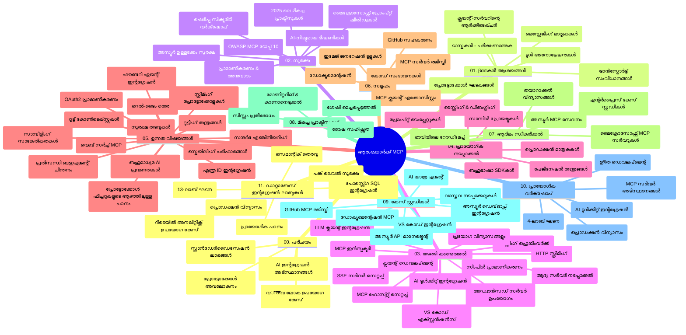

# മോഡൽ കോൺടെക്സ്റ്റ് പ്രോട്ടോക്കോൾ (MCP) വേണ്ടി ആരംഭികൾ - പഠന ഗൈഡ്

ഈ പഠന ഗൈഡ് "മോഡൽ കോൺടെക്സ്റ്റ് പ്രോട്ടോക്കോൾ (MCP) വേണ്ടി ആരംഭികൾ" പാഠ്യപദ്ധതിയുടെ റെപ്പോസിറ്ററി ഘടനയും ഉള്ളടക്കവും ഒരു അവലോകനം നൽകുന്നു. റെപ്പോസിറ്ററി കാര്യക്ഷമമായി നയിക്കാൻ ഈ ഗൈഡ് ഉപയോഗിക്കുക, ലഭ്യമായ ഉറവിടങ്ങളിൽ നിന്ന് പരമാവധി പ്രയോജനം നേടുക.

## റെപ്പോസിറ്ററി അവലോകനം

മോഡൽ കോൺടെക്സ്റ്റ് പ്രോട്ടോക്കോൾ (MCP) AI മോഡലുകളും ക്ലയന്റ് ആപ്ലിക്കേഷനുകളും തമ്മിലെ ഇടപെടലുകളുടെ ഒരു സ്റ്റാൻഡേർഡ് ഫ്രെയിംവർക്കാണ്. ആദ്യം Anthropic കൾസ്വാധീനിച്ച MCP ഇനി MCP കമ്മ്യൂണിറ്റി ഔദ്യോഗിക GitHub സംഘടന വഴി പരിപാലിക്കുന്നു. ഈ റെപ്പോസിറ്ററി AI ഡെവലപ്പർമാർ, സിസ്റ്റം ആർക്കിടെктан്മാർ, സോഫ്‌റ്റ്‌വെയർ എൻജിനീയർമാർ വേണ്ടി C#, Java, JavaScript, Python, TypeScript ഭാഷകളിൽ കൈകളും കോഡ് ഉദാഹരണങ്ങളും ഉൾപ്പെട്ട സമഗ്ര പാഠ്യപദ്ധതി നൽകുന്നു.

## ദൃശ്യ പാഠ്യപദ്ധതി മാപ്പ്

## റെപ്പോസിറ്ററി ഘടന

റെപ്പോസിറ്ററി എട്ടു പ്രധാന വിഭാഗങ്ങളായി ക്രമീകരിച്ചിരിക്കുന്നു, MCP യുടെ വിവിധ ഭാഗങ്ങൾക്കു പ്രത്യേകം ദൃഷ്ടിചെരുത്തുന്നവ:

1. **പരിചയം (00-Introduction/)**
   - മോഡൽ കോൺടെക്സ്റ്റ് പ്രോട്ടോക്കോൾ അവലോകനം
   - AI പൈപ്പ്‌ലൈൻമുകളിലെ സ്റ്റാൻഡേർഡൈസേഷൻ പ്രധാന്യമെന്ത്
   - പ്രായോഗിക ഉപയോഗകേസുകളും ഗുണഫലങ്ങളും

2. **മുൻകൂർ ആശയങ്ങൾ (01-CoreConcepts/)**
   - ക്ലയന്റ്-സർവർ ആർക്കിടെക്ചർ
   - പ്രധാന പ്രോട്ടോക്കോൾ ഘടകങ്ങൾ
   - MCP യിലെ മെസ്സേജിംഗ് മാതൃകകൾ

3. **സുരക്ഷ (02-Security/)**
   - MCP അടിസ്ഥാനമായ സിസ്റ്റങ്ങളിലെ സുരക്ഷാ ഭീഷണികൾ
   - നടപ്പാക്കലുകൾ സുരക്ഷിതമാക്കാനുള്ള മികച്ച വിധികൾ
   - അവകാശ പ്രമാണീകരണവും അനുമതിയും
   - **സമഗ്ര സുരക്ഷാ ദസ്താവേജങ്ങൾ**:
     - MCP സുരക്ഷ മികച്ച പ്രവൃത്തികൾ 2025
     - Azure Content Safety നടപ്പാക്കൽ ഗൈഡ്
     - MCP സുരക്ഷ നിയന്ത്രണങ്ങളും സാങ്കേതിക വിദ്യകളും
     - MCP മികച്ച പ്രവൃത്തികൾ ക്വിക്ക് റെഫറൻസ്
   - **പ്രധാന സുരക്ഷാ വിഷയങ്ങൾ**:
     - പ്രോമ്പ്റ്റ് ഇൻജക്ഷനും ടൂൾ വിഷാംശമാക്കൽ ആക്രമണങ്ങളും
     - സെഷൻ ഹിജാക്കിംഗും കോൺഫ്യൂസ്ഡ് ഡെപ്യൂട്ടി പ്രശ്നങ്ങളും
     - ടോക്കൺ പാസ്സ്ഥ്രൂ ദുർബലതകൾ
     - അനാവശ്യ അനുമതികളും ആക്‌സസ് നിയന്ത്രണവും
     - AI ഘടകങ്ങളിലെ സപ്ലൈ ചെയിൻ സുരക്ഷ
     - Microsoft Prompt Shields ഇന്റഗ്രേഷൻ

4. **ആരംഭം (03-GettingStarted/)**
   - പരിതസ്ഥിതി ക്രമീകരണവും സജ്ജീകരണവും
   - അടിസ്ഥാന MCP സർവർ, ക്ലയന്റുകൾ സൃഷ്‌ടിക്കുക
   - നിലവിലുള്ള ആപ്ലിക്കേഷനുകളുമായി ഇന്റഗ്രേഷൻ
   - ഉൾപ്പെടുത്തുന്ന ഭാഗങ്ങൾ:
     - ആദ്യ സർവർ നടപ്പാക്കൽ
     - ക്ലയന്റ് ഡെവലപ്പ്മെന്റ്
     - LLM ക്ലയന്റ് ഇന്റഗ്രേഷൻ
     - VS Code ഇന്റഗ്രേഷൻ
     - സർവർ-സെന്റ് ഇവന്റ്സ് (SSE) സർവർ
     - മുന്നേറ്റ സർവർ ഉപയോഗം
     - HTTP സ്ട്രീമിംഗ്
     - AI ടൂൾകിറ്റ് ഇന്റഗ്രേഷൻ
     - പരിശോധനാ തന്ത്രങ്ങള്‍
     - വിന്യസന മാർഗനിർദേശം

5. **പ്രായോഗിക നടപ്പാക്കൽ (04-PracticalImplementation/)**
   - വിവിധ പ്രോഗ്രാമിംഗ് ഭാഷകളിൽ SDK ഉപയോഗം
   - ഡീബഗ് ചെയ്യൽ, പരിശോധന, സാധൂകരിക്കൽ തന്ത്രങ്ങൾ
   - പുനരുപയോഗ പ്രോമ്പ്റ്റ് ടെംപ്ലേറ്റുകളും പ്രവൃത്തിപദ്ധതികളും തയ്യാറാക്കൽ
   - നടപ്പാക്കൽ ഉദാഹരണങ്ങളുള്ള സാമ്പിൾ പ്രോജക്റ്റുകൾ

6. **മുന്നേറ്റ വിഷങ്ങൾ (05-AdvancedTopics/)**
   - കോൺടെക്സ്റ്റ് എൻജിനീയറിംഗ് സാങ്കേതികവിദ്യകൾ
   - ഫൗണ്ടറി ഏജന്റ് ഇന്റഗ്രേഷൻ
   - മൾട്ടി-മോഡൽ AI പ്രവൃത്തിപദ്ധതികൾ
   - OAuth2 അവകാശപ്രമാണീകരണ ഡെമോകൾ
   - റിയൽ-ടൈം തിരയൽ കഴിവുകൾ
   - റിയൽ-ടൈം സ്ട്രീമിംഗ്
   - റൂട്ടു കോൺടെക്സ്റ്റുകൾ നടപ്പാക്കൽ
   - റൂടിംഗ് തന്ത്രങ്ങൾ
   - സാംപ്ലിംഗ് സാങ്കേതിക വിദ്യകൾ
   - സ്കെയ്ലിംഗ് സമീപനങ്ങൾ
   - സുരക്ഷ പരിഗണനകൾ
   - Entra ID സുരക്ഷ ഇന്റഗ്രേഷൻ
   - വെബ് തിരയലിന്റെ ഇന്റഗ്രേഷൻ
   - എഡ്വേഴ്സറിയൽ മൾട്ടി ഏജന്റ് റീസണിംഗ് (ഡിബേറ്റ് മാതൃകകൾ)

7. **കമ്മ്യൂണിറ്റി സംഭാവനകൾ (06-CommunityContributions/)**
   - കോഡ്, ഡോക്യുമെന്റേഷൻ സംഭാവന നൽകുന്ന വിധം
   - GitHub വഴി സഹകരിക്കുന്നത്
   - കമ്മ്യൂണിറ്റി പ്രേരിത മെച്ചപ്പെടുത്തലുകളും ഫീഡ്ബാക്കും
   - വൈവിധ്യമാർന്ന MCP ക്ലയന്റുകൾ (Claude Desktop, Cline, VSCode) ഉപയോഗം
   - വാണിജ്യ MCP സർവർ ഉപയോഗിച്ച് പ്രവർത്തനം ഉൾപ്പെടെ

8. **ആദ്യം സ്വീകരിച്ചതിൽ നിന്നുള്ള പാഠങ്ങൾ (07-LessonsfromEarlyAdoption/)**
   - യഥാർത്ഥ നടപ്പാക്കലുകളും വിജയകഥകളും
   - MCP അടിസ്ഥാനമുള്ള പരിഹാരങ്ങൾ സൃഷ്‌ടിക്കുകയും വിന്യസിക്കുകയും ചെയ്യൽ
   - പ്രവണതകളും ഭാവി റോഡ്‌മാപ്പും
   - **Microsoft MCP സർവർ മാർഗനിർദേശം**: 10 പ്രൊഡക്ഷൻ-സജ്ജ മൈക്രോസോഫ്‌റ് MCP സർവറുകളുടെ സമഗ്ര മാർഗനിർദേശം:
     - Microsoft Learn Docs MCP Server
     - Azure MCP Server (15+ പ്രത്യേക കണക്ടറുകൾ)
     - GitHub MCP Server
     - Azure DevOps MCP Server
     - MarkItDown MCP Server
     - SQL Server MCP Server
     - Playwright MCP Server
     - Dev Box MCP Server
     - Microsoft Foundry MCP Server
     - Microsoft 365 Agents Toolkit MCP Server

9. **മികച്ച പ്രവൃത്തികൾ (08-BestPractices/)**
   - പ്രകടനം ട്യൂണിംഗ്, ഓപ്റ്റിമൈസേഷൻ
   - ഫാള്റ്റ്-ടോളറൻറ് MCP സിസ്റ്റം ഡിസൈൻ
   - പരിശോധനയും പ്രതിരോധ തന്ത്രങ്ങളും

10. **കേസ് സ്റ്റഡികൾ (09-CaseStudy/)**
    - MCP വൈവിധ്യമാർന്ന സാഹചര്യങ്ങളിൽ പ്രാവൃത്തി തെളിയിക്കുന്ന ഏഴ് സമഗ്ര കേസുകൾ:
    - **Azure AI ട്രാവൽ ഏജൻറ്സ്**: Azure OpenAI, AI Search ഉപയോഗിച്ചുള്ള മൾട്ടി-ഏജന്റ് ഓർക്കസ്ട്രേഷൻ
    - **Azure DevOps ഇന്റഗ്രേഷൻ**: YouTube ഡാറ്റാ അപ്‌ഡേറ്റുകളോടുകൂടിയ പ്രവൃത്തി ഓട്ടോമേഷൻ
    - **റിയൽ-ടൈം ഡോക്യുമെന്റേഷൻ റിട്രീവൽ**: പൈറ്റൺ കണ്ട്ക്കോസ് ക്ലയന്റ്, സ്ട്രീമിംഗ് HTTP
    - **ഇന്ററാക്ടീവ് സ്റ്റഡി പ്ലാൻ ജനറേറ്റർ**: Chainlit വെബ് ആപ്പ്, ചാറ്റ് AI
    - **എഡിറ്റർ-ഇൻ ഡോക്യുമെന്റേഷൻ**: VS Code ഇന്റഗ്രേഷൻ, GitHub Copilot പ്രവൃത്തി പ്രവാഹങ്ങൾ
    - **Azure API മാനേജ്മെന്റ്**: MCP സർവർ സൃഷ്‌ടിക്കാനുള്ള സംരംഭ API ഇന്റഗ്രേഷൻ
    - **GitHub MCP രജിസ്ട്രി**: ഇക്കോസിസ്റ്റം വികസനം, ഏജന്റിക് ഇന്റഗ്രേഷൻ പ്ലാറ്റ്‌ഫോം
    - സംരംഭ ഇന്റഗ്രേഷൻ, ഡെവലപ്പർ ഉൽപാദകത്വം, ഇക്കോസിസ്റ്റം വികസനം ഉൾപ്പെടുന്ന നടപ്പാക്കൽ ഉദാഹരണങ്ങൾ

11. **പ്രായോഗിക ശില്പശാല (10-StreamliningAIWorkflowsBuildingAnMCPServerWithAIToolkit/)**
    - MCP, AI ടൂൾകിറ്റ് സംയോജിപ്പിച്ച സമഗ്ര പ്രായോഗിക ശില്പശാല
    - AI മോഡലുകൾ യഥാർത്ഥ ലോക ഉപകരണങ്ങളുമായി ബന്ധിപ്പിക്കുന്ന ബുദ്ധിശാലി ആപ്ലിക്കേഷനുകൾ നിർമ്മിക്കൽ
    - അടിസ്ഥാനങ്ങൾ, കസ്റ്റം സർവർ വികസനം, പ്രൊഡക്ഷൻ വിന്യസന തന്ത്രങ്ങൾ ഉൾപ്പെട്ട പ്രായോഗിക ഭാഗങ്ങൾ
    - **ലാബ് ഘടന**:
      - ലാബ് 1: MCP സർവർ അടിസ്ഥാനങ്ങൾ
      - ലാബ് 2: മുന്നേറ്റ MCP സർവർ വികസനം
      - ലാബ് 3: AI ടൂൾകിറ്റ് ഇന്റഗ്രേഷൻ
      - ലാബ് 4: പ്രൊഡക്ഷൻ വിന്യസനവും സ്കെയ്ലിംഗും
    - ഘട്ടം ഘട്ടം നിർദ്ദേശങ്ങളുള്ള ലാബ് അധ്യാപനาวิธี

12. **MCP സർവർ ഡേറ്റാബേസ് ഇന്റഗ്രേഷൻ ലാബുകൾ (11-MCPServerHandsOnLabs/)**
    - പോസ്റ്റ്‌ഗ്രെSQL ഇന്റഗ്രേഷൻ ഉപയോഗിച്ച് പ്രൊഡക്ഷൻ-സജ്ജ MCP സർവർ നിർമ്മിക്കുന്ന യാത്രക്കായി 13-ലാബ് സമഗ്ര പഠന പാത
    - Zava Retail ഉപയോഗിക്കുന്ന യഥാർത്ഥ റീറ്റെയിൽ അനലിറ്റിക് നടപ്പാക്കൽ
    - എന്റർപ്രൈസ്-ഗ്രേഡ് മാതൃകകൾ: റോ ലെവൽ സെക്യൂരിറ്റി (RLS), സെമാന്റിക് തെരച്ചിൽ, മൾട്ടി-ടെന്നന്റ് ഡാറ്റ ആക്‌സസ്
    - **പൂർണ്ണ ലാബ് ഘടന**:
      - **ലാബുകൾ 00-03: അടിസ്ഥാനങ്ങൾ** - പരിചയം, ആർക്കിടെക്ചർ, സുരക്ഷ, പരിതസ്ഥിതി ക്രമീകരണം
      - **ലാബുകൾ 04-06: MCP സർവർ നിർമ്മാണം** - ഡേറ്റാബേസ് ഡിസൈൻ, MCP സർവർ നടപ്പാക്കൽ, ടൂൾ വികസനം
      - **ലാബുകൾ 07-09: മുന്നേറ്റ സെർവ്വീസ്** - സെമാന്റിക് തിരച്ചിൽ, പരിശോധന & ഡീബഗ്, VS Code ഇന്റഗ്രേഷൻ
      - **ലാബുകൾ 10-12: പ്രൊഡക്ഷൻ & മികച്ച പ്രവൃത്തികൾ** - വിന്യാസം, നിരീക്ഷണം, മെച്ചപ്പെടുത്തൽ
    - **ആവിഷ്കൃത സാങ്കേതിക വിദ്യകൾ**: FastMCP ഫ്രെയിംവർക്ക്, പോസ്റ്റ്‌ഗ്രെSQL, Azure OpenAI, Azure കൺറ്റെയ്‌നർ ആപ്സ്, ആപ്ലിക്കേഷൻ ഇൻസൈറ്റ്‌സ്
    - **പഠന ഫലങ്ങൾ**: പ്രൊഡക്ഷൻ-സജ്ജ MCP സർവർസ്, ഡേറ്റാബേസ് ഇന്റഗ്രേഷൻ മാതൃകകൾ, AI-മേൽനോട്ടം ലഭ്യമാക്കിയ അനലിറ്റിക്‌സ്, എന്റർപ്രൈസ് സുരക്ഷ

## അധിക ഉറവിടങ്ങൾ

റെപ്പോസിറ്ററിയിൽ ഉപകാരപ്രദമായ ഉറവിടങ്ങൾ ഉൾപ്പെടുത്തിയിട്ടുണ്ട്:

- **ഇമേജസ് ഫോൾഡർ**: പാഠ്യപദ്ധതിയിൽ ഉപയോഗിച്ച ഡിസൈൻ, ചിത്രീകരണം
- **തർജ്ജമകൾ**: ഡോക്യുമെന്റേഷൻ സ്വയംഭാവത്തിൽ അധികഭാഷ പിന്തുണ
- **അധികാര MCP ഉറവിടങ്ങൾ**:
  - [MCP ഡോക്യുമെന്റേഷൻ](https://modelcontextprotocol.io/)
  - [MCP സ്പെസിഫിക്കേഷൻ](https://spec.modelcontextprotocol.io/)
  - [MCP GitHub റെപ്പോസിറ്ററി](https://github.com/modelcontextprotocol)

## ഈ റെപ്പോസിറ്ററി ഉപയോഗിക്കുന്നത് എങ്ങനെ

1. **ക്രമീകരിച്ച പഠനം**: ആധാരം മെച്ചപ്പെടുത്താൻ അദ്ധ്യായങ്ങളെ അനുക്രമത്തിൽ (00 മുതൽ 11 വരെ) പിന്തുടരുക.
2. **ഭാഷയനുസരിച്ചുള്ള ശ്രദ്ധ**: താങ്കളുടെ ഇഷ്ട ഭാഷയിൽ പ്രവർത്തനങ്ങൾക്കുള്ള സാമ്പിൾ ഡയറക്ടറികൾ പരിശോധിക്കുക.
3. **പ്രായോഗിക നടപ്പാക്കൽ**: പരിസ്ഥിതി ക്രമീകരിച്ച് ആദ്യ MCP സർവർ, ക്ലയന്റ് സൃഷ്ടിക്കാനുള്ള "ആരംഭം" വിഭാഗം ആരംഭിക്കുക.
4. **മുന്നേറ്റ ഗവേഷണം**: അടിസ്ഥാനങ്ങൾ മനസ്സിലാക്കിയ ശേഷം മുന്നേറ്റ വിഷങ്ങളിൽക്കടയാളപ്പെടുക.
5. **കമ്മ്യൂണിറ്റി പങ്കാളിത്തം**: MCP കമ്മ്യൂണിറ്റിയുമായി GitHub സംവാദങ്ങളും Discord ചാനലുകളും വഴി ബന്ധപ്പെടുക.

## MCP ക്ലയന്റുകളും ടൂളുകളും

പാഠ്യപദ്ധതിയിൽ വിവിധ MCP ക്ലയന്റുകളും ടൂളുകളും ഉൾപ്പെടുത്തിയിട്ടുണ്ട്:

1. **അധികൃത ക്ലയന്റുകൾ**:
   - Visual Studio Code
   - MCP Visual Studio Code ൽ
   - Claude ഡെസ്ക്ടോപ്പ്
   - VSCodeലുള്ള Claude
   - Claude API

2. **കമ്മ്യൂണിറ്റി ക്ലയന്റുകൾ**:
   - Cline (ടർമിനൽ അടിസ്ഥാനമാക്കിയ)
   - Cursor (കോഡ് എഡിറ്റർ)
   - ChatMCP
   - Windsurf

3. **MCP മാനേജ്മെന്റ് ടൂളുകൾ**:
   - MCP CLI
   - MCP മാനേജർ
   - MCP ലിങ്കർ
   - MCP റൂട്ടർ

## പ്രചാരത്തിലുള്ള MCP സർവർസ്

റെപ്പോസിറ്ററി വിവിധ MCP സർവറുകൾ പരിചയപ്പെടുത്തുന്നു, അവയിൽ:

1. **അധികാര മൈക്രോസോഫ്‌റ് MCP സർവർസ്**:
   - Microsoft Learn Docs MCP Server
   - Azure MCP Server (15+ പ്രത്യേക കണക്ടറുകൾ)
   - GitHub MCP Server
   - Azure DevOps MCP Server
   - MarkItDown MCP Server
   - SQL Server MCP Server
   - Playwright MCP Server
   - Dev Box MCP Server
   - Microsoft Foundry MCP Server
   - Microsoft 365 Agents Toolkit MCP Server

2. **അധികാര റഫറൻസ് സർവർസ്**:
   - ഫയൽസിസ്റ്റം
   - ഫെച്ച്
   - മെമ്മറി
   - സീക്വൻഷ്യൽ തിങ്കിംഗ്

3. **ഇമേജ് ജനറേഷൻ**:
   - Azure OpenAI DALL-E 3
   - സ്റ്റേബിൾ ഡിഫ്യൂഷൻ WebUI
   - റിപ്ലിക്കേറ്റ്

4. **ഡെവലപ്പ്മെന്റ് ടൂളുകൾ**:
   - Git MCP
   - ടർമിനൽ കൺട്രോൾ
   - കോഡ് അസിസ്റ്റന്റ്

5. **പ്രത്യേകം സർവർസ്**:
   - സെൽസ്ഫോഴ്സ്
   - മൈക്രോസോഫ്‌റ്റ് ടീംസ്
   - ജിറ & കോൺഫ്ലുവൻസ്

## സംഭാവന

റെപ്പോസിറ്ററിയിൽ കമ്മ്യൂണിറ്റിയുടെ സംഭാവനകൾ സ്വാഗതം ചെയ്യുന്നു. MCP ഇക്കോസിസ്റ്റത്തിലേക്ക് ഫലപ്രദമായി സംഭാവന നൽകാനുള്ള മാർഗ്ഗനിർദേശം അറിയാൻ കമ്മ്യൂണിറ്റി സംഭാവനകൾ വിഭാഗം കാണുക.

----

*ഈ പഠന ഗൈഡ് അവസാനമായി അപ്‌ഡേറ്റ് ചെയ്തത് 2026 ഫെബ്രുവരി 5-ാം തിയതിയിലാണ്, ഏറ്റവും പുതിയ MCP സ്പെസിഫിക്കേഷൻ 2025-11-25 പ്രകാരം എടുക്കപ്പെട്ടത്, ആ തീയതിയുടെ റെപ്പോസിറ്ററി അവസ്ഥയിൽ ഉള്ള ഒരു അവലോകനമാണ്. ഈ തീയതിയുടെ ശേഷം റെപ്പോസിറ്ററിയുടെ ഉള്ളടക്കം പുതുക്കപ്പെടാൻ സാധ്യതയുണ്ട്.*

---

<!-- CO-OP TRANSLATOR DISCLAIMER START -->
**അറിയിപ്പ്**:
ഈ രേഖ AI പരിഭാഷാ സേവനം [Co-op Translator](https://github.com/Azure/co-op-translator) ഉപയോഗിച്ച് പരിഭാഷപ്പെടുത്തിയതാണ്. ഞങ്ങൾ കൃത്യതയ്ക്കായി ശ്രമിക്കുന്നുവെങ്കിലും, ഓട്ടോമേറ്റഡ് പരിഭാഷകളിൽ പിഴവുകൾ അല്ലെങ്കിൽ തെറ്റായ വിവരങ്ങൾ ഉണ്ടാകാൻ സാധ്യതയുണ്ട്. അതിന്റെ സ്വാഭാവിക ഭാഷയിലുള്ള അസൽ രേഖയാണ് പ്രാമാണികമായ ഉറവിടമായി പരിഗണിക്കേണ്ടത്. നിർണായകമായ വിവരങ്ങൾക്ക്, പ്രൊഫഷണൽ മനുഷ്യ പരിഭാഷ ശുപാർശ ചെയ്യുന്നു. ഈ പരിഭാഷ ഉപയോഗിച്ച് ഉണ്ടാകുന്ന തെറ്റിദ്ധാരണകൾ അല്ലെങ്കിൽ തെറ്റായ വ്യാഖ്യാനങ്ങൾക്കായി ഞങ്ങൾ ഉത്തരവാദികളല്ല.
<!-- CO-OP TRANSLATOR DISCLAIMER END -->