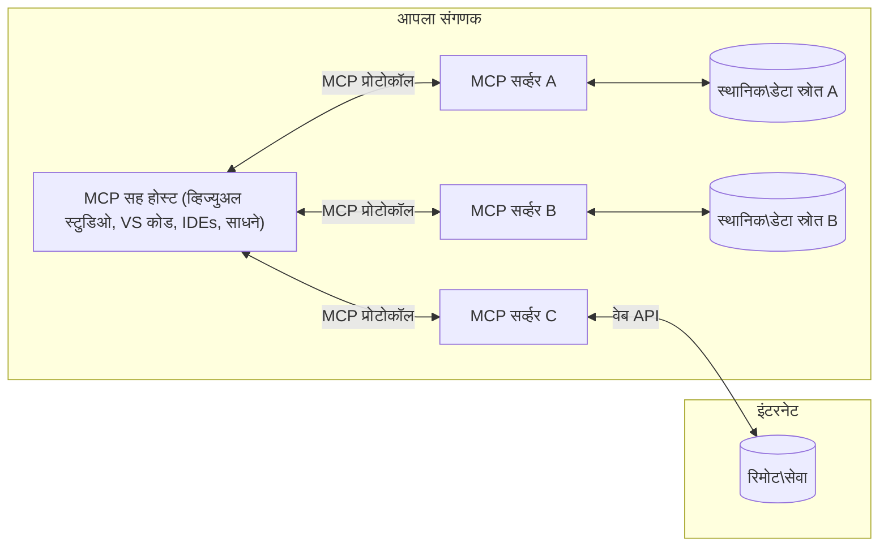

# MCP कोर संकल्पना: AI एकत्रिकरणासाठी मॉडेल संदर्भ प्रोटोकॉलमध्ये प्रावीण्य मिळवणे

[](https://youtu.be/earDzWGtE84)

_(या धड्याचा व्हिडिओ पहाण्यासाठी वरील प्रतिमा क्लिक करा)_

[मॉडेल संदर्भ प्रोटोकॉल (MCP)](https://github.com/modelcontextprotocol) हा एक सामर्थ्यशाली, मानकीकृत फ्रेमवर्क आहे जो मोठ्या भाषेच्या मॉडेल्स (LLMs) आणि बाह्य साधने, अनुप्रयोग आणि डेटा स्रोत यांच्यातील संवाद अधिक प्रभावी बनवतो.  
हा मार्गदर्शक तुम्हाला MCP च्या कोर संकल्पनांमध्ये घेऊन जाईल. तुम्ही याच्या क्लायंट-सर्व्हर आर्किटेक्चर, आवश्यक घटक, संवाद यांत्रिकी आणि अंमलबजावणीच्या उत्तम पद्धतींबद्दल शिकाल.

- **स्पष्ट वापरकर्त्याचा संमती**: सर्व डेटा प्रवेश आणि ऑपरेशन्ससाठी अंमलबजावणीपूर्वी स्पष्ट वापरकर्ता मंजुरी आवश्यक आहे. वापरकर्त्यांनी कोणता डेटा वापरला जाईल आणि कोणते क्रियाकलाप पार पडतील हे स्पष्टपणे समजून घेतले पाहिजे, तसेच परवानग्या आणि अधिकारांवर सूक्ष्म नियंत्रण असले पाहिजे.

- **डेटा गोपनीयता संरक्षण**: वापरकर्त्याचा डेटा फक्त स्पष्ट संमतीसह उघडला जातो आणि पूर्ण संवाद चक्रात मजबूत प्रवेश नियंत्रणांनी संरक्षित केला पाहिजे. गैर अधिकृत डेटा प्रसारण टाळण्यासाठी अंमलबजावण्या करणे आवश्यक आहे आणि कडक गोपनीयता सीमा राखावी.

- **साधन अंमलबजावणी सुरक्षितता**: प्रत्येक साधनाच्या कॉलसाठी स्पष्ट वापरकर्त्याचा संमती घेतली पाहिजे, ज्यात साधनाची कार्यक्षमता, पॅरामीटर्स आणि शक्य असलेला परिणाम स्पष्टपणे समजणे गरजेचे आहे. मजबूत सुरक्षा सीमांनी अनपेक्षित, असुरक्षित किंवा दुर्भावनापूर्ण साधन अंमलबजावणी टाळावी.

- **ट्रान्सपोर्ट लेयर सिक्युरिटी**: सर्व संवाद वाहिन्यांनी योग्य एन्क्रिप्शन आणि प्रमाणीकरण यंत्रणा वापरल्या पाहिजेत. दूरस्थ कनेक्शनसाठी सुरक्षित ट्रान्सपोर्ट प्रोटोकॉल आणि योग्य प्रमाणपत्र व्यवस्थापन करावे.

#### अंमलबजावणी मार्गदर्शक तत्त्वे:

- **परवानगी व्यवस्थापन**: वापरकर्त्यांना कोणत्या सर्व्हर्स, साधनांना आणि स्रोतांना प्रवेश मिळेल यावर सूक्ष्म नियंत्रण देणारी परवानगी व्यवस्था तयार करा  
- **प्रमाणीकरण आणि अधिकार**: सुरक्षित प्रमाणीकरण पद्धती (OAuth, API कीज) वापरा, योग्य टोकन व्यवस्थापन आणि कालबाह्यता लक्षात घ्या  
- **इनपुट पडताळणी**: सर्व पॅरामीटर्स आणि डेटा इनपुटना परिभाषित केलेल्या स्कीमांनुसार पडताळणी करा जेणेकरून इंजेक्शन हल्ले टाळता येतील  
- **ऑडिट लॉगिंग**: सुरक्षा निरीक्षण आणि अनुपालनासाठी सर्व ऑपरेशन्सचे सविस्तर लॉग राखा

## आढावा

हा धडा मॉडेल संदर्भ प्रोटोकॉल (MCP) परिसंस्थेच्या मूलभूत आर्किटेक्चर आणि घटकांचा सुक्ष्म अभ्यास करतो. तुम्हाला क्लायंट-सर्व्हर आर्किटेक्चर, मुख्य घटक आणि संवाद यंत्रणा यांच्याबाबत शिकायला मिळेल जे MCP संवादांना सामर्थ्य देतात.

## प्रमुख शिक्षण उद्दिष्टे

या धड्याच्या शेवटी, तुम्ही:

- MCP क्लायंट-सर्व्हर आर्किटेक्चर समजून घ्याल.  
- होस्ट्स, क्लायंट्स आणि सर्व्हर्सच्या भूमिका आणि जबाबदाऱ्या ओळखाल.  
- MCP ला लवचिक एकत्रिकरण स्तर बनवणाऱ्या मुख्य वैशिष्ट्यांचा अभ्यास कराल.  
- MCP परिसंस्थेत माहिती कशी वाहते हे शिकाल.  
- .NET, Java, Python, आणि JavaScript मधील कोड उदाहरणांद्वारे व्यावहारिक माहिती मिळवाल.

## MCP आर्किटेक्चर: सखोल दृष्टिक्षेप

MCP परिसंस्था एक क्लायंट-सर्व्हर मॉडेलवर आधारित आहे. ही मॉड्यूलर रचना AI अनुप्रयोगांना साधने, डेटाबेस, API, आणि संदर्भ साधनांशी कार्यक्षम संवाद साधण्याची परवानगी देते. चला या आर्किटेक्चरच्या मुख्य घटकांमध्ये विभागणी करूया.

मूळतः, MCP क्लायंट-सर्व्हर आर्किटेक्चरचा अवलंब करते जिथे होस्ट अनुप्रयोग अनेक सर्व्हर्सशी कनेक्ट होऊ शकतो:


- **MCP होस्ट्स**: VSCode, Claude Desktop, IDEs किंवा AI साधने जी MCP द्वारे डेटा मिळवू इच्छितात  
- **MCP क्लायंट्स**: प्रोटोकॉल क्लायंट्स जे सर्व्हरशी 1:1 कनेक्शन सांभाळतात  
- **MCP सर्व्हर्स**: हलक्या प्रोग्राम्स जे मानकीकृत मॉडेल संदर्भ प्रोटोकॉलद्वारे विशिष्ट क्षमतांचे प्रदर्शन करतात  
- **स्थानिक डेटा स्रोत**: तुमच्या संगणकातील फायली, डेटाबेस आणि सेवा ज्यांना MCP सर्व्हर्स सुरक्षितपणे प्रवेश करू शकतात  
- **दूरस्थ सेवा**: इंटरनेटवर उपलब्ध असलेली बाह्य सिस्टम्स ज्यांना MCP सर्व्हर्स API द्वारे जोडू शकतात.

MCP प्रोटोकॉल हा डेट-आधारित आवृत्ती व्यवस्थापन (YYYY-MM-DD स्वरूप) वापरून विकसित होणारा एक मानक आहे. सध्याची प्रोटोकॉल आवृत्ती **2025-11-25** आहे. तुम्ही [प्रोटोकॉल स्पेसिफिकेशन](https://modelcontextprotocol.io/specification/2025-11-25/) मधील नवीनतम अद्यतने पाहू शकता.

### 1. होस्ट्स

मॉडेल संदर्भ प्रोटोकॉल (MCP) मध्ये, **होस्ट्स** हे AI अनुप्रयोग असतात जे प्रोटोकॉलशी संवाद साधणाऱ्या वापरकर्त्यांसाठी प्राथमिक इंटरफेस म्हणून कार्य करतात. होस्ट्स अनेक MCP सर्व्हरशी कनेक्शन व्यवस्थापित करतात आणि प्रत्येक सर्व्हर कनेक्शनसाठी समर्पित MCP क्लायंट तयार करतात. होस्ट्सची काही उदाहरणे:

- **AI अनुप्रयोग**: Claude Desktop, Visual Studio Code, Claude Code  
- **विकास पर्यावरण**: MCP समाकलन असलेल्या IDEs आणि कोड संपादक  
- **सानुकूल अनुप्रयोग**: विशिष्ट हेतूसाठी बनवलेले AI एजंट्स आणि साधने

**होस्ट्स** हे AI मॉडेल संवाद संचलित करणारी अनुप्रयोग असतात. ते:

- **AI मॉडेलचे संचालन**: प्रतिसाद तयार करण्यासाठी LLMs चालवणे किंवा त्यांच्याशी संवाद साधणे आणि AI वर्कफ्लो समन्वयित करणे  
- **क्लायंट कनेक्शन व्यवस्थापन**: प्रत्येक MCP सर्व्हरसाठी एक MCP क्लायंट तयार करणे आणि देखभाल करणे  
- **वापरकर्ता इंटरफेस नियंत्रित करणे**: संभाषण प्रवाह, वापरकर्ता संवाद, आणि प्रतिसाद सादरीकरण हाताळणे  
- **सुरक्षा अंमलबजावणी**: परवानगी, सुरक्षा बंधने, आणि प्रमाणीकरण नियंत्रित करणे  
- **वापरकर्ता संमती हाताळणी**: डेटा शेअरिंग आणि साधन अंमलबजावणीसाठी वापरकर्ता मंजुरी व्यवस्थापित करणे

### 2. क्लायंट्स

**क्लायंट्स** हे अत्यावश्यक घटक आहेत जे होस्ट्स आणि MCP सर्व्हर्स यांच्यात समर्पित एक-ते-एक कनेक्शन राखतात. प्रत्येक MCP क्लायंट होस्टकडून एखाद्या विशिष्ट MCP सर्व्हरशी कनेक्ट होण्यासाठी तयार होतो, ज्यामुळे सुरक्षित आणि सुव्यवस्थित संवाद वाहिन्या निर्मित होतात. अनेक क्लायंट्स होस्टला एकाच वेळी अनेक सर्व्हरशी जोडण्याची परवानगी देतात.

**क्लायंट्स** हे होस्ट अनुप्रयोगातील कनेक्टर घटक आहेत. ते:

- **प्रोटोकॉल संवाद**: सर्व्हरना JSON-RPC 2.0 विनंत्या पाठवतात ज्यात प्रॉम्प्ट आणि सूचना असतात  
- **क्षमता वाटाघाटी**: प्रारंभिक टप्प्यात सर्व्हरशी समर्थन असलेली वैशिष्ट्ये आणि प्रोटोकॉल आवृत्ती यावर चर्चा करतात  
- **साधन अंमलबजावणी**: मॉडेलकडून आलेल्या साधन अंमलबजावणी विनंत्यांचे व्यवस्थापन करतात आणि प्रतिसाद प्रक्रिया करतात  
- **रिअल-टाइम अपडेटस्**: सर्व्हरकडून सूचना आणि ताज्या अद्यतनांचे हाताळणी करतात  
- **प्रतिसाद प्रक्रिया**: वापरकर्त्यांना दर्शविण्यासाठी सर्व्हर प्रतिसादांचे स्वरूपित करणे आणि प्रक्रिया करणे

### 3. सर्व्हर्स

**सर्व्हर्स** हे प्रोग्राम्स आहेत जे MCP क्लायंटना संदर्भ, साधने, आणि क्षमता प्रदान करतात. ते स्थानिकरित्या (होस्ट सक्तीच्या संगणकावर) किंवा दूरस्थरित्या (बाह्य प्लॅटफॉर्मवर) चालू शकतात, आणि क्लायंट विनंत्यांचा प्रतिसाद स्वरूपित करून देणे यासाठी जबाबदार आहेत. सर्व्हर्स मानकीकृत मॉडेल संदर्भ प्रोटोकॉलद्वारे विशिष्ट कार्यक्षमता प्रदान करतात.

**सर्व्हर्स** हे सेवा आहेत जे संदर्भ आणि क्षमता पुरवतात. ते:

- **वैशिष्ट्य नोंदणी**: उपलब्ध प्राथमिक वस्तू (स्रोत, प्रॉम्प्ट, साधने) क्लायंटसाठी नोंदवून खुल्या करतात  
- **विनंती प्रक्रिया**: क्लायंटकडून आलेल्या साधन कॉल्स, स्रोत विनंत्या, आणि प्रॉम्प्ट विनंत्या प्राप्त करतात व कार्यान्वित करतात  
- **संदर्भ पुरवठा**: मॉडेल प्रतिसाद सुधारण्यासाठी संदर्भात्मक माहिती किंवा डेटा पुरवतात  
- **स्थिती व्यवस्थापन**: सत्र स्थिती सांभाळतात आणि गरज असल्यास स्थितीपूर्ण संवाद हाताळतात  
- **रिअल-टाइम सूचना**: क्षमता बदल, अद्यतने याबाबत क्लायंटना सूचना पाठवतात

सर्व्हर्स कोणत्याही व्यक्तीकडून विशिष्ट कार्यक्षमतेसह तयार केले जाऊ शकतात, आणि ते स्थानिक तसेच दूरस्थ दोन्हीपरिस्थितीत वापरले जातात.

### 4. सर्व्हर प्राथमिक वस्तू (Primitives)

मॉडेल संदर्भ प्रोटोकॉल (MCP) मध्ये सर्व्हर्स तीन कोर **प्राथमिक वस्तू** प्रदान करतात, ज्याद्वारे क्लायंट, होस्ट, आणि भाषेच्या मॉडेल्स यांच्यात समृद्ध संवाद होऊ शकतो. या प्राथमिक वस्तू प्रोटोकॉलद्वारे उपलब्ध संदर्भात्मक माहिती आणि क्रियांची व्याख्या करतात.

MCP सर्व्हर्स खालील तीन कोर प्राथमिक वस्तूंपैकी कोणतेही संयोजन खुल्या करू शकतात:

#### स्रोत (Resources)

**स्रोत** हे डेटा स्रोत आहेत जे AI अनुप्रयोगांना संदर्भात्मक माहिती पुरवतात. ते स्थिर किंवा डायनॅमिक कंटेंट प्रतिनिधित्व करतात जे मॉडेलच्या समज आणि निर्णयक्षमतेत सुधारणा करतात:

- **संदर्भात्मक डेटा**: AI मॉडेल वापरासाठी संरचित माहिती आणि संदर्भ  
- **ज्ञान भांडार**: दस्तऐवज संच, लेख, मॅन्युअल्स, संशोधन पेपर  
- **स्थानिक डेटा स्रोत**: फायली, डेटाबेस, आणि स्थानिक प्रणाली माहिती  
- **बाह्य डेटा**: API प्रतिसाद, वेब सेवा, आणि दूरस्थ प्रणाली डेटा  
- **डायनॅमिक कंटेंट**: बाह्य परिस्थितींच्या आधारे अद्यतनित होणारा रिअल-टाइम डेटा

स्रोत URI द्वारा ओळखले जातात आणि `resources/list` द्वारा शोधले जाऊ शकतात व `resources/read` द्वारा प्राप्त केले जाऊ शकतात:

```text
file://documents/project-spec.md
database://production/users/schema
api://weather/current
```

#### प्रॉम्प्ट्स (Prompts)

**प्रॉम्प्ट्स** पुनर्वापरयोग्य टेम्पलेट्स आहेत ज्याद्वारे भाषेच्या मॉडेल्सशी संवाद संरचनेला मदत होते. हे प्रमाणित संवाद नमुने आणि टेम्पलेटेड वर्कफ्लोज प्रदान करतात:

- **टेम्पलेट-आधारित संवाद**: पूर्व-संरचित संदेश आणि संभाषण सुरुवाती  
- **वर्कफ्लो टेम्प्लेट्स**: सामान्य कार्यांसाठी प्रमाणित क्रमवार प्रक्रिया  
- **थोडक्यात उदाहरणे**: मॉडेल सूचनांसाठी उदाहरण-आधारित टेम्पलेट्स  
- **सिस्टीम प्रॉम्प्ट्स**: मॉडेल वर्तन आणि संदर्भ निश्चित करणारे मूलभूत प्रॉम्प्ट्स  
- **डायनॅमिक टेम्प्लेट्स**: विशिष्ट संदर्भानुसार जुळवलेले पॅरामीटराइझ्ड प्रॉम्प्ट्स

प्रॉम्प्ट्स व्हेरिएबल सबस्टिट्यूशनला सपोर्ट करतात आणि `prompts/list` ने शोधले जाऊ शकतात व `prompts/get` ने प्राप्त केले जाऊ शकतात:

```markdown
Generate a {{task_type}} for {{product}} targeting {{audience}} with the following requirements: {{requirements}}
```

#### साधने (Tools)

**साधने** ही अ‍ॅक्शन्स करण्यासाठी AI मॉडेल्स वापरू शकणाऱ्या कार्यान्वित फंक्शन्स आहेत. ही MCP परिसंस्थेतील "क्रियापद" आहेत, ज्याद्वारे मॉडेल्स बाह्य प्रणालीशी संवाद साधतात:

- **संधारित फंक्शन्स**: विशिष्ट पॅरामीटर्ससह मॉडेल्स चालवू शकणाऱ्या स्वतंत्र ऑपरेशन्स  
- **बाह्य प्रणाली एकत्रीकरण**: API कॉल्स, डेटाबेस क्वेरीज, फायलींवर प्रक्रिया, गणना  
- **अद्वितीय ओळख**: प्रत्येक साधनाचे नाम, वर्णन आणि पॅरामीटर स्कीमा यांसह वेगळेपण  
- **संरचित इनपुट/आउटपुट**: साधन पॅरामीटर्सचे वैधीकरण करते आणि संरचित, प्रकार नियंत्रित प्रतिसाद देते  
- **आपत्तीकारक कामगिरी**: मॉडेलला वास्तविक जागतिक अ‌ॅक्शन्स करण्याची व थेट डेटा मिळविण्याची क्षमता देते

साधने JSON स्कीमा वापरून परिमाणांची पडताळणी करतात, आणि `tools/list` ने त्यांचा शोध घेतला जातो, तसेच `tools/call` द्वारे त्यांना चालवले जाते. साधने अधिक चांगल्या UI सादरीकरणासाठी **आयकॉन्स** देखील वापरू शकतात.

**साधन टिप्पणी**: साधने वर्तनात्मक टिपणे (उदा., `readOnlyHint`, `destructiveHint`) वापरतात जे दर्शवतात की साधन वाचनासाठीच आहे की नुकसानकारक आहे, ज्यामुळे क्लायंटला निर्णय घेणे सोपे होते.

उदाहरण साधन व्याख्या:

```typescript
server.tool(
  "search_products", 
  {
    query: z.string().describe("Search query for products"),
    category: z.string().optional().describe("Product category filter"),
    max_results: z.number().default(10).describe("Maximum results to return")
  }, 
  async (params) => {
    // शोध चालवा आणि संरचित निकाल परत करा
    return await productService.search(params);
  }
);
```

## क्लायंट प्राथमिक वस्तू

मॉडेल संदर्भ प्रोटोकॉल (MCP) मध्ये, **क्लायंट्स** अशा प्राथमिक वस्तू खुल्या करू शकतात ज्याद्वारे सर्व्हर होस्ट अनुप्रयोगाकडून अतिरिक्त क्षमता मागू शकतात. या क्लायंट-साइड प्राथमिक वस्तू अधिक समृद्ध, संवादक्षम सर्व्हर अंमलबजावणीसाठी परवानगी पुरवतात, ज्यांना AI मॉडेल क्षमता आणि वापरकर्ता संवादात प्रवेश मिळतो.

### सॅम्पलिंग (Sampling)

**सॅम्पलिंग** सर्व्हरला क्लायंटच्या AI अनुप्रयोगाकडून भाषेच्या मॉडेल पूर्णतेसाठी विनंती करण्याची संधी देते. ही प्राथमिक वस्तू सर्व्हर्सना त्यांचे स्वतःचे मॉडेल अवलंबित्व न ठेवता LLM क्षमता वापरण्यास सक्षम करते:

- **मॉडेल-स्वतंत्र प्रवेश**: सर्व्हर्स मॉडेल SDK समाविष्ट न करता पूर्णतेसाठी विनंती करू शकतात  
- **सर्व्हर-प्रेरित AI**: सर्व्हर्सना क्लायंटच्या AI मॉडेल वापरून स्वायत्त सामग्री तयार करण्याची परवानगी देते  
- **पुनरावृत्ती LLM संवाद**: सर्व्हर्स अनेक जटिल परिस्थितीत AI मदत घेऊ शकतात  
- **डायनॅमिक कंटेंट निर्मिती**: होस्ट मॉडेल वापरून संदर्भात्मक प्रतिसाद तयार करण्यास मदत करते  
- **साधन कॉलिंग समर्थन**: `tools` आणि `toolChoice` पॅरामीटर्स वापरून सॅम्पलिंग दरम्यान मॉडेलला साधने वापरण्याची परवानगी देते

सॅम्पलिंग `sampling/complete` पद्धतीने सुरू केली जाते, जिथे सर्व्हर क्लायंटला पूर्णतेसाठी विनंत्या पाठवतात.

### रूट्स (Roots)

**रूट्स** ही एक प्रमाणित पद्धत आहे ज्याद्वारे क्लायंट्स सर्व्हर्सना फाइलसिस्टीमच्या मर्यादा उघडतात, ज्यामुळे सर्व्हर्सला कळते की त्यांना कोणत्या निर्देशिका आणि फायलींवर प्रवेश आहे:

- **फाइलसिस्टीम सीमा**: सर्व्हर्स कोणत्या मर्यादेत कार्य करू शकतात हे परिभाषित करतात  
- **प्रवेश नियंत्रण**: सर्व्हर्सला कुठल्या निर्देशिका आणि फायलींवर परवानगी आहे हे समजते  
- **डायनॅमिक अद्यतने**: क्लायंट्स रूट्स बदलल्यास सर्व्हर्सना सूचना देऊ शकतात  
- **URI-आधारित ओळख**: `file://` URI द्वारे प्रवेशयोग्य निर्देशिका आणि फायलींची ओळख

रूट्स `roots/list` पद्धतीने शोधले जातात, आणि क्लायंट्स `notifications/roots/list_changed` पद्धतीने बदलांबद्दल सूचना देतात.

### माहिती मागणी (Elicitation)  

**माहिती मागणी** सर्व्हर्सना क्लायंट इंटरफेसद्वारे वापरकर्त्याकडून अतिरिक्त माहिती किंवा पुष्टी मागण्याची परवानगी देते:

- **वापरकर्ता इनपुट विनंत्या**: साधन कार्यान्वित करताना अतिरिक्त माहिती मागू शकतात  
- **पुष्टी संवाद**: संवेदनशील किंवा महत्त्वाच्या ऑपरेशन्ससाठी वापरकर्त्याची मंजुरी मागणे  
- **संवादी वर्कफ्लोज**: चरण-दर-चरण वापरकर्ता संवाद साकारणे  
- **डायनॅमिक पॅरामीटर गोळा करणे**: साधन अंमलबजावणीसाठी आवश्यक पर्यायी पॅरामीटर्स गोळा करणे

माहिती मागणी `elicitation/request` पद्धतीने केली जाते जेथे वापरकर्त्याचा इनपुट क्लायंटच्या इंटरफेसमार्फत गोळा केला जातो.

**URL मोड माहिती मागणी**: सर्व्हर्स URL-आधारित वापरकर्ता संवाद देखील मागू शकतात, ज्यामुळे वापरकर्त्यांना प्रमाणीकरण, पुष्टी किंवा डेटा एन्ट्रीसाठी बाह्य वेबपृष्ठांवर नेऊन दिले जाते.

### लॉगिंग (Logging)

**लॉगिंग** सर्व्हर्सना क्लायंटला संरचित लॉग मेसेज पाठवण्यास सक्षम करते ज्यामुळे डिबगींग, निरीक्षण आणि ऑपरेशनल पारदर्शकता प्राप्त होते:

- **डिबगींग समर्थन**: समस्यांंचे निराकरण करण्यासाठी सविस्तर अंमलबजावणी लॉग पुरवणे  
- **ऑपरेशनल निरीक्षण**: स्थिती अद्यतने आणि कामगिरी मेट्रिक्स क्लायंटकडे पाठवणे  
- **त्रुटी अहवाल**: त्रुटीची सविस्तर पार्श्वभूमी आणि निदान माहिती पुरवणे  
- **ऑडिट ट्रेल्स**: सर्व्हर ऑपरेशन्स आणि निर्णयांचे व्यापक लॉग तयार करणे

लॉगिंग मेसेजेस सर्व्हर ऑपरेशन्सची पारदर्शकता वाढवण्यासाठी आणि डिबगींग सुलभ करण्यासाठी क्लायंटकडे पाठवले जातात.

## MCP मध्ये माहितीचा प्रवाह

मॉडेल संदर्भ प्रोटोकॉल (MCP) होस्ट्स, क्लायंट्स, सर्व्हर्स, आणि मॉडेल्स यांच्यातील माहितीचा एक संरचित प्रवाह परिभाषित करतो. या प्रवाहाला समजून घेणे वापरकर्त्याच्या विनंत्या कशा प्रक्रिया केल्या जातात आणि बाह्य साधने व डेटा मॉडेल प्रतिसादांमध्ये कसे एकत्र केले जातात यास स्पष्ट करते.
- **होस्ट कनेक्शन सुरू करतो**  
  होस्ट अनुप्रयोग (जसे की IDE किंवा चैट इंटरफेस) सामान्यतः STDIO, WebSocket किंवा दुसऱ्या समर्थित ट्रान्सपोर्टद्वारे MCP सर्व्हरशी कनेक्शन स्थापित करतो.

- **क्षमता वाटाघाटी**  
  क्लायंट (होस्टमध्ये एम्बेड केलेला) आणि सर्व्हर त्यांच्या समर्थित वैशिष्ट्ये, साधने, संसाधने, आणि प्रोटोकॉल आवृत्त्यांची माहिती देवाण-घेवाण करतात. यामुळे दोन्ही बाजूला या सत्रासाठी कोणत्या क्षमता उपलब्ध आहेत याची समज होते.

- **वापरकर्ता विनंती**  
  वापरकर्ता होस्टशी संवाद साधतो (उदा. प्रॉम्प्ट किंवा आदेश टाकतो). होस्ट ही इनपुट गोळा करतो आणि प्रक्रियेसाठी क्लायंटकडे पाठवतो.

- **संसाधन किंवा साधन वापर**  
  - क्लायंट सर्व्हरकडून अतिरिक्त संदर्भ किंवा संसाधने (जसे की फाइल्स, डेटाबेस एन्ट्रीज, किंवा नॉलेज बेस लेख) मागू शकतो जेणेकरून मॉडेलची समज वाढेल.  
  - जर मॉडेलला एखादे साधन वापरायचे असल्याचे ठरले (उदा. डेटा आणणे, गणना करणे, किंवा API कॉल करणे), तर क्लायंटने साधनाचं नाव आणि पॅरामिटर्स येथे नमूद करून साधन चालवण्याची विनंती सर्व्हरकडे पाठवावी.

- **सर्व्हर अंमलबजावणी**  
  सर्व्हर संसाधन किंवा साधन विनंती प्राप्त करतो, आवश्यक क्रिया (जसे की फंक्शन चालवणे, डेटाबेस क्वेरी करणे, किंवा फाइल मिळवणे) करतो आणि संरचित स्वरूपात निकाल क्लायंटकडे पाठवतो.

- **उत्तर तयार करणे**  
  क्लायंट सर्व्हरच्या प्रतिसाद (संसाधन डेटा, साधन आउटपुट, इ.) मॉडेलच्या चालू संवादात समाकलित करतो. मॉडेल या माहितीचा वापर करून सुरेख आणि संदर्भास अनुरूप उत्तर तयार करतो.

- **निकाल सादरीकरण**  
  होस्ट अंतिम आउटपुट क्लायंटकडून प्राप्त करून वापरकर्त्यास सादर करतो, यामध्ये बऱ्याचदा मॉडेलने तयार केलेला मजकूर आणि साधनांच्या क्रियेतून किंवा संसाधन शोधातून आलेले निकाल असतात.

हा प्रवाह MCP ला प्रगत, संवादात्मक, आणि संदर्भ-समजणाऱ्या AI अनुप्रयोगांना बाह्य साधने आणि डेटा स्रोतांशी सहज जोडून समर्थन देण्यास सक्षम करतो.

## प्रोटोकॉल आर्किटेक्चर आणि स्तर

MCP दोन वेगळ्या स्थापत्य स्तरांनी बनलेला आहे जे एकत्रितपणे पूर्ण संवाद फ्रेमवर्क पुरवतात:

### डेटा स्तर

**डेटा स्तर** MCP प्रोटोकॉलचा मुख्य भाग राबवतो आणि **JSON-RPC 2.0** या पायाभूत तंत्रज्ञानावर आधारित आहे. हा स्तर संदेश संरचना, अर्थशास्त्र, आणि संवाद नमुने परिभाषित करतो:

#### मुख्य घटक:

- **JSON-RPC 2.0 प्रोटोकॉल**: सर्व संवादासाठी प्रमाणित JSON-RPC 2.0 संदेश स्वरूप वापरले जाते, ज्यात मेथड कॉल, प्रतिसाद, आणि सूचना आहेत  
- **जीवनचक्र व्यवस्थापन**: क्लायंट आणि सर्व्हर दरम्यान कनेक्शन आरंभ, क्षमता वाटाघाटी, आणि सत्र समाप्ती हाताळतो  
- **सर्व्हर मूळ वस्तू**: सर्व्हर साधने, संसाधने, आणि प्रॉम्प्ट द्वारे मूलभूत कार्यक्षमता पुरवतो  
- **क्लायंट मूळ वस्तू**: सर्व्हर LLM sampling मागू शकतात, वापरकर्ता इनपुट घेऊ शकतात, आणि लॉग संदेश पाठवू शकतात  
- **रिअल-टाइम सूचना**: सर्व्हरकडून क्लायंटकडे असिंक्रोनस अद्यतने पाठवतो, ज्यासाठी वेळीच पोलिंग आवश्यक नाही

#### मुख्य वैशिष्ट्ये:

- **प्रोटोकॉल आवृत्ती वाटाघाटी**: दिनांकानुसार (YYYY-MM-DD) आवृत्ती ठेवून सुसंगतता सुनिश्चित केली जाते  
- **क्षमता शोध**: आरंभात क्लायंट आणि सर्व्हर एकमेकांशी समर्थित वैशिष्ट्यांची देवाण-घेवाण करतात  
- **स्थितीपूर्ण सत्र**: एकाधिक संवादांदरम्यान कनेक्शन स्थिती कायम ठेवून संदर्भ अखंडता राखते

### ट्रान्सपोर्ट स्तर

**ट्रान्सपोर्ट स्तर** MCP सहभागींच्या संवादासाठी चॅनेल्स, संदेश फ्रेमिंग, आणि प्रमाणीकरण व्यवस्थापित करतो:

#### समर्थित ट्रान्सपोर्ट यंत्रणा:

1. **STDIO ट्रान्सपोर्ट**:  
   - स्थानिक प्रक्रियेतील निर्देशांक व आऊटपुट स्ट्रीम्स वापरून थेट संवाद  
   - स्थानिक प्रक्रियांसाठी आदर्श, कोणताही नेटवर्क ओव्हरहेड नाही  
   - सामान्यतः स्थानिक MCP सर्व्हर राबवण्यासाठी वापरला जातो  

2. **स्ट्रीमेबल HTTP ट्रान्सपोर्ट**:  
   - क्लायंट-टू-सर्व्हर संदेशांसाठी HTTP POST वापरतो  
   - ऑप्शनल Server-Sent Events (SSE) द्वारे सर्व्हर-टू-क्लायंट स्ट्रीमिंग सक्षम करते  
   - नेटवर्कवर दूरस्थ सर्व्हरशी संवाद साधण्यास परवानगी देते  
   - HTTP प्रमाणीकरण (बिअर टोकन, API कीज, कस्टम हेडर) समर्थित  
   - MCP सुरक्षित टोकन-आधारित प्रमाणीकरणासाठी OAuth वापरण्याचा सल्ला देते

#### ट्रान्सपोर्ट सारांश:

ट्रान्सपोर्ट स्तर डेटा स्तरापासून संवाद तपशील वेगळे करतो, ज्यामुळे सर्व ट्रान्सपोर्ट यंत्रणांवर JSON-RPC 2.0 संदेश स्वरूप एकसारखे राहते. यामुळे स्थानिक व दूरस्थ सर्व्हरमध्ये सहज बदल करता येतो.

### सुरक्षा बाबी

MCP अंमलबजावणीसाठी काही महत्त्वाच्या सुरक्षा तत्त्वांचे पालन आवश्यक आहे, जे सुरक्षित, विश्वासार्ह, आणि सुरक्षित संवाद सुनिश्चित करतात:

- **वापरकर्ता संमती आणि नियंत्रण**:  
  कोणताही डेटा प्रवेश किंवा क्रिया पूर्ण करण्यापूर्वी वापरकर्त्याची स्पष्ट संमती आवश्यक आहे. वापरकर्त्यांना कोणता डेटा शेअर करायचा आणि कोणती क्रिया मान्य करायची आहे यावर स्पष्ट नियंत्रण असावे. यासाठी वापरकर्ता-अनुकूल इंटरफेस प्रदान केले पाहिजे.

- **डेटा गोपनीयता**:  
  वापरकर्ता डेटा फक्त स्पष्ट संमतीने उघड केला जावा आणि योग्य प्रवेश नियंत्रणाने संरक्षित केला जावा. अनधिकृत डेटा प्रसार रोखण्यासाठी MCP मध्ये उपाययोजना असाव्यात व संवादादरम्यान गोपनीयता राखली जावी.

- **साधन सुरक्षा**:  
  कोणतेही साधन वापरण्यापूर्वी स्पष्ट वापरकर्ता संमती आवश्यक आहे. वापरकर्त्यांना प्रत्येक साधनाच्या कार्यक्षमतेची स्पष्ट समज असावी आणि निष्काळजी किंवा असुरक्षित साधन कार्यान्वयन टाळण्यासाठी मजबूत सुरक्षा मर्यादा असाव्यात.

ही सुरक्षा सिद्धांत पाळून MCP वापरकर्ता विश्वास, गोपनीयता आणि सुरक्षितता यांची हमी देतो, तर सामर्थ्यवान AI एकत्रीकरणांना चालना देतो.

## कोड उदाहरणे: मुख्य घटक

खाली काही लोकप्रिय प्रोग्रामिंग भाषांमध्ये MCP सर्व्हर घटक आणि साधने कशी अंमलबजावणी करायची याची उदाहरणे दिली आहेत.

### .NET उदाहरण: साधा MCP सर्व्हर साधनेसह तयार करणे

हा व्यावहारिक .NET कोड उदाहरण साधनांची व्याख्या, नोंदणी, विनंत्यांची हाताळणी आणि MCP वापरून सर्व्हर कसे जोडायचे हे दाखवतो.

```csharp
using System;
using System.Threading.Tasks;
using ModelContextProtocol.Server;
using ModelContextProtocol.Server.Transport;
using ModelContextProtocol.Server.Tools;

public class WeatherServer
{
    public static async Task Main(string[] args)
    {
        // Create an MCP server
        var server = new McpServer(
            name: "Weather MCP Server",
            version: "1.0.0"
        );
        
        // Register our custom weather tool
        server.AddTool<string, WeatherData>("weatherTool", 
            description: "Gets current weather for a location",
            execute: async (location) => {
                // Call weather API (simplified)
                var weatherData = await GetWeatherDataAsync(location);
                return weatherData;
            });
        
        // Connect the server using stdio transport
        var transport = new StdioServerTransport();
        await server.ConnectAsync(transport);
        
        Console.WriteLine("Weather MCP Server started");
        
        // Keep the server running until process is terminated
        await Task.Delay(-1);
    }
    
    private static async Task<WeatherData> GetWeatherDataAsync(string location)
    {
        // This would normally call a weather API
        // Simplified for demonstration
        await Task.Delay(100); // Simulate API call
        return new WeatherData { 
            Temperature = 72.5,
            Conditions = "Sunny",
            Location = location
        };
    }
}

public class WeatherData
{
    public double Temperature { get; set; }
    public string Conditions { get; set; }
    public string Location { get; set; }
}
```

### Java उदाहरण: MCP सर्व्हर घटक

वरील .NET उदाहरणाप्रमाणेच Java मध्येही MCP सर्व्हर आणि साधन नोंदणी कशी करायची याचे उदाहरण.

```java
import io.modelcontextprotocol.server.McpServer;
import io.modelcontextprotocol.server.McpToolDefinition;
import io.modelcontextprotocol.server.transport.StdioServerTransport;
import io.modelcontextprotocol.server.tool.ToolExecutionContext;
import io.modelcontextprotocol.server.tool.ToolResponse;

public class WeatherMcpServer {
    public static void main(String[] args) throws Exception {
        // एक MCP सर्व्हर तयार करा
        McpServer server = McpServer.builder()
            .name("Weather MCP Server")
            .version("1.0.0")
            .build();
            
        // एक हवामान साधन नोंदणी करा
        server.registerTool(McpToolDefinition.builder("weatherTool")
            .description("Gets current weather for a location")
            .parameter("location", String.class)
            .execute((ToolExecutionContext ctx) -> {
                String location = ctx.getParameter("location", String.class);
                
                // हवामान डेटा मिळवा (सोपे केलेले)
                WeatherData data = getWeatherData(location);
                
                // स्वरूपित प्रतिसाद परत करा
                return ToolResponse.content(
                    String.format("Temperature: %.1f°F, Conditions: %s, Location: %s", 
                    data.getTemperature(), 
                    data.getConditions(), 
                    data.getLocation())
                );
            })
            .build());
        
        // stdio ट्रान्सपोर्ट वापरून सर्व्हर कनेक्ट करा
        try (StdioServerTransport transport = new StdioServerTransport()) {
            server.connect(transport);
            System.out.println("Weather MCP Server started");
            // प्रक्रिया थांबविल्या जाण्यापर्यंत सर्व्हर चालू ठेवा
            Thread.currentThread().join();
        }
    }
    
    private static WeatherData getWeatherData(String location) {
        // अंमलबजावणी हवामान API कॉल करेल
        // उदाहरणाच्या उद्देशाने सोपे केलेले आहे
        return new WeatherData(72.5, "Sunny", location);
    }
}

class WeatherData {
    private double temperature;
    private String conditions;
    private String location;
    
    public WeatherData(double temperature, String conditions, String location) {
        this.temperature = temperature;
        this.conditions = conditions;
        this.location = location;
    }
    
    public double getTemperature() {
        return temperature;
    }
    
    public String getConditions() {
        return conditions;
    }
    
    public String getLocation() {
        return location;
    }
}
```

### Python उदाहरण: MCP सर्व्हर तयार करणे

हे उदाहरण fastmcp वापरते, कृपया प्रथम ते इन्स्टॉल करा:

```python
pip install fastmcp
```
कोड उदाहरण:

```python
#!/usr/bin/env python3
import asyncio
from fastmcp import FastMCP
from fastmcp.transports.stdio import serve_stdio

# FastMCP सर्व्हर तयार करा
mcp = FastMCP(
    name="Weather MCP Server",
    version="1.0.0"
)

@mcp.tool()
def get_weather(location: str) -> dict:
    """Gets current weather for a location."""
    return {
        "temperature": 72.5,
        "conditions": "Sunny",
        "location": location
    }

# वर्ग वापरून पर्यायी दृष्टिकोन
class WeatherTools:
    @mcp.tool()
    def forecast(self, location: str, days: int = 1) -> dict:
        """Gets weather forecast for a location for the specified number of days."""
        return {
            "location": location,
            "forecast": [
                {"day": i+1, "temperature": 70 + i, "conditions": "Partly Cloudy"}
                for i in range(days)
            ]
        }

# वर्ग साधने नोंदणी करा
weather_tools = WeatherTools()

# सर्व्हर सुरू करा
if __name__ == "__main__":
    asyncio.run(serve_stdio(mcp))
```

### JavaScript उदाहरण: MCP सर्व्हर तयार करणे

हे उदाहरण JavaScript मध्ये MCP सर्व्हर कसे तयार करतात व दोन हवामान-संबंधित साधने नोंदणी कशी करतात हे दाखवते.

```javascript
// अधिकृत मॉडेल संदर्भ प्रोटोकॉल SDK वापरणे
import { McpServer } from "@modelcontextprotocol/sdk/server/mcp.js";
import { StdioServerTransport } from "@modelcontextprotocol/sdk/server/stdio.js";
import { z } from "zod"; // पॅरामीटर पडताळणीसाठी

// एक MCP सर्व्हर तयार करा
const server = new McpServer({
  name: "Weather MCP Server",
  version: "1.0.0"
});

// हवामान साधन परिभाषित करा
server.tool(
  "weatherTool",
  {
    location: z.string().describe("The location to get weather for")
  },
  async ({ location }) => {
    // हे सामान्यतः हवामान API कॉल करील
    // प्रदर्शनीसाठी सुलभ केले आहे
    const weatherData = await getWeatherData(location);
    
    return {
      content: [
        { 
          type: "text", 
          text: `Temperature: ${weatherData.temperature}°F, Conditions: ${weatherData.conditions}, Location: ${weatherData.location}` 
        }
      ]
    };
  }
);

// एक पूर्वानुमान साधन परिभाषित करा
server.tool(
  "forecastTool",
  {
    location: z.string(),
    days: z.number().default(3).describe("Number of days for forecast")
  },
  async ({ location, days }) => {
    // हे सामान्यतः हवामान API कॉल करील
    // प्रदर्शनीसाठी सुलभ केले आहे
    const forecast = await getForecastData(location, days);
    
    return {
      content: [
        { 
          type: "text", 
          text: `${days}-day forecast for ${location}: ${JSON.stringify(forecast)}` 
        }
      ]
    };
  }
);

// सहाय्यक फंक्शन्स
async function getWeatherData(location) {
  // API कॉलचे अनुकरण करा
  return {
    temperature: 72.5,
    conditions: "Sunny",
    location: location
  };
}

async function getForecastData(location, days) {
  // API कॉलचे अनुकरण करा
  return Array.from({ length: days }, (_, i) => ({
    day: i + 1,
    temperature: 70 + Math.floor(Math.random() * 10),
    conditions: i % 2 === 0 ? "Sunny" : "Partly Cloudy"
  }));
}

// stdio ट्रान्सपोर्ट वापरून सर्व्हर जोडून घेणे
const transport = new StdioServerTransport();
server.connect(transport).catch(console.error);

console.log("Weather MCP Server started");
```

हे JavaScript उदाहरण Model Context Protocol SDK वापरून MCP सर्व्हर तयार करणे आणि `weatherTool`, `forecastTool` नावाची साधने नोंदणी करून `StdioServerTransport` द्वारे MCP क्लायंट्सना उपलब्ध करून देण्याचा मार्ग दाखवते.

## सुरक्षा आणि अधिकृतता

MCP मध्ये सुरक्षा आणि अधिकृतता व्यवस्थापनासाठी काही अंतर्निहित संकल्पना आणि यंत्रणा आहेत:

1. **साधन परवानगी नियंत्रण**:  
  क्लायंट सत्रादरम्यान कोणती साधने मॉडेलला वापरता येतील हे ठरवू शकते. यामुळे फक्त अधिकृत साधनांना प्रवेश मिळतो, ज्यामुळे दुर्गट किंवा धोकादायक क्रियांपासून बचाव होतो. हे परवानग्या वापरकर्ता प्राधान्ये, संस्थात्मक धोरण, किंवा संवाद संदर्भानुसार बदलू शकतात.

2. **प्रमाणीकरण**:  
  सर्व्हर साधने, संसाधने, किंवा संवेदनशील क्रियांना प्रवेश देण्यापूर्वी प्रमाणीकरण अपेक्षीत करु शकते. यात API कीज, OAuth टोकन, किंवा इतर प्रमाणीकरण योजना असू शकतात. योग्य प्रमाणीकरणने फक्त विश्वासार्ह क्लायंट व वापरकर्त्यांना सर्व्हर क्षमता वापरता येतात.

3. **वैधता तपासणी**:  
  सर्व साधन वापरासाठी पॅरामिटर वैधता जबाबदारीने पाहिली जाते. प्रत्येक साधन त्याच्या पॅरामिटर्सचे अपेक्षित प्रकार, स्वरूप, आणि निर्बंधं परिभाषित करते. सर्व्हर येणाऱ्या विनंत्यांची तपासणी करतो. यामुळे गैरव्यवहारीत व हानिकारक इनपुट टाळता येतात आणि क्रिया अखंड राहतात.

4. **दर मर्यादा**:  
  भेदभाव रोखण्यासाठी व संसाधने योग्य प्रमाणात वापरण्यासाठी, MCP सर्व्हर साधन वापर व संसाधन प्रवेशावर दर मर्यादा लागू करू शकतो. या मर्यादा वापरकर्ता, सत्र किंवा संपूर्ण सिस्टमसाठी असू शकतात. यामुळे सेवा बंद होण्यापासून किंवा अति वापरापासून संरक्षण मिळते.

या यंत्रणांनी MCP ला भाषा मॉडेल्सना बाह्य साधने व डेटास्रोतांसोबत सुरक्षितपणे एकत्रित करण्यासाठी ठाम पाया उपलब्ध होतो, तर वापरकर्ते व विकसकांना नियंत्रणही राखता येते.

## प्रोटोकॉल संदेश व संवाद प्रवाह

MCP संवादासाठी संरचित **JSON-RPC 2.0** संदेश वापरतो जे होस्ट, क्लायंट, व सर्व्हरदरम्यान स्पष्ट आणि विश्वासार्ह संवादास मदत करतात. प्रोटोकॉल वेगवेगळ्या क्रियांकरिता विशिष्ट संदेश नमुने परिभाषित करतो:

### मुख्य संदेश प्रकार:

#### **आरंभिकरण संदेश**
- **`initialize` विनंती**: कनेक्शन स्थापन करते व प्रोटोकॉल आवृत्ती व क्षमता वाटाघाटी करते  
- **`initialize` प्रतिसाद**: समर्थित वैशिष्ट्ये आणि सर्व्हर माहिती पुष्टी करते  
- **`notifications/initialized`**: आरंभ पूर्ण झाल्याचे आणि सत्र तयार असल्याचे सूचित करते

#### **शोध संदेश**
- **`tools/list` विनंती**: सर्व्हरकडून उपलब्ध साधनांची यादी मिळवते  
- **`resources/list` विनंती**: उपलब्ध संसाधनांची यादी मिळवते  
- **`prompts/list` विनंती**: उपलब्ध प्रॉम्प्ट टेम्पलेट्स मिळवते

#### **अंमलबजावणी संदेश**  
- **`tools/call` विनंती**: दिलेल्या पॅरामिटर्ससह विशिष्ट साधन चालवते  
- **`resources/read` विनंती**: विशिष्ट संसाधनातून सामग्री प्राप्त करते  
- **`prompts/get` विनंती**: प्रॉम्प्ट टेम्पलेट आवश्यक पॅरामिटर्ससह आणते

#### **क्लायंटसाइड संदेश**
- **`sampling/complete` विनंती**: सर्व्हरकडून क्लायंटला LLM पूर्णत्व मागवणे  
- **`elicitation/request`**: क्लायंटद्वारे वापरकर्त्याचा इनपुट मागवणे  
- **लॉगिंग संदेश**: सर्व्हर क्लायंटला संरचित लॉग संदेश पाठवतो

#### **सूचना संदेश**
- **`notifications/tools/list_changed`**: साधने बदलल्याची सूचना क्लायंटला  
- **`notifications/resources/list_changed`**: संसाधने बदलल्याची सूचना  
- **`notifications/prompts/list_changed`**: प्रॉम्प्ट बदलल्याची सूचना

### संदेश रचना:

सर्व MCP संदेश JSON-RPC 2.0 स्वरूपाचे आहेत ज्यात:  
- **विनंती संदेश**: `id`, `method`, आणि पर्यायी `params` असतात  
- **प्रतिसाद संदेश**: `id` आणि `result` किंवा `error` असतात  
- **सूचना संदेश**: `method` आणि पर्यायी `params`, परंतु `id` नसते आणि प्रतिसाद अपेक्षित नसतो

हा संरचित संवाद विश्वसनीय, तपशीलवार, आणि विस्तारयोग्य संवादासाठी उपयुक्त आहे, ज्यात रिअल-टाइम अपडेट्स, साधन साखळी, आणि त्रुटी हाताळणी समाविष्ट आहे.

### कार्ये (प्रायोगिक)

**कार्ये** म्हणजे प्रायोगिक वैशिष्ट्य, जे दीर्घकालीन कार्ये करण्यासाठी कार्यक्षम इतर प्रकारे निकाल प्राप्त करण्यासाठी व स्थिती ट्रॅक करण्यासाठी मजबूत अंमलबजावणी पुरवतात:

- **दीर्घकालीन प्रक्रिया**: खर्चिक गणना, वर्कफ्लो ऑटोमेशन, आणि बॅच प्रक्रिया ट्रॅक करणे  
- **निजी निकाल**: कार्य स्थिती विचारणे व प्रक्रिया संपल्यानंतर निकाल मिळवणे  
- **स्थिती ट्रॅकिंग**: व्याख्यीत जीवनचक्र अवस्थांद्वारे कार्याची प्रगती पहाणे  
- **एकाधिक चरणांची प्रक्रिया**: अनेक संवादांवर पसरलेले क्लिष्ट वर्कफ्लो समर्थित करणे

कार्ये सामान्य MCP विनंत्यांना अवरुद्ध न करता असिंक्रोनस रीत्या चालवतात.

## मुख्य मुद्दे

- **आर्किटेक्चर**: MCP मध्ये क्लायंट-सर्व्हर आर्किटेक्चर आहे जिथे होस्ट अनेक क्लायंट कनेक्शन्सचे व्यवस्थापन करतात  
- **सहभागी**: यामध्ये होस्ट्स (AI अनुप्रयोग), क्लायंट (प्रोटोकॉल कनेक्टर्स), व सर्व्हर्स (क्षमता पुरवठादार) आहेत  
- **ट्रान्सपोर्ट यंत्रणा**: संवादासाठी STDIO (स्थानिक) व स्ट्रीमेबल HTTP SSEसह (दूरस्थ) समर्थित  
- **मुख्य मूळ वस्तू**: सर्व्हर साधने (कार्यरत फंक्शन्स), संसाधने (डेटा स्रोत), आणि प्रॉम्प्ट्स (टेम्पलेट्स) प्रदान करतो  
- **क्लायंट मूळ वस्तू**: सर्व्हर LLM sampling, elicitation (URL मोडसह वापरकर्ता इनपुट), roots (फाइल सिस्टम सीमारेषा), व लॉगिंग मागू शकतो  
- **प्रायोगिक वैशिष्ट्ये**: कार्ये दीर्घकालीन संचालनासाठी टिकाऊ कव्हरेज देतात  
- **प्रोटोकॉल पाया**: JSON-RPC 2.0 वर आधारित, दिनांक आधारित आवृत्तीकरण (सध्याची: 2025-11-25)  
- **रिअल-टाइम क्षमता**: गतिशील अद्यतने व समक्रमणासाठी सूचना समर्थित  
- **सुरक्षा प्रथम**: स्पष्ट वापरकर्ता संमती, डेटा गोपनीयता संरक्षण व सुरक्षित ट्रान्सपोर्ट आवश्यक

## सराव

आपल्या क्षेत्रात उपयुक्त साधा MCP साधन डिझाइन करा. परिभाषित करा:  
1. साधनाला काय नाव द्याल  
2. कोणते पॅरामिटर्स ते स्वीकारेल  
3. कोणता आउटपुट देईल  
4. वापरकर्ता समस्या सोडवण्यासाठी मॉडेल त्या साधनाचा कसा वापर करू शकतो

---

## पुढचे काय

पुढचे: [Chapter 2: Security](../02-Security/README.md)

---

<!-- CO-OP TRANSLATOR DISCLAIMER START -->
**सूचना**:
हा दस्तऐवज AI भाषांतर सेवा [Co-op Translator](https://github.com/Azure/co-op-translator) वापरून भाषांतरित केला आहे. आम्ही अचूकतेसाठी प्रयत्न करत असलो तरी, कृपया लक्षात घ्या की स्वयंचलित भाषांतरात चुका किंवा अशुद्धता असू शकतात. मूळ दस्तऐवज त्याच्या मूळ भाषेत अधिकृत स्रोत मानावा. महत्त्वाची माहिती असल्यास व्यावसायिक मानवी भाषांतर घेण्याची शिफारस केली जाते. या भाषांतराच्या वापरामुळे झालेल्या कोणत्याही गैरसमज किंवा चुकीच्या अर्थ लावण्याबद्दल आम्ही जबाबदार नाही.
<!-- CO-OP TRANSLATOR DISCLAIMER END -->