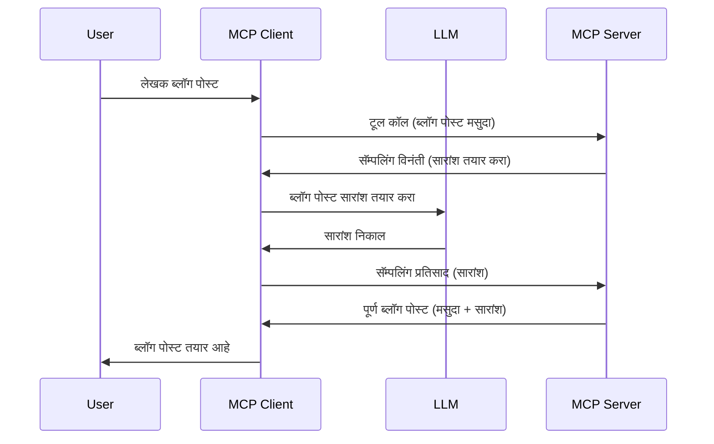

# सॅम्पलिंग - ग्राहकाला सुविधांचा प्रतिनिधीत्व देणे

कधी कधी, तुमच्याकडे MCP क्लायंट आणि MCP सर्व्हर एकत्र काम करावे लागते जेणेकरून ते सामान्य उद्दिष्ट साध्य करू शकतील. असे प्रकरण असू शकते जिथे सर्व्हरला क्लायंटवर असलेल्या LLM च्या मदतीची गरज असते. अशा परिस्थितीत, सॅम्पलिंग हे तुम्हाला वापरायचे आहे.

चला काही वापर प्रकरणे तपासूया आणि सॅम्पलिंग समाविष्ट असलेले एक उपाय कसा तयार करायचा ते पाहूया.

## आढावा

या धड्यात, आपण सॅम्पलिंग कधी आणि कुठे वापरायचे यावर लक्ष केंद्रित करू आणि ते कसे कॉन्फिगर करायचे ते समजावून सांगू.

## शिक्षण उद्दिष्टे

या प्रकरणात, आपण:

- सॅम्पलिंग म्हणजे काय आणि ते कधी वापरायचे हे स्पष्ट करू.
- MCP मध्ये सॅम्पलिंग कसे कॉन्फिगर करायचे ते दर्शवू.
- सॅम्पलिंगच्या वापराचे उदाहरणे देऊ.

## सॅम्पलिंग म्हणजे काय आणि का वापरायचे?

सॅम्पलिंग ही एक प्रगत सुविधा आहे जी खालील प्रकारे कार्य करते:



### सॅम्पलिंग विनंती

चला आता विश्वासार्ह परिस्थितीचा उंचीवरून आढावा घेतला आहे, तर सर्व्हर क्लायंटला पाठविलेली सॅम्पलिंग विनंती काय दिसू शकते ते पाहू. JSON-RPC स्वरूपात अशी विनंती कशी दिसू शकते:

```json
{
  "jsonrpc": "2.0",
  "id": 1,
  "method": "sampling/createMessage",
  "params": {
    "messages": [
      {
        "role": "user",
        "content": {
          "type": "text",
          "text": "Create a blog post summary of the following blog post: <BLOG POST>"
        }
      }
    ],
    "modelPreferences": {
      "hints": [
        {
          "name": "claude-3-sonnet"
        }
      ],
      "intelligencePriority": 0.8,
      "speedPriority": 0.5
    },
    "systemPrompt": "You are a helpful assistant.",
    "maxTokens": 100
  }
}
```

येथे खालील काही बाबी महत्त्वाच्या आहेत:

- प्रॉम्प्ट, content -> text अंतर्गत, हे आपले प्रॉम्प्ट आहे जे LLM ला ब्लॉग पोस्ट सामग्री सारांशित करण्यासाठी निर्देश देते.

- **modelPreferences**. हा विभाग फक्त तेच आहे, म्हणजे आवड, LLM सोबत कोणती कॉन्फिगरेशन वापरावी याची शिफारस. वापरकर्ता या शिफारशींचे पालन करु किंवा बदलू शकतो. या प्रकरणात वापरण्यासाठी मॉडेल आणि वेग आणि बुद्धिमत्तेची प्राधान्ये दिलेली आहेत.
- **systemPrompt** ही तुमची सामान्य सिस्टम प्रॉम्प्ट आहे जी तुमच्या LLM ला व्यक्तिमत्व देते आणि मार्गदर्शक सूचना समाविष्ट करते.
- **maxTokens** ही आणखी एक वैशिष्ट्य आहे जी या कामासाठी वापरण्याची शिफारस केलेले टोकन्स कसे आहेत हे सांगते.

### सॅम्पलिंग प्रतिसाद

हा प्रतिसाद MCP क्लायंट कडून MCP सर्व्हर कडे पाठवला जातो आणि हा क्लायंटचा LLM ला कॉल केल्यानंतरचा प्रतिसाद असतो, ज्याला वाट पाहून हा संदेश तयार केला जातो. JSON-RPC मध्ये हे कसे दिसू शकते:

```json
{
  "jsonrpc": "2.0",
  "id": 1,
  "result": {
    "role": "assistant",
    "content": {
      "type": "text",
      "text": "Here's your abstract <ABSTRACT>"
    },
    "model": "gpt-5",
    "stopReason": "endTurn"
  }
}
```

ध्यान द्या की प्रतिसाद ब्लॉग पोस्टचा सारांश आहे जसे आपण मागणी केली होती. तसेच वापरलेले `model` आपल्याला हवे होते त्या "claude-3-sonnet" पेक्षा "gpt-5" आहे. यामुळे दर्शविण्यात येते की वापरकर्ता त्याचा निर्णय बदलू शकतो आणि तुमची सॅम्पलिंग विनंती ही एक शिफारस आहे.

चला आता मुख्य प्रवाह समजून घेतल्यावर, आणि उपयोगी काम जसे की "ब्लॉग पोस्ट तयार करणे + सारांशित करणे" या साठी वापरणे पाहूया, तर ते कसे काम करेल ते पाहू.

### संदेश प्रकार

सॅम्पलिंग संदेश फक्त मजकूरापुरते मर्यादित नाहीत, तुम्ही प्रतिमा आणि ऑडिओ देखील पाठवू शकता. JSON-RPC कसा वेगळा दिसू शकतो ते पाहूया:

**मजकूर**

```json
{
  "type": "text",
  "text": "The message content"
}
```

**प्रतिमा सामग्री**

```json
{
  "type": "image",
  "data": "base64-encoded-image-data",
  "mimeType": "image/jpeg"
}
```

**ऑडिओ सामग्री**

```json
{
  "type": "audio",
  "data": "base64-encoded-audio-data",
  "mimeType": "audio/wav"
}
```

> नोट: सॅम्पलिंग बद्दल अधिक तपशीलवार माहिती साठी, पाहा [अधिकृत दस्तऐवज](https://modelcontextprotocol.io/specification/2025-11-25/client/sampling)

## क्लायंटमध्ये सॅम्पलिंग कसे कॉन्फिगर करावे

> टीप: जर तुम्ही फक्त सर्व्हर तयार करत असाल, तर येथे फारसे करायचे नसते.

क्लायंटमध्ये, तुम्हाला खालील सुविधेचे स्पष्टीकरण करावे लागेल:

```json
{
  "capabilities": {
    "sampling": {}
  }
}
```

त्यानंतर ते तुमचा निवडलेला क्लायंट सर्व्हरशी कनेक्ट होताना स्वीकारले जाईल.

## सॅम्पलिंगच्या उदाहरणात - ब्लॉग पोस्ट तयार करणे

चला सॅम्पलिंग सर्व्हर एकत्र करून पाहू, खालील क्रिया करावी लागतील:

1. सर्व्हरवर एक टूल तयार करा.
1. सांगितलेले टूल सॅम्पलिंग विनंती तयार करेल
1. टूल क्लायंटकडून सॅम्पलिंग विनंतीचे उत्तर येईपर्यंत थांबेल.
1. मग टूल परिणाम तयार करेल.

चला कोड टप्प्याटप्प्याने पाहू:

### -1- टूल तयार करा

**python**

```python
@mcp.tool()
async def create_blog(title: str, content: str, ctx: Context[ServerSession, None]) -> str:
    """Create a blog post and generate a summary"""

```

### -2- सॅम्पलिंग विनंती तयार करा

तुमचा टूल खालील कोडने विस्तारित करा:

**python**

```python
post = BlogPost(
        id=len(posts) + 1,
        title=title,
        content=content,
        abstract=""
    )

prompt = f"Create an abstract of the following blog post: title: {title} and draft: {content} "

result = await ctx.session.create_message(
        messages=[
            SamplingMessage(
                role="user",
                content=TextContent(type="text", text=prompt),
            )
        ],
        max_tokens=100,
)

```

### -3- प्रतिसादाची वाट पाहा व प्रतिसाद परत करा

**python**

```python
post.abstract = result.content.text

posts.append(post)

# पूर्ण उत्पादन परत करा
return json.dumps({
    "id": post.title,
    "abstract": post.abstract
})
```

### -4- पूर्ण कोड

**python**

```python
from starlette.applications import Starlette
from starlette.routing import Mount, Host

from mcp.server.fastmcp import Context, FastMCP

from mcp.server.session import ServerSession
from mcp.types import SamplingMessage, TextContent

import json


from uuid import uuid4
from typing import List
from pydantic import BaseModel


mcp = FastMCP("Blog post generator")

# app = FastAPI()

posts = []

class BlogPost(BaseModel):
    id: int
    title: str
    content: str
    abstract: str

posts: List[BlogPost] = []

@mcp.tool()
async def create_blog(title: str, content: str, ctx: Context[ServerSession, None]) -> str:
    """Create a blog post and generate a summary"""

    post = BlogPost(
        id=len(posts) + 1,
        title=title,
        content=content,
        abstract=""
    )

    prompt = f"Create an abstract of the following blog post: title: {title} and draft: {content} "

    result = await ctx.session.create_message(
        messages=[
            SamplingMessage(
                role="user",
                content=TextContent(type="text", text=prompt),
            )
        ],
        max_tokens=100,
    )

    post.abstract = result.content.text

    posts.append(post)

    # पूर्ण ब्लॉग पोस्ट परत करा
    return json.dumps({
        "id": post.title,
        "abstract": post.abstract
    })

if __name__ == "__main__":
    print("Starting server...")
    # mcp.run()
    mcp.run(transport="streamable-http")

# खालीलप्रमाणे app चालवा: python server.py
```

### -5- Visual Studio Code मध्ये याची चाचणी घेणे

Visual Studio Code मध्ये याची चाचणी घेण्यासाठी खालील करा:

1. टर्मिनलमध्ये सर्व्हर सुरू करा
1. *mcp.json* मध्ये त्याला जोडा (आणि ते सुरू असल्याची खात्री करा) उदा. खालीलप्रमाणे:

   ```json
   "servers": {
      "blog-server": {
        "type": "http",
        "url": "http://localhost:8000/mcp"
      }
   }
   ```

1. एक प्रॉम्प्ट टाइप करा:

   ```text
   create a blog post named "Where Python comes from", the content is "Python is actually named after Monty Python Flying Circus"
   ```

1. सॅम्पलिंग होऊ द्या. प्रथमवेळी तुम्ही याची चाचणी केल्यावर तुम्हाला एक अतिरिक्त डायलॉग दिसेल ज्याला तुम्हाला मान्यता द्यावी लागेल, नंतर तुम्हाला टूल चालवण्याचा सामान्य डायलॉग दिसेल.

1. परिणांम तपासा. तुम्हाला दोन्ही GitHub Copilot Chat मध्ये छान रेंडर केलेले परिणाम दिसतील आणि तुम्ही कच्च्या JSON प्रतिसादाचे निरीक्षण देखील करू शकता.

**बोनस**. Visual Studio Code टूलिंगमध्ये सॅम्पलिंगसाठी उत्कृष्ट समर्थन आहे. तुम्ही स्थापित केलेल्या सर्व्हरवरील सॅम्पलिंग प्रवेश पुढीलप्रमाणे कॉन्फिगर करू शकता:

1. विस्तार विभागाला भेट द्या.
1. "MCP SERVERS - INSTALLED" विभागात तुमच्या स्थापित सर्व्हरचा सेटिंग्ज चिह्न निवडा.
1 "Configure Model Access" निवडा, येथे तुम्ही सॅम्पलिंग करताना GitHub Copilot कोणती मॉडेल्स वापरू शकते ते निवडू शकता. "Show Sampling requests" निवडून अलीकडील सॅम्पलिंग विनंत्याही पाहू शकता.

## गृहकार्य

या गृहकार्यात, तुम्ही किंचित वेगळे सॅम्पलिंग तयार करणार आहात म्हणजे उत्पादन वर्णन तयार करण्यासाठी सॅम्पलिंग एकत्रीकरण तयार करणे. तुमचा परिदृश्य असा आहे:

**परिदृश्य**: ई-कॉमर्समधील बॅक ऑफिस कर्मचारीला मदत हवी आहे, उत्पादन वर्णने तयार करण्यात खूप वेळ जातो. त्यामुळे, तुम्हाला असा उपाय तयार करायचा आहे की साधन "create_product" या नावाने "title" आणि "keywords" या घटकांसह कॉल करता येईल आणि ते पूर्ण उत्पादन तयार करेल ज्यामध्ये "description" फील्ड क्लायंटच्या LLM ने भरलेले असेल.

टीप: आधी जे शिकले ते वापरून या सर्व्हरसाठी आणि त्याच्या टूलसाठी सॅम्पलिंग विनंती तयार करा.

## उपाय

[उपाय](./solution/README.md)

## मुख्य धडे

सॅम्पलिंग ही एक प्रभावी सुविधा आहे जी सर्व्हरला ग्राहकांकडे काम सोपविण्याची अनुमती देते जेव्हा त्याला LLM ची मदत हवी असते.

## पुढे काय

- [अध्यक्ष ४ - व्यावहारिक अंमलबजावणी](../../04-PracticalImplementation/README.md)

---

<!-- CO-OP TRANSLATOR DISCLAIMER START -->
**अस्वीकरण**:
हा दस्तऐवज AI भाषांतर सेवा [Co-op Translator](https://github.com/Azure/co-op-translator) चा वापर करून अनुवादित केला आहे. जरी आम्ही अचूकतेसाठी प्रयत्न करतो, तरी कृपया लक्षात घ्या की स्वयंचलित भाषांतरांमध्ये त्रुटी किंवा अचूकतेची कमतरता असू शकते. मूळ दस्तऐवज त्याच्या मूळ भाषेत अधिकृत स्रोत मानला पाहिजे. महत्त्वाची माहिती असल्यास, व्यावसायिक मानवी भाषांतराची शिफारस केली जाते. या भाषांतराच्या वापरामुळे उद्भवणाऱ्या कोणत्याही गैरसमज किंवा चुकीच्या अर्थलावणीसाठी आम्ही जबाबदार नाही.
<!-- CO-OP TRANSLATOR DISCLAIMER END -->