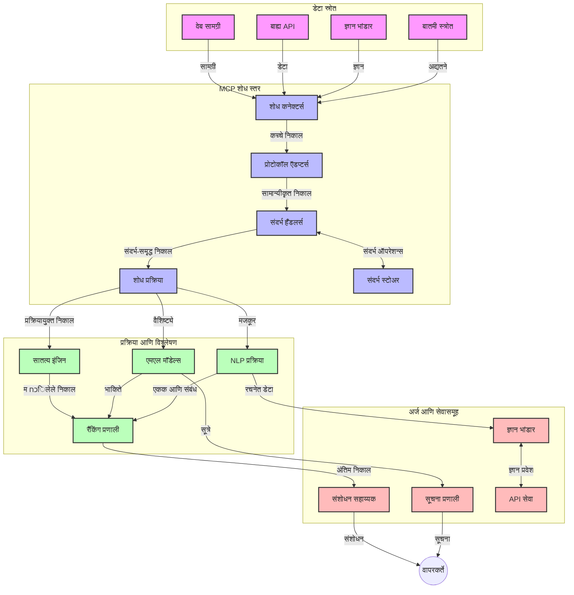
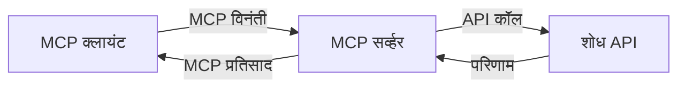
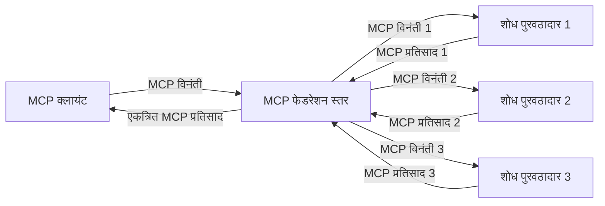
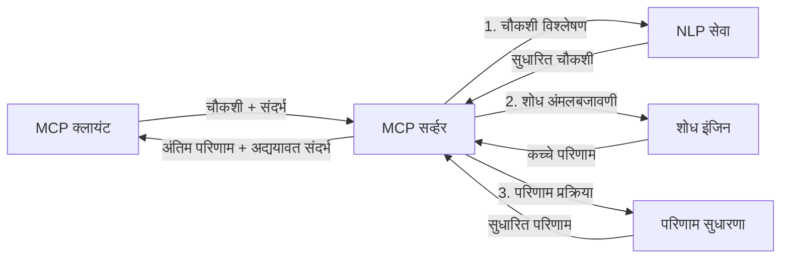

# रिअल-टाइम वेब शोधासाठी मॉडेल संदर्भ प्रोटोकॉल

## अभिप्राय

रिअल-टाइम वेब शोध आजच्या माहिती-आधारित वातावरणात अत्यावश्यक झाला आहे, जिथे एप्लिकेशन्सना इंटरनेटमधील अद्ययावत माहितीच्या त्वरित प्रवेशाची आवश्यकता असते जेणेकरून संबंधित आणि वेळेवर प्रत्युत्तर देता येतील. मॉडेल संदर्भ प्रोटोकॉल (MCP) हे या रिअल-टाइम शोध प्रक्रियांना अनुकूल करण्यासाठी एक महत्त्वपूर्ण प्रगती दर्शविते, शोध कार्यक्षमता वाढविते, संदर्भीय अखंडता राखते, आणि संपूर्ण प्रणालीच्या कार्यक्षमतेत सुधारणा करते.

हा मॉड्यूल MCP कसा रिअल-टाइम वेब शोधाला रूपांतरित करतो याचा अभ्यास करतो, AI मॉडेल्स, शोध इंजिन्स, आणि एप्लिकेशन्समधील संदर्भ व्यवस्थापनासाठी एक प्रमाणित दृष्टिकोन प्रदान करीत.

### तुम्हाला काय शिकायला मिळेल

या सर्वसमावेशक मार्गदर्शकात, तुम्ही शोधाल:

- MCP कसा AI मॉडेल्स आणि रिअल-टाइम वेब शोध क्षमतांदरम्यान अखंड पूल तयार करतो
- MCP सह कार्यक्षम आणि स्केलेबल शोध सोल्यूशन्स राबविण्यासाठी आर्किटेक्चरल नमुना
- एकाधिक क्वेरीज आणि संवादांद्वारे शोध संदर्भ राखण्याच्या तंत्रांचे वर्णन
- विविध शोध परिस्थितीसाठी Python आणि JavaScript मध्ये उपयुक्त कोड अंमलबजावणी
- MCP-संचालित शोध प्रणालींमध्ये संबंधीतता, अलीकडीलता, आणि कार्यक्षमता यांचे संतुलन साधण्याचे मार्ग

## रिअल-टाइम वेब शोधाची ओळख

रिअल-टाइम वेब शोध ही तंत्रज्ञानावर आधारित पद्धत आहे जी जिचे उद्दिष्ट प्रकाशित किंवा अद्ययावत होत असलेल्या वेब-आधारित माहितीवर सतत क्वेरी, प्रक्रिया, आणि विश्लेषण करण्याची क्षमता प्रदान करणे आहे, ज्यामुळे प्रणालींना ताजी आणि संबंधित माहिती अत्यल्प विलंबात प्रदान करता येते. पारंपरिक शोध प्रणालींपेक्षा, ज्या निर्देशांकित डेटावर कार्य करतात जे काही तास किंवा दिवस जुनी असू शकते, रिअल-टाइम शोध हे वेबमधील थेट डेटा प्रक्रिया करून ऑनलाईन सामग्रीच्या वर्तमान स्थितीचे प्रतिबिंब दर्शविते.

### रिअल-टाइम वेब शोधाचे मुख्य तत्त्वे:

- **सतत क्वेरी प्रक्रिया**: शोध क्वेरीज सतत अद्ययावत होणाऱ्या डेटा स्त्रोतांवर प्रक्रिया केल्या जातात
- **अलीकडीलतेला प्राधान्य**: प्रणाली ताजी माहिती प्राधान्य देण्याकरिता राबविल्या जातात
- **संबंधीतता संतुलन**: संबंधीतता आणि अलीकडीलतेमध्ये संतुलन राखणे
- **स्केलेबल आर्किटेक्चर**: प्रणाली विविध क्वेरी लोड आणि डेटा प्रमाण हाताळू शकतील
- **संदर्भीय समज**: एकाधिक शोध पुनरावृत्त्यांमध्ये वापरकर्ता संदर्भ राखणे महत्त्वाचे आहे
- **गतिशील क्वेरी पुनर्निर्मिती**: संदर्भ आणि पूर्वीच्या निकालांवर आधारित क्वेरी समायोजित करणे
- **बहु-स्त्रोत एकत्रिकरण**: अनेक शोध प्रदाते आणि वेब स्त्रोतांकडून निकाल एकत्र करणे
- **सामाजिक समज**: फक्त कीवर्डवर नाही, तर अर्थावर आधारित क्वेरी आणि सामग्री प्रक्रिया करणे
- **रिअल-टाइम रँकिंग**: नवीन माहिती उपलब्ध होताच निकाल रँकिंग सतत समायोजित करणे

### मॉडेल संदर्भ प्रोटोकॉल आणि रिअल-टाइम वेब शोध

मॉडेल संदर्भ प्रोटोकॉल (MCP) रिअल-टाइम वेब शोध वातावरणातील काही महत्त्वाच्या आव्हानांना सामोरे जातो:

1. **शोध संदर्भ संरक्षकता**: MCP वितरित शोध घटकांमधील संदर्भ कसा राखायचा यासाठी प्रमाणित करते, हे सुनिश्चित करते की AI मॉडेल्स आणि प्रक्रिया नोड्स संबंधित क्वेरी इतिहास आणि वापरकर्ता प्राधान्यांपर्यंत प्रवेश करू शकतात.

2. **कार्यक्षम क्वेरी व्यवस्थापन**: संदर्भ प्रसारणासाठी संरचित यंत्रणा प्रदान करून, MCP प्रत्येक शोध पुनरावृत्तीत संदर्भ पुनर्प्राप्तीचा ओवरहेड कमी करते.

3. **मध्यमत्व**: MCP वेगवेगळ्या शोध तंत्रज्ञान आणि AI मॉडेल्स दरम्यान संदर्भ सामायिकीकरणासाठी सर्वसामान्य भाषा तयार करते, ज्यामुळे अधिक लवचीक आणि विस्तृत आर्किटेक्चर सक्षम होतात.

4. **शोध-अनुकूलित संदर्भ**: MCP अमलात आणण्यामुळे कोणते संदर्भ घटक अत्यंत संबंधित आहेत हे प्राथमिक करा, कार्यक्षमता आणि अचूकतेसाठी अनुकूलित करा.

5. **अनुकूली शोध प्रक्रिया**: MCP द्वारे योग्य संदर्भ व्यवस्थापनाने, शोध प्रणाली वापरकर्त्यांच्या वाढती गरजा आणि माहितीच्या परिदृश्यानुसार प्रक्रिया गतिशीलपणे समायोजित करू शकतात.

समकालीन एप्लिकेशन्समध्ये, वृत्तसंस्था एकत्रीकरणापासून संशोधन सहाय्यकांपर्यंत, MCP चे वेब शोध तंत्रज्ञानांशी संयोजन अधिक हुशार, संदर्भ-सजग शोध सक्षम करते जो वापरकर्ता संवाद वाढताना अधिक संबंधित निकाल प्रदान करू शकतो.

## शिकण्याचे उद्दिष्ट

या धड्याच्या शेवटी, तुम्ही सक्षम असाल:

- समजणे की रिअल-टाइम वेब शोधाची मूलभूत तत्त्वे आणि आधुनिक एप्लिकेशन्समधील आव्हाने काय आहेत
- स्पष्ट करणे की मॉडेल संदर्भ प्रोटोकॉल (MCP) कसा रिअल-टाइम वेब शोध क्षमतांना सुधारतो
- लोकप्रिय फ्रेमवर्क आणि API वापरून MCP-आधारित शोध सोल्यूशन्स अंमलात आणणे
- MCP सह स्केलेबल, उच्च कार्यक्षमतेच्या शोध आर्किटेक्चर डिझाइन आणि परिनियोजन करणे
- MCP संकल्पना विविध उपयोग प्रकरणांमध्ये लागू करणे, ज्यात सामाजिक शोध, संशोधन सहाय्य, आणि AI-शक्तीशाली ब्राउझिंग यांचा समावेश आहे
- MCP-आधारित शोध तंत्रज्ञानातील उदयोन्मुख प्रवाह आणि भविष्यातील नवोन्मेषांचे मूल्यमापन करणे
- वापरकर्ता संवादातून शिकणाऱ्या संदर्भ-सजग शोध प्रणाली विकसित करणे
- प्रमाणित MCP प्रोटोकॉल वापरून AI सहाय्यकांमध्ये वेब शोध क्षमता एकत्र करणे
- संदर्भावर आधारित निकाल प्रगतपणे परिष्कृत करणाऱ्या बहु-टप्प्यांतील शोध पाईपलाइन तयार करणे
- संपूर्ण संदर्भ-जाणिव राखताना शोध कार्यक्षमता अनुकूलित करणे

### व्याख्या आणि महत्त्व

रिअल-टाइम वेब शोध म्हणजे वेब-आधारित माहिती सतत क्वेरी करणे, प्राप्त करणे, आणि अत्यल्प विलंबाने वितरण करणे. पारंपरिक शोध इंजिन जे वेब पुन:क्रॉल करतात व निर्देशांकित करतात, त्यापेक्षा वेगळे, रिअल-टाइम शोध सामग्री वेळीच उपलब्ध होताच त्याचे दर्शन घडविण्याचा प्रयत्न करतो, ज्यामुळे सर्वात ताज्या सामग्रीस त्वरित प्रवेश मिळतो.

रिअल-टाइम वेब शोधाचे मुख्य वैशिष्ट्ये:

- **ताजेपणा**: अलीकडील सामग्री आणि अद्यतने प्राधान्य देणे
- **सतत प्रक्रिया**: नवीन माहिती शोधण्यात सातत्य ठेवणे
- **क्वेरी अनुकूलन**: संदर्भ आणि प्रतिसादानुसार क्वेरीज परिष्कृत करणे
- **तत्काळ वितरण**: अत्यल्प विलंबात शोध निकाल प्रदान करणे
- **संदर्भ राखणे**: पूर्वीच्या क्वेरीजवर आधारित अधिक चांगले संबंधीतता निर्माण करणे

### पारंपरिक वेब शोधातील आव्हाने

पारंपरिक वेब शोध पद्धती रिअल-टाइम परिस्थितींवर लागू करताना अनेक मर्यादा येतात:

1. **संदर्भ तुटलेपणा**: एकाधिक क्वेरीजमध्ये शोध संदर्भ राखण्यात अडचण
2. **माहिती ताजेपणा**: सर्वात अलीकडील माहिती मिळवण्यात आणि प्राधान्य देण्यात आव्हाने
3. **एकत्रिकरण गुंतागुंत**: शोध प्रणाली आणि एप्लिकेशन्समधील मध्यमत्वातील समस्या
4. **विलंबाचे प्रश्न**: संपूर्ण शोध आणि प्रत्युत्तर वेळ यांच्यात संतुलन राखणे
5. **संबंधितता समायोजन**: अचूकता व संबंधितता राखताना अलीकडीलतेला प्राधान्य देणे

## शोधासाठी मॉडेल संदर्भ प्रोटोकॉल (MCP) समजून घेणे

### शोध संदर्भात MCP म्हणजे काय?

मॉडेल संदर्भ प्रोटोकॉल (MCP) हा प्रमाणित संवाद प्रोटोकॉल आहे जो AI मॉडेल्स आणि एप्लिकेशन्समधील कार्यक्षम संवाद सुलभ करण्यासाठी बनवलेला आहे. रिअल-टाइम वेब शोध संदर्भात, MCP प्रस्तुत करतो:

- क्वेरी साखळ्यादरम्यान शोध संदर्भ राखणे
- शोध क्वेरी आणि निकाल स्वरूप प्रमाणित करणे
- शोध पॅरामीटर्स आणि निकालांची प्रसारण क्रिया सुधारित करणे
- मॉडेल ते शोध इंजिन संवाद वाढवणे

### मुख्य घटक आणि आर्किटेक्चर

MCP आर्किटेक्चरमध्ये खालील प्रमुख घटक असतात:

1. **क्वेरी संदर्भ हाताळणारे**: अनेक क्वेरीजमध्ये शोध संदर्भ व्यवस्थापित करणे आणि राखणे
2. **शोध प्रक्रिया करणारे**: संदर्भ-सजग तंत्रांचा वापर करून येणाऱ्या शोध विनंत्या प्रक्रिया करणे
3. **प्रोटोकॉल अ‍ॅडॉप्टर्स**: भिन्न शोध API मध्ये बदल करणे पण संदर्भ राखणे
4. **संदर्भ साठवण**: शोध इतिहास आणि प्राधान्ये कार्यक्षमतेने साठवणे व पुनर्प्राप्त करणे
5. **शोध कनेक्टर्स**: विविध शोध इंजिन्स आणि वेब API शी जोडणी करणे



### MCP कसा रिअल-टाइम वेब शोध सुधारतो

MCP पारंपरिक वेब शोध आव्हानांवर मात करतो:

- **संदर्भ अखंडता**: संपूर्ण शोध सत्रादरम्यान क्वेरीज दरम्यान नाते राखणे
- **प्रसारण अनुकूलन**: बुद्धिमान संदर्भ व्यवस्थापनाद्वारे शोध पॅरामीटर्समधील पुनरावृत्ती कमी करणे
- **प्रमाणित इंटरफेस**: शोध घटकांसाठी सुसंगत API प्रदान करणे
- **कमी विलंब**: कार्यक्षम संदर्भ हाताळणीमुळे प्रक्रिया ओझे कमी करणे
- **संबंधितता वाढवणे**: अनेक क्वेरीज दरम्यान वापरकर्त्याचा हेतू राखून शोध संबंधित बनवणे

## समाकलन आणि अंमलबजावणी

रिअल-टाइम वेब शोध प्रणालींना कार्यक्षमता आणि संदर्भ अखंडता राखण्यासाठी काळजीपूर्वक आर्किटेक्चरल डिझाइन व अंमलबजावणीची गरज असते. मॉडेल संदर्भ प्रोटोकॉल AI मॉडेल्स आणि शोध तंत्रज्ञान एकत्र करण्यासाठी प्रमाणित दृष्टिकोन देते, ज्यामुळे अधिक प्रगत, संदर्भ-अनुकूल शोध पाईपलाइन पूर्ण करता येते.

### शोध आर्किटेक्चर्समधील MCP समाकलनाचा आढावा

रिअल-टाइम वेब शोध वातावरणात MCP ची अंमलबजावणी करताना काही महत्त्वाच्या बाबतींकडे लक्ष द्यावे लागते:

1. **शोध संदर्भ मालिका (Serialization)**: MCP शोध विनंत्यांमध्ये संदर्भ माहिती एन्कोड करण्यासाठी कार्यक्षम यंत्रणा प्रदान करते, जेणेकरून आवश्यक संदर्भ क्वेरी प्रक्रियेदरम्यान सोबत जातो. यात शोध-संबंधित मेटाडेटासाठी अनुकूलित प्रमाणित मालिका स्वरूपांचा समावेश होतो.

2. **राज्यपूर्ण शोध प्रक्रिया**: MCP सतत संदर्भाची सुसंगत मांडणी राखून अधिक बुद्धिमान राज्यपूर्ण प्रक्रिया सक्षम करते. हे बहु-टप्प्यांच्या शोध पाईपलाइनमध्ये परिणाम सुधारण्यासाठी विशेषतः उपयुक्त आहे.

3. **क्वेरी विस्तार व सुधारणा**: MCP अमलात आणल्याने, साठवलेल्या संदर्भावर आधारित क्लिष्ट क्वेरी विस्तार व सुधारणा करता येतात, ज्यामुळे शोध सत्र प्रगतीशीलपणे अधिक संबंधित निकाल देते.

4. **निकाल कॅशिंग आणि प्राधान्यक्रम**: संदर्भ हाताळणी प्रमाणीत केल्यामुळे, MCP निकाल कॅशिंग व प्राधान्यक्रम व्यवस्थापनात मदत करतो, ज्यामुळे घटक शोध संदर्भाच्या बदलांनुसार स्वतःला अनुकूल करू शकतात.

5. **शोध संघटन आणि संकलन**: MCP विविध बॅकएंडवर शोध संघटित करण्यासाठी अधिक प्रगत संघटन सुलभ करतो, संरचित संदर्भ प्रतिनिधित्वाद्वारे विविध स्त्रोतांचे अर्थपूर्ण संकलन शक्य होते.

विविध शोध तंत्रज्ञानांमध्ये MCP ची अंमलबजावणी संदर्भ व्यवस्थापनासाठी एकत्रित दृष्टिकोन तयार करते, ज्यामुळे सानुकूल समाकलन कोडची गरज कमी होते आणि शोध क्वेरी बदलताना अर्थपूर्ण संदर्भ राखण्याची प्रणालीची क्षमता वाढते.

### वेगवेगळ्या वेब शोध अंमलबजावणीत MCP

हे उदाहरणे वर्तमान MCP विनिर्देशनाचा अवलंब करतात जे JSON-RPC आधारित प्रोटोकॉलसह भिन्न वाहतूक यंत्रणा वापरते. कोड तुम्हाला MCP प्रोटोकॉलशी पूर्ण सुसंगतता राखत, कस्टम शोध समाकलने कशी करता येतील हे दर्शविते.


<details>
<summary>Generic Search API सह Python अंमलबजावणी</summary>

```python
import asyncio
import json
import aiohttp
from typing import Dict, Any, Optional, List
from contextlib import asynccontextmanager
from collections.abc import AsyncIterator

# मानक MCP लायब्ररी आयात करा
from mcp.client.session import ClientSession
from mcp.client.streamable_http import streamablehttp_client
from mcp.types import TextContent, CreateMessageRequestParams, CreateMessageResult
from mcp.server.fastmcp import FastMCP

# वेब शोधासाठी FastMCP सर्व्हर तयार करा
search_server = FastMCP("WebSearch")

# वेब शोध क्रियांना हाताळण्यासाठी वर्ग
class WebSearchHandler:
    def __init__(self, api_endpoint: str, api_key: str):
        self.api_endpoint = api_endpoint
        self.api_key = api_key
        self.session = None
        
    async def initialize(self):
        """Initialize the HTTP session"""
        self.session = aiohttp.ClientSession(
            headers={"Authorization": f"Bearer {self.api_key}"}
        )
    
    async def close(self):
        """Close the HTTP session"""
        if self.session:
            await self.session.close()
            
    async def perform_search(self, query: str, max_results: int = 5, 
                           include_domains: List[str] = None, 
                           exclude_domains: List[str] = None,
                           time_period: str = "any") -> Dict[str, Any]:
        """Perform web search using the search API"""
        # शोध पॅरामीटर्स तयार करा
        search_params = {
            "q": query,
            "limit": max_results,
            "time": time_period
        }
        
        if include_domains:
            search_params["site"] = ",".join(include_domains)
            
        if exclude_domains:
            search_params["exclude_site"] = ",".join(exclude_domains)
        
        # शोध विनंती करा
        try:
            async with self.session.get(
                self.api_endpoint,
                params=search_params
            ) as response:
                if response.status != 200:
                    error_text = await response.text()
                    raise Exception(f"Search API error: {response.status} - {error_text}")
                
                search_data = await response.json()
                
                # API-विशिष्ट प्रतिसादाला मानक स्वरूपात रूपांतरित करा
                results = []
                for item in search_data.get("results", []):
                    results.append({
                        "title": item.get("title", ""),
                        "url": item.get("url", ""),
                        "snippet": item.get("snippet", ""),
                        "date": item.get("published_date", ""),
                        "source": item.get("source", "")
                    })
                
                return {
                    "query": query,
                    "totalResults": len(results),
                    "results": results
                }
        except Exception as e:
            print(f"Search API request error: {e}")
            raise

# शोध हँडलर प्रारंभ करा
search_handler = WebSearchHandler(
    api_endpoint="https://api.search-service.example/search",
    api_key="your-api-key-here"
)

# शोध हँडलर व्यवस्थापित करण्यासाठी आयुष्यकाल सेट करा
@asyncio.asynccontextmanager
async def app_lifespan(server: FastMCP):
    """Manage application lifecycle"""
    await search_handler.initialize()
    try:
        yield {"search_handler": search_handler}
    finally:
        await search_handler.close()

# सर्व्हरसाठी आयुष्यकाल सेट करा
search_server = FastMCP("WebSearch", lifespan=app_lifespan)

# वेब शोध साधन नोंदणी करा
@search_server.tool()
async def web_search(query: str, max_results: int = 5, 
                   include_domains: List[str] = None,
                   exclude_domains: List[str] = None,
                   time_period: str = "any") -> Dict[str, Any]:
    """
    Search the web for information
    
    Args:
        query: The search query
        max_results: Maximum number of results to return (default: 5)
        include_domains: List of domains to include in search results
        exclude_domains: List of domains to exclude from search results
        time_period: Time period for results ("day", "week", "month", "any")
        
    Returns:
        Dictionary containing search results
    """
    ctx = search_server.get_context()
    search_handler = ctx.request_context.lifespan_context["search_handler"]
    
    results = await search_handler.perform_search(
        query=query,
        max_results=max_results,
        include_domains=include_domains,
        exclude_domains=exclude_domains,
        time_period=time_period
    )
    
    return results

# ग्राहक वापराचे उदाहरण
async def client_example():
    # Streamable HTTP ट्रान्सपोर्ट वापरून शोध सर्व्हरशी कनेक्ट करा
    async with streamablehttp_client("http://localhost:8000/mcp") as (read, write, _):
        async with ClientSession(read, write) as session:
            # कनेक्शन प्रारंभ करा
            await session.initialize()
            
            # वेब_search साधन कॉल करा
            search_results = await session.call_tool(
                "web_search", 
                {
                    "query": "latest developments in AI and Model Context Protocol",
                    "max_results": 5,
                    "time_period": "day",
                    "include_domains": ["github.com", "microsoft.com"]
                }
            )
            
            print(f"Search results: {search_results}")

# सर्व्हर अंमलबजावणीचे उदाहरण
if __name__ == "__main__":
    # Streamable HTTP ट्रान्सपोर्टसह सर्व्हर चालवा
    search_server.run(transport="streamable-http")
```
</details> 

<details>
<summary>Browser-Based Search सह JavaScript अंमलबजावणी</summary>

```javascript
// वेब शोधासाठी MCP सर्व्हर अंमलबजावणी
import { McpServer, ResourceTemplate } from '@modelcontextprotocol/sdk/server/mcp.js';
import { StreamableHTTPServerTransport } from '@modelcontextprotocol/sdk/server/streamableHttp.js';
import { z } from 'zod';

// वेब शोधासाठी MCP सर्व्हर तयार करा
const searchServer = new McpServer({
    name: "BrowserSearch",
    description: "A server that provides web search capabilities"
});

// शोध सेवा वर्ग
class SearchService {
    constructor(searchApiUrl, apiKey) {
        this.searchApiUrl = searchApiUrl;
        this.apiKey = apiKey;
    }

    async performSearch(parameters) {
        const {
            query = '',
            maxResults = 5,
            includeDomains = [],
            excludeDomains = [],
            timePeriod = 'any'
        } = parameters;
        
        // पॅरामीटर्ससह शोध URL तयार करा
        const url = new URL(this.searchApiUrl);
        url.searchParams.append('q', query);
        url.searchParams.append('limit', maxResults);
        url.searchParams.append('time', timePeriod);
        
        if (includeDomains.length > 0) {
            url.searchParams.append('site', includeDomains.join(','));
        }
        
        if (excludeDomains.length > 0) {
            url.searchParams.append('exclude_site', excludeDomains.join(','));
        }
        
        try {
            const response = await fetch(url.toString(), {
                method: 'GET',
                headers: {
                    'Authorization': `Bearer ${this.apiKey}`,
                    'Content-Type': 'application/json'
                }
            });
            
            if (!response.ok) {
                const errorText = await response.text();
                throw new Error(`Search API error: ${response.status} - ${errorText}`);
            }
            
            const searchData = await response.json();
            
            // API-विशिष्ट प्रतिसादाला एक सामान्य स्वरूपात रूपांतरित करा
            const results = searchData.results?.map(item => ({
                title: item.title || '',
                url: item.url || '',
                snippet: item.snippet || '',
                date: item.published_date || '',
                source: item.source || ''
            })) || [];
            
            return {
                query,
                totalResults: results.length,
                results
            };
        } catch (error) {
            console.error('Search API request error:', error);
            throw error;
        }
    }
}

// शोध सेवा प्रारंभ करा
const searchService = new SearchService(
    'https://api.search-service.example/search',
    'your-api-key-here'
);

// सर्व्हरसाठी संदर्भ प्रदाता सेटअप करा
searchServer.setContextProvider(() => {
    return {
        searchService
    };
});

// वेब शोध साधन नोंदणी करा
searchServer.tool({
    name: 'web_search',
    description: 'Search the web for information',
    parameters: {
        type: 'object',
        properties: {
            query: {
                type: 'string',
                description: 'The search query'
            },
            maxResults: {
                type: 'integer',
                description: 'Maximum number of results to return',
                default: 5
            },
            includeDomains: {
                type: 'array',
                items: { type: 'string' },
                description: 'List of domains to include in search results'
            },
            excludeDomains: {
                type: 'array',
                items: { type: 'string' },
                description: 'List of domains to exclude from search results'
            },
            timePeriod: {
                type: 'string',
                description: 'Time period for results',
                enum: ['day', 'week', 'month', 'any'],
                default: 'any'
            }
        },
        required: ['query']
    },
    handler: async (params, context) => {
        const { searchService } = context;
        return await searchService.performSearch(params);
    }
});

// शोध सर्व्हरशी कनेक्ट होण्यासाठी उदाहरण क्लायंट कोड
import { Client } from '@modelcontextprotocol/sdk/client/index.js';
import { StreamableHTTPClientTransport } from '@modelcontextprotocol/sdk/client/streamableHttp.js';

async function connectToSearchServer() {
    // शोध सर्व्हरशी कनेक्ट करा
    const transport = new StreamableHTTPClientTransport(
        new URL('http://localhost:8000/mcp')
    );
    
    const client = new Client({
        name: 'search-client',
        version: '1.0.0'
    });
    
    await client.connect(transport);
    
    // शोध साधन चालवा
    const searchResults = await client.callTool({
        name: 'web_search',
        arguments: {
            query: 'Model Context Protocol implementation examples',
            maxResults: 10,
            timePeriod: 'week',
            includeDomains: ['github.com', 'docs.microsoft.com']
        }
    });
    
    console.log('Search results:', searchResults);
    
    // साफसफाई करा
    await client.disconnect();
}

// सर्व्हर सुरू करा
const transport = new StreamableHTTPServerTransport();
await searchServer.connect(transport);
console.log('Search server running at http://localhost:8000/mcp');

// स्वतंत्र प्रक्रियेत किंवा सर्व्हर सुरू झाल्यानंतर
// connectToSearchServer().catch(console.error);
```
</details> 


## कोड उदाहरण दुरुस्ती

> **महत्त्वाची नोंद**: खालील कोड उदाहरणे मॉडेल संदर्भ प्रोटोकॉल (MCP) चे वेब शोध कार्यक्षमतेसह समाकलन दर्शवितात. जरी ते अधिकृत MCP SDK चे नमुने आणि रचना वापरतात, ते शैक्षणिक हेतूने सोपी केली आहेत.
> 
> या उदाहरणांमध्ये समाविष्ट आहे:
> 
> 1. **Python अंमलबजावणी**: FastMCP सर्व्हर अंमलबजावणी जी वेब शोध साधन पुरवते आणि बाह्य शोध API शी जोडते. हे उदाहरण योग्य आयुष्यकाल व्यवस्थापन, संदर्भ हाताळणी, आणि टूल प्रतिपादन यांचे आरंभी अतिरिक्त नमुने देते आणि [अधिकृत MCP Python SDK](https://github.com/modelcontextprotocol/python-sdk) च्या पॅटर्नचे पालन करते. सर्व्हर शिफारस केलेल्या Streamable HTTP वाहतुकीचा वापर करतो, जी जुन्या SSE वाहतुकीचा पर्याय असून उत्पादनासाठी उत्तम आहे.
> 
> 2. **JavaScript अंमलबजावणी**: FastMCP पॅटर्न वापरून TypeScript/JavaScript मध्ये शोध सर्व्हर तयार करणे, योग्य टूल परिभाषा व क्लायंट कनेक्शन्ससह [अधिकृत MCP TypeScript SDK](https://github.com/modelcontextprotocol/typescript-sdk) द्वारे. हे नवीनतम सत्र व्यवस्थापन आणि संदर्भ संरक्षित करण्याच्या नमुन्यांचे पालन करते.
> 
> उत्पादनासाठी अधिक त्रुटी हाताळणी, प्रमाणीकरण, आणि विशिष्ट API समाकलन कोड आवश्यक आहे. दिलेले शोध API एंडपॉइंट (`https://api.search-service.example/search`) ठेवीखाते आहेत व प्रत्यक्ष शोध सेवा ठिकाणाने बदलेले पाहिजे.
> 
> संपूर्ण अंमलबजावणी तपशील व नवीनतम दृष्टीकोनासाठी कृपया [अधिकृत MCP विनिर्देशन](https://spec.modelcontextprotocol.io/) आणि SDK दस्तऐवज पहा.

## मुख्य संकल्पना

### मॉडेल संदर्भ प्रोटोकॉल (MCP) फ्रेमवर्क

मूळ स्तरावर, मॉडेल संदर्भ प्रोटोकॉल AI मॉडेल्स, एप्लिकेशन्स, आणि सेवांमध्ये संदर्भ देवाण-घेवाण करण्याचा प्रमाणित मार्ग प्रदान करतो. रिअल-टाइम वेब शोधात, हा फ्रेमवर्क सुसंगत, बहु-चरण शोध अनुभव तयार करण्यासाठी आवश्यक आहे. मुख्य घटक समाविष्ट आहेत:

1. **क्लायंट-सर्व्हर आर्किटेक्चर**: MCP शोध क्लायंट (विनंती करणारे) आणि शोध सर्व्हर (पुरवठादार) यांच्यात स्पष्ट विभाजन करतो, लवचीक तैनाती मॉडेल्स सक्षम करतो.

2. **JSON-RPC संवाद**: प्रोटोकॉल JSON-RPC वापरतो, जे वेब तंत्रज्ञानांसोबत सुसंगत आहे आणि विविध प्लॅटफॉर्मवर सोपे आहे.

3. **संदर्भ व्यवस्थापन**: MCP अनेक संवादांमध्ये शोध संदर्भ राखणे, अद्यावत करणे, आणि वापरण्याच्या संरचित पद्धती परिभाषित करतो.

4. **टूल व्याख्या**: शोध क्षमता प्रमाणित टूल्स म्हणून उपलब्ध करतो ज्यांना अचूक पॅरामीटर्स आणि परतावा मूल्ये असतात.

5. **स्ट्रीमिंग समर्थन**: प्रोटोकॉल स्ट्रीमिंग निकालांना समर्थन देतो, जे रिअल-टाइम शोधासाठी अनिवार्य आहे जिथे निकाल क्रमाक्रमाने येतात.

### वेब शोध समाकलन नमुने

MCP वेब शोधासोबत जोडताना काही नमुने दिसून येतात:

#### 1. थेट शोध प्रदाता समाकलन



या नमुन्यात, MCP सर्व्हर थेट एक किंवा अधिक शोध API शी संवाद साधतो, MCP विनंत्या API-विशिष्ट कॉलमध्ये रूपांतरित करतो आणि निकाल MCP प्रतिसाद म्हणून फॉरमॅट करतो.

#### 2. संदर्भ संरक्षकासह संघटित शोध



हा नमुना MCP-सुसंगत अनेक शोध प्रदात्यांमध्ये क्वेरी वितरित करतो, प्रत्येक वेगळ्या प्रकारच्या सामग्री किंवा शोध क्षमता विशेष करून, परंतु एकसंध संदर्भ राखतो.

#### 3. संदर्भ-समृद्ध शोध साखळी



या नमुन्यामध्ये शोध प्रक्रिया अनेक टप्प्यांत विभागली आहे, ज्यामध्ये प्रत्येक टप्प्यावर संदर्भ समृद्ध केला जातो, परिणामी क्रमाक्रमाने अधिक संबंधित निकाल प्राप्त होतात.

### शोध संदर्भ घटक

MCP-आधारित वेब शोधात, संदर्भ सामान्यतः समाविष्ट असतो:

- **क्वेरी इतिहास**: सत्रातील पूर्वीचे शोध क्वेरीज
- **वापरकर्ता प्राधान्य**: भाषा, प्रदेश, सुरक्षित शोध सेटिंग्ज
- **परस्परसंवाद इतिहास**: कोणते निकाल क्लिक केले गेले, निकालांवर घालवलेला वेळ
- **शोध पॅरामीटर्स**: फिल्टर्स, क्रमवारी, आणि इतर शोध बदल
- **डोमेन ज्ञान**: शोधाशी संबंधित विषय-विशिष्ट संदर्भ
- **कालीन संदर्भ**: वेळ आधारित संबंधित घटक
- **स्त्रोत प्राधान्य**: विश्वासार्ह किंवा प्राधान्य दिलेले माहिती स्त्रोत

## उपयोग प्रकरणे आणि अनुप्रयोग

### संशोधन आणि माहिती संकलन

MCP संशोधन कार्यप्रवाह सुधारतो:

- संशोधन संदर्भ शोधन सत्रांमध्ये राखणे
- अधिक प्रगत आणि संदर्भ-संबंधित क्वेरीज सक्षम करणे
- बहु-स्त्रोत शोध संघटना समर्थन
- शोध निकालांमधून ज्ञान काढणे सुलभ करणे

### रिअल-टाइम न्यूज आणि ट्रेंड निरीक्षण

MCP-संचालित शोध बातम्या निरीक्षणासाठी फायदे देतो:

- उदयोन्मुख बातम्यांच्या जवळजवळ रिअल-टाइम शोध
- संबंधित माहिती संदर्भानुसार फिल्टर करणे
- अनेक स्त्रोतांमधून विषय आणि घटक ट्रॅक करणे
- वापरकर्ता संदर्भावर आधारित वैयक्तिकृत बातमी सूचना

### AI-आधारित ब्राउझिंग आणि संशोधन

MCP AI-आधारित ब्राउझिंगसाठी नवीन शक्यता निर्माण करतो:

- चालू ब्राउझर क्रियाकलापांवर आधारित संदर्भात्मक शोध सूचना
- LLM-शक्तीशाली सहाय्यकांसह वेब शोधाचे अखंड समाकलन
- बहु-चरण शोध पुन्हा सुधारणा संग्रहीत संदर्भांसह
- तथ्यतपासणी आणि माहिती प्रमाणीकरण वाढवणे

## भविष्यातील प्रवाह आणि नवोन्मेष

### वेब शोधात MCP चे विकास

पुढे पाहता, आम्ही अपेक्षा करतो की MCP पुढील बाबतींना हाताळण्यासाठी विकसित होईल:
- **मल्टिमोडल शोध**: संदर्भ जपून टेक्स्ट, प्रतिमा, ऑडिओ आणि व्हिडिओ शोध एकत्र करणे  
- **विकेंद्रित शोध**: वितरित आणि संघटित शोध परिसंस्थांना समर्थन देणे  
- **शोध गोपनीयता**: संदर्भ-जागरूक गोपनीयता राखणारी शोध यंत्रणा  
- **चौकशी समजणे**: नैसर्गिक भाषेतील शोध चौकशांची सखोल सैमान्टिक पार्सिंग  

### तंत्रज्ञानातील संभाव्य प्रगती

उभरत असलेले तंत्रज्ञान जे MCP शोधाच्या भविष्यात आकार देणार आहे:

1. **न्यूरल शोध आर्किटेक्चर**: MCP साठी एम्बेडिंग-आधारित शोध प्रणालींचे ऑप्टिमायझेशन  
2. **वैयक्तिकृत शोध संदर्भ**: वेळेनुसार वैयक्तिक वापरकर्त्याच्या शोध नमुन्यांचा अभ्यास  
3. **ज्ञान ग्राफ एकत्रीकरण**: क्षेत्रविशिष्ट ज्ञान ग्राफद्वारे संदर्भासह सुधारित शोध  
4. **क्रॉस-मोडल संदर्भ**: वेगवेगळ्या शोध प्रकारांमध्ये संदर्भ राखणे  

## व्यावहारिक सराव

### सराव 1: मूलभूत MCP शोध पाइपलाइन सेटअप करणे

या सरावात, आपण शिकाल:  
- मूलभूत MCP शोध वातावरण कसे कॉन्फिगर करायचे  
- वेब शोधासाठी संदर्भ हाताळणारे कसे अंमलात आणायचे  
- शोध पुनरावृत्ती दरम्यान संदर्भ जतन कसा करायचा याची चाचणी व पडताळणी  

### सराव 2: MCP शोधासह संशोधन सहाय्यक तयार करणे

पूर्ण अनुप्रयोग तयार करा जे:  
- नैसर्गिक भाषा संशोधन प्रश्न प्रक्रिया करतो  
- संदर्भ-जागरूक वेब शोध करतो  
- अनेक स्रोतांमधून माहिती एकत्र करतो  
- संघटित संशोधन निष्कर्ष सादर करतो  

### सराव 3: MCP सह बहु-स्रोत शोध संघटन राबवणे

उन्नत सराव ज्यामध्ये समाविष्ट आहे:  
- एकाधिक शोध इंजिनांना संदर्भ-जागरूक चौकशी प्रसारित करणे  
- निकालांचे क्रमांकन आणि एकत्रीकरण  
- शोध निकालांचे संदर्भानुसार पुनरावृत्ती न करता विलगीकरण  
- स्रोत-विशिष्ट मेटाडेटा हाताळणे  

## अतिरिक्त साधने

- [Model Context Protocol Specification](https://spec.modelcontextprotocol.io/) - अधिकृत MCP तपशील आणि सविस्तर प्रोटोकॉल दस्तऐवजीकरण  
- [Model Context Protocol Documentation](https://modelcontextprotocol.io/) - सविस्तर ट्युटोरियल्स आणि अंमलबजावणी मार्गदर्शक  
- [MCP Python SDK](https://github.com/modelcontextprotocol/python-sdk) - MCP प्रोटोकॉलची अधिकृत पाइथन अंमलबजावणी  
- [MCP TypeScript SDK](https://github.com/modelcontextprotocol/typescript-sdk) - MCP प्रोटोकॉलची अधिकृत टायपस्क्रिप्ट अंमलबजावणी  
- [MCP Reference Servers](https://github.com/modelcontextprotocol/servers) - MCP सर्व्हर्सची संदर्भ अंमलबजावणी  
- [Bing Web Search API Documentation](https://learn.microsoft.com/en-us/bing/search-apis/bing-web-search/overview) - मायक्रोसॉफ्टचा वेब शोध API  
- [Google Custom Search JSON API](https://developers.google.com/custom-search/v1/overview) - गुगलकडून प्रोग्रामेबल शोध इंजिन  
- [SerpAPI Documentation](https://serpapi.com/search-api) - शोध इंजिन निकाल पृष्ठ API  
- [Meilisearch Documentation](https://www.meilisearch.com/docs) - ओपन-सोर्स शोध इंजिन  
- [Elasticsearch Documentation](https://www.elastic.co/guide/index.html) - वितरित शोध व विश्लेषण इंजिन  
- [LangChain Documentation](https://python.langchain.com/docs/get_started/introduction) - LLM सह अनुप्रयोग तयार करणे  

## शिकण्याचे उद्दिष्टे

हा मॉड्यूल पूर्ण केल्यावर, आपण हे करू शकाल:  

- रिअल-टाइम वेब शोध आणि त्याच्या आव्हानांची मूलभूत समज प्राप्त करणे  
- Model Context Protocol (MCP) कसा रिअल-टाइम वेब शोध क्षमता वाढवतो हे समजावून सांगणे  
- लोकप्रिय फ्रेमवर्क आणि API वापरून MCP-आधारित शोध उपाय अंमलात आणणे  
- MCP सह स्केलेबल, उच्च-प्रदर्शन शोध आर्किटेक्चर डिझाइन आणि तैनात करणे  
- सैमान्टिक शोध, संशोधन सहाय्यक, आणि AI-ऑगमेंटेड ब्राउझिंग यांसारख्या विविध उपयोगांमध्ये MCP संकल्पना वापरणे  
- MCP-आधारित शोध तंत्रज्ञानातील उदयोन्मुख प्रवाह आणि भविष्यातील नवाचारांचे मूल्यमापन करणे  

### विश्वास आणि सुरक्षितता विचार

MCP-आधारित वेब शोध उपाय अंमलात आणताना, MCP तपशीलांतील खालील महत्त्वाचे नियम लक्षात ठेवा:  

1. **वापरकर्ता संमती आणि नियंत्रण**: वापरकर्त्यांनी सर्व डेटा प्रवेश आणि क्रियांची स्पष्ट संमती द्यावी आणि समजून घ्यावी. वेब शोधासाठी जेव्हा बाह्य डेटा स्रोत वापरले जातात तेव्हा हा मुद्दा अत्यंत महत्त्वाचा आहे.  

2. **डेटा गोपनीयता**: शोध चौकशी व निकालांची योग्य हाताळणी सुनिश्चित करा, विशेषतः जेव्हा संवेदनशील माहिती असू शकते. वापरकर्ता डेटाचे संरक्षण करण्यासाठी योग्य प्रवेश नियंत्रण लागू करा.  

3. **टूल सुरक्षितता**: शोध साधनांसाठी योग्य अधिकृतता व पडताळणी लागू करा, कारण ते मनमानी कोड अंमलबजावणीमुळे संभाव्य सुरक्षा धोके उपस्थित करू शकतात. टूलच्या वर्तनाचे वर्णन विश्वासार्ह स्रोतापासून मिळाले नाही तर ते अविश्वसनीय मानले पाहिजे.  

4. **स्पष्ट दस्तऐवजीकरण**: तुमच्या MCP-आधारित शोध अंमलबजावणीबाबत क्षमतां, मर्यादा आणि सुरक्षा मुद्द्यांचे स्पष्ट दस्तऐवजीकरण प्रदान करा, MCP तपशीलातील अंमलबजावणी मार्गदर्शकानुसार.  

5. **मजबूत संमतीचे फ्लो**: प्रत्येक टूल काय करते याचे स्पष्ट स्पष्टीकरण देऊन, विशेषतः जे बाह्य वेब संसाधनांशी संवाद साधतात, त्यांना अधिकृत करण्यापूर्वी मजबूत संमती आणि अधिकृतता प्रक्रिया तयार करा.  

MCP सुरक्षा आणि विश्वास विचारांबाबत संपूर्ण तपशीलांसाठी, [अधिकृत दस्तऐवज](https://modelcontextprotocol.io/specification/2025-11-25/basic/security_best_practices) पहा.  

## पुढे काय  

- [5.12 Entra ID Authentication for Model Context Protocol Servers](../mcp-security-entra/README.md)

---

<!-- CO-OP TRANSLATOR DISCLAIMER START -->
**अस्वीकरण**:
हा दस्तऐवज AI भाषांतर सेवा [Co-op Translator](https://github.com/Azure/co-op-translator) चा वापर करून अनुवादित केला आहे. जरी आम्ही अचूकतेसाठी प्रयत्न करतो, तरी कृपया लक्षात घ्या की स्वयंचलित भाषांतरांमध्ये त्रुटी किंवा अचूकतेची कमतरता असू शकते. मूळ दस्तऐवज त्याच्या मूळ भाषेत अधिकृत स्रोत मानला पाहिजे. महत्त्वाची माहिती असल्यास, व्यावसायिक मानवी भाषांतराची शिफारस केली जाते. या भाषांतराच्या वापरामुळे उद्भवणाऱ्या कोणत्याही गैरसमज किंवा चुकीच्या अर्थलावणीसाठी आम्ही जबाबदार नाही.
<!-- CO-OP TRANSLATOR DISCLAIMER END -->