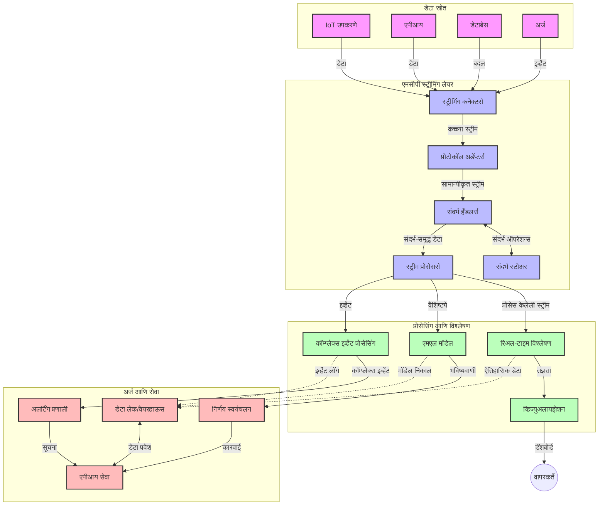

# वास्तविक वेळ डेटा स्ट्रिमिंगसाठी मॉडेल संदर्भ प्रोटोकॉल

## आढावा

वर्तमानाच्या डेटा-आधारित जगात वास्तविक वेळ डेटा स्ट्रिमिंग अनिवार्य झाले आहे, जिथे व्यवसाय आणि अनुप्रयोगांना वेळेवर निर्णय घेण्यासाठी त्वरित माहितीची गरज असते. मॉडेल संदर्भ प्रोटोकॉल (MCP) हे या वास्तविक वेळ स्ट्रिमिंग प्रक्रियांचा अनुकूलन करण्यामध्ये महत्वपूर्ण प्रगती दर्शवते, ज्यामुळे डेटा प्रक्रियेची कार्यक्षमता वाढते, संदर्भात्मक अखंडता राखली जाते आणि एकूण प्रणालीची कामगिरी सुधारली जाते.

हा मॉड्युल कसा MCP AI मॉडेल्स, स्ट्रिमिंग प्लेटफॉर्म आणि अनुप्रयोगांमध्ये संदर्भ व्यवस्थापनासाठी एक प्रमाणित दृष्टीकोन प्रदान करून वास्तविक वेळ डेटा स्ट्रिमिंगचे रूपांतर करतो याचा अभ्यास करतो.

## वास्तविक वेळ डेटा स्ट्रिमिंगचे परिचय

वास्तविक वेळ डेटा स्ट्रिमिंग हा एक तंत्रज्ञानाचा पैलू आहे जो डेटा सतत संपादित होतो, प्रक्रिया होतो आणि विश्लेषण होतो यास अनुमती देतो, ज्यामुळे प्रणाली नवीन माहितीवर त्वरित प्रतिसाद देऊ शकतात. पारंपरिक बॅच प्रक्रिया जे स्थिर डेटा संचांवर काम करते, त्याच्या विपरीत, स्ट्रिमिंग डेटा प्रवाहामध्ये काम करते, कमी विलंबाने अंतर्दृष्टी आणि क्रिया प्रदान करते.

### वास्तविक वेळ डेटा स्ट्रिमिंगचे मुख्य संकल्पना:

- **सतत डेटा प्रवाह**: डेटा सतत, कधीही थांबणार नसलेल्या घटनां किंवा नोंदींच्या प्रवाहाप्रमाणे प्रक्रिया होतो.
- **कमी विलंब प्रक्रिया**: डेटा निर्मिती आणि प्रक्रियेमध्ये वेळ कमी करण्यासाठी प्रणाली डिझाइन केल्या जातात.
- **वाढवण्याची क्षमता**: स्ट्रिमिंग आर्किटेक्चर्सना वेगवेगळ्या डेटा प्रमाण आणि गती हाताळावी लागते.
- **दोष सहिष्णुता**: डेटा प्रवाह निर्बाध राहण्यासाठी प्रणाली अपयश सहन करण्यायोग्य असल्या पाहिजेत.
- **स्थितीपूर्ण प्रक्रिया**: घटनांवर संदर्भ ठेवणे महत्त्वाचे आहे ज्यामुळे अर्थपूर्ण विश्लेषण शक्य होते.

### मॉडेल संदर्भ प्रोटोकॉल आणि वास्तविक वेळ स्ट्रिमिंग

मॉडेल संदर्भ प्रोटोकॉल (MCP) वास्तविक वेळ स्ट्रिमिंग वातावरणातील अनेक महत्वाच्या अडचणींचा सामना करतो:

1. **संदर्भात्मक अखंडता**: MCP वितरित स्ट्रिमिंग घटकांमध्ये संदर्भ कसा राखायचा याचे मानकीकरण करतो, ज्यामुळे AI मॉडेल्स आणि प्रक्रिया नोड्सना संबंधित ऐतिहासिक आणि पर्यावरणीय संदर्भ मिळतो.

2. **कार्यक्षम स्थिती व्यवस्थापन**: संदर्भ प्रसारणासाठी संरचित यंत्रणा प्रदान करून MCP स्ट्रीमिंग पाईपलाइनमधील स्थिती व्यवस्थापनाचा अधिक भार कमी करतो.

3. **सामंजस्यपूर्ण व्यवहार्यता**: MCP विविध स्ट्रिमिंग तंत्रज्ञान आणि AI मॉडेल्सदरम्यान संदर्भ शेअरिंगसाठी सामान्य भाषा तयार करतो, ज्यामुळे अधिक लवचिक आणि विस्तारयोग्य आर्किटेक्चर शक्य होते.

4. **स्ट्रिमिंगसाठी अनुकूल संदर्भ**: MCP अंमलबजावण्या वास्तविक वेळ निर्णय घेताना कोणता संदर्भ घटक महत्त्वाचा आहे हे प्राधान्य देऊ शकतात, ज्यामुळे कार्यक्षमता आणि अचूकता दोन्ही सुधारतात.

5. **अनुकूली प्रक्रिया**: MCP मार्गे योग्य संदर्भ व्यवस्थापनामुळे, स्ट्रिमिंग प्रणाली डेटा मध्ये उद्भवणाऱ्या स्थिती आणि नमुन्यांनुसार प्रक्रिया गतिशीलपणे समायोजित करू शकतात.

आधुनिक अनुप्रयोगांमध्ये, ज्यात IoT सेन्सर नेटवर्क्स पासून ते आर्थिक ट्रेडिंग प्लॅटफॉर्म पर्यंतचा समावेश आहे, MCP चा समावेश स्ट्रिमिंग तंत्रज्ञानांसह अधिक बुद्धिमान, संदर्भ-जाणणारी प्रक्रिया सक्षम करतो जी गुंतागुंतीच्या, विकसित होणाऱ्या परिस्थितींना वास्तविक वेळेत योग्य प्रतिसाद देऊ शकते.

## शिकण्याचे उद्दिष्ट

या धड्याच्या शेवटी, तुम्ही:

- वास्तविक वेळ डेटा स्ट्रिमिंग आणि त्याच्या अडचणी समजावून घेऊ शकाल
- मॉडेल संदर्भ प्रोटोकॉल (MCP) वास्तविक वेळ डेटा स्ट्रिमिंग कसा सुधारतो याचे नमूद करू शकाल
- Kafka आणि Pulsar सारख्या लोकप्रिय फ्रेमवर्कचा वापर करून MCP-आधारित स्ट्रिमिंग सोल्यूशन्स लागू करू शकाल
- MCP सह दोष सहिष्णू, उच्च-कार्यक्षम स्ट्रिमिंग आर्किटेक्चर डिझाइन आणि तैनात करू शकाल
- MCP संकल्पना IoT, आर्थिक ट्रेडिंग आणि AI-चालित विश्लेषण वापर प्रकरणांमध्ये लागू करू शकाल
- MCP-आधारित स्ट्रिमिंग तंत्रज्ञानातील उदयोन्मुख ट्रेंड्स आणि भविष्यातील नवकल्पना मूल्यांकन करू शकाल

### व्याख्या व महत्त्व

वास्तविक वेळ डेटा स्ट्रिमिंग म्हणजे कमी विलंबासह डेटा सतत निर्मिती, प्रक्रिया आणि वितरण. बॅच प्रक्रियेच्या विपरीत, जिथे डेटा समूहांमध्ये गोळा आणि प्रक्रिया केला जातो, स्ट्रिमिंग डेटा आगमनानुसार क्रमाने प्रक्रिया करून त्वरित अंतर्दृष्टी आणि क्रिया सक्षम करतो.

वास्तविक वेळ डेटा स्ट्रिमिंगच्या मुख्य वैशिष्ट्यांमध्ये समाविष्ट आहे:

- **कमी विलंब**: मिलीसेकंद ते सेकंदांच्या आत डेटा प्रक्रिया आणि विश्लेषण.
- **सतत प्रवाह**: विविध स्रोतांकडून डेटा अखंडपणे येतो.
- **तत्काल प्रक्रिया**: डेटा येताच विश्लेषण केले जाते, बॅचमध्ये नाही.
- **घटना-आधारित आर्किटेक्चर**: घटना घडल्यावर त्वरित प्रतिसाद.

### पारंपरिक डेटा स्ट्रिमिंग मधील अडचणी

पारंपरिक डेटा स्ट्रिमिंग पद्धतींना काही मर्यादा भेडसावतात:

1. **संदर्भ गमावणे**: वितरित प्रणालींमध्ये संदर्भ राखणे कठीण होते.
2. **वाढवण्याच्या समस्या**: उच्च-प्रमाण व उच्च-गती डेटा हाताळण्यात अडचणी.
3. **संघटनात्मक क्लिष्टता**: विविध प्रणालींमधील सामंजस्य राखण्यात त्रास.
4. **विलंब व्यवस्थापन**: प्रक्रियेसाठी थ्रूपुट आणि वेळ संतुलित करणे.
5. **डेटा सुसंगतता**: संपूर्ण प्रवाहात डेटा अचूक आणि पूर्ण ठेवल्याची खात्री करणे.

## मॉडेल संदर्भ प्रोटोकॉल (MCP) समजून घेणे

### MCP म्हणजे काय?

मॉडेल संदर्भ प्रोटोकॉल (MCP) एक प्रमाणित संवाद प्रोटोकॉल आहे जो AI मॉडेल्स आणि अनुप्रयोग यांच्यात कार्यक्षम संवाद सुलभ करण्यासाठी डिझाइन केला आहे. वास्तविक वेळ डेटा स्ट्रिमिंगच्या संदर्भात, MCP एक फ्रेमवर्क प्रदान करतो जे:

- डेटा पाईपलाइनमध्ये संदर्भ जपते
- डेटा देवाणघेवाण फार्मॅट्स प्रमाणित करते
- मोठ्या डेटा संचाच्या प्रेषणाचे सुधारीत संकलन करते
- मॉडेल-टू-मॉडेल आणि मॉडेल-टू-अप्लिकेशन संवाद वाढवते

### मुख्य घटक आणि आर्किटेक्चर

वास्तविक वेळ स्ट्रिमिंगसाठी MCP आर्किटेक्चरमध्ये खालील मुख्य घटक समाविष्ट आहेत:

1. **संदर्भ हँडलर्स**: स्ट्रिमिंग पाईपलाइनमध्ये संदर्भ माहिती व्यवस्थापित आणि राखतात.
2. **स्ट्रिम प्रक्रिया करणारे**: संदर्भ-ज्ञानयुक्त तंत्र वापरून येणाऱ्या डेटा स्ट्रिम्सची प्रक्रिया करतात.
3. **प्रोटोकॉल अ‍ॅडॉप्टर्स**: विविध स्ट्रिमिंग प्रोटोकॉल्स दरम्यान संदर्भ राखून रूपांतर करतात.
4. **संदर्भ संच**: संदर्भ माहिती कार्यक्षमपणे संग्रहित आणि पुनर्प्राप्त करतात.
5. **स्ट्रिमिंग कनेक्टर्स**: विविध स्ट्रिमिंग प्लॅटफॉर्म्सशी (Kafka, Pulsar, Kinesis, इ.) जोडतात.



### MCP कसे वास्तविक वेळ डेटा हाताळणी सुधारते

MCP पारंपरिक स्ट्रिमिंग अडचणींना खालीलप्रमाणे हाताळते:

- **संदर्भात्मक अखंडता**: संपूर्ण पाईपलाइनमधील डेटा पॉईंट्समधील संबंध टिकवून ठेवते.
- **सुधारित प्रेषण**: बुद्धिमान संदर्भ व्यवस्थापनाद्वारे डेटा देवाणघेवाणमधील पुनरावृत्ती कमी करते.
- **मानकीकृत इंटरफेसेस**: स्ट्रिमिंग घटकांसाठी सुसंगत API उपलब्ध करुन देते.
- **कमी विलंब**: कार्यक्षम संदर्भ हाताळणीने प्रक्रिया ओव्हरहेड कमी करते.
- **वाढवण्याची क्षमता वाढवते**: संदर्भ जपून आडवे विस्तार शक्य करतो.

## एकत्रीकरण आणि अंमलबजावणी

वास्तविक वेळ डेटा स्ट्रिमिंग सिस्टम्सना कार्यक्षमता आणि संदर्भात्मक अखंडता दोन्ही राखण्यासाठी सुज्ञ आर्किटेक्चरल डिझाइन व अंमलबजावणी आवश्यक आहे. मॉडेल संदर्भ प्रोटोकॉल AI मॉडेल्स आणि स्ट्रिमिंग तंत्रज्ञानांचे प्रमाणित एकत्रीकरण ऑफर करतो, ज्यामुळे अधिक सुसंस्कृत, संदर्भ-जाणणाऱ्या प्रक्रिया पाईपलाइन तयार होतात.

### स्ट्रिमिंग आर्किटेक्चरमध्ये MCP ची एकत्रीकरण झलक

वास्तविक वेळ स्ट्रिमिंगमध्ये MCP अंमलात आणताना काही महत्त्वाच्या बाबी लक्षात ठेवाव्या लागतात:

1. **संदर्भ सिरीयलायझेशन आणि ट्रान्सपोर्ट**: MCP संदर्भ माहिती प्रवाहित डेटा पॅकेट्समध्ये संरचित आणि कुशल रीतीने समाविष्ट करण्याची सुविधा देतो, ज्यामुळे आवश्यक संदर्भ संपूर्ण प्रक्रिया पाईपलाइनमध्ये पाठविला जातो. यात स्ट्रिमिंग ट्रान्सपोर्टसाठी ऑप्टिमाइझ्ड मानकीकृत सिरीयलायझेशन फॉरमॅट्स आहेत.

2. **स्थितीपूर्ण स्ट्रिम प्रक्रिया**: प्रसंस्करण नोड्समधील एकसारखा संदर्भ प्रतिनिधित्व राखून MCP अधिक बुद्धिमान स्थितीपूर्ण प्रक्रिया शक्य करते. हे विशेषतः वितरित स्ट्रिमिंग आर्किटेक्चर्समध्ये जिथे स्थिती व्यवस्थापन पारंपरिकपणे आव्हानात्मक आहे, तिथे उपयुक्त ठरते.

3. **इव्हेंट-टाइम विरुद्ध प्रक्रिया-टाइम**: घटना केव्हा घडल्या आणि केव्हा प्रक्रिया झाल्या यातील भेद करण्यासाठी MCP अंमलबजावणींना सामान्य अडचणीशी सामना करावा लागतो. प्रोटोकॉलमध्ये अशा कालिक संदर्भाचा समावेश करता येऊ शकतो जो इव्हेंट टाइम सेमँटिक्स राखतो.

4. **बॅकप्रेशर व्यवस्थापन**: संदर्भ हाताळणी प्रमाणित करून, MCP स्ट्रिमिंग सिस्टममध्ये बॅकप्रेशर व्यवस्थापित करण्यात मदत करतो, ज्यामुळे घटक त्यांच्या प्रक्रिया क्षमतेचा संवाद साधू शकतात आणि प्रवाह त्यानुसार समायोजित करतात.

5. **संदर्भ विंडोइंग आणि एकत्रीकरण**: MCP कालिक आणि सापेक्ष संदर्भांच्या संरचित प्रतिमा प्रदान करून अधिक सुसंस्कृत विंडोइंग ऑपरेशन्स सुलभ करतो, ज्यामुळे घटनांच्या प्रवाहांवर अर्थपूर्ण एकत्रीकरण करता येते.

6. **अख्ख्यांत अचूक प्रक्रिया**: स्ट्रिमिंग सिस्टम्समध्ये, जेथे अख्ख्यात एकदाच प्रक्रिया आवश्यक आहे, MCP अशा प्रक्रियेसाठी मेटाडेटा समाविष्ट करू शकतो ज्यायोगे वितरण घटकांमध्ये प्रक्रिया स्थिती ट्रॅक आणि सत्यापित करता येते.

MCP ची विविध स्ट्रिमिंग तंत्रज्ञानांमध्ये अंमलबजावणी संदर्भ व्यवस्थापनासाठी एकसंध दृष्टीकोन तयार करते, ज्यामुळे सानुकूल एकत्रीकरण कोडची गरज कमी होते तर प्रणाली डेटा पाईपलाइनमध्ये प्रवाहित होताना अर्थपूर्ण संदर्भ राखण्याची क्षमता वाढते.

### विविध डेटा स्ट्रिमिंग फ्रेमवर्क्समधील MCP

हे उदाहरणे सध्याच्या MCP तपशीलांचे पालन करतात जे JSON-RPC आधारित प्रोटोकॉल असून वेगळ्या ट्रान्सपोर्ट यंत्रणा वापरतात. कोड दाखवतो की कसे तुम्ही कस्टम ट्रान्सपोर्ट अंमलात आणू शकता जे Kafka आणि Pulsar सारख्या स्ट्रिमिंग प्लॅटफॉर्म्सशी एकत्रित होतात आणि MCP प्रोटोकॉलशी पूर्ण सुसंगत राहतात.

हे उदाहरणे दर्शवितात की कसे स्ट्रिमिंग प्लॅटफॉर्म्स MCP सोबत एकत्रित करून वास्तविक वेळ डेटा प्रक्रिया करू शकतात, जे MCP च्या मध्यवर्ती असलेल्या संदर्भ-जागरूकतेचे संरक्षण करतात. ही पध्दत जून 2025 पर्यंत उपलब्ध असलेल्या MCP तपशिलांचा नेमका प्रतिबिंब दाखवते.

MCP लोकप्रिय स्ट्रिमिंग फ्रेमवर्क्ससह एकत्रित करता येते जे खालीलप्रमाणे:

#### Apache Kafka चे एकत्रीकरण

```python
import asyncio
import json
from typing import Dict, Any, Optional
from confluent_kafka import Consumer, Producer, KafkaError
from mcp.client import Client, ClientCapabilities
from mcp.core.message import JsonRpcMessage
from mcp.core.transports import Transport

# MCP ला Kafka शी जोडण्याकरिता सानुकूल ट्रान्सपोर्ट वर्ग
class KafkaMCPTransport(Transport):
    def __init__(self, bootstrap_servers: str, input_topic: str, output_topic: str):
        self.bootstrap_servers = bootstrap_servers
        self.input_topic = input_topic
        self.output_topic = output_topic
        self.producer = Producer({'bootstrap.servers': bootstrap_servers})
        self.consumer = Consumer({
            'bootstrap.servers': bootstrap_servers,
            'group.id': 'mcp-client-group',
            'auto.offset.reset': 'earliest'
        })
        self.message_queue = asyncio.Queue()
        self.running = False
        self.consumer_task = None
        
    async def connect(self):
        """Connect to Kafka and start consuming messages"""
        self.consumer.subscribe([self.input_topic])
        self.running = True
        self.consumer_task = asyncio.create_task(self._consume_messages())
        return self
        
    async def _consume_messages(self):
        """Background task to consume messages from Kafka and queue them for processing"""
        while self.running:
            try:
                msg = self.consumer.poll(1.0)
                if msg is None:
                    await asyncio.sleep(0.1)
                    continue
                
                if msg.error():
                    if msg.error().code() == KafkaError._PARTITION_EOF:
                        continue
                    print(f"Consumer error: {msg.error()}")
                    continue
                
                # संदेश मूल्य JSON-RPC म्हणून पार्स करा
                try:
                    message_str = msg.value().decode('utf-8')
                    message_data = json.loads(message_str)
                    mcp_message = JsonRpcMessage.from_dict(message_data)
                    await self.message_queue.put(mcp_message)
                except Exception as e:
                    print(f"Error parsing message: {e}")
            except Exception as e:
                print(f"Error in consumer loop: {e}")
                await asyncio.sleep(1)
    
    async def read(self) -> Optional[JsonRpcMessage]:
        """Read the next message from the queue"""
        try:
            message = await self.message_queue.get()
            return message
        except Exception as e:
            print(f"Error reading message: {e}")
            return None
    
    async def write(self, message: JsonRpcMessage) -> None:
        """Write a message to the Kafka output topic"""
        try:
            message_json = json.dumps(message.to_dict())
            self.producer.produce(
                self.output_topic,
                message_json.encode('utf-8'),
                callback=self._delivery_report
            )
            self.producer.poll(0)  # कॉलबॅक ट्रिगर करा
        except Exception as e:
            print(f"Error writing message: {e}")
    
    def _delivery_report(self, err, msg):
        """Kafka producer delivery callback"""
        if err is not None:
            print(f'Message delivery failed: {err}')
        else:
            print(f'Message delivered to {msg.topic()} [{msg.partition()}]')
    
    async def close(self) -> None:
        """Close the transport"""
        self.running = False
        if self.consumer_task:
            self.consumer_task.cancel()
            try:
                await self.consumer_task
            except asyncio.CancelledError:
                pass
        self.consumer.close()
        self.producer.flush()

# Kafka MCP ट्रान्सपोर्टचा उदाहरण वापर
async def kafka_mcp_example():
    # Kafka ट्रान्सपोर्टसह MCP क्लायंट तयार करा
    client = Client(
        {"name": "kafka-mcp-client", "version": "1.0.0"},
        ClientCapabilities({})
    )
    
    # Kafka ट्रान्सपोर्ट तयार करा आणि कनेक्ट करा
    transport = KafkaMCPTransport(
        bootstrap_servers="localhost:9092",
        input_topic="mcp-responses",
        output_topic="mcp-requests"
    )
    
    await client.connect(transport)
    
    try:
        # MCP सत्र प्रारंभ करा
        await client.initialize()
        
        # MCP द्वारे टूल चालवण्याचा उदाहरण
        response = await client.execute_tool(
            "process_data",
            {
                "data": "sample data",
                "metadata": {
                    "source": "sensor-1",
                    "timestamp": "2025-06-12T10:30:00Z"
                }
            }
        )
        
        print(f"Tool execution response: {response}")
        
        # स्वच्छ शटडाउन
        await client.shutdown()
    finally:
        await transport.close()

# उदाहरण चालवा
if __name__ == "__main__":
    asyncio.run(kafka_mcp_example())
```

#### Apache Pulsarची अंमलबजावणी

```python
import asyncio
import json
import pulsar
from typing import Dict, Any, Optional
from mcp.core.message import JsonRpcMessage
from mcp.core.transports import Transport
from mcp.server import Server, ServerOptions
from mcp.server.tools import Tool, ToolExecutionContext, ToolMetadata

# पल्पसर वापरणारा सानुकूल MCP ट्रान्सपोर्ट तयार करा
class PulsarMCPTransport(Transport):
    def __init__(self, service_url: str, request_topic: str, response_topic: str):
        self.service_url = service_url
        self.request_topic = request_topic
        self.response_topic = response_topic
        self.client = pulsar.Client(service_url)
        self.producer = self.client.create_producer(response_topic)
        self.consumer = self.client.subscribe(
            request_topic,
            "mcp-server-subscription",
            consumer_type=pulsar.ConsumerType.Shared
        )
        self.message_queue = asyncio.Queue()
        self.running = False
        self.consumer_task = None
    
    async def connect(self):
        """Connect to Pulsar and start consuming messages"""
        self.running = True
        self.consumer_task = asyncio.create_task(self._consume_messages())
        return self
    
    async def _consume_messages(self):
        """Background task to consume messages from Pulsar and queue them for processing"""
        while self.running:
            try:
                # टाइमआउटसह नॉन-ब्लॉकिंग रीसिव्ह
                msg = self.consumer.receive(timeout_millis=500)
                
                # संदेश प्रक्रिया करा
                try:
                    message_str = msg.data().decode('utf-8')
                    message_data = json.loads(message_str)
                    mcp_message = JsonRpcMessage.from_dict(message_data)
                    await self.message_queue.put(mcp_message)
                    
                    # संदेशाची मान्यता द्या
                    self.consumer.acknowledge(msg)
                except Exception as e:
                    print(f"Error processing message: {e}")
                    # त्रुटी असल्यास नकारात्मक मान्यता द्या
                    self.consumer.negative_acknowledge(msg)
            except Exception as e:
                # टाइमआउट किंवा इतर अपवाद हाताळा
                await asyncio.sleep(0.1)
    
    async def read(self) -> Optional[JsonRpcMessage]:
        """Read the next message from the queue"""
        try:
            message = await self.message_queue.get()
            return message
        except Exception as e:
            print(f"Error reading message: {e}")
            return None
    
    async def write(self, message: JsonRpcMessage) -> None:
        """Write a message to the Pulsar output topic"""
        try:
            message_json = json.dumps(message.to_dict())
            self.producer.send(message_json.encode('utf-8'))
        except Exception as e:
            print(f"Error writing message: {e}")
    
    async def close(self) -> None:
        """Close the transport"""
        self.running = False
        if self.consumer_task:
            self.consumer_task.cancel()
            try:
                await self.consumer_task
            except asyncio.CancelledError:
                pass
        self.consumer.close()
        self.producer.close()
        self.client.close()

# प्रवाहित डेटा प्रक्रिया करणारा नमुना MCP साधन परिभाषित करा
@Tool(
    name="process_streaming_data",
    description="Process streaming data with context preservation",
    metadata=ToolMetadata(
        required_capabilities=["streaming"]
    )
)
async def process_streaming_data(
    ctx: ToolExecutionContext,
    data: str,
    source: str,
    priority: str = "medium"
) -> Dict[str, Any]:
    """
    Process streaming data while preserving context
    
    Args:
        ctx: Tool execution context
        data: The data to process
        source: The source of the data
        priority: Priority level (low, medium, high)
        
    Returns:
        Dict containing processed results and context information
    """
    # MCP संदर्भाचा वापर करून उदाहरण प्रक्रिया
    print(f"Processing data from {source} with priority {priority}")
    
    # MCP मधून संभाषण संदर्भ प्रवेश करा
    conversation_id = ctx.conversation_id if hasattr(ctx, 'conversation_id') else "unknown"
    
    # सुधारित संदर्भासह निकाल परत करा
    return {
        "processed_data": f"Processed: {data}",
        "context": {
            "conversation_id": conversation_id,
            "source": source,
            "priority": priority,
            "processing_timestamp": ctx.get_current_time_iso()
        }
    }

# पल्पसर ट्रान्सपोर्ट वापरून उदाहरण MCP सर्व्हर अंमलबजावणी
async def run_mcp_server_with_pulsar():
    # MCP सर्व्हर तयार करा
    server = Server(
        {"name": "pulsar-mcp-server", "version": "1.0.0"},
        ServerOptions(
            capabilities={"streaming": True}
        )
    )
    
    # आमचे साधन नोंदणी करा
    server.register_tool(process_streaming_data)
    
    # पल्पसर ट्रान्सपोर्ट तयार करा आणि कनेक्ट करा
    transport = PulsarMCPTransport(
        service_url="pulsar://localhost:6650",
        request_topic="mcp-requests",
        response_topic="mcp-responses"
    )
    
    try:
        # पल्पसर ट्रान्सपोर्टसह सर्व्हर सुरू करा
        await server.run(transport)
    finally:
        await transport.close()

# सर्व्हर चालवा
if __name__ == "__main__":
    asyncio.run(run_mcp_server_with_pulsar())
```

### तैनातीसाठी सर्वोत्तम पद्धती

MCP वास्तविक वेळ स्ट्रिमिंगमध्ये अंमलात आणताना:

1. **दोष सहिष्णुतेसाठी डिझाइन करा**:
   - योग्य त्रुटी हाताळणी अंमलात आणा
   - अपयशी संदेशांसाठी मृत-पत्र पात्र वापरा
   - अंतिम प्रक्रियाकारक तयार करा

2. **कार्यक्षमतेसाठी ऑप्टिमाइझ करा**:
   - योग्य बफर आकार कॉन्फिगर करा
   - योग्य ठिकाणी गुच्छित प्रक्रिया वापरा
   - बॅकप्रेशर यंत्रणा लागू करा

3. **निगराणी आणि निरीक्षण करा**:
   - स्ट्रिम प्रक्रिया मेट्रिक्स ट्रॅक करा
   - संदर्भ प्रसारण निरीक्षण करा
   - अपवादांसाठी अलर्ट सेट करा

4. **तुमच्या स्ट्रिम्सची सुरक्षा करा**:
   - संवेदनशील डेटासाठी एन्क्रिप्शन अंमलात आणा
   - प्रमाणीकरण आणि अधिकृतता वापरा
   - योग्य प्रवेश नियंत्रण लागू करा


### IoT आणि एज कंप्यूटिंगमध्ये MCP

MCP IoT स्ट्रिमिंग बरोबर खालील सुविधा वाढवतो:

- प्रक्रिया पाईपलाइनमध्ये डिव्हाइस संदर्भ जपणे
- कार्यक्षम एज-टू-क्लाउड डेटा स्ट्रिमिंग सक्षम करणे
- IoT डेटा स्ट्रिम्सवर वास्तविक वेळ विश्लेषण
- संदर्भासह डिव्हाइस-टू-डिव्हाइस संवाद सुलभ करणे

उदाहरण: स्मार्ट सिटी सेन्सर नेटवर्क्स
```
Sensors → Edge Gateways → MCP Stream Processors → Real-time Analytics → Automated Responses
```

### आर्थिक व्यवहार आणि उच्च-गुणवतंत्र ट्रेडिंगमधील भूमिका

MCP आर्थिक डेटा स्ट्रिमिंगसाठी महत्त्वपूर्ण फायदे प्रदान करतो:

- ट्रेडिंग निर्णयांसाठी अतितयल विलंब प्रक्रिया
- संपूर्ण प्रक्रियेदरम्यान व्यवहार संदर्भ राखणे
- संदर्भात्मक जाणीव असलेल्या क्लिष्ट घटना प्रक्रिया समर्थन
- वितरित ट्रेडिंग सिस्टममधील डेटा सुसंगतता सुनिश्चित करणे

### AI-चालित डेटा विश्लेषण सुधारणा

MCP स्ट्रिमिंग विश्लेषणासाठी नवीन शक्यता तयार करतो:

- वास्तविक वेळ मॉडेल प्रशिक्षण आणि अनुमान
- स्ट्रिमिंग डेटा कडून सतत शिक्षण
- संदर्भ-जाणणारा वैशिष्ट्य काढणे
- संदर्भ जतन करून बहु-मॉडेल अनुमान पाईपलाइन

## भविष्यातील ट्रेंड्स आणि नवकल्पना

### वास्तविक वेळ वातावरणांमध्ये MCP चे उत्क्रांती

आम्हाला अपेक्षा आहे की MCP खालील क्षेत्रांमध्ये विकास करेल:

- **क्वांटम संगणक एकत्रीकरण**: क्वांटम-आधारित स्ट्रिमिंग सिस्टम्ससाठी तयारी करणे
- **एज-नेटिव्ह प्रक्रिया**: अधिक संदर्भ-जाणणी प्रक्रिया एज उपकरणांवर हलवणे
- **स्वयंचलित स्ट्रिमिंग व्यवस्थापन**: स्वयं-अनुकूल स्ट्रिमिंग पाईपलाइन
- **फेडरेटेड स्ट्रिमिंग**: गोपनीयता राखून वितरित प्रक्रिया

### तंत्रज्ञानातील संभाव्य प्रगती

भविष्यात MCP स्ट्रिमिंगला आकार देणारी उदयोन्मुख तंत्रज्ञान:

1. **AI-ऑप्टिमाइझ्ड स्ट्रिमिंग प्रोटोकॉल्स**: AI कार्यभारांसाठी खास डिझाइन केलेले प्रोटोकॉल.
2. **न्यूरोमॉर्फिक संगणक एकत्रीकरण**: मेंदूच्या प्रेरणेसारखे संगणन स्ट्रिम प्रक्रियेसाठी.
3. **सर्व्हरलेस स्ट्रिमिंग**: इन्फ्रास्ट्रक्चर व्यवस्थापनाशिवाय घटना-चालित, स्केलेबल स्ट्रिमिंग.
4. **वितरित संदर्भ संच**: जागतिक स्तरावर वितरित, तरीही अत्यंत सुसंगत संदर्भ व्यवस्थापन.

## व्यावहारिक सराव

### सराव 1: मूलभूत MCP स्ट्रिमिंग पाईपलाइन तयार करणे

या सरावात, तुम्ही शिकाल:

- साधा MCP स्ट्रिमिंग वातावरण कॉन्फिगर करणे
- स्ट्रिम प्रक्रिया करण्यासाठी संदर्भ हँडलर्स अंमलात आणणे
- संदर्भ जपण्याची चाचणी आणि पडताळणी करणे

### सराव 2: वास्तविक वेळ विश्लेषण डॅशबोर्ड तयार करणे

पूर्ण अनुप्रयोग तयार करा जे:

- MCP वापरून डेटा स्ट्रिम स्वीकारतो
- संदर्भ राखत स्ट्रिम प्रक्रिया करतो
- वास्तविक वेळेत निकालांचे दृश्य प्रदान करतो

### सराव 3: MCP सह क्लिष्ट घटना प्रक्रिया अंमलात आणणे

प्रगत सराव ज्यामध्ये:

- स्ट्रिममध्ये नमुने शोधणे
- अनेक स्ट्रिमवर संदर्भात्मक सहसंबंध
- जपलेला संदर्भ असलेल्या क्लिष्ट घटना निर्माण करणे

## अतिरिक्त संसाधने

- [Model Context Protocol Specification](https://modelcontextprotocol.io) - अधिकृत MCP तपशील आणि दस्तऐवजीकरण
- [Apache Kafka Documentation](https://kafka.apache.org/documentation/) - स्ट्रिम प्रक्रिया साठी Kafka बद्दल शिका
- [Apache Pulsar](https://pulsar.apache.org/) - एकात्मिक संदेशवहन आणि स्ट्रिमिंग प्लॅटफॉर्म
- [Streaming Systems: The What, Where, When, and How of Large-Scale Data Processing](https://www.oreilly.com/library/view/streaming-systems/9781491983867/) - स्ट्रिमिंग आर्किटेक्चर्सवर सविस्तर पुस्तक
- [Microsoft Azure Event Hubs](https://learn.microsoft.com/azure/event-hubs/event-hubs-about) - व्यवस्थापित इव्हेंट स्ट्रिमिंग सेवा
- [MLflow Documentation](https://mlflow.org/docs/latest/index.html) - ML मॉडेल ट्रॅकिंग आणि तैनातीसाठी
- [Real-Time Analytics with Apache Storm](https://storm.apache.org/releases/current/index.html) - वास्तविक वेळ संगणनेची प्रक्रिया फ्रेमवर्क
- [Flink ML](https://nightlies.apache.org/flink/flink-ml-docs-master/) - Apache Flink साठी मशीन लर्निंग लायब्ररी
- [LangChain Documentation](https://python.langchain.com/docs/get_started/introduction) - LLMs सह अनुप्रयोग तयार करणे

## शिकण्याचे परिणाम

हा मॉड्युल पूर्ण केल्यावर, तुम्ही:

- वास्तविक वेळ डेटा स्ट्रिमिंगच्या मूलभूत तत्वे आणि अडचणी समजून घेतील
- मॉडेल संदर्भ प्रोटोकॉल (MCP) वास्तविक वेळ डेटा स्ट्रिमिंग कसे सुधारतो ते स्पष्ट करू शकतील
- Kafka आणि Pulsar सारख्या लोकप्रिय फ्रेमवर्कचा वापर करून MCP-आधारित स्ट्रिमिंग सोल्यूशन्स लागू करू शकतील
- MCP सह दोष-तयार, उच्च कार्यक्षम स्ट्रिमिंग आर्किटेक्चर डिझाइन आणि तैनात करू शकतील
- MCP संकल्पना IoT, आर्थिक ट्रेडिंग आणि AI-चालित विश्लेषण वापर प्रकरणांमध्ये लागू करू शकतील
- MCP-आधारित स्ट्रिमिंग तंत्रज्ञानातील उदयोन्मुख ट्रेंड्स आणि भविष्यातील नवकल्पना मूल्यांकन करू शकतील

## पुढे काय

- [5.11 Realtime Search](../mcp-realtimesearch/README.md)

---

<!-- CO-OP TRANSLATOR DISCLAIMER START -->
**अस्वीकरण**:
हा दस्तऐवज AI भाषांतर सेवा [Co-op Translator](https://github.com/Azure/co-op-translator) चा वापर करून अनुवादित केला आहे. जरी आम्ही अचूकतेसाठी प्रयत्न करतो, तरी कृपया लक्षात घ्या की स्वयंचलित भाषांतरांमध्ये त्रुटी किंवा अचूकतेची कमतरता असू शकते. मूळ दस्तऐवज त्याच्या मूळ भाषेत अधिकृत स्रोत मानला पाहिजे. महत्त्वाची माहिती असल्यास, व्यावसायिक मानवी भाषांतराची शिफारस केली जाते. या भाषांतराच्या वापरामुळे उद्भवणाऱ्या कोणत्याही गैरसमज किंवा चुकीच्या अर्थलावणीसाठी आम्ही जबाबदार नाही.
<!-- CO-OP TRANSLATOR DISCLAIMER END -->