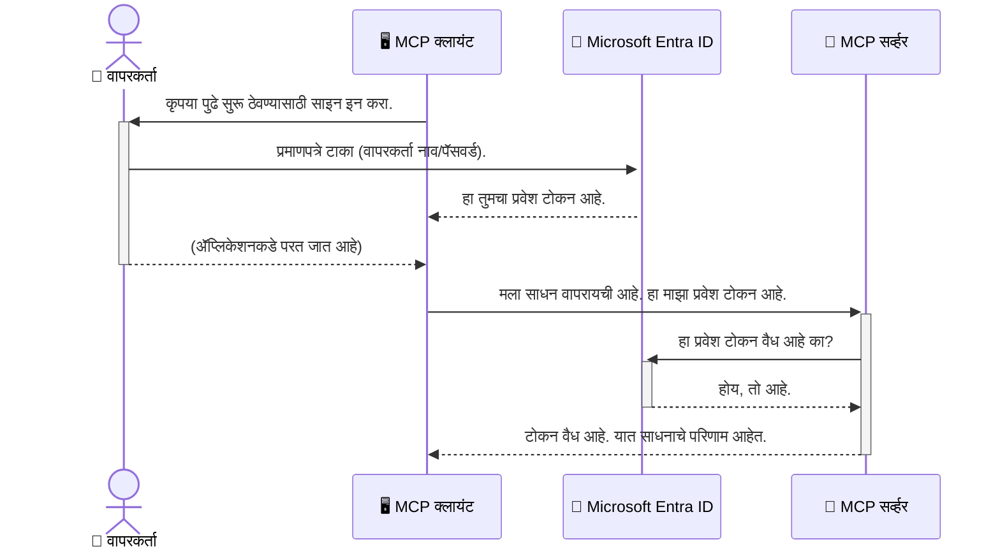

# AI कार्यप्रवाह सुरक्षित करणे: मॉडेल कॉन्टेक्स्ट प्रोटोकॉल सर्व्हर साठी Entra ID प्रमाणीकरण

## परिचय
तुमच्या मॉडेल कॉन्टेक्स्ट प्रोटोकॉल (MCP) सर्व्हरचे सुरक्षित करणे हे घराच्या पुढल्या दरवाजाला लॉक करण्याइतकेच महत्त्वपूर्ण आहे. तुमचा MCP सर्व्हर उघडा सोडल्यास तुमची साधने आणि डेटा अनधिकृत प्रवेशासाठी खुले होतो, ज्यामुळे सुरक्षा भंग होऊ शकतात. Microsoft Entra ID एक बलशाली क्लाउड-आधारित ओळख आणि प्रवेश व्यवस्थापन समाधान आहे, जे सुनिश्चित करते की केवळ अधिकृत वापरकर्ते आणि अनुप्रयोगच तुमच्या MCP सर्व्हरशी संवाद साधू शकतील. या विभागात, तुम्हाला Entra ID प्रमाणीकरण वापरून तुमचे AI कार्यप्रवाह कसे सुरक्षित करायचे हे शिकता येईल.

## शिकण्याचे उद्दिष्ट
या विभागाच्या शेवटी, तुम्ही सक्षम असाल:

- MCP सर्व्हर्स सुरक्षित करण्याचे महत्त्व समजणे.
- Microsoft Entra ID आणि OAuth 2.0 प्रमाणीकरणाच्या मूलभूत गोष्टी स्पष्ट करणे.
- सार्वजनिक आणि गोपनीय क्लायंट यांच्यातील फरक ओळखणे.
- स्थानिक (सार्वजनिक क्लायंट) आणि दूरस्थ (गोपनीय क्लायंट) MCP सर्व्हर परिस्थितींमध्ये Entra ID प्रमाणीकरण कसे लागू करायचे ते करणे.
- AI कार्यप्रवाह विकसित करताना सुरक्षा सर्वोत्तम पद्धती लागू करणे.

## सुरक्षा आणि MCP

जसे तुम्ही तुमच्या घराचा पुढचा दरवाजा उघडा सोडणार नाही, तसेच तुम्ही तुमचा MCP सर्व्हर कुणासाठीही खुले सोडू नयेत. तुमचे AI कार्यप्रवाह सुरक्षित ठेवणे हे मजबूत, विश्वासार्ह आणि सुरक्षित अनुप्रयोग तयार करण्यासाठी अत्यावश्यक आहे. हा अध्याय तुम्हाला Microsoft Entra ID वापरून तुमचे MCP सर्व्हर सुरक्षित करण्यास परिचय करून देईल, ज्यामुळे फक्त अधिकृत वापरकर्ते व अनुप्रयोग तुमच्या साधनांशी आणि डेटाशी संवाद साधू शकतील.

## MCP सर्व्हर्ससाठी सुरक्षा का महत्त्वाची आहे

कल्पना करा की तुमच्या MCP सर्व्हरमध्ये एक साधन आहे जे ईमेल पाठवू शकते किंवा ग्राहक डेटाबेसमध्ये प्रवेश करू शकते. जर सर्व्हर सुरक्षित नसेल, तर कोणालाही तो साधन वापरता येईल, ज्यामुळे अनधिकृत डेटापर्यंत प्रवेश, स्पॅम किंवा अन्य हानिकारक कार्य होऊ शकतात.

प्रमाणीकरण लागू करून, तुम्ही सुनिश्चित करता की तुमच्या सर्व्हरला केलेल्या प्रत्येक विनंतीची पडताळणी केली जाते, ज्यामुळे वापरकर्त्याची किंवा अनुप्रयोगाची ओळख पुष्टी होते. हे तुमच्या AI कार्यप्रवाह सुरक्षित करण्यासाठी पहिला आणि सर्वात महत्त्वाचा टप्पा आहे.

## Microsoft Entra ID परिचय

[**Microsoft Entra ID**](https://adoption.microsoft.com/microsoft-security/entra/) ही एक क्लाउड-आधारित ओळख आणि प्रवेश व्यवस्थापन सेवा आहे. त्याला तुमच्या अनुप्रयोगांसाठी एक सार्वत्रिक सुरक्षा रक्षक समजून चालवा. हे वापरकर्त्यांच्या ओळखींचे प्रमाणीकरण करणे आणि त्यांना काय करता येईल हे ठरवणे (अधिकार प्रदान करणे) याचा गुंतागुंतीचा प्रक्रिया हाताळते.

Entra ID वापरून तुम्ही:

- वापरकर्त्यांसाठी सुरक्षित साइन-इन सक्षम करू शकता.
- API आणि सेवा संरक्षित करू शकता.
- केंद्रीकृत ठिकाणाहून प्रवेश धोरणे व्यवस्थापित करू शकता.

MCP सर्व्हर साठी, Entra ID एक मजबूत आणि विश्वासार्ह समाधान पुरवते ज्याद्वारे कोण वापरू शकतो हे नियंत्रित करता येते.

---

## जादू समजून घेणे: Entra ID प्रमाणीकरण कसे कार्य करते

Entra ID प्रमाणनासाठी **OAuth 2.0** सारख्या खुले मानकांचा वापर करते. सविस्तर माहिती गुंतागुंतीची असू शकते, पण मूळ संकल्पना सोपी आहे आणि एक उपमा वापरून समजून घेता येते.

### OAuth 2.0 चे सौम्य परिचय: व्हॅलेट की

OAuth 2.0 ला तुमच्या कारसाठी व्हॅलेट सेवा समजा. जेव्हा तुम्ही रेस्टॉरंटमध्ये जाता, तेव्हा तुम्ही व्हॅलेटला तुमची मुख्य की देत नाही. त्याऐवजी, तुम्ही एक **व्हॅलेट की** देता जी मर्यादित परवानग्या देते—ती कार सुरू करू शकते आणि दरवाजे लॉक करू शकते, पण ट्रंक किंवा ग्लोव्ह कम्पार्टमेंट उघडू शकत नाही.

या उपमेत:

- **तुम्ही** म्हणजे **वापरकर्ता**.
- **तुमची कार** म्हणजे **MCP सर्व्हर** ज्यात किमतीची साधने आणि डेटा आहे.
- **व्हॅलेट** म्हणजे **Microsoft Entra ID**.
- **पार्किंग अटेंडंट** म्हणजे **MCP क्लायंट** (जो अनुप्रयोग सर्व्हर वापरू इच्छितो).
- **व्हॅलेट की** म्हणजे **अॅक्सेस टोकन**.

अॅक्सेस टोकन हा Entra ID कडून प्राप्त होणारा सुरक्षित मजकूराचा तुकडा आहे जो MCP क्लायंट घेतो जेव्हा तुम्ही साइन इन करता. नंतर क्लायंट हा टोकन प्रत्येक विनंतीसह MCP सर्व्हरला सादर करतो. सर्व्हर टोकन पडताळून विनंती वैध आहे याची खात्री करतो आणि क्लायंटकडे आवश्यक परवानग्या आहेत का ते पाहतो, तेही तुमचे मूळ प्रमाणपत्र (उदा. पासवर्ड) हाताळायची गरज न पडता.

### प्रमाणीकरण प्रवाह

प्रक्रिया कशी कार्य करते ते येथे आहे:



### Microsoft Authentication Library (MSAL) परिचय

कोडकडे जाण्याआधी, एक महत्त्वाचा घटक परिचित करून घेणे गरजेचे आहे जो तुम्हाला उदाहरणांत दिसेल: **Microsoft Authentication Library (MSAL)**.

MSAL ही Microsoft द्वारे विकसित केलेली लायब्ररी आहे, जी विकसकांसाठी प्रमाणीकरण हाताळणे खूप सोपे करते. तुम्हाला सुरक्षितता टोकन्स हाताळणे, साइन-इन व्यवस्थापन आणि सत्रे रिफ्रेश करण्यासाठी संपूर्ण गुंतागुंतीचे कोड लिहावे लागणार नाही; MSAL हे सर्व काम करत असते.

MSAL वापरण्याची शिफारस केली जाते कारण:

- **ही सुरक्षित आहे:** उद्योग-मानक प्रोटोकॉल आणि सुरक्षा सर्वोत्तम पद्धती राबवते, ज्यामुळे तुमच्या कोडमधील धोके कमी होतात.
- **विकसित करणे सोपे करते:** OAuth 2.0 आणि OpenID Connect प्रोटोकॉलची गुंतागुंत लपवते, ज्यामुळे फक्त काही ओळींचा कोड वापरून तुमच्या अनुप्रयोगात बलवान प्रमाणीकरण जोडता येते.
- **तिला देखभाल मिळते:** Microsoft MSAL चे सक्रियपणे देखभाल आणि अद्ययावत करतो, नवीन सुरक्षा धोके आणि प्लॅटफॉर्म बदलांना प्रतिसाद देण्यासाठी.

MSAL अनेक भाषा आणि अनुप्रयोग फ्रेमवर्कना समर्थन देते, जसे की .NET, JavaScript/TypeScript, Python, Java, Go, आणि iOS व Android सारख्या मोबाइल प्लॅटफॉर्मसाठी. याचा अर्थ तुम्ही तुमच्या संपूर्ण तंत्रज्ञान स्टॅकमध्ये एकसारखे प्रमाणीकरण नमुने वापरू शकता.

MSAL विषयी अधिक जाणून घेण्यासाठी, तुम्ही अधिकृत [MSAL आढावा दस्तऐवज](https://learn.microsoft.com/entra/identity-platform/msal-overview) पाहू शकता.

---

## Entra ID सह तुमचा MCP सर्व्हर सुरक्षित करणे: स्टेप-बाय-स्टेप मार्गदर्शक

आता, Entra ID वापरून स्थानिक MCP सर्व्हर (जो `stdio` द्वारे संवाद साधतो) कसा सुरक्षित करावा ते पाहूया. हा उदाहरण **सार्वजनिक क्लायंट** वापरतो, जो वापरकर्त्याच्या संगणकावर चालणाऱ्या अनुप्रयोगासाठी योग्य आहे, जसे डेस्कटॉप अॅप किंवा स्थानिक विकास सर्व्हर.

### परिदृश्य 1: स्थानिक MCP सर्व्हर सुरक्षित करणे (सार्वजनिक क्लायंटसह)

या परिदृश्यात, आपण असा MCP सर्व्हर पाहणार आहोत जो स्थानिक आहे, `stdio`वरून संवाद साधतो आणि वापरकर्ता प्रमाणीकरणासाठी Entra ID वापरतो. सर्व्हरकडे एक साधन आहे जे वापरकर्त्याची Microsoft Graph API मधून प्रोफाइल माहिती मिळवते.

#### 1. Entra ID मध्ये अनुप्रयोग सेटअप करणे

कोणताही कोड लिहिण्यापूर्वी, तुम्हाला Microsoft Entra ID मध्ये तुमचा अनुप्रयोग नोंदणी करावा लागेल. यामुळे Entra ID ला तुमच्या अनुप्रयोगाची माहिती मिळते आणि प्रमाणीकरण सेवा वापरण्याचा अधिकार दिला जातो.

1. **[Microsoft Entra पोर्टल](https://entra.microsoft.com/)** वर जा.
2. **App registrations** मध्ये जा आणि **New registration** क्लिक करा.
3. तुमच्या अनुप्रयोगाला एक नाव द्या (उदा., "My Local MCP Server").
4. **Supported account types** खाली **Accounts in this organizational directory only** निवडा.
5. या उदाहरणासाठी **Redirect URI** रिक्त ठेवू शकता.
6. **Register** क्लिक करा.

नोंदणी नंतर, **Application (client) ID** आणि **Directory (tenant) ID** लक्षात ठेवा. तुम्हाला कोडमध्ये त्यांची गरज भासेल.

#### 2. कोड: एक विहंगावलोकन

प्रमाणीकरण हाताळणाऱ्या मुख्य कोड भागाकडे पाहूया. या उदाहरणासाठी पूर्ण कोड [Entra ID - Local - WAM](https://github.com/Azure-Samples/mcp-auth-servers/tree/main/src/entra-id-local-wam) फोल्डरमध्ये उपलब्ध आहे, जे [mcp-auth-servers GitHub रिपॉझिटरी](https://github.com/Azure-Samples/mcp-auth-servers) चा भाग आहे.

**`AuthenticationService.cs`**

ही क्लास Entra ID सोबत संवादासाठी जबाबदार आहे.

- **`CreateAsync`** : MSAL (Microsoft Authentication Library) मधील `PublicClientApplication` प्रारंभ करते. हे तुमच्या अनुप्रयोगचा `clientId` आणि `tenantId` वापरून कॉन्फिगर केलेले असते.
- **`WithBroker`**: ब्रोक्हर वापरण्याची परवानगी देते (उदा., Windows Web Account Manager), ज्यामुळे अधिक सुरक्षित आणि सुरळीत सिंगल साइन-ऑन अनुभव मिळतो.
- **`AcquireTokenAsync`**: ही मुख्य पद्धत आहे. प्रथम ती साइलेंटली टोकन मिळवण्याचा प्रयत्न करते (जर वापरकर्त्याचा वैध सत्र असेल तर त्याला पुन्हा साइन इन करावा लागत नाही). जर साइलेंट टोकन मिळाला नाही, तर वापरकर्त्याला इंटरऐक्टिव साइन इनसाठी विचारले जाते.

```csharp
// Simplified for clarity
public static async Task<AuthenticationService> CreateAsync(ILogger<AuthenticationService> logger)
{
    var msalClient = PublicClientApplicationBuilder
        .Create(_clientId) // Your Application (client) ID
        .WithAuthority(AadAuthorityAudience.AzureAdMyOrg)
        .WithTenantId(_tenantId) // Your Directory (tenant) ID
        .WithBroker(new BrokerOptions(BrokerOptions.OperatingSystems.Windows))
        .Build();

    // ... cache registration ...

    return new AuthenticationService(logger, msalClient);
}

public async Task<string> AcquireTokenAsync()
{
    try
    {
        // Try silent authentication first
        var accounts = await _msalClient.GetAccountsAsync();
        var account = accounts.FirstOrDefault();

        AuthenticationResult? result = null;

        if (account != null)
        {
            result = await _msalClient.AcquireTokenSilent(_scopes, account).ExecuteAsync();
        }
        else
        {
            // If no account, or silent fails, go interactive
            result = await _msalClient.AcquireTokenInteractive(_scopes).ExecuteAsync();
        }

        return result.AccessToken;
    }
    catch (Exception ex)
    {
        _logger.LogError(ex, "An error occurred while acquiring the token.");
        throw; // Optionally rethrow the exception for higher-level handling
    }
}
```

**`Program.cs`**

येथे MCP सर्व्हर सेटअप केला जातो आणि प्रमाणीकरण सेवा एकत्रित केली जाते.

- **`AddSingleton<AuthenticationService>`**: त्यामुळे `AuthenticationService` डिपेंडन्सी इंजेक्शन कंटेनरमध्ये नोंदवले जाते, ज्याचा वापर अनुप्रयोगाच्या इतर भागांमध्ये (उदा., आमच्या साधनात) करता येतो.
- **`GetUserDetailsFromGraph` साधन**: या साधनासाठी `AuthenticationService` चे एक उदाहरण आवश्यक आहे. ते काहीही करण्यापूर्वी `authService.AcquireTokenAsync()` कॉल करते, ज्यामुळे वैध अॅक्सेस टोकन मिळते. जर प्रमाणीकरण यशस्वी झाले, तर ते टोकन वापरून Microsoft Graph API कॉल करून वापरकर्त्यांची माहिती घेते.

```csharp
// Simplified for clarity
[McpServerTool(Name = "GetUserDetailsFromGraph")]
public static async Task<string> GetUserDetailsFromGraph(
    AuthenticationService authService)
{
    try
    {
        // This will trigger the authentication flow
        var accessToken = await authService.AcquireTokenAsync();

        // Use the token to create a GraphServiceClient
        var graphClient = new GraphServiceClient(
            new BaseBearerTokenAuthenticationProvider(new TokenProvider(authService)));

        var user = await graphClient.Me.GetAsync();

        return System.Text.Json.JsonSerializer.Serialize(user);
    }
    catch (Exception ex)
    {
        return $"Error: {ex.Message}";
    }
}
```

#### 3. हे सगळं कसं काम करतं

1. MCP क्लायंट जेव्हा `GetUserDetailsFromGraph` साधन वापरण्याचा प्रयत्न करतो, तेव्हा ते प्रथम `AcquireTokenAsync` कॉल करते.
2. `AcquireTokenAsync` MSAL लायब्ररीला वैध टोकन तपासण्यास सांगते.
3. जर टोकन सापडला नाही, तर MSAL ब्रोक्हरमार्फत वापरकर्त्याला Entra ID खात्यावर साइन इनसाठी सजग करते.
4. वापरकर्ता साइन इन केल्यानंतर, Entra ID अॅक्सेस टोकन जारी करते.
5. साधन टोकन प्राप्त करून सुरक्षितपणे Microsoft Graph API कॉल करते.
6. वापरकर्त्यांची माहिती MCP क्लायंटकडे परत येते.

या प्रक्रियेमुळे, फक्त प्रमाणित वापरकर्त्यांना साधन वापरता येते, आणि तुमचा स्थानिक MCP सर्व्हर सुरक्षित राहतो.

### परिदृश्य 2: दूरस्थ MCP सर्व्हर सुरक्षित करणे (गोपनीय क्लायंटसह)

जेव्हा तुमचा MCP सर्व्हर दूरस्थ संगणकावर चालतो (उदा., क्लाउड सर्व्हर) आणि HTTP Streaming सारख्या प्रोटोकॉलवर संवाद साधतो, तेव्हा सुरक्षा गरजा वेगळ्या आहेत. या प्रकरणात, तुम्हाला **गोपनीय क्लायंट** आणि **Authorization Code Flow** वापरायचा आहे. हा अधिक सुरक्षित पर्याय आहे कारण अनुप्रयोगाची रहस्ये (secrets) ब्राउझरसमोर कधीच प्रदर्शित होत नाहीत.

हा उदाहरण TypeScript-आधारित MCP सर्व्हर वापरतो जो Express.js वापरून HTTP विनंत्यांवर प्रक्रिया करतो.

#### 1. Entra ID मध्ये अनुप्रयोग सेटअप करणे

Entra ID मध्ये सेटअप सार्वजनिक क्लायंटसारखाच आहे, फक्त एक मुख्य फरक आहे: तुम्हाला **client secret** तयार करावा लागतो.

1. **[Microsoft Entra पोर्टल](https://entra.microsoft.com/)** वर जा.
2. तुमच्या अॅप नोंदणीत **Certificates & secrets** टॅबवर जा.
3. **New client secret** क्लिक करा, त्याला वर्णन द्या आणि **Add** क्लिक करा.
4. **महत्त्वाचे:** त्वरित secret value कॉपी करा. नंतर ते पुन्हा पाहता येणार नाही.
5. तुम्हाला एक **Redirect URI** देखील कॉन्फिगर करावी लागेल. **Authentication** टॅबवर जा, **Add a platform** वर क्लिक करा, **Web** निवडा आणि तुमच्या अनुप्रयोगासाठी Redirect URI द्या (उदा., `http://localhost:3001/auth/callback`).

> **⚠️ महत्त्वाचा सुरक्षा टीप:** उत्पादन अनुप्रयोगांसाठी, Microsoft कडकपणे शिफारस करतो की **client secrets** ऐवजी **secretless authentication** पद्धती जसे की **Managed Identity** किंवा **Workload Identity Federation** वापराव्या. client secrets सुरक्षिततेस धोका देऊ शकतात कारण ते एक्सपोज होऊ शकतात किंवा बिघडू शकतात. Managed identities हे अधिक सुरक्षित पर्याय आहेत कारण त्यात तुमचा कोड किंवा कॉन्फिगरेशनमध्ये क्रेडेन्शियल्स ठेवण्याची गरज नसते.
>
> Managed identities आणि त्यांचा वापर कसे करायचा याबाबत अधिक माहितीसाठी [Managed identities for Azure resources overview](https://learn.microsoft.com/entra/identity/managed-identities-azure-resources/overview) पहा.

#### 2. कोड: एक विहंगावलोकन

हा उदाहरण सत्र-आधारित पद्धत वापरतो. वापरकर्ता प्रमाणीकरण करत असताना, सर्व्हर अॅक्सेस टोकन आणि रिफ्रेश टोकन सत्रामध्ये साठवतो आणि वापरकर्त्याला सत्र टोकन देतो. हे सत्र टोकन नंतरच्या विनंत्यांसाठी वापरले जाते. या उदाहरणाचा पूर्ण कोड [Entra ID - Confidential client](https://github.com/Azure-Samples/mcp-auth-servers/tree/main/src/entra-id-cca-session) फोल्डरमध्ये उपलब्ध आहे, जो [mcp-auth-servers GitHub रिपॉझिटरी](https://github.com/Azure-Samples/mcp-auth-servers) चा भाग आहे.

**`Server.ts`**

हा फाइल Express सर्व्हर आणि MCP ट्रान्सपोर्ट लेयर सेटअप करतो.

- **`requireBearerAuth`**: हा मिडलवेअर `/sse` आणि `/message` एन्डपॉईंट्स सुरक्षित करतो. हा विनंतीच्या `Authorization` हेडरमध्ये वैध बिअरर टोकन तपासतो.
- **`EntraIdServerAuthProvider`**: हा एक कस्टम क्लास आहे जो `McpServerAuthorizationProvider` इंटरफेसची अंमलबजावणी करतो. OAuth 2.0 प्रवाह हाताळण्यासाठी जवाबदार आहे.
- **`/auth/callback`**: हा एन्डपॉईंट Entra ID कडून वापरकर्त्याचे प्रमाणीकरण पूर्ण झाल्यानंतर रीडायरेक्ट हाताळतो. तो authorization code चे अॅक्सेस टोकन आणि रिफ्रेश टोकनमध्ये रूपांतरण करतो.

```typescript
// स्पष्टतेसाठी सोपा केला
const app = express();
const { server } = createServer();
const provider = new EntraIdServerAuthProvider();

// SSE एंडपॉइंटचे संरक्षण करा
app.get("/sse", requireBearerAuth({
  provider,
  requiredScopes: ["User.Read"]
}), async (req, res) => {
  // ... वाहतुकीशी कनेक्ट करा ...
});

// संदेश एंडपॉइंटचे संरक्षण करा
app.post("/message", requireBearerAuth({
  provider,
  requiredScopes: ["User.Read"]
}), async (req, res) => {
  // ... संदेश हाताळा ...
});

// OAuth 2.0 कॉलबॅक हाताळा
app.get("/auth/callback", (req, res) => {
  provider.handleCallback(req.query.code, req.query.state)
    .then(result => {
      // ... यश किंवा अपयश हाताळा ...
    });
});
```

**`Tools.ts`**

हा फाइल MCP सर्व्हर पुरवणाऱ्या साधनांची व्याख्या करतो. `getUserDetails` साधन मागील उदाहरणाप्रमाणे आहे, पण ते टोकन सत्रातून घेतो.

```typescript
// स्पष्टतेसाठी साधे केलेले
server.setRequestHandler(CallToolRequestSchema, async (request) => {
  const { name } = request.params;
  const context = request.params?.context as { token?: string } | undefined;
  const sessionToken = context?.token;

  if (name === ToolName.GET_USER_DETAILS) {
    if (!sessionToken) {
      throw new AuthenticationError("Authentication token is missing or invalid. Ensure the token is provided in the request context.");
    }

    // सेशन स्टोअरमधून एंट्रा आयडी टोकन मिळवा
    const tokenData = tokenStore.getToken(sessionToken);
    const entraIdToken = tokenData.accessToken;

    const graphClient = Client.init({
      authProvider: (done) => {
        done(null, entraIdToken);
      }
    });

    const user = await graphClient.api('/me').get();

    // ... वापरकर्त्याची माहिती परत करा ...
  }
});
```

**`auth/EntraIdServerAuthProvider.ts`**

हा क्लास खालील कामे करतो:

- वापरकर्त्याला Entra ID साइन-इन पेजवर रीडायरेक्ट करणे.
- ऑथोरायझेशन कोडच्या बदल्यात अॅक्सेस टोकन मिळवणे.
- टोकन्स `tokenStore` मध्ये साठवणे.
- अॅक्सेस टोकन कालबाह्य झाल्यावर रिफ्रेश करणे.

#### 3. हे सगळं कसं काम करतं

1. जेव्हा प्राथमिकदा वापरकर्ता MCP सर्व्हरशी जोडण्याचा प्रयत्न करतो, तेव्हा `requireBearerAuth` मिडलवेअर तपासते की त्याजवळ वैध सत्र आहे का; नाही तर त्याला Entra ID साइन-इन पेजवर रीडायरेक्ट करते.
2. वापरकर्ता त्याच्या Entra ID खात्यामधे साइन इन करतो.
3. Entra ID वापरकर्त्याला `/auth/callback` एन्डपॉइंटवर परत रे-direction करतो ज्यामध्ये authorization कोड असतो.
4. सर्व्हर कोडला access token आणि refresh token मध्ये एक्सचेंज करतो, त्यांना साठवतो, आणि एक session token तयार करतो जे क्लायंटला पाठवले जाते.
5. क्लायंट आता `Authorization` हेडर मध्ये या session token चा वापर सर्व भविष्यकाळातील MCP सर्व्हरसाठी विनंत्यांमध्ये करू शकतो.
6. जेव्हा `getUserDetails` टूल कॉल केले जाते, तेव्हा ते session token चा वापर Entra ID access token शोधण्यासाठी करते आणि नंतर Microsoft Graph API कॉल करण्यासाठी त्या token चा वापर करते.

हा फ्लो सार्वजनिक क्लायंट फ्लो पेक्षा अधिक क्लिष्ट आहे, पण इंटरनेट-सामना करणाऱ्या एन्डपॉइंटसाठी आवश्यक आहे. रिमोट MCP सर्व्हर सार्वजनिक इंटरनेटवर उपलब्ध असल्याने, त्यांना अनधिकृत प्रवेश आणि संभाव्य हल्ल्यांपासून संरक्षण करण्यासाठी अधिक मजबूत सुरक्षा उपायांची गरज असते.


## सुरक्षा सर्वोत्तम पद्धती

- **नेहमी HTTPS वापरा**: क्लायंट आणि सर्व्हर यांच्यातील संवाद एन्क्रिप्ट करा जेणेकरून tokens हॅक होऊ नयेत.
- **भूमिका-आधारित प्रवेश नियंत्रण (RBAC) अमलात आणा**: फक्त वापरकर्ता प्रमाणित झाला आहे का हे नाही तर त्याला काय परवानगी आहे हे तपासा. तुम्ही Entra ID मध्ये भूमिका परिभाषित करू शकता आणि तुम्हच्या MCP सर्व्हरमध्ये त्यासाठी तपासणी करू शकता.
- **देखरेख आणि लेखापरीक्षण करा**: सर्व प्रमाणीकरण कार्यक्रम लॉग करा जेणेकरून संशयास्पद क्रियाकलाप शोधता येतील आणि त्यावर प्रतिक्रिया देता येईल.
- **दर मर्यादा आणि थ्रॉटलिंग हाताळा**: Microsoft Graph आणि इतर API वर गैरवापर टाळण्यासाठी दर मर्यादा असतात. HTTP 429 (अनेक विनंत्या) प्रतिसादामुळे सौम्यपणे हाताळण्यासाठी MCP सर्व्हरमध्ये घातांकीय बॅकऑफ आणि पुनर्प्रयास लॉजिक अमलात आणा. API कॉल कमी करण्यासाठी वारंवार वापरलेली माहिती कॅशिंगवर विचार करा.
- **टोकन सुरक्षितरित्या साठवा**: access token आणि refresh token सुरक्षितरीत्या साठवा. स्थानिक अनुप्रयोगांसाठी सिस्टीमच्या सुरक्षित संग्रहण पद्धती वापरा. सर्व्हर अनुप्रयोगांसाठी एन्क्रिप्टेड संग्रहण किंवा Azure Key Vault सारख्या सुरक्षित की व्यवस्थापन सेवांचा विचार करा.
- **टोकन कालबाह्यता हाताळणी**: access token ची मर्यादित आयुष्य असते. पुनर्प्रमाणीकरण न करता अखंड वापरकर्ता अनुभव राखण्यासाठी refresh token वापरून स्वयंचलित टोकन रिफ्रेश सुरू करा.
- **Azure API Management चा वापर विचार करा**: तुमच्या MCP सर्व्हरमध्ये सुरक्षा थेट जाण्याऐवजी, API गेटवे जसे की Azure API Management अनेक सुरक्षा चिंता आपोआप हाताळू शकतात, ज्यामध्ये प्रमाणीकरण, परवानगी, दरमर्यादा, आणि देखरेख यांचा समावेश आहे. ते क्लायंट आणि MCP सर्व्हर्स दरम्यान केंद्रीकृत सुरक्षा थर प्रदान करतात. MCP सोबत API गेटवेचा वापर कसा करायचा, हे जाणून घेण्यासाठी आमच्या [Azure API Management Your Auth Gateway For MCP Servers](https://techcommunity.microsoft.com/blog/integrationsonazureblog/azure-api-management-your-auth-gateway-for-mcp-servers/4402690) बघा.


## मुख्य मुद्दे

- तुमच्या MCP सर्व्हरचे संरक्षण करणे तुमच्या डेटा आणि उपकरणांची सुरक्षा करण्यासाठी अत्यंत महत्त्वाचे आहे.
- Microsoft Entra ID प्रमाणीकरण आणि परवानगीसाठी ठोस आणि स्केलेबल उपाय पुरवतो.
- स्थानिक अनुप्रयोगांसाठी **सार्वजनिक क्लायंट** आणि रिमोट सर्व्हरसाठी **गुप्त क्लायंट** वापरा.
- **Authorization Code Flow** वेब अनुप्रयोगांसाठी सर्वात सुरक्षित पर्याय आहे.


## सराव

1. तुम्ही कदाचित कोणता MCP सर्व्हर तयार कराल याचा विचार करा. तो स्थानिक सर्व्हर असेल की रिमोट सर्व्हर?
2. तुमच्या उत्तरांनुसार, तुम्ही सार्वजनिक क्लायंट वापराल की गुप्त क्लायंट?
3. Microsoft Graph विरुद्ध क्रिया करण्यासाठी तुमचा MCP सर्व्हर कोणती परवानगी मागेल?


## हाताळण्याचे सराव

### सराव 1: Entra ID मध्ये अनुप्रयोग नोंदणी करा
Microsoft Entra पोर्टलवर जा.
तुमच्या MCP सर्व्हरसाठी नवीन अनुप्रयोग नोंदणी करा.
Application (client) ID आणि Directory (tenant) ID नोंद करा.

### सराव 2: स्थानिक MCP सर्व्हर सुरक्षित करा (सार्वजनिक क्लायंट)
- MSAL (Microsoft Authentication Library) वापरून वापरकर्ता प्रमाणीकरणासाठी कोडचे उदाहरण वापरा.
- MCP टूल कॉल करून प्रमाणीकरण फ्लोची चाचणी करा ज्याने Microsoft Graph मधून वापरकर्ता तपशील आणले जातात.

### सराव 3: रिमोट MCP सर्व्हर सुरक्षित करा (गुप्त क्लायंट)
- Entra ID मध्ये गुप्त क्लायंट नोंदणी करा आणि क्लायंट सीक्रेट तयार करा.
- तुमचा Express.js MCP सर्व्हर Authorization Code Flow वापरण्यासाठी कॉन्फिगर करा.
- संरक्षित एन्डपॉइंट्सची चाचणी करा आणि टोकन-आधारित प्रवेश सुनिश्चित करा.

### सराव 4: सुरक्षा सर्वोत्तम पद्धती लागू करा
- तुमच्या स्थानिक किंवा रिमोट सर्व्हरसाठी HTTPS सक्षम करा.
- तुमच्या सर्व्हर लॉजिकमध्ये भूमिका-आधारित प्रवेश नियंत्रण (RBAC) अमलात आणा.
- टोकन कालबाह्यता हाताळणी आणि सुरक्षित टोकन साठवणूक जोडा.

## स्रोत

1. **MSAL अवलोकन दस्तऐवज**  
   Microsoft Authentication Library (MSAL) कसे प्लॅटफॉर्म्सवर सुरक्षित टोकन मिळवणे सक्षम करते याबद्दल शिका:  
   [MSAL Overview on Microsoft Learn](https://learn.microsoft.com/en-gb/entra/msal/overview)

2. **Azure-Samples/mcp-auth-servers GitHub रिपॉझिटरी**  
   MCP सर्व्हर्सची प्रमाणीकरण फ्लोज दाखवणाऱ्या रिफरन्स इम्प्लिमेंटेशन्स:  
   [Azure-Samples/mcp-auth-servers on GitHub](https://github.com/Azure-Samples/mcp-auth-servers)

3. **Azure Resources साठी व्यवस्थापित ओळखींचे अवलोकन**  
   सिस्टम किंवा वापरकर्त्याला असाइन केलेल्या व्यवस्थापित ओळखींचा वापर करून सीक्रेट्स कसे टाळायचे ते समजून घ्या:  
   [Managed Identities Overview on Microsoft Learn](https://learn.microsoft.com/en-us/entra/identity/managed-identities-azure-resources/)

4. **Azure API Management: MCP सर्व्हरसाठी तुमचा ऑथ गेटवे**  
   MCP सर्व्हरसाठी सुरक्षित OAuth2 गेटवे म्हणून APIM चा सखोल अभ्यास:  
   [Azure API Management Your Auth Gateway For MCP Servers](https://techcommunity.microsoft.com/blog/integrationsonazureblog/azure-api-management-your-auth-gateway-for-mcp-servers/4402690)

5. **Microsoft Graph परवानग्या संदर्भ**  
   Microsoft Graph साठी प्रतिनिधित्व करणाऱ्या आणि अनुप्रयोग परवानग्यांची संपूर्ण यादी:  
   [Microsoft Graph Permissions Reference](https://learn.microsoft.com/zh-tw/graph/permissions-reference)


## शिकण्याचे परिणाम
या विभागानंतर, तुम्ही सक्षम असाल:

- MCP सर्व्हर आणि AI वर्कफ्लोसाठी प्रमाणीकरण का आवश्यक आहे हे स्पष्टपणे सांगू शकणे.
- स्थानिक आणि रिमोट MCP सर्व्हर परिस्थितीसाठी Entra ID प्रमाणीकरण कसे सेट आणि कॉन्फिगर करायचे ते समजून घेणे.
- तुमच्या सर्व्हरच्या तैनातीवर आधारित योग्य क्लायंट प्रकार (सार्वजनिक किंवा गुप्त) निवडणे.
- सुरक्षित कोडिंग पद्धती, ज्यात टोकन साठवणूक आणि भूमिका-आधारित परवानगी समाविष्ट आहे, अमलात आणणे.
- तुमच्या MCP सर्व्हर आणि त्याच्या उपकरणांचे अनधिकृत प्रवेशापासून आत्मविश्वासाने संरक्षण करणे.

## पुढचे काय 

- [5.13 मॉडेल संदर्भ प्रोटोकॉल (MCP) Microsoft Foundry सह समाकलन](../mcp-foundry-agent-integration/README.md)

---

<!-- CO-OP TRANSLATOR DISCLAIMER START -->
**अस्वीकरण**:
हा दस्तऐवज AI भाषांतर सेवा [Co-op Translator](https://github.com/Azure/co-op-translator) चा वापर करून अनुवादित केला आहे. जरी आम्ही अचूकतेसाठी प्रयत्न करतो, तरी कृपया लक्षात घ्या की स्वयंचलित भाषांतरांमध्ये त्रुटी किंवा अचूकतेची कमतरता असू शकते. मूळ दस्तऐवज त्याच्या मूळ भाषेत अधिकृत स्रोत मानला पाहिजे. महत्त्वाची माहिती असल्यास, व्यावसायिक मानवी भाषांतराची शिफारस केली जाते. या भाषांतराच्या वापरामुळे उद्भवणाऱ्या कोणत्याही गैरसमज किंवा चुकीच्या अर्थलावणीसाठी आम्ही जबाबदार नाही.
<!-- CO-OP TRANSLATOR DISCLAIMER END -->