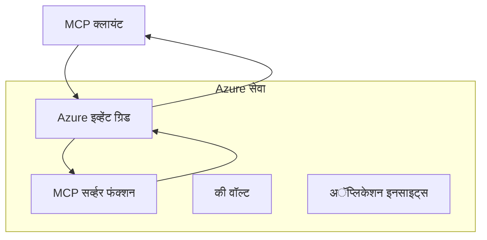
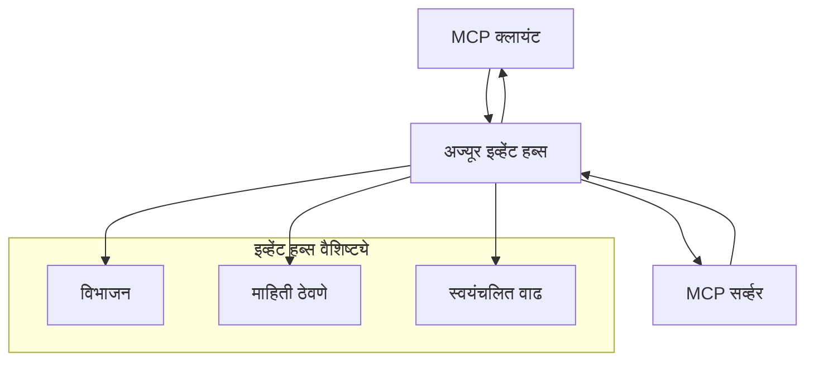

# MCP सानुकूल वाहने - प्रगत अंमलबजावणी मार्गदर्शक

मॉडेल संदर्भ प्रोटोकॉल (MCP) वाहन व्यवस्थेमध्ये लवचिकता प्रदान करतो, ज्यामुळे विशेषीकृत एंटरप्राइझ वातावरणासाठी सानुकूल अंमलबजावणी शक्य होते. हा प्रगत मार्गदर्शक Azure Event Grid आणि Azure Event Hubs वापरून सानुकूल वाहने अंमलबजावणी कशी करता येईल हे व्यवहार्य उदाहरणांद्वारे पाहतो, जे प्रमाणबद्ध, क्लाउड-नेटिव्ह MCP उपाय तयार करण्यासाठी उपयुक्त आहेत.

## परिचय

MCP चे मानक वाहने (stdio आणि HTTP प्रवाह) बहुतेक वापराच्या बाबतीत उपयोगी असले तरी, एंटरप्राइझ वातावरणांमध्ये अधिक प्रमाणबद्धता, विश्वासार्हता, आणि विद्यमान क्लाउड पायाभूत सुविधांशी एकत्रीकरणासाठी विशेष वाहने आवश्यक असतात. सानुकूल वाहने MCP ला क्लाउड-नेटिव्ह मेसेजिंग सेवांचा फायदा घेण्यास सक्षम करतात जसे की असिंक्रोनस संवाद, घटना-चालित आर्किटेक्चर, आणि वितरित प्रक्रिया.

हा धडा MCP च्या नवीनतम विनिर्देशावर आधारित (2025-11-25), Azure मेसेजिंग सेवा, आणि स्थापत्य एंटरप्राइझ एकत्रीकरणाचे नमुने यांचा उपयोग करून प्रगत वाहने अंमलबजावणींचा अभ्यास करतो.

### **MCP ट्रान्सपोर्ट आर्किटेक्चर**

**MCP विनिर्देशापासून (2025-11-25):**

- **मानक वाहने**: stdio (शिफारस केलेले), HTTP प्रवाह (रिमोट परिस्थितीसाठी)
- **सानुकूल वाहने**: कोणतेही वाहने जे MCP मेसेज एक्सचेंज प्रोटोकॉलची अंमलबजावणी करतात
- **मेसेज फॉरमॅट**: JSON-RPC 2.0 सह MCP-विशिष्ट विस्तार
- **द्विमुखी संवाद**: सूचना आणि प्रत्युत्तरांसाठी पूर्ण ड्युप्लेक्स संवाद आवश्यक

## शिक्षण उद्दिष्टे

या प्रगत धड्याच्या शेवटी, आपण हे करू शकाल:

- **सानुकूल वाहने आवश्यकतांची समज**: कोणत्याही वाहन स्तरावर MCP प्रोटोकॉलची अंमलबजावणी करा आणि कंप्लायंस राखा
- **Azure Event Grid ट्रान्सपोर्ट बांधा**: Azure Event Grid वापरून ईव्हेंट-चालित MCP सर्व्हर तयार करा जे सर्व्हरलेस प्रमाणबद्धतेसाठी उपयुक्त आहेत
- **Azure Event Hubs ट्रान्सपोर्ट अंमलबजावणी करा**: Azure Event Hubs वापरून उच्च-थ्रूपुट MCP उपाय डिझाइन करा, जे रिअल-टाइम प्रवाहासाठी आहेत
- **एंटरप्राइझ नमुने लागू करा**: विद्यमान Azure पायाभूत सुविधा आणि सुरक्षा मॉडेल्ससह सानुकूल वाहन एकत्रित करा
- **वाहन विश्वासार्हता हाताळा**: एंटरप्राइझ परिस्थितीसाठी मेसेज टिकाऊपणा, क्रमवारी, आणि त्रुटी हाताळणी करा
- **कामगिरी सुधारित करा**: प्रमाण, विलंबता, आणि थ्रूपुट गरजांसाठी वाहन उपाय डिझाइन करा

## **वाहन आवश्यकताः**

### **MCP विनिर्देशनापासून मूलभूत आवश्यकता (2025-11-25):**

```yaml
Message Protocol:
  format: "JSON-RPC 2.0 with MCP extensions"
  bidirectional: "Full duplex communication required"
  ordering: "Message ordering must be preserved per session"
  
Transport Layer:
  reliability: "Transport MUST handle connection failures gracefully"
  security: "Transport MUST support secure communication"
  identification: "Each session MUST have unique identifier"
  
Custom Transport:
  compliance: "MUST implement complete MCP message exchange"
  extensibility: "MAY add transport-specific features"
  interoperability: "MUST maintain protocol compatibility"
```

## **Azure Event Grid ट्रान्सपोर्ट अंमलबजावणी**

Azure Event Grid ही सर्व्हरलेस घटना रूटिंग सेवा आहे जी घटना-चालित MCP आर्किटेक्चरसाठी आदर्श आहे. ही अंमलबजावणी प्रमाणबद्ध, ढीलढीलट MCP प्रणाली कशी तयार करायची हे दाखवते.

### **आर्किटेक्चर सारांश**



### **C# अंमलबजावणी - Event Grid ट्रान्सपोर्ट**

```csharp
using Azure.Messaging.EventGrid;
using Microsoft.Extensions.Azure;
using System.Text.Json;

public class EventGridMcpTransport : IMcpTransport
{
    private readonly EventGridPublisherClient _publisher;
    private readonly string _topicEndpoint;
    private readonly string _clientId;
    
    public EventGridMcpTransport(string topicEndpoint, string accessKey, string clientId)
    {
        _publisher = new EventGridPublisherClient(
            new Uri(topicEndpoint), 
            new AzureKeyCredential(accessKey));
        _topicEndpoint = topicEndpoint;
        _clientId = clientId;
    }
    
    public async Task SendMessageAsync(McpMessage message)
    {
        var eventGridEvent = new EventGridEvent(
            subject: $"mcp/{_clientId}",
            eventType: "MCP.MessageReceived",
            dataVersion: "1.0",
            data: JsonSerializer.Serialize(message))
        {
            Id = Guid.NewGuid().ToString(),
            EventTime = DateTimeOffset.UtcNow
        };
        
        await _publisher.SendEventAsync(eventGridEvent);
    }
    
    public async Task<McpMessage> ReceiveMessageAsync(CancellationToken cancellationToken)
    {
        // Event Grid is push-based, so implement webhook receiver
        // This would typically be handled by Azure Functions trigger
        throw new NotImplementedException("Use EventGridTrigger in Azure Functions");
    }
}

// Azure Function for receiving Event Grid events
[FunctionName("McpEventGridReceiver")]
public async Task<IActionResult> HandleEventGridMessage(
    [EventGridTrigger] EventGridEvent eventGridEvent,
    ILogger log)
{
    try
    {
        var mcpMessage = JsonSerializer.Deserialize<McpMessage>(
            eventGridEvent.Data.ToString());
        
        // Process MCP message
        var response = await _mcpServer.ProcessMessageAsync(mcpMessage);
        
        // Send response back via Event Grid
        await _transport.SendMessageAsync(response);
        
        return new OkResult();
    }
    catch (Exception ex)
    {
        log.LogError(ex, "Error processing Event Grid MCP message");
        return new BadRequestResult();
    }
}
```

### **TypeScript अंमलबजावणी - Event Grid ट्रान्सपोर्ट**

```typescript
import { EventGridPublisherClient, AzureKeyCredential } from "@azure/eventgrid";
import { McpTransport, McpMessage } from "./mcp-types";

export class EventGridMcpTransport implements McpTransport {
    private publisher: EventGridPublisherClient;
    private clientId: string;
    
    constructor(
        private topicEndpoint: string,
        private accessKey: string,
        clientId: string
    ) {
        this.publisher = new EventGridPublisherClient(
            topicEndpoint,
            new AzureKeyCredential(accessKey)
        );
        this.clientId = clientId;
    }
    
    async sendMessage(message: McpMessage): Promise<void> {
        const event = {
            id: crypto.randomUUID(),
            source: `mcp-client-${this.clientId}`,
            type: "MCP.MessageReceived",
            time: new Date(),
            data: message
        };
        
        await this.publisher.sendEvents([event]);
    }
    
    // Azure Functions द्वारे इव्हेंट-चालित प्राप्ती
    onMessage(handler: (message: McpMessage) => Promise<void>): void {
        // अंमलबजावणी करताना Azure Functions Event Grid ट्रिगर वापरले जाईल
        // हा webhook रिसिव्हरसाठी एक संकल्पनात्मक इंटरफेस आहे
    }
}

// Azure Functions ची अंमलबजावणी
import { app, InvocationContext, EventGridEvent } from "@azure/functions";

app.eventGrid("mcpEventGridHandler", {
    handler: async (event: EventGridEvent, context: InvocationContext) => {
        try {
            const mcpMessage = event.data as McpMessage;
            
            // MCP संदेश प्रक्रिया करा
            const response = await mcpServer.processMessage(mcpMessage);
            
            // Event Grid द्वारे प्रतिसाद पाठवा
            await transport.sendMessage(response);
            
        } catch (error) {
            context.error("Error processing MCP message:", error);
            throw error;
        }
    }
});
```

### **Python अंमलबजावणी - Event Grid ट्रान्सपोर्ट**

```python
from azure.eventgrid import EventGridPublisherClient, EventGridEvent
from azure.core.credentials import AzureKeyCredential
import asyncio
import json
from typing import Callable, Optional
import uuid
from datetime import datetime

class EventGridMcpTransport:
    def __init__(self, topic_endpoint: str, access_key: str, client_id: str):
        self.client = EventGridPublisherClient(
            topic_endpoint, 
            AzureKeyCredential(access_key)
        )
        self.client_id = client_id
        self.message_handler: Optional[Callable] = None
    
    async def send_message(self, message: dict) -> None:
        """Send MCP message via Event Grid"""
        event = EventGridEvent(
            data=message,
            subject=f"mcp/{self.client_id}",
            event_type="MCP.MessageReceived",
            data_version="1.0"
        )
        
        await self.client.send(event)
    
    def on_message(self, handler: Callable[[dict], None]) -> None:
        """Register message handler for incoming events"""
        self.message_handler = handler

# Azure Functions अंमलबजावणी
import azure.functions as func
import logging

def main(event: func.EventGridEvent) -> None:
    """Azure Functions Event Grid trigger for MCP messages"""
    try:
        # Event Grid इव्हेंटमधून MCP संदेश पार्स करा
        mcp_message = json.loads(event.get_body().decode('utf-8'))
        
        # MCP संदेश प्रक्रिया करा
        response = process_mcp_message(mcp_message)
        
        # प्रतिसाद Event Grid मार्फत परत पाठवा
        # (अंमलबजावणी नवीन Event Grid क्लायंट तयार करेल)
        
    except Exception as e:
        logging.error(f"Error processing MCP Event Grid message: {e}")
        raise
```

## **Azure Event Hubs ट्रान्सपोर्ट अंमलबजावणी**

Azure Event Hubs उच्च-थ्रूपुट, रिअल-टाइम प्रवाह क्षमतांसाठी पुरवठा करतात, जे कमी विलंब आणि उच्च मेसेज व्हॉल्यूम आवश्यक असलेल्या MCP परिस्थितीस योग्य आहेत.

### **आर्किटेक्चर सारांश**



### **C# अंमलबजावणी - Event Hubs ट्रान्सपोर्ट**

```csharp
using Azure.Messaging.EventHubs;
using Azure.Messaging.EventHubs.Producer;
using Azure.Messaging.EventHubs.Consumer;
using System.Text;

public class EventHubsMcpTransport : IMcpTransport, IDisposable
{
    private readonly EventHubProducerClient _producer;
    private readonly EventHubConsumerClient _consumer;
    private readonly string _consumerGroup;
    private readonly CancellationTokenSource _cancellationTokenSource;
    
    public EventHubsMcpTransport(
        string connectionString, 
        string eventHubName,
        string consumerGroup = "$Default")
    {
        _producer = new EventHubProducerClient(connectionString, eventHubName);
        _consumer = new EventHubConsumerClient(
            consumerGroup, 
            connectionString, 
            eventHubName);
        _consumerGroup = consumerGroup;
        _cancellationTokenSource = new CancellationTokenSource();
    }
    
    public async Task SendMessageAsync(McpMessage message)
    {
        var messageBody = JsonSerializer.Serialize(message);
        var eventData = new EventData(Encoding.UTF8.GetBytes(messageBody));
        
        // Add MCP-specific properties
        eventData.Properties.Add("MessageType", message.Method ?? "response");
        eventData.Properties.Add("MessageId", message.Id);
        eventData.Properties.Add("Timestamp", DateTimeOffset.UtcNow);
        
        await _producer.SendAsync(new[] { eventData });
    }
    
    public async Task StartReceivingAsync(
        Func<McpMessage, Task> messageHandler)
    {
        await foreach (PartitionEvent partitionEvent in _consumer.ReadEventsAsync(
            _cancellationTokenSource.Token))
        {
            try
            {
                var messageBody = Encoding.UTF8.GetString(
                    partitionEvent.Data.EventBody.ToArray());
                var mcpMessage = JsonSerializer.Deserialize<McpMessage>(messageBody);
                
                await messageHandler(mcpMessage);
            }
            catch (Exception ex)
            {
                // Handle deserialization or processing errors
                Console.WriteLine($"Error processing message: {ex.Message}");
            }
        }
    }
    
    public void Dispose()
    {
        _cancellationTokenSource?.Cancel();
        _producer?.DisposeAsync().AsTask().Wait();
        _consumer?.DisposeAsync().AsTask().Wait();
        _cancellationTokenSource?.Dispose();
    }
}
```

### **TypeScript अंमलबजावणी - Event Hubs ट्रान्सपोर्ट**

```typescript
import { 
    EventHubProducerClient, 
    EventHubConsumerClient, 
    EventData 
} from "@azure/event-hubs";

export class EventHubsMcpTransport implements McpTransport {
    private producer: EventHubProducerClient;
    private consumer: EventHubConsumerClient;
    private isReceiving = false;
    
    constructor(
        private connectionString: string,
        private eventHubName: string,
        private consumerGroup: string = "$Default"
    ) {
        this.producer = new EventHubProducerClient(
            connectionString, 
            eventHubName
        );
        this.consumer = new EventHubConsumerClient(
            consumerGroup,
            connectionString,
            eventHubName
        );
    }
    
    async sendMessage(message: McpMessage): Promise<void> {
        const eventData: EventData = {
            body: JSON.stringify(message),
            properties: {
                messageType: message.method || "response",
                messageId: message.id,
                timestamp: new Date().toISOString()
            }
        };
        
        await this.producer.sendBatch([eventData]);
    }
    
    async startReceiving(
        messageHandler: (message: McpMessage) => Promise<void>
    ): Promise<void> {
        if (this.isReceiving) return;
        
        this.isReceiving = true;
        
        const subscription = this.consumer.subscribe({
            processEvents: async (events, context) => {
                for (const event of events) {
                    try {
                        const messageBody = event.body as string;
                        const mcpMessage: McpMessage = JSON.parse(messageBody);
                        
                        await messageHandler(mcpMessage);
                        
                        // किमान-एकदा वितरणासाठी तपास बिंदू अद्यतनित करा
                        await context.updateCheckpoint(event);
                    } catch (error) {
                        console.error("Error processing Event Hubs message:", error);
                    }
                }
            },
            processError: async (err, context) => {
                console.error("Event Hubs error:", err);
            }
        });
    }
    
    async close(): Promise<void> {
        this.isReceiving = false;
        await this.producer.close();
        await this.consumer.close();
    }
}
```

### **Python अंमलबजावणी - Event Hubs ट्रान्सपोर्ट**

```python
from azure.eventhub import EventHubProducerClient, EventHubConsumerClient
from azure.eventhub import EventData
import json
import asyncio
from typing import Callable, Dict, Any
import logging

class EventHubsMcpTransport:
    def __init__(
        self, 
        connection_string: str, 
        eventhub_name: str,
        consumer_group: str = "$Default"
    ):
        self.producer = EventHubProducerClient.from_connection_string(
            connection_string, 
            eventhub_name=eventhub_name
        )
        self.consumer = EventHubConsumerClient.from_connection_string(
            connection_string,
            consumer_group=consumer_group,
            eventhub_name=eventhub_name
        )
        self.is_receiving = False
    
    async def send_message(self, message: Dict[str, Any]) -> None:
        """Send MCP message via Event Hubs"""
        event_data = EventData(json.dumps(message))
        
        # MCP-विशिष्ट गुणधर्म जोडा
        event_data.properties = {
            "messageType": message.get("method", "response"),
            "messageId": message.get("id"),
            "timestamp": "2025-01-14T10:30:00Z"  # प्रत्यक्ष टाइमस्टँप वापरा
        }
        
        async with self.producer:
            event_data_batch = await self.producer.create_batch()
            event_data_batch.add(event_data)
            await self.producer.send_batch(event_data_batch)
    
    async def start_receiving(
        self, 
        message_handler: Callable[[Dict[str, Any]], None]
    ) -> None:
        """Start receiving MCP messages from Event Hubs"""
        if self.is_receiving:
            return
        
        self.is_receiving = True
        
        async with self.consumer:
            await self.consumer.receive(
                on_event=self._on_event_received(message_handler),
                starting_position="-1"  # सुरुवातीपासून सुरू करा
            )
    
    def _on_event_received(self, handler: Callable):
        """Internal event handler wrapper"""
        async def handle_event(partition_context, event):
            try:
                # इव्हेंट हब्स इव्हेंटमधून MCP संदेश पार्स करा
                message_body = event.body_as_str(encoding='UTF-8')
                mcp_message = json.loads(message_body)
                
                # MCP संदेश प्रक्रिया करा
                await handler(mcp_message)
                
                # किमान एकदा वितरणासाठी चेकपॉईंट अद्यतनित करा
                await partition_context.update_checkpoint(event)
                
            except Exception as e:
                logging.error(f"Error processing Event Hubs message: {e}")
        
        return handle_event
    
    async def close(self) -> None:
        """Clean up transport resources"""
        self.is_receiving = False
        await self.producer.close()
        await self.consumer.close()
```

## **प्रगत वाहन नमुने**

### **मेसेज टिकाऊपणा आणि विश्वासार्हता**

```csharp
// Implementing message durability with retry logic
public class ReliableTransportWrapper : IMcpTransport
{
    private readonly IMcpTransport _innerTransport;
    private readonly RetryPolicy _retryPolicy;
    
    public async Task SendMessageAsync(McpMessage message)
    {
        await _retryPolicy.ExecuteAsync(async () =>
        {
            try
            {
                await _innerTransport.SendMessageAsync(message);
            }
            catch (TransportException ex) when (ex.IsRetryable)
            {
                // Log and retry
                throw;
            }
        });
    }
}
```

### **वाहन सुरक्षा एकत्रीकरण**

```csharp
// Integrating Azure Key Vault for transport security
public class SecureTransportFactory
{
    private readonly SecretClient _keyVaultClient;
    
    public async Task<IMcpTransport> CreateEventGridTransportAsync()
    {
        var accessKey = await _keyVaultClient.GetSecretAsync("EventGridAccessKey");
        var topicEndpoint = await _keyVaultClient.GetSecretAsync("EventGridTopic");
        
        return new EventGridMcpTransport(
            topicEndpoint.Value.Value,
            accessKey.Value.Value,
            Environment.MachineName
        );
    }
}
```

### **वाहन निरीक्षण आणि प्रेक्षणीयता**

```csharp
// Adding telemetry to custom transports
public class ObservableTransport : IMcpTransport
{
    private readonly IMcpTransport _transport;
    private readonly ILogger _logger;
    private readonly TelemetryClient _telemetryClient;
    
    public async Task SendMessageAsync(McpMessage message)
    {
        using var activity = Activity.StartActivity("MCP.Transport.Send");
        activity?.SetTag("transport.type", "EventGrid");
        activity?.SetTag("message.method", message.Method);
        
        var stopwatch = Stopwatch.StartNew();
        
        try
        {
            await _transport.SendMessageAsync(message);
            
            _telemetryClient.TrackDependency(
                "EventGrid",
                "SendMessage",
                DateTime.UtcNow.Subtract(stopwatch.Elapsed),
                stopwatch.Elapsed,
                true
            );
        }
        catch (Exception ex)
        {
            _telemetryClient.TrackException(ex);
            throw;
        }
    }
}
```

## **एंटरप्राइझ एकत्रीकरण परिस्थिती**

### **परिस्थिती 1: वितरित MCP प्रक्रिया**

अनेक प्रक्रिया नोड्समध्ये MCP विनंत्या वितरित करण्यासाठी Azure Event Grid वापरणे:

```yaml
Architecture:
  - MCP Client sends requests to Event Grid topic
  - Multiple Azure Functions subscribe to process different tool types
  - Results aggregated and returned via separate response topic
  
Benefits:
  - Horizontal scaling based on message volume
  - Fault tolerance through redundant processors
  - Cost optimization with serverless compute
```

### **परिस्थिती 2: रिअल-टाइम MCP प्रवाह**

उच्च-वारंवारता MCP संवादांसाठी Azure Event Hubs वापरणे:

```yaml
Architecture:
  - MCP Client streams continuous requests via Event Hubs
  - Stream Analytics processes and routes messages
  - Multiple consumers handle different aspect of processing
  
Benefits:
  - Low latency for real-time scenarios
  - High throughput for batch processing
  - Built-in partitioning for parallel processing
```

### **परिस्थिती 3: संकरित वाहन आर्किटेक्चर**

वेगवेगळ्या वापर प्रकरणांसाठी अनेक वाहने एकत्र करणे:

```csharp
public class HybridMcpTransport : IMcpTransport
{
    private readonly IMcpTransport _realtimeTransport; // Event Hubs
    private readonly IMcpTransport _batchTransport;    // Event Grid
    private readonly IMcpTransport _fallbackTransport; // HTTP Streaming
    
    public async Task SendMessageAsync(McpMessage message)
    {
        // Route based on message characteristics
        var transport = message.Method switch
        {
            "tools/call" when IsRealtime(message) => _realtimeTransport,
            "resources/read" when IsBatch(message) => _batchTransport,
            _ => _fallbackTransport
        };
        
        await transport.SendMessageAsync(message);
    }
}
```

## **कामगिरी ऑप्टिमायझेशन**

### **Event Grid साठी मेसेज बॅचिंग**

```csharp
public class BatchingEventGridTransport : IMcpTransport
{
    private readonly List<McpMessage> _messageBuffer = new();
    private readonly Timer _flushTimer;
    private const int MaxBatchSize = 100;
    
    public async Task SendMessageAsync(McpMessage message)
    {
        lock (_messageBuffer)
        {
            _messageBuffer.Add(message);
            
            if (_messageBuffer.Count >= MaxBatchSize)
            {
                _ = Task.Run(FlushMessages);
            }
        }
    }
    
    private async Task FlushMessages()
    {
        List<McpMessage> toSend;
        lock (_messageBuffer)
        {
            toSend = new List<McpMessage>(_messageBuffer);
            _messageBuffer.Clear();
        }
        
        if (toSend.Any())
        {
            var events = toSend.Select(CreateEventGridEvent);
            await _publisher.SendEventsAsync(events);
        }
    }
}
```

### **Event Hubs साठी विभाजन धोरण**

```csharp
public class PartitionedEventHubsTransport : IMcpTransport
{
    public async Task SendMessageAsync(McpMessage message)
    {
        // Partition by client ID for session affinity
        var partitionKey = ExtractClientId(message);
        
        var eventData = new EventData(JsonSerializer.SerializeToUtf8Bytes(message))
        {
            PartitionKey = partitionKey
        };
        
        await _producer.SendAsync(new[] { eventData });
    }
}
```

## **सानुकूल वाहने चाचणी**

### **चाचणी दुहेरीसह युनिट टेस्टींग**

```csharp
[Test]
public async Task EventGridTransport_SendMessage_PublishesCorrectEvent()
{
    // Arrange
    var mockPublisher = new Mock<EventGridPublisherClient>();
    var transport = new EventGridMcpTransport(mockPublisher.Object);
    var message = new McpMessage { Method = "tools/list", Id = "test-123" };
    
    // Act
    await transport.SendMessageAsync(message);
    
    // Assert
    mockPublisher.Verify(
        x => x.SendEventAsync(
            It.Is<EventGridEvent>(e => 
                e.EventType == "MCP.MessageReceived" &&
                e.Subject == "mcp/test-client"
            )
        ),
        Times.Once
    );
}
```

### **Azure Test Containers सह एकत्रीकरण चाचणी**

```csharp
[Test]
public async Task EventHubsTransport_IntegrationTest()
{
    // Using Testcontainers for integration testing
    var eventHubsContainer = new EventHubsContainer()
        .WithEventHub("test-hub");
    
    await eventHubsContainer.StartAsync();
    
    var transport = new EventHubsMcpTransport(
        eventHubsContainer.GetConnectionString(),
        "test-hub"
    );
    
    // Test message round-trip
    var sentMessage = new McpMessage { Method = "test", Id = "123" };
    McpMessage receivedMessage = null;
    
    await transport.StartReceivingAsync(msg => {
        receivedMessage = msg;
        return Task.CompletedTask;
    });
    
    await transport.SendMessageAsync(sentMessage);
    await Task.Delay(1000); // Allow for message processing
    
    Assert.That(receivedMessage?.Id, Is.EqualTo("123"));
}
```

## **सर्वोत्तम प्रथा आणि मार्गदर्शक तत्त्वे**

### **वाहन डिझाइन तत्त्वे**

1. **आइडंपोटंसी**: डुपलिकेट्स हाताळण्यासाठी मेसेज प्रक्रिया आइडंपोटंट ठेवा  
2. **त्रुटी हाताळणी**: व्यापक त्रुटी हाताळणी आणि Dead Letter Queues अंमलबजावणी करा  
3. **निरीक्षण**: सविस्तर टेलीमेट्री आणि आरोग्य तपासणी जोडा  
4. **सुरक्षा**: व्यवस्थापित ओळख वापरा आणि कमी अधिकार प्रवेश सुनिश्चित करा  
5. **कामगिरी**: आपल्या विशिष्ट विलंबता आणि थ्रूपुट गरजांसाठी डिझाइन करा

### **Azure-विशिष्ट शिफारसी**

1. **व्यवस्थापित ओळख वापरा**: प्रोडक्शनमध्ये कनेक्शन स्ट्रिंग्ज टाळा  
2. **सर्किट ब्रेकर्स अंमलबजावणी करा**: Azure सेवा अपयशांपासून संरक्षण करा  
3. **खर्चे निरीक्षण करा**: मेसेज व्हॉल्यूम आणि प्रक्रिया खर्च ट्रॅक करा  
4. **प्रमाणासाठी योजना करा**: लवकर विभाजन आणि प्रमाण वाढ धोरणे डिझाइन करा  
5. **सर्वांगिण चाचणी करा**: व्यापक चाचणीसाठी Azure DevTest Labs वापरा

## **निष्कर्ष**

सानुकूल MCP वाहने Azure च्या मेसेजिंग सेवांचा उपयोग करून शक्तिशाली एंटरप्राइझ परिस्थिती साध्य करतात. Event Grid किंवा Event Hubs वाहने अंमलबजावणी करून, आपण प्रमाणबद्ध, विश्वासार्ह MCP उपाय तयार करू शकता जे विद्यमान Azure पायाभूत सुविधांसोबत सहजपणे एकत्र होतात.

दिलेली उदाहरणे उत्पादन-तयार नमुने दाखवतात जे सानुकूल वाहने तयार करताना MCP प्रोटोकॉल कंप्लायंस आणि Azure सर्वोत्तम प्रथा राखण्यासाठी उपयुक्त आहेत.

## **अतिरिक्त संसाधने**

- [MCP Specification 2025-11-25](https://modelcontextprotocol.io/specification/2025-11-25/)
- [Azure Event Grid Documentation](https://docs.microsoft.com/azure/event-grid/)
- [Azure Event Hubs Documentation](https://docs.microsoft.com/azure/event-hubs/)
- [Azure Functions Event Grid Trigger](https://docs.microsoft.com/azure/azure-functions/functions-bindings-event-grid)
- [Azure SDK for .NET](https://github.com/Azure/azure-sdk-for-net)
- [Azure SDK for TypeScript](https://github.com/Azure/azure-sdk-for-js)
- [Azure SDK for Python](https://github.com/Azure/azure-sdk-for-python)

---

> *हा मार्गदर्शक उत्पादन MCP सिस्टमसाठी व्यवहार्य अंमलबजावणी नमुन्यांवर लक्ष केंद्रित करतो. आपली विशिष्ट गरजा आणि Azure सेवा मर्यादांनुसार वाहन अंमलबजावणीचे नेहमीच मूल्यांकन करा.*  
> **सध्याचा मानक**: हा मार्गदर्शक [MCP Specification 2025-11-25](https://modelcontextprotocol.io/specification/2025-11-25/) चे वाहन आवश्यकतां आणि एंटरप्राइझ वातावरणांसाठी प्रगत वाहन नमुने प्रतिबिंबित करतो.


## पुढे काय  
- [6. Community Contributions](../../06-CommunityContributions/README.md)

---

<!-- CO-OP TRANSLATOR DISCLAIMER START -->
**अस्वीकरण**:
हा दस्तऐवज AI भाषांतर सेवा [Co-op Translator](https://github.com/Azure/co-op-translator) चा वापर करून अनुवादित केला आहे. जरी आम्ही अचूकतेसाठी प्रयत्न करतो, तरी कृपया लक्षात घ्या की स्वयंचलित भाषांतरांमध्ये त्रुटी किंवा अचूकतेची कमतरता असू शकते. मूळ दस्तऐवज त्याच्या मूळ भाषेत अधिकृत स्रोत मानला पाहिजे. महत्त्वाची माहिती असल्यास, व्यावसायिक मानवी भाषांतराची शिफारस केली जाते. या भाषांतराच्या वापरामुळे उद्भवणाऱ्या कोणत्याही गैरसमज किंवा चुकीच्या अर्थलावणीसाठी आम्ही जबाबदार नाही.
<!-- CO-OP TRANSLATOR DISCLAIMER END -->