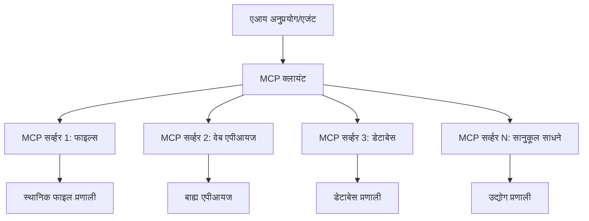

# 🌐 मॉड्यूल 2: Microsoft Foundry Toolkit मूलभूत गोष्टींसह MCP

[]()
[]()
[]()

## 📋 शिकण्याच्या उद्दिष्टे

या मॉड्यूलच्या शेवटी, तुम्ही सक्षम असाल:
- ✅ मॉडेल संदर्भ प्रोटोकॉल (MCP) आर्किटेक्चर आणि फायदे समजून घेणे
- ✅ Microsoft चे MCP सर्व्हर पारिस्थितिकी तंत्र एक्सप्लोर करणे
- ✅ MCP सर्व्हर Microsoft Foundry Toolkit Agent Builder सह एकत्र करणे
- ✅ Playwright MCP वापरून एक कार्यशील ब्राउझर ऑटोमेशन एजंट तयार करणे
- ✅ तुमच्या एजंट्समध्ये MCP साधने कॉन्फिगर आणि टेस्ट करणे
- ✅ उत्पादनासाठी MCP-संचालित एजंट्स निर्यात आणि तैनात करणे

## 🎯 मॉड्यूल 1 वर आधारित बनवणे

मॉड्यूल 1 मध्ये, आपण Microsoft Foundry Toolkit चे मूलभूत ज्ञान संपादन केले आणि आपला पहिला Python एजंट तयार केला. आता आपण आपल्या एजंटना अभिनव **मॉडेल संदर्भ प्रोटोकॉल (MCP)** च्या माध्यमातून बाह्य साधने आणि सेवा जोडून **सुपरचार्ज** करणार आहोत.

हे तशी, मूलभूत कॅल्क्युलेटरपासून पूर्ण संगणकाकडे उन्नती करताना असे समजा - तुमच्या AI एजंटना हे करू शकण्याची क्षमता मिळेल:
- 🌐 वेबसाइट्स ब्राउझ आणि संवाद साधणे
- 📁 फायली ऍक्सेस आणि व्यवस्थापन करणे
- 🔧 एंटरप्राइझ सिस्टीम्स सह एकत्रिकरण
- 📊 API मधून रिअल-टाइम डेटा प्रक्रिया करणे

## 🧠 मॉडेल संदर्भ प्रोटोकॉल (MCP) समजून घेणे

### 🔍 MCP म्हणजे काय?

मॉडेल संदर्भ प्रोटोकॉल (MCP) हा **"AI अनुप्रयोगांसाठी USB-C"** आहे - एक क्रांतिकारक खुला मानक जो मोठे भाषिक मॉडेल्स (LLMs) बाह्य साधने, डेटा स्रोत, आणि सेवांशी जोडतो. जसे USB-C ने एका सार्वत्रिक कनेक्टरच्या माध्यमातून केबल अराजकता संपवली, तसेच MCP एक सुसंगत प्रोटोकॉलच्या माध्यमातून AI समाकलनाची गुंतागुंत कमी करते.

### 🎯 MCP सोडवणारा प्रश्न

**MCP आधी:**
- 🔧 प्रत्येक साधनासाठी सानुकूल एकत्रिकरण
- 🔄 मालकीच्या उपाययोजनांसह विक्रेता लॉक-इन  
- 🔒 अनपेक्षित कनेक्शन्समधील सुरक्षा धोके
- ⏱️ मूलभूत एकत्रिकरणासाठी महिने विकास

**MCP सह:**
- ⚡ प्लग-अँड-प्ले साधन एकत्रिकरण
- 🔄 विक्रेता-निर्भर नसलेली आर्किटेक्चर
- 🛡️ अंगभूत सुरक्षा सर्वोत्तम पद्धती
- 🚀 नवीन क्षमता जोडण्यासाठी मिनिटे

### 🏗️ MCP आर्किटेक्चर सखोल

MCP एक **क्लायंट-सर्व्हर आर्किटेक्चर** वापरतो जे सुरक्षित आणि स्केलेबल पर्यावरण तयार करतो:



**🔧 मुख्य घटक:**

| घटक | भूमिका | उदाहरणे |
|-----------|------|----------|
| **MCP होस्ट्स** | MCP सेवा वापरणारे अनुप्रयोग | Claude Desktop, VS Code, Microsoft Foundry Toolkit |
| **MCP क्लायंट्स** | प्रोटोकॉल हॅडलर्स (1:1 सर्व्हर्ससह) | होस्ट अनुप्रयोगांमध्ये अंतर्भूत |
| **MCP सर्व्हर्स** | मानक प्रोटोकॉलद्वारे क्षमता उपलब्ध करतात | Playwright, Files, Azure, GitHub |
| **ट्रान्सपोर्ट लेयर** | संवाद माध्यमे | stdio, HTTP, WebSockets |


## 🏢 Microsoft चे MCP सर्व्हर पारिस्थितिकी तंत्र

Microsoft ही MCP पारिस्थितिकी तंत्राची नेतृत्व करणारी कंपनी आहे जी व्यावसायिक गरजांसाठी सर्वसमावेशक एंटरप्राइझ-ग्रेड सर्व्हरची साखळी प्रदान करते.

### 🌟 Microsoft MCP सर्व्हर्स फीचर केलेले

#### 1. ☁️ Azure MCP सर्व्हर
**🔗 रिपॉझिटरी**: [azure/azure-mcp](https://github.com/azure/azure-mcp)
**🎯 उद्दिष्ट**: AI समाकलनासह व्यापक Azure संसाधन व्यवस्थापन

**✨ मुख्य वैशिष्ट्ये:**
- घोषणात्मक इन्फ्रास्ट्रक्चर प्रोव्हिजनिंग
- रिअल-टाइम संसाधन निरीक्षण
- खर्च ऑप्टिमायझेशन सूचना
- सुरक्षा अनुपालन तपासणी

**🚀 वापर प्रकरणे:**
- AI सहाय्याने इन्फ्रास्ट्रक्चर-ऐज-कोड
- स्वयंचलित संसाधन स्केलिंग
- क्लाउड खर्च ऑप्टिमायझेशन
- देवऑप्स वर्कफ्लोज़ ऑटोमेशन

#### 2. 📊 Microsoft Dataverse MCP
**📚 दस्तऐवज**: [Microsoft Dataverse Integration](https://go.microsoft.com/fwlink/?linkid=2320176)
**🎯 उद्दिष्ट**: व्यवसाय डेटा साठी नैसर्गिक भाषा इंटरफेस

**✨ मुख्य वैशिष्ट्ये:**
- नैसर्गिक भाषा डेटाबेस क्वेरीज
- व्यवसाय संदर्भ समजून घेणे
- सानुकूल प्रॉम्प्ट टेम्पलेट्स
- एंटरप्राइझ डेटा गव्हर्नन्स

**🚀 वापर प्रकरणे:**
- व्यवसाय बुद्धिमत्ता अहवाल
- ग्राहक डेटा विश्लेषण
- विक्री पाईपलाइन अंतर्दृष्टी
- अनुपालन डेटा क्वेरीज

#### 3. 🌐 Playwright MCP सर्व्हर
**🔗 रिपॉझिटरी**: [microsoft/playwright-mcp](https://github.com/microsoft/playwright-mcp)
**🎯 उद्दिष्ट**: ब्राउझर ऑटोमेशन आणि वेब संवाद क्षमता

**✨ मुख्य वैशिष्ट्ये:**
- क्रॉस-ब्राउझर ऑटोमेशन (Chrome, Firefox, Safari)
- बुद्धिमान घटक शोध
- स्क्रीनशॉट आणि PDF निर्मिती
- नेटवर्क ट्रॅफिक निरीक्षण

**🚀 वापर प्रकरणे:**
- स्वयंचलित चाचणी वर्कफ्लोज
- वेब स्क्रॅपिंग आणि डेटा एक्सट्रॅक्शन
- UI/UX निरीक्षण
- स्पर्धात्मक विश्लेषण ऑटोमेशन

#### 4. 📁 Files MCP सर्व्हर
**🔗 रिपॉझिटरी**: [microsoft/files-mcp-server](https://github.com/microsoft/files-mcp-server)
**🎯 उद्दिष्ट**: बुद्धिमान फाइल सिस्टम ऑपरेशन्स

**✨ मुख्य वैशिष्ट्ये:**
- घोषणात्मक फाईल व्यवस्थापन
- सामग्री सिंक्रोनायझेशन
- आवृत्ती नियंत्रण एकत्रीकरण
- मेटाडेटा एक्सट्रॅक्शन

**🚀 वापर प्रकरणे:**
- दस्तऐवज व्यवस्थापन
- कोड रिपॉझिटरी संघटन
- सामग्री प्रकाशन वर्कफ्लोज
- डेटा पाईपलाइन फाइल हाताळणी

#### 5. 📝 MarkItDown MCP सर्व्हर
**🔗 रिपॉझिटरी**: [microsoft/markitdown](https://github.com/microsoft/markitdown)
**🎯 उद्दिष्ट**: प्रगत Markdown प्रक्रिया आणि बदल

**✨ मुख्य वैशिष्ट्ये:**
- समृद्ध Markdown पार्सिंग
- फॉरमॅट रूपांतरण (MD ↔ HTML ↔ PDF)
- सामग्री संरचना विश्लेषण
- टेम्प्लेट प्रक्रिया

**🚀 वापर प्रकरणे:**
- तांत्रिक दस्तऐवज वर्कफ्लोज
- सामग्री व्यवस्थापन प्रणाली
- अहवाल निर्मिती
- ज्ञान आधार ऑटोमेशन

#### 6. 📈 Clarity MCP सर्व्हर
**📦 पॅकेज**: [@microsoft/clarity-mcp-server](https://www.npmjs.com/package/@microsoft/clarity-mcp-server)
**🎯 उद्दिष्ट**: वेब विश्लेषण आणि वापरकर्ता वर्तन अंतर्दृष्टी

**✨ मुख्य वैशिष्ट्ये:**
- हीटमॅप डेटा विश्लेषण
- वापरकर्ता सत्र रेकॉर्डिंग
- कार्यक्षमता मेट्रिक्स
- रूपांतरण फनेल विश्लेषण

**🚀 वापर प्रकरणे:**
- वेबसाइट ऑप्टिमायझेशन
- वापरकर्ता अनुभव संशोधन
- A/B टेस्टिंग विश्लेषण
- व्यवसाय बुद्धिमत्ता डॅशबोर्ड

### 🌍 समुदाय पारिस्थितिकी तंत्र

Microsoft च्या सर्व्हरशिवाय, MCP पारिस्थितिकी तंत्रात समाविष्ट आहे:
- **🐙 GitHub MCP**: रिपॉझिटरी व्यवस्थापन आणि कोड विश्लेषण
- **🗄️ डेटाबेस MCPs**: PostgreSQL, MySQL, MongoDB एकत्रीकरण
- **☁️ क्लाउड प्रोव्हायडर MCPs**: AWS, GCP, Digital Ocean साधने
- **📧 संवाद MCPs**: Slack, Teams, ईमेल एकत्रीकरण

## 🛠️ हँड्स-ऑन लॅब: ब्राउझर ऑटोमेशन एजंट तयार करणे

**🎯 प्रकल्प उद्दिष्ट**: Playwright MCP सर्व्हर वापरून एक बुद्धिमान ब्राउझर ऑटोमेशन एजंट तयार करा जो वेबसाइट्स ब्राउझ करू शकतो, माहिती काढू शकतो, आणि जटिल वेब संवाद करू शकतो.

### 🚀 टप्पा 1: एजंट बेस तयार करणे

#### चरण 1: आपला एजंट प्रारंभ करा
1. **Microsoft Foundry Toolkit Agent Builder उघडा**
2. **नवीन एजंट तयार करा** खालील कॉन्फिगरेशनसह:
   - **नाव**: `BrowserAgent`
   - **मॉडेल**: GPT-4o निवडा


### 🔧 टप्पा 2: MCP समाकलन वर्कफ्लो

#### चरण 3: MCP सर्व्हर समाकलन जोडा
1. **Agent Builder मधील साधने विभागात जा**
2. **"Add Tool" क्लिक करा** समाकलन मेनू उघडण्यासाठी
3. **उपलब्ध पर्यायांमधून "MCP Server" निवडा**


**🔍 साधन प्रकार समजून घेणे:**
- **बिल्ट-इन साधने**: पूर्व-संरचित Microsoft Foundry Toolkit फंक्शन्स
- **MCP सर्व्हर्स**: बाह्य सेवा समाकलने
- **सानुकूल API**: तुमचे स्वतःचे सेवा एंडपॉइंट
- **फंक्शन कॉलिंग**: मॉडेल फंक्शन थेट प्रवेश

#### चरण 4: MCP सर्व्हर निवडणे
1. **"MCP Server" पर्याय निवडा** पुढे जाण्यासाठी


2. **MCP कॅटलॉग पहा** उपलब्ध समाकलने एक्सप्लोर करण्यासाठी


### 🎮 टप्पा 3: Playwright MCP कॉन्फिगरेशन

#### चरण 5: Playwright निवडा आणि कॉन्फिगर करा
1. **Microsoft च्या वाढवलेल्या पुष्टी असलेल्या सर्व्हरवर "Use Featured MCP Servers" क्लिक करा**
2. **"Playwright" निवडा** यादीतून
3. **डिफॉल्ट MCP ID स्वीकारा** किंवा तुमच्या वातावरणानुसार सानुकूल करा


#### चरण 6: Playwright क्षमता सक्षम करा
**🔑 महत्त्वाचा टप्पा**: जास्तीत जास्त कार्यक्षमतेसाठी सर्व उपलब्ध Playwright पद्धती निवडा


**🛠️ आवश्यक Playwright साधने:**
- **नॅव्हिगेशन**: `goto`, `goBack`, `goForward`, `reload`
- **इंटरॅक्शन**: `click`, `fill`, `press`, `hover`, `drag`
- **एक्सट्रॅक्शन**: `textContent`, `innerHTML`, `getAttribute`
- **वैधता**: `isVisible`, `isEnabled`, `waitForSelector`
- **कॅप्चर**: `screenshot`, `pdf`, `video`
- **नेटवर्क**: `setExtraHTTPHeaders`, `route`, `waitForResponse`

#### चरण 7: समाकलन यश सत्यापित करा
**✅ यशस्वी सूचक:**
- सर्व साधने Agent Builder इंटरफेस मध्ये दिसत आहेत
- समाकलन पॅनेलमध्ये कोणतीही त्रुटी संदेश नाहीत
- Playwright सर्व्हर स्थिती "Connected" दाखवते


**🔧 सामान्य समस्या निराकरण:**
- **कनेक्शन अयशस्वी**: इंटरनेट कनेक्टिविटी आणि फायरवॉल सेटिंग्ज तपासा
- **साधने गहाळ**: सेटअप दरम्यान सर्व क्षमता निवडली असल्याची खात्री करा
- **परवानगी त्रुटी**: VS Code कडे आवश्यक सिस्टम परवानग्या आहेत याची पुष्टी करा

### 🎯 टप्पा 4: प्रगत प्रॉम्प्ट अभियांत्रिकी

#### चरण 8: बुद्धिमान प्रणाली प्रॉम्प्ट डिझाइन करा
Playwright च्या पूर्ण क्षमतांचा वापर करणारे प्रगत प्रॉम्प्ट तयार करा:

```markdown
# Web Automation Expert System Prompt

## Core Identity
You are an advanced web automation specialist with deep expertise in browser automation, web scraping, and user experience analysis. You have access to Playwright tools for comprehensive browser control.

## Capabilities & Approach
### Navigation Strategy
- Always start with screenshots to understand page layout
- Use semantic selectors (text content, labels) when possible
- Implement wait strategies for dynamic content
- Handle single-page applications (SPAs) effectively

### Error Handling
- Retry failed operations with exponential backoff
- Provide clear error descriptions and solutions
- Suggest alternative approaches when primary methods fail
- Always capture diagnostic screenshots on errors

### Data Extraction
- Extract structured data in JSON format when possible
- Provide confidence scores for extracted information
- Validate data completeness and accuracy
- Handle pagination and infinite scroll scenarios

### Reporting
- Include step-by-step execution logs
- Provide before/after screenshots for verification
- Suggest optimizations and alternative approaches
- Document any limitations or edge cases encountered

## Ethical Guidelines
- Respect robots.txt and rate limiting
- Avoid overloading target servers
- Only extract publicly available information
- Follow website terms of service
```

#### चरण 9: डायनामिक वापरकर्ता प्रॉम्प्ट तयार करा
विविध क्षमता दाखवणारे प्रॉम्प्ट डिझाइन करा:

**🌐 वेब विश्लेषण उदाहरण:**
```markdown
Navigate to github.com/kinfey and provide a comprehensive analysis including:
1. Repository structure and organization
2. Recent activity and contribution patterns  
3. Documentation quality assessment
4. Technology stack identification
5. Community engagement metrics
6. Notable projects and their purposes

Include screenshots at key steps and provide actionable insights.
```


### 🚀 टप्पा 5: अंमलबजावणी आणि चाचणी

#### चरण 10: तुमचा पहिला ऑटोमेशन चालवा
1. **"Run" क्लिक करा** ऑटोमेशन साखळी सुरू करण्यासाठी
2. **रिअल-टाइम अंमलबजावणी निरीक्षण करा**:
   - Chrome ब्राउझर आपोआप उघडतो
   - एजंट लक्ष्य वेब साइटवर नॅव्हिगेट करतो
   - स्क्रीनशॉट प्रत्येक मुख्य टप्प्यावर घेतले जातात
   - विश्लेषण परिणाम रिअल-टाइममध्ये प्रवाहित होतात


#### चरण 11: निकाल आणि अंतर्दृष्टी विश्लेषित करा
Agent Builder च्या इंटरफेस मध्ये सविस्तर विश्लेषण पुनरावलोकन करा:


### 🌟 टप्पा 6: प्रगत क्षमता आणि तैनाती

#### चरण 12: निर्यात आणि उत्पादन तैनाती
Agent Builder अनेक तैनाती पर्यायांचा समर्थन करतो:


## 🎓 मॉड्यूल 2 सारांश आणि पुढील पायऱ्या

### 🏆 कौशल्य मिळवले: MCP समाकलन मास्टर

**✅ कौशल्ये प्राविण्य प्राप्त:**
- [ ] MCP आर्किटेक्चर आणि फायदे समजणे
- [ ] Microsoft च्या MCP सर्व्हर पारिस्थितिकी तंत्राचा परिचय
- [ ] Playwright MCP सह Microsoft Foundry Toolkit एकत्रिकरण
- [ ] प्रगत ब्राउझर ऑटोमेशन एजंट तयार करणे
- [ ] वेब ऑटोमेशनसाठी प्रगत प्रॉम्प्ट अभियांत्रिकी

### 📚 अतिरिक्त संसाधने

- **🔗 MCP तपशीलवार माहिती**: [अधिकृत प्रोटोकॉल दस्तऐवज](https://modelcontextprotocol.io/)
- **🛠️ Playwright API**: [पूर्ण पद्धत संदर्भ](https://playwright.dev/docs/api/class-playwright)
- **🏢 Microsoft MCP सर्व्हर्स**: [एंटरप्राइझ समाकलन मार्गदर्शक](https://github.com/microsoft/mcp-servers)
- **🌍 समुदाय उदाहरणे**: [MCP सर्व्हर गॅलरी](https://github.com/modelcontextprotocol/servers)

**🎉 अभिनंदन!** तुम्ही यशस्वीपणे MCP समाकलन मास्टर केले आहे आणि आता बाह्य साधन क्षमतांसह उत्पादन तयार करू शकणारे AI एजंट तयार करू शकता!


### 🔜 पुढील मॉड्यूलकडे पुढे जा

तुमची MCP कौशल्ये पुढील पातळीवर नेण्यासाठी तयार आहात? पुढील **[मॉड्यूल 3: Microsoft Foundry Toolkit सह प्रगत MCP विकास](../lab3/README.md)** येथे पुढील गोष्टी शिकाल:
- तुमचे स्वतःचे सानुकूल MCP सर्व्हर तयार करणे
- नवीनतम MCP Python SDK कॉन्फिगर आणि वापरणे
- डीबगिंगसाठी MCP Inspector सेट अप करणे
- प्रगत MCP सर्व्हर विकास वर्कफ्लो मास्टर करणे
- सुरुवातीपासून हवामान MCP सर्व्हर तयार करणे

---

<!-- CO-OP TRANSLATOR DISCLAIMER START -->
**अस्वीकरण**:
हा दस्तऐवज AI भाषांतर सेवा [Co-op Translator](https://github.com/Azure/co-op-translator) चा वापर करून अनुवादित केला आहे. जरी आम्ही अचूकतेसाठी प्रयत्न करतो, तरी कृपया लक्षात घ्या की स्वयंचलित भाषांतरांमध्ये त्रुटी किंवा अचूकतेची कमतरता असू शकते. मूळ दस्तऐवज त्याच्या मूळ भाषेत अधिकृत स्रोत मानला पाहिजे. महत्त्वाची माहिती असल्यास, व्यावसायिक मानवी भाषांतराची शिफारस केली जाते. या भाषांतराच्या वापरामुळे उद्भवणाऱ्या कोणत्याही गैरसमज किंवा चुकीच्या अर्थलावणीसाठी आम्ही जबाबदार नाही.
<!-- CO-OP TRANSLATOR DISCLAIMER END -->