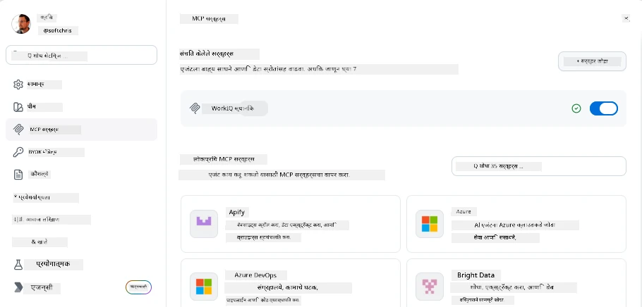
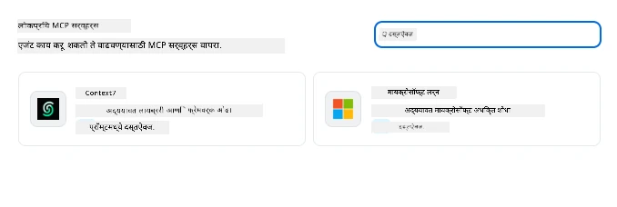
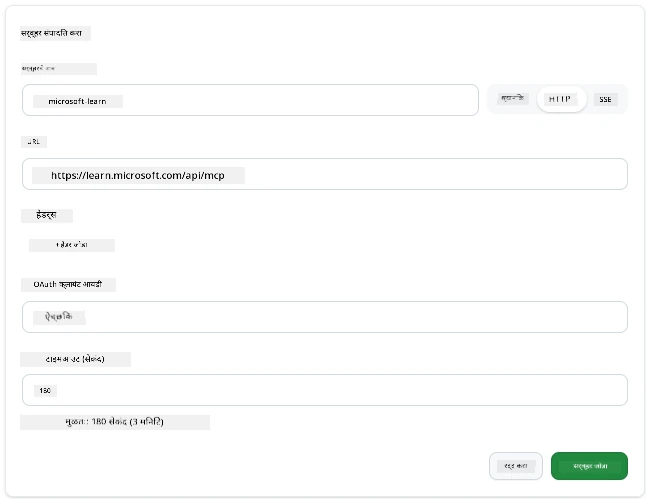
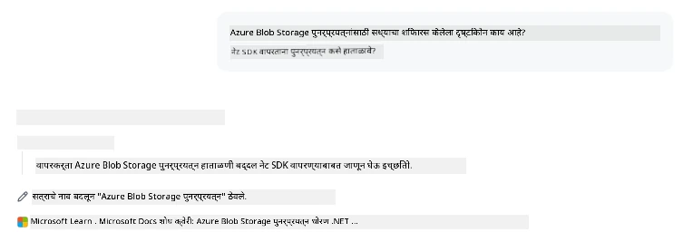
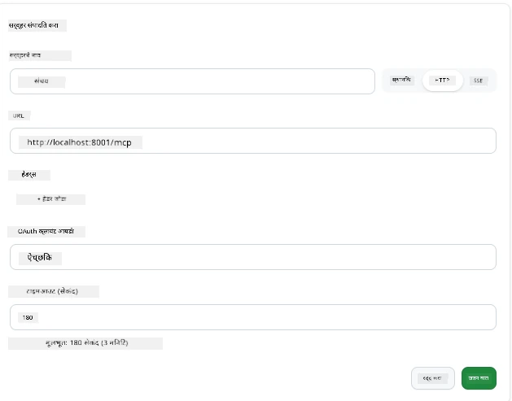
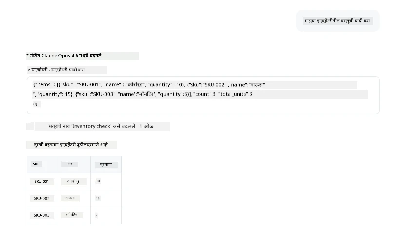
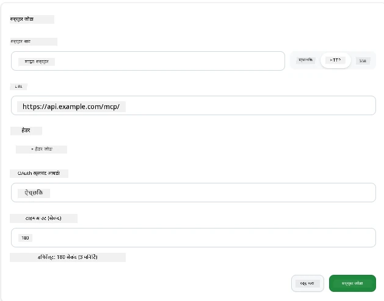
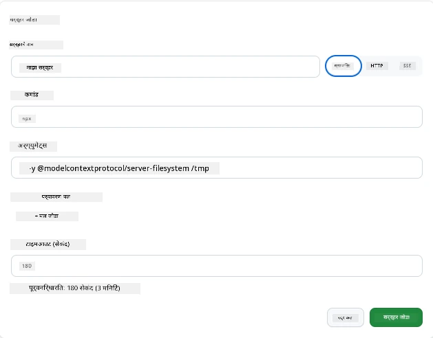

# GitHub Copilot अॅपमधील MCP सर्व्हर्सचा वापर

आता तुम्हाला कसे MCP कार्य करते ते माहित आहे. तुम्ही सर्व्हर्स तयार केले आहेत, टूल्स आणि संसाधने निश्चित केली आहेत, आणि क्लायंट्स कनेक्ट केले आहेत. जे आपण अद्याप केलेले नाही ते म्हणजे दृष्टीकोन उलटा पाहणे: सर्व्हर तयार करणारा तुम्ही असाल, तर *वापरकर्ता* म्हणून AI-शक्तीसह असलेल्या अॅपच्या वापरात असताना कसा अनुभव येतो?

[GitHub Copilot App](https://github.com/github/app) हा एक डेस्कटॉप अॅप आहे जो MCP सर्व्हर्स वापरू शकतो. MCP सर्व्हर्स कनेक्ट करून, तुम्ही एक नवीन पातळी अनलॉक करता: Copilot आता तुमच्या दस्तऐवजांमध्ये प्रवेश करू शकतो, तुमच्या अंतर्गत API कॉल करू शकतो, तुमच्या डेटाबेसमध्ये क्वेरी करू शकतो, किंवा कोणत्याही सर्व्हिसशी बोलू शकतो ज्याला तुम्ही सर्व्हरमध्ये रॅप केलेले आहे. अॅप हे होस्ट बनते; तुमचे MCP सर्व्हर्स त्याचे टूल्स बनतात.

हा धडा तुम्हाला सुरुवातीपासून ते शेवटपर्यंत त्या अनुभवातून घेऊन जातो—MCP सेटिंग्ज पॅनेल शोधण्यापासून एक वास्तविक दस्तऐवज सर्व्हर कनेक्ट करण्यापर्यंत आणि नंतर तुमचा स्वतःचा कस्टम सर्व्हर वायरिंग करण्यापर्यंत.

## शिकण्याचे उद्दिष्टे

या धड्याच्या शेवटी, तुम्ही सक्षम असाल:

- Copilot अॅपच्या सेटिंग्जमधील MCP सर्व्हर्स पॅनेल शोधणे आणि नेव्हिगेट करणे.
- एक होस्ट केलेला दस्तऐवज सर्व्हर कनेक्ट करणे आणि सत्रात त्याचा वापर करणे.
- एक कस्टम सर्व्हर नोंदणी करणे आणि Copilot त्याचे टूल्स कॉल करू शकतो याची खात्री करणे.
- सर्व्हर कसा कॉल होतो हे कन्फिगर करणे, पर्यावरणीय चल (environment variables) किंवा कस्टम हेडर्स (जर HTTP असेल तर) प्रदान करून.

## Copilot अॅप हे एक MCP होस्ट कसे आहे

तुमच्यासमोर मूलभूत कल्पना अशी आहे: **Copilot चे एजंट स्मार्ट आहेत, पण ते फक्त जे तुम्ही त्यांना सांगता तेच माहित आहे.** डीफॉल्टनुसार, एजंट तुमच्या वर्कस्पेसमधील फायली वाचू शकतो आणि टर्मिनल कमांड चालवू शकतो, पण ते तुमच्या डेटाबेसमध्ये क्वेरी करू शकत नाही, तुमच्या कॅलेंडरमध्ये पाहू शकत नाही, किंवा एखादा कस्टम API कॉल करू शकत नाही मदताशिवाय. इथे MCP सर्व्हर्स मदतीस येतात. हे Copilot आणि तुमच्या सिस्टम्स—डेटाबेस, व्हर्शन कंट्रोल, API, डिझाईन टूल्स यांच्यातील पूल आहेत—जे एजंटना माहिती आणि कार्ये मिळवून देतात ज्यांची त्यांना काम पूर्ण करण्यासाठी गरज असते.

चला तर मग तुमच्या अॅपच्या MCP सर्व्हर्ससाठी त्या सेटिंग्ज शोधूया.

## चरण 1: MCP सेटिंग्ज पॅनेल शोधणे

Copilot अॅप उघडा आणि खाली डावीकडे असलेला गिअर (cog) आयकॉन शोधा आणि त्यावर क्लिक करा.


"Nकिवस यांतील 'MCP Servers' निवडा आणि तुम्हाला वर कन्स configured सर्व्हर्स पहायला मिळतील, खाली popular servers चे मार्केटप्लेस आणि वर "Add Server" बटण असे दिसेल:



हे तुमचे नियंत्रण केंद्र आहे. येथे तुम्ही सर्व्हर्स जोडू, काढू, सक्रिय करू आणि निष्क्रिय करू शकता. बदल नवीन सत्रांसाठी लागू होतात; जर तुमच्याकडे एक सत्र उघडे असेल, तर यादी बदलल्यानंतर नवीन सत्र सुरू करावे लागेल.

## चरण 2: दस्तऐवज सर्व्हर कनेक्ट करणे

चला लगेच काही उपयुक्त करूया. Microsoft Docs MCP सर्व्हर Copilot ला अधिकृत Microsoft दस्तऐवजांमध्ये प्रवेश देतो. यात Azure, .NET, TypeScript आणि बरेच काही आहे. एजंट त्याच्या प्रशिक्षण डेटावर अवलंबून राहण्याऐवजी (ज्याची कटऑफ तारीख असते), ती क्वेरी वेळेस सध्याचे दस्तऐवज मिळवू शकतो.

हे जोडण्याचा मार्ग खालीलप्रमाणे:

1. लोकप्रिय सर्व्हर्स ग्रिडमध्ये **learn** टाइप करा आणि "Microsoft Learn" नावाचा सर्व्हर निवडा.

   

   क्लिक केल्यावर, एक फॉर्म येतो जिथे नाव, ट्रान्सपोर्ट प्रकार आणि URL भरलेले असतात, तुम्हाला फक्त "Add Server" क्लिक करायचे आहे.

2. "Add Server" क्लिक करा, सर्व्हरशी कनेक्ट होण्यासाठी काही सेकंद लागतील.

   

   एकदा जोडल्यावर, तो वरच्या भागात configured सर्व्हर म्हणून दिसेल. चला आता त्याचा वापर करून पाहूया.

3. डायलॉग बंद करा आणि Quick chat निवडा.

4. खालील प्रॉम्प्ट टाका जे Microsoft Learn सर्व्हरवरील टूल ट्रिगर करेल.

   ```text
   What's the current recommended approach for handling Azure Blob Storage 
   retries using the .NET SDK?
   ```

   

तुम्हाला दिसेल की ते आपण जोडलेला MCP सर्व्हर कसा संदर्भित करते.

## चरण 3: कस्टम stdio सर्व्हर कनेक्ट करणे

प्रिसेट्स सोयीचे आहेत, पण खरी ताकद म्हणजे तुमचे स्वतःचे सर्व्हर्स कनेक्ट करणे. समजा तुम्ही एक सर्व्हर तयार केला आहे (किंवा दिला आहे) जो तुमच्या अंतर्गत API किंवा कंपनी ज्ञानसंग्रहाला एक्सपोज करतो. या प्रकरणात, आपण कंपनीच्या इन्व्हेंटरी व्यवस्थापनासाठी तयार केलेला MCP सर्व्हर वापरणार आहोत.

1. गिअरवर क्लिक करा आणि पुन्हा "MCP servers" निवडा.

2. "Add Server" बटण आणि "+ Add Custom server" निवडा, खालील माहिती भरा:

   - नाव: `Inventory Server`
   - उजवीकडे ट्रान्सपोर्ट निवडा, **http**

   "Add Server" निवडा आणि तो तुमच्या configured सर्व्हर्सच्या यादीत दिसेल.

   

4. त्याचा प्रयोग करण्यासाठी, खालीप्रमाणे एक प्रॉम्प्ट चालवा:

    ```
    list inventory
    ```

   

   आता तुम्हाला तुमच्या कस्टम-बिल्ट सर्व्हरकडून इन्व्हेंटरी वस्तूंची यादी परत येताना दिसेल.

छान, आता तुम्हाला एक्स्टर्नल आणि स्वतःचे MCP सर्व्हर्स Copilot अॅपमध्ये कसे जोडायचे याची चांगली समज आहे. पुढे, गुपिते आणि पर्यावरणीय चलांविषयी बोलूया.

## चरण 4: प्रगत सेटिंग्ज

आत्तापर्यंत, तुम्ही पाहिले कसे MCP सर्व्हर्स जोडायचे जिथे तुम्ही फक्त नाव आणि URL देता. पण तुमच्या सर्व्हरला API की किंवा काही इतर मूल्य हवे असेल तर? तर, ट्रान्सपोर्ट प्रकारानुसार, आपण त्याला हवी ती माहिती पुरवू शकतो.

- **http किंवा SSE ट्रान्सपोर्ट**: येथे आपण आवश्यकता भासल्यास हेडर्स सेट करू शकतो.

   Authentication साठी, उदाहरणार्थ Authorization हेडर देऊ शकता. त्याची किंमत स्थिर स्ट्रिंग असू शकते. तुम्ही OAuth वापरत असल्यास, त्याऐवजी OAuth क्लायंट ID देऊ शकता.

   

- **stdio ट्रान्सपोर्ट**: पर्यावरणीय चल (environment variables) सेट करता येतात.

   येथे तुम्ही सर्व्हर सुरू करताना पास करावयाच्या लागणाऱ्या पर्यावरणीय चलांची संख्या निर्दिष्ट करू शकता.

   

## सारांश

Copilot अॅप MCP सर्व्हर्सना एजंटच्या क्षमता विस्ताराच्या पहिल्या श्रेणीतील विस्तारांप्रमाणे व्यवहार करतो. या धड्यामध्ये तुम्ही MCP सर्व्हर्स जोडण्यापासून ते सत्रात त्यांचा वापर करण्यापर्यंतचा पूर्ण प्रवास पाहिला. तुम्ही आता सार्वजनिक सर्व्हर्स, अंतर्गत API आणि कस्टम टूल्स कनेक्ट करू शकता, ज्यामुळे तुमच्या एजंटना आवश्यक माहिती आणि क्रिया उपलब्ध होतात जेणेकरून ते स्वयंचलितपणे कामे पूर्ण करू शकतील.

## 📚 अतिरिक्त संसाधने

### अधिकृत दस्तऐवज

- [GitHub Copilot App](https://github.com/github/app)
- [MCP Specification](https://modelcontextprotocol.io/specification/2025-03-26) - मॉडेल कॉन्टेक्स्ट प्रोटोकॉल स्पेसिफिकेशन

### समुदाय
- [MCP Community Discord](https://discord.com/invite/ByRwuEEgH4) - थेट चर्चा
- [GitHub Discussions](https://github.com/microsoft/MCP-Server-and-PostgreSQL-Sample-Retail/discussions) - प्रश्न-उत्तर आणि शेअरिंग
- [Stack Overflow](https://stackoverflow.com/questions/tagged/model-context-protocol) - तांत्रिक प्रश्न

---

<!-- CO-OP TRANSLATOR DISCLAIMER START -->
**अस्वीकरण**:
हा दस्तऐवज AI भाषांतर सेवा [Co-op Translator](https://github.com/Azure/co-op-translator) चा वापर करून अनुवादित केला आहे. जरी आम्ही अचूकतेसाठी प्रयत्न करतो, तरी कृपया लक्षात घ्या की स्वयंचलित भाषांतरांमध्ये त्रुटी किंवा अचूकतेची कमतरता असू शकते. मूळ दस्तऐवज त्याच्या मूळ भाषेत अधिकृत स्रोत मानला पाहिजे. महत्त्वाची माहिती असल्यास, व्यावसायिक मानवी भाषांतराची शिफारस केली जाते. या भाषांतराच्या वापरामुळे उद्भवणाऱ्या कोणत्याही गैरसमज किंवा चुकीच्या अर्थलावणीसाठी आम्ही जबाबदार नाही.
<!-- CO-OP TRANSLATOR DISCLAIMER END -->