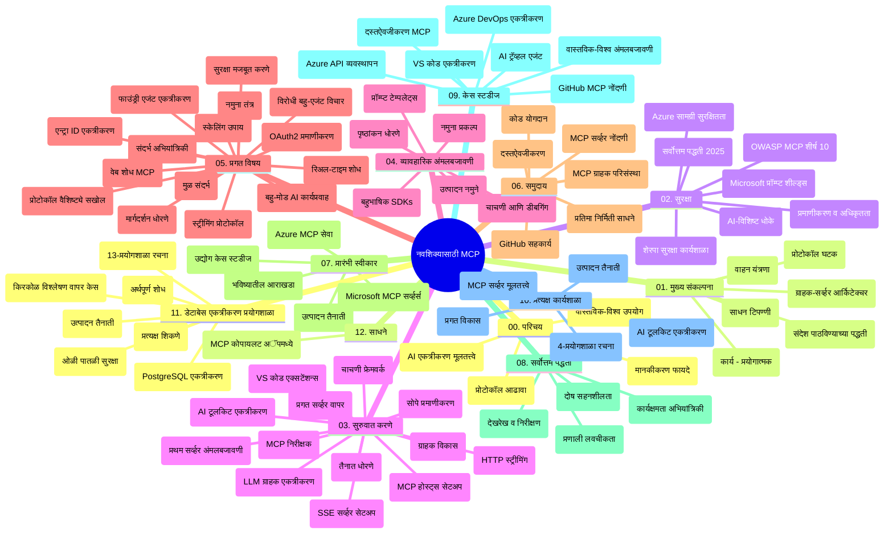

# सुरुवातीसाठी मॉडेल कॉन्टेक्स्ट प्रोटोकॉल (MCP) - अभ्यास मार्गदर्शक

हा अभ्यास मार्गदर्शक "सुरुवातीसाठी मॉडेल कॉन्टेक्स्ट प्रोटोकॉल (MCP)" अभ्यासक्रमासाठी रेपॉजिटरीची रचना आणि सामग्री याचा आढावा देतो. रेपॉजिटरीमध्ये कार्यक्षमपणे नेव्हिगेट करण्यासाठी आणि उपलब्ध संसाधनांचा जास्तीत जास्त फायदा घेण्यासाठी हा मार्गदर्शक वापरा.

## रेपॉजिटरी आढावा

मॉडेल कॉन्टेक्स्ट प्रोटोकॉल (MCP) हे एआय मॉडेल्स आणि क्लायंट अप्लिकेशन्समधील संवादांसाठी एक सर्वमान्य फ्रेमवर्क आहे. प्रामुख्याने Anthropic यांनी तयार केलेले MCP आता अधिक व्यापक MCP समुदायाद्वारे अधिकृत GitHub संघटनेत व्यवस्थापित केले जाते. ही रेपॉजिटरी C#, Java, JavaScript, Python, आणि TypeScript मध्ये हाताळणी कोड उदाहरणांसह समर्पित अभ्यासक्रम पुरवते, जे एआय विकासक, सिस्टीम आर्किटेक्ट्स आणि सॉफ्टवेअर अभियांत्रिकींसाठी डिझाइन केलेले आहे.

## दृश्य अभ्यासक्रम नकाशा

## रेपॉजिटरीची रचना

रेपॉजिटरी मुख्यत्वे बाराही विभागांमध्ये वर्गीकृत आहे, प्रत्येक विभाग MCP च्या वेगवेगळ्या पैलूंवर लक्ष केंद्रित करतो:

1. **परिचय (00-Introduction/)**
   - मॉडेल कॉन्टेक्स्ट प्रोटोकॉलचा आढावा
   - एआय पाइपलाइन्समधील मानकीकरण का महत्त्वाचे आहे
   - व्यावहारिक वापर आणि फायदे

2. **मूलभूत संकल्पना (01-CoreConcepts/)**
   - क्लायंट-सर्व्हर आर्किटेक्चर
   - मुख्य प्रोटोकॉल घटक
   - MCP मधील मेसेजिंग पॅटर्न्स

3. **सुरक्षा (02-Security/)**
   - MCP-आधारित प्रणालीतील सुरक्षा धोके
   - सुरक्षित अंमलबजावणीसाठी सर्वोत्तम पद्धती
   - प्रमाणीकरण आणि अधिकृतरण धोरणे
   - **संपूर्ण सुरक्षा दस्तऐवजीकरण**:
     - MCP सुरक्षा सर्वोत्तम पद्धती 2025
     - Azure कंटेंट सेफ्टी अंमलबजावणी मार्गदर्शक
     - MCP सुरक्षा नियंत्रण आणि तंत्रे
     - MCP सर्वोत्तम पद्धती जलद संदर्भ
   - **महत्वाच्या सुरक्षा विषयांवर**:
     - प्रॉम्प्ट इंजेक्शन आणि टूल पॉइझनिंग हल्ले
     - सेशन हायजॅकिंग आणि भ्रमित डेप्युटी समस्या
     - टोकन पासथ्रू कमजोर्या
     - अति परवानग्या आणि प्रवेश नियंत्रण
     - एआय घटकांसाठी सप्लाय चेन सुरक्षा
     - Microsoft प्रॉम्प्ट शील्ड्स एकत्रीकरण

4. **प्रारंभ करणे (03-GettingStarted/)**
   - पर्यावरण सेटअप आणि कॉन्फिगरेशन
   - मूलभूत MCP सर्व्हर आणि क्लायंट तयार करणे
   - विद्यमान अप्लिकेशन्सबरोबर समाकलन
   - या विभागात समाविष्ट विभाग:
     - प्रथम सर्व्हर अंमलबजावणी
     - क्लायंट विकास
     - LLM क्लायंट समाकलन
     - VS कोड समाकलन
     - Server-Sent Events (SSE) सर्व्हर
     - प्रगत सर्व्हर वापर
     - HTTP स्ट्रीमिंग
     - AI टूलकिट समाकलन
     - चाचणी धोरणे
     - परिनियोजन मार्गदर्शक

5. **व्यावहारिक अंमलबजावणी (04-PracticalImplementation/)**
   - वेगवेगळ्या प्रोग्रामिंग भाषांमधील SDK वापर
   - डिबगिंग, चाचणी, आणि प्रमाणीकरण तंत्रे
   - पुनर्वापरयोग्य प्रॉम्प्ट टेम्पलेट्स आणि कार्यप्रवाह तयार करणे
   - अंमलबजावणी उदाहरणांसह नमुना प्रकल्प

6. **प्रगत विषय (05-AdvancedTopics/)**
   - कॉन्टेक्स्ट अभियांत्रिकी तंत्र
   - Foundry एजंट समाकलन
   - मल्टी-मोडल AI कार्यप्रवाह 
   - OAuth2 प्रमाणीकरण प्रात्यक्षिके
   - रिअल-टाइम शोध क्षमता
   - रिअल-टाइम स्ट्रीमिंग
   - रूट कॉन्टेक्स्ट्स अंमलबजावणी
   - मार्गक्रमण धोरणे
   - सॅम्पलिंग तंत्रे
   - स्केलिंग अप्रोचेस
   - सुरक्षा विचार
   - Entra ID सुरक्षा एकत्रीकरण
   - वेब शोध समाकलन
   - विरोधात्मक मल्टी-एजंट तर्कशास्त्र (वादविवाद नमुने)

7. **समुदाय योगदान (06-CommunityContributions/)**
   - कोड आणि दस्तऐवज देण्याची पद्धत
   - GitHub द्वारे सहकार्य
   - समुदाय-आधारित सुधारणा आणि अभिप्राय
   - विविध MCP क्लायंट्स वापरणे (Claude Desktop, Cline, VSCode)
   - लोकप्रिय MCP सर्व्हर्ससह काम करणे ज्यात इमेज जनरेशन समाविष्ट आहे

8. **आधीची स्वीकृतीतील धडे (07-LessonsfromEarlyAdoption/)**
   - वास्तवातील अंमलबजावणी आणि यशकथा
   - MCP-आधारित उपायांची रचना आणि वितरण
   - प्रवाह आणि भविष्यातील रोडमॅप
   - **Microsoft MCP सर्व्हर्स मार्गदर्शक**: 10 उत्पादनासाठी तयार Microsoft MCP सर्व्हर्ससाठी व्यापक मार्गदर्शक, जसे:
     - Microsoft Learn Docs MCP सर्व्हर
     - Azure MCP सर्व्हर (15+ विशेष कनेक्टर्स)
     - GitHub MCP सर्व्हर
     - Azure DevOps MCP सर्व्हर
     - MarkItDown MCP सर्व्हर
     - SQL Server MCP सर्व्हर
     - Playwright MCP सर्व्हर
     - Dev Box MCP सर्व्हर
     - Microsoft Foundry MCP सर्व्हर
     - Microsoft 365 Agents Toolkit MCP सर्व्हर

9. **सर्वोत्तम पद्धती (08-BestPractices/)**
   - कार्यक्षमता ट्यूनिंग आणि ऑप्टिमायझेशन
   - दोष सहिष्णू MCP प्रणाली डिझाइन करणे
   - चाचणी आणि लवचीकता धोरणे

10. **केस स्टडीज (09-CaseStudy/)**
    - **सात सर्वसमावेशक केस स्टडीज** ज्या MCP च्या बहुमुखीतेचे विविध संदर्भांत प्रदर्शन करतात:
    - **Azure AI ट्रॅव्हल एजंट्स**: Azure OpenAI आणि AI शोधासह मल्टी-एजंट ऑर्केस्ट्रेशन
    - **Azure DevOps समाकलन**: यूट्यूब डेटा अपडेटसह कार्यप्रवाह प्रक्रियेचे स्वयंचलीकरण
    - **रिअल-टाइम दस्तऐवज पुनर्प्राप्ती**: Python कन्सोल क्लायंटसह स्ट्रीमिंग HTTP
    - **आंतरक्रियात्मक अभ्यास योजना जनरेटर**: Chainlit वेब अॅप सह संभाषणात्मक AI
    - **एडिटरमधील दस्तऐवज**: GitHub Copilot कार्यप्रवाहांसह VS Code समाकलन
    - **Azure API व्यवस्थापन**: एंटरप्राइझ API समाकलन आणि MCP सर्व्हर निर्मिती
    - **GitHub MCP रजिस्ट्री**: पर्यावरण विकास आणि एजंटिक समाकलन प्लॅटफॉर्म
    - एंटरप्राइझ समाकलन, विकासक उत्पादकता, आणि पर्यावरण विकास यावर आधारित अंमलबजावणी उदाहरणे

11. **हाताळणी कार्यशाळा (10-StreamliningAIWorkflowsBuildingAnMCPServerWithAIToolkit/)**
    - MCP आणि AI टूलकिट एकत्र करणारी व्यापक हाताळणी कार्यशाळा
    - एआय मॉडेल्स आणि वास्तविक जगातील टूल्स यातील बुद्धिमान अप्लिकेशन्स तयार करणे
    - मूलभूत गोष्टी, कस्टम सर्व्हर विकास, आणि उत्पादन वितरण धोरणे यावर व्यावहारिक मॉड्यूल्स
    - **लॅब स्ट्रक्चर**:
      - लॅब 1: MCP सर्व्हर मूलभूत तत्त्वे
      - लॅब 2: प्रगत MCP सर्व्हर विकास
      - लॅब 3: AI टूलकिट समाकलन
      - लॅब 4: उत्पादन वितरण आणि स्केलिंग
    - स्टेप-बाय-स्टेप सूचनांसह लॅब-आधारित शिक्षण पद्धत

12. **MCP सर्व्हर डेटाबेस समाकलन लॅब्स (11-MCPServerHandsOnLabs/)**
    - पोस्टग्रेसक्यूएल समाकलनासह उत्पादनासाठी तयार MCP सर्व्हर तयार करण्यासाठी **संपूर्ण 13 लॅब शिक्षण मार्ग**
    - Zava रिटेल वापर प्रकरणाद्वारे वास्तविक रिटेल अॅनालिटिक्स अंमलबजावणी
    - एंटरप्रायझ-ग्रेड पॅटर्न्स जसे की रो लेव्हल सिक्युरिटी (RLS), अर्थपूर्ण शोध, आणि बहु-भाडेकरू डेटा प्रवेश
    - **पूर्ण लॅब रचना**:
      - **लॅब 00-03: तळाशी** - परिचय, आर्किटेक्चर, सुरक्षा, पर्यावरण सेटअप
      - **लॅब 04-06: MCP सर्व्हर तयार करणे** - डेटाबेस डिझाइन, MCP सर्व्हर अंमलबजावणी, टूल विकास
      - **लॅब 07-09: प्रगत वैशिष्ट्ये** - अर्थपूर्ण शोध, चाचणी आणि डिबगिंग, VS कोड समाकलन
      - **लॅब 10-12: उत्पादन आणि सर्वोत्तम पद्धती** - परिनियोजन, देखरेख, ऑप्टिमायझेशन
    - **आवृत्त तंत्रज्ञान**: FastMCP फ्रेमवर्क, PostgreSQL, Azure OpenAI, Azure कंटेनर अॅप्स, अॅप्लिकेशन इनसाइट्स
    - **शिक्षण निष्कर्ष**: उत्पादनासाठी तयार MCP सर्व्हर्स, डेटाबेस समाकलन पॅटर्न्स, AI-सक्षम अॅनालिटिक्स, एंटरप्राइझ सुरक्षा

13. **टूलिंग (12-tooling/)**
    - MCP कॉपिलॉट अॅप आणि इतर टूल्समध्ये कसे वापरायचे हे जाणून घ्या

## अतिरिक्त संसाधने

रेपॉजिटरीमध्ये पूरक संसाधने समाविष्ट आहेत:

- **Images फोल्डर**: अभ्यासक्रमभर वापरलेले आकृती आणि चित्रे
- **भाषांतर**: दस्तऐवजांचे स्वयंचलित भाषांतरासह बहुभाषिक समर्थन
- **अधिकृत MCP संसाधने**:
  - [MCP Documentation](https://modelcontextprotocol.io/)
  - [MCP Specification](https://spec.modelcontextprotocol.io/)
  - [MCP GitHub Repository](https://github.com/modelcontextprotocol)

## ही रेपॉजिटरी कशी वापरायची

1. **अनुक्रमी शिक्षण**: संरचित शिक्षण अनुभवासाठी (00 ते 11) अध्यायांत अनुक्रमे अनुसरण करा.
2. **भाषा-विशिष्ट लक्ष**: जर तुम्हाला एखाद्या विशिष्ट प्रोग्रामिंग भाषेत रस असेल तर आवडत्या भाषेतील अंमलबजावणुकीसाठी नमुना निर्देशिका तपासा.
3. **व्यावहारिक अंमलबजावणी**: पर्यावरण सेटअप करण्यासाठी आणि तुमचा पहिला MCP सर्व्हर आणि क्लायंट तयार करण्यासाठी "प्रारंभ करणे" विभागातून सुरुवात करा.
4. **प्रगत शोध**: मूलभूत गोष्टी समजल्यावर, आपल्या ज्ञानाचा विस्तार करण्यासाठी प्रगत विषयांमध्ये जा.
5. **समुदाय सहभाग**: MCP समुदायामध्ये GitHub चर्चा आणि Discord चॅनेल्सद्वारे सहभागी व्हा, तज्ञ आणि सह-विकसकांशी संपर्क साधा.

## MCP क्लायंट्स आणि टूल्स

अभ्यासक्रम विविध MCP क्लायंट्स आणि टूल्स कव्हर करतो:

1. **अधिकृत क्लायंट्स**:
   - Visual Studio Code 
   - Visual Studio Code मधील MCP
   - Claude Desktop
   - VSCode मधील Claude
   - Claude API

2. **समुदाय क्लायंट्स**:
   - Cline (टर्मिनल-आधारित)
   - Cursor (कोड एडिटर)
   - ChatMCP
   - Windsurf

3. **MCP व्यवस्थापन टूल्स**:
   - MCP CLI
   - MCP Manager
   - MCP Linker
   - MCP Router

## लोकप्रिय MCP सर्व्हर्स

रेपॉजिटरी विविध MCP सर्व्हर्सची ओळख करून देते, ज्यात समाविष्ट आहेत:

1. **अधिकृत Microsoft MCP सर्व्हर्स**:
   - Microsoft Learn Docs MCP सर्व्हर
   - Azure MCP सर्व्हर (15+ विशेष कनेक्टर्स)
   - GitHub MCP सर्व्हर
   - Azure DevOps MCP सर्व्हर
   - MarkItDown MCP सर्व्हर
   - SQL Server MCP सर्व्हर
   - Playwright MCP सर्व्हर
   - Dev Box MCP सर्व्हर
   - Microsoft Foundry MCP सर्व्हर
   - Microsoft 365 Agents Toolkit MCP सर्व्हर

2. **अधिकृत संदर्भ सर्व्हर्स**:
   - फाइलसिस्टम
   - Fetch
   - मेमोरी
   - सेक्वेन्शियल थिंकिंग

3. **इमेज जनरेशन**:
   - Azure OpenAI DALL-E 3
   - Stable Diffusion WebUI
   - Replicate

4. **विकास टूल्स**:
   - Git MCP
   - टर्मिनल कंट्रोल
   - कोड असिस्टंट

5. **विशेषीकृत सर्व्हर्स**:
   - Salesforce
   - Microsoft Teams
   - Jira & Confluence

## योगदान देणे

ही रेपॉजिटरी समुदायातील योगदानांचे स्वागत करते. MCP पर्यावरणासाठी प्रभावीपणे योगदान कसे द्यावे यासाठी समुदाय योगदान विभाग पहा.

----

*हा अभ्यास मार्गदर्शक शेवटचा अपडेट ५ फेब्रुवारी २०२६ रोजी करण्यात आला असून त्यात नवीनतम MCP Specification 2025-11-25 प्रतिबिंबित आहे आणि त्या दिवशीची रेपॉजिटरीचा आढावा प्रदान करतो. या नंतर रेपॉजिटरी सामग्री अपडेट केली जाऊ शकते.*

---

<!-- CO-OP TRANSLATOR DISCLAIMER START -->
**अस्वीकरण**:
हा दस्तऐवज AI भाषांतर सेवा [Co-op Translator](https://github.com/Azure/co-op-translator) चा वापर करून अनुवादित केला आहे. जरी आम्ही अचूकतेसाठी प्रयत्न करतो, तरी कृपया लक्षात घ्या की स्वयंचलित भाषांतरांमध्ये त्रुटी किंवा अचूकतेची कमतरता असू शकते. मूळ दस्तऐवज त्याच्या मूळ भाषेत अधिकृत स्रोत मानला पाहिजे. महत्त्वाची माहिती असल्यास, व्यावसायिक मानवी भाषांतराची शिफारस केली जाते. या भाषांतराच्या वापरामुळे उद्भवणाऱ्या कोणत्याही गैरसमज किंवा चुकीच्या अर्थलावणीसाठी आम्ही जबाबदार नाही.
<!-- CO-OP TRANSLATOR DISCLAIMER END -->