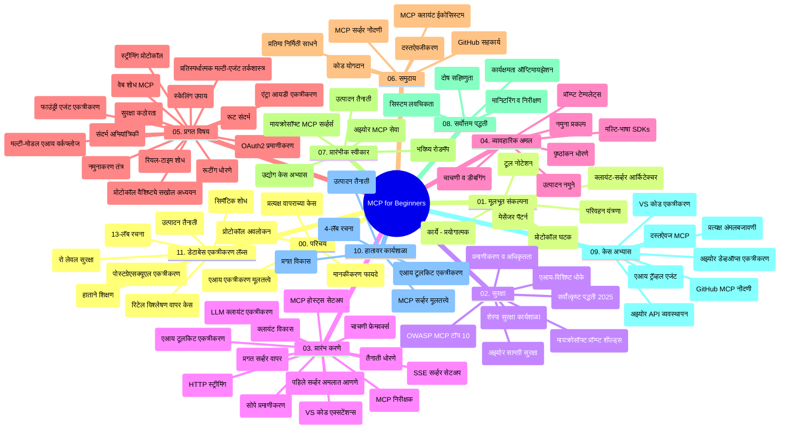

# प्रारंभकर्त्यांसाठी मॉडेल संदर्भ प्रोटोकॉल (MCP) - अभ्यास मार्गदर्शक

हा अभ्यास मार्गदर्शक "प्रारंभकर्त्यांसाठी मॉडेल संदर्भ प्रोटोकॉल (MCP)" अभ्यासक्रमासाठी रिपॉझिटरीची रचना आणि सामग्री याचा आढावा देतो. या मार्गदर्शकाचा वापर करून तुम्ही रिपॉझिटरीमध्ये कार्यक्षमतेने नेव्हिगेट करू शकता आणि उपलब्ध संसाधनांचा जास्तीत जास्त फायदा घेऊ शकता.

## रिपॉझिटरीचा आढावा

मॉडेल संदर्भ प्रोटोकॉल (MCP) हे AI मॉडेल्स आणि क्लायंट अनुप्रयोगांमधील संवादासाठी एक मानकीकृत फ्रेमवर्क आहे. अंथमॉर्फिक यांनी सुरुवातीला तयार केलेले MCP आता अधिक व्यापक MCP समुदायाद्वारे अधिकृत GitHub संस्थेमार्फत व्यवस्थापित केले जाते. ही रिपॉझिटरी C#, Java, JavaScript, Python, आणि TypeScript मध्ये हाताळणी असलेले कोड उदाहरणांसह एक व्यापक अभ्यासक्रम प्रदान करते, जो AI विकासक, प्रणाली अभियांत्रिकी आणि सॉफ्टवेअर अभियंत्यांसाठी डिझाइन केलेला आहे.

## दृश्य अभ्यासक्रम नकाशा

## रिपॉझिटरीची रचना

ही रिपॉझिटरी अकरा मुख्य विभागांमध्ये विभागली आहे, प्रत्येक MCP च्या वेगवेगळ्या पैलूंवर लक्ष केंद्रित करते:

1. **परिचय (00-Introduction/)**
   - मॉडेल संदर्भ प्रोटोकॉलचे आढावा
   - AI पाईपलाईन्समध्ये मानकीकरण का महत्त्वाचे आहे
   - व्यावहारिक वापर केसेस आणि फायदे

2. **मूलभूत संकल्पना (01-CoreConcepts/)**
   - क्लायंट-सर्व्हर आर्किटेक्चर
   - मुख्य प्रोटोकॉल घटक
   - MCP मधील संदेशांची पद्धत

3. **सुरक्षा (02-Security/)**
   - MCP आधारित प्रणालीतील सुरक्षा धोके
   - सुरक्षित अंमलबजावणीसाठी सर्वोत्तम पद्धती
   - प्रमाणीकरण आणि अधिकार धोरणे
   - **व्यापक सुरक्षा दस्तऐवजीकरण**:
     - MCP सुरक्षा सर्वोत्तम पद्धती 2025
     - Azure कंटेंट सेफ्टी अंमलबजावणी मार्गदर्शक
     - MCP सुरक्षा नियंत्रण आणि तंत्रे
     - MCP सर्वोत्तम पद्धती जलद संदर्भ
   - **महत्त्वाच्या सुरक्षा विषयांमध्ये**:
     - प्रॉम्प्ट इंजेक्शन आणि टूल विषबाधा हल्ले
     - सत्र ताबा आणि गोंधळलेले डेप्युटी समस्या
     - टोकन पासथ्रू असुरक्षा
     - जास्तीच्या परवानग्या आणि प्रवेश नियंत्रण
     - AI घटकांसाठी पुरवठा साखळी सुरक्षा
     - Microsoft प्रॉम्प्ट शील्ड्स एकत्रीकरण

4. **प्रारंभ करणे (03-GettingStarted/)**
   - पर्यावरण सेटअप आणि कॉन्फिगरेशन
   - मूलभूत MCP सर्व्हर आणि क्लायंट तयार करणे
   - विद्यमान अनुप्रयोगांमध्ये समाकलन
   - यामध्ये विभागांचा समावेश आहे:
     - प्रथम सर्व्हर अंमलबजावणी
     - क्लायंट विकास
     - LLM क्लायंट समाकलन
     - VS कोड समाकलन
     - सर्व्हर-सेंट इव्हेंट्स (SSE) सर्व्हर
     - प्रगत सर्व्हर वापर
     - HTTP स्ट्रिमिंग
     - AI टूलकिट समाकलन
     - चाचणी धोरणे
     - तैनाती मार्गदर्शक

5. **व्यावहारिक अंमलबजावणी (04-PracticalImplementation/)**
   - विविध प्रोग्रॅमिंग भाषांमध्ये SDK वापरणे
   - डिबगिंग, चाचणी, आणि पडताळणी तंत्रे
   - पुनर्वापरयोग्य प्रॉम्प्ट टेम्पलेट्स आणि वर्कफ्लोज तयार करणे
   - अंमलबजावणीचे नमुना प्रकल्प

6. **प्रगत विषय (05-AdvancedTopics/)**
   - संदर्भ अभियांत्रिकी तंत्रे
   - फाउंड्री एजंट समाकलन
   - मल्टी-मॉडल AI वर्कफ्लोज
   - OAuth2 प्रमाणीकरण डेमो
   - रिअल-टाइम शोध क्षमता
   - रिअल-टाइम स्ट्रिमिंग
   - रूट संदर्भांची अंमलबजावणी
   - रूटिंग धोरणे
   - नमुना तंत्रे
   - मोजणी पद्धती
   - सुरक्षा विचार
   - Entra ID सुरक्षा समाकलन
   - वेब शोध समाकलन
   - प्रतिद्वंद्वी बहु-एजंट तर्कशास्त्र (वादविवाद पद्धती)

7. **समुदाय योगदान (06-CommunityContributions/)**
   - कोड आणि दस्तऐवज कसे योगदान द्यावे
   - GitHub द्वारे सहयोग कसे करावे
   - समुदायास चालवलेल्या सुधारणांवर आणि अभिप्रायावर काम
   - विविध MCP क्लायंट वापरणे (Claude डेस्कटॉप, Cline, VSCode)
   - लोकप्रिय MCP सर्व्हर जसे की इमेज जनरेशन सोबत काम

8. **प्रारंभिक अवलंबनातून धडे (07-LessonsfromEarlyAdoption/)**
   - वास्तविक जगातील अंमलबजावण्या आणि यशोगाथा
   - MCP आधारित उपाय बनविणे आणि तैनात करणे
   - ट्रेंड्स आणि भविष्याची योजना
   - **Microsoft MCP सर्व्हर गाईड**: 10 उत्पादनासाठी तयार Microsoft MCP सर्व्हरचा समग्र मार्गदर्शक:
     - Microsoft Learn Docs MCP सर्व्हर
     - Azure MCP सर्व्हर (15+ तज्ञ कनेक्टर्स)
     - GitHub MCP सर्व्हर
     - Azure DevOps MCP सर्व्हर
     - MarkItDown MCP सर्व्हर
     - SQL Server MCP सर्व्हर
     - Playwright MCP सर्व्हर
     - Dev Box MCP सर्व्हर
     - Microsoft Foundry MCP सर्व्हर
     - Microsoft 365 एजंट्स टूलकिट MCP सर्व्हर

9. **सर्वोत्तम पद्धती (08-BestPractices/)**
   - कामगिरी ट्यूनिंग आणि ऑप्टिमायझेशन
   - दोष सहिष्णु MCP प्रणाली डिझायनिंग
   - चाचणी आणि लवचिकता धोरणे

10. **केस स्टडीज (09-CaseStudy/)**
    - MCP च्या बहुविध परिस्थितीत सात व्यापक केस स्टडीज दाखवितात:
    - **Azure AI ट्रॅव्हल एजंट्स**: Azure OpenAI आणि AI शोधासह बहु-एजंट संघटन
    - **Azure DevOps समाकलन**: YouTube डेटा अपडेटसह वर्कफ्लो प्रक्रियेचे स्वयंचलीकरण
    - **रिअल-टाइम दस्तऐवज पुनर्प्राप्ती**: Python कन्सोल क्लायंट HTTP स्ट्रिमिंगसह
    - **इंटरऍक्टिव स्टडी प्लॅन जनरेटर**: Chainlit वेब अ‍ॅप संभाषणात्मक AI सह
    - **एडीटरमधील दस्तऐवज**: VS कोड GitHub Copilot वर्कफ्लोज सह समाकलन
    - **Azure API व्यवस्थापन**: MCP सर्व्हर निर्मितीसह एंटरप्राइझ API समाकलन
    - **GitHub MCP रेजिस्ट्रि**: इकोसिस्टम विकास आणि एजंटिक समाकलन प्लॅटफॉर्म
    - एंटरप्राइझ समाकलन, विकासक उत्पादकता, आणि इकोसिस्टम विकासातील अंमलबजावणी उदाहरणे

11. **हाताळणी कार्यशाळा (10-StreamliningAIWorkflowsBuildingAnMCPServerWithAIToolkit/)**
    - MCP आणि AI टूलकिट यांचा संगम असलेली व्यापक हाताळणी कार्यशाळा
    - AI मॉडेल्सना वास्तविक जगातील साधनांसह जोडणारे बुद्धिमान अनुप्रयोग तयार करणे
    - मूलतत्वे, कस्टम सर्व्हर विकास, आणि उत्पादन तैनाती धोरणे यांचा समावेश करणारे व्यावहारिक मॉड्यूल्स
    - **प्रयोगशाळा रचना**:
      - प्रयोगशाळा 1: MCP सर्व्हर मूलतत्त्वे
      - प्रयोगशाळा 2: प्रगत MCP सर्व्हर विकास
      - प्रयोगशाळा 3: AI टूलकिट समाकलन
      - प्रयोगशाळा 4: उत्पादन तैनाती आणि मापन
    - चरण-दर-चरण सूचनांसह प्रयोगशाळा आधारित शिकण्याची पद्धत

12. **MCP सर्व्हर डेटाबेस समाकलन प्रयोगशाळा (11-MCPServerHandsOnLabs/)**
    - PostgreSQL समाकलनासह उत्पादनासाठी तयार MCP सर्व्हर तयार करण्यासाठी **व्यापक 13-प्रयोगशाळा शिक्षण मार्ग** 
    - Zava रिटेल वापर प्रकरणासह **वास्तविक जगातील रिटेल विश्लेषण अंमलबजावणी**
    - **एंटरप्राइझ-ग्रेड पद्धती** जसे की रो लेव्हल सुरक्षा (RLS), सिमंटिक शोध, आणि बहु-भाडेकरू डेटाच्या प्रवेशासाठी पद्धती
    - **पूर्ण प्रयोगशाळा रचना**:
      - **प्रयोगशाळा 00-03: पाया** - परिचय, आर्किटेक्चर, सुरक्षा, पर्यावरण सेटअप
      - **प्रयोगशाळा 04-06: MCP सर्व्हर तयार करणे** - डेटाबेस डिझाइन, MCP सर्व्हर अंमलबजावणी, टूल विकास
      - **प्रयोगशाळा 07-09: प्रगत वैशिष्ट्ये** - सिमंटिक शोध, चाचणी आणि डिबगिंग, VS कोड समाकलन
      - **प्रयोगशाळा 10-12: उत्पादन आणि सर्वोत्तम पद्धती** - तैनाती, निरीक्षण, ऑप्टिमायझेशन
    - **तंत्रज्ञानांचा समावेश**: FastMCP फ्रेमवर्क, PostgreSQL, Azure OpenAI, Azure कंटेनर अ‍ॅप्स, अ‍ॅप्लिकेशन इन्साइट्स
    - **शिकण्याचे परिणाम**: उत्पादनासाठी तयार MCP सर्व्हर, डेटाबेस समाकलन पद्धती, AI-शक्तीमान विश्लेषण, एंटरप्राइझ सुरक्षा

## अतिरिक्त संसाधने

रिपॉझिटरी मध्ये समर्थन करणारे संसाधने समाविष्ट आहेत:

- **इमेजेस फोल्डर**: अभ्यासक्रमातील आकृत्या आणि चित्रे
- **भाषांतर**: दस्तऐवजाचे स्वयंचलित भाषांतरांसह बहुभाषिक समर्थन
- **अधिकृत MCP संसाधने**:
  - [MCP Documentation](https://modelcontextprotocol.io/)
  - [MCP Specification](https://spec.modelcontextprotocol.io/)
  - [MCP GitHub Repository](https://github.com/modelcontextprotocol)

## ही रिपॉझिटरी कशी वापरायची

1. **क्रमवार शिक्षण**: अध्याय क्रमाने (00 ते 11) अनुसरण करा, जेणेकरून सुव्यवस्थित शिकण्याचा अनुभव मिळेल.
2. **भाषा-विशिष्ट लक्ष**: जर तुम्हाला विशिष्ट प्रोग्रॅमिंग भाषा आवडत असेल तर तुमच्या पसंतीच्या भाषेमध्ये कार्यान्वयनांसाठी नमुना डिरेक्टरी एक्सप्लोर करा.
3. **व्यावहारिक अंमलबजावणी**: पर्यावरण सेटअप करण्यासाठी आणि तुमचा पहिला MCP सर्व्हर आणि क्लायंट तयार करण्यासाठी "प्रारंभ करणे" विभागातून सुरुवात करा.
4. **प्रगत अन्वेषण**: मूलभूत गोष्टी समजल्यावर प्रगत विषयांमध्ये खोलात जा आणि तुमचे ज्ञान वाढवा.
5. **समुदाय सहभाग**: GitHub चर्चा आणि Discord चॅनेल्सद्वारे MCP समुदायात सहभागी व्हा, तज्ञ आणि सह-विकसकांशी जुळा.

## MCP क्लायंट आणि टूल्स

अभ्यासक्रम विविध MCP क्लायंट आणि टूल्स समाविष्ट करतो:

1. **अधिकृत क्लायंट**:
   - व्हिज्युअल स्टुडिओ कोड
   - व्हिज्युअल स्टुडिओ कोडमधील MCP
   - Claude डेस्कटॉप
   - VSCode मधील Claude
   - Claude API

2. **समुदाय क्लायंट**:
   - Cline (टर्मिनल-आधारित)
   - Cursor (कोड संपादक)
   - ChatMCP
   - Windsurf

3. **MCP व्यवस्थापन टूल्स**:
   - MCP CLI
   - MCP Manager
   - MCP Linker
   - MCP Router

## लोकप्रिय MCP सर्व्हर

रिपॉझिटरी विविध MCP सर्व्हर सादर करते, ज्यात समाविष्ट आहे:

1. **अधिकृत Microsoft MCP सर्व्हर**:
   - Microsoft Learn Docs MCP सर्व्हर
   - Azure MCP सर्व्हर (15+ तज्ञ कनेक्टर्स)
   - GitHub MCP सर्व्हर
   - Azure DevOps MCP सर्व्हर
   - MarkItDown MCP सर्व्हर
   - SQL Server MCP सर्व्हर
   - Playwright MCP सर्व्हर
   - Dev Box MCP सर्व्हर
   - Microsoft Foundry MCP सर्व्हर
   - Microsoft 365 एजंट्स टूलकिट MCP सर्व्हर

2. **अधिकृत संदर्भ सर्व्हर**:
   - फाइलसिस्टम
   - फेटच
   - मेमरी
   - सिक्वेन्शिअल थिंकिंग

3. **प्रतिमा निर्मिती**:
   - Azure OpenAI DALL-E 3
   - Stable Diffusion WebUI
   - Replicate

4. **विकास टूल्स**:
   - Git MCP
   - टर्मिनल कंट्रोल
   - कोड असिस्टंट

5. **विशेष सर्व्हर**:
   - Salesforce
   - Microsoft Teams
   - Jira & Confluence

## योगदान देणे

ही रिपॉझिटरी समुदायाकडून योगदानांचे स्वागत करते. MCP इकोसिस्टममध्ये प्रभावी योगदान कसे करावे यासाठी समुदाय योगदान विभाग पहा.

----

*हा अभ्यास मार्गदर्शक शेवटचा अद्ययावत ५ फेब्रुवारी २०२६ रोजी झाला असून यात MCP स्पेसिफिकेशन २०२५-११-२५ चा नवीनतम आवर्तन प्रतिबिंबित आहे आणि त्या तारखेपर्यंतची रिपॉझिटरीची माहिती प्रदान करतो. या तारखेवर किंवा नंतर रिपॉझिटरी सामग्री अद्ययावत केली जाऊ शकते.*

---

<!-- CO-OP TRANSLATOR DISCLAIMER START -->
**अस्वीकरण**:
हा दस्तऐवज AI भाषांतर सेवा [Co-op Translator](https://github.com/Azure/co-op-translator) चा वापर करून अनुवादित केला आहे. जरी आम्ही अचूकतेसाठी प्रयत्न करतो, तरी कृपया लक्षात घ्या की स्वयंचलित भाषांतरांमध्ये त्रुटी किंवा अचूकतेची कमतरता असू शकते. मूळ दस्तऐवज त्याच्या मूळ भाषेत अधिकृत स्रोत मानला पाहिजे. महत्त्वाची माहिती असल्यास, व्यावसायिक मानवी भाषांतराची शिफारस केली जाते. या भाषांतराच्या वापरामुळे उद्भवणाऱ्या कोणत्याही गैरसमज किंवा चुकीच्या अर्थलावणीसाठी आम्ही जबाबदार नाही.
<!-- CO-OP TRANSLATOR DISCLAIMER END -->