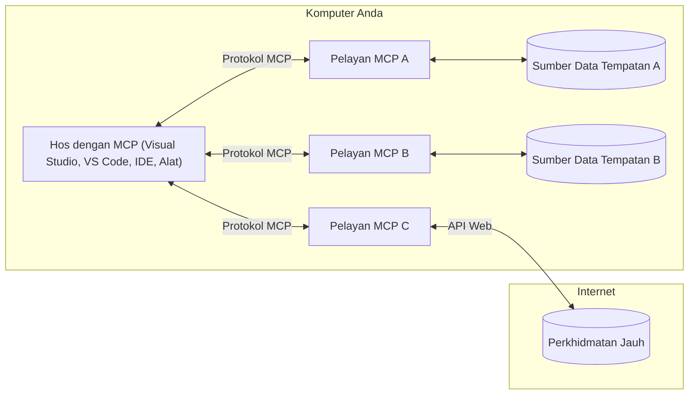

# Konsep Teras MCP: Menguasai Protokol Konteks Model untuk Integrasi AI

[](https://youtu.be/earDzWGtE84)

_(Klik imej di atas untuk menonton video pelajaran ini)_

[Protokol Konteks Model (MCP)](https://github.com/modelcontextprotocol) adalah rangka kerja standard yang kukuh yang mengoptimumkan komunikasi antara Model Bahasa Besar (LLM) dan alat luar, aplikasi, serta sumber data.  
Panduan ini akan membawa anda melalui konsep teras MCP. Anda akan belajar mengenai seni bina klien-pelayan, komponen penting, mekanisme komunikasi, dan amalan terbaik pelaksanaan.

- **Persetujuan Pengguna Eksplisit**: Semua akses data dan operasi memerlukan kelulusan pengguna yang jelas sebelum pelaksanaan. Pengguna mesti memahami dengan jelas data apa yang akan diakses dan tindakan apa yang akan dilakukan, dengan kawalan granular ke atas kebenaran dan kewenangan.

- **Perlindungan Privasi Data**: Data pengguna hanya didedahkan dengan persetujuan eksplisit dan mesti dilindungi oleh kawalan akses yang kukuh sepanjang keseluruhan kitaran hayat interaksi. Pelaksanaan mesti mencegah penghantaran data tanpa kebenaran dan mengekalkan sempadan privasi yang ketat.

- **Keselamatan Pelaksanaan Alat**: Setiap panggilan alat memerlukan persetujuan pengguna yang jelas dengan pemahaman yang baik tentang fungsi alat, parameter, dan potensi impak. Sempadan keselamatan yang kukuh mesti menghalang pelaksanaan alat yang tidak diingini, tidak selamat, atau berniat jahat.

- **Keselamatan Lapisan Pengangkutan**: Semua saluran komunikasi harus menggunakan mekanisme penyulitan dan pengesahan yang sesuai. Sambungan jauh harus melaksanakan protokol pengangkutan yang selamat dan pengurusan kelayakan yang betul.

#### Garis Panduan Pelaksanaan:

- **Pengurusan Kebenaran**: Laksanakan sistem kebenaran yang terperinci yang membenarkan pengguna mengawal pelayan, alat, dan sumber yang boleh diakses  
- **Pengesahan & Kewenangan**: Gunakan kaedah pengesahan yang selamat (OAuth, kekunci API) dengan pengurusan token dan tarikh luput yang betul  
- **Pengesahan Input**: Sahkan semua parameter dan input data mengikut skema yang ditakrifkan untuk mengelakkan serangan suntikan  
- **Pencatatan Audit**: Kekalkan log yang menyeluruh bagi semua operasi untuk pemantauan keselamatan dan pematuhan

## Gambaran Keseluruhan

Pelajaran ini meneroka seni bina asas dan komponen yang membentuk ekosistem Protokol Konteks Model (MCP). Anda akan belajar mengenai seni bina klien-pelayan, komponen utama, dan mekanisme komunikasi yang menggerakkan interaksi MCP.

## Objektif Pembelajaran Utama

Menjelang akhir pelajaran ini, anda akan:

- Memahami seni bina klien-pelayan MCP.  
- Mengenal pasti peranan dan tanggungjawab Hos, Klien, dan Pelayan.  
- Menganalisis ciri-ciri teras yang menjadikan MCP lapisan integrasi yang fleksibel.  
- Belajar bagaimana maklumat mengalir dalam ekosistem MCP.  
- Mendapatkan pandangan praktikal melalui contoh kod dalam .NET, Java, Python, dan JavaScript.

## Seni Bina MCP: Tinjauan Mendalam

Ekosistem MCP dibina berdasarkan model klien-pelayan. Struktur modular ini membolehkan aplikasi AI berinteraksi dengan alat, pangkalan data, API, dan sumber kontekstual dengan berkesan. Mari kita pecahkan seni bina ini kepada komponen terasnya.

Pada terasnya, MCP mengikuti seni bina klien-pelayan di mana aplikasi hos boleh berhubung dengan berbilang pelayan:


- **Hos MCP**: Program seperti VSCode, Claude Desktop, IDE, atau alat AI yang ingin mengakses data melalui MCP  
- **Klien MCP**: Klien protokol yang mengekalkan sambungan 1:1 dengan pelayan  
- **Pelayan MCP**: Program ringan yang masing-masing mendedahkan keupayaan tertentu melalui Protokol Konteks Model yang standard  
- **Sumber Data Tempatan**: Fail, pangkalan data, dan perkhidmatan komputer anda yang boleh diakses dengan selamat oleh pelayan MCP  
- **Perkhidmatan Jauh**: Sistem luaran yang tersedia melalui internet yang boleh disambungkan oleh pelayan MCP melalui API.

Protokol MCP adalah standard yang sedang berkembang menggunakan penomboran versi berdasarkan tarikh (format YYYY-MM-DD). Versi protokol semasa adalah **2025-11-25**. Anda boleh melihat kemas kini terkini pada [spesifikasi protokol](https://modelcontextprotocol.io/specification/2025-11-25/).

### 1. Hos

Dalam Protokol Konteks Model (MCP), **Hos** adalah aplikasi AI yang berfungsi sebagai antara muka utama di mana pengguna berinteraksi dengan protokol. Hos mengendalikan dan mengurus sambungan dengan berbilang pelayan MCP dengan mencipta klien MCP khusus untuk setiap sambungan pelayan. Contoh Hos termasuk:

- **Aplikasi AI**: Claude Desktop, Visual Studio Code, Claude Code  
- **Persekitaran Pembangunan**: IDE dan editor kod dengan integrasi MCP  
- **Aplikasi Khusus**: Ejen AI dan alat yang dibina khas

**Hos** adalah aplikasi yang menyelaraskan interaksi model AI. Mereka:

- **Mengorkestrasi Model AI**: Menjalankan atau berinteraksi dengan LLM untuk menghasilkan respons dan menyelaraskan aliran kerja AI  
- **Mengurus Sambungan Klien**: Mencipta dan mengekalkan satu klien MCP bagi setiap sambungan pelayan MCP  
- **Mengawal Antara Muka Pengguna**: Mengendalikan aliran perbualan, interaksi pengguna, dan pembentangan respons  
- **Menguatkuasakan Keselamatan**: Mengawal kebenaran, sekatan keselamatan, dan pengesahan  
- **Mengendalikan Persetujuan Pengguna**: Mengurus kelulusan pengguna untuk perkongsian data dan pelaksanaan alat

### 2. Klien

**Klien** adalah komponen penting yang mengekalkan sambungan satu-ke-satu khusus antara Hos dan pelayan MCP. Setiap klien MCP dihasilkan oleh Hos untuk menyambung ke pelayan MCP tertentu, memastikan saluran komunikasi yang teratur dan selamat. Pelbagai klien membolehkan Hos berhubung dengan banyak pelayan serentak.

**Klien** adalah komponen penyambung dalam aplikasi hos. Mereka:

- **Komunikasi Protokol**: Menghantar permintaan JSON-RPC 2.0 ke pelayan dengan arahan dan arahan  
- **Rundingan Keupayaan**: Merundingkan ciri dan versi protokol yang disokong dengan pelayan semasa inisialisasi  
- **Pelaksanaan Alat**: Mengurus permintaan pelaksanaan alat daripada model dan memproses respons  
- **Kemaskini Masa Nyata**: Mengendalikan notifikasi dan kemaskini masa nyata daripada pelayan  
- **Pemprosesan Respons**: Memproses dan memformat respons pelayan untuk dipaparkan kepada pengguna

### 3. Pelayan

**Pelayan** adalah program yang menyediakan konteks, alat, dan keupayaan kepada klien MCP. Mereka boleh dijalankan secara tempatan (mesin yang sama dengan Hos) atau jauh (di platform luaran), dan bertanggungjawab menangani permintaan klien serta menyediakan respons berstruktur. Pelayan mendedahkan fungsi tertentu melalui Protokol Konteks Model yang standard.

**Pelayan** adalah perkhidmatan yang menyediakan konteks dan keupayaan. Mereka:

- **Pendaftaran Ciri**: Mendaftar dan mendedahkan primitif yang tersedia (sumber, arahan, alat) kepada klien  
- **Pemprosesan Permintaan**: Menerima dan menjalankan panggilan alat, permintaan sumber, dan permintaan arahan daripada klien  
- **Penyediaan Konteks**: Memberi maklumat konteks dan data untuk meningkatkan respons model  
- **Pengurusan Keadaan**: Mengekalkan keadaan sesi dan mengendalikan interaksi berkeadaan apabila diperlukan  
- **Notifikasi Masa Nyata**: Menghantar notifikasi tentang perubahan keupayaan dan kemaskini kepada klien yang bersambung

Pelayan boleh dibangunkan oleh sesiapa untuk meluaskan keupayaan model dengan fungsi khusus, dan mereka menyokong kedua-dua senario pelaksanaan tempatan dan jauh.

### 4. Primitif Pelayan

Pelayan dalam Protokol Konteks Model (MCP) menyediakan tiga **primitif** teras yang mentakrifkan blok binaan asas untuk interaksi kaya antara klien, hos, dan model bahasa. Primitif ini menentukan jenis maklumat konteks dan tindakan yang tersedia melalui protokol.

Pelayan MCP boleh mendedahkan mana-mana gabungan tiga primitif teras berikut:

#### Sumber  

**Sumber** adalah sumber data yang menyediakan maklumat konteks kepada aplikasi AI. Mereka mewakili kandungan statik atau dinamik yang boleh meningkatkan kefahaman model dan membuat keputusan:

- **Data Konteks**: Maklumat berstruktur dan konteks untuk penggunaan model AI  
- **Pangkalan Pengetahuan**: Repositori dokumen, artikel, manual, dan kertas penyelidikan  
- **Sumber Data Tempatan**: Fail, pangkalan data, dan maklumat sistem tempatan  
- **Data Luaran**: Respons API, perkhidmatan web, dan data sistem jauh  
- **Kandungan Dinamik**: Data masa nyata yang dikemas kini berdasarkan keadaan luaran

Sumber dikenal pasti oleh URI dan menyokong penemuan melalui kaedah `resources/list` dan pengambilan melalui `resources/read`:

```text
file://documents/project-spec.md
database://production/users/schema
api://weather/current
```

#### Arahan

**Arahan** adalah templat boleh guna semula yang membantu menyusun interaksi dengan model bahasa. Mereka menyediakan corak interaksi standard dan aliran kerja berasaskan templat:

- **Interaksi Berasaskan Templat**: Mesej berstruktur awal dan permulaan perbualan  
- **Templat Aliran Kerja**: Urutan standard bagi tugas dan interaksi biasa  
- **Contoh Few-shot**: Templat berasaskan contoh untuk arahan model  
- **Arahan Sistem**: Arahan asas yang mentakrifkan tingkah laku dan konteks model  
- **Templat Dinamik**: Arahan berparameter yang menyesuaikan dengan konteks tertentu

Arahan menyokong penggantian pembolehubah dan boleh ditemui melalui `prompts/list` dan diambil melalui `prompts/get`:

```markdown
Generate a {{task_type}} for {{product}} targeting {{audience}} with the following requirements: {{requirements}}
```

#### Alat

**Alat** adalah fungsi boleh laksana yang boleh dipanggil oleh model AI untuk melaksanakan tindakan khusus. Mereka mewakili "kata kerja" dalam ekosistem MCP, membolehkan model berinteraksi dengan sistem luar:

- **Fungsi Boleh Laksana**: Operasi khusus yang boleh dipanggil model dengan parameter tertentu  
- **Integrasi Sistem Luaran**: Panggilan API, pertanyaan pangkalan data, operasi fail, pengiraan  
- **Identiti Unik**: Setiap alat mempunyai nama, penerangan, dan skema parameter yang tersendiri  
- **I/O Berstruktur**: Alat menerima parameter yang disahkan dan mengembalikan respons yang berstruktur dan bertipe  
- **Keupayaan Tindakan**: Membolehkan model melaksanakan tindakan dunia nyata dan mengambil data langsung

Alat ditakrifkan menggunakan JSON Schema untuk pengesahan parameter dan ditemui melalui `tools/list` serta dilaksanakan melalui `tools/call`. Alat juga boleh menyertakan **ikon** sebagai metadata tambahan untuk penyampaian UI yang lebih baik.

**Anotasi Alat**: Alat menyokong anotasi tingkah laku (contohnya, `readOnlyHint`, `destructiveHint`) yang menerangkan sama ada alat itu hanya baca atau merosakkan, membantu klien membuat keputusan yang dimaklumkan mengenai pelaksanaan alat.

Contoh takrif alat:

```typescript
server.tool(
  "search_products", 
  {
    query: z.string().describe("Search query for products"),
    category: z.string().optional().describe("Product category filter"),
    max_results: z.number().default(10).describe("Maximum results to return")
  }, 
  async (params) => {
    // Laksanakan carian dan kembalikan hasil yang tersusun
    return await productService.search(params);
  }
);
```

## Primitif Klien

Dalam Protokol Konteks Model (MCP), **klien** boleh mendedahkan primitif yang membolehkan pelayan meminta keupayaan tambahan daripada aplikasi hos. Primitif sisi klien ini membolehkan implementasi pelayan yang lebih kaya dan interaktif yang boleh mengakses keupayaan model AI dan interaksi pengguna.

### Sampling

**Sampling** membolehkan pelayan meminta penyempurnaan model bahasa dari aplikasi AI klien. Primitif ini membolehkan pelayan mengakses keupayaan LLM tanpa perlu menyertakan pergantungan SDK model mereka sendiri:

- **Akses Bebas Model**: Pelayan boleh meminta penyempurnaan tanpa perlu memasukkan SDK LLM atau mengurus akses model  
- **AI Dimulakan Pelayan**: Membolehkan pelayan menjana kandungan secara autonomi menggunakan model AI klien  
- **Interaksi LLM Berkala**: Menyokong senario kompleks di mana pelayan memerlukan bantuan AI untuk pemprosesan  
- **Penjanaan Kandungan Dinamik**: Membolehkan pelayan mencipta respons kontekstual menggunakan model hos  
- **Sokongan Panggilan Alat**: Pelayan boleh menyertakan parameter `tools` dan `toolChoice` untuk membolehkan model klien memanggil alat semasa sampling

Sampling dimulakan melalui kaedah `sampling/complete`, di mana pelayan menghantar permintaan penyempurnaan kepada klien.

### Akar

**Roots** menyediakan cara standard untuk klien mendedahkan sempadan sistem fail kepada pelayan, membantu pelayan memahami direktori dan fail yang mereka boleh akses:

- **Sempadan Sistem Fail**: Mentakrif sempadan di mana pelayan boleh beroperasi dalam sistem fail  
- **Kawalan Akses**: Membantu pelayan memahami direktori dan fail mana yang mereka dibenarkan akses  
- **Kemaskini Dinamik**: Klien boleh memberitahu pelayan apabila senarai roots berubah  
- **Pengenalan Berasaskan URI**: Roots menggunakan URI `file://` untuk mengenal pasti direktori dan fail yang boleh diakses

Roots ditemui melalui kaedah `roots/list`, dengan klien menghantar `notifications/roots/list_changed` apabila roots berubah.

### Permintaan Data

**Elicitation** membolehkan pelayan meminta maklumat tambahan atau pengesahan daripada pengguna melalui antara muka klien:

- **Permintaan Input Pengguna**: Pelayan boleh meminta maklumat tambahan apabila diperlukan untuk pelaksanaan alat  
- **Dialog Pengesahan**: Meminta kelulusan pengguna untuk operasi sensitif atau berimpak tinggi  
- **Aliran Kerja Interaktif**: Membolehkan pelayan mencipta interaksi pengguna langkah demi langkah  
- **Pengumpulan Parameter Dinamik**: Mengumpul parameter yang hilang atau pilihan semasa pelaksanaan alat

Permintaan elicitation dibuat menggunakan kaedah `elicitation/request` untuk mengumpul input pengguna melalui antara muka klien.

**Mod Elicitation URL**: Pelayan juga boleh meminta interaksi pengguna berasaskan URL, membolehkan pelayan mengarahkan pengguna ke halaman web luaran untuk pengesahan, pengesahan, atau pengisian data.

### Pencatatan

**Logging** membolehkan pelayan menghantar mesej log berstruktur kepada klien untuk debugging, pemantauan, dan keterlihatan operasi:

- **Sokongan Debugging**: Membolehkan pelayan menyediakan log pelaksanaan terperinci untuk penyelesaian masalah  
- **Pemantauan Operasi**: Menghantar kemas kini status dan metrik prestasi kepada klien  
- **Pelaporan Ralat**: Memberi konteks ralat terperinci dan maklumat diagnostik  
- **Jejak Audit**: Membuat log komprehensif operasi dan keputusan pelayan

Mesej log dihantar kepada klien untuk menyediakan ketelusan dalam operasi pelayan dan memudahkan debugging.

## Aliran Maklumat dalam MCP

Protokol Konteks Model (MCP) mentakrifkan aliran maklumat berstruktur antara hos, klien, pelayan, dan model. Memahami aliran ini membantu menjelaskan bagaimana permintaan pengguna diproses dan bagaimana alat luaran serta data diintegrasikan ke dalam respons model.
- **Hos Memulakan Sambungan**  
  Aplikasi hos (seperti IDE atau antara muka sembang) menjalin sambungan ke pelayan MCP, biasanya melalui STDIO, WebSocket, atau pengangkutan lain yang disokong.

- **Perundingan Keupayaan**  
  Pelanggan (terbenam dalam hos) dan pelayan bertukar maklumat mengenai ciri, alat, sumber, dan versi protokol yang disokong. Ini memastikan kedua-dua pihak memahami keupayaan yang tersedia untuk sesi tersebut.

- **Permintaan Pengguna**  
  Pengguna berinteraksi dengan hos (contohnya, memasukkan arahan atau perintah). Hos mengumpul input ini dan menyerahkannya kepada pelanggan untuk diproses.

- **Penggunaan Sumber atau Alat**  
  - Pelanggan boleh meminta konteks atau sumber tambahan daripada pelayan (seperti fail, entri pangkalan data, atau artikel pangkalan pengetahuan) untuk memperkayakan kefahaman model.  
  - Jika model menentukan bahawa alat diperlukan (contohnya, untuk mengambil data, melakukan pengiraan, atau memanggil API), pelanggan menghantar permintaan panggilan alat kepada pelayan, dengan menyatakan nama alat dan parameter.

- **Pelaksanaan Pelayan**  
  Pelayan menerima permintaan sumber atau alat, melaksanakan operasi yang diperlukan (seperti menjalankan fungsi, membuat kueri pangkalan data, atau mengakses fail), dan mengembalikan keputusan kepada pelanggan dalam format berstruktur.

- **Penjanaan Respons**  
  Pelanggan menyepadukan respons pelayan (data sumber, output alat, dan sebagainya) ke dalam interaksi model yang sedang berjalan. Model menggunakan maklumat ini untuk menjana respons yang lengkap dan relevan secara kontekstual.

- **Pembentangan Keputusan**  
  Hos menerima output akhir dari pelanggan dan membentangkannya kepada pengguna, sering kali termasuk teks yang dijana oleh model serta sebarang keputusan daripada pelaksanaan alat atau pencarian sumber.

Aliran ini membolehkan MCP menyokong aplikasi AI yang maju, interaktif, dan sedar konteks dengan menghubungkan model dengan alat dan sumber data luaran secara lancar.

## Seni Bina Protokol & Lapisan

MCP terdiri daripada dua lapisan seni bina yang berbeza yang bekerjasama untuk menyediakan rangka kerja komunikasi yang lengkap:

### Lapisan Data

**Lapisan Data** melaksanakan protokol MCP teras menggunakan **JSON-RPC 2.0** sebagai asasnya. Lapisan ini mentakrifkan struktur mesej, semantik, dan corak interaksi:

#### Komponen Teras:

- **Protokol JSON-RPC 2.0**: Semua komunikasi menggunakan format mesej JSON-RPC 2.0 yang piawai untuk panggilan kaedah, respons, dan notifikasi  
- **Pengurusan Kitaran Hayat**: Mengendalikan inisialisasi sambungan, perundingan keupayaan, dan penamatan sesi antara pelanggan dan pelayan  
- **Primitif Pelayan**: Membolehkan pelayan menyediakan fungsi teras melalui alat, sumber, dan templat arahan  
- **Primitif Pelanggan**: Membolehkan pelayan meminta pensampelan daripada LLM, menarik input pengguna, dan menghantar mesej log  
- **Notifikasi Masa Nyata**: Menyokong notifikasi tak segerak untuk kemas kini dinamik tanpa perlu polling

#### Ciri Utama:

- **Perundingan Versi Protokol**: Menggunakan versi berdasarkan tarikh (YYYY-MM-DD) untuk memastikan keserasian  
- **Penerokaan Keupayaan**: Pelanggan dan pelayan bertukar maklumat ciri yang disokong semasa inisialisasi  
- **Sesi Berstateful**: Mengekalkan status sambungan merentasi pelbagai interaksi untuk kesinambungan konteks

### Lapisan Pengangkutan

**Lapisan Pengangkutan** menguruskan saluran komunikasi, kerangka mesej, dan pengesahan antara peserta MCP:

#### Mekanisme Pengangkutan yang Disokong:

1. **Pengangkutan STDIO**:  
   - Menggunakan aliran input/output standard untuk komunikasi proses secara langsung  
   - Optimum untuk proses tempatan pada mesin yang sama tanpa beban rangkaian  
   - Lazim digunakan untuk pelaksanaan pelayan MCP tempatan

2. **Pengangkutan HTTP Boleh Penstriman**:  
   - Menggunakan HTTP POST untuk mesej dari pelanggan ke pelayan  
   - Pilihan Server-Sent Events (SSE) untuk penstriman dari pelayan ke pelanggan  
   - Membolehkan komunikasi pelayan jauh merentasi rangkaian  
   - Menyokong pengesahan HTTP standard (token bearer, kunci API, header khusus)  
   - MCP mengesyorkan OAuth untuk pengesahan berasaskan token yang selamat

#### Abstraksi Pengangkutan:

Lapisan pengangkutan mengabstrakkan butiran komunikasi dari lapisan data, membolehkan format mesej JSON-RPC 2.0 yang sama digunakan merentasi semua mekanisme pengangkutan. Abstraksi ini membolehkan aplikasi beralih antara pelayan tempatan dan jauh dengan lancar.

### Pertimbangan Keselamatan

Pelaksanaan MCP mesti mematuhi beberapa prinsip keselamatan kritikal untuk memastikan interaksi yang selamat, boleh dipercayai, dan terjamin merentasi semua operasi protokol:

- **Persetujuan dan Kawalan Pengguna**: Pengguna mesti memberikan persetujuan eksplisit sebelum mana-mana data diakses atau operasi dilakukan. Mereka harus mempunyai kawalan jelas terhadap data yang dikongsi dan tindakan yang dibenarkan, disokong oleh antara muka pengguna intuitif untuk menyemak dan meluluskan aktiviti.

- **Privasi Data**: Data pengguna hanya boleh didedahkan dengan persetujuan jelas dan mesti dilindungi dengan kawalan akses yang sesuai. Pelaksanaan MCP mesti melindungi daripada penghantaran data tanpa kebenaran dan memastikan privasi dikekalkan sepanjang interaksi.

- **Keselamatan Alat**: Sebelum memanggil mana-mana alat, persetujuan eksplisit daripada pengguna diperlukan. Pengguna perlu memahami dengan jelas fungsi setiap alat, dan sempadan keselamatan yang kukuh mesti dipatuhi untuk mengelakkan pelaksanaan alat yang tidak diingini atau tidak selamat.

Dengan mengikuti prinsip keselamatan ini, MCP memastikan kepercayaan pengguna, privasi, dan keselamatan terpelihara merentasi semua interaksi protokol sambil membolehkan integrasi AI yang berkuasa.

## Contoh Kod: Komponen Utama

Berikut adalah contoh kod dalam beberapa bahasa pengaturcaraan popular yang menerangkan cara melaksanakan komponen pelayan MCP utama dan alat.

### Contoh .NET: Membuat Pelayan MCP Mudah dengan Alat

Berikut adalah contoh kod .NET praktikal yang menunjukkan cara melaksanakan pelayan MCP mudah dengan alat tersuai. Contoh ini mempamerkan cara mentakrif dan mendaftar alat, mengendalikan permintaan, dan menyambungkan pelayan menggunakan Protokol Konteks Model.

```csharp
using System;
using System.Threading.Tasks;
using ModelContextProtocol.Server;
using ModelContextProtocol.Server.Transport;
using ModelContextProtocol.Server.Tools;

public class WeatherServer
{
    public static async Task Main(string[] args)
    {
        // Create an MCP server
        var server = new McpServer(
            name: "Weather MCP Server",
            version: "1.0.0"
        );
        
        // Register our custom weather tool
        server.AddTool<string, WeatherData>("weatherTool", 
            description: "Gets current weather for a location",
            execute: async (location) => {
                // Call weather API (simplified)
                var weatherData = await GetWeatherDataAsync(location);
                return weatherData;
            });
        
        // Connect the server using stdio transport
        var transport = new StdioServerTransport();
        await server.ConnectAsync(transport);
        
        Console.WriteLine("Weather MCP Server started");
        
        // Keep the server running until process is terminated
        await Task.Delay(-1);
    }
    
    private static async Task<WeatherData> GetWeatherDataAsync(string location)
    {
        // This would normally call a weather API
        // Simplified for demonstration
        await Task.Delay(100); // Simulate API call
        return new WeatherData { 
            Temperature = 72.5,
            Conditions = "Sunny",
            Location = location
        };
    }
}

public class WeatherData
{
    public double Temperature { get; set; }
    public string Conditions { get; set; }
    public string Location { get; set; }
}
```

### Contoh Java: Komponen Pelayan MCP

Contoh ini menunjukkan pelayan MCP yang sama dan pendaftaran alat seperti contoh .NET di atas, tetapi dilaksanakan dalam Java.

```java
import io.modelcontextprotocol.server.McpServer;
import io.modelcontextprotocol.server.McpToolDefinition;
import io.modelcontextprotocol.server.transport.StdioServerTransport;
import io.modelcontextprotocol.server.tool.ToolExecutionContext;
import io.modelcontextprotocol.server.tool.ToolResponse;

public class WeatherMcpServer {
    public static void main(String[] args) throws Exception {
        // Buat pelayan MCP
        McpServer server = McpServer.builder()
            .name("Weather MCP Server")
            .version("1.0.0")
            .build();
            
        // Daftar alat cuaca
        server.registerTool(McpToolDefinition.builder("weatherTool")
            .description("Gets current weather for a location")
            .parameter("location", String.class)
            .execute((ToolExecutionContext ctx) -> {
                String location = ctx.getParameter("location", String.class);
                
                // Dapatkan data cuaca (ringkas)
                WeatherData data = getWeatherData(location);
                
                // Pulangkan respons yang diformat
                return ToolResponse.content(
                    String.format("Temperature: %.1f°F, Conditions: %s, Location: %s", 
                    data.getTemperature(), 
                    data.getConditions(), 
                    data.getLocation())
                );
            })
            .build());
        
        // Sambungkan pelayan menggunakan pengangkutan stdio
        try (StdioServerTransport transport = new StdioServerTransport()) {
            server.connect(transport);
            System.out.println("Weather MCP Server started");
            // Kekalkan pelayan berjalan sehingga proses dihentikan
            Thread.currentThread().join();
        }
    }
    
    private static WeatherData getWeatherData(String location) {
        // Pelaksanaan akan memanggil API cuaca
        // Ringkas untuk tujuan contoh
        return new WeatherData(72.5, "Sunny", location);
    }
}

class WeatherData {
    private double temperature;
    private String conditions;
    private String location;
    
    public WeatherData(double temperature, String conditions, String location) {
        this.temperature = temperature;
        this.conditions = conditions;
        this.location = location;
    }
    
    public double getTemperature() {
        return temperature;
    }
    
    public String getConditions() {
        return conditions;
    }
    
    public String getLocation() {
        return location;
    }
}
```

### Contoh Python: Membangunkan Pelayan MCP

Contoh ini menggunakan fastmcp, jadi sila pastikan anda memasangnya terlebih dahulu:

```python
pip install fastmcp
```
Kod Contoh:

```python
#!/usr/bin/env python3
import asyncio
from fastmcp import FastMCP
from fastmcp.transports.stdio import serve_stdio

# Buat pelayan FastMCP
mcp = FastMCP(
    name="Weather MCP Server",
    version="1.0.0"
)

@mcp.tool()
def get_weather(location: str) -> dict:
    """Gets current weather for a location."""
    return {
        "temperature": 72.5,
        "conditions": "Sunny",
        "location": location
    }

# Pendekatan alternatif menggunakan kelas
class WeatherTools:
    @mcp.tool()
    def forecast(self, location: str, days: int = 1) -> dict:
        """Gets weather forecast for a location for the specified number of days."""
        return {
            "location": location,
            "forecast": [
                {"day": i+1, "temperature": 70 + i, "conditions": "Partly Cloudy"}
                for i in range(days)
            ]
        }

# Daftar alat kelas
weather_tools = WeatherTools()

# Mulakan pelayan
if __name__ == "__main__":
    asyncio.run(serve_stdio(mcp))
```

### Contoh JavaScript: Membuat Pelayan MCP

Contoh ini menunjukkan penciptaan pelayan MCP dalam JavaScript dan cara mendaftar dua alat berkaitan cuaca.

```javascript
// Menggunakan SDK Protokol Konteks Model rasmi
import { McpServer } from "@modelcontextprotocol/sdk/server/mcp.js";
import { StdioServerTransport } from "@modelcontextprotocol/sdk/server/stdio.js";
import { z } from "zod"; // Untuk pengesahan parameter

// Buat pelayan MCP
const server = new McpServer({
  name: "Weather MCP Server",
  version: "1.0.0"
});

// Tetapkan alat cuaca
server.tool(
  "weatherTool",
  {
    location: z.string().describe("The location to get weather for")
  },
  async ({ location }) => {
    // Ini biasanya akan memanggil API cuaca
    // Dipermudahkan untuk demonstrasi
    const weatherData = await getWeatherData(location);
    
    return {
      content: [
        { 
          type: "text", 
          text: `Temperature: ${weatherData.temperature}°F, Conditions: ${weatherData.conditions}, Location: ${weatherData.location}` 
        }
      ]
    };
  }
);

// Tetapkan alat ramalan
server.tool(
  "forecastTool",
  {
    location: z.string(),
    days: z.number().default(3).describe("Number of days for forecast")
  },
  async ({ location, days }) => {
    // Ini biasanya akan memanggil API cuaca
    // Dipermudahkan untuk demonstrasi
    const forecast = await getForecastData(location, days);
    
    return {
      content: [
        { 
          type: "text", 
          text: `${days}-day forecast for ${location}: ${JSON.stringify(forecast)}` 
        }
      ]
    };
  }
);

// Fungsi pembantu
async function getWeatherData(location) {
  // Mensimulasikan panggilan API
  return {
    temperature: 72.5,
    conditions: "Sunny",
    location: location
  };
}

async function getForecastData(location, days) {
  // Mensimulasikan panggilan API
  return Array.from({ length: days }, (_, i) => ({
    day: i + 1,
    temperature: 70 + Math.floor(Math.random() * 10),
    conditions: i % 2 === 0 ? "Sunny" : "Partly Cloudy"
  }));
}

// Sambungkan pelayan menggunakan pengangkutan stdio
const transport = new StdioServerTransport();
server.connect(transport).catch(console.error);

console.log("Weather MCP Server started");
```

Contoh JavaScript ini menerangkan cara membuat pelayan MCP yang mendaftar alat berkaitan cuaca dan menyambung menggunakan pengangkutan stdio untuk mengendalikan permintaan pelanggan yang masuk.

## Keselamatan dan Kebenaran

MCP merangkumi beberapa konsep dan mekanisme terbina dalam untuk mengurus keselamatan dan kebenaran sepanjang protokol:

1. **Kawalan Kebenaran Alat**:  
  Pelanggan boleh menentukan alat mana yang dibenarkan digunakan oleh model semasa sesi. Ini memastikan hanya alat yang diberi kuasa secara eksplisit boleh diakses, mengurangkan risiko operasi yang tidak diingini atau tidak selamat. Kebenaran boleh dikonfigurasi secara dinamik berdasarkan keutamaan pengguna, polisi organisasi, atau konteks interaksi.

2. **Pengesahan**:  
  Pelayan boleh menghendaki pengesahan sebelum memberi akses ke alat, sumber, atau operasi sensitif. Ini mungkin melibatkan kunci API, token OAuth, atau skema pengesahan lain. Pengesahan yang sesuai memastikan hanya pelanggan dan pengguna yang dipercayai boleh menggunakan kemampuan pelayan.

3. **Pengesahan Parameter**:  
  Pengesahan parameter dikenakan untuk semua panggilan alat. Setiap alat mentakrifkan jenis, format, dan kekangan yang dijangka untuk parameternya, dan pelayan mengesahkan permintaan yang diterima mengikutnya. Ini menghalang input yang salah bentuk atau berniat jahat daripada mencapai pelaksanaan alat dan membantu mengekalkan integriti operasi.

4. **Had Kadar**:  
  Untuk mengelakkan penyalahgunaan dan memastikan penggunaan sumber pelayan secara adil, pelayan MCP boleh melaksanakan had kadar untuk panggilan alat dan akses sumber. Had kadar boleh dikenakan mengikut pengguna, sesi, atau secara global, dan membantu melindungi daripada serangan penafian perkhidmatan atau penggunaan sumber yang berlebihan.

Dengan menggabungkan mekanisme ini, MCP menyediakan asas yang selamat untuk mengintegrasikan model bahasa dengan alat dan sumber data luaran, sambil memberikan kawalan halus kepada pengguna dan pembangun terhadap akses dan penggunaan.

## Mesej Protokol & Aliran Komunikasi

Komunikasi MCP menggunakan mesej berstruktur **JSON-RPC 2.0** untuk memudahkan interaksi yang jelas dan boleh dipercayai antara hos, pelanggan, dan pelayan. Protokol mentakrifkan corak mesej tertentu untuk jenis operasi yang berbeza:

### Jenis Mesej Teras:

#### **Mesej Inisialisasi**  
- Permintaan **`initialize`**: Menubuhkan sambungan dan berunding versi protokol serta keupayaan  
- Respons **`initialize`**: Mengesahkan ciri yang disokong dan maklumat pelayan  
- **`notifications/initialized`**: Menandakan bahawa inisialisasi selesai dan sesi bersedia

#### **Mesej Penerokaan**  
- Permintaan **`tools/list`**: Meneroka alat tersedia dari pelayan  
- Permintaan **`resources/list`**: Senaraikan sumber yang tersedia (sumber data)  
- Permintaan **`prompts/list`**: Dapatkan templat arahan yang tersedia

#### **Mesej Pelaksanaan**  
- Permintaan **`tools/call`**: Melaksanakan alat tertentu dengan parameter yang disediakan  
- Permintaan **`resources/read`**: Mendapatkan kandungan dari sumber tertentu  
- Permintaan **`prompts/get`**: Mendapatkan templat arahan dengan parameter pilihan

#### **Mesej Pihak Pelanggan**  
- Permintaan **`sampling/complete`**: Pelayan meminta penyempurnaan LLM dari pelanggan  
- **`elicitation/request`**: Pelayan meminta input pengguna melalui antara muka pelanggan  
- Mesej Log: Pelayan menghantar mesej log berstruktur kepada pelanggan

#### **Mesej Notifikasi**  
- **`notifications/tools/list_changed`**: Pelayan memberitahu pelanggan mengenai perubahan pada senarai alat  
- **`notifications/resources/list_changed`**: Pelayan memberitahu pelanggan mengenai perubahan pada senarai sumber  
- **`notifications/prompts/list_changed`**: Pelayan memberitahu pelanggan mengenai perubahan pada senarai arahan

### Struktur Mesej:

Semua mesej MCP mengikuti format JSON-RPC 2.0 dengan:  
- **Mesej Permintaan**: Mengandungi `id`, `method`, dan `params` pilihan  
- **Mesej Respons**: Mengandungi `id` dan sama ada `result` atau `error`  
- **Mesej Notifikasi**: Mengandungi `method` dan `params` pilihan (tiada `id` dan respons tidak dijangka)

Komunikasi berstruktur ini memastikan interaksi yang boleh dipercayai, boleh dijejak, dan boleh dikembangkan yang menyokong senario maju seperti kemas kini masa nyata, pencantuman alat, dan pengendalian ralat yang mantap.

### Tugas (Eksperimen)

**Tugas** adalah ciri eksperimen yang menyediakan pembalut pelaksanaan tahan lama yang membolehkan pengambilan keputusan tertunda dan penjejakan status untuk permintaan MCP:

- **Operasi Berjalan Lama**: Menjejaki pengiraan mahal, automasi aliran kerja, dan pemprosesan kumpulan  
- **Keputusan Tertunda**: Menyemak status tugas secara berkala dan mendapatkan keputusan apabila operasi selesai  
- **Penjejakan Status**: Memantau kemajuan tugas melalui keadaan kitaran hayat yang ditakrifkan  
- **Operasi Multi-Langkah**: Menyokong aliran kerja kompleks yang merangkumi pelbagai interaksi

Tugas membalut permintaan MCP standard untuk membolehkan corak pelaksanaan tak segerak bagi operasi yang tidak boleh diselesaikan dengan segera.

## Sorotan Utama

- **Seni Bina**: MCP menggunakan seni bina pelanggan-pelayan di mana hos menguruskan pelbagai sambungan pelanggan ke pelayan  
- **Peserta**: Ekosistem melibatkan hos (aplikasi AI), pelanggan (penganjung protokol), dan pelayan (penyedia keupayaan)  
- **Mekanisme Pengangkutan**: Komunikasi menyokong STDIO (tempatan) dan HTTP Boleh Penstriman dengan SSE pilihan (jauh)  
- **Primitif Teras**: Pelayan mempamerkan alat (fungsi boleh laksana), sumber (sumber data), dan arahan (templat)  
- **Primitif Pelanggan**: Pelayan boleh meminta pensampelan (penyempurnaan LLM dengan sokongan panggilan alat), elicitation (input pengguna termasuk mod URL), roots (sempadan sistem fail), dan log dari pelanggan  
- **Ciri Eksperimen**: Tugas menyediakan pembalut pelaksanaan tahan lama untuk operasi berjalan lama  
- **Asas Protokol**: Dibina atas JSON-RPC 2.0 dengan versi berasaskan tarikh (semasa: 2025-11-25)  
- **Keupayaan Masa Nyata**: Menyokong notifikasi untuk kemas kini dinamik dan penyelarasan masa nyata  
- **Keselamatan Diutamakan**: Persetujuan pengguna eksplisit, perlindungan privasi data, dan pengangkutan selamat adalah keperluan teras

## Latihan

Reka bentuk alat MCP mudah yang berguna dalam bidang anda. Tentukan:  
1. Nama alat tersebut  
2. Parameter yang diterima  
3. Output yang akan dikembalikan  
4. Bagaimana model mungkin menggunakan alat ini untuk menyelesaikan masalah pengguna


---

## Apa yang seterusnya

Seterusnya: [Bab 2: Keselamatan](../02-Security/README.md)

---

<!-- CO-OP TRANSLATOR DISCLAIMER START -->
**Penafian**:  
Dokumen ini telah diterjemahkan menggunakan perkhidmatan terjemahan AI [Co-op Translator](https://github.com/Azure/co-op-translator). Walaupun kami berusaha untuk ketepatan, sila ambil maklum bahawa terjemahan automatik mungkin mengandungi kesilapan atau ketidaktepatan. Dokumen asal dalam bahasa asalnya harus dianggap sebagai sumber rasmi. Untuk maklumat penting, terpaan terjemahan profesional oleh manusia adalah disyorkan. Kami tidak bertanggungjawab terhadap sebarang salah faham atau salah tafsir yang timbul daripada penggunaan terjemahan ini.
<!-- CO-OP TRANSLATOR DISCLAIMER END -->