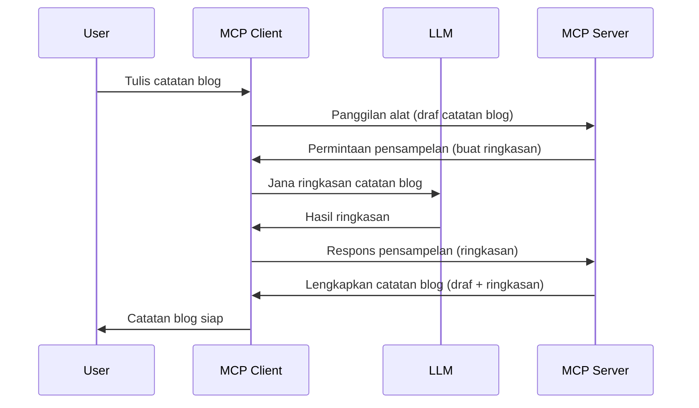

# Sampling - menyerahkan ciri kepada Klien

Kadang-kadang, anda memerlukan Klien MCP dan Pelayan MCP untuk bekerjasama mencapai matlamat bersama. Anda mungkin mempunyai kes di mana Pelayan memerlukan bantuan LLM yang berada pada klien. Untuk situasi ini, sampling adalah apa yang anda harus gunakan.

Mari kita terokai beberapa kes penggunaan dan cara membina penyelesaian yang melibatkan sampling.

## Gambaran Keseluruhan

Dalam pelajaran ini, kami memfokuskan pada penjelasan bila dan di mana untuk menggunakan Sampling dan bagaimana untuk mengkonfigurasinya.

## Objektif Pembelajaran

Dalam bab ini, kami akan:

- Menjelaskan apa itu Sampling dan bila menggunakannya.
- Menunjukkan bagaimana untuk mengkonfigurasi Sampling dalam MCP.
- Memberikan contoh Sampling dalam tindakan.

## Apa itu Sampling dan kenapa menggunakannya?

Sampling adalah ciri lanjutan yang berfungsi dengan cara berikut:



### Permintaan Sampling

Ok, sekarang kita ada pandangan menyeluruh tentang satu senario yang boleh dipercayai, mari bincang permintaan sampling yang dihantar oleh pelayan kembali kepada klien. Berikut adalah bagaimana permintaan seperti ini boleh kelihatan dalam format JSON-RPC:

```json
{
  "jsonrpc": "2.0",
  "id": 1,
  "method": "sampling/createMessage",
  "params": {
    "messages": [
      {
        "role": "user",
        "content": {
          "type": "text",
          "text": "Create a blog post summary of the following blog post: <BLOG POST>"
        }
      }
    ],
    "modelPreferences": {
      "hints": [
        {
          "name": "claude-3-sonnet"
        }
      ],
      "intelligencePriority": 0.8,
      "speedPriority": 0.5
    },
    "systemPrompt": "You are a helpful assistant.",
    "maxTokens": 100
  }
}
```

Terdapat beberapa perkara di sini yang patut kita tegaskan:

- Prompt, di bawah content -> text, adalah arahan kita untuk LLM meringkaskan kandungan pos blog.

- **modelPreferences**. Bahagian ini adalah hanya itu, satu keutamaan, satu cadangan konfigurasi yang harus digunakan dengan LLM. Pengguna boleh memilih sama ada untuk mengikuti cadangan ini atau mengubahnya. Dalam kes ini terdapat cadangan model untuk digunakan serta keutamaan kelajuan dan kebijaksanaan.
- **systemPrompt**, ini adalah prompt sistem biasa yang memberi personaliti kepada LLM anda dan mengandungi arahan panduan.
- **maxTokens**, ini adalah satu lagi sifat yang digunakan untuk menyatakan berapa banyak token yang disyorkan untuk tugasan ini.

### Respons Sampling

Respons ini adalah apa yang akhirnya dihantar oleh Klien MCP kembali kepada Pelayan MCP dan merupakan hasil dari klien yang memanggil LLM, menunggu respons itu dan kemudian membina mesej ini. Berikut adalah bagaimana ia boleh kelihatan dalam JSON-RPC:

```json
{
  "jsonrpc": "2.0",
  "id": 1,
  "result": {
    "role": "assistant",
    "content": {
      "type": "text",
      "text": "Here's your abstract <ABSTRACT>"
    },
    "model": "gpt-5",
    "stopReason": "endTurn"
  }
}
```

Perhatikan bagaimana respons adalah ringkasan pos blog seperti yang kami minta. Juga perhatikan bagaimana `model` yang digunakan bukan apa yang kami minta tetapi "gpt-5" dan bukan "claude-3-sonnet". Ini untuk menggambarkan bahawa pengguna boleh berubah fikiran mengenai apa yang hendak digunakan dan bahawa permintaan sampling anda adalah satu cadangan.

Ok, sekarang kita faham aliran utama, dan tugasan berguna untuk digunakan seperti "penciptaan pos blog + abstrak", mari lihat apa yang perlu dilakukan untuk menjayakannya.

### Jenis mesej

Mesej sampling tidak terhad kepada teks sahaja tetapi anda juga boleh menghantar imej dan audio. Berikut adalah bagaimana JSON-RPC kelihatan berbeza:

**Teks**

```json
{
  "type": "text",
  "text": "The message content"
}
```

**Kandungan imej**

```json
{
  "type": "image",
  "data": "base64-encoded-image-data",
  "mimeType": "image/jpeg"
}
```

**Kandungan audio**

```json
{
  "type": "audio",
  "data": "base64-encoded-audio-data",
  "mimeType": "audio/wav"
}
```

> NOTE: untuk maklumat lebih terperinci tentang Sampling, semak [dokumen rasmi](https://modelcontextprotocol.io/specification/2025-11-25/client/sampling)

## Cara Mengkonfigurasi Sampling dalam Klien

> Nota: jika anda hanya membina pelayan, anda tidak perlu buat banyak di sini.

Dalam klien, anda perlu menentukan ciri berikut seperti ini:

```json
{
  "capabilities": {
    "sampling": {}
  }
}
```

Ini akan diambil kira apabila klien pilihan anda dimulakan dengan pelayan.

## Contoh Sampling dalam Tindakan - Buat Pos Blog

Mari kita kodkan pelayan sampling bersama, kita perlu lakukan perkara berikut:

1. Cipta alat pada Pelayan.
2. Alat itu harus mencipta permintaan sampling
3. Alat harus menunggu permintaan sampling klien dijawab.
4. Kemudian hasil alat itu harus dihasilkan.

Mari kita lihat kod ini langkah demi langkah:

### -1- Cipta alat

**python**

```python
@mcp.tool()
async def create_blog(title: str, content: str, ctx: Context[ServerSession, None]) -> str:
    """Create a blog post and generate a summary"""

```

### -2- Cipta permintaan sampling

Lanjutkan alat anda dengan kod berikut:

**python**

```python
post = BlogPost(
        id=len(posts) + 1,
        title=title,
        content=content,
        abstract=""
    )

prompt = f"Create an abstract of the following blog post: title: {title} and draft: {content} "

result = await ctx.session.create_message(
        messages=[
            SamplingMessage(
                role="user",
                content=TextContent(type="text", text=prompt),
            )
        ],
        max_tokens=100,
)

```

### -3- Tunggu respons dan kembalikan respons

**python**

```python
post.abstract = result.content.text

posts.append(post)

# pulangkan produk lengkap
return json.dumps({
    "id": post.title,
    "abstract": post.abstract
})
```

### -4- Kod penuh

**python**

```python
from starlette.applications import Starlette
from starlette.routing import Mount, Host

from mcp.server.fastmcp import Context, FastMCP

from mcp.server.session import ServerSession
from mcp.types import SamplingMessage, TextContent

import json


from uuid import uuid4
from typing import List
from pydantic import BaseModel


mcp = FastMCP("Blog post generator")

# app = FastAPI()

posts = []

class BlogPost(BaseModel):
    id: int
    title: str
    content: str
    abstract: str

posts: List[BlogPost] = []

@mcp.tool()
async def create_blog(title: str, content: str, ctx: Context[ServerSession, None]) -> str:
    """Create a blog post and generate a summary"""

    post = BlogPost(
        id=len(posts) + 1,
        title=title,
        content=content,
        abstract=""
    )

    prompt = f"Create an abstract of the following blog post: title: {title} and draft: {content} "

    result = await ctx.session.create_message(
        messages=[
            SamplingMessage(
                role="user",
                content=TextContent(type="text", text=prompt),
            )
        ],
        max_tokens=100,
    )

    post.abstract = result.content.text

    posts.append(post)

    # kembalikan pos blog lengkap
    return json.dumps({
        "id": post.title,
        "abstract": post.abstract
    })

if __name__ == "__main__":
    print("Starting server...")
    # mcp.run()
    mcp.run(transport="streamable-http")

# jalankan aplikasi dengan: python server.py
```

### -5- Uji dengan Visual Studio Code

Untuk menguji ini dalam Visual Studio Code, lakukan perkara berikut:

1. Mulakan pelayan dalam terminal
2. Tambah ke *mcp.json* (dan pastikan ia dimulakan) contohnya seperti ini:

   ```json
   "servers": {
      "blog-server": {
        "type": "http",
        "url": "http://localhost:8000/mcp"
      }
   }
   ```

3. Taipkan prompt:

   ```text
   create a blog post named "Where Python comes from", the content is "Python is actually named after Monty Python Flying Circus"
   ```

4. Benarkan sampling berlaku. Kali pertama anda menguji ini anda akan dipaparkan dialog tambahan yang anda perlu terima, kemudian anda akan melihat dialog biasa untuk meminta anda menjalankan alat

5. Periksa hasil. Anda akan melihat hasilnya dipaparkan dengan baik dalam GitHub Copilot Chat tetapi anda juga boleh memeriksa respons JSON mentah.

**Bonus**. Alat Visual Studio Code mempunyai sokongan hebat untuk sampling. Anda boleh mengkonfigurasi akses Sampling pada pelayan yang dipasang dengan menavigasi seperti ini:

1. Navigasi ke seksyen sambungan.
2. Pilih ikon gear untuk pelayan yang dipasang dalam seksyen "MCP SERVERS - INSTALLED".
3. Pilih "Configure Model Access", di sini anda boleh memilih Model mana GitHub Copilot dibenarkan gunakan semasa melakukan sampling. Anda juga boleh melihat semua permintaan sampling yang berlaku baru-baru ini dengan memilih "Show Sampling requests".

## Tugasan

Dalam tugasan ini, anda akan membina Sampling yang sedikit berbeza iaitu integrasi sampling yang menyokong penjanaan penerangan produk. Berikut adalah senario anda:

**Senario**: Pekerja pejabat belakang di e-dagang memerlukan bantuan, ia mengambil masa terlalu lama untuk menghasilkan penerangan produk. Oleh itu, anda perlu membina penyelesaian di mana anda boleh memanggil alat "create_product" dengan "title" dan "keywords" sebagai argumen dan ia harus menghasilkan produk lengkap termasuk medan "description" yang perlu diisi oleh LLM klien.

TIP: gunakan apa yang anda pelajari sebelum ini untuk membina pelayan ini dan alatnya menggunakan permintaan sampling.

## Penyelesaian

[Penyelesaian](./solution/README.md)

## Kunci Pengajaran

Sampling adalah ciri yang kuat yang membenarkan pelayan mendelegasikan tugasan kepada klien apabila ia memerlukan bantuan LLM.

## Apa Yang Seterusnya

- [Bab 4 - Pelaksanaan praktikal](../../04-PracticalImplementation/README.md)

---

<!-- CO-OP TRANSLATOR DISCLAIMER START -->
**Penafian**:
Dokumen ini telah diterjemahkan menggunakan perkhidmatan terjemahan AI [Co-op Translator](https://github.com/Azure/co-op-translator). Walaupun kami berusaha untuk ketepatan, sila ambil maklum bahawa terjemahan automatik mungkin mengandungi kesilapan atau ketidaktepatan. Dokumen asal dalam bahasa asalnya harus dianggap sebagai sumber yang sahih. Untuk maklumat penting, terjemahan oleh manusia profesional adalah disyorkan. Kami tidak bertanggungjawab terhadap sebarang salah faham atau salah tafsir yang timbul daripada penggunaan terjemahan ini.
<!-- CO-OP TRANSLATOR DISCLAIMER END -->