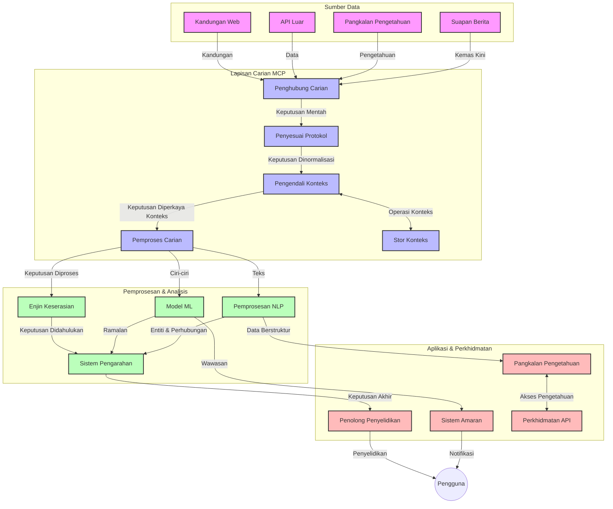
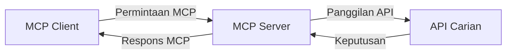
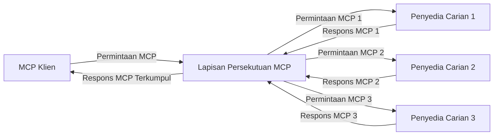
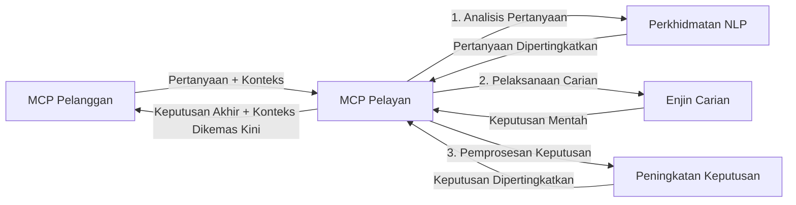

# Protokol Konteks Model untuk Carian Web Masa Nyata

## Gambaran Keseluruhan

Carian web masa nyata telah menjadi penting dalam persekitaran berasaskan maklumat pada hari ini, di mana aplikasi memerlukan akses segera kepada maklumat terkini di seluruh internet untuk menyediakan respons yang relevan dan tepat pada masanya. Protokol Konteks Model (MCP) mewakili kemajuan signifikan dalam mengoptimumkan proses carian masa nyata ini, meningkatkan kecekapan carian, mengekalkan integriti konteks, dan memperbaiki prestasi sistem secara keseluruhan.

Modul ini meneroka bagaimana MCP mengubah carian web masa nyata dengan menyediakan pendekatan standard untuk pengurusan konteks merentas model AI, enjin carian, dan aplikasi.

### Apa Yang Anda Akan Pelajari

Dalam panduan komprehensif ini, anda akan menemui:

- Bagaimana MCP mencipta jambatan lancar antara model AI dan keupayaan carian web masa nyata
- Corak seni bina untuk melaksanakan penyelesaian carian yang cekap dan skala dengan MCP
- Teknik untuk memelihara konteks carian merentas pelbagai pertanyaan dan interaksi
- Pelaksanaan kod praktikal dalam Python dan JavaScript untuk pelbagai senario carian
- Kaedah untuk mengimbangi kepentingan, kesegaran, dan prestasi dalam sistem carian berkuasa MCP

## Pengenalan Kepada Carian Web Masa Nyata

Carian web masa nyata ialah pendekatan teknologi yang membolehkan pertanyaan berterusan, pemprosesan, dan analisis maklumat berasaskan web semasa ia diterbitkan atau dikemas kini, membolehkan sistem menyediakan maklumat segar dan relevan dengan kelewatan yang minima. Berbeza dengan sistem carian tradisional yang beroperasi berdasarkan data yang diindeks dan mungkin berusia beberapa jam atau hari, carian masa nyata memproses data langsung dari web, menyampaikan pandangan dan maklumat yang mencerminkan keadaan semasa kandungan dalam talian.

### Konsep Teras Carian Web Masa Nyata:

- **Pemprosesan Pertanyaan Berterusan**: Pertanyaan carian diproses terhadap sumber data yang sentiasa dikemas kini
- **Keutamaan Kesegaran**: Sistem direka untuk memberi keutamaan kepada maklumat yang segar
- **Pengimbangan Relevan**: Mengekalkan keseimbangan antara relevan dan kesegaran
- **Seni Bina Skala**: Sistem mesti mengendalikan beban pertanyaan dan jumlah data yang berubah-ubah
- **Pemahaman Kontekstual**: Mengekalkan konteks pengguna merentas iterasi carian adalah penting untuk hasil yang bermakna
- **Penyesuaian Semula Pertanyaan Dinamik**: Mengubah suai pertanyaan secara adaptif berdasarkan konteks dan keputusan sebelumnya
- **Integrasi Pelbagai Sumber**: Menggabungkan keputusan daripada pelbagai penyedia carian dan sumber web
- **Pemahaman Semantik**: Memproses pertanyaan dan kandungan berdasarkan makna dan bukan hanya kata kunci
- **Penggredan Masa Nyata**: Sentiasa melaraskan kedudukan keputusan apabila maklumat baru tersedia

### Protokol Konteks Model dan Carian Web Masa Nyata

Protokol Konteks Model (MCP) menangani beberapa cabaran kritikal dalam persekitaran carian web masa nyata:

1. **Pemeliharaan Konteks Carian**: MCP menyeragamkan cara konteks dikekalkan merentas komponen carian teragih, memastikan model AI dan nod pemprosesan mempunyai akses kepada sejarah pertanyaan relevan dan keutamaan pengguna.

2. **Pengurusan Pertanyaan Berkesan**: Dengan menyediakan mekanisme tersusun untuk penghantaran konteks, MCP mengurangkan beban pengulangan konteks dalam setiap iterasi carian.

3. **Interoperabiliti**: MCP mencipta bahasa umum untuk perkongsian konteks antara teknologi carian dan model AI yang pelbagai, membolehkan seni bina yang lebih fleksibel dan boleh diperluas.

4. **Konteks Dioptimumkan untuk Carian**: Pelaksanaan MCP boleh mengutamakan elemen konteks yang paling relevan untuk carian yang berkesan, mengoptimumkan untuk prestasi dan ketepatan.

5. **Pemprosesan Carian Adaptif**: Dengan pengurusan konteks yang betul melalui MCP, sistem carian boleh menyesuaikan pemprosesan secara dinamik berdasarkan keperluan pengguna dan landskap maklumat yang berubah.

Dalam aplikasi moden dari agregasi berita hingga pembantu penyelidikan, pengintegrasian MCP dengan teknologi carian web membolehkan carian yang lebih pintar, sadar konteks yang boleh menyediakan hasil yang semakin relevan sepanjang interaksi pengguna berterusan.

## Objektif Pembelajaran

Menjelang akhir pelajaran ini, anda akan dapat:

- Memahami asas-asas carian web masa nyata dan cabarannya dalam aplikasi moden
- Menerangkan bagaimana Protokol Konteks Model (MCP) meningkatkan keupayaan carian web masa nyata
- Melaksanakan penyelesaian carian berasaskan MCP menggunakan rangka kerja dan API popular
- Mereka bentuk dan menyebarkan seni bina carian yang berskala dan berprestasi tinggi dengan MCP
- Mengaplikasi konsep MCP ke pelbagai kes penggunaan termasuk carian semantik, bantuan penyelidikan, dan pelayaran dipertingkatkan AI
- Menilai tren muncul dan inovasi masa depan dalam teknologi carian berasaskan MCP
- Membangun sistem carian sadar konteks yang belajar daripada interaksi pengguna
- Mengintegrasikan keupayaan carian web ke dalam pembantu AI menggunakan protokol MCP standard
- Mencipta saluran carian berperingkat yang secara berperingkat menambah baik hasil berdasarkan konteks
- Mengoptimumkan prestasi carian sambil mengekalkan kesedaran konteks yang menyeluruh

### Definisi dan Kepentingan

Carian web masa nyata melibatkan pertanyaan berterusan, pemulihan, dan penyampaian maklumat berasaskan web dengan kelewatan yang minima. Berbeza dengan enjin carian tradisional yang mengimbas dan mengindeks web secara berkala, carian masa nyata bertujuan untuk memaparkan maklumat sebaik ia tersedia, membolehkan akses segera kepada kandungan yang paling terkini.

Ciri-ciri utama carian web masa nyata termasuk:

- **Kesegaran**: Memberi keutamaan kepada kandungan dan kemas kini terbaru
- **Pemprosesan Berterusan**: Sentiasa memantau maklumat baru
- **Penyesuaian Pertanyaan**: Memperhalusi pertanyaan carian berdasarkan konteks dan maklum balas
- **Penyampaian Segera**: Menyediakan keputusan carian dengan kelewatan minima
- **Pengekalan Konteks**: Membina daripada pertanyaan sebelumnya untuk relevan yang lebih baik

### Cabaran dalam Carian Web Tradisional

Pendekatan carian web tradisional menghadapi beberapa had apabila digunakan dalam senario masa nyata:

1. **Fragmentasi Konteks**: Kesukaran mengekalkan konteks carian merentas pelbagai pertanyaan
2. **Kesegaran Maklumat**: Cabaran mengakses dan mengutamakan maklumat terbaru
3. **Kerumitan Integrasi**: Masalah interoperabiliti antara sistem carian dan aplikasi
4. **Isu Latensi**: Mengimbangi carian menyeluruh dengan keperluan masa tindak balas
5. **Pelaras Relevan**: Memastikan ketepatan dan relevan sambil memberi keutamaan kepada kesegaran

## Memahami Protokol Konteks Model (MCP) untuk Carian

### Apakah MCP dalam Konteks Carian?

Protokol Konteks Model (MCP) ialah protokol komunikasi piawai yang direka untuk memudahkan interaksi cekap antara model AI dan aplikasi. Dalam konteks carian web masa nyata, MCP menyediakan rangka kerja untuk:

- Memelihara konteks carian sepanjang urutan pertanyaan
- Menyeragamkan format pertanyaan dan keputusan carian
- Mengoptimumkan penghantaran parameter dan keputusan carian
- Meningkatkan komunikasi antara model dan enjin carian

### Komponen Teras dan Seni Bina

Seni bina MCP untuk carian web masa nyata terdiri daripada beberapa komponen utama:

1. **Pengendali Konteks Pertanyaan**: Mengurus dan mengekalkan konteks carian merentas pelbagai pertanyaan
2. **Pemproses Carian**: Memproses permintaan carian masuk menggunakan teknik sadar konteks
3. **Penyesuai Protokol**: Menukar antara pelbagai API carian sambil mengekalkan konteks
4. **Stor Konteks**: Menyimpan dan mengambil sejarah carian serta keutamaan dengan cekap
5. **Penyambung Carian**: Menyambung kepada pelbagai enjin carian dan API web



### Bagaimana MCP Meningkatkan Carian Web Masa Nyata

MCP mengatasi cabaran carian web tradisional melalui:

- **Kesinambungan Kontekstual**: Mengekalkan hubungan antara pertanyaan sepanjang sesi carian
- **Penghantaran Dioptimumkan**: Mengurangkan pengulangan dalam parameter carian melalui pengurusan konteks yang pintar
- **Antara Muka Piawai**: Menyediakan API yang konsisten untuk komponen carian
- **Pengurangan Latensi**: Meminimumkan beban pemprosesan melalui pengendalian konteks yang cekap
- **Peningkatan Relevan**: Memperbaiki relevan carian dengan memelihara niat pengguna merentas pelbagai pertanyaan

## Integrasi dan Pelaksanaan

Sistem carian web masa nyata memerlukan reka bentuk seni bina dan pelaksanaan yang berhati-hati untuk mengekalkan prestasi dan integriti konteks. Protokol Konteks Model menawarkan pendekatan piawai untuk mengintegrasikan model AI dan teknologi carian, membolehkan saluran carian yang lebih sofistikated dan sadar konteks.

### Gambaran Keseluruhan Integrasi MCP dalam Seni Bina Carian

Melaksanakan MCP dalam persekitaran carian web masa nyata melibatkan beberapa pertimbangan utama:

1. **Serialisasi Konteks Carian**: MCP menyediakan mekanisme cekap untuk menyandi maklumat kontekstual dalam permintaan carian, memastikan konteks penting mengikuti pertanyaan sepanjang saluran pemprosesan. Ini termasuk format serialisasi piawai yang dioptimumkan untuk metadata berkaitan carian.

2. **Pemprosesan Carian Berkeadaan**: MCP membolehkan pemprosesan berkeadaan yang lebih pintar dengan mengekalkan representasi konteks konsisten merentas iterasi carian. Ini sangat bernilai dalam saluran carian berperingkat di mana pemurnian konteks meningkatkan hasil.

3. **Pengembangan dan Pemurnian Pertanyaan**: Pelaksanaan MCP dalam sistem carian boleh memudahkan pengembangan dan pemurnian pertanyaan yang canggih berdasarkan konteks terkumpul, membolehkan hasil yang semakin relevan sepanjang sesi carian berlangsung.

4. **Penyimpanan Cache dan Keutamaan Keputusan**: Dengan menyeragamkan pengendalian konteks, MCP membantu mengurus penyimpanan cache hasil dan keutamaan, membolehkan komponen menyesuaikan diri berdasarkan konteks carian yang berkembang.

5. **Federasi dan Agregasi Carian**: MCP memudahkan federasi carian yang lebih sofistikated merentas pelbagai backend dengan menyediakan representasi tersusun bagi konteks carian, membolehkan agregasi hasil yang lebih bermakna daripada sumber yang pelbagai.

Pelaksanaan MCP merentas pelbagai teknologi carian mencipta pendekatan bersatu kepada pengurusan konteks, mengurangkan keperluan kod integrasi khusus sambil meningkatkan keupayaan sistem untuk mengekalkan konteks bermakna apabila pertanyaan carian berkembang.

### MCP dalam Pelbagai Pelaksanaan Carian Web

Contoh ini mengikuti spesifikasi MCP semasa yang memfokuskan pada protokol berasaskan JSON-RPC dengan mekanisme pengangkutan berbeza. Kod menunjukkan bagaimana anda boleh melaksanakan integrasi carian tersuai sambil mengekalkan keserasian penuh dengan protokol MCP.


<details>
<summary>Pelaksanaan Python dengan API Carian Generic</summary>

```python
import asyncio
import json
import aiohttp
from typing import Dict, Any, Optional, List
from contextlib import asynccontextmanager
from collections.abc import AsyncIterator

# Import perpustakaan MCP standard
from mcp.client.session import ClientSession
from mcp.client.streamable_http import streamablehttp_client
from mcp.types import TextContent, CreateMessageRequestParams, CreateMessageResult
from mcp.server.fastmcp import FastMCP

# Cipta pelayan FastMCP untuk carian web
search_server = FastMCP("WebSearch")

# Kelas untuk mengendalikan operasi carian web
class WebSearchHandler:
    def __init__(self, api_endpoint: str, api_key: str):
        self.api_endpoint = api_endpoint
        self.api_key = api_key
        self.session = None
        
    async def initialize(self):
        """Initialize the HTTP session"""
        self.session = aiohttp.ClientSession(
            headers={"Authorization": f"Bearer {self.api_key}"}
        )
    
    async def close(self):
        """Close the HTTP session"""
        if self.session:
            await self.session.close()
            
    async def perform_search(self, query: str, max_results: int = 5, 
                           include_domains: List[str] = None, 
                           exclude_domains: List[str] = None,
                           time_period: str = "any") -> Dict[str, Any]:
        """Perform web search using the search API"""
        # Bentuk parameter carian
        search_params = {
            "q": query,
            "limit": max_results,
            "time": time_period
        }
        
        if include_domains:
            search_params["site"] = ",".join(include_domains)
            
        if exclude_domains:
            search_params["exclude_site"] = ",".join(exclude_domains)
        
        # Laksanakan permintaan carian
        try:
            async with self.session.get(
                self.api_endpoint,
                params=search_params
            ) as response:
                if response.status != 200:
                    error_text = await response.text()
                    raise Exception(f"Search API error: {response.status} - {error_text}")
                
                search_data = await response.json()
                
                # Tukar respons khusus API kepada format standard
                results = []
                for item in search_data.get("results", []):
                    results.append({
                        "title": item.get("title", ""),
                        "url": item.get("url", ""),
                        "snippet": item.get("snippet", ""),
                        "date": item.get("published_date", ""),
                        "source": item.get("source", "")
                    })
                
                return {
                    "query": query,
                    "totalResults": len(results),
                    "results": results
                }
        except Exception as e:
            print(f"Search API request error: {e}")
            raise

# Inisialisasi pengendali carian
search_handler = WebSearchHandler(
    api_endpoint="https://api.search-service.example/search",
    api_key="your-api-key-here"
)

# Sediakan lifespan untuk mengurus pengendali carian
@asyncio.asynccontextmanager
async def app_lifespan(server: FastMCP):
    """Manage application lifecycle"""
    await search_handler.initialize()
    try:
        yield {"search_handler": search_handler}
    finally:
        await search_handler.close()

# Tetapkan lifespan untuk pelayan
search_server = FastMCP("WebSearch", lifespan=app_lifespan)

# Daftar alat carian web
@search_server.tool()
async def web_search(query: str, max_results: int = 5, 
                   include_domains: List[str] = None,
                   exclude_domains: List[str] = None,
                   time_period: str = "any") -> Dict[str, Any]:
    """
    Search the web for information
    
    Args:
        query: The search query
        max_results: Maximum number of results to return (default: 5)
        include_domains: List of domains to include in search results
        exclude_domains: List of domains to exclude from search results
        time_period: Time period for results ("day", "week", "month", "any")
        
    Returns:
        Dictionary containing search results
    """
    ctx = search_server.get_context()
    search_handler = ctx.request_context.lifespan_context["search_handler"]
    
    results = await search_handler.perform_search(
        query=query,
        max_results=max_results,
        include_domains=include_domains,
        exclude_domains=exclude_domains,
        time_period=time_period
    )
    
    return results

# Contoh penggunaan klien
async def client_example():
    # Sambung ke pelayan carian menggunakan pengangkutan HTTP Streamable
    async with streamablehttp_client("http://localhost:8000/mcp") as (read, write, _):
        async with ClientSession(read, write) as session:
            # Inisialisasi sambungan
            await session.initialize()
            
            # Panggil alat web_search
            search_results = await session.call_tool(
                "web_search", 
                {
                    "query": "latest developments in AI and Model Context Protocol",
                    "max_results": 5,
                    "time_period": "day",
                    "include_domains": ["github.com", "microsoft.com"]
                }
            )
            
            print(f"Search results: {search_results}")

# Contoh pelaksanaan pelayan
if __name__ == "__main__":
    # Jalankan pelayan dengan pengangkutan HTTP Streamable
    search_server.run(transport="streamable-http")
```
</details> 

<details>
<summary>Pelaksanaan JavaScript dengan Carian Berasaskan Pelayar</summary>


```javascript
// Pelaksanaan pelayan MCP untuk carian web
import { McpServer, ResourceTemplate } from '@modelcontextprotocol/sdk/server/mcp.js';
import { StreamableHTTPServerTransport } from '@modelcontextprotocol/sdk/server/streamableHttp.js';
import { z } from 'zod';

// Cipta pelayan MCP untuk carian web
const searchServer = new McpServer({
    name: "BrowserSearch",
    description: "A server that provides web search capabilities"
});

// Kelas perkhidmatan carian
class SearchService {
    constructor(searchApiUrl, apiKey) {
        this.searchApiUrl = searchApiUrl;
        this.apiKey = apiKey;
    }

    async performSearch(parameters) {
        const {
            query = '',
            maxResults = 5,
            includeDomains = [],
            excludeDomains = [],
            timePeriod = 'any'
        } = parameters;
        
        // Bina URL carian dengan parameter
        const url = new URL(this.searchApiUrl);
        url.searchParams.append('q', query);
        url.searchParams.append('limit', maxResults);
        url.searchParams.append('time', timePeriod);
        
        if (includeDomains.length > 0) {
            url.searchParams.append('site', includeDomains.join(','));
        }
        
        if (excludeDomains.length > 0) {
            url.searchParams.append('exclude_site', excludeDomains.join(','));
        }
        
        try {
            const response = await fetch(url.toString(), {
                method: 'GET',
                headers: {
                    'Authorization': `Bearer ${this.apiKey}`,
                    'Content-Type': 'application/json'
                }
            });
            
            if (!response.ok) {
                const errorText = await response.text();
                throw new Error(`Search API error: ${response.status} - ${errorText}`);
            }
            
            const searchData = await response.json();
            
            // Tukar respons khusus API ke format piawai
            const results = searchData.results?.map(item => ({
                title: item.title || '',
                url: item.url || '',
                snippet: item.snippet || '',
                date: item.published_date || '',
                source: item.source || ''
            })) || [];
            
            return {
                query,
                totalResults: results.length,
                results
            };
        } catch (error) {
            console.error('Search API request error:', error);
            throw error;
        }
    }
}

// Inisialisasi perkhidmatan carian
const searchService = new SearchService(
    'https://api.search-service.example/search',
    'your-api-key-here'
);

// Sediakan penyedia konteks untuk pelayan
searchServer.setContextProvider(() => {
    return {
        searchService
    };
});

// Daftar alat carian web
searchServer.tool({
    name: 'web_search',
    description: 'Search the web for information',
    parameters: {
        type: 'object',
        properties: {
            query: {
                type: 'string',
                description: 'The search query'
            },
            maxResults: {
                type: 'integer',
                description: 'Maximum number of results to return',
                default: 5
            },
            includeDomains: {
                type: 'array',
                items: { type: 'string' },
                description: 'List of domains to include in search results'
            },
            excludeDomains: {
                type: 'array',
                items: { type: 'string' },
                description: 'List of domains to exclude from search results'
            },
            timePeriod: {
                type: 'string',
                description: 'Time period for results',
                enum: ['day', 'week', 'month', 'any'],
                default: 'any'
            }
        },
        required: ['query']
    },
    handler: async (params, context) => {
        const { searchService } = context;
        return await searchService.performSearch(params);
    }
});

// Kod klien contoh untuk menyambung ke pelayan carian
import { Client } from '@modelcontextprotocol/sdk/client/index.js';
import { StreamableHTTPClientTransport } from '@modelcontextprotocol/sdk/client/streamableHttp.js';

async function connectToSearchServer() {
    // Sambung ke pelayan carian
    const transport = new StreamableHTTPClientTransport(
        new URL('http://localhost:8000/mcp')
    );
    
    const client = new Client({
        name: 'search-client',
        version: '1.0.0'
    });
    
    await client.connect(transport);
    
    // Jalankan alat carian
    const searchResults = await client.callTool({
        name: 'web_search',
        arguments: {
            query: 'Model Context Protocol implementation examples',
            maxResults: 10,
            timePeriod: 'week',
            includeDomains: ['github.com', 'docs.microsoft.com']
        }
    });
    
    console.log('Search results:', searchResults);
    
    // Bersihkan
    await client.disconnect();
}

// Mulakan pelayan
const transport = new StreamableHTTPServerTransport();
await searchServer.connect(transport);
console.log('Search server running at http://localhost:8000/mcp');

// Dalam proses berasingan atau selepas pelayan dimulakan
// connectToSearchServer().catch(console.error);
```
</details> 


## Penafian Contoh Kod

> **Nota Penting**: Contoh kod di bawah menunjukkan integrasi Protokol Konteks Model (MCP) dengan fungsi carian web. Walaupun mereka mengikuti corak dan struktur SDK MCP rasmi, ia telah dipermudahkan untuk tujuan pendidikan.
> 
> Contoh ini mempamerkan:
> 
> 1. **Pelaksanaan Python**: Pelaksanaan pelayan FastMCP yang menyediakan alat carian web dan menyambung kepada API carian luar. Contoh ini menunjukkan pengurusan hayat yang betul, pengendalian konteks, dan pelaksanaan alat mengikut corak [SDK Python MCP rasmi](https://github.com/modelcontextprotocol/python-sdk). Pelayan menggunakan pengangkutan HTTP Streamable yang disyorkan yang telah menggantikan pengangkutan SSE lama untuk penggunaan produksi.
> 
> 2. **Pelaksanaan JavaScript**: Pelaksanaan TypeScript/JavaScript menggunakan corak FastMCP dari [SDK TypeScript MCP rasmi](https://github.com/modelcontextprotocol/typescript-sdk) untuk mencipta pelayan carian dengan definisi alat dan sambungan klien yang betul. Ia mengikuti corak terkini yang disyorkan untuk pengurusan sesi dan pemeliharaan konteks.
> 
> Contoh ini memerlukan pengendalian ralat tambahan, pengesahan, dan kod integrasi API spesifik untuk penggunaan produksi. Titik akhir API carian yang ditunjukkan (`https://api.search-service.example/search`) adalah tempat letak dan perlu digantikan dengan titik akhir perkhidmatan carian sebenar.
> 
> Untuk maklumat pelaksanaan lengkap dan pendekatan terkini, sila rujuk [spesifikasi MCP rasmi](https://spec.modelcontextprotocol.io/) dan dokumentasi SDK.

## Konsep Teras

### Rangka Kerja Protokol Konteks Model (MCP)

Pada asasnya, Protokol Konteks Model menyediakan cara piawai untuk model AI, aplikasi, dan perkhidmatan bertukar konteks. Dalam carian web masa nyata, rangka kerja ini penting untuk mewujudkan pengalaman carian berbilang pusingan yang koheren. Komponen utama termasuk:

1. **Seni Bina Pelanggan-Pelayan**: MCP mewujudkan pemisahan jelas antara klien carian (pemerintah permintaan) dan pelayan carian (pemberi), membolehkan model pelaksanaan yang fleksibel.

2. **Komunikasi JSON-RPC**: Protokol menggunakan JSON-RPC untuk pertukaran mesej, menjadikannya serasi dengan teknologi web dan mudah dilaksanakan merentas platform berbeza.

3. **Pengurusan Konteks**: MCP mentakrifkan kaedah tersusun untuk mengekalkan, mengemas kini, dan menggunakan konteks carian dalam pelbagai interaksi.

4. **Definisi Alat**: Keupayaan carian didedahkan sebagai alat piawai dengan parameter dan nilai pulangan yang jelas ditakrif.

5. **Sokongan Penstriman**: Protokol menyokong keputusan secara penstriman, penting untuk carian masa nyata di mana keputusan mungkin tiba secara berperingkat.

### Corak Integrasi Carian Web

Apabila mengintegrasikan MCP dengan carian web, beberapa corak muncul:

#### 1. Integrasi Penyedia Carian Secara Langsung



Dalam corak ini, pelayan MCP berhubung terus dengan satu atau lebih API carian, menterjemah permintaan MCP kepada panggilan khusus API dan memformat keputusan sebagai tindak balas MCP.

#### 2. Carian Federasi dengan Pemeliharaan Konteks



Corak ini mengagihkan pertanyaan carian merentas pelbagai penyedia carian yang serasi MCP, setiap satu mungkin mengkhusus dalam jenis kandungan atau keupayaan carian yang berbeza, sambil mengekalkan konteks unified.

#### 3. Rantaian Carian Dipertingkat Konteks



Dalam corak ini, proses carian dibahagikan kepada beberapa peringkat, dengan konteks diperkaya pada setiap langkah, menghasilkan keputusan yang secara berperingkat lebih relevan.

### Komponen Konteks Carian

Dalam carian web berasaskan MCP, konteks biasanya merangkumi:

- **Sejarah Pertanyaan**: Pertanyaan carian sebelumnya dalam sesi
- **Keutamaan Pengguna**: Bahasa, wilayah, tetapan carian selamat
- **Sejarah Interaksi**: Keputusan yang diklik, masa dihabiskan pada keputusan
- **Parameter Carian**: Penapis, susunan susun, dan pengubah carian lain
- **Pengetahuan Domain**: Konteks khusus subjek yang relevan dengan carian
- **Konteks Temporal**: Faktor relevan berasaskan masa
- **Keutamaan Sumber**: Sumber maklumat yang dipercayai atau disukai

## Kes Penggunaan dan Aplikasi

### Penyelidikan dan Pengumpulan Maklumat

MCP mempertingkatkan aliran kerja penyelidikan dengan:

- Memelihara konteks penyelidikan merentas sesi carian
- Membolehkan pertanyaan yang lebih canggih dan relevan secara kontekstual
- Menyokong federasi carian pelbagai sumber
- Memudahkan pengekstrakan pengetahuan daripada hasil carian

### Pemantauan Berita dan Tren Masa Nyata

Carian berkuasa MCP menawarkan kelebihan untuk pemantauan berita:

- Penemuan hampir masa nyata cerita berita yang muncul
- Penapisan kontekstual maklumat relevan
- Penjejakan topik dan entiti merentas pelbagai sumber
- Amaran berita yang diperibadikan berdasarkan konteks pengguna

### Pelayaran dan Penyelidikan Dipertingkat AI

MCP mencipta kemungkinan baru untuk pelayaran dipertingkat AI:

- Cadangan carian kontekstual berdasarkan aktiviti pelayar semasa
- Integrasi lancar carian web dengan pembantu berkuasa LLM
- Penambahbaikan carian berbilang pusingan dengan konteks yang dikekalkan
- Pemeriksaan fakta dan pengesahan maklumat yang dipertingkat

## Tren dan Inovasi Masa Depan

### Evolusi MCP dalam Carian Web

Melangkah ke hadapan, kami menjangkakan MCP berkembang untuk menangani:
- **Carian Multimodal**: Menggabungkan carian teks, imej, audio, dan video dengan konteks yang dipelihara  
- **Carian Terdesentralisasi**: Menyokong ekosistem carian teragih dan gabungan  
- **Privasi Carian**: Mekanisme carian yang memelihara privasi berasaskan konteks  
- **Pemahaman Pertanyaan**: Parsingan semantik mendalam bagi pertanyaan carian bahasa semula jadi  

### Kemajuan Potensi dalam Teknologi

Teknologi muncul yang akan membentuk masa depan carian MCP:

1. **Senibina Carian Neural**: Sistem carian berasaskan embedding yang dioptimumkan untuk MCP  
2. **Konteks Carian Peribadi**: Pembelajaran corak carian pengguna individu dari masa ke masa  
3. **Integrasi Graf Pengetahuan**: Carian kontekstual dipertingkatkan oleh graf pengetahuan khusus domain  
4. **Konteks Rentas Modal**: Memelihara konteks merentas modal carian yang berbeza  

## Latihan Praktikal

### Latihan 1: Menyediakan Rangkaian Asas Carian MCP

Dalam latihan ini, anda akan belajar untuk:  
- Mengkonfigurasi persekitaran carian MCP asas  
- Melaksanakan pengendali konteks untuk carian web  
- Menguji dan mengesahkan pemeliharaan konteks merentas pengulangan carian  

### Latihan 2: Membina Pembantu Penyelidikan dengan Carian MCP

Cipatakan aplikasi lengkap yang:  
- Memproses soalan penyelidikan berbahasa semula jadi  
- Melakukan carian web berasaskan konteks  
- Mensintesis maklumat dari pelbagai sumber  
- Membentangkan hasil penyelidikan yang teratur  

### Latihan 3: Melaksanakan Gabungan Carian Sumber Pelbagai dengan MCP

Latihan lanjutan merangkumi:  
- Penghantaran pertanyaan berasaskan konteks ke beberapa enjin carian  
- Pengurutan dan pengagregatan hasil  
- Deduplicasi kontekstual bagi keputusan carian  
- Pengendalian metadata khusus sumber  

## Sumber Tambahan

- [Model Context Protocol Specification](https://spec.modelcontextprotocol.io/) - Spesifikasi rasmi MCP dan dokumentasi protokol terperinci  
- [Model Context Protocol Documentation](https://modelcontextprotocol.io/) - Tutorial terperinci dan panduan pelaksanaan  
- [MCP Python SDK](https://github.com/modelcontextprotocol/python-sdk) - Pelaksanaan rasmi MCP dalam Python  
- [MCP TypeScript SDK](https://github.com/modelcontextprotocol/typescript-sdk) - Pelaksanaan rasmi MCP dalam TypeScript  
- [MCP Reference Servers](https://github.com/modelcontextprotocol/servers) - Pelaksanaan rujukan pelayan MCP  
- [Bing Web Search API Documentation](https://learn.microsoft.com/en-us/bing/search-apis/bing-web-search/overview) - API carian web Microsoft  
- [Google Custom Search JSON API](https://developers.google.com/custom-search/v1/overview) - Enjin carian boleh atur Google  
- [SerpAPI Documentation](https://serpapi.com/search-api) - API halaman keputusan enjin carian  
- [Meilisearch Documentation](https://www.meilisearch.com/docs) - Enjin carian sumber terbuka  
- [Elasticsearch Documentation](https://www.elastic.co/guide/index.html) - Enjin carian dan analitik teragih  
- [LangChain Documentation](https://python.langchain.com/docs/get_started/introduction) - Membangun aplikasi dengan LLM  

## Hasil Pembelajaran

Dengan melengkapkan modul ini, anda akan dapat:  

- Memahami asas carian web masa nyata dan cabarannya  
- Menerangkan bagaimana Model Context Protocol (MCP) meningkatkan keupayaan carian web masa nyata  
- Melaksanakan penyelesaian carian berasaskan MCP menggunakan rangka kerja dan API popular  
- Mereka bentuk dan melancarkan senibina carian yang boleh diskala dan berprestasi tinggi dengan MCP  
- Mengaplikasi konsep MCP kepada pelbagai kes penggunaan termasuk carian semantik, bantuan penyelidikan, dan pelayaran dipertingkatkan AI  
- Menilai trend muncul dan inovasi masa depan dalam teknologi carian berasaskan MCP  

### Pertimbangan Kepercayaan dan Keselamatan

Apabila melaksanakan penyelesaian carian web berasaskan MCP, ingat prinsip penting ini dari spesifikasi MCP:  

1. **Persetujuan dan Kawalan Pengguna**: Pengguna mesti memberi persetujuan secara jelas dan memahami semua akses data dan operasi. Ini amat penting untuk pelaksanaan carian web yang mungkin mengakses sumber data luaran.  

2. **Privasi Data**: Pastikan pengendalian pertanyaan carian dan hasil dilakukan dengan sewajarnya, terutama apabila mengandungi maklumat sensitif. Laksanakan kawalan akses yang sesuai untuk melindungi data pengguna.  

3. **Keselamatan Alat**: Laksanakan pengesahan dan kebenaran yang betul untuk alat carian, kerana ia mewakili risiko keselamatan melalui pelaksanaan kod sewenang-wenangnya. Huraian tingkah laku alat harus dianggap tidak dipercayai kecuali diperoleh dari pelayan yang dipercayai.  

4. **Dokumentasi Jelas**: Sediakan dokumentasi jelas tentang kemampuan, had, dan pertimbangan keselamatan pelaksanaan carian berasaskan MCP anda, mengikut garis panduan pelaksanaan dalam spesifikasi MCP.  

5. **Aliran Persetujuan yang Kukuh**: Bangunkan aliran persetujuan dan kebenaran yang kukuh yang menerangkan dengan jelas fungsi setiap alat sebelum mengizinkan penggunaannya, terutama bagi alat yang berinteraksi dengan sumber web luaran.  

Untuk butiran lengkap mengenai keselamatan dan pertimbangan kepercayaan MCP, rujuk [dokumentasi rasmi](https://modelcontextprotocol.io/specification/2025-11-25/basic/security_best_practices).  

## Apa seterusnya  

- [5.12 Pengesahan Entra ID untuk Pelayan Model Context Protocol](../mcp-security-entra/README.md)

---

<!-- CO-OP TRANSLATOR DISCLAIMER START -->
**Penafian**:
Dokumen ini telah diterjemahkan menggunakan perkhidmatan terjemahan AI [Co-op Translator](https://github.com/Azure/co-op-translator). Walaupun kami berusaha untuk ketepatan, sila ambil maklum bahawa terjemahan automatik mungkin mengandungi kesilapan atau ketidaktepatan. Dokumen asal dalam bahasa asalnya harus dianggap sebagai sumber yang sahih. Untuk maklumat penting, terjemahan oleh manusia profesional adalah disyorkan. Kami tidak bertanggungjawab terhadap sebarang salah faham atau salah tafsir yang timbul daripada penggunaan terjemahan ini.
<!-- CO-OP TRANSLATOR DISCLAIMER END -->