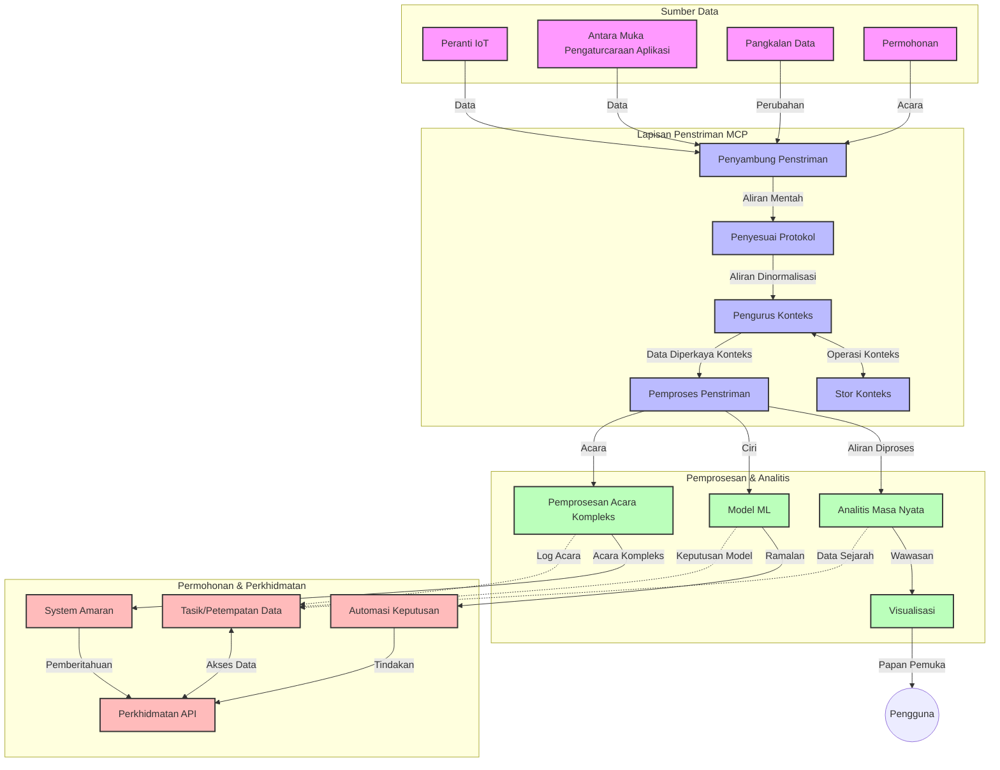

# Protokol Konteks Model untuk Penstriman Data Masa Nyata

## Gambaran Keseluruhan

Penstriman data masa nyata telah menjadi penting dalam dunia yang dipacu oleh data hari ini, di mana perniagaan dan aplikasi memerlukan capaian segera kepada maklumat untuk membuat keputusan tepat pada masanya. Protokol Konteks Model (MCP) mewakili kemajuan penting dalam mengoptimumkan proses penstriman masa nyata ini, meningkatkan kecekapan pemprosesan data, mengekalkan integriti konteks, dan memperbaiki prestasi sistem secara keseluruhan.

Modul ini meneroka bagaimana MCP mengubah penstriman data masa nyata dengan menyediakan pendekatan piawai untuk pengurusan konteks merentasi model AI, platform penstriman, dan aplikasi.

## Pengenalan kepada Penstriman Data Masa Nyata

Penstriman data masa nyata adalah paradigma teknologi yang membolehkan pemindahan, pemprosesan, dan analisis data secara berterusan ketika ia dijana, membolehkan sistem bertindak segera kepada maklumat baru. Berbeza dengan pemprosesan berkumpulan tradisional yang beroperasi pada set data statik, penstriman memproses data dalam pergerakan, menyampaikan maklumat dan tindakan dengan kelewatan minimum.

### Konsep Teras Penstriman Data Masa Nyata:

- **Aliran Data Berterusan**: Data diproses sebagai aliran peristiwa atau rekod yang berterusan tanpa henti.
- **Pemprosesan Latensi Rendah**: Sistem direka untuk meminimumkan masa antara penjanaan dan pemprosesan data.
- **Scaleabiliti**: Seni bina penstriman mesti mengendalikan jumlah dan kelajuan data yang berubah-ubah.
- **Toleransi Kegagalan**: Sistem perlu tahan terhadap kegagalan untuk memastikan aliran data tidak terganggu.
- **Pemprosesan Berkeadaan**: Mengekalkan konteks merentasi peristiwa adalah penting untuk analisis yang bermakna.

### Protokol Konteks Model dan Penstriman Masa Nyata

Protokol Konteks Model (MCP) menangani beberapa cabaran kritikal dalam persekitaran penstriman masa nyata:

1. **Keterusan Konteks**: MCP mempatenkan cara konteks dikekalkan merentasi komponen penstriman yang teragih, memastikan model AI dan nod pemprosesan mempunyai capaian kepada konteks sejarah dan persekitaran yang relevan.

2. **Pengurusan Keadaan yang Efisien**: Dengan menyediakan mekanisme berstruktur untuk penghantaran konteks, MCP mengurangkan overhead pengurusan keadaan dalam saluran penstriman.

3. **Interoperabiliti**: MCP mencipta bahasa umum untuk perkongsian konteks antara teknologi penstriman yang pelbagai dan model AI, membolehkan seni bina yang lebih fleksibel dan boleh dikembangkan.

4. **Konteks Dioptimumkan untuk Penstriman**: Pelaksanaan MCP boleh memprioritikan elemen konteks yang paling relevan untuk membuat keputusan masa nyata, mengoptimumkan dari segi prestasi dan ketepatan.

5. **Pemprosesan Adaptif**: Dengan pengurusan konteks yang betul melalui MCP, sistem penstriman boleh menyesuaikan pemprosesan secara dinamik berdasarkan keadaan dan corak yang berubah dalam data.

Dalam aplikasi moden dari rangkaian sensor IoT hingga platform perdagangan kewangan, integrasi MCP dengan teknologi penstriman membolehkan pemprosesan yang lebih pintar, sedar konteks, yang boleh bertindak balas dengan sesuai terhadap situasi kompleks dan berubah dengan masa nyata.

## Objektif Pembelajaran

Pada akhir pelajaran ini, anda akan dapat:

- Memahami asas-asas penstriman data masa nyata dan cabarannya
- Menjelaskan bagaimana Protokol Konteks Model (MCP) mempertingkatkan penstriman data masa nyata
- Melaksanakan penyelesaian penstriman berasaskan MCP menggunakan kerangka kerja popular seperti Kafka dan Pulsar
- Mereka bentuk dan melaksanakan seni bina penstriman berkebolehan tahan ralat dan berprestasi tinggi dengan MCP
- Mengaplikasi konsep MCP dalam kes penggunaan IoT, perdagangan kewangan, dan analitik berasaskan AI
- Menilai trend yang muncul dan inovasi masa depan dalam teknologi penstriman berasaskan MCP

### Definisi dan Kepentingan

Penstriman data masa nyata melibatkan penjanaan, pemprosesan, dan penghantaran data secara berterusan dengan latensi yang rendah. Berbeza dengan pemprosesan berkumpulan, di mana data dikumpul dan diproses dalam kelompok, data penstriman diproses secara beransur semasa ia tiba, membolehkan pengetahuan dan tindakan segera.

Ciri utama penstriman data masa nyata termasuk:

- **Latensi Rendah**: Memproses dan menganalisis data dalam milisaat hingga saat
- **Aliran Berterusan**: Aliran data tanpa henti dari pelbagai sumber
- **Pemprosesan Segera**: Menganalisis data semasa ia tiba dan bukan secara berkumpulan
- **Seni Bina Berpandukan Peristiwa**: Bertindak balas kepada peristiwa apabila ia berlaku

### Cabaran dalam Penstriman Data Tradisional

Pendekatan penstriman data tradisional menghadapi beberapa had:

1. **Kehilangan Konteks**: Sukar mengekalkan konteks merentasi sistem teragih
2. **Isu Skala**: Cabaran mengembangkan untuk mengendalikan data berkelajuan dan jumlah tinggi
3. **Kerumitan Integrasi**: Masalah interoperabiliti antara sistem yang berbeza
4. **Pengurusan Latensi**: Menyeimbangkan kadar pemprosesan dengan masa pemprosesan
5. **Konsistensi Data**: Memastikan ketepatan dan kesempurnaan data merentasi aliran

## Memahami Protokol Konteks Model (MCP)

### Apa itu MCP?

Protokol Konteks Model (MCP) adalah protokol komunikasi piawai yang direka untuk memudahkan interaksi efisien antara model AI dan aplikasi. Dalam konteks penstriman data masa nyata, MCP menyediakan rangka kerja untuk:

- Memelihara konteks sepanjang saluran data
- Piawai format pertukaran data
- Mengoptimumkan penghantaran set data besar
- Meningkatkan komunikasi model-ke-model dan model-ke-aplikasi

### Komponen Teras dan Seni Bina

Seni bina MCP untuk penstriman masa nyata terdiri daripada beberapa komponen utama:

1. **Pengendali Konteks**: Mengurus dan mengekalkan maklumat konteks merentasi saluran penstriman
2. **Pemproses Aliran**: Memproses aliran data masuk menggunakan teknik kesedaran konteks
3. **Penyesuai Protokol**: Menukar antara protokol penstriman yang berbeza sambil mengekalkan konteks
4. **Simpanan Konteks**: Menyimpan dan mengambil maklumat konteks secara efisien
5. **Penyambung Penstriman**: Menyambung ke pelbagai platform penstriman (Kafka, Pulsar, Kinesis, dll.)



### Bagaimana MCP Memperbaiki Pengendalian Data Masa Nyata

MCP menangani cabaran penstriman tradisional melalui:

- **Integriti Konteks**: Mengekalkan hubungan antara titik data merentasi keseluruhan saluran
- **Penghantaran Dioptimumkan**: Mengurangkan pengulangan dalam pertukaran data melalui pengurusan konteks pintar
- **Antara Muka Piawai**: Menyediakan API konsisten untuk komponen penstriman
- **Latensi Dikurangkan**: Meminimumkan overhead pemprosesan melalui pengendalian konteks yang efisien
- **Scaleabiliti Ditingkatkan**: Menyokong penskalaan mendatar sambil mengekalkan konteks

## Integrasi dan Pelaksanaan

Sistem penstriman data masa nyata memerlukan reka bentuk seni bina dan pelaksanaan yang teliti untuk mengekalkan prestasi dan integriti konteks. Protokol Konteks Model menawarkan pendekatan piawai untuk mengintegrasi model AI dan teknologi penstriman, membolehkan saluran pemprosesan yang lebih canggih dan sedar konteks.

### Gambaran Keseluruhan Integrasi MCP dalam Seni Bina Penstriman

Pelaksanaan MCP dalam persekitaran penstriman masa nyata melibatkan beberapa aspek penting:

1. **Pensinsilaran dan Penghantaran Konteks**: MCP menyediakan mekanisme efisien untuk mengekod maklumat konteks dalam paket data penstriman, memastikan konteks penting mengikuti data sepanjang saluran pemprosesan. Ini termasuk format pensinsilaran piawai yang dioptimumkan untuk pengangkutan penstriman.

2. **Pemprosesan Aliran Berkeadaan**: MCP membolehkan pemprosesan berkeadaan yang lebih pintar dengan mengekalkan representasi konteks yang konsisten merentasi nod pemprosesan. Ini sangat berharga dalam seni bina penstriman teragih di mana pengurusan keadaan biasanya mencabar.

3. **Masa Peristiwa vs. Masa Pemprosesan**: Pelaksanaan MCP dalam sistem penstriman mesti menangani cabaran biasa membezakan antara masa peristiwa berlaku dan masa ia diproses. Protokol boleh menggabungkan konteks temporal yang mengekalkan semantik masa peristiwa.

4. **Pengurusan Tekanan Balik (Backpressure)**: Dengan piawaian pengendalian konteks, MCP membantu mengurus tekanan balik dalam sistem penstriman, membolehkan komponen berkomunikasi kapasiti pemprosesan mereka dan mengatur aliran data sewajarnya.

5. **Jendela Konteks dan Aggregasi**: MCP memudahkan operasi jendela yang lebih canggih dengan menyediakan representasi berstruktur bagi konteks temporal dan hubungan, membolehkan pengagregatan yang lebih bermakna merentasi aliran peristiwa.

6. **Pemprosesan Sekali Tepat**: Dalam sistem penstriman yang memerlukan semantik sekali tepat, MCP boleh menggabungkan metadata pemprosesan untuk membantu menjejak dan mengesahkan status pemprosesan merentasi komponen teragih.

Pelaksanaan MCP merentasi pelbagai teknologi penstriman menghasilkan pendekatan bersatu untuk pengurusan konteks, mengurangkan keperluan kod integrasi khusus sambil meningkatkan kebolehan sistem mengekalkan konteks yang bermakna ketika data mengalir melalui saluran.

### MCP dalam Pelbagai Kerangka Kerja Penstriman Data

Contoh-contoh ini mengikuti spesifikasi MCP semasa yang memfokuskan pada protokol berasaskan JSON-RPC dengan mekanisme pengangkutan yang berbeza. Kod menunjukkan bagaimana anda boleh melaksanakan pengangkutan khusus yang mengintegrasi platform penstriman seperti Kafka dan Pulsar sambil mengekalkan keserasian penuh dengan protokol MCP.

Contoh ini direka untuk menunjukkan bagaimana platform penstriman boleh diintegrasikan dengan MCP untuk menyediakan pemprosesan data masa nyata sambil mengekalkan kesedaran konteks yang menjadi teras MCP. Pendekatan ini memastikan contoh kod menggambarkan secara tepat keadaan spesifikasi MCP semasa setakat Jun 2025.

MCP boleh diintegrasikan dengan rangka kerja penstriman popular termasuk:

#### Integrasi Apache Kafka

```python
import asyncio
import json
from typing import Dict, Any, Optional
from confluent_kafka import Consumer, Producer, KafkaError
from mcp.client import Client, ClientCapabilities
from mcp.core.message import JsonRpcMessage
from mcp.core.transports import Transport

# Kelas pengangkutan khusus untuk menghubungkan MCP dengan Kafka
class KafkaMCPTransport(Transport):
    def __init__(self, bootstrap_servers: str, input_topic: str, output_topic: str):
        self.bootstrap_servers = bootstrap_servers
        self.input_topic = input_topic
        self.output_topic = output_topic
        self.producer = Producer({'bootstrap.servers': bootstrap_servers})
        self.consumer = Consumer({
            'bootstrap.servers': bootstrap_servers,
            'group.id': 'mcp-client-group',
            'auto.offset.reset': 'earliest'
        })
        self.message_queue = asyncio.Queue()
        self.running = False
        self.consumer_task = None
        
    async def connect(self):
        """Connect to Kafka and start consuming messages"""
        self.consumer.subscribe([self.input_topic])
        self.running = True
        self.consumer_task = asyncio.create_task(self._consume_messages())
        return self
        
    async def _consume_messages(self):
        """Background task to consume messages from Kafka and queue them for processing"""
        while self.running:
            try:
                msg = self.consumer.poll(1.0)
                if msg is None:
                    await asyncio.sleep(0.1)
                    continue
                
                if msg.error():
                    if msg.error().code() == KafkaError._PARTITION_EOF:
                        continue
                    print(f"Consumer error: {msg.error()}")
                    continue
                
                # Huraikan nilai mesej sebagai JSON-RPC
                try:
                    message_str = msg.value().decode('utf-8')
                    message_data = json.loads(message_str)
                    mcp_message = JsonRpcMessage.from_dict(message_data)
                    await self.message_queue.put(mcp_message)
                except Exception as e:
                    print(f"Error parsing message: {e}")
            except Exception as e:
                print(f"Error in consumer loop: {e}")
                await asyncio.sleep(1)
    
    async def read(self) -> Optional[JsonRpcMessage]:
        """Read the next message from the queue"""
        try:
            message = await self.message_queue.get()
            return message
        except Exception as e:
            print(f"Error reading message: {e}")
            return None
    
    async def write(self, message: JsonRpcMessage) -> None:
        """Write a message to the Kafka output topic"""
        try:
            message_json = json.dumps(message.to_dict())
            self.producer.produce(
                self.output_topic,
                message_json.encode('utf-8'),
                callback=self._delivery_report
            )
            self.producer.poll(0)  # Aktifkan panggilan balik
        except Exception as e:
            print(f"Error writing message: {e}")
    
    def _delivery_report(self, err, msg):
        """Kafka producer delivery callback"""
        if err is not None:
            print(f'Message delivery failed: {err}')
        else:
            print(f'Message delivered to {msg.topic()} [{msg.partition()}]')
    
    async def close(self) -> None:
        """Close the transport"""
        self.running = False
        if self.consumer_task:
            self.consumer_task.cancel()
            try:
                await self.consumer_task
            except asyncio.CancelledError:
                pass
        self.consumer.close()
        self.producer.flush()

# Contoh penggunaan pengangkutan Kafka MCP
async def kafka_mcp_example():
    # Cipta klien MCP dengan pengangkutan Kafka
    client = Client(
        {"name": "kafka-mcp-client", "version": "1.0.0"},
        ClientCapabilities({})
    )
    
    # Cipta dan sambungkan pengangkutan Kafka
    transport = KafkaMCPTransport(
        bootstrap_servers="localhost:9092",
        input_topic="mcp-responses",
        output_topic="mcp-requests"
    )
    
    await client.connect(transport)
    
    try:
        # Inisialisasi sesi MCP
        await client.initialize()
        
        # Contoh melaksanakan alat melalui MCP
        response = await client.execute_tool(
            "process_data",
            {
                "data": "sample data",
                "metadata": {
                    "source": "sensor-1",
                    "timestamp": "2025-06-12T10:30:00Z"
                }
            }
        )
        
        print(f"Tool execution response: {response}")
        
        # Tutup dengan bersih
        await client.shutdown()
    finally:
        await transport.close()

# Jalankan contoh
if __name__ == "__main__":
    asyncio.run(kafka_mcp_example())
```

#### Pelaksanaan Apache Pulsar

```python
import asyncio
import json
import pulsar
from typing import Dict, Any, Optional
from mcp.core.message import JsonRpcMessage
from mcp.core.transports import Transport
from mcp.server import Server, ServerOptions
from mcp.server.tools import Tool, ToolExecutionContext, ToolMetadata

# Cipta pengangkutan MCP tersuai yang menggunakan Pulsar
class PulsarMCPTransport(Transport):
    def __init__(self, service_url: str, request_topic: str, response_topic: str):
        self.service_url = service_url
        self.request_topic = request_topic
        self.response_topic = response_topic
        self.client = pulsar.Client(service_url)
        self.producer = self.client.create_producer(response_topic)
        self.consumer = self.client.subscribe(
            request_topic,
            "mcp-server-subscription",
            consumer_type=pulsar.ConsumerType.Shared
        )
        self.message_queue = asyncio.Queue()
        self.running = False
        self.consumer_task = None
    
    async def connect(self):
        """Connect to Pulsar and start consuming messages"""
        self.running = True
        self.consumer_task = asyncio.create_task(self._consume_messages())
        return self
    
    async def _consume_messages(self):
        """Background task to consume messages from Pulsar and queue them for processing"""
        while self.running:
            try:
                # Terima tanpa blok dengan had masa
                msg = self.consumer.receive(timeout_millis=500)
                
                # Proses mesej
                try:
                    message_str = msg.data().decode('utf-8')
                    message_data = json.loads(message_str)
                    mcp_message = JsonRpcMessage.from_dict(message_data)
                    await self.message_queue.put(mcp_message)
                    
                    # Sahkan penerimaan mesej
                    self.consumer.acknowledge(msg)
                except Exception as e:
                    print(f"Error processing message: {e}")
                    # Nyah-sahkan jika terdapat ralat
                    self.consumer.negative_acknowledge(msg)
            except Exception as e:
                # Tangani had masa atau pengecualian lain
                await asyncio.sleep(0.1)
    
    async def read(self) -> Optional[JsonRpcMessage]:
        """Read the next message from the queue"""
        try:
            message = await self.message_queue.get()
            return message
        except Exception as e:
            print(f"Error reading message: {e}")
            return None
    
    async def write(self, message: JsonRpcMessage) -> None:
        """Write a message to the Pulsar output topic"""
        try:
            message_json = json.dumps(message.to_dict())
            self.producer.send(message_json.encode('utf-8'))
        except Exception as e:
            print(f"Error writing message: {e}")
    
    async def close(self) -> None:
        """Close the transport"""
        self.running = False
        if self.consumer_task:
            self.consumer_task.cancel()
            try:
                await self.consumer_task
            except asyncio.CancelledError:
                pass
        self.consumer.close()
        self.producer.close()
        self.client.close()

# Takrifkan alat MCP contoh yang memproses data aliran
@Tool(
    name="process_streaming_data",
    description="Process streaming data with context preservation",
    metadata=ToolMetadata(
        required_capabilities=["streaming"]
    )
)
async def process_streaming_data(
    ctx: ToolExecutionContext,
    data: str,
    source: str,
    priority: str = "medium"
) -> Dict[str, Any]:
    """
    Process streaming data while preserving context
    
    Args:
        ctx: Tool execution context
        data: The data to process
        source: The source of the data
        priority: Priority level (low, medium, high)
        
    Returns:
        Dict containing processed results and context information
    """
    # Contoh pemprosesan yang menggunakan konteks MCP
    print(f"Processing data from {source} with priority {priority}")
    
    # Akses konteks perbualan dari MCP
    conversation_id = ctx.conversation_id if hasattr(ctx, 'conversation_id') else "unknown"
    
    # Pulangkan keputusan dengan konteks yang dipertingkatkan
    return {
        "processed_data": f"Processed: {data}",
        "context": {
            "conversation_id": conversation_id,
            "source": source,
            "priority": priority,
            "processing_timestamp": ctx.get_current_time_iso()
        }
    }

# Contoh pelaksanaan pelayan MCP menggunakan pengangkutan Pulsar
async def run_mcp_server_with_pulsar():
    # Cipta pelayan MCP
    server = Server(
        {"name": "pulsar-mcp-server", "version": "1.0.0"},
        ServerOptions(
            capabilities={"streaming": True}
        )
    )
    
    # Daftar alat kami
    server.register_tool(process_streaming_data)
    
    # Cipta dan sambungkan pengangkutan Pulsar
    transport = PulsarMCPTransport(
        service_url="pulsar://localhost:6650",
        request_topic="mcp-requests",
        response_topic="mcp-responses"
    )
    
    try:
        # Mulakan pelayan dengan pengangkutan Pulsar
        await server.run(transport)
    finally:
        await transport.close()

# Jalankan pelayan
if __name__ == "__main__":
    asyncio.run(run_mcp_server_with_pulsar())
```

### Amalan Terbaik untuk Penyebaran

Apabila melaksanakan MCP untuk penstriman masa nyata:

1. **Reka Bentuk untuk Toleransi Kegagalan**:
   - Laksanakan pengendalian ralat yang betul
   - Gunakan barisan dead-letter untuk mesej yang gagal
   - Reka pemproses idempotent

2. **Optimumkan untuk Prestasi**:
   - Konfigurasikan saiz buffer yang sesuai
   - Gunakan batch di mana berkenaan
   - Laksanakan mekanisme tekanan balik

3. **Pantau dan Amati**:
   - Jejak metrik pemprosesan aliran
   - Pantau penularan konteks
   - Tetapkan amaran untuk anomali

4. **Amankan Aliran Anda**:
   - Laksanakan penyulitan untuk data sensitif
   - Gunakan pengesahan dan kebenaran
   - Gunakan kawalan akses yang betul


### MCP dalam IoT dan Pengkomputeran Pinggir

MCP mempertingkatkan penstriman IoT dengan:

- Memelihara konteks peranti sepanjang saluran pemprosesan
- Membolehkan penstriman data efisien dari pinggir ke awan
- Menyokong analitik masa nyata pada aliran data IoT
- Memudahkan komunikasi peranti-ke-peranti dengan konteks

Contoh: Rangkaian Sensor Bandar Pintar
```
Sensors → Edge Gateways → MCP Stream Processors → Real-time Analytics → Automated Responses
```

### Peranan dalam Transaksi Kewangan dan Perdagangan Kekerapan Tinggi

MCP menyediakan kelebihan signifikan untuk penstriman data kewangan:

- Pemprosesan latensi ultra-rendah untuk keputusan perdagangan
- Mengekalkan konteks transaksi sepanjang pemprosesan
- Menyokong pemprosesan peristiwa kompleks dengan kesedaran konteks
- Memastikan konsistensi data merentasi sistem perdagangan teragih

### Mempertingkatkan Analitik Data Berpandukan AI

MCP mencipta kemungkinan baru untuk analitik penstriman:

- Latihan dan inferens model masa nyata
- Pembelajaran berterusan daripada data penstriman
- Pengekstrakan ciri sedar konteks
- Paip inferens pelbagai model dengan konteks yang dipelihara

## Trend dan Inovasi Masa Depan

### Evolusi MCP dalam Persekitaran Masa Nyata

Melangkah ke hadapan, kami menjangka MCP berkembang untuk menangani:

- **Integrasi Pengkomputeran Kuantum**: Bersedia untuk sistem penstriman berasaskan kuantum
- **Pemprosesan Asli Pinggir**: Memindahkan lebih banyak pemprosesan sedar konteks ke peranti pinggir
- **Pengurusan Saluran Autonomi**: Saluran penstriman yang menyesuaikan sendiri
- **Penstriman Berpersekutuan**: Pemprosesan teragih sambil mengekalkan privasi

### Kemajuan Potensi dalam Teknologi

Teknologi baru yang akan membentuk masa depan penstriman MCP:

1. **Protokol Penstriman Dioptimumkan AI**: Protokol khusus yang direka untuk beban kerja AI
2. **Integrasi Pengkomputeran Neuromorfik**: Pengkomputeran terinspirasi otak untuk pemprosesan aliran
3. **Penstriman Tanpa Pelayan**: Penstriman berskala dan berpandukan peristiwa tanpa pengurusan infrastruktur
4. **Simpanan Konteks Teragih**: Pengurusan konteks yang diedarkan secara global tetapi sangat konsisten

## Latihan Praktikal

### Latihan 1: Menyediakan Saluran Penstriman MCP Asas

Dalam latihan ini, anda akan belajar bagaimana untuk:
- Mengkonfigurasi persekitaran penstriman MCP asas
- Melaksanakan pengendali konteks untuk pemprosesan aliran
- Menguji dan mengesahkan pemeliharaan konteks

### Latihan 2: Membangunkan Papan Pemuka Analitik Masa Nyata

Bina aplikasi lengkap yang:
- Menyedut data penstriman menggunakan MCP
- Memproses aliran sambil mengekalkan konteks
- Memvisualisasikan keputusan secara masa nyata

### Latihan 3: Melaksanakan Pemprosesan Peristiwa Kompleks dengan MCP

Latihan lanjutan merangkumi:
- Pengecaman corak dalam aliran
- Korelasi konteks merentasi beberapa aliran
- Menjana peristiwa kompleks dengan konteks yang dipelihara

## Sumber Tambahan

- [Model Context Protocol Specification](https://modelcontextprotocol.io) - Spesifikasi dan dokumentasi rasmi MCP
- [Apache Kafka Documentation](https://kafka.apache.org/documentation/) - Pelajari tentang Kafka untuk pemprosesan aliran
- [Apache Pulsar](https://pulsar.apache.org/) - Platform pesanan dan penstriman bersatu
- [Streaming Systems: The What, Where, When, and How of Large-Scale Data Processing](https://www.oreilly.com/library/view/streaming-systems/9781491983867/) - Buku komprehensif tentang seni bina penstriman
- [Microsoft Azure Event Hubs](https://learn.microsoft.com/azure/event-hubs/event-hubs-about) - Perkhidmatan penstriman acara terurus
- [MLflow Documentation](https://mlflow.org/docs/latest/index.html) - Untuk penjejakan dan penyebaran model ML
- [Real-Time Analytics with Apache Storm](https://storm.apache.org/releases/current/index.html) - Kerangka kerja pemprosesan untuk pengiraan masa nyata
- [Flink ML](https://nightlies.apache.org/flink/flink-ml-docs-master/) - Perpustakaan pembelajaran mesin untuk Apache Flink
- [LangChain Documentation](https://python.langchain.com/docs/get_started/introduction) - Membangun aplikasi dengan LLM

## Hasil Pembelajaran

Dengan menyelesaikan modul ini, anda akan dapat:

- Memahami asas penstriman data masa nyata dan cabarannya
- Menjelaskan bagaimana Protokol Konteks Model (MCP) mempertingkatkan penstriman data masa nyata
- Melaksanakan penyelesaian penstriman berasaskan MCP menggunakan kerangka popular seperti Kafka dan Pulsar
- Mereka bentuk dan melaksanakan seni bina penstriman tahan ralat dan berprestasi tinggi dengan MCP
- Mengaplikasi konsep MCP dalam kes penggunaan IoT, perdagangan kewangan, dan analitik berasaskan AI
- Menilai trend yang muncul dan inovasi masa depan dalam teknologi penstriman berasaskan MCP

## Apa seterusnya

- [5.11 Realtime Search](../mcp-realtimesearch/README.md)

---

<!-- CO-OP TRANSLATOR DISCLAIMER START -->
**Penafian**:
Dokumen ini telah diterjemahkan menggunakan perkhidmatan terjemahan AI [Co-op Translator](https://github.com/Azure/co-op-translator). Walaupun kami berusaha untuk ketepatan, sila ambil maklum bahawa terjemahan automatik mungkin mengandungi kesilapan atau ketidaktepatan. Dokumen asal dalam bahasa asalnya harus dianggap sebagai sumber yang sahih. Untuk maklumat penting, terjemahan oleh manusia profesional adalah disyorkan. Kami tidak bertanggungjawab terhadap sebarang salah faham atau salah tafsir yang timbul daripada penggunaan terjemahan ini.
<!-- CO-OP TRANSLATOR DISCLAIMER END -->