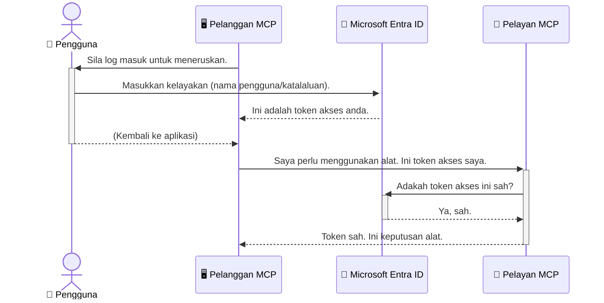

# Menjamin Aliran Kerja AI: Pengesahan Entra ID untuk Pelayan Protokol Konteks Model

## Pengenalan
Menjamin pelayan Protokol Konteks Model (MCP) anda adalah sama pentingnya dengan mengunci pintu depan rumah anda. Membiarkan pelayan MCP anda terbuka mendedahkan alat dan data anda kepada akses tanpa kebenaran, yang boleh menyebabkan pelanggaran keselamatan. Microsoft Entra ID menyediakan penyelesaian pengurusan identiti dan akses berasaskan awan yang kukuh, membantu memastikan hanya pengguna dan aplikasi yang dibenarkan dapat berinteraksi dengan pelayan MCP anda. Dalam bahagian ini, anda akan belajar cara melindungi aliran kerja AI anda menggunakan pengesahan Entra ID.

## Objektif Pembelajaran
Menjelang akhir bahagian ini, anda akan dapat:

- Memahami kepentingan menjamin pelayan MCP.
- Menerangkan asas-asas Microsoft Entra ID dan pengesahan OAuth 2.0.
- Mengenal pasti perbezaan antara pelanggan awam dan pelanggan sulit.
- Melaksanakan pengesahan Entra ID dalam senario pelayan MCP tempatan (pelanggan awam) dan jauh (pelanggan sulit).
- Mengaplikasikan amalan terbaik keselamatan semasa membangunkan aliran kerja AI.

## Keselamatan dan MCP

Seperti mana anda tidak akan membiarkan pintu depan rumah anda tidak dikunci, anda juga tidak harus membiarkan pelayan MCP anda terbuka untuk sesiapa sahaja mengaksesnya. Menjamin aliran kerja AI anda adalah penting untuk membina aplikasi yang kukuh, boleh dipercayai, dan selamat. Bab ini akan memperkenalkan anda kepada penggunaan Microsoft Entra ID untuk menjamin pelayan MCP anda, memastikan hanya pengguna dan aplikasi yang dibenarkan boleh berinteraksi dengan alat dan data anda.

## Mengapa Keselamatan Penting untuk Pelayan MCP

Bayangkan pelayan MCP anda mempunyai alat yang boleh menghantar emel atau mengakses pangkalan data pelanggan. Pelayan yang tidak dijamin bermakna sesiapa sahaja boleh menggunakan alat itu, menyebabkan akses data tanpa kebenaran, spam, atau aktiviti jahat lain.

Dengan melaksanakan pengesahan, anda memastikan setiap permintaan ke pelayan anda disahkan, mengesahkan identiti pengguna atau aplikasi yang membuat permintaan itu. Ini adalah langkah pertama dan paling penting dalam menjamin aliran kerja AI anda.

## Pengenalan kepada Microsoft Entra ID

[**Microsoft Entra ID**](https://adoption.microsoft.com/microsoft-security/entra/) adalah perkhidmatan pengurusan identiti dan akses berasaskan awan. Anggap ia sebagai pengawal keselamatan sejagat untuk aplikasi anda. Ia mengendalikan proses kompleks mengesahkan identiti pengguna (pengesahan) dan menentukan apa yang mereka dibenarkan lakukan (autorisasi).

Dengan menggunakan Entra ID, anda boleh:

- Membolehkan masuk yang selamat untuk pengguna.
- Melindungi API dan perkhidmatan.
- Menguruskan polisi akses dari satu lokasi pusat.

Untuk pelayan MCP, Entra ID menyediakan penyelesaian yang kukuh dan dipercayai secara meluas untuk menguruskan siapa yang boleh mengakses keupayaan pelayan anda.

---

## Memahami Magiknya: Bagaimana Pengesahan Entra ID Berfungsi

Entra ID menggunakan piawaian terbuka seperti **OAuth 2.0** untuk mengendalikan pengesahan. Walaupun butiran boleh jadi kompleks, konsep terasnya mudah dan boleh difahami dengan analogi.

### Pengenalan Ringkas kepada OAuth 2.0: Kunci Valet

Fikirkan OAuth 2.0 seperti perkhidmatan valet untuk kereta anda. Apabila anda tiba di restoran, anda tidak memberi valet kunci induk anda. Sebaliknya, anda memberikan **kunci valet** yang mempunyai kebenaran terhad—ia boleh menghidupkan kereta dan mengunci pintu, tetapi tidak boleh membuka but atau kompartmen sarung tangan.

Dalam analogi ini:

- **Anda** adalah **Pengguna**.
- **Kereta anda** adalah **Pelayan MCP** dengan alat dan data berharga.
- **Valet** adalah **Microsoft Entra ID**.
- **Pengawal Tempat Letak Kereta** adalah **Klien MCP** (aplikasi yang cuba mengakses pelayan).
- **Kunci Valet** adalah **Token Akses**.

Token akses adalah rentetan teks selamat yang diterima oleh klien MCP dari Entra ID setelah anda masuk. Klien kemudian membentangkan token ini kepada pelayan MCP dengan setiap permintaan. Pelayan dapat mengesahkan token untuk memastikan permintaan adalah sah dan klien mempunyai kebenaran yang diperlukan, semua ini tanpa perlu mengendalikan kelayakan sebenar anda (seperti kata laluan).

### Aliran Pengesahan

Berikut adalah bagaimana proses berfungsi dalam praktik:



### Memperkenalkan Perpustakaan Pengesahan Microsoft (MSAL)

Sebelum kita menyelami kod, penting untuk memperkenalkan komponen utama yang akan anda lihat dalam contoh: **Perpustakaan Pengesahan Microsoft (MSAL)**.

MSAL adalah perpustakaan yang dibangunkan oleh Microsoft yang memudahkan pembangun mengendalikan pengesahan. Daripada anda perlu menulis semua kod kompleks untuk mengendalikan token keselamatan, menguruskan log masuk, dan menyegarkan sesi, MSAL menguruskan tugasan berat itu.

Menggunakan perpustakaan seperti MSAL sangat disarankan kerana:

- **Ia Selamat:** Ia melaksanakan protokol standard industri dan amalan terbaik keselamatan, mengurangkan risiko kelemahan dalam kod anda.
- **Ia Memudahkan Pembangunan:** Ia mengabstrakkan kerumitan protokol OAuth 2.0 dan OpenID Connect, membolehkan anda menambah pengesahan kukuh ke aplikasi anda hanya dengan beberapa baris kod.
- **Ia Diselenggara:** Microsoft secara aktif menyelenggara dan mengemas kini MSAL untuk menangani ancaman keselamatan baru dan perubahan platform.

MSAL menyokong pelbagai bahasa dan rangka kerja aplikasi, termasuk .NET, JavaScript/TypeScript, Python, Java, Go, dan platform mudah alih seperti iOS dan Android. Ini bermakna anda boleh menggunakan corak pengesahan yang konsisten di seluruh tumpukan teknologi anda.

Untuk mengetahui lebih lanjut tentang MSAL, anda boleh melihat dokumentasi rasmi [gambaran keseluruhan MSAL](https://learn.microsoft.com/entra/identity-platform/msal-overview).

---

## Menjamin Pelayan MCP Anda dengan Entra ID: Panduan Langkah demi Langkah

Sekarang, mari kita telusuri bagaimana untuk menjamin pelayan MCP tempatan (yang berkomunikasi melalui `stdio`) menggunakan Entra ID. Contoh ini menggunakan **pelanggan awam**, yang sesuai untuk aplikasi yang dijalankan pada mesin pengguna, seperti aplikasi desktop atau pelayan pembangunan tempatan.

### Senario 1: Menjamin Pelayan MCP Tempatan (dengan Pelanggan Awam)

Dalam senario ini, kita akan melihat pelayan MCP yang berjalan secara tempatan, berkomunikasi melalui `stdio`, dan menggunakan Entra ID untuk mengesahkan pengguna sebelum membenarkan akses ke alatnya. Pelayan akan mempunyai satu alat yang mengambil maklumat profil pengguna dari Microsoft Graph API.

#### 1. Menyediakan Aplikasi dalam Entra ID

Sebelum menulis kod, anda perlu mendaftarkan aplikasi anda dalam Microsoft Entra ID. Ini memberitahu Entra ID tentang aplikasi anda dan memberi keizinan untuk menggunakan perkhidmatan pengesahan.

1. Pergi ke **[portal Microsoft Entra](https://entra.microsoft.com/)**.
2. Pergi ke **Pendaftaran aplikasi** dan klik **Pendaftaran baru**.
3. Beri nama aplikasi anda (contohnya, "Pelayan MCP Tempatan Saya").
4. Untuk **Jenis akaun yang disokong**, pilih **Akaun dalam direktori organisasi ini sahaja**.
5. Anda boleh biarkan **URI Pengalihan** kosong untuk contoh ini.
6. Klik **Daftar**.

Setelah didaftarkan, ambil perhatian **ID Aplikasi (klien)** dan **ID Direktori (penyewa)**. Anda akan memerlukan ini dalam kod anda.

#### 2. Kod: Perincian

Mari lihat bahagian utama kod yang mengendalikan pengesahan. Kod penuh untuk contoh ini boleh didapati dalam folder [Entra ID - Tempatan - WAM](https://github.com/Azure-Samples/mcp-auth-servers/tree/main/src/entra-id-local-wam) dari repositori GitHub [mcp-auth-servers](https://github.com/Azure-Samples/mcp-auth-servers).

**`AuthenticationService.cs`**

Kelas ini bertanggungjawab mengendalikan interaksi dengan Entra ID.

- **`CreateAsync`**: Kaedah ini menginisialisasi `PublicClientApplication` dari MSAL (Perpustakaan Pengesahan Microsoft). Ia dikonfigurasi dengan `clientId` dan `tenantId` aplikasi anda.
- **`WithBroker`**: Ini membolehkan penggunaan broker (seperti Windows Web Account Manager), yang menyediakan pengalaman masuk tunggal yang lebih selamat dan lancar.
- **`AcquireTokenAsync`**: Ini adalah kaedah teras. Ia terlebih dahulu cuba mendapatkan token secara senyap (bermaksud pengguna tidak perlu masuk semula jika sudah ada sesi yang sah). Jika token senyap tidak dapat diperoleh, ia akan meminta pengguna untuk masuk secara interaktif.

```csharp
// Simplified for clarity
public static async Task<AuthenticationService> CreateAsync(ILogger<AuthenticationService> logger)
{
    var msalClient = PublicClientApplicationBuilder
        .Create(_clientId) // Your Application (client) ID
        .WithAuthority(AadAuthorityAudience.AzureAdMyOrg)
        .WithTenantId(_tenantId) // Your Directory (tenant) ID
        .WithBroker(new BrokerOptions(BrokerOptions.OperatingSystems.Windows))
        .Build();

    // ... cache registration ...

    return new AuthenticationService(logger, msalClient);
}

public async Task<string> AcquireTokenAsync()
{
    try
    {
        // Try silent authentication first
        var accounts = await _msalClient.GetAccountsAsync();
        var account = accounts.FirstOrDefault();

        AuthenticationResult? result = null;

        if (account != null)
        {
            result = await _msalClient.AcquireTokenSilent(_scopes, account).ExecuteAsync();
        }
        else
        {
            // If no account, or silent fails, go interactive
            result = await _msalClient.AcquireTokenInteractive(_scopes).ExecuteAsync();
        }

        return result.AccessToken;
    }
    catch (Exception ex)
    {
        _logger.LogError(ex, "An error occurred while acquiring the token.");
        throw; // Optionally rethrow the exception for higher-level handling
    }
}
```

**`Program.cs`**

Di sinilah pelayan MCP disiapkan dan perkhidmatan pengesahan diintegrasikan.

- **`AddSingleton<AuthenticationService>`**: Ini mendaftarkan `AuthenticationService` dengan kontena suntikan pergantungan, supaya ia boleh digunakan oleh bahagian lain aplikasi (seperti alat kami).
- **Alat `GetUserDetailsFromGraph`**: Alat ini memerlukan contoh `AuthenticationService`. Sebelum melakukan apa-apa, ia memanggil `authService.AcquireTokenAsync()` untuk mendapatkan token akses yang sah. Jika pengesahan berjaya, ia menggunakan token untuk memanggil Microsoft Graph API dan mengambil butiran pengguna.

```csharp
// Simplified for clarity
[McpServerTool(Name = "GetUserDetailsFromGraph")]
public static async Task<string> GetUserDetailsFromGraph(
    AuthenticationService authService)
{
    try
    {
        // This will trigger the authentication flow
        var accessToken = await authService.AcquireTokenAsync();

        // Use the token to create a GraphServiceClient
        var graphClient = new GraphServiceClient(
            new BaseBearerTokenAuthenticationProvider(new TokenProvider(authService)));

        var user = await graphClient.Me.GetAsync();

        return System.Text.Json.JsonSerializer.Serialize(user);
    }
    catch (Exception ex)
    {
        return $"Error: {ex.Message}";
    }
}
```

#### 3. Bagaimana Semuanya Berfungsi Bersama

1. Apabila klien MCP cuba menggunakan alat `GetUserDetailsFromGraph`, alat tersebut terlebih dahulu memanggil `AcquireTokenAsync`.
2. `AcquireTokenAsync` mencetuskan perpustakaan MSAL untuk memeriksa token yang sah.
3. Jika tiada token ditemui, MSAL, melalui broker, akan meminta pengguna untuk log masuk dengan akaun Entra ID mereka.
4. Setelah pengguna masuk, Entra ID mengeluarkan token akses.
5. Alat menerima token dan menggunakannya untuk membuat panggilan selamat ke Microsoft Graph API.
6. Butiran pengguna dikembalikan kepada klien MCP.

Proses ini memastikan hanya pengguna yang disahkan boleh menggunakan alat itu, dengan berkesan menjamin pelayan MCP tempatan anda.

### Senario 2: Menjamin Pelayan MCP Jauh (dengan Pelanggan Sulit)

Apabila pelayan MCP anda berjalan pada mesin jauh (seperti pelayan awan) dan berkomunikasi melalui protokol seperti Penstriman HTTP, keperluan keselamatan adalah berbeza. Dalam kes ini, anda harus menggunakan **pelanggan sulit** dan **Aliran Kod Autorisasi**. Ini adalah kaedah yang lebih selamat kerana rahsia aplikasi tidak pernah didedahkan kepada penyemak imbas.

Contoh ini menggunakan pelayan MCP berasaskan TypeScript yang menggunakan Express.js untuk mengendalikan permintaan HTTP.

#### 1. Menyediakan Aplikasi dalam Entra ID

Persediaan dalam Entra ID adalah serupa dengan pelanggan awam, tetapi dengan satu perbezaan utama: anda perlu membuat **rahsia klien**.

1. Pergi ke **[portal Microsoft Entra](https://entra.microsoft.com/)**.
2. Dalam pendaftaran aplikasi anda, pergi ke tab **Sijil & rahsia**.
3. Klik **Rahsia klien baru**, beri keterangan, dan klik **Tambah**.
4. **Penting:** Salin nilai rahsia dengan segera. Anda tidak akan dapat melihatnya lagi.
5. Anda juga perlu konfigurasi **URI Pengalihan**. Pergi ke tab **Pengesahan**, klik **Tambah platform**, pilih **Web**, dan masukkan URI pengalihan untuk aplikasi anda (contohnya, `http://localhost:3001/auth/callback`).

> **⚠️ Nota Keselamatan Penting:** Untuk aplikasi pengeluaran, Microsoft sangat mengesyorkan menggunakan kaedah pengesahan tanpa rahsia seperti **Identiti Terurus** atau **Federasi Identiti Beban Kerja** sebagai ganti rahsia klien. Rahsia klien berisiko keselamatan kerana boleh didedahkan atau dikompromi. Identiti terurus menyediakan pendekatan yang lebih selamat dengan menghapuskan keperluan menyimpan kelayakan dalam kod atau konfigurasi anda.
>
> Untuk maklumat lanjut mengenai identiti terurus dan cara melaksanakannya, lihat [gambaran keseluruhan identiti terurus untuk sumber Azure](https://learn.microsoft.com/entra/identity/managed-identities-azure-resources/overview).

#### 2. Kod: Perincian

Contoh ini menggunakan pendekatan berasaskan sesi. Apabila pengguna mengesahkan, pelayan menyimpan token akses dan token segar dalam sesi dan memberikan token sesi kepada pengguna. Token sesi ini kemudiannya digunakan untuk permintaan berikutnya. Kod penuh untuk contoh ini boleh didapati dalam folder [Entra ID - Pelanggan sulit](https://github.com/Azure-Samples/mcp-auth-servers/tree/main/src/entra-id-cca-session) dari repositori GitHub [mcp-auth-servers](https://github.com/Azure-Samples/mcp-auth-servers).

**`Server.ts`**

Fail ini menyediakan pelayan Express dan lapisan pengangkutan MCP.

- **`requireBearerAuth`**: Ini adalah perisian pertengahan yang melindungi titik akhir `/sse` dan `/message`. Ia memeriksa token pembawa yang sah dalam header `Authorization` permintaan.
- **`EntraIdServerAuthProvider`**: Ini adalah kelas khusus yang melaksanakan antara muka `McpServerAuthorizationProvider`. Ia bertanggungjawab mengendalikan aliran OAuth 2.0.
- **`/auth/callback`**: Titik akhir ini mengendalikan pengalihan dari Entra ID selepas pengguna melakukan pengesahan. Ia menukar kod autorisasi kepada token akses dan token segar.

```typescript
// Dipermudahkan untuk kejelasan
const app = express();
const { server } = createServer();
const provider = new EntraIdServerAuthProvider();

// Lindungi titik akhir SSE
app.get("/sse", requireBearerAuth({
  provider,
  requiredScopes: ["User.Read"]
}), async (req, res) => {
  // ... sambungkan ke pengangkutan ...
});

// Lindungi titik akhir mesej
app.post("/message", requireBearerAuth({
  provider,
  requiredScopes: ["User.Read"]
}), async (req, res) => {
  // ... kendalikan mesej ...
});

// Kendalikan panggilan balik OAuth 2.0
app.get("/auth/callback", (req, res) => {
  provider.handleCallback(req.query.code, req.query.state)
    .then(result => {
      // ... kendalikan kejayaan atau kegagalan ...
    });
});
```

**`Tools.ts`**

Fail ini mentakrifkan alat yang disediakan oleh pelayan MCP. Alat `getUserDetails` adalah serupa dengan yang dalam contoh sebelum ini, tetapi ia mendapatkan token akses dari sesi.

```typescript
// Dipermudahkan untuk kejelasan
server.setRequestHandler(CallToolRequestSchema, async (request) => {
  const { name } = request.params;
  const context = request.params?.context as { token?: string } | undefined;
  const sessionToken = context?.token;

  if (name === ToolName.GET_USER_DETAILS) {
    if (!sessionToken) {
      throw new AuthenticationError("Authentication token is missing or invalid. Ensure the token is provided in the request context.");
    }

    // Dapatkan token Entra ID dari stor sesi
    const tokenData = tokenStore.getToken(sessionToken);
    const entraIdToken = tokenData.accessToken;

    const graphClient = Client.init({
      authProvider: (done) => {
        done(null, entraIdToken);
      }
    });

    const user = await graphClient.api('/me').get();

    // ... kembalikan butiran pengguna ...
  }
});
```

**`auth/EntraIdServerAuthProvider.ts`**

Kelas ini mengendalikan logik untuk:

- Mengalihkan pengguna ke halaman log masuk Entra ID.
- Menukar kod autorisasi kepada token akses.
- Menyimpan token dalam `tokenStore`.
- Menyegarkan token akses apabila ia tamat tempoh.

#### 3. Bagaimana Semuanya Berfungsi Bersama

1. Apabila pengguna pertama kali cuba menyambung ke pelayan MCP, perisian pertengahan `requireBearerAuth` akan melihat bahawa mereka tidak mempunyai sesi sah dan akan mengalihkan mereka ke halaman log masuk Entra ID.
2. Pengguna log masuk dengan akaun Entra ID mereka.
3. Entra ID mengalihkan pengguna kembali ke titik akhir `/auth/callback` dengan kod kebenaran.
4. Pelayan menukar kod itu kepada token capaian dan token penyegaran, menyimpannya, dan mencipta token sesi yang dihantar kepada klien.
5. Klien kini boleh menggunakan token sesi ini dalam pengepala `Authorization` untuk semua permintaan masa hadapan ke pelayan MCP.
6. Apabila alat `getUserDetails` dipanggil, ia menggunakan token sesi untuk mencari token capaian Entra ID dan kemudian menggunakannya untuk memanggil Microsoft Graph API.

Aliran ini lebih kompleks berbanding aliran klien awam, tetapi diperlukan untuk titik akhir yang berhadapan dengan internet. Oleh kerana pelayan MCP jauh boleh diakses melalui internet awam, mereka memerlukan langkah keselamatan yang lebih kukuh untuk melindungi daripada akses tanpa kebenaran dan serangan berpotensi.


## Amalan Terbaik Keselamatan

- **Sentiasa gunakan HTTPS**: Sulitkan komunikasi antara klien dan pelayan untuk melindungi token daripada dipintas.
- **Laksanakan Kawalan Akses Berasaskan Peranan (RBAC)**: Jangan hanya periksa *jika* pengguna diautentikasi; periksa *apa* yang mereka dibenarkan lakukan. Anda boleh mentakrif peranan dalam Entra ID dan menyemaknya dalam pelayan MCP anda.
- **Pantau dan audit**: Log semua kejadian pengesahan supaya anda dapat mengesan dan bertindak balas terhadap aktiviti mencurigakan.
- **Kendalikan had kadar dan pengurangan**: Microsoft Graph dan API lain melaksanakan had kadar untuk mengelakkan penyalahgunaan. Laksanakan logik tolak balik eksponen dan cuba semula dalam pelayan MCP anda untuk mengendalikan respons HTTP 429 (Terlalu Banyak Permintaan) dengan baik. Pertimbangkan untuk menyimpan data yang kerap diakses dalam cache untuk mengurangkan panggilan API.
- **Penyimpanan token yang selamat**: Simpan token capaian dan token penyegaran dengan selamat. Untuk aplikasi tempatan, gunakan mekanisme penyimpanan selamat sistem. Untuk aplikasi pelayan, pertimbangkan menggunakan penyimpanan terenskripsi atau perkhidmatan pengurusan kunci selamat seperti Azure Key Vault.
- **Pengendalian tamat tempoh token**: Token capaian mempunyai jangka hayat terhad. Laksanakan penyegaran token automatik menggunakan token penyegaran untuk mengekalkan pengalaman pengguna lancar tanpa memerlukan pengesahan semula.
- **Pertimbangkan menggunakan Azure API Management**: Walaupun melaksanakan keselamatan secara langsung dalam pelayan MCP anda memberi kawalan terperinci, Gerbang API seperti Azure API Management boleh mengendalikan banyak kebimbangan keselamatan ini secara automatik, termasuk pengesahan, kebenaran, had kadar, dan pemantauan. Ia menyediakan lapisan keselamatan berpusat yang terletak antara klien anda dan pelayan MCP anda. Untuk maklumat lanjut mengenai penggunaan Gerbang API dengan MCP, lihat [Azure API Management Your Auth Gateway For MCP Servers](https://techcommunity.microsoft.com/blog/integrationsonazureblog/azure-api-management-your-auth-gateway-for-mcp-servers/4402690).


## Pengajaran Utama

- Mengamankan pelayan MCP anda adalah penting untuk melindungi data dan alat anda.
- Microsoft Entra ID menyediakan penyelesaian yang kukuh dan boleh skala untuk pengesahan dan kebenaran.
- Gunakan **klien awam** untuk aplikasi tempatan dan **klien sulit** untuk pelayan jauh.
- **Aliran Kod Kebenaran** adalah pilihan paling selamat untuk aplikasi web.


## Latihan

1. Fikirkan tentang pelayan MCP yang mungkin anda bina. Adakah ia pelayan tempatan atau pelayan jauh?
2. Berdasarkan jawapan anda, adakah anda akan menggunakan klien awam atau sulit?
3. Apakah kebenaran yang akan diminta oleh pelayan MCP anda untuk melaksanakan tindakan terhadap Microsoft Graph?


## Latihan Praktikal

### Latihan 1: Daftar Aplikasi dalam Entra ID  
Navigasi ke portal Microsoft Entra.  
Daftar aplikasi baru untuk pelayan MCP anda.  
Catat ID Aplikasi (klien) dan ID Direktori (penyewa).

### Latihan 2: Amankan Pelayan MCP Tempatan (Klien Awam)  
- Ikuti contoh kod untuk mengintegrasikan MSAL (Perpustakaan Pengesahan Microsoft) bagi pengesahan pengguna.  
- Uji aliran pengesahan dengan memanggil alat MCP yang mengambil butiran pengguna dari Microsoft Graph.

### Latihan 3: Amankan Pelayan MCP Jauh (Klien Sulit)  
- Daftar klien sulit dalam Entra ID dan cipta rahsia klien.  
- Konfigurasikan pelayan MCP Express.js anda untuk menggunakan Aliran Kod Kebenaran.  
- Uji titik akhir yang dilindungi dan sahkan akses berasaskan token.

### Latihan 4: Terapkan Amalan Terbaik Keselamatan  
- Aktifkan HTTPS untuk pelayan tempatan atau jauh anda.  
- Laksanakan kawalan akses berasaskan peranan (RBAC) dalam logik pelayan anda.  
- Tambah pengendalian tamat tempoh token dan penyimpanan token yang selamat.

## Sumber

1. **Dokumentasi Gambaran Keseluruhan MSAL**  
   Pelajari bagaimana Perpustakaan Pengesahan Microsoft (MSAL) membolehkan perolehan token yang selamat merentasi platform:  
   [MSAL Overview on Microsoft Learn](https://learn.microsoft.com/en-gb/entra/msal/overview)

2. **Repositori GitHub Azure-Samples/mcp-auth-servers**  
   Implementasi rujukan pelayan MCP yang menunjukkan aliran pengesahan:  
   [Azure-Samples/mcp-auth-servers on GitHub](https://github.com/Azure-Samples/mcp-auth-servers)

3. **Gambaran Keseluruhan Identiti Terurus untuk Sumber Azure**  
   Fahami cara menghapuskan rahsia dengan menggunakan identiti terurus yang ditetapkan oleh sistem atau pengguna:  
   [Managed Identities Overview on Microsoft Learn](https://learn.microsoft.com/en-us/entra/identity/managed-identities-azure-resources/)

4. **Azure API Management: Your Auth Gateway for MCP Servers**  
   Kajian mendalam tentang menggunakan APIM sebagai gerbang OAuth2 selamat untuk pelayan MCP:  
   [Azure API Management Your Auth Gateway For MCP Servers](https://techcommunity.microsoft.com/blog/integrationsonazureblog/azure-api-management-your-auth-gateway-for-mcp-servers/4402690)

5. **Rujukan Kebenaran Microsoft Graph**  
   Senarai lengkap kebenaran delegasi dan aplikasi untuk Microsoft Graph:  
   [Microsoft Graph Permissions Reference](https://learn.microsoft.com/zh-tw/graph/permissions-reference)


## Hasil Pembelajaran  
Selepas melengkapkan bahagian ini, anda akan dapat:

- Menjelaskan mengapa pengesahan adalah kritikal untuk pelayan MCP dan aliran kerja AI.  
- Menyediakan dan mengkonfigurasi pengesahan Entra ID untuk senario pelayan MCP tempatan dan jauh.  
- Memilih jenis klien yang sesuai (awam atau sulit) berdasarkan penyebaran pelayan anda.  
- Melaksanakan amalan pengkodan selamat, termasuk penyimpanan token dan kebenaran berasaskan peranan.  
- Melindungi pelayan MCP dan alatnya daripada akses tanpa kebenaran dengan keyakinan.

## Apa seterusnya

- [5.13 Integrasi Model Context Protocol (MCP) dengan Microsoft Foundry](../mcp-foundry-agent-integration/README.md)

---

<!-- CO-OP TRANSLATOR DISCLAIMER START -->
**Penafian**:
Dokumen ini telah diterjemahkan menggunakan perkhidmatan terjemahan AI [Co-op Translator](https://github.com/Azure/co-op-translator). Walaupun kami berusaha untuk ketepatan, sila ambil maklum bahawa terjemahan automatik mungkin mengandungi kesilapan atau ketidaktepatan. Dokumen asal dalam bahasa asalnya harus dianggap sebagai sumber yang sahih. Untuk maklumat penting, terjemahan oleh manusia profesional adalah disyorkan. Kami tidak bertanggungjawab terhadap sebarang salah faham atau salah tafsir yang timbul daripada penggunaan terjemahan ini.
<!-- CO-OP TRANSLATOR DISCLAIMER END -->