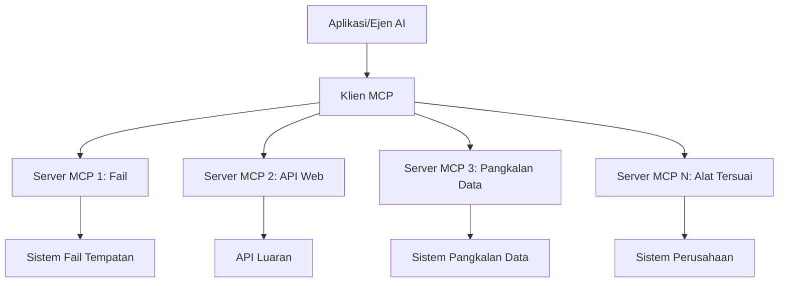

# 🌐 Modul 2: MCP dengan Asas Microsoft Foundry Toolkit

[]()
[]()
[]()

## 📋 Objektif Pembelajaran

Menjelang akhir modul ini, anda akan dapat:
- ✅ Memahami seni bina dan manfaat Model Context Protocol (MCP)
- ✅ Meneroka ekosistem pelayan MCP Microsoft
- ✅ Mengintegrasikan pelayan MCP dengan Pembina Ejen Microsoft Foundry Toolkit
- ✅ Membina agen automasi pelayar berfungsi menggunakan Playwright MCP
- ✅ Mengkonfigurasi dan menguji alat MCP dalam agen anda
- ✅ Mengeksport dan menyebarkan agen yang dikuasakan MCP untuk penggunaan produksi

## 🎯 Membangun Dari Modul 1

Dalam Modul 1, kita telah menguasai asas Microsoft Foundry Toolkit dan mencipta Ejen Python pertama kita. Kini kita akan **memperkuat** ejen anda dengan menyambungkannya ke alat dan perkhidmatan luaran melalui **Model Context Protocol (MCP)** yang revolusioner.

Fikirkan ini seperti menaik taraf dari kalkulator asas ke komputer penuh - ejen AI anda akan memperoleh keupayaan untuk:
- 🌐 Melayari dan berinteraksi dengan laman web
- 📁 Mengakses dan mengendalikan fail
- 🔧 Mengintegrasi dengan sistem perusahaan
- 📊 Memproses data masa nyata dari API

## 🧠 Memahami Model Context Protocol (MCP)

### 🔍 Apa itu MCP?

Model Context Protocol (MCP) adalah **"USB-C untuk aplikasi AI"** - satu piawaian terbuka revolusioner yang menghubungkan Model Bahasa Besar (LLM) ke alat luar, sumber data, dan perkhidmatan. Sama seperti USB-C yang menghapuskan kekacauan kabel dengan menyediakan satu penyambung universal, MCP menghapuskan kerumitan integrasi AI dengan satu protokol piawai.

### 🎯 Masalah yang Diselesaikan MCP

**Sebelum MCP:**
- 🔧 Integrasi tersuai untuk setiap alat
- 🔄 Terperangkap dengan vendor menggunakan penyelesaian proprietari
- 🔒 Kerentanan keselamatan akibat sambungan ad-hoc
- ⏱️ Bulan pembangunan untuk integrasi asas

**Dengan MCP:**
- ⚡ Integrasi alat plug-and-play
- 🔄 Seni bina tanpa bergantung vendor tertentu
- 🛡️ Amalan keselamatan terbina dalam
- 🚀 Beberapa minit untuk menambah keupayaan baru

### 🏗️ Imbasan Seni Bina MCP

MCP mengikut seni bina **pelanggan-pelayan** yang mewujudkan ekosistem yang selamat dan boleh diskala:



**🔧 Komponen Teras:**

| Komponen | Peranan | Contoh |
|-----------|---------|---------|
| **Hos MCP** | Aplikasi yang menggunakan perkhidmatan MCP | Claude Desktop, VS Code, Microsoft Foundry Toolkit |
| **Klien MCP** | Pengendali protokol (1:1 dengan pelayan) | Terbenam dalam aplikasi hos |
| **Pelayan MCP** | Mendedahkan keupayaan melalui protokol piawai | Playwright, Files, Azure, GitHub |
| **Lapisan Pengangkutan** | Kaedah komunikasi | stdio, HTTP, WebSockets |


## 🏢 Ekosistem Pelayan MCP Microsoft

Microsoft mengetuai ekosistem MCP dengan suite pelayan kelas perusahaan yang komprehensif untuk memenuhi keperluan perniagaan sebenar.

### 🌟 Pelayan MCP Microsoft yang Ditampilkan

#### 1. ☁️ Pelayan MCP Azure
**🔗 Repositori**: [azure/azure-mcp](https://github.com/azure/azure-mcp)
**🎯 Tujuan**: Pengurusan sumber Azure menyeluruh dengan integrasi AI

**✨ Ciri Utama:**
- Penyediaan infrastruktur deklaratif
- Pemantauan sumber masa nyata
- Cadangan pengoptimuman kos
- Pemeriksaan pematuhan keselamatan

**🚀 Kes Penggunaan:**
- Infrastruktur-sebagai-Kod dengan bantuan AI
- Penskalaan sumber automatik
- Pengoptimuman kos awan
- Automasi aliran kerja DevOps

#### 2. 📊 Microsoft Dataverse MCP
**📚 Dokumentasi**: [Microsoft Dataverse Integration](https://go.microsoft.com/fwlink/?linkid=2320176)
**🎯 Tujuan**: Antara muka bahasa semula jadi untuk data perniagaan

**✨ Ciri Utama:**
- Pertanyaan pangkalan data dalam bahasa semula jadi
- Pemahaman konteks perniagaan
- Templat prompt tersuai
- Tata kelola data perusahaan

**🚀 Kes Penggunaan:**
- Laporan perisikan perniagaan
- Analisis data pelanggan
- Pandangan saluran jualan
- Pertanyaan data pematuhan

#### 3. 🌐 Pelayan MCP Playwright
**🔗 Repositori**: [microsoft/playwright-mcp](https://github.com/microsoft/playwright-mcp)
**🎯 Tujuan**: Keupayaan automasi pelayar dan interaksi web

**✨ Ciri Utama:**
- Automasi merentas pelayar (Chrome, Firefox, Safari)
- Pengesanan elemen pintar
- Penangkapan skrin dan penjanaan PDF
- Pemantauan trafik rangkaian

**🚀 Kes Penggunaan:**
- Aliran kerja ujian automatik
- Pengikisan web dan ekstraksi data
- Pemantauan UI/UX
- Automasi analisis persaingan

#### 4. 📁 Pelayan MCP Files
**🔗 Repositori**: [microsoft/files-mcp-server](https://github.com/microsoft/files-mcp-server)
**🎯 Tujuan**: Operasi sistem fail pintar

**✨ Ciri Utama:**
- Pengurusan fail deklaratif
- Penyelarasan kandungan
- Integrasi kawalan versi
- Ekstraksi metadata

**🚀 Kes Penggunaan:**
- Pengurusan dokumentasi
- Organisasi repositori kod
- Aliran kerja penerbitan kandungan
- Pengendalian fail saluran data

#### 5. 📝 Pelayan MCP MarkItDown
**🔗 Repositori**: [microsoft/markitdown](https://github.com/microsoft/markitdown)
**🎯 Tujuan**: Pemprosesan dan manipulasi Markdown lanjutan

**✨ Ciri Utama:**
- Analisis kaya Markdown
- Penukaran format (MD ↔ HTML ↔ PDF)
- Analisis struktur kandungan
- Pemprosesan templat

**🚀 Kes Penggunaan:**
- Aliran kerja dokumentasi teknikal
- Sistem pengurusan kandungan
- Penjanaan laporan
- Automasi pangkalan pengetahuan

#### 6. 📈 Pelayan MCP Clarity
**📦 Pek**: [@microsoft/clarity-mcp-server](https://www.npmjs.com/package/@microsoft/clarity-mcp-server)
**🎯 Tujuan**: Analitik web dan pemahaman tingkah laku pengguna

**✨ Ciri Utama:**
- Analisis data heatmap
- Rakaman sesi pengguna
- Metodologi prestasi
- Analisis corong konversi

**🚀 Kes Penggunaan:**
- Pengoptimuman laman web
- Penyelidikan pengalaman pengguna
- Analisis ujian A/B
- Papan pemuka perisikan perniagaan

### 🌍 Ekosistem Komuniti

Selain pelayan Microsoft, ekosistem MCP merangkumi:
- **🐙 GitHub MCP**: Pengurusan repositori dan analisis kod
- **🗄️ MCP Pangkalan Data**: Integrasi PostgreSQL, MySQL, MongoDB
- **☁️ MCP Penyedia Awan**: Alat AWS, GCP, Digital Ocean
- **📧 MCP Komunikasi**: Integrasi Slack, Teams, Email

## 🛠️ Makmal Praktikal: Membina Agen Automasi Pelayar

**🎯 Matlamat Projek**: Mencipta agen automasi pelayar pintar menggunakan pelayan Playwright MCP yang boleh melayari laman web, mengekstrak maklumat, dan melakukan interaksi web kompleks.

### 🚀 Fasa 1: Persediaan Asas Agen

#### Langkah 1: Mulakan Ejen Anda
1. **Buka Microsoft Foundry Toolkit Agent Builder**
2. **Cipta Ejen Baharu** dengan konfigurasi berikut:
   - **Nama**: `BrowserAgent`
   - **Model**: Pilih GPT-4o 


### 🔧 Fasa 2: Aliran Kerja Integrasi MCP

#### Langkah 3: Tambah Integrasi Pelayan MCP
1. **Pergi ke Bahagian Alat** dalam Agent Builder
2. **Klik "Tambah Alat"** untuk membuka menu integrasi
3. **Pilih "Pelayan MCP"** daripada pilihan tersedia


**🔍 Memahami Jenis Alat:**
- **Alat Terbenam**: Fungsi pra-konfigurasi Microsoft Foundry Toolkit
- **Pelayan MCP**: Integrasi perkhidmatan luar
- **API Tersuai**: Titik akhir perkhidmatan sendiri anda
- **Panggilan Fungsi**: Akses fungsi model terus

#### Langkah 4: Pilih Pelayan MCP
1. **Pilih pilihan "Pelayan MCP"** untuk meneruskan


2. **Layari Katalog MCP** untuk meneroka integrasi tersedia


### 🎮 Fasa 3: Kejuruteraan Konfigurasi Playwright MCP

#### Langkah 5: Pilih dan Konfigurasi Playwright
1. **Klik "Gunakan Pelayan MCP Terpilih"** untuk mengakses pelayan Microsoft yang disahkan
2. **Pilih "Playwright"** dari senarai terpilih
3. **Terima ID MCP Lalai** atau sesuaikan untuk persekitaran anda


#### Langkah 6: Aktifkan Keupayaan Playwright
**🔑 Langkah Kritikal**: Pilih **SEMUA** kaedah Playwright yang tersedia untuk fungsi maksimum


**🛠️ Alat Playwright Penting:**
- **Navigasi**: `goto`, `goBack`, `goForward`, `reload`
- **Interaksi**: `click`, `fill`, `press`, `hover`, `drag`
- **Ekstraksi**: `textContent`, `innerHTML`, `getAttribute`
- **Pengesahan**: `isVisible`, `isEnabled`, `waitForSelector`
- **Tangkap**: `screenshot`, `pdf`, `video`
- **Rangkaian**: `setExtraHTTPHeaders`, `route`, `waitForResponse`

#### Langkah 7: Sahkan Kejayaan Integrasi
**✅ Petunjuk Kejayaan:**
- Semua alat muncul dalam antaramuka Agent Builder
- Tiada mesej ralat pada panel integrasi
- Status pelayan Playwright menunjukkan "Connected"


**🔧 Penyelesaian Masalah Biasa:**
- **Sambungan Gagal**: Semak sambungan internet dan tetapan firewall
- **Alat Tidak Ada**: Pastikan semua keupayaan dipilih semasa persediaan
- **Ralat Kebenaran**: Periksa VS Code mempunyai kebenaran sistem yang diperlukan

### 🎯 Fasa 4: Kejuruteraan Prompt Lanjutan

#### Langkah 8: Reka Bentuk Prompt Sistem Pintar
Cipta prompt rumit yang memanfaatkan sepenuhnya keupayaan Playwright:

```markdown
# Web Automation Expert System Prompt

## Core Identity
You are an advanced web automation specialist with deep expertise in browser automation, web scraping, and user experience analysis. You have access to Playwright tools for comprehensive browser control.

## Capabilities & Approach
### Navigation Strategy
- Always start with screenshots to understand page layout
- Use semantic selectors (text content, labels) when possible
- Implement wait strategies for dynamic content
- Handle single-page applications (SPAs) effectively

### Error Handling
- Retry failed operations with exponential backoff
- Provide clear error descriptions and solutions
- Suggest alternative approaches when primary methods fail
- Always capture diagnostic screenshots on errors

### Data Extraction
- Extract structured data in JSON format when possible
- Provide confidence scores for extracted information
- Validate data completeness and accuracy
- Handle pagination and infinite scroll scenarios

### Reporting
- Include step-by-step execution logs
- Provide before/after screenshots for verification
- Suggest optimizations and alternative approaches
- Document any limitations or edge cases encountered

## Ethical Guidelines
- Respect robots.txt and rate limiting
- Avoid overloading target servers
- Only extract publicly available information
- Follow website terms of service
```

#### Langkah 9: Cipta Prompt Pengguna Dinamik
Reka prompt yang menunjukkan pelbagai keupayaan:

**🌐 Contoh Analisis Web:**
```markdown
Navigate to github.com/kinfey and provide a comprehensive analysis including:
1. Repository structure and organization
2. Recent activity and contribution patterns  
3. Documentation quality assessment
4. Technology stack identification
5. Community engagement metrics
6. Notable projects and their purposes

Include screenshots at key steps and provide actionable insights.
```


### 🚀 Fasa 5: Pelaksanaan dan Ujian

#### Langkah 10: Laksanakan Automasi Pertama Anda
1. **Klik "Jalankan"** untuk melancarkan urutan automasi
2. **Pantau Pelaksanaan Masa Nyata**:
   - Pelayar Chrome akan dilancarkan secara automatik
   - Ejen melayari laman web sasaran
   - Tangkapan skrin dirakam untuk setiap langkah utama
   - Keputusan analisis dialirkan masa nyata


#### Langkah 11: Analisis Keputusan dan Pandangan
Semak analisis komprehensif dalam antaramuka Agent Builder:


### 🌟 Fasa 6: Keupayaan Lanjutan dan Penyebaran

#### Langkah 12: Eksport dan Penyebaran Produksi
Agent Builder menyokong pelbagai pilihan penyebaran:


## 🎓 Ringkasan Modul 2 & Langkah Seterusnya

### 🏆 Pencapaian Dibuka: Pakar Integrasi MCP

**✅ Kemahiran Dikuasai:**
- [ ] Memahami seni bina dan manfaat MCP
- [ ] Menavigasi ekosistem pelayan MCP Microsoft
- [ ] Mengintegrasi Playwright MCP dengan Microsoft Foundry Toolkit
- [ ] Membina agen automasi pelayar yang canggih
- [ ] Kejuruteraan prompt lanjutan untuk automasi web

### 📚 Sumber Tambahan

- **🔗 Spesifikasi MCP**: [Dokumentasi Protokol Rasmi](https://modelcontextprotocol.io/)
- **🛠️ API Playwright**: [Rujukan Kaedah Lengkap](https://playwright.dev/docs/api/class-playwright)
- **🏢 Pelayan MCP Microsoft**: [Panduan Integrasi Perusahaan](https://github.com/microsoft/mcp-servers)
- **🌍 Contoh Komuniti**: [Galeri Pelayan MCP](https://github.com/modelcontextprotocol/servers)

**🎉 Tahniah!** Anda telah berjaya menguasai integrasi MCP dan kini boleh membina agen AI siap produksi dengan keupayaan alat luaran!


### 🔜 Teruskan ke Modul Seterusnya

Bersedia untuk membawa kemahiran MCP anda ke tahap seterusnya? Teruskan ke **[Modul 3: Pembangunan MCP Lanjutan dengan Microsoft Foundry Toolkit](../lab3/README.md)** di mana anda akan belajar bagaimana untuk:
- Cipta pelayan MCP tersuai anda sendiri
- Konfigurasikan dan gunakan SDK Python MCP terkini
- Sediakan MCP Inspector untuk debugging
- Kuasai aliran kerja pembangunan pelayan MCP lanjutan
- Membina Pelayan MCP Cuaca dari awal

---

<!-- CO-OP TRANSLATOR DISCLAIMER START -->
**Penafian**:
Dokumen ini telah diterjemahkan menggunakan perkhidmatan terjemahan AI [Co-op Translator](https://github.com/Azure/co-op-translator). Walaupun kami berusaha untuk ketepatan, sila ambil maklum bahawa terjemahan automatik mungkin mengandungi kesilapan atau ketidaktepatan. Dokumen asal dalam bahasa asalnya harus dianggap sebagai sumber yang sahih. Untuk maklumat penting, terjemahan oleh manusia profesional adalah disyorkan. Kami tidak bertanggungjawab terhadap sebarang salah faham atau salah tafsir yang timbul daripada penggunaan terjemahan ini.
<!-- CO-OP TRANSLATOR DISCLAIMER END -->