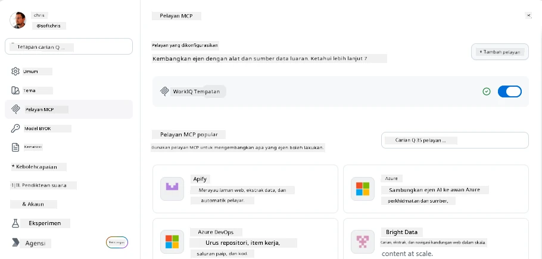
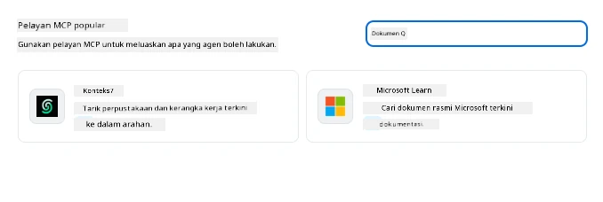
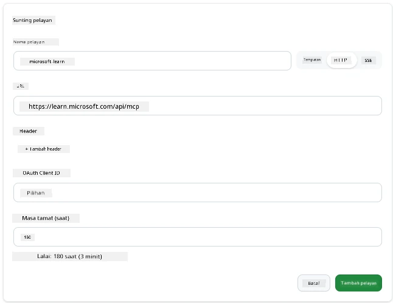
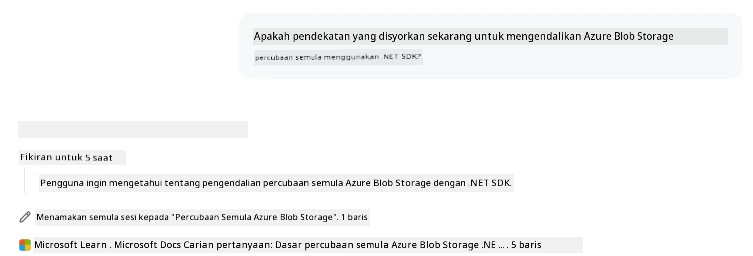
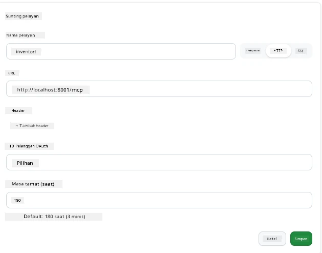
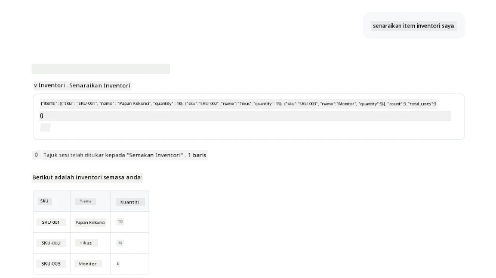
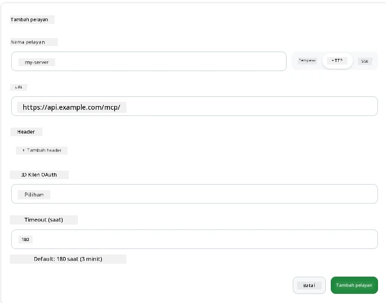
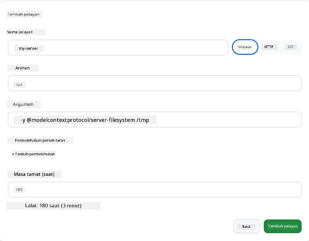

# Menggunakan Pelayan MCP dalam Aplikasi GitHub Copilot

Kini anda sudah tahu cara MCP berfungsi. Anda telah membina pelayan, mentakrifkan alat dan sumber, dan menyambungkan klien. Apa yang belum kita lakukan adalah menukar perspektif: bukannya anda menjadi yang membina pelayan, bagaimana ia kelihatan untuk menjadi pihak *pengguna*—sebagai pengguna aplikasi berkuasa AI yang menyokong MCP?

[Aplikasi GitHub Copilot](https://github.com/github/app) adalah aplikasi desktop yang boleh menggunakan Pelayan MCP. Dengan menyambungkan pelayan MCP kepadanya, anda membuka tahap baru: Copilot kini boleh mencapai dokumentasi anda, memanggil API dalaman anda, membuat pertanyaan ke pangkalan data anda, atau berbual dengan mana-mana perkhidmatan yang anda bungkus dalam pelayan. Aplikasi itu menjadi hos; pelayan MCP anda menjadi alatnya.

Pelajaran ini membimbing anda melalui pengalaman itu dari awal hingga akhir—dari mencari panel tetapan MCP hingga menyambungkan pelayan dokumentasi sebenar dan kemudian menyambungkan pelayan tersuai anda sendiri.

## Objektif Pembelajaran

Menjelang akhir pelajaran ini, anda akan dapat:

- Mengenal pasti dan menavigasi panel Pelayan MCP dalam tetapan Aplikasi Copilot.
- Menyambungkan pelayan dokumentasi yang dihoskan dan menggunakannya dalam sesi.
- Mendaftar pelayan tersuai dan mengesahkan Copilot boleh memanggil alatnya.
- Mengkonfigurasi cara pelayan dipanggil dengan menyediakan sama ada pembolehubah persekitaran atau pengepala tersuai (jika HTTP)

## Aplikasi Copilot sebagai Hos MCP

Ini adalah idea asas: **Ejen Copilot adalah pintar, tetapi mereka hanya tahu apa yang anda beritahu mereka.** Secara lalai, ejen boleh membaca fail dalam ruang kerja anda dan menjalankan arahan terminal, tetapi ia tidak boleh membuat pertanyaan ke pangkalan data anda, melihat kalendar anda, atau memanggil API tersuai tanpa bantuan. Di sinilah pelayan MCP berperanan. Mereka bertindak sebagai jambatan antara Copilot dan sistem anda—pangkalan data, kawalan versi, API, alat reka bentuk—memberi ejen akses kepada maklumat dan tindakan yang mereka perlukan untuk menyelesaikan kerja.

Mari mulakan dengan mencari tetapan untuk mengurus Pelayan MCP aplikasi anda.

## Langkah 1: Mencari Panel Tetapan MCP

Buka Aplikasi Copilot dan cari ikon roda gigi di bawah kiri dan klik padanya.


Pastikan anda memilih "Pelayan MCP" dan anda sepatutnya kini melihat pelayan yang sudah dikonfigurasikan di atas, sebuah pasaran pelayan popular di bawah, dan butang "Tambah Pelayan" di atas seperti berikut:



Ini adalah pusat kawalan anda. Anda boleh menambah, membuang, mengaktifkan, dan mematikan pelayan di sini. Perubahan akan berkuat kuasa untuk sesi baru; jika anda mempunyai sesi terbuka, anda perlu memulakan sesi baru selepas menukar senarai ini.

## Langkah 2: Menyambungkan Pelayan Dokumentasi

Mari lakukan sesuatu yang segera berguna. Pelayan MCP Microsoft Docs memberi Copilot akses kepada dokumentasi rasmi Microsoft. Ini termasuk Azure, .NET, TypeScript, dan banyak lagi. Daripada ejen bergantung pada data latihannya (yang mempunyai tarikh tamat), ia boleh menarik dokumen terkini semasa masa pertanyaan.

Begini cara menambahnya:

1. Dalam grid pelayan popular, taip **learn** dan pilih pelayan yang dinamakan "Microsoft Learn".

   

   Setelah diklik, ia mempersembahkan anda dengan borang di mana nama, jenis pengangkutan dan URL sudah diisi, anda hanya perlu klik "Tambah Pelayan".

2. Klik "Tambah Pelayan", ia akan mengambil masa beberapa saat untuk menyambung ke pelayan.

   

   Setelah ditambah, ia akan muncul di bahagian atas sebagai pelayan yang dikonfigurasikan. Mari cuba seterusnya.

3. Tutup dialog dan pilih Sembang Pantas. 

4. Taip arahan di bawah untuk mencetuskan alat pada pelayan Microsoft Learn.

   ```text
   What's the current recommended approach for handling Azure Blob Storage 
   retries using the .NET SDK?
   ```

   

Anda akan lihat bagaimana ia merujuk kepada Pelayan MCP yang baru sahaja anda tambah.

## Langkah 3: Menyambungkan Pelayan stdio Tersuai

Preset adalah mudah, tetapi kuasa sebenar adalah dengan menyambungkan pelayan anda sendiri. Katakan anda telah membina pelayan (atau diberikan satu) yang mendedahkan API dalaman anda atau pangkalan pengetahuan syarikat. Dalam kes ini, kita akan menggunakan Pelayan MCP yang kami bina yang mengendalikan pengurusan inventori syarikat kami.

1. Klik roda gigi dan pilih "Pelayan MCP" sekali lagi.

2. Pilih butang "Tambah Pelayan" dan "+ Tambah pelayan Tersuai", dan berikan nilai berikut:

   - Nama: `Pelayan Inventori`
   - Pilih pengangkutan (di sebelah kanan), **http**

   Pilih "Tambah Pelayan" dan ia akan muncul dalam senarai pelayan yang dikonfigurasikan.

   

4. Untuk mengujinya, jalankan arahan seperti berikut:

    ```
    list inventory
    ```

   

   Anda kini sepatutnya melihat senarai item inventori yang dikembalikan dari pelayan tersuai yang anda bina.

Hebat, kini anda harus mempunyai pemahaman yang baik tentang menambah pelayan MCP luaran serta pelayan MCP anda sendiri kepada Aplikasi Copilot. Seterusnya, mari kita bincangkan tentang mengendalikan rahsia dan pembolehubah persekitaran.

## Langkah 4: Tetapan Lanjutan

Setakat ini, anda telah melihat bagaimana menambah Pelayan MCP di mana anda hanya menyediakan nama dan URL. Tetapi bagaimana jika pelayan anda memerlukan kunci API atau nilai lain? Bergantung pada jenis pengangkutan, kita boleh memberikannya apa yang diperlukan.

- **Pengangkutan http atau SSE**: Di sini kita boleh menetapkan pengepala mengikut keperluan.

   Untuk pengesahan, anda boleh menentukan pengepala Authorization, sebagai contoh. Nilainya boleh menjadi rentetan statik. Jika anda menggunakan OAuth, anda boleh memberikan ID klien OAuth sebagai gantinya.

   

- **Pengangkutan stdio**: Pembolehubah persekitaran boleh ditetapkan.

   Di sini anda boleh menentukan sebarang bilangan pembolehubah persekitaran yang diperlukan untuk diserahkan ke pelayan apabila ia dimulakan.

   

## Ringkasan

Aplikasi Copilot menganggap pelayan MCP sebagai sambungan kelas pertama bagi keupayaan ejen. Anda telah melihat perjalanan penuh dalam pelajaran ini dari menambah pelayan MCP hingga menggunakannya dalam sesi. Anda kini boleh menyambung ke pelayan awam, API dalaman, dan alat tersuai, membolehkan ejen anda mengakses maklumat dan tindakan yang mereka perlukan untuk menyelesaikan tugas secara autonomi.

## 📚 Sumber Tambahan

### Dokumen rasmi

- [Aplikasi GitHub Copilot](https://github.com/github/app)
- [Spesifikasi MCP](https://modelcontextprotocol.io/specification/2025-03-26) - Spesifikasi Model Context Protocol

### Komuniti
- [Komuniti MCP Discord](https://discord.com/invite/ByRwuEEgH4) - Perbincangan secara langsung
- [Perbincangan GitHub](https://github.com/microsoft/MCP-Server-and-PostgreSQL-Sample-Retail/discussions) - Soal jawab dan perkongsian
- [Stack Overflow](https://stackoverflow.com/questions/tagged/model-context-protocol) - Soalan teknikal

---

<!-- CO-OP TRANSLATOR DISCLAIMER START -->
**Penafian**:
Dokumen ini telah diterjemahkan menggunakan perkhidmatan terjemahan AI [Co-op Translator](https://github.com/Azure/co-op-translator). Walaupun kami berusaha untuk ketepatan, sila ambil maklum bahawa terjemahan automatik mungkin mengandungi kesilapan atau ketidaktepatan. Dokumen asal dalam bahasa asalnya harus dianggap sebagai sumber yang sahih. Untuk maklumat penting, terjemahan oleh manusia profesional adalah disyorkan. Kami tidak bertanggungjawab terhadap sebarang salah faham atau salah tafsir yang timbul daripada penggunaan terjemahan ini.
<!-- CO-OP TRANSLATOR DISCLAIMER END -->