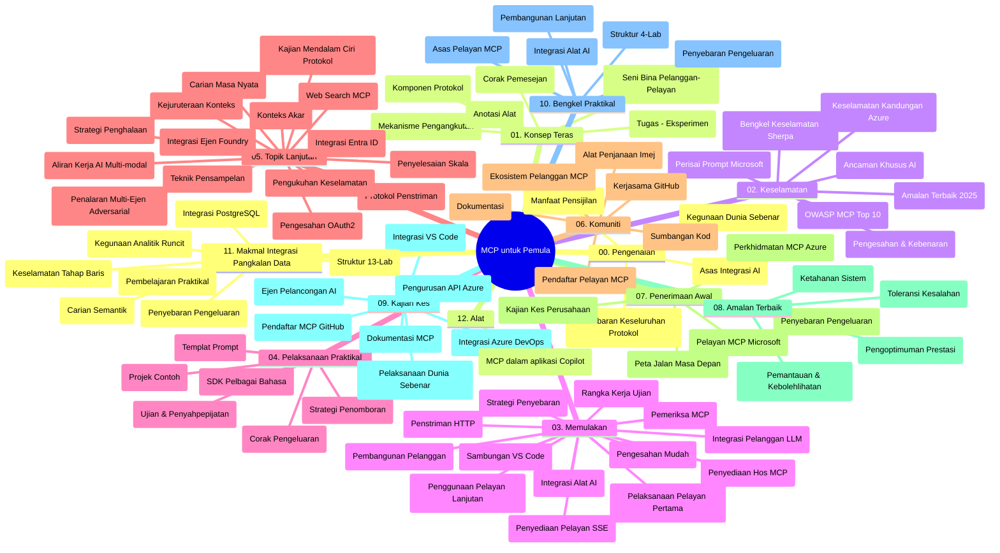

# Protokol Konteks Model (MCP) untuk Pemula - Panduan Kajian

Panduan kajian ini menyediakan gambaran keseluruhan struktur repositori dan kandungan untuk kurikulum "Protokol Konteks Model (MCP) untuk Pemula". Gunakan panduan ini untuk menavigasi repositori dengan cekap dan memanfaatkan sumber yang tersedia dengan maksimum.

## Gambaran Repositori

Protokol Konteks Model (MCP) adalah rangka kerja piawai untuk interaksi antara model AI dan aplikasi klien. Pada mulanya dicipta oleh Anthropic, MCP kini diselenggara oleh komuniti MCP yang lebih luas melalui organisasi rasmi GitHub. Repositori ini menyediakan kurikulum komprehensif dengan contoh kod praktikal dalam C#, Java, JavaScript, Python, dan TypeScript, direka untuk pembangun AI, arkitek sistem, dan jurutera perisian.

## Peta Kurikulum Visual

## Struktur Repositori

Repositori disusun dalam dua belas bahagian utama, setiap satu memfokuskan pada aspek yang berbeza dalam MCP:

1. **Pengenalan (00-Introduction/)**
   - Gambaran keseluruhan Protokol Konteks Model
   - Mengapa piawaian penting dalam saluran AI
   - Kes penggunaan praktikal dan manfaat

2. **Konsep Teras (01-CoreConcepts/)**
   - Seni bina klien-pelayan
   - Komponen utama protokol
   - Corak pemesejan dalam MCP

3. **Keselamatan (02-Security/)**
   - Ancaman keselamatan dalam sistem berasaskan MCP
   - Amalan terbaik untuk menjamin pelaksanaan
   - Strategi pengesahan dan kebenaran
   - **Dokumentasi Keselamatan Komprehensif**:
     - Amalan Terbaik Keselamatan MCP 2025
     - Panduan Pelaksanaan Azure Content Safety
     - Kawalan dan Teknik Keselamatan MCP
     - Rujukan Pantasan Amalan Terbaik MCP
   - **Topik Utama Keselamatan**:
     - Serangan suntikan prompt dan keracunan alat
     - Pengambilalihan sesi dan masalah posisi bingung
     - Kelemahan laluan token
     - Kebenaran berlebihan dan kawalan akses
     - Keselamatan rantaian bekalan untuk komponen AI
     - Integrasi Microsoft Prompt Shields

4. **Mula-mula (03-GettingStarted/)**
   - Persediaan dan konfigurasi persekitaran
   - Mencipta pelayan dan klien MCP asas
   - Integrasi dengan aplikasi sedia ada
   - Termasuk bahagian untuk:
     - Pelaksanaan pelayan pertama
     - Pembangunan klien
     - Integrasi klien LLM
     - Integrasi VS Code
     - Pelayan Server-Sent Events (SSE)
     - Penggunaan pelayan lanjutan
     - Penstriman HTTP
     - Integrasi AI Toolkit
     - Strategi ujian
     - Garis panduan penggubalan

5. **Pelaksanaan Praktikal (04-PracticalImplementation/)**
   - Menggunakan SDK merentas pelbagai bahasa pengaturcaraan
   - Teknik penyahpepijatan, ujian, dan pengesahan
   - Mencipta templat prompt boleh guna semula dan aliran kerja
   - Projek contoh dengan contoh pelaksanaan

6. **Topik Lanjutan (05-AdvancedTopics/)**
   - Teknik kejuruteraan konteks
   - Integrasi agen Foundry
   - Aliran kerja AI multi-modal
   - Demo pengesahan OAuth2
   - Keupayaan carian masa nyata
   - Penstriman masa nyata
   - Pelaksanaan konteks akar
   - Strategi penghalaan
   - Teknik pensampelan
   - Pendekatan penskalaan
   - Pertimbangan keselamatan
   - Integrasi keselamatan Entra ID
   - Integrasi carian web
   - Penalaran multi-agen adversarial (corak debat)

7. **Sumbangan Komuniti (06-CommunityContributions/)**
   - Cara menyumbang kod dan dokumentasi
   - Bekerjasama melalui GitHub
   - Penambahbaikan milik komuniti dan maklum balas
   - Menggunakan pelbagai klien MCP (Claude Desktop, Cline, VSCode)
   - Bekerja dengan pelayan MCP popular termasuk penjanaan imej

8. **Pengajaran dari Penggunaan Awal (07-LessonsfromEarlyAdoption/)**
   - Pelaksanaan dunia sebenar dan kisah kejayaan
   - Membangun dan menggubal solusi berasaskan MCP
   - Trend dan peta jalan masa depan
   - **Panduan Pelayan MCP Microsoft**: Panduan menyeluruh kepada 10 pelayan MCP Microsoft sedia produksi termasuk:
     - Microsoft Learn Docs MCP Server
     - Azure MCP Server (15+ penyambung khusus)
     - GitHub MCP Server
     - Azure DevOps MCP Server
     - MarkItDown MCP Server
     - SQL Server MCP Server
     - Playwright MCP Server
     - Dev Box MCP Server
     - Microsoft Foundry MCP Server
     - Microsoft 365 Agents Toolkit MCP Server

9. **Amalan Terbaik (08-BestPractices/)**
   - Penalaan prestasi dan pengoptimuman
   - Mereka bentuk sistem MCP tahan ralat
   - Strategi ujian dan ketahanan

10. **Kajian Kes (09-CaseStudy/)**
    - **Tujuh kajian kes komprehensif** menunjukkan kebolehgunaan MCP dalam pelbagai senario:
    - **Ejen Pelancongan AI Azure**: Orkestrasi multi-agen dengan Azure OpenAI dan AI Search
    - **Integrasi Azure DevOps**: Automasi proses aliran kerja dengan kemas kini data YouTube
    - **Pengambilan Dokumentasi Masa Nyata**: Klien konsol Python dengan penstriman HTTP
    - **Penjana Rancangan Kajian Interaktif**: Aplikasi web Chainlit dengan AI perbualan
    - **Dokumentasi Dalam Editor**: Integrasi VS Code dengan aliran kerja GitHub Copilot
    - **Pengurusan API Azure**: Integrasi API perusahaan dengan penciptaan pelayan MCP
    - **Pendaftaran MCP GitHub**: Pembangunan ekosistem dan platform integrasi agen
    - Contoh pelaksanaan merangkumi integrasi perusahaan, produktiviti pembangun, dan pembangunan ekosistem

11. **Bengkel Praktikal (10-StreamliningAIWorkflowsBuildingAnMCPServerWithAIToolkit/)**
    - Bengkel praktikal menyeluruh menggabungkan MCP dengan AI Toolkit
    - Membangun aplikasi pintar yang menghubungkan model AI dengan alat dunia nyata
    - Modul praktikal merangkumi asas, pembangunan pelayan khusus, dan strategi penggubalan produksi
    - **Struktur Makmal**:
      - Makmal 1: Asas Pelayan MCP
      - Makmal 2: Pembangunan Pelayan MCP Lanjutan
      - Makmal 3: Integrasi AI Toolkit
      - Makmal 4: Penggubalan Produksi dan Penskalakan
    - Pendekatan pembelajaran berasaskan makmal dengan arahan langkah demi langkah

12. **Makmal Integrasi Pangkalan Data Pelayan MCP (11-MCPServerHandsOnLabs/)**
    - **Jalur pembelajaran komprehensif 13 makmal** untuk membina pelayan MCP sedia produksi dengan integrasi PostgreSQL
    - **Pelaksanaan analitik runcit dunia sebenar** menggunakan kes penggunaan Zava Retail
    - **Corak peringkat perusahaan** termasuk Keselamatan Tahap Baris (RLS), carian semantik, dan akses data pelbagai penyewa
    - **Struktur Makmal Lengkap**:
      - **Makmal 00-03: Asas** - Pengenalan, Seni Bina, Keselamatan, Persediaan Persekitaran
      - **Makmal 04-06: Membangun Pelayan MCP** - Reka Bentuk Pangkalan Data, Pelaksanaan Pelayan MCP, Pembangunan Alat
      - **Makmal 07-09: Ciri Lanjutan** - Carian Semantik, Ujian & Penyahpepijatan, Integrasi VS Code
      - **Makmal 10-12: Produksi & Amalan Terbaik** - Penggubalan, Pemantauan, Pengoptimuman
    - **Teknologi yang Dicakup**: Rangka kerja FastMCP, PostgreSQL, Azure OpenAI, Azure Container Apps, Application Insights
    - **Hasil Pembelajaran**: Pelayan MCP sedia produksi, corak integrasi pangkalan data, analitik berpacu AI, keselamatan perusahaan

13. **Alat (12-tooling/)**
    - Belajar cara menggunakan MCP dalam aplikasi Copilot dan alat lain

## Sumber Tambahan

Repositori mengandungi sumber sokongan:

- **Folder imej**: Mengandungi rajah dan ilustrasi yang digunakan sepanjang kurikulum
- **Terjemahan**: Sokongan berbilang bahasa dengan terjemahan automatik dokumentasi
- **Sumber MCP Rasmi**:
  - [Dokumentasi MCP](https://modelcontextprotocol.io/)
  - [Spesifikasi MCP](https://spec.modelcontextprotocol.io/)
  - [Repositori MCP GitHub](https://github.com/modelcontextprotocol)

## Cara Menggunakan Repositori Ini

1. **Pembelajaran Berurutan**: Ikuti bab mengikut susunan (00 hingga 11) untuk pengalaman pembelajaran berstruktur.
2. **Fokus Mengikut Bahasa**: Jika anda berminat dalam bahasa pengaturcaraan tertentu, terokai direktori sampel untuk pelaksanaan dalam bahasa pilihan anda.
3. **Pelaksanaan Praktikal**: Mula dengan bahagian "Mula-mula" untuk menyediakan persekitaran anda dan mencipta pelayan dan klien MCP pertama anda.
4. **Eksplorasi Lanjutan**: Setelah selesa dengan asas, selami topik lanjutan untuk memperluas pengetahuan anda.
5. **Penglibatan Komuniti**: Sertai komuniti MCP melalui perbincangan GitHub dan saluran Discord untuk berhubung dengan pakar dan pembangun lain.

## Klien dan Alat MCP

Kurikulum merangkumi pelbagai klien dan alat MCP:

1. **Klien Rasmi**:
   - Visual Studio Code
   - MCP dalam Visual Studio Code
   - Claude Desktop
   - Claude dalam VSCode
   - Claude API

2. **Klien Komuniti**:
   - Cline (berbentuk terminal)
   - Cursor (penyunting kod)
   - ChatMCP
   - Windsurf

3. **Alat Pengurusan MCP**:
   - MCP CLI
   - MCP Manager
   - MCP Linker
   - MCP Router

## Pelayan MCP Popular

Repositori memperkenalkan pelbagai pelayan MCP, termasuk:

1. **Pelayan MCP Microsoft Rasmi**:
   - Microsoft Learn Docs MCP Server
   - Azure MCP Server (15+ penyambung khusus)
   - GitHub MCP Server
   - Azure DevOps MCP Server
   - MarkItDown MCP Server
   - SQL Server MCP Server
   - Playwright MCP Server
   - Dev Box MCP Server
   - Microsoft Foundry MCP Server
   - Microsoft 365 Agents Toolkit MCP Server

2. **Pelayan Rujukan Rasmi**:
   - Fail sistem
   - Fetch
   - Memori
   - Pemikiran Berurutan

3. **Penjanaan Imej**:
   - Azure OpenAI DALL-E 3
   - Stable Diffusion WebUI
   - Replicate

4. **Alat Pembangunan**:
   - Git MCP
   - Kawalan Terminal
   - Pembantu Kod

5. **Pelayan Khusus**:
   - Salesforce
   - Microsoft Teams
   - Jira & Confluence

## Menyumbang

Repositori ini mengalu-alukan sumbangan daripada komuniti. Lihat bahagian Sumbangan Komuniti untuk panduan bagaimana menyumbang secara berkesan kepada ekosistem MCP.

----

*Panduan kajian ini dikemas kini terakhir pada 5 Februari 2026, mencerminkan Spesifikasi MCP terkini 2025-11-25 dan menyediakan gambaran keseluruhan repositori setakat tarikh tersebut. Kandungan repositori mungkin dikemas kini selepas tarikh ini.*

---

<!-- CO-OP TRANSLATOR DISCLAIMER START -->
**Penafian**:
Dokumen ini telah diterjemahkan menggunakan perkhidmatan terjemahan AI [Co-op Translator](https://github.com/Azure/co-op-translator). Walaupun kami berusaha untuk ketepatan, sila ambil maklum bahawa terjemahan automatik mungkin mengandungi kesilapan atau ketidaktepatan. Dokumen asal dalam bahasa asalnya harus dianggap sebagai sumber yang sahih. Untuk maklumat penting, terjemahan oleh manusia profesional adalah disyorkan. Kami tidak bertanggungjawab terhadap sebarang salah faham atau salah tafsir yang timbul daripada penggunaan terjemahan ini.
<!-- CO-OP TRANSLATOR DISCLAIMER END -->