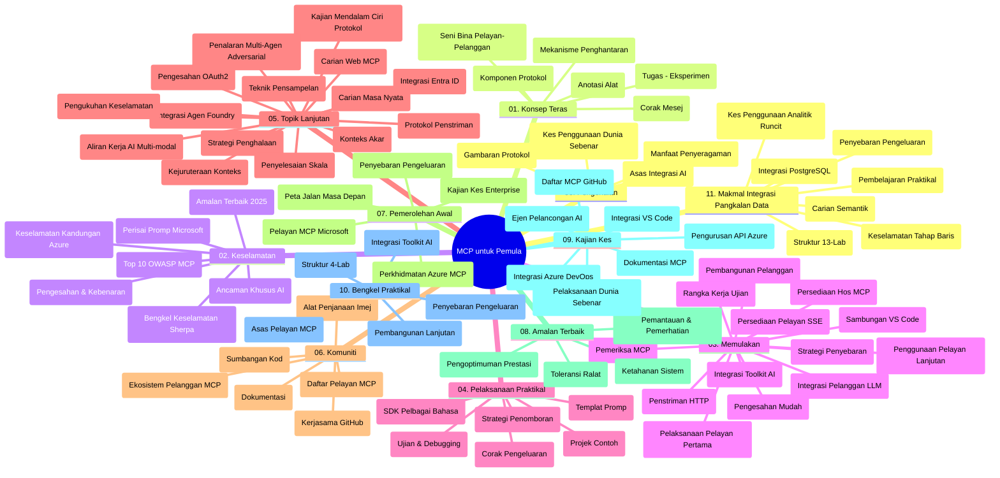

# Model Context Protocol (MCP) untuk Pemula - Panduan Belajar

Panduan belajar ini memberikan gambaran keseluruhan tentang struktur dan kandungan repositori untuk kurikulum "Model Context Protocol (MCP) untuk Pemula". Gunakan panduan ini untuk menavigasi repositori dengan cekap dan memanfaatkan sumber yang tersedia dengan sebaiknya.

## Gambaran Repositori

Model Context Protocol (MCP) adalah rangka kerja piawai untuk interaksi antara model AI dan aplikasi klien. Pada mulanya dicipta oleh Anthropic, MCP kini diselenggara oleh komuniti MCP yang lebih luas melalui organisasi rasmi GitHub. Repositori ini menyediakan kurikulum komprehensif dengan contoh kod praktikal dalam C#, Java, JavaScript, Python, dan TypeScript, direka untuk pembangun AI, arkitek sistem, dan jurutera perisian.

## Peta Kurikulum Visual

## Struktur Repositori

Repositori ini disusun kepada sebelas bahagian utama, setiap satunya memfokuskan kepada aspek yang berbeza mengenai MCP:

1. **Pengenalan (00-Introduction/)**
   - Gambaran Model Context Protocol
   - Mengapa pensijilan piawai penting dalam saluran AI
   - Kes penggunaan praktikal dan manfaat

2. **Konsep Teras (01-CoreConcepts/)**
   - Seni bina klien-pelayan
   - Komponen utama protokol
   - Corak pesanan dalam MCP

3. **Keselamatan (02-Security/)**
   - Ancaman keselamatan dalam sistem berasaskan MCP
   - Amalan terbaik untuk mengamankan pelaksanaan
   - Strategi pengesahan dan kebenaran
   - **Dokumentasi Keselamatan Komprehensif**:
     - Amalan Terbaik Keselamatan MCP 2025
     - Panduan Pelaksanaan Keselamatan Kandungan Azure
     - Kawalan dan Teknik Keselamatan MCP
     - Rujukan Pantas Amalan Terbaik MCP
   - **Topik Keselamatan Utama**:
     - Serangan suntikan perintah dan keracunan alat
     - Pengambilalihan sesi dan masalah "confused deputy"
     - Kelemahan laluan token
     - Kebenaran berlebihan dan kawalan akses
     - Keselamatan rantaian bekalan untuk komponen AI
     - Integrasi Microsoft Prompt Shields

4. **Mula Bermula (03-GettingStarted/)**
   - Persediaan dan konfigurasi persekitaran
   - Mewujudkan pelayan dan klien MCP asas
   - Integrasi dengan aplikasi sedia ada
   - Termasuk bahagian untuk:
     - Pelaksanaan pelayan pertama
     - Pembangunan klien
     - Integrasi klien LLM
     - Integrasi VS Code
     - Pelayan Server-Sent Events (SSE)
     - Penggunaan pelayan lanjutan
     - Penstriman HTTP
     - Integrasi AI Toolkit
     - Strategi pengujian
     - Garis panduan penyebaran

5. **Pelaksanaan Praktikal (04-PracticalImplementation/)**
   - Menggunakan SDK dalam pelbagai bahasa pengaturcaraan
   - Teknik debugging, pengujian, dan pengesahan
   - Mereka bentuk templat arahan dan aliran kerja boleh guna semula
   - Projek contoh dengan contoh pelaksanaan

6. **Topik Lanjutan (05-AdvancedTopics/)**
   - Teknik kejuruteraan konteks
   - Integrasi agen Foundry
   - Aliran kerja AI pelbagai mod
   - Demo pengesahan OAuth2
   - Keupayaan carian masa nyata
   - Penstriman masa nyata
   - Pelaksanaan konteks akar
   - Strategi penghalaan
   - Teknik pensampelan
   - Pendekatan penskalaan
   - Pertimbangan keselamatan
   - Integrasi keselamatan Entra ID
   - Integrasi carian web
   - Penalaran multi-agen adversarial (corak debat)

7. **Sumbangan Komuniti (06-CommunityContributions/)**
   - Cara menyumbang kod dan dokumentasi
   - Bekerjasama melalui GitHub
   - Penambahbaikan dan maklum balas yang dipacu oleh komuniti
   - Menggunakan pelbagai klien MCP (Claude Desktop, Cline, VSCode)
   - Bekerja dengan pelayan MCP popular termasuk penjanaan imej

8. **Pengajaran dari Penggunaan Awal (07-LessonsfromEarlyAdoption/)**
   - Pelaksanaan dunia sebenar dan cerita kejayaan
   - Membina dan menyebarkan penyelesaian berasaskan MCP
   - Tren dan peta jalan masa hadapan
   - **Panduan Pelayan MCP Microsoft**: Panduan komprehensif kepada 10 pelayan MCP Microsoft sedia produksi termasuk:
     - Pelayan MCP Microsoft Learn Docs
     - Pelayan MCP Azure (15+ penyambung khusus)
     - Pelayan MCP GitHub
     - Pelayan MCP Azure DevOps
     - Pelayan MCP MarkItDown
     - Pelayan MCP SQL Server
     - Pelayan MCP Playwright
     - Pelayan MCP Dev Box
     - Pelayan MCP Microsoft Foundry
     - Pelayan MCP Microsoft 365 Agents Toolkit

9. **Amalan Terbaik (08-BestPractices/)**
   - Pengoptimuman dan penalaan prestasi
   - Reka bentuk sistem MCP tahan ralat
   - Strategi pengujian dan ketahanan

10. **Kajian Kes (09-CaseStudy/)**
    - **Tujuh kajian kes komprehensif** yang menunjukkan keserbagunaan MCP merentasi pelbagai senario:
    - **Ejen Pelancongan AI Azure**: Orkestrasi pelbagai ejen dengan Azure OpenAI dan AI Search
    - **Integrasi Azure DevOps**: Automasi proses aliran kerja dengan kemas kini data YouTube
    - **Pengambilan Dokumentasi Masa Nyata**: Klien konsol Python dengan penstriman HTTP
    - **Penjana Pelan Belajar Interaktif**: Aplikasi web Chainlit dengan AI perbualan
    - **Dokumentasi Dalam Editor**: Integrasi VS Code dengan aliran kerja GitHub Copilot
    - **Pengurusan API Azure**: Integrasi API perusahaan dengan penciptaan pelayan MCP
    - **Registri MCP GitHub**: Pembangunan ekosistem dan platform integrasi agen
    - Contoh pelaksanaan merangkumi integrasi perusahaan, produktiviti pembangun, dan pembangunan ekosistem

11. **Bengkel Praktikal (10-StreamliningAIWorkflowsBuildingAnMCPServerWithAIToolkit/)**
    - Bengkel praktikal komprehensif menggabungkan MCP dengan AI Toolkit
    - Membangunkan aplikasi pintar yang menghubungkan model AI dengan alat dunia sebenar
    - Modul praktikal merangkumi asas, pembangunan pelayan tersuai, dan strategi penyebaran produksi
    - **Struktur Makmal**:
      - Makmal 1: Asas Pelayan MCP
      - Makmal 2: Pembangunan Pelayan MCP Lanjutan
      - Makmal 3: Integrasi AI Toolkit
      - Makmal 4: Penyebaran dan Penskalahuan Produksi
    - Pendekatan pembelajaran berasaskan makmal dengan arahan langkah demi langkah

12. **Makmal Integrasi Pangkalan Data Pelayan MCP (11-MCPServerHandsOnLabs/)**
    - **Jalur pembelajaran 13 makmal komprehensif** untuk membina pelayan MCP sedia produksi dengan integrasi PostgreSQL
    - **Pelaksanaan analitik runcit dunia sebenar** menggunakan kes penggunaan Zava Retail
    - **Corak peringkat perusahaan** termasuk Keselamatan Tahap Baris (RLS), carian semantik, dan akses data berbilang penyewa
    - **Struktur Makmal Lengkap**:
      - **Makmal 00-03: Asas** - Pengenalan, Seni Bina, Keselamatan, Persediaan Persekitaran
      - **Makmal 04-06: Membangun Pelayan MCP** - Reka Bentuk Pangkalan Data, Pelaksanaan Pelayan MCP, Pembangunan Alat
      - **Makmal 07-09: Ciri Lanjutan** - Carian Semantik, Pengujian & Debugging, Integrasi VS Code
      - **Makmal 10-12: Produksi & Amalan Terbaik** - Penyebaran, Pemantauan, Pengoptimuman
    - **Teknologi yang Diliputi**: Rangka kerja FastMCP, PostgreSQL, Azure OpenAI, Azure Container Apps, Application Insights
    - **Hasil Pembelajaran**: Pelayan MCP sedia produksi, corak integrasi pangkalan data, analitik berkuasa AI, keselamatan perusahaan

## Sumber Tambahan

Repositori ini termasuk sumber sokongan:

- **Folder imej**: Mengandungi rajah dan ilustrasi yang digunakan sepanjang kurikulum
- **Terjemahan**: Sokongan pelbagai bahasa dengan terjemahan automatik dokumentasi
- **Sumber Rasmi MCP**:
  - [Dokumentasi MCP](https://modelcontextprotocol.io/)
  - [Spesifikasi MCP](https://spec.modelcontextprotocol.io/)
  - [Repositori MCP GitHub](https://github.com/modelcontextprotocol)

## Cara Menggunakan Repositori Ini

1. **Pembelajaran Berurutan**: Ikuti bab mengikut urutan (00 hingga 11) untuk pengalaman pembelajaran terstruktur.
2. **Fokus Bahasa Tertentu**: Jika anda berminat dengan bahasa pengaturcaraan tertentu, terokai direktori contoh untuk pelaksanaan dalam bahasa pilihan anda.
3. **Pelaksanaan Praktikal**: Mulakan dengan bahagian "Mula Bermula" untuk menyediakan persekitaran anda dan mencipta pelayan dan klien MCP pertama anda.
4. **Eksplorasi Lanjutan**: Setelah selesa dengan asas, terokai topik lanjutan untuk memperluas pengetahuan anda.
5. **Penglibatan Komuniti**: Sertai komuniti MCP melalui perbincangan GitHub dan saluran Discord untuk berhubung dengan pakar dan pembangun lain.

## Klien dan Alat MCP

Kurikulum merangkumi pelbagai klien dan alat MCP:

1. **Klien Rasmi**:
   - Visual Studio Code
   - MCP dalam Visual Studio Code
   - Claude Desktop
   - Claude dalam VSCode
   - Claude API

2. **Klien Komuniti**:
   - Cline (berasaskan terminal)
   - Cursor (penyunting kod)
   - ChatMCP
   - Windsurf

3. **Alat Pengurusan MCP**:
   - MCP CLI
   - MCP Manager
   - MCP Linker
   - MCP Router

## Pelayan MCP Popular

Repositori memperkenalkan pelbagai pelayan MCP, termasuk:

1. **Pelayan MCP Microsoft Rasmi**:
   - Pelayan MCP Microsoft Learn Docs
   - Pelayan MCP Azure (15+ penyambung khusus)
   - Pelayan MCP GitHub
   - Pelayan MCP Azure DevOps
   - Pelayan MCP MarkItDown
   - Pelayan MCP SQL Server
   - Pelayan MCP Playwright
   - Pelayan MCP Dev Box
   - Pelayan MCP Microsoft Foundry
   - Pelayan MCP Microsoft 365 Agents Toolkit

2. **Pelayan Rujukan Rasmi**:
   - Sistem Fail
   - Fetch
   - Memori
   - Fikiran Berurutan

3. **Penjanaan Imej**:
   - Azure OpenAI DALL-E 3
   - Stable Diffusion WebUI
   - Replicate

4. **Alat Pembangunan**:
   - Git MCP
   - Kawalan Terminal
   - Pembantu Kod

5. **Pelayan Khusus**:
   - Salesforce
   - Microsoft Teams
   - Jira & Confluence

## Penyumbangan

Repositori ini mengalu-alukan sumbangan daripada komuniti. Lihat bahagian Sumbangan Komuniti untuk panduan cara menyumbang secara berkesan kepada ekosistem MCP.

----

*Panduan belajar ini dikemas kini terakhir pada 5 Februari 2026, memaparkan Spesifikasi MCP terkini 2025-11-25 dan memberikan gambaran mengenai repositori setakat tarikh tersebut. Kandungan repositori mungkin akan dikemas kini selepas tarikh ini.*

---

<!-- CO-OP TRANSLATOR DISCLAIMER START -->
**Penafian**:
Dokumen ini telah diterjemahkan menggunakan perkhidmatan terjemahan AI [Co-op Translator](https://github.com/Azure/co-op-translator). Walaupun kami berusaha untuk ketepatan, sila ambil maklum bahawa terjemahan automatik mungkin mengandungi kesilapan atau ketidaktepatan. Dokumen asal dalam bahasa asalnya harus dianggap sebagai sumber yang sahih. Untuk maklumat penting, terjemahan oleh manusia profesional adalah disyorkan. Kami tidak bertanggungjawab terhadap sebarang salah faham atau salah tafsir yang timbul daripada penggunaan terjemahan ini.
<!-- CO-OP TRANSLATOR DISCLAIMER END -->