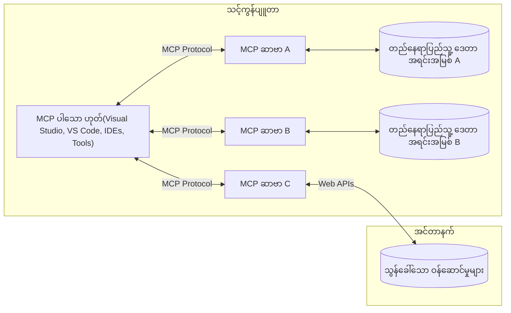

# MCP အခြေခံအတွေးအခေါ်များ: AI ပေါင်းစပ်မှုအတွက် Model Context Protocol ကို ကျွမ်းကျင်စွာ အသုံးပြုခြင်း

[](https://youtu.be/earDzWGtE84)

_(ဤသင်ခန်းစာ၏ ဗီဒီယိုကို ကြည့်ရန် အပေါ်က ပုံကို နှိပ်ပါ)_

[Model Context Protocol (MCP)](https://github.com/modelcontextprotocol) သည် ကြီးမားသော ဘာသာစကားမော်ဒယ်များ (LLMs) နှင့် ပြင်ပကိရိယာများ၊ အပလီကေးရှင်းများ၊ ဒေတာ အရင်းအမြစ်များအကြား ဆက်သွယ်မှုကို အထူးတလျောက်၊ စံတော်ချိန်ဖြင့် ဖွဲ့စည်းထားသော နည်းပညာ ဖွဲ့စည်းပုံ ဖြစ်သည်။  
ဤလမ်းညွှန်မှာ MCP ၏ အခြေခံအတွေးအခေါ်များကို လမ်းကြောင်းပြသမည် ဖြစ်ပါတယ်။ သင်သည် ၎င်း၏ client-server ဖွဲ့စည်းပုံ၊ အခြေခံ အစိတ်အပိုင်းများ၊ ဆက်သွယ်ရေးလုပ်ငန်းစဉ်များနှင့် ဆောင်ရွက်မှုအတွေ့အကြုံများကို သင်ယူရရှိပါမည်။

- **အသုံးပြုသူ၏ ထင်ရှားသော သဘောတူညီချက်**: ဒေတာအဝးရောက်မှုနှင့် လုပ်ဆောင်မှုတိုင်းကို ကျင်းပရန် မတိုင်ခင် အသုံးပြုသူ၏ ထင်ရှားသော ခွင့်ပြုချက် လိုအပ်သည်။ အသုံးပြုသူများသည် ဘယ်လို ဒေတာသုံးနိုင်မည်၊ ဘယ်လို လုပ်ဆောင်မှုများ ကျင်းပမည်ကို ရှင်းလင်းစွာ နားလည်ထားရမည်ဖြစ်ပြီး ခွင့်ပြုမှုများနှင့် အာဏာပေးခြင်းများကို ကြီးကြပ်ထိန်းချုပ်နိုင်ရမည်။

- **ဒေတာကိုယ်ပိုင်ခွင့် ကာကွယ်မှု**: အသုံးပြုသူဒေတာများကို ထင်ရှားသော သဘောတူညီချက်ရှိမှသာ ဖော်ပြပေးပြီး ဆက်သွယ်မှု လုပ်ငန်းစဉ်တစ်လျောက်တစ်လည့်မှာ ခိုင်မာသော အဝေးရောက်ခွင့် ထိန်းချုပ်မှုများဖြင့် ကာကွယ်ထားရမည်။ မလိုလားအပ်ပါက ဒေတာ ပို့ဆောင်မှုကို တားမြစ်နိုင်ရမည်နှင့် တင်းကြပ်သော ကိုယ်ပိုင်ခွင့်နယ်နိမိတ်များကို ထိန်းသိမ်းထားရမည်။

- **ကိရိယာ အကောင်အထည်ဖော်ရေး လုံခြုံမှု**: ကိရိယာတိုင်းကို သုံးစွဲသူ၏ ထင်ရှားသော ခွင့်ပြုချက်ဖြင့်သာ သုံးလို့ရပြီး ကိရိယာ၏ လုပ်ဆောင်နိုင်မှု၊ ပေရာမီတာများနှင့် ၎င်းထိခိုက်မှုကို ရှင်းလင်းနားလည်မှုရှိခြင်း လိုအပ်သည်။ ကျူးလွန်နိမ့်ခွင့်မရှိအောင်၊ လုံခြုံမှုလျော့ပါးမှုမဖြစ်အောင် တင်းကြပ်သော လုံခြုံမှုနယ်နိမိတ်များကို ထိန်းသိမ်းရမည်။

- **သယ်ယူပို့ဆောင်မှု အလွှာ လုံခြုံရေး**: ဆက်သွယ်မှု လမ်းကြောင်းအားလုံးတွင် သင့်လျော်သော စာမူလုံခြုံရေးနှင့် ကိုယ်စားလှယ်သတ်မှတ်ခြင်းစနစ်များကို အသုံးပြုသင့်သည်။ အဝေးမှ ချိတ်ဆက်မှုများတွင် လုံခြုံသော သယ်ယူပို့ဆောင်မှု ကြိုးပမ်းငြိမ်းချမ်းပြီး မှတ်ပုံတင်စနစ်ကို မှန်ကန်စွာ စီမံအုပ်ချုပ်သင့်သည်။

#### ဆောင်ရွက်မှု လမ်းညွှန်ချက်များ

- **ခွင့်ပြုမှု စီမံခန့်ခွဲမှု**: အသုံးပြုသူသည် ဘယ်ဆာဗာများ၊ ကိရိယာများနှင့် အရင်းအမြစ်များကို အသုံးပြုခွင့်ရှိသည်ကို မှန်ကန်စွာထိန်းချုပ်နိုင်သည့် ပူးပေါင်းခွင့်စနစ်များ ဖန်တီးပါ  
- **အတည်ပြုခြင်းနှင့် ခွင့်ပြုခြင်း**: လုံခြုံသော အတည်ပြုနည်းများ (OAuth, API key) နှင့် သတ်မှတ်ချိန်ကုန်သွားမှု ပါဝင်သည့် token စီမံခန့်ခွဲမှုများကို အသုံးပြုပါ  
- **အချက်အလက်အတည်ပြုခြင်း**: ကြေညာထားသော schema များအတိုင်း ပေရာမီတာနှင့် ဒေတာ အပေါင်းအဝေးအားလုံးကို အတည်ပြု၍ ဆက်တိုက်ဖြုတ်မှုတိုက်ဖျက်ခြင်းကို ကာကွယ်ပါ  
- **စစ်ဆေးမှတ်တမ်း တင်ခြင်း**: လုံခြုံရေး သတိထားမှုနှင့် စည်းကမ်းများလိုက်နာမှုအတွက် လုပ်ငန်းဆောင်တာများအားလုံး၏ မှတ်တမ်းများကို ထိန်းသိမ်းထားပါ

## အကျဉ်းချုပ်

ဤသင်ခန်းစာတွင် Model Context Protocol (MCP) ပတ်ဝန်းကျင်ကို ဖွဲ့စည်းသည့် ဦးဆောင် အင်ဂျင်နီယာဖွဲ့စည်းပုံနှင့် အစိတ်အပိုင်းများကို ရှင်းလင်းပြသမည် ဖြစ်ပြီး MCP ဆက်သွယ်ခြင်းစနစ်၏ client-server ဖွဲ့စည်းပုံ၊ အဓိက အစိတ်အပိုင်းများနှင့် ဆက်သွယ်ရေးလုပ်ငန်းစဉ်များကို သင်ယူရမှာ ဖြစ်သည်။

## အဓိက သင်ယူရမည့် ရည်မှန်းချက်များ

ဤသင်ခန်းစာ အပြီးတွင် သင်သည်

- MCP client-server ဖွဲ့စည်းပုံကို နားလည်ရမည်  
- Host, Client နှင့် Server ၏ အခန်းကဏ္ဍများနှင့် တာဝန်များကို သက်မှတ်နိုင်မည်  
- MCP ကို အလွယ်တကူ ပေါင်းစည်းနိုင်သည့် အခြေခံ လုပ်ဆောင်ချက်များကို ခွဲခြမ်းစိတ်ဖြာနိုင်မည်  
- MCP ပတ်ဝန်းကျင်အတွင်း သတင်းအချက်အလက်များ အလုပ်လုပ်ပုံကို သိရှိနိုင်မည်  
- .NET, Java, Python, နှင့် JavaScript တွင် ကိုးကားထားသော ကုဒ်ပုံများမှ တတ်ကျွမ်းမှုရရှိနိုင်မည်

## MCP ဖွဲ့စည်းပုံ: နက်နက်ရှိုင်းရှိုင်း ကြည့်ခြင်း

MCP ပတ်ဝန်းကျင်မှာ client-server မော်ဒယ်တစ်ခုအပေါ် ဖွဲ့စည်းထားသည်။ ဤပိုင်းကိုယ်စား AI အပလီကေးရှင်းများသည် ကိရိယာများ၊ ဒေတာဘေ့စ်များ၊ API များနှင့် အခြေအနေအရင်းအမြစ်များနှင့် ထိထိရောက်ရောက် ဆက်သွယ်နိုင်စေသည်။ ဒီဖွဲ့စည်းပုံကို အခြေခံ အစိတ်အပိုင်းများအဖြစ် ခွဲခြမ်းကြည့်ကြမယ်။

MCP သည် client-server ဖွဲ့စည်းပုံကို လိုက်နာသည်။ ဖော်ပြရမယ့် Host application တစ်ခုမှာ အမျိုးမျိုးသော servers များနှင့် ချိတ်ဆက်နိုင်သည်။


- **MCP Hosts**: VSCode, Claude Desktop, IDEs သို့မဟုတ် MCP မှတစ်ဆင့် ဒေတာသုံးရန်လိုသော AI ကိရိယာများ  
- **MCP Clients**: ဆာဗာများနှင့် 1:1 ချိတ်ဆက်ထားသည့် protocol clients  
- **MCP Servers**: စံသတ်မှတ်ထားသော Model Context Protocol ဖြင့် တစ်ခုချင်းစီ အထူး လုပ်ဆောင်ချက်များ ဖော်ပြသည့် အလေးချိန်နည်းသော ပရိုဂရမ်များ  
- **ဒေသခံ ဒေတာအရင်းအမြစ်များ**: သင်၏ကွန်ပျူတာတွင်ရှိသော ဖိုင်များ၊ ဒေတာဘေ့စ်များနှင့် ဆာဗာများကို MCP စာဝင်ချက်များအား လုံခြုံစိတ်ချစွာ ရယူနိုင်သည်  
- **အဝေးမှ ဝန်ဆောင်မှုများ**: MCP ဆာဗာများသည် API များမှတဆင့် အင်တာနက်ပေါ်ရှိ ပြင်ပစနစ်များအား ချိတ်ဆက် အသုံးပြုနိုင်သည်

MCP Protocol သည် အချိန်ဇယားအခြေပြု versionning (YYYY-MM-DD ပုံစံ) အသုံးပြုထားသည့် တိုးတက်ဆဲ စံသတ်မှတ်ချက်ဖြစ်သည်။ လက်ရှိ protocol version သည် **2025-11-25** ဖြစ်ပါသည်။ [protocol specification](https://modelcontextprotocol.io/specification/2025-11-25/) တွင် နောက်ဆုံးသတင်းအချက်အလက်များကို ကြည့်ရှုနိုင်ပါသည်။

### 1. Hosts

Model Context Protocol (MCP) တွင် **Hosts** ဆိုသည်မှာ အသုံးပြုသူများ protocol နှင့် တိုက်ရိုက် ဆက်ဆံရာ အဓိက အင်တာဖေ့စ်ဖြစ်သော AI အပလီကေးရှင်းများဖြစ်သည်။ Host များသည် မတူညီသော MCP ဆာဗာများအား ချိတ်ဆက်ရန် MCP clients များကို တည်ဆောက်၍ ချိန်ညှိစီမံသည်။ Hosts ကဲ့သို့သော ဥပမာများမှာ

- **AI Applications**: Claude Desktop, Visual Studio Code, Claude Code  
- **ဖွံ့ဖြိုးရေး ပတ်ဝန်းကျင်များ**: IDE များနှင့် MCP ပေါင်းစည်းထားသော ကုဒ် ဘာသာစကားပုံစံများ  
- **စိတ်ကြိုက် အပလီကေးရှင်းများ**: ရည်ရွယ်ချက်တစ်ခုစီဖြင့် ဖန်တီးထားသည့် AI အေးဂျင့်များနှင့် ကိရိယာများ  

**Hosts** တို့မှာ AI မော်ဒယ် ဆက်သွယ်မှုများကို စီမံခန့်ခွဲသည့် အပလီကေးရှင်းများဖြစ်ပြီး

- **AI မော်ဒယ်များကို စည်းမျဥ်းချုပ်စီမံခြင်း**: LLM များနှင့် ဆက်သွယ်၍ မှတ်ချက်များ အသုံးပြုသူအတွက် ထုတ်ပေးခြင်းနှင့် AI လုပ်ငန်းစဉ်များ ကိုင်တွယ်ခြင်း  
- **Client ချိတ်ဆက်မှုစီမံခြင်း**: MCP ဆာဗာတစ်ခုစီအား MCP client တစ်ခု တည်ဆောက်ထားခြင်းနှင့် စောင့်ရှောက်ခြင်း  
- **အသုံးပြုသူ အင်တာဖေ့စ် ထိန်းချုပ်မှု**: စကားလက်ဆွေးနွေးမှုအလှည့်အပြောင်း၊ အသုံးပြုသူ ဆက်ဆံမှုများနှင့် ပြန်လည်တုံ့ပြန်မှုကို ကိုင်တွယ်ခြင်း  
- **လုံခြုံရေး စည်းမျဥ်းစီမံခြင်း**: ခွင့်ပြုချက်များ၊ လုံခြုံရေး ကန့်သတ်ချက်များနှင့် အတည်ပြုပြဌာန်းမှုများ ထိန်းချုပ်ခြင်း  
- **အသုံးပြုသူ သဘောတူညီမှု ကိုင်တွယ်မှု**: ဒေတာမျှဝေခြင်းနှင့် ကိရိယာအသုံးပြုခြင်းအတွက် အသုံးပြုသူ၏ ခွင့်ပြုချက် စီမံခြင်း  

### 2. Clients

**Clients** ဆိုသည်မှာ Hosts နှင့် MCP ဆာဗာများအကြား 1:1 ချိတ်ဆက်မှု ပေးစွမ်းသော အရေးပါသော အစိတ်အပိုင်းများ ဖြစ်သည်။ MCP client တစ်ခုစီကို Host မှ တစ်ဆင့် တည်ဆောက်၍ သီးသန့် MCP ဆာဗာတစ်ခုနှင့် ချိတ်ဆက်ပေးသည်။ Clients များအနေဖြင့် Host ကို ဆာဗာများ များစွာနှင့် တပြိုင်နက် ချိတ်ဆက်ရန် ခွင့်ပြုသည်။

Clients သည် host application ထဲမှာ ချိတ်ဆက်ရေး အစိတ်အပိုင်းများဖြစ်ပြီး

- **Protocol ဆက်သွယ်မှု**: JSON-RPC 2.0 request များအား server ထံ ပေးပို့ခြင်း (prompt များနှင့် ပေါင်းစည်းပြီး)  
- **စွမ်းရည်ဆိုင်ရာ ညှိနှိုင်းမှု**: စတင်ချိန်တွင် ဆာဗာနှင့် ရေရှည် protocol မူဗားနှင့် ဖွင့်လှစ်နိုင်မှုများ စကားဝိုင်းပြုလုပ်ခြင်း  
- **ကိရိယာ အကောင်အထည်ဖော်ခြင်း**: မော်ဒယ်များမှ tool ခေါ်ဆိုမှုများကို စီမံမှုနှင့် ပြန်လည် ပေးပို့မှုများကို လက်ခံကျင့်သုံးခြင်း  
- **တစ်ချက်ချင်းတုံ့ပြန်မှု အပေါ် အချက်အလက်လက်ခံမှု**: ဆာဗာမှ သတိပေးချက်များနှင့် အချိန်နဲ့တပြေးညီ update များ ကိုင်တွယ်ခြင်း  
- **ပြန်လည်တုံ့ပြန်မှု ကြော်ငြာခြင်း**: ဆာဗာ တုံ့ပြန်မှုများကို အသုံးပြုသူများအတွက် ဖော်ပြရန် ညှိနှိုင်းခြင်းနှင့် ပုံစံလုပ်ခြင်း  

### 3. Servers

Servers ဆိုသည်မှာ MCP clients များအား context, ကိရိယာများနှင့် လုပ်ဆောင်ခွင့်များ ပေးဝေသည့် ပရိုဂရမ်များ ဖြစ်သည်။ ၎င်းတို့သည် ဒေသခံ (Host နှင့် တူညီသော ကွန်ပျူတာပေါ်တွင်) သို့မဟုတ် အဝေးမှ (ပြင်ပပလပ်ဖောင်းပေါ်တွင်) လုပ်ဆောင်နိုင်ပြီး client များ၏ အမှာစာများကို ကိုင်တွယ် ထောက်ပံ့ပေးသည်။ Servers များသည် စံသတ်မှတ်ထားသော Model Context Protocol အသွင်အပြင်ဖြင့် အထူး လုပ်ဆောင်ချက်များ ဖော်ပြပေးသည်။

Servers သည် context နှင့် လုပ်ဆောင်ခွင့်များပေးသည့် ဝန်ဆောင်မှုများဖြစ်ပြီး

- **Feature မှတ်ပုံတင်ခြင်း**: မရရှိရသေးသော primitives (အရင်းအမြစ်များ၊ prompt များ၊ ကိရိယာ များ) ကို client များထံမှတ်ပုံတင်ခြင်း  
- **request လက်ခံခြင်း**: ကိရိယာခေါ်ဆိုမှုများ၊ အရင်းအမြစ်တောင်းဆိုမှုများ၊ prompt တောင်းဆိုမှုများကို လက်ခံပြီး လုပ်ဆောင်ခြင်း  
- **Context ပံ့ပိုးမှု**: မော်ဒယ်တုံ့ပြန်မှုအဆင့်တိုးစေသော context နှင့် အချက်အလက်များ ပေးဆောင်ခြင်း  
- **အခြေအနေ စီမံခန့်ခွဲမှု**: session များအခြေအနေ ထိန်းသိမ်းခြင်းနှင့် အခြေအနေ ပေါ်မူတည် လုပ်ဆောင်မှုများ ကိုင်တွယ်ခြင်း အလိုရှိပါက  
- **တစ်ချက်ချင်း သတိပေးချက်များ ပို့ခြင်း**: လုပ်ဆောင်ခွင့်ပြောင်းလဲမှုများနှင့် update များ အကြောင်း client များကို သတိပေးပို့ခြင်း  

Server များကို မည်သူမဆို မော်ဒယ် လုပ်ဆောင်နိုင်မှုကို ဒါရိုက်တာအဖြစ် တိုးချဲ့ ရေးဆွဲနိုင်ပြီး ဒေသခံနှင့် အဝေးစောင့်ဂျင်းဖြင့် အသုံးပြုနိုင်ပါသည်။

### 4. Server Primitives

Model Context Protocol (MCP) တွင် servers များသည် client များ၊ hosts များနှင့် ဘာသာစကားမော်ဒယ်များ အကြား ကြွယ်ဝသော ဆက်သွယ်မှုများ ဖော်ဆောင်နိုင်ရန် အခြေခံ ကုန်ကြမ်းစာရင်း ဖြစ်သည့် **primitives** သုံးအမျိုးအစား ပေးထားသည်။ ဤ primitives များသည် protocol အတွင်း ရရှိနိုင်သည့် context အမျိုးအစားများနှင့် လုပ်ဆောင်ချက်များကို သတ်မှတ်သည်။

MCP servers များသည် အောက်ဖော်ပြပါ သုံးမျိုးအခြေခံ primitives များမှ မည်သည့်ပေါင်းစပ်မှု မဆို ဖော်ပြနိုင်သည်။

#### Resources

**Resources** ဆိုသည်မှာ AI အပလီကေးရှင်းများအတွက် context အချက်အလက်များ ပေးသည့် ဒေတာအရင်းအမြစ်များ ဖြစ်သည်။ ၎င်းသည် မော်ဒယ် နားလည်မှုနှင့် ဆုံးဖြတ်ချက် ခြုံငုံမှုကို မြှင့်တင်သည့် ရပ်တည်မှုရှိသော် များပြားသော် dynamic ဝတ္တရားကို ကိုယ်စားပြုသည်။

- **Contextual Data**: AI မော်ဒယ်၊ မှတ်ချက်များအတွက် ဖွဲ့စည်းထားသော အချက်အလက်နှင့် context များ  
- **Knowledge Bases**: စာရွက်စာတမ်း စုပုံများ၊ ဆောင်းပါးများ၊ လက်စွဲစာအုပ်များ နှင့် သုတေသနစာတမ်းများ  
- **ဒေသခံ ဒေတာ အရင်းအမြစ်များ**: ဖိုင်များ၊ ဒေတာဘေ့စ်များနှင့် ဒေသခံ စနစ် အချက်အလက်များ  
- **ပြင်ပ ဒေတာများ**: API တုံ့ပြန်ချက်များ၊ ဝက်ဘ်ဝန်ဆောင်မှုများ နှင့် အဝေးစနစ် ဒေတာများ  
- **Dynamic Content**: ပြင်ပအခြေအနေများအပေါ် မှအကြောင်းပြောင်းလဲသည့် အချက်အလက် အချိန်နှင့်တပြေးညီ ပြောင်းလဲနေသော ဒေတာများ

Resources များကို URI များဖြင့် သတ်မှတ်ပြီး `resources/list` ဖြင့် ရှာဖွေလိုက်ပါက၊ `resources/read` ဖြင့် ဖတ်ရှုနိုင်ပါသည်။

```text
file://documents/project-spec.md
database://production/users/schema
api://weather/current
```

#### Prompts

**Prompts** ဆိုသည်မှာ ဘာသာစကားမော်ဒယ်များနှင့် ဆက်သွယ်မှုများကို ဖွဲ့စည်းပုံပေးသည့် ပြန်လည်အသုံးပြုနိုင်သော မူပိုင် နှုတ်ဆက်စာတမ်းများဖြစ်သည်။ ၎င်းတို့သည် စံပြဆက်သွယ်မှုပုံစံများနှင့် အချိန်မီ အလုပ်လမ်းညွှန်များကို ပံ့ပိုးပေးသည်။

- **Template မူပိုင်ဆက်သွယ်မှုများ**: ကြိုတင်ဖွဲ့စည်းထားသော သတင်းအချက်အလက် စာရင်းနှင့် စကားပြောစတင်မှုများ  
- **အလုပ်လမ်းညွှန် မူပိုင်များ**: မကြာခဏ လုပ်ဆောင်ရသည့် အလုပ်စဉ် များအတွက် စံပြ စနစ်များ  
- **Few-shot ဥပမာများ**: မော်ဒယ် သင်ကြားမှုပုံစံအတွက် ဥပမာပြု template များ  
- **စနစ် prompt များ**: မော်ဒယ် လုပ်ဆောင်ပုံနှင့် context ကို သတ်မှတ်ပေးသည့် အခြေခံ prompt များ  
- **ဒိုင်နမစ် Template များ**: အထူး context ထဲတွင် ကိုက်ညီသည့် parameter များပါဝင်သည့် prompt များ

Prompts များသည် မတူညီသည့်အချက်များကို အစားထိုးနိုင်ပြီး `prompts/list` နှင့် `prompts/get` မှတဆင့် ရှာဖွေနိုင်ပါသည်။

```markdown
Generate a {{task_type}} for {{product}} targeting {{audience}} with the following requirements: {{requirements}}
```

#### Tools

**Tools** ဆိုသည်မှာ AI မော်ဒယ်များမှ ခေါ်ယူ၍ သီးသန့် လုပ်ဆောင်မှုများ ပြုလုပ်နိုင်သော ကိရိယာ executable functions ဖြစ်သည်။ ၎င်းတို့သည် MCP ပတ်ဝန်းကျင်၏ "ကြိယာ" တို့လို အပြင်ဘက်စနစ်များနှင့် ထိတွေ့နိုင်စေသည်။

- **Executable Functions**: မော်ဒယ်များ အသုံးပြု၍ လုပ်ဆောင်နိုင်သည့် လှုပ်ရှားမှုများ၊ သတ်မှတ်အတိုင်း parameter များနှင့်  
- **ပြင်ပစနစ် ပေါင်းစည်းမှု**: API ခေါ်ဆိုမှုများ၊ ဒေတာဘေ့စ် ရှာဖွေမှုများ၊ ဖိုင်လုပ်ဆောင်မှုများ၊ သင်္ချာတွက်ချက်မှုများ  
- **ထူးခြားသော အသိအမှတ်ပြု အမည်**: ကိရိယာတစ်ခုစီတွင် အမည်၊ ဖော်ပြချက်နှင့် parameter schema တိတိကျကျ ရှိသည်  
- **ဖွဲ့စည်းသော I/O**: ကိရိယာများသည် သက်ဆိုင်ရာ parameter များကို အတည်ပြုလက်ခံပြီး ဖွဲ့စည်းထားသော၊ ဒေါင်းလိုင်မှတ်အမျိုးအစား များဖြင့် ပြန်လည် ပေးပို့သည်  
- **လုပ်ဆောင်ချက် စွမ်းဆောင်ရည်များ**: မော်ဒယ်များကို လက်တွေ့တကယ့် အခြေအနေရှိ ဖော်ဆောင်မှုများလုပ်နိုင်စေပြီး အချိန်နဲ့တပြိုင်နက် ဒေတာများ ရယူနိုင်စေသည်

Tools များကို parameter validation အတွက် JSON Schema ဖြင့် သတ်မှတ်ထားပြီး `tools/list` မှတစ်ဆင့်ရှာဖွေသော tool များကို `tools/call` ဖြင့် လုပ်ဆောင်နိုင်သည်။ Tools တွင် အသုံးပြုသူအင်တာဖေ့စ်တိုးတက်မှုအတွက် icon များ တိုက်ရိုက် ထည့်သွင်းနိုင်ပါသည်။

**Tool Annotations**: Tools များတွင် `readOnlyHint`, `destructiveHint` ကဲ့သို့သော behavioral annotation များ ပါဝင်နိုင်ရာ tool သည် ဖတ်ပင်သာ, ဖျက်ဆီးမှု ဖြစ်နိုင်ခြင်းတို့ကို ဖော်ပြ၍ client များအနေဖြင့် tool အသုံးအနှုန်း ပေါ် မူတည်၍ဆုံးဖြတ်မှု ချမှတ်ရန် ကူညီပေးသည်။

ဥပမာ tool ဖော်ပြချက်

```typescript
server.tool(
  "search_products", 
  {
    query: z.string().describe("Search query for products"),
    category: z.string().optional().describe("Product category filter"),
    max_results: z.number().default(10).describe("Maximum results to return")
  }, 
  async (params) => {
    // ရှာဖွေမှုကို အစားထိုးဆောင်ရွက်ပြီး ဖွဲ့စည်းထားသော ရလဒ်များကို ပြန်လည်ပေးပါ။
    return await productService.search(params);
  }
);
```

## Client Primitives

Model Context Protocol (MCP) တွင် **clients** များသည် servers များအား host application ထံမှ အပိုဆောင်း စွမ်းဆောင်ရည်များကို တောင်းဆိုနိုင်သည့် primitives များကို ဖော်ဆောင်နိုင်သည်။ ဤ client-side primitives များက server implementation များအား ပိုမိုပြည့်စုံပြီး မော်ဒယ်စွမ်းဆောင်ရည်များနှင့် အသုံးပြုသူ အပြန်အလှန်လုပ်ဆောင်မှုများကို ထိန်းချုပ်ခွင့် ရရှိစေသည်။

### Sampling

**Sampling** သည် servers များအား client ၏ AI အပလီကေးရှင်းမှ ဘာသာစကားမော်ဒယ် ပြည့်စုံမှုများကို တောင်းဆိုခွင့် ပေးသည်။ ၎င်းသည် servers များကို မိမိတို့၏ မော်ဒယ် လုပ်ငန်းနှင့် မပူးပေါင်းပဲ LLM စွမ်းဆောင်ရည်များသုံးစွဲခွင့်ကို ပေးစွမ်းသည်။

- **မော်ဒယ် မရွေးချယ်ဘဲ ဝင်ရောက်ခွင့်**: servers များသည် LLM SDK များ ထည့်သွင်းခြင်းမရှိဘဲ ပြည့်စုံမှုတောင်းခံနိုင်သည်  
- **Server အစီအစဉ်ပုံစံ AI**: servers များသည် client ၏ AI မော်ဒယ်ကို အသုံးပြု၍ ကိုယ်ပိုင်အတိုင်း ထုတ်ဖော်မှုများ ဖန်တီးနိုင်သည်  
- **အလှည့်အပြောင်း LLM ဆက်သွယ်မှုများ**: servers များသည် AI အကူအညီ လိုအပ်သော ရင်းမြစ်အစုံလုပ်ငန်းစဉ် မြင်ကွင်းများ ဖော်ဆောင်နိုင်သည်  
- **ဒိုင်နမစ် အကြောင်းပြန်ထုတ်လုပ်မှု**: Host ၏ မော်ဒယ်ကို အသုံးပြု၍ context များကို အခြေခံသော တုံ့ပြန်ချက်များ ဖန်တီးခွင့်  
- **ကိရိယာ ခေါ်ယူမှု ထောက်ပံ့မှု**: Servers များသည် sampling အတွင်း client ၏ မော်ဒယ်တစ်ခုချင်းစီအတွက် `tools` နှင့် `toolChoice` parameter များ ထည့်သွင်းနိုင်သည်

Sampling သည် `sampling/complete` method နဲ့ စတင်ပြီး servers မှ client များသို့ ပြည့်စုံမှု တောင်းဆိုချက်များ ပေးပို့သည်။

### Roots

**Roots** သည် clients များအား servers များထံ ဖိုင်စနစ် နယ်နိမိတ်များကို စံပြပုံစံဖြင့် ဖော်ပြပေးနိုင်သည်။ ၎င်းသည် servers များအား ခွင့်ပြုချက် ရှိသော ဒိုင်ရက်ထရီများနှင့် ဖိုင်များကို နားလည်စေသည်။

- **ဖိုင်စနစ် နယ်နိမိတ်များ**: servers များ၏ ဖိုင်စနစ်ဆိုင်ရာ လုပ်ဆောင်ခွင့်ရှိရာ နယ်နိမိတ်များ သတ်မှတ်ပေးခြင်း  
- **ခွင့်ပြုချက် ထိန်းချုပ်မှု**: servers များ ယင်းဒိုင်ရက်ထရီများနှင့် ဖိုင်များကို ခွင့်ပြုချက်ရှိကြောင်း နားလည်စေရန်  
- **ဒိုင်နမစ် အပ်ဒိတ်များ**: Roots စာရင်း ပြောင်းလဲသွားလျှင် clients မှ servers များကို သတင်းပို့ပေးခြင်း  
- **URI အခြေပြု ဖော်ပြခြင်း**: Roots ကို `file://` URI များဖြင့် သတ်မှတ်ခြင်း

Roots များကို `roots/list` ဖြင့် ရှာဖွေနိုင်ပြီး Roots မပြောင်းလဲလျှင် clients မှ `notifications/roots/list_changed` ကို servers သို့ ပေးပို့သည်။

### Elicitation

**Elicitation** သည် servers များအား client အင်တာဖေ့စ်မှတစ်ဆင့် အသုံးပြုသူထံ အပိုအချက်အလက် မေးမြန်းခြင်း သို့မဟုတ် အတည်ပြုခြင်း လုပ်ငန်းစဉ်များ ရယူနိုင်စေသည်။

- **အသုံးပြုသူ အချက်အလက် တောင်းခံခြင်း**: ကိရိယာ လုပ်ဆောင်မှုအတွက် လိုအပ်သော အပိုအချက်အလက်များကို servers မေးမြန်းနိုင်သည်  
- **အတည်ပြု ခလုတ်ပြပွဲများ**: သိသာထင်ရှားသည့် သို့မဟုတ် အကျိုးသက်ရောက်မှုရှိသော လုပ်ဆောင်ချက်များအတွက် အသုံးပြုသူ ခွင့်ပြုချက် တောင်းဆွဲခြင်း  
- **အပြန်အလှန် ဆက်သွယ်မှု အလုပ်စဉ်များ**: စတင်မှုအဆင့်တိုင်းတွင် အသုံးပြုသူကိုဆွေးနွေးခိုင်းခြင်း  
- **Parameter များ စုဆောင်းခြင်း**: ကိရိယာ လုပ်ဆောင်မှုအတွင်း လိုအပ်သော် လွဲလပ်သော parameter များကို စုဆောင်းခြင်း

Elicitation မှတောင်းဆိုမှုများကို `elicitation/request` method ကို အသုံးပြု၍ client အင်တာဖေ့စ်မှ တဆင့် အသုံးပြုသူအချက်အလက် ရရှိစေသည်။

**URL Mode Elicitation**: Servers များသည် URL မှတဆင့် အသုံးပြုသူ interaction များကိုလည်း တောင်းခံနိုင်ပြီး အထူးသဖြင့် အတည်ပြုခြင်း၊ မှတ်ပုံတင်ခြင်း သို့မဟုတ် ဒေတာ ထည့်သွင်းမှုများအတွက် ပြင်ပ ဝက်ဘ်စာမျက်နှာများ အသုံးပြုရန် လမ်းညွှန်နိုင်သည်။

### Logging

**Logging** သည် servers များမှ debugging၊ စနစ် ကြည့်ရှုမှုနှင့် လုပ်ငန်းစဉ် ဖော်ပြခြင်းအတွက် ဖွဲ့စည်းထားသော မှတ်တမ်းစာများကို client များအား ပေးပို့နိုင်သည်။

- **Debugging ထောက်ပံ့မှု**: ပြဿနာရှာဖွေရေးအတွက် အသေးစိတ် လုပ်ဆောင်မှုပုံစံများ ပေးပို့ခြင်း  
- **စနစ် ကြည့်ရှုမှု**: အခြေအနေ အချက်အလက်နှင့် စွမ်းဆောင်ရည် တိုင်းတာချက်များ ပေးပို့ခြင်း  
- **အမှား သတင်းပေးခြင်း**: အမှားအကြောင်းအရာ အသေးစိတ်နှင့် ဖော်ပြချက်များ ပေးပို့ခြင်း  
- **စစ်ဆေး မှတ်တမ်းများ**: Server လုပ်ဆောင်ချက်များဆိုင်ရာ အပြည့်အစုံ မှတ်တမ်းများ ဖန်တီးခြင်း

Logging စာသားများကို client တွင် ပေးပို့ပြီး server လုပ်ဆောင်ချက်ပေါ် အလင်းပြမှုကို ရရှိစေကာ debugging လုပ်ငန်းကို ပိုမိုလွယ်ကူစေသည်။

## MCP အတွင်း သတင်းအချက်အလက် ပို့ဆောင်မှု လည်ပတ်ပုံ

Model Context Protocol (MCP) သည် host များ၊ client များ၊ server များနှင့် မော်ဒယ်များအကြား သတင်းအချက်အလက်များ စနစ်တကျ လည်ပတ်ပုံကို သတ်မှတ်ထားသည်။ ဤလည်ပတ်မှုသည် အသုံးပြုသူ တောင်းဆိုမှုများ အဓိက ကွယ်မှုနှင့် ပြင်ပကိရိယာများနှင့် ဒေတာများကို မော်ဒယ် ပြန်လည်တုံ့ပြန်မှုများထဲသို့ ပေါင်းစည်းပုံကို ရှင်းလင်းစေသည်။
- **ဟုတ်စတင်နေပြီ**  
  ဟုတ်ပလက်ဖောင်း (ဥပမာ IDE သို့မဟုတ် စကားပြောအင်တာဖေ့(စ်)) သည် MCP ဆာဗာနှင့် ချိတ်ဆက်ခြင်းကို အသုံးပြုသည်၊ အများအားဖြင့် STDIO, WebSocket သို့မဟုတ် အခြားပံ့ပိုးသော သယ်ယူပို့ဆောင်မှုတစ်ခုမှတဆင့် ဖြစ်သည်။

- **စွမ်းဆောင်ရည်ညှိနှိုင်းခြင်း**  
  ဟုတ်ထဲတွင် တွဲဖက်ထားသော client နှင့် server နှစ်ဖက်စလုံးသည် ၎င်းတို့ ပံ့ပိုးသော လုပ်ဆောင်ချက်များ၊ ကိရိယာများ၊ အရင်းအမြစ်များနှင့် ပရိုတိုကောဗားရှင်းများကိုလဲလှယ်သည်။ ၎င်းသည် နှစ်ဖက်စလုံး session အတွက် ရရှိနိုင်သော စွမ်းဆောင်ရည်များကို နားလည်စေရန် သေချာစေသည်။

- **သုံးစွဲသူ တောင်းဆိုချက်**  
  သုံးစွဲသူသည် ဟုတ်နှင့် ဖော်ပြချက် (ဥပမာ မှကောင့်တစ်ခု ထည့်ရေးခြင်း သို့မဟုတ် ကိရိယာတစ်ခုခေါ်ဆိုခြင်း) ပြုလုပ်သည်။ ဟုတ်သည် ဤအချက်အလက်ကို စုဆောင်းပြီး client သို့ ဆီလျော် စီမံဆောင်ရွက်ရန် ပေးပို့သည်။

- **အရင်းအမြစ် သို့မဟုတ် ကိရိယာ အသုံးပြုခြင်း**  
  - client သည် server မှ အပိုဆောင်းအကြောင်းအရာ သို့မဟုတ် အရင်းအမြစ်များ (ဖိုင်များ၊ ဒေတာဘေ့စ် မှတ်တမ်းများ သို့မဟုတ် သိမှတ်ဝေစု ဆောင်းပါးများ တို့)ကို တောင်းခံနိုင်ပြီး မော်ဒယ်၏ နားလည်မှုကို တိုးမြှင့်နိုင်သည်။  
  - မော်ဒယ်သည် ကိရိယာတစ်ခုလိုအပ်ကြောင်း သတ်မှတ်ပါက (ဥပမာ ဒေတာယူခြင်း၊ တွက်ချက်မှု ပြုလုပ်ခြင်း သို့မဟုတ် API ခေါ်ဆိုခြင်း) client သည် ကိရိယာ ခေါ်ဆိုခြင်း တောင်းဆိုချက်ကို server သို့ ပေးပို့ပြီး ကိရိယာနာမည်နှင့် ပါရာမီတာများကို ဖော်ပြသည်။

- **ဆာဗာ အကောင်အထည်ဖော်ခြင်း**  
  ဆာဗာသည် အရင်းအမြစ် သို့မဟုတ် ကိရိယာ တောင်းဆိုချက်ကို လက်ခံပြီး လိုအပ်သော လုပ်ဆောင်ချက်များ (မူရင်းလုပ်ဆောင်ချက်များ၊ ဒေတာဘေ့စ် မေးမြန်းခြင်း သို့မဟုတ် ဖိုင် ရယူခြင်း)ကို ဆောင်ရွက်ပြီး ရလဒ်များကို ခွဲခြားဖွဲ့စည်းထားသော ပုံစံဖြင့် client သို့ ပြန်ပို့သည်။

- **တုံ့ပြန်မှု ဖန်တီးမှု**  
  client သည် ဆာဗာရဲ့ တုံ့ပြန်ချက်များ (အရင်းအမြစ် ဒေတာ၊ ကိရိယာထွက်ရှိမှုများ စသည်) ကို မော်ဒယ်နှင့်ဆက်စပ်သုံးစွဲကာ ကျယ်ပြန့်သည့် နှင့် အကြောင်းအရာ သက်ဆိုင်သော တုံ့ပြန်ချက်ကို ဖန်တီးရန် အသုံးပြုသည်။

- **ရလဒ် တင်ပြခြင်း**  
  ဟုတ်သည် client မှ အဆုံးအဖြတ် ထွက်ရှိမှုကို လက်ခံပြီး သုံးစွဲသူထံ တင်ပြသည်၊ တွင် မော်ဒယ်ထုတ်လုပ်ထားသော စာသားများနှင့် ကိရိယာလုပ်ဆောင်မှုများ သို့မဟုတ် အရင်းအမြစ် မေးမြန်းမှု ရလဒ်များ ပါဝင်လေ့ရှိသည်။

ဤစနစ်သည် MCP ကို မော်ဒယ်များအား ပြင်ပကိရိယာများနှင့် ဒေတာအရင်းအမြစ်များနှင့် ချိတ်ဆက်ကာ တိုးတက် ပြောင်းလဲထိန်းသိမ်းနိုင်သော AI အပလီကေးရှင်းများအား ပံ့ပိုးပေးသည်။

## ပရိုတိုကော ဖွဲ့စည်းပုံ နှင့် အလွှာများ

MCP သည် အပြည့်အစုံ ဆက်သွယ်ရေး အတွက် အလွှာ နှစ်ခုပါဝင်သည်။

### ဒေတာအလွှာ

**ဒေတာအလွှာ** သည် MCP ပရိုတိုကော၏ အဓိကအားဖြင့် **JSON-RPC 2.0** ကို အခြေခံ၍ တည်ဆောက်သည်။ ဤအလွှာတွင် သတင်းစကား ဖွဲ့စည်းပုံ၊ အဓိပ္ပာယ်၊ နှင့် အပြန်အလှန် ဆက်ဆံမှု ပုံစံများ သတ်မှတ်ထားသည်။

#### အခြေခံ ပစ္စည်းများ-

- **JSON-RPC 2.0 Protocol**: လုပ်ငန်းခွင်ဆက်သွယ်မှုအားလုံးကို စံပြ JSON-RPC 2.0 သတင်းစကား တွေဖြင့် ဆောင်ရွက်သည်။  
- **အသက်တာစီမံခန့်ခွဲမှု**: ချိတ်ဆက်မှု စတင်ခြင်း၊ စွမ်းဆောင်ရည်ညှိနှိုင်းခြင်းနှင့် ဆက်စပ်မှု ပြီးဆုံးခြင်း များကို ကိုင်တွယ်သည်။  
- **ဆာဗာ ပရိုမစ်တစ်စ်**: ဆာဗာများသည် ကိရိယာများ၊ အရင်းအမြစ်များနှင့် ဖော်ပြချက်များဖြင့် အခြေခံ လုပ်ဆောင်ချက်များ ပေးနိုင်ရန် စွမ်းဆောင်သည်။  
- **ကလိုင်ယန် ပရိုမစ်တစ်စ်**: ဆာဗာများ client များမှ LLM များ Sampling တောင်းဆိုခြင်း၊ သုံးစွဲသူ input လက်ခံခြင်းနဲ့ တင်ပြမှုများပို့ခြင်းများ ပြုလုပ်နိုင်ရန်။  
- **အချိန်တိုင်း သတင်းပို့ကြော်ငြာ**: စောင့်ဆိုင်းမစရာ dynamic update များအတွက် asynchronous ဖြေနည်း ပံ့ပိုးသည်။

#### အထူးအင်္ဂါရပ်များ-

- **ပရိုတိုကောဗားရှင်း အတည်ပြုခြင်း**: YYYY-MM-DD ပုံစံ အချိန်နှင့်အညီဗားရှင်းကို သုံးသော Compatiblity  
- **စွမ်းဆောင်ရည် ရှာဖွေမှု**: Client နှင့် Server များသည် စတင်ချိန်တွင် ပံ့ပိုးမှု feature များကို လဲလှယ်သည်။  
- **အခြေအနေမြဲသား ဆက်စပ်မှုများ**: ဆက်သွယ်မှု အခြေအနေကို အပြန်အလှန်တွင် ထိန်းသိမ်းထားပြီး ဆက်လက်ဆက်စပ်ရေး။

### သယ်ယူပို့ဆောင်မှု အလွှာ

**သယ်ယူပို့ဆောင်မှု အလွှာ** သည် MCP ပါဝင်သူများ၏ ဆက်သွယ်ရေး လမ်းကြောင်းများ၊ သတင်းစကား ဖရိမ်းမင့်များနှင့် အသိအမှတ်ပြုခြင်းများကို စီမံခန့်ခွဲသည်။

#### ပံ့ပိုးခံထားသော သယ်ယူပို့ဆောင်မှု နည်းလမ်းများ-

1. **STDIO သယ်ယူပို့ဆောင်မှု**  
   - ဒါဟာ တိုက်ရိုက် ပရိုဆက် များအတွက် standard input/output သယ်ယူပို့ဆောင်မှုတစ်ခုဖြစ်သည်။  
   - တူညီစက်တင်တွင် သာမန်ဟာ နေရာပိုင်းက ထိပ်တန်းဖြစ်သည်၊ ပုံမှန်အားဖြင့် အွန်လိုင်းမဟုတ်သောသုံးစွဲမှု။  
   - ဒေသခံ MCP ဆာဗာ အကောင်အထည်ဖော်မှုများတွင် အများသုံးသည်။

2. **Streamable HTTP သယ်ယူပို့ဆောင်မှု**  
   - client မှ server သို့ HTTP POST အသုံးပြုသည့် သတင်းစကားများ  
   - Server-Sent Events (SSE) ဖြင့် မရှိမဖြစ် stream လုပ်၍ server မှ client သို့ ပို့ဆောင်နိုင်ခြင်း  
   - ကွန်ယက်တစ်လျှောက်ဝေးကြားဆက်သွယ်မှု  
   - ယင်းသည် ပုံမှန် HTTP အသိမှတ်ပြုခြင်းစနစ် (bearer token, API key, custom header) များအား ထောက်ပံ့သည်။  
   - MCP သည် OAuth ကို token-based Authentication အတွက် အကြံပြုသည်။

#### သယ်ယူပို့ဆောင်မှု ခြုံငုံမှု-

သယ်ယူပို့ဆောင်မှုအလွှာသည် ဒေတာအလွှာမှ ဆက်သွယ်ရေးအသေးစိတ်ကို abstract လုပ်ကာ မည်သည့် သယ်ယူပို့ဆောင်မှုနည်းပညာကိုမဆို တူညီသော JSON-RPC 2.0 သတင်းစကားပုံစံ ဖြင့် ဆက်သွယ်နိုင်စေရန် လုပ်ဆောင်သည်။ ၎င်းသည် applications များအား ဒေသခံဆာဗာ နှင့် ဝေးလံသော ဆာဗာ ကြား အလွယ်တကူ ပြောင်းရွှေ့နိုင်စေတာ ဖြစ်သည်။

### လုံခြုံရေးဆိုင်ရာ စဉ်းစားချက်များ

MCP အကောင်အထည်ဖော်ရာတွင် လုံခြုံမှု၊ ယုံကြည်စိတ်ချရမှုနှင့် ဘေးကင်းလုံခြုံမှုအား အသေအချာ စောင့်ရှောက်ရန် အချက်အလက်များရှိသည်။

- **သုံးစွဲသူ သဘောတူညီချက်နှင့် ထိန်းချုပ်မှု**: သုံးစွဲသူသည် အချက်အလက် တစ်ခုခုကို သုံးစွဲမှုစတင်မပြုမီ သဘောတူညီချက် ပေးရမည်။ သုံးစွဲသူတွင် ဝေမျှမည့် အချက်အလက်များနှင့် ခွင့်ပြုသည့် လှုပ်ရှားချက်များကို ထိန်းချုပ်နိုင်ရန် သေချာရမည်။ သုံးစွဲသူ အဆင်ပြေစေရန် UI များဖြင့် လုပ်ဆောင်ချက်များကို သုံးသပ် ခွင့်ရှိရမည်။  
- **အချက်အလက် ကိုယ်ရေးကာကွယ်မှု**: သုံးစွဲသူ၏ အချက်အလက်ကို သဘောတူရ သော်လည်းသာ ထုတ်ပေးရမည်၊ ခွင့်ပြုချက် မရလျှင် မပေးရ။ MCP အကောင်အထည်ဖော်မှုများသည် မလိုလားအပ်သော အချက်အလက် ပို့ဆောင်မှုကို ကာကွယ်ရမည်။  
- **ကိရိယာ လုံခြုံမှု**: ကိရိယာကို ခေါ်သုံးမည်မတိုင်မီ အထူးသင့်သင့် သုံးစွဲသူ သဘောတူညီချက် ရရှိထားရမည်။ ကိရိယာလုပ်ဆောင်ချက်ကို ပိုမိုပေါက်ကွဲခြင်းမှ ကာကွယ်ရန် ခိုင်မာသော လုံခြုံရေး နယ်မြေများသည် မရှိမဖြစ်လိုအပ်သည်။

ဤ လုံခြုံရေးအချက်အလက်များကို လိုက်နာခြင်းအားဖြင့် MCP သည် သုံးစွဲသူယုံကြည်မှု၊ ကိုယ်ရေးကာကွယ်မှုနှင့် လုံခြုံမှုတို့ကို ဆက်လက်ထိန်းသိမ်းနိုင်စေပြီး တိုးတက်သော AI ပေါင်းစပ်မှုများအတွက် အခြေခံအဆောက်အအုံ ဖြစ်သည်။

## ကုဒ် နမူနာများ: အဓိက ပစ္စည်းများ

အောက်တွင် MCP ဆာဗာ အစိတ်အပိုင်းများနှင့် ကိရိယာများ ပံုနမူနာအဖြစ် နာမည်ကျော် programming ဘာသာစကားအနည်းငယ်တွင်ဖော်ပြထားသည်။

### .NET နမူနာ: ကိရိယာများနှင့် သိပ်မိုက်သော MCP ဆာဗာ တည်ဆောက်ခြင်း

ဒီ .NET နမူနာသည် MCP ဆာဗာရဲ့ ကိရိယာများကို သတ်မှတ်ခြင်း၊ မှတ်ပုံတင်ခြင်း၊ အပ်ဒိတ်တောင်းဆိုခြင်း၊ Model Context Protocol ဖြင့် ဆာဗာချိတ်ဆက်ခြင်းတို့ကို ပြသသည်။

```csharp
using System;
using System.Threading.Tasks;
using ModelContextProtocol.Server;
using ModelContextProtocol.Server.Transport;
using ModelContextProtocol.Server.Tools;

public class WeatherServer
{
    public static async Task Main(string[] args)
    {
        // Create an MCP server
        var server = new McpServer(
            name: "Weather MCP Server",
            version: "1.0.0"
        );
        
        // Register our custom weather tool
        server.AddTool<string, WeatherData>("weatherTool", 
            description: "Gets current weather for a location",
            execute: async (location) => {
                // Call weather API (simplified)
                var weatherData = await GetWeatherDataAsync(location);
                return weatherData;
            });
        
        // Connect the server using stdio transport
        var transport = new StdioServerTransport();
        await server.ConnectAsync(transport);
        
        Console.WriteLine("Weather MCP Server started");
        
        // Keep the server running until process is terminated
        await Task.Delay(-1);
    }
    
    private static async Task<WeatherData> GetWeatherDataAsync(string location)
    {
        // This would normally call a weather API
        // Simplified for demonstration
        await Task.Delay(100); // Simulate API call
        return new WeatherData { 
            Temperature = 72.5,
            Conditions = "Sunny",
            Location = location
        };
    }
}

public class WeatherData
{
    public double Temperature { get; set; }
    public string Conditions { get; set; }
    public string Location { get; set; }
}
```
  
### Java နမူနာ: MCP ဆာဗာအစိတ်အပိုင်းများ

ဒီနမူနာသည် အထက်ပါ .NET နမူနာနှင့်တူညီသည့် MCP ဆာဗာနှင့် ကိရိယာ မှတ်ပုံတင်မှုကို Java ဖြင့် ပြသသည်။

```java
import io.modelcontextprotocol.server.McpServer;
import io.modelcontextprotocol.server.McpToolDefinition;
import io.modelcontextprotocol.server.transport.StdioServerTransport;
import io.modelcontextprotocol.server.tool.ToolExecutionContext;
import io.modelcontextprotocol.server.tool.ToolResponse;

public class WeatherMcpServer {
    public static void main(String[] args) throws Exception {
        // MCP ဆာဗာတစ်ခု ဖန်တီးပါ
        McpServer server = McpServer.builder()
            .name("Weather MCP Server")
            .version("1.0.0")
            .build();
            
        // မိုးလေဝသကိရိယာတစ်ခု စာရင်းသွင်းပါ
        server.registerTool(McpToolDefinition.builder("weatherTool")
            .description("Gets current weather for a location")
            .parameter("location", String.class)
            .execute((ToolExecutionContext ctx) -> {
                String location = ctx.getParameter("location", String.class);
                
                // မိုးလေဝသဒေတာကို ရယူပါ (ရိုးရှင်းပြောင်းလဲထားသည်)
                WeatherData data = getWeatherData(location);
                
                // ပုံစံပြင်ဆင်ထားသော တုံ့ပြန်ချက်ကို ပြန်ပေးပါ
                return ToolResponse.content(
                    String.format("Temperature: %.1f°F, Conditions: %s, Location: %s", 
                    data.getTemperature(), 
                    data.getConditions(), 
                    data.getLocation())
                );
            })
            .build());
        
        // stdio လမ်းကြောင်း အသုံးပြု၍ ဆာဗာနှင့် ချိတ်ဆက်ပါ
        try (StdioServerTransport transport = new StdioServerTransport()) {
            server.connect(transport);
            System.out.println("Weather MCP Server started");
            // လုပ်ငန်းစဉ်သည် ရပ်စဲသည်အထိ ဆာဗာကို အလုပ်လုပ်နေစေပါ
            Thread.currentThread().join();
        }
    }
    
    private static WeatherData getWeatherData(String location) {
        // အကောင်အထည်ဖော်မှုတွင် မိုးလေဝသ API ကို ခေါ်ပါလိမ့်မည်
        // ဥပမာအတွက် ရိုးရှင်းစေသော ပြောင်းလဲထားသည်
        return new WeatherData(72.5, "Sunny", location);
    }
}

class WeatherData {
    private double temperature;
    private String conditions;
    private String location;
    
    public WeatherData(double temperature, String conditions, String location) {
        this.temperature = temperature;
        this.conditions = conditions;
        this.location = location;
    }
    
    public double getTemperature() {
        return temperature;
    }
    
    public String getConditions() {
        return conditions;
    }
    
    public String getLocation() {
        return location;
    }
}
```
  
### Python နမူနာ: MCP ဆာဗာ တည်ဆောက်ခြင်း

ဒီနမူနာသည် fastmcp ကို အသုံးပြုထားသောကြောင့် မတင်မီ ထည့်သွင်းထားရန် လိုအပ်ပါသည်။

```python
pip install fastmcp
```
Code Sample:

```python
#!/usr/bin/env python3
import asyncio
from fastmcp import FastMCP
from fastmcp.transports.stdio import serve_stdio

# FastMCP ဆာဗာကို ဖန်တီးပါ
mcp = FastMCP(
    name="Weather MCP Server",
    version="1.0.0"
)

@mcp.tool()
def get_weather(location: str) -> dict:
    """Gets current weather for a location."""
    return {
        "temperature": 72.5,
        "conditions": "Sunny",
        "location": location
    }

# ကလပ်အသုံးပြု၍ မျက်နှာသာအခြားနည်းလမ်း
class WeatherTools:
    @mcp.tool()
    def forecast(self, location: str, days: int = 1) -> dict:
        """Gets weather forecast for a location for the specified number of days."""
        return {
            "location": location,
            "forecast": [
                {"day": i+1, "temperature": 70 + i, "conditions": "Partly Cloudy"}
                for i in range(days)
            ]
        }

# ကလပ်ကိရိယာများကို မှတ်ပုံတင်ပါ
weather_tools = WeatherTools()

# ဆာဗာကို စတင်ပါ
if __name__ == "__main__":
    asyncio.run(serve_stdio(mcp))
```
  
### JavaScript နမူနာ: MCP ဆာဗာ တည်ဆောက်ခြင်း

ဒီနမူနာတွင် MCP ဆာဗာတည်ဆောက်ပြီး ရာသီဥတုနှင့် သက်ဆိုင်သော ကိရိယာနှစ်ခု ကိုယ်ပိုင်မှတ်ပုံတင်ခြင်းကို ပြသသည်။

```javascript
// တရားဝင် Model Context Protocol SDK ကို အသုံးပြုခြင်း
import { McpServer } from "@modelcontextprotocol/sdk/server/mcp.js";
import { StdioServerTransport } from "@modelcontextprotocol/sdk/server/stdio.js";
import { z } from "zod"; // ပထမအဆင့် စစ်ဆေးခြင်းအတွက်

// MCP ဆာဗာတစ်ခု ဖန်တီးပါ
const server = new McpServer({
  name: "Weather MCP Server",
  version: "1.0.0"
});

// မိုးလေဝသကိရိယာတစ်ခု သတ်မှတ်ပါ
server.tool(
  "weatherTool",
  {
    location: z.string().describe("The location to get weather for")
  },
  async ({ location }) => {
    // ဒါဟာ ပုံမှန်အားဖြင့် မိုးလေဝသ API တစ်ခုကို ခေါ်ယူမှာ ဖြစ်သည်
    // ဖေါ်ပြချက်အတွက် ရိုးရှင်းသွားသည်
    const weatherData = await getWeatherData(location);
    
    return {
      content: [
        { 
          type: "text", 
          text: `Temperature: ${weatherData.temperature}°F, Conditions: ${weatherData.conditions}, Location: ${weatherData.location}` 
        }
      ]
    };
  }
);

// မိုးလေဝသခန့်မှန်းမှုကိရိယာတစ်ခု သတ်မှတ်ပါ
server.tool(
  "forecastTool",
  {
    location: z.string(),
    days: z.number().default(3).describe("Number of days for forecast")
  },
  async ({ location, days }) => {
    // ဒါဟာ ပုံမှန်အားဖြင့် မိုးလေဝသ API တစ်ခုကို ခေါ်ယူမှာ ဖြစ်သည်
    // ဖေါ်ပြချက်အတွက် ရိုးရှင်းသွားသည်
    const forecast = await getForecastData(location, days);
    
    return {
      content: [
        { 
          type: "text", 
          text: `${days}-day forecast for ${location}: ${JSON.stringify(forecast)}` 
        }
      ]
    };
  }
);

// အကူအညီဖြစ်စေသော functions များ
async function getWeatherData(location) {
  // API ခေါ်ယူမှုကို အဖြစ်မှန်ကဲ့သို့ ဆောင်ရွက်ခြင်း
  return {
    temperature: 72.5,
    conditions: "Sunny",
    location: location
  };
}

async function getForecastData(location, days) {
  // API ခေါ်ယူမှုကို အဖြစ်မှန်ကဲ့သို့ ဆောင်ရွက်ခြင်း
  return Array.from({ length: days }, (_, i) => ({
    day: i + 1,
    temperature: 70 + Math.floor(Math.random() * 10),
    conditions: i % 2 === 0 ? "Sunny" : "Partly Cloudy"
  }));
}

// stdio မြှင့်တင်မှုကို အသုံးပြုပြီး ဆာဗာနှင့် ချိတ်ဆက်ပါ
const transport = new StdioServerTransport();
server.connect(transport).catch(console.error);

console.log("Weather MCP Server started");
```
  
ဒီ JavaScript နမူနာသည် Model Context Protocol SDK အသုံးပြုပြီး MCP ဆာဗာ ဖန်တီးနည်းကို ပြသသည်။ ဆာဗာမှ `weatherTool` နှင့် `forecastTool` ဟူသော ကိရိယာနှစ်ခုကို မှတ်ပုံတင်၍ MCP client များအတွက် `StdioServerTransport` တွင် အသုံးပြုနိုင်သည်။

## လုံခြုံမှု နှင့် ခွင့်ပြုချက်

MCP တွင် တပ်ဆင်ထားသော လုံခြုံမှုနှင့် ခွင့်ပြုချက် စီမံခန့်ခွဲမှု ဆိုင်ရာ အယူအဆနှင့် စနစ်များ ရှိပါသည်။

1. **ကိရိယာ ဘာသာပြန်ခွင့် ထိန်းချုပ်မှု**  
  client များသည် မော်ဒယ်အသုံးပြုခွင့်ရသည့် ကိရိယာများအား session အတွင်း သတ်မှတ်နိုင်သည်။ ၎င်းအတိုင်းသာ ခွင့်ရသော ကိရိယာများသာ အသုံးပြုခွင့်ရှိကာ မလိုလားအပ် သော လုပ်ဆောင်မှုများကို နုတ်လတ်သည်။  ခွင့်ပြုချက်များကို သုံးစွဲသူ စိတ်ကြိုက်၊ အဖွဲ့အစည်း မူဝါဒ သို့မဟုတ် ဆက်ဆံမှုအခြေအနေ အရ ပြောင်းလဲနိုင်သည်။

2. **အသိမှတ်ပြုခြင်း**  
  ဆာဗာသည် ကိရိယာများ၊ အရင်းအမြစ်များ သို့မဟုတ် အလွှာများ သို့ ဝင်ရောက်ခွင့် မပြုမီ အသိမှတ်ပြုခြင်းလိုအပ်နိုင်သည်။ API key, OAuth token သို့မဟုတ် မတူညီသည့် authentication မျိုးစုံဖြင့် ဆောင်ရွက်နိုင်သည်။ သေချာစေသည်မှာ အမှန်တကယ် ယုံကြည်ရသော client နဲ့ user များသာ ဆာဗာ အစိတ်အပိုင်းများကို ခေါ်သုံးနိုင်သည်။

3. **အတည်ပြုချက်**  
  ကိရိယာခေါ်ဆိုမှုများအတွက် parameter validation ကို တင်းကြပ်စွာ ထိန်းသိမ်းထားသည်။ တစ်ခုချင်းကိရိယာသည် မျှော်မှန်းထားသည့် parameter အမျိုးအစား၊ ပုံစံ၊ ကန့်သတ်ချက်များကို သတ်မှတ်ပြီး server အနေဖြင့် လက်ခံသောတောင်းဆိုမှုများကို စစ်ဆေးသည်။ ၎င်းသည် မမှန်ကန်သော input သို့ မလိုလားအပ်သည့် input များ အကောင်အထည်ဖော်မှုပျက်စီးမှုမှ ကာကွယ်သည်။

4. **အမြန်နှုန်း ကန့်သတ်ခြင်း**  
  ဆာဗာ ရရှိနိုင်သော အရင်းအမြစ်များကို တရားမျှတစွာ အသုံးပြုရန် MCP စက်ရုံများသည် ကိရိယာခေါ်ဆိုမှုနှင့် အရင်းအမြစ်များ သို့ ဝင်ရောက်အသုံးပြုမှုတို့အတွက် rate limiting ကို တပ်ဆင်နိုင်သည်။ အရွေ့နှုန်းကန့်သတ်မှုများကို အသုံးစွဲသူနှင့် ရက်ချိန်၊ session နှင့် Global အဆင့်မှ ခြားနားစွာ အကောင်အထည်ဖော်နိုင်ပြီး၊ DoSတိုက်ခိုက်မှုနှင့် အလွန်အကျွံ အရင်းအမြစ် သုံးစွဲမှု မှ ကာကွယ်သည်။

ဤစနစ်များကို ပေါင်းစပ်အသုံးပြုခြင်းအားဖြင့် MCP သည် ဘာသာစကား မော်ဒယ်များအား ပြင်ပ ကိရိယာများနှင့် ဒေတာအရင်းအမြစ်များနှင့် ချိတ်ဆက်ပေးသည့် လုံခြုံပြီး ထိရောက်သော အခြေခံအဆောက်အအုံ ဖြစ်စေသည်။

## ပရိုတိုကော သတင်းစကားများနှင့် ဆက်သွယ်ရေးလမ်းကြောင်း

MCP ဆက်သွယ်ရေးသည် **JSON-RPC 2.0** သတင်းစကား ဖွဲ့စည်းပုံကို အသုံးပြု၍ ဟုတ်များ၊ client များနှင့် ဆာဗာ များအကြား ပြတ်သားခိုင်မာသော ဆက်သွယ်မှုများ ဖြစ်စေသည်။ ဤပရိုတိုကောတွင် လုပ်ဆောင်ချက် များအမျိုးအစားအလိုက် သတင်းစကားပုံစံတိကျမှု တိတိကျကျ သတ်မှတ်ထားသည်။

### အခြေခံ သတင်းစကားအမျိုးအစားများ-

#### **စတင်ခြင်း သတင်းစကား**

- **`initialize` တောင်းဆိုချက်**: ချိတ်ဆက်မှု တည်ဆောက်ပြီး ပရိုတိုကောဗားရှင်း နှင့် စွမ်းဆောင်ရည်များကို ညှိနှိုင်းသည်။  
- **`initialize` တုံ့ပြန်ချက်**: ပံ့ပိုးထားသော လုပ်ဆောင်ချက်များ နှင့် ဆာဗာ အချက်အလက် အတည်ပြုသည်။  
- **`notifications/initialized`**: စတင်ခြင်း ပြီးဆုံးပြီး session အသင့်ရှိကြောင်း အရေးကြီး သတင်းပို့သည်။

#### **ရှာဖွေနိုင်သည့် သတင်းစကားများ**

- **`tools/list` တောင်းဆိုချက်**: ဆာဗာမှ ရရှိနိုင်သော ကိရိယာများ ရှာဖွေသည်။  
- **`resources/list` တောင်းဆိုချက်**: ရရှိနိုင်သည့် အရင်းအမြစ်များ (ဒေတာ အရင်းအမြစ်များ)ကို စာရင်းပြုစုသည်။  
- **`prompts/list` တောင်းဆိုချက်**: ရနိုင်သည့် ဖော်ပြချက် များ စာရင်းထုတ်ယူသည်။

#### **အကောင်အထည် ဖော်ရေး သတင်းစကားများ**

- **`tools/call` တောင်းဆိုချက်**: သတ်မှတ်ထားသော ကိရိယာတစ်ခုကို ပါရာမီတာများဖြင့် အလုပ်လုပ်စေသည်။  
- **`resources/read` တောင်းဆိုချက်**: သတ်မှတ်ထားသော အရင်းအမြစ်မှ အကြောင်းအရာ ရယူသည်။  
- **`prompts/get` တောင်းဆိုချက်**: ဖော်ပြချက် စက်ကန့်ရောင်း မှာ သတ်မှတ် လုပ်သော parameter များနှင့် ရယူသည်။

#### **Client ဘက် သတင်းစကားများ**

- **`sampling/complete` တောင်းဆိုချက်**: server မှ client ဆီသို့ LLM Completion တောင်းခံသည်။  
- **`elicitation/request`**: server မှ client interface မှတဆင့် အသုံးပြုသူ input တောင်းရမည်။  
- **မှတ်တမ်းများ**: server မှ client ဆီသို့ စနစ်တကျ log message များ ပို့သည်။

#### **သတင်းပို့ကြော်ငြာ သတင်းစကားများ**

- **`notifications/tools/list_changed`**: server မှ client သို့ ကိရိယာပြောင်းလဲမှု များ اطلاع ပေးသည်။  
- **`notifications/resources/list_changed`**: server မှ client သို့ အရင်းအမြစ် ပြောင်းလဲမှု သတင်းပေးသည်။  
- **`notifications/prompts/list_changed`**: server မှ client သို့ ဖော်ပြချက် ပြောင်းလဲမှု စာတမ်း ပေးသည်။

### သတင်းစကား ဖွဲ့စည်းပုံ

MCP သတင်းစကားများအားလုံးသည် JSON-RPC 2.0 ပုံစံအား လိုက်နာသည်။  
- **တောင်းဆိုသည့် သတင်းစကား**: `id`, `method` နှင့် ရွေးချယ်သည့် `params` ပါဝင်သည်။  
- **တုံ့ပြန်သည့် သတင်းစကား**: `id` နှင့် `result` သို့မဟုတ် `error` ပါဝင်သည်။  
- **သတင်းပို့ကြော်ငြာ သတင်းစကား**: `method` နှင့် ရွေးချယ်သည့် `params` ပါဝင်ပြီး `id` မပါရှိ၊ တုံ့ပြန်မှု မလိုအပ်။

ဤ ဖွဲ့စည်းပုံသည် ထိရောက်မှုရှိပြီး စနစ်တကျ ဆက်သွယ်ရေးများ ဖြစ်စေကာ အခါအားလျော်စွာ တိုးတက်မှုများ၊ ကိရိယာ ဆက်စပ်မှုနှင့် အမှားကိုင်တွယ်မှုများကို ဖြေရှင်းနိုင်ရန် အထောက်အကူဖြစ်သည်။

### လုပ်ငန်းများ (စမ်းသပ်)

**လုပ်ငန်းများ** သည် အရင်သတ်မှတ်ထားသော MCP request များအား ကြာရှည်လျှင် ဆောင်ရွက်မှု ဝတ်ဆင်ရေး wrappers ရရှိစေသည်၊ ၎င်းတို့သည် ရလဒ် အဆင့်ဆင့်ကို နောက်ကျစွာ ဆွဲယူနိုင်ရန်နှင့် အခြေအနေ များကို လိုက်လံစစ်ဆေးနိုင်စေရန်ဖြစ်သည်။

- **ကြာရှည် ဆောင်ရွက်ရမည့် လုပ်ငန်းများ**: စျေးကြီးသော တွက်ချက်မှုများ၊ workflow ကို စနစ်တကျ ပြုလုပ်ခြင်း၊ Batch processing  
- **နောက် ကျသော ရလဒ်များ**: task အခြေအနေကို စောင့်ကြည့်ပြီး လုပ်ငန်းပြီးဆုံးသည့်အခါ ရလဒ်ကို ရယူနိုင်သည်။  
- **အခြေအနေ စောင့်ကြည့်မှု**: သတ်မှတ်ထားသည့် lifecycle အဆင့်များဖြင့် task ရှေ့တန်း ကြပ်မတ်ခြင်း။  
- **ခွဲခြမ်းမှီမြင်သော လုပ်ငန်းများ**: ဤလုပ်ငန်းများသည် ဆက်လက် ဆောင်ရွက်မှုများ အမြဲရှိသည့် workflow များကို ပံ့ပိုးသည်။

လုပ်ငန်းများသည် သာမာန် MCP request များကို asynchronous စနစ်ဖြင့် အကောင်အထည်ဖော်နိုင်စေရန် wrappers ဖြစ်သည်။

## အဓိက သင်ခန်းစာများ

- **ဖွဲ့စည်းပုံ**: MCP သည် host များသည် server များဆီ client များကို အုပ်ချုပ်သည့် client-server architecture ကို သုံးသည်။  
- **ပါတိုင်ပင်ဆိုင်ရာများ**: ပတ်ဝန်းကျင်တွင် host (AI apps), client (protocol connectors), နှင့် server (စွမ်းဆောင်ချက်ပေးသူ) များ ပါဝင်သည်။  
- **သယ်ယူပို့ဆောင်မှု နည်းလမ်းများ**: STDIO (ဒေသခံ) နှင့် Streamable HTTP (ရွေ့လျား) အပါအဝင် SSE ကို မရှိမဖြစ် အသုံးပြုသော communication များပါဝင်သည်။  
- **အခြေခံ ပရိုမစ်တစ်စ်**: ဆာဗာများသည် ကိရိယာ (function များ), အရင်းအမြစ် (ဒေတာအရင်းအမြစ်များ), နှင့် ဖော်ပြချက်များ (templates) ကို ထုတ်ပေးသည်။  
- **client ပရိုမစ်တစ်စ်**: ဆာဗာများသည် sampling (LLM complete နှင့် tool ခေါ်သုံးခြင်းပံ့ပိုးမှု), elicitation (သုံးစွဲသူ input URL mode ဖြင့်), roots (ဖိုင်စနစ်နယ်နိမိတ်များ), နှင့် logging ကို client များထံ တောင်းဆိုနိုင်သည်။  
- **စမ်းသပ် အင်္ဂါရပ်များ**: လုပ်ငန်းများသည် ကြာရှည် ဆောင်ရွက်မှုများအတွက် စနစ်တကျ wrapper များဖြစ်သည်။  
- **ပရိုတိုကော အခြေခံ**: JSON-RPC 2.0 ကို YYYY-MM-DD အခြေခံ ဗားရှင်းဖြင့် အသုံးပြုသည် (လက်ရှိ- 2025-11-25)  
- **အချိန်တိုင်း အင်္ဂါရပ်များ**: dynamic update များနှင့် real-time synchronization များနှင့် notification ပံ့ပိုးသည်။  
- **လုံခြုံရေး အဓိက**: သုံးစွဲသူ သဘောတူညီချက်၊ ကိုယ်ရေးကာကွယ်မှုနှင့် လုံခြုံစနစ် ဖြင့် အခြေခံထားသည်။

## လေ့ကျင့်ခန်း

သင့် ဒေသအတွင်း အသုံးဝင်မည့် ရိုးရိုး MCP ကိရိယာ တစ်ခု ထုတ်ပေးပါ။ သတ်မှတ်ပါ-  
1. ကိရိယာ အမည်  
2. လက်ခံမည့် ပါရာမီတာများ  
3. ထုတ်ပေးမည့် ထွက်ရှိမှု  
4. မော်ဒယ်ထံမှ ဤကိရိယာကို အသုံးပြု၍ သုံးစွဲသူ ပြဿနာများကို မည်သို့ ဖြေရှင်းမည်

---

## နောက်တစ်ခုမှာ

နောက်တစ်ခု: [အခန်း ၂ : လုံခြုံရေး](../02-Security/README.md)

---

<!-- CO-OP TRANSLATOR DISCLAIMER START -->
**သတိပေးချက်**  
ဤစာတမ်းကို AI ဘာသာပြန်မှု ဝန်ဆောင်မှုဖြစ်သော [Co-op Translator](https://github.com/Azure/co-op-translator) အသုံးပြု၍ ဘာသာပြန်ထားပါသည်။ မှန်ကန်မှုအတွက် ကြိုးပမ်းနေသော်လည်း မော်တော်မောင်းနည်းဖြင့် ဘာသာပြန်ချက်များတွင် အမှားများ သို့မဟုတ် မမှန်ကန်မှုများ ပါဝင်နိုင်ကြောင်း ကျေးဇူးပြု၍ သတိထားပါရန်။ မူရင်းစာတမ်းသည် မူရင်းဘာသာဖြင့်သာ တရားဝင်အချက်အလက်အနေဖြင့် ယူဆသင့်ပါသည်။ အရေးကြီးသောအချက်အလက်များအတွက် ပရော်ဖက်ရှင်နယ် လူမှန် ဘာသာပြန်မှုကိုသာ အသုံးပြုရမည်ဖြစ်ပါသည်။ ဤဘာသာပြန်ချက်အသုံးပြုခြင်းမှ ဖြစ်ပေါ်သည့် နားမလည်မှုများ သို့မဟုတ် မမှန်ကန်သောနားလည်မှုများအတွက် ကျွန်ုပ်တို့ ဝန်ခံမထားပါ။
<!-- CO-OP TRANSLATOR DISCLAIMER END -->