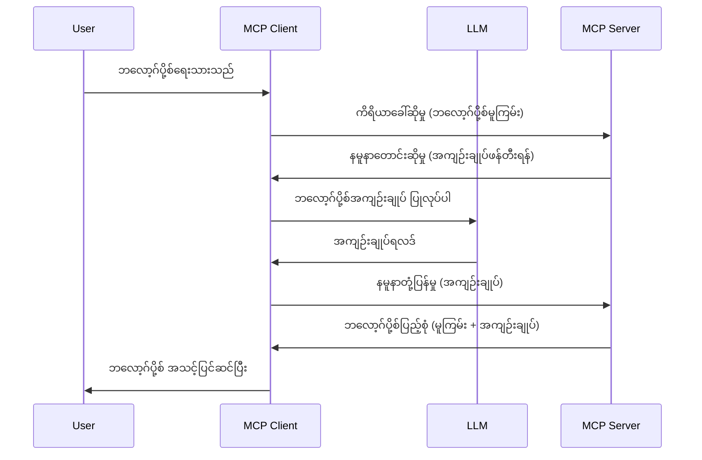

# Sampling - Client ကို delegate လုပ်ပေးခြင်း

တခါတရံမှာ MCP Client နဲ့ MCP Server တွေဟာ ပူးပေါင်းပြီး ရည်မှန်းချက်တစ်ခုကို ပြည့်မှီအောင် လုပ်ဆောင်ဖို့လိုတတ်ပါတယ်။ Server က Client ပေါ်မှာရှိတဲ့ LLM ရှိတဲ့ အကူအညီလိုအပ်တဲ့ အခြေအနေရှိနိုင်ပါတယ်။ ဒီအခြေအနေအတွက် Sampling ကို အသုံးပြုသင့်ပါတယ်။

Sampling ပါဝင်တဲ့ အကောင်အထည်ဖော်မှုနဲ့ အသုံးပြုမှုအချို့ကို ရှုမြင်ကြရအောင်။

## အနှုံးချုပ်

ဒီသင်ခန်းစာမှာ Sampling ကိုဘယ်တော့၊ ဘယ်နေရာမှာ အသုံးပြုရမလဲဆိုတာနဲ့ ဘယ်လို configure လုပ်ရမလဲကို ရှင်းပြပေးမှာဖြစ်ပါတယ်။

## သင်ယူရမယ့် ရည်မှန်းချက်များ

ဒီအပိုင်းမှာ ကျွန်တော်တို့က -

- Sampling ဆိုတာဘာလဲ နဲ့ ဘယ်အချိန်အသုံးပြုရမလဲ ရှင်းပြပေးပါမယ်။
- MCP မှာ Sampling ကို ဘယ်လို configure လုပ်ရမလဲ ပြသပါမယ်။
- Sampling ကို အသုံးပြုနည်း ဥပမာတွေ ပြပေးပါမယ်။

## Sampling ဆိုတာဘာလဲ နဲ့ ဘာကြောင့်အသုံးပြုသလဲ?

Sampling က အဆင့်မြင့် feature တစ်ခု ဖြစ်ပြီး အောက်ပါနည်းလမ်းအတိုင်း လုပ်ဆောင်ပါတယ်။



### Sampling request

အိုကေ၊ ယခုမှာ ကျွန်တော်တို့မှာ ယုံကြည်စိတ်ချရတဲ့ နေရာကြီးတစ်ခုရောက်ရှိသွားပြီဆိုတော့ Server က Client ကို ပြန်ပို့တဲ့ sampling request အကြောင်းပြောကြမယ်။ ဒီလို request တစ်ခု JSON-RPC ပုံစံမှာ ဒီလိုမျိုးတွေ့နိုင်ပါတယ်။

```json
{
  "jsonrpc": "2.0",
  "id": 1,
  "method": "sampling/createMessage",
  "params": {
    "messages": [
      {
        "role": "user",
        "content": {
          "type": "text",
          "text": "Create a blog post summary of the following blog post: <BLOG POST>"
        }
      }
    ],
    "modelPreferences": {
      "hints": [
        {
          "name": "claude-3-sonnet"
        }
      ],
      "intelligencePriority": 0.8,
      "speedPriority": 0.5
    },
    "systemPrompt": "You are a helpful assistant.",
    "maxTokens": 100
  }
}
```

ဒီမှာ ဖော်ပြလိုက်ရမယ့် အချက်အချို့ရှိပါတယ်။

- Content -> text ခေါင်းစဉ်အောက်မှာရှိတဲ့ Prompt ဟာ LLM ကို ဘလော့ဂ်ပို့စ် အကြောင်းအရာကို အကျဉ်းချုပ် ပေးဖို့ လမ်းညွှန်ချက်ဖြစ်ပါတယ်။

- **modelPreferences**. ဒီပိုင်းဟာ အကြံပြုချက်တစ်ခုဖြစ်ပြီး LLM နဲ့ ဘယ် configuration ကို သုံးမလဲဆိုတာအသုံးပြုသူ ရွေးချယ်ခွင့်ရှိပါတယ်။ ဒီဥပမာမှာ အကြံပြုချက်တွေမှာ သုံးမဲ့ model နဲ့ အမြန်နှုန်း၊ တုံ့ပြန်နိုင်မှုအစဉ်အလာတင်ထားပြီးဖြစ်ပါတယ်။
- **systemPrompt** ဆိုတာ သင့်ရဲ့ LLM ကို စိတ်ပါဝင်စားမှု ပေးရန် system prompt ပုံစံဖြစ်ပြီး လမ်းညွှန်ရန် စာများပါဝင်ပါတယ်။
- **maxTokens** က ဒီအလုပ်အတွက် အသုံးပြုဖို့ တိုက်ထွာထားတဲ့ token အရေအတွက်တစ်ခုဖြစ်ပါတယ်။

### Sampling response

ဒီ response က ဤမှာ MCP Client က MCP Server ကို ပြန်ပို့တဲ့ အကြောင်းပြန် ဖြစ်ပြီး Client က LLM ကို ခေါ်ပြီး အဲဒီတုံ့ပြန်ချက်ရရှိမှ Message ကို တည်ဆောက်တာ ဖြစ်ပါတယ်။ JSON-RPC ပုံစံမှာ ဒီလိုမျိုးမြင်ရပါ့မယ်။

```json
{
  "jsonrpc": "2.0",
  "id": 1,
  "result": {
    "role": "assistant",
    "content": {
      "type": "text",
      "text": "Here's your abstract <ABSTRACT>"
    },
    "model": "gpt-5",
    "stopReason": "endTurn"
  }
}
```

Response က ဘလော့ဂ်စကားအကျဉ်းလိုလို ဖြစ်တယ်ဆိုတာ မှတ်ထားပြီး သင်တောင်းဆိုထားတာမျိုး မဟုတ်ပေမဲ့ အသုံးပြုထားတဲ့ `model` က "claude-3-sonnet" မဟုတ်ပဲ "gpt-5" ဖြစ်နေတယ်ဆိုတာကိုလည်း သတိထားပါ။ ဒီဟာက အသုံးပြုသူဟာ ဘာအသုံးမလဲဆိုတာ ပြောင်းလဲနိုင်ကြောင်း ပြသရန် ဖြစ်ပါတယ်။

အိုကေ၊ အခုမှာ ကျွန်တော်တို့ရဲ့ မူရင်းအဆက်အစဉ်နဲ့ "ဘလော့ဂ်ဆိုဒ် တည်ဆောက်ခြင်း + အကျဉ်းချုပ်" လိုအမျိုးအစားမှာ အသုံးပြုဖို့ အသုံးဝင်တဲ့ လုပ်ငန်းလုပ်ဆောင်ချက်ကိုနားလည်ပြီးသား ဖြစ်ပါတယ်။ ဤနည်းလမ်းကို အကောင်အထည်ဖော်ဖို့ ဘာလုပ်ရမလဲ ဘယ်လိုလုပ်ရမလဲ ကြည့်ကြရအောင်။

### Message အမျိုးအစားများ

Sampling message တွေက စာသားအပြင် ပုံနှင့် အသံလည်း ပို့နိုင်ပါတယ်။ JSON-RPC ပုံစံကဘယ်လိုပြောင်းလဲသွားသလဲကြည့္ရအောင်။

**စာသား**

```json
{
  "type": "text",
  "text": "The message content"
}
```

**ပုံအကြောင်းအရာ**

```json
{
  "type": "image",
  "data": "base64-encoded-image-data",
  "mimeType": "image/jpeg"
}
```

**အသံအကြောင်းအရာ**

```json
{
  "type": "audio",
  "data": "base64-encoded-audio-data",
  "mimeType": "audio/wav"
}
```

> NOTE: Sampling အကြောင်း အသေးစိတ်ဖတ်ရှုရန် [အတည်ပြုစာရွက်များ](https://modelcontextprotocol.io/specification/2025-11-25/client/sampling) ကို သွားကြည့်ပါ။

## Client မှာ Sampling ကို ဘယ်လို Configure လုပ်မလဲ

> Note: သင် Server တစ်ခုကိုသာ တည်ဆောက်နေရင် ဒီနေရာမှာ အလုပ်များ မရှိပါ။

Client မှာ အောက်ပါ Feature ကို သတ်မှတ်ရပါမယ်။

```json
{
  "capabilities": {
    "sampling": {}
  }
}
```

ပြီးရင် သင့်ရွေးချယ်ထားတဲ့ Client က Server နဲ့ ချိတ်ဆက်တဲ့အချိန်မှာ ဖမ်းယူထားပါလိမ့်မယ်။

## Sampling ကို အသုံးပြုနေတဲ့ ဥပမာ - ဘလော့ဂ်ပို့စ် တစ်ခု ဖန်တီးခြင်း

Sampling Server တစ်ခုကို ကုဒ်ရေးပြီး ဖန်တီးမယ်ဆိုရင် အောက်က အဆင့်တွေလိုအပ်ပါတယ်။

1. Server ပေါ်မှာ Tool တစ်ခု ဖန်တီးပါ။
1. ဒီ Tool က sampling request တစ်ခု ဖန်တီးစရာလိုပါမယ်။
1. Tool က Client ရဲ့ sampling request အဖြေကို စောင့်ဆိုင်းရပါမယ်။
1. ထို Tool ရဲ့ ရလဒ်ကို ထုတ်ပေးရပါမယ်။

အဆင့်လိုက် ကုဒ်ကို ကြည့်ကြရအောင်။

### -1- Tool ကို ဖန်တီးပါ

**python**

```python
@mcp.tool()
async def create_blog(title: str, content: str, ctx: Context[ServerSession, None]) -> str:
    """Create a blog post and generate a summary"""

```

### -2- Sampling request ဖန်တီးပါ

Tool ကို အောက်ပါ ကုဒ်နဲ့ တိုးချဲ့ပါ။

**python**

```python
post = BlogPost(
        id=len(posts) + 1,
        title=title,
        content=content,
        abstract=""
    )

prompt = f"Create an abstract of the following blog post: title: {title} and draft: {content} "

result = await ctx.session.create_message(
        messages=[
            SamplingMessage(
                role="user",
                content=TextContent(type="text", text=prompt),
            )
        ],
        max_tokens=100,
)

```

### -3- Response ကို စောင့်ဆိုင်းပြီး ပြန်ပေးပါ

**python**

```python
post.abstract = result.content.text

posts.append(post)

# ဖြတ်တောက်ပြီးသောကုန်ပစ္စည်းကို ပြန်ပေးပါ။
return json.dumps({
    "id": post.title,
    "abstract": post.abstract
})
```

### -4- ပြည့်စုံတဲ့ကုဒ်

**python**

```python
from starlette.applications import Starlette
from starlette.routing import Mount, Host

from mcp.server.fastmcp import Context, FastMCP

from mcp.server.session import ServerSession
from mcp.types import SamplingMessage, TextContent

import json


from uuid import uuid4
from typing import List
from pydantic import BaseModel


mcp = FastMCP("Blog post generator")

# app = FastAPI()

posts = []

class BlogPost(BaseModel):
    id: int
    title: str
    content: str
    abstract: str

posts: List[BlogPost] = []

@mcp.tool()
async def create_blog(title: str, content: str, ctx: Context[ServerSession, None]) -> str:
    """Create a blog post and generate a summary"""

    post = BlogPost(
        id=len(posts) + 1,
        title=title,
        content=content,
        abstract=""
    )

    prompt = f"Create an abstract of the following blog post: title: {title} and draft: {content} "

    result = await ctx.session.create_message(
        messages=[
            SamplingMessage(
                role="user",
                content=TextContent(type="text", text=prompt),
            )
        ],
        max_tokens=100,
    )

    post.abstract = result.content.text

    posts.append(post)

    # ပြည့်စုံသော ဘလော့ခ်ပို့စ်ကို ပြန်ပေးပါ
    return json.dumps({
        "id": post.title,
        "abstract": post.abstract
    })

if __name__ == "__main__":
    print("Starting server...")
    # mcp.run()
    mcp.run(transport="streamable-http")

# app ကို စတင်ရန်: python server.py ဖြင့် ပြေးပါ
```

### -5- Visual Studio Code မှာ စမ်းသပ်ခြင်း

Visual Studio Code မှာ စမ်းသပ်ဖို့ အောက်ပါအဆင့်တွေလိုက်ပါ။

1. Terminal မှာ Server ကို စတင်ပါ။
1. *mcp.json* ထဲ ထည့်ပြီး စတင်ထားပါ။ ဥပမာ က ဒီလိုဖြစ်နိုင်ပါတယ်။

   ```json
   "servers": {
      "blog-server": {
        "type": "http",
        "url": "http://localhost:8000/mcp"
      }
   }
   ```

1. Prompt တစ်ခု ရိုက်ထည့်ပါ။

   ```text
   create a blog post named "Where Python comes from", the content is "Python is actually named after Monty Python Flying Circus"
   ```

1. Sampling ဖြစ်လာဖို့ ခွင့်ပြုပါ။ ပထမဆုံး စမ်းသပ်ရင် အပိုကောလဟာလတစ်ခုပြသပါမယ်၊ ကိုယ်လက်ခံပြီးမှ Tool ကို ပြေးစေဖို့ dialog အများလုံးတွေမြင်ရပါမယ်။

1. ရလဒ်တွေကို ကြည့်ရှုပါ။ ရလဒ်တွေက GitHub Copilot Chat မှာ ရှင်းလင်းစွာ ပြသထားမယ်၊ raw JSON response ကိုလည်း စစ်ဆေးနိုင်ပါသည်။

**Bonus**။ Visual Studio Code က Sampling ကို အထောက်အပံ့ကောင်းစွာ ပေးပါတယ်။ သင့်တပ်ဆင်ထားတဲ့ server မှာ Sampling အချက်အလက်တွေ configure လုပ်ဖို့ ဒီလို လမ်းကြောင်းသွားရပါတယ်။

1. Extension အပိုင်းကို သွားပါ။
1. "MCP SERVERS - INSTALLED" အပိုင်းက သင့်တပ်ဆင်ထားတဲ့ server ရဲ့ cog icon ကို ရွေးပါ။
1. "Configure Model Access" ကို ရွေးပါ၊ ဒီနေရာမှာ Sampling ပြုလုပ်သည့်အခါ GitHub Copilot သုံးနိုင်မယ့် Model များကို ရွေးချယ်နိုင်ပါတယ်။ နောက်ပြီး "Show Sampling requests" ကိုရွေးပြီး လတ်တလော sampling requests အားလုံးကို ကြည့်ရှုနိုင်ပါတယ်။

## ပေးအပ်ချက်

ဒီပေးအပ်ချက်မှာ နည်းနည်းကွဲပြားတဲ့ Sampling တစ်ခုကို တည်ဆောက်မှာဖြစ်ပြီး အထူးသဖြင့် ကုန်ပစ္စည်းဖော်ပြချက်ထုတ်ဖော်ခြင်း အတွက် Sampling Integration ဖြစ်ပါမယ်။ ဒီကိစ္စအခြေအနေကတော့ -

**Scenario**: e-commerce ရဲ့ back office ဝန်ထမ်းလူကြီးက ကူညီချင်သဖြင့် ကုန်ပစ္စည်းဖော်ပြချက် ပြုလုပ်ရတာ အချိန်များနေပါတယ်။ ထို့ကြောင့် "create_product" ဆို tool ကို "title" နဲ့ "keywords" ဆို အချက်အလက်တွေနဲ့ ခေါ်နိုင်ပြီး "description" ဆို client ရဲ့ LLM နဲ့ ဖြည့်စွက်ထားတဲ့ ကုန်ပစ္စည်း အသေးစိတ် ဖန်တီးပေးရမယ်။

TIP: ယခင်မှာ သင်ယူခဲ့သလို Server နဲ့ Tool ကို sampling request အသုံးပြုပြီး ဖန်တီးပါ။

## ဖြေရှင်းချက်

[Solution](./solution/README.md)

## အဓိက မှတ်ချက်များ

Sampling က Server က client ထံ LLM အကူအညီလိုအပ်တဲ့အခါ တာဝန်များကို delegate လုပ်ပေးနိုင်တဲ့ အင်အားကြီးတဲ့ feature ဖြစ်ပါတယ်။

## နောက်ပိုင်းမှာ ဘာလဲ

- [အခန်း ၄ - လက်တွေ့ အကောင်အထည်ဖော်မှု](../../04-PracticalImplementation/README.md)

---

<!-- CO-OP TRANSLATOR DISCLAIMER START -->
**ပြောကြားချက်**
ဤစာတမ်းကို AI ဘာသာပြန်ဝန်ဆောင်မှု [Co-op Translator](https://github.com/Azure/co-op-translator) အသုံးပြု၍ ဘာသာပြန်ထားပါသည်။ ကျွန်ုပ်တို့သည် တိကျမှန်ကန်မှုအတွက် ကြိုးပမ်းနေသော်လည်း၊ စက်ကိရိယာဘာသာပြန်ခြင်းများတွင် အမှားများ သို့မဟုတ် မှားယွင်းချက်များ ပါဝင်နိုင်ကြောင်း သတိပြုပါရန် လိုအပ်ပါသည်။ မူလစာတမ်းကို မူရင်းဘာသာဖြင့်သာ ယုံကြည်စိတ်ချရသော အချက်အလက်အဖြစ် သတ်မှတ်သင့်သည်။ အရေးကြီးသည့် သတင်းအချက်အလက်များအတွက် ပရော်ဖက်ရှင်နယ် လူသားဘာသာပြန်သူဝန်ဆောင်မှုကို အကြံပြုပါသည်။ ဤဘာသာပြန်ချက်ကို အသုံးပြုခြင်းမှ ဖြစ်ပေါ်လာသော နားလည်မှုကွာခြားမှုများ သို့မဟုတ် မမှန်ကန်သော အသုံးပြုမှုများအတွက် ကျွန်ုပ်တို့ တာဝန်မခံပါ။
<!-- CO-OP TRANSLATOR DISCLAIMER END -->