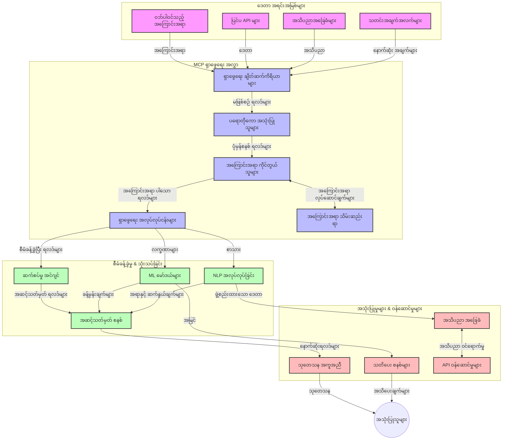
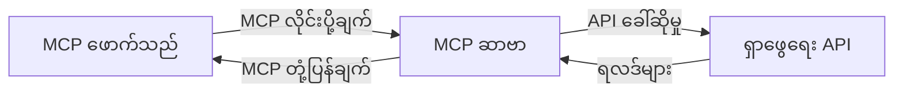
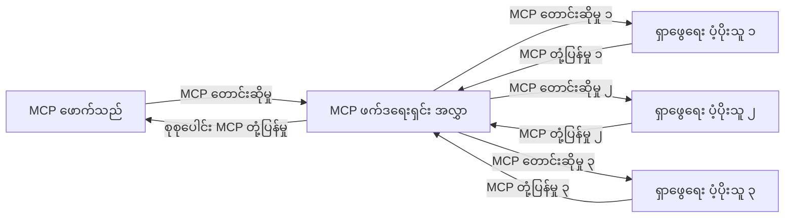
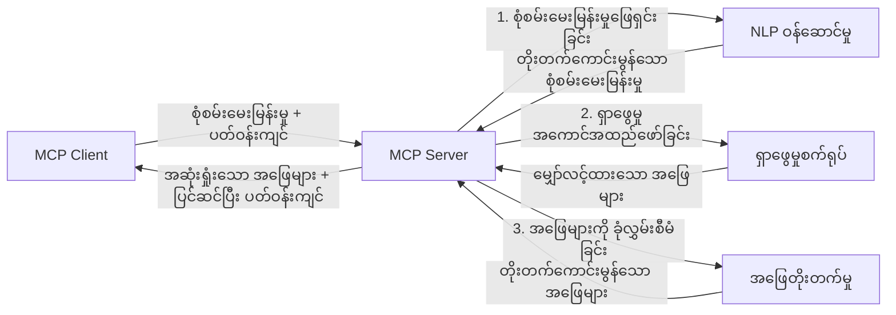

# အချိန်နှင့်တပြေးညီ ဝက်ဘ်ရှာဖွေရေးအတွက် မော်ဒယ် ဒိုင်ယာလောဂ် အခြေအနေ ပရိုတိုကော

## အနှစ်ချုပ်

အချိန်နှင့်တပြေးညီ ဝက်ဘ်ရှာဖွေရေးသည် ဒီနေ့ သတင်းအချက်အလက် များစွာကို အခြေခံသော ပတ်ဝန်းကျင်တွင် မရှိမဖြစ်လိုအပ်လာပြီး အက်ပလီကေးရှင်းများသည် အင်တာနက်ပေါ်မှ မကြာခဏအသစ်ပြောင်းလဲနေသည့် အချက်အလက်များကို လျင်မြန်စွာ ရယူရမည်ဖြစ်သည်။ မော်ဒယ် ဒိုင်ယာလောဂ် အခြေအနေ ပရိုတိုကော (Model Context Protocol - MCP) သည် အချိန်နှင့်တပြေးညီ ရှာဖွေရေးလုပ်ငန်းစဉ်များကို ထိရောက်စွာ တိုးတက်ကောင်းမွန်လာစေပြီး ရှာဖွေရေး ထိရောက်မှု တိုးတက်စေခြင်း၊ အချက်အလက်ဆက်နွယ်မှု ထိန်းသိမ်းစောင့်ရှောက်ခြင်း နှင့် စနစ်အရည်အသွေး တိုးတက်စေခြင်းတို့၌ အရေးကြီးသော တိုးတက်မှု တစ်ရပ်ကို ကိုယ်စားပြုသည်။

ဤမော်ဂျူးတွင် MCP သည် AI မော်ဒယ်များ၊ ရှာဖွေရေးအင်ဂျင်များနှင့် အက်ပလီကေးရှင်းများအကြား အချက်အလက်ဆက်နွယ်မှု ကို စံပြ မှုတစ်ခုဖြင့် မည်သို့ ပြောင်းလဲပုံကို ရှင်းလင်းထားသည်။

### သင်ယူရမည့် အကြောင်းအရာများ

ဤလမ်းညွှန် စာအုပ်လုံးဝတွင် သင်မှာတွေ့ရမည့်အရာများမှာ -

- MCP သည် AI မော်ဒယ်များနှင့် အချိန်နှင့်တပြေးညီ ဝက်ဘ်ရှာဖွေရေး တို့အကြား မျက်နှာချင်းဆိုင် ကွန်နက်ရှင်း များကို မည်သို့ ဖန်တီးပေးသည်ကို
- MCP ဖြင့် ထိရောက်ပြီး အဆင့်မြင့် ရှာဖွေရေး ဖြေရှင်းချက်များ ဖန်တီးရာတွင် ဆောက်လုပ်ပုံ ဆိုင်းငံ့ပုံများ
- မတူညီသော မေးခွန်းများနှင့် ပူးပေါင်းဆက်ဆံမှုများအတွင်း ရှာဖွေရေးအခြေအနေ ထိန်းသိမ်းပုံ နည်းလမ်းများ
- Python နှင့် JavaScript ကို အသုံးပြုပြီး ရှာဖွေရေး အခြေအနေများတွင် လက်တွေ့ကုဒ်များ ဆောင်ရွက်ပုံ
- MCP ပိုင်ဆိုင်သည့် ရှာဖွေရေးစနစ်များတွင် သက်ဆိုင်မှု၊ အသစ်ရရှိမှုနှင့် ပေးပို့ အဆင့်အတန်းများကို ဘယ်လို ကွန်ထရိုက်လုပ်ရမည်

## အချိန်နှင့်တပြေးညီ ဝက်ဘ်ရှာဖွေရေး အကြောင်းနိဒါန်း

အချိန်နှင့်တပြေးညီ ဝက်ဘ်ရှာဖွေရေးသည် ဝက်ဘ်အခြေခံ သတင်းအချက်အလက်များကို လျင်မြန်စွာမေးခွန်းထုတ်ခြင်း၊ ပြုလုပ်ခြင်းနှင့် သုံးသပ်ခြင်းဖြင့် သတင်းအချက်အလက်အသစ်များကို နည်းလမ်းမရှိပဲ ချက်ချင်း ရရှိနိုင်စေသည်။ ယေဘုယျ ရှာဖွေရေး စနစ်များသည် နာရီအနည်းငယ် သို့မဟုတ် ရက်ပေါင်းများစွာ ကျန်ခဲ့သော အချက်အလက်များကို အကြောင်းပြုသော အချက်အလက်စုစည်းမှုကို အသုံးပြုရာတွင် မတူဘဲ အချိန်နှင့်တပြေးညီ ရှာဖွေရေးသည် ရှိနေသော အချက်အလက်များကို တိုက်ရိုက် နှိပ်စက်ပြီး လက်ရှိ အွန်လိုင်း ပမာဏများကို လွကြောင်း ပြသနိုင်သည်။

### အချိန်နှင့်တပြေးညီ ဝက်ဘ်ရှာဖွေရေး၏ အဓိက သဘောအရင်းအမြစ်များ

- **ဆက်တိုက်မေးခွန်းလုပ်ငန်း**: ရှာဖွေရေးမေးခွန်းများကို အမြဲတမ်း ပြောင်းလဲနေသော ဒေတာအရင်းအမြစ်များနှင့် ချိန်ညှိထိန်းချုပ်ခြင်း
- **အသစ်ရရှိမှုကို ဦးစားပေးခြင်း**: စနစ်များသည် အသစ်ရရှိသည့် အချက်အလက်များကို ဦးစားပေးရန် ဒီဇိုင်းပြုလုပ်ထားသည်
- **သက်ဆိုင်မှု နှင့် အသစ်မြောက်မှု ဆက်သွယ်မှု**: သက်ဆိုင်မှုနှင့် အသစ်ရရှိမှု တို့ကို တစ်ဆက်တည်း ထိန်းသိမ်းခြင်း
- **အဆင့်ချိန်ညှိနိုင်သော အခြေခံလမ်းကြောင်း**: မေးခွန်းများ၏ အလွှာနှင့် ဒေတာအပေါ်မူတည်၍ စနစ်သည် သိသပ်စွာ ထိန်းချုပ်နိုင်ရမည်
- **အခြေအနေ နားလည်မှု**: အများဆုံး ရလဒ်ရရှိရေး စနစ်တစ်ခုအနေဖြင့် အသုံးပြုသူ၏ ဒိုင်ယာလောဂ်ကို ထိန်းသိမ်းစောင့်ရှောက်ခြင်းအရေးကြီးသည်
- **မေးခွန်း ပြန်လဲဖွဲ့စည်းခြင်း**: အခြေအနေ နှင့် ယခင်ရလဒ်များအပေါ် မူတည်ပြီး မေးခွန်းများကို လိုက်လျောညီထွေပြင်ဆင်ခြင်း
- **တစ်ခုထက်မက အရင်းအမြစ် ပေါင်းစပ်ခြင်း**: မတူညီသော ရှာဖွေရေးအဖွဲ့အစည်းများနှင့် ဝက်ဘ်အရင်းအမြစ်များမှ ရလဒ်များကို ပေါင်းစည်းခြင်း
- **အဓိပ္ပာယ် နားလည်မှု**: ဟုတ်သည့် စကားလုံးများ အလားအလာမဟုတ်ပဲ အဓိပ္ပာယ်ကို တင်ပြ၍ မေးခွန်းများနှင့် အကြောင်းအရာများကို လုပ်ဆောင်ခြင်း
- **အချိန်နှင့်တပြေးညီ အဆင့်သတ်မှတ်ခြင်း**: သတင်းအချက်အလက်အသစ်ရရှိသည့်အခါ အဆင့်သတ်မှတ်မှုများကို ဆက်တိုက် ပြောင်းလဲခြင်း

### Model Context Protocol နှင့် အချိန်နှင့်တပြေးညီ ဝက်ဘ်ရှာဖွေရေး

Model Context Protocol (MCP) သည် အချိန်နှင့်တပြေးညီ ဝက်ဘ်ရှာဖွေရေးပတ်ဝန်းကျင်တွင် ကြုံတွေ့ရသော အဓိက စိန်ခေါ်မှုများကို ပြဿနာဖြေရှင်းပေးသည်။

1. **ရှာဖွေရေးအခြေအနေ ထိန်းသိမ်းခြင်း** - MCP သည် စနစ် နှင့် ဖြန့်ဖြူးထားသော ရှာဖွေရေး အစိတ်အပိုင်းများအကြား အခြေအနေ ထိန်းသိမ်းပုံကို စံနမူနာပြု၊ AI မော်ဒယ်များနှင့် ပရိုဆက်စင်လိုင်တွေ ရှာဖွေရေး မေးခွန်းရှေ့ပြေးမှတ်တမ်းများ နှင့် အသုံးပြုသူ ကြိုက်နှစ်သက်မှုများ ထိန်းသိမ်း လေ့လာနိုင်စေသည်။

2. **မေးခွန်း စီမံခန့်ခွဲမှု ထိရောက်မှု** - အခြေအနေ ပေးပို့ပုံကို ဖွဲ့စည်းထားခြင်းဖြင့် MCP သည် မေးခွန်းတိုင်းတွင် ထပ်တလဲလဲရှိသည့် အချက်အလက်များထဲမှ ပြည့်စုံမှုကို လျော့နည်းစေသည်။

3. **အပြန်အလှန် လိုက်လျောညီထွေမှု** - MCP သည် စနစ် နှင့် AI မော်ဒယ်များ အကြား အခြေအနေမျှဝေမှုတွင် သဘာဝစကားပြောခြင်း တစ်ခုလည်း ဖြစ်စေပြီး ပိုမိုတိုးတက်သောနည်းပညာ ဖန်တီးနိုင်ပါသည်။

4. **ရှာဖွေရေးအတွက် အခြေအနေ အထူးပြုမှု** - MCP အကောင်အထည်ဖော်မှုများသည် အသုံးပြုရသည့် အချက်အလက်များထဲမှ သက်ဆိုင်မှုပိုမိုကျဉ်းမြောင်းအောင် ရွေးချယ်၍ ရှာဖွေရေး စနစ်၏ လုပ်ဆောင်မှုနှင့် တိကျမှန်ကန်မှု တို့ကို မြှင့်တင်နိုင်ပါသည်။

5. **သုံးစွဲသူ လိုအပ်ချက်နှင့် သတင်းအချက်အလက် ရေပြည့်ဝ အခြေအနေများအပေါ် မူတည်သော ရှာဖွေရေးလုပ်ငန်းစဉ် ညှိနှိုင်းမှု** - MCP သည် အချက်အလက်ဦးတည်ချက်အပေါ် မူတည်၍ ရှာဖွေရေးစနစ်များကို ရေပြည့်ဝစွာ ချိန်ညှိပေးနိုင်သည်။

သတင်းစာ စုစည်းခြင်းမှ စ တဆင့် သုတေသန အကူအညီ ပေးရေး အထိ ခေတ်မီအက်ပလီကေးရှင်းများတွင် MCP နှင့် ဝက်ဘ်ရှာဖွေရေးနည်းပညာများ ပေါင်းစပ်မှုဖြင့် ပိုမို မျက်နှာချင်းဆိုင်သော၊ အခြေအနေ နားလည်မှုရှိသော ရှာဖွေရေး စနစ်များ ဖန်တီးနိုင်ပါသည်။

## သင်ယူရမည့် ရည်မှန်းချက်များ

ဤသင်ခန်းစာ အဆုံးတွင် သင်သည် -

- အချိန်နှင့်တပြေးညီ ဝက်ဘ်ရှာဖွေရေး၏ အခြေခံအကြောင်းအရာများနှင့် နောက်ဆုံးခေတ် အက်ပလီကေးရှင်းများ၌ ရှိသော စိန်ခေါ်မှုများကို နားလည်နိုင်မည်
- Model Context Protocol (MCP) သည် အချိန်နှင့်တပြေးညီ ဝက်ဘ်ရှာဖွေရေး ထူးခြားမှုများကို မည်သို့တိုးတက်စေသနည်း ရှင်းပြနိုင်မည်
- လူကြိုက်များသော ဖရိမ်းဝပ်များနှင့် API များ အသုံးပြု၍ MCP အခြေခံ ရှာဖွေရေး ဖြေရှင်းချက်များ ဆောင်ရွက်နိုင်မည်
- MCP ဖြင့် အဆင့်မြင့်၊ ထိရောက်ခိုင်မာသော ရှာဖွေရေး ဖွဲ့စည်းပုံများ ဒီဇိုင်းရေးဆွဲ ပြုလုပ်နိုင်မည်
- MCP အယူအဆများကို သက်ဆိုင်ရာ သုံးစွဲကိရိယာများတွင် အသုံးချနိုင်ပြီး စကားလုံးအဓိပ္ပာယ်ရှာဖွေရေး၊ သုတေသန အကူအညီများ၊ AI ချိတ်ဆက် သဘောတူညီမှုများနှင့် တွဲဖက်နားလည်နိုင်မည်
- MCP အခြေခံ ရှာဖွေရေးနည်းပညာများ အတွက် မကြာရှေ့ လျောက်လွှင့်များနှင့် အနာဂတ် ဆန်းသစ်မှုများကို သုံးသပ်နိုင်မည်
- အသုံးပြုသူတို့၏ အပြန်အလှန် လှုပ်ရှားမှုများမှ သင်ယူသော အခြေအနေ နားလည်မှုရှိသော ရှာဖွေရေးစနစ်များ ဖန်တီးနိုင်မည်
- စံနမူနာ MCP ပရိုတိုကောများကို အသုံးပြုကာ AI အကူအညီ ပေးသည့်ရုပ်ပိုင်းဆိုင်ရာ ဝက်ဘ်ရှာဖွေရေး စွမ်းဆောင်ရည်များ ထည့်သွင်း ဆက်စပ်နိုင်မည်
- အခြေအနေ ပေါ်မူတည်ပြီး ရလဒ်များကို တစ်ဆင့်ချင်းအကောင်းဆုံးပြုလုပ်သွားသော အဆင့်များစွာ ပါဝင်သည့် ရှာဖွေရေး လမ်းကြောင်းများ ဖန်တီးနိုင်မည်
- အကောင်းဆုံး ရှာဖွေရေးရလဒ်များရရှိရေး ကောင်းစွာ ထိန်းသိမ်းပြီး သိပ်သည်းသော အခြေအနေ နားလည်မှုကို ဟန်ချက်ညီသွားစေသည့် စနစ်များ ဖန်တီးနိုင်မည်

### အဓိပ္ပာယ်နှင့် အရေးပါမှု

အချိန်နှင့်တပြေးညီ ဝက်ဘ်ရှာဖွေရေးသည် ဝက်ဘ်အခြေခံ သတင်းအချက်အလက်များကို ထပ်တလဲလဲမေးမြန်း၊ ရယူကာ ကြာမြင့်ချိန်သိပ် မထားဘဲ ပေးပို့ခြင်းဖြစ်သည်။ ရှာဖွေရေးအင်ဂျင်များသည် ကာလကြာမြင့် စနစ်များဖြင့် ဝက်ဘ်ကို ဆင့်ဖြတ်ခွင့်ပြုကြောင်းတွင် မတူဘဲ အချိန်နှင့်တပြေးညီ ရှာဖွေရေးသည် လျင်မြန်စွာ ရရှိလာသမျှ အချက်အလက်များကို ထုတ်ဖော်ပြသနိုင်စေရန် ရည်ရွယ်သည်။

အချိန်နှင့်တပြေးညီ ဝက်ဘ်ရှာဖွေရေး၏ အဓိက ထူးခြားချက်များမှာ -

- **အသစ်နက်ရှိုင်းမှု** - မကြာသေးသော အကြောင်းအရာနှင့် အချက်အလက်များကို ဦးစားပေးခြင်း
- **ဆက်တိုက် ပြုလုပ်မှု** - အသစ်များကို ဆက်တိုက် ကြည့်ရှုခြင်း
- **မေးခွန်း ပြန်ဆင်ခြင်း** - အခြေအနေနှင့် တုံ့ပြန်မှုအပေါ် မူတည်၍ ရှာဖွေရေးမေးခွန်းများ ထပ်မံပြင်ဆင်ခြင်း
- **ချက်ချင်း ပေးပို့မှု** - ရလဒ်များအား တွက်ချက်ချိန်နည်းစွာ ဖြစ်ပေါ်ရန် ပေးပို့ခြင်း
- **အခြေအနေ ထိန်းသိမ်းမှု** - ယခင်မေးခွန်းများအပေါ် အခြေခံ၍ ရလဒ်ပိုမို သက်ဆိုင်မှုရှိစေရန်

### ရိုးရာ ဝက်ဘ်ရှာဖွေရေး၏ စိန်ခေါ်မှုများ

အချိန်နှင့်တပြေးညီ အခြေအနေများတွင် ရိုးရာ ရှာဖွေရေး နည်းလမ်းများသည် အောက်ပါကဲ့သို့ အကန့်အသတ်များ ကြုံတွေ့ရသည် -

1. **အခြေအနေ ခွဲခြမ်းခြင်း** - မေးခွန်းများစွာတွင် ရှာဖွေရေး အခြေအနေ ထိန်းသိမ်းရာ အခက်အခဲ
2. **သတင်းအသစ်များရရှိမှု** - အသစ်ဆုံး သတင်းအချက်အလက်များကို ရယူ၍ ဦးစားပေးခြင်း အခက်အခဲ
3. **ပေါင်းစည်းမှု စဉ်ဆက်မပြတ်မှု** - ရှာဖွေရေးစနစ်နှင့် အက်ပလီကေးရှင်းများ ချိတ်ဆက်ရာရှိ ခက်ခဲမှု
4. **ချိန်ကြာမြင့်မှုများ** - တုန့်ပြန်ချိန်လိုအပ်ချက်နှင့် ရှာဖွေရေးတိကျမှုကို တပြိုင်နက် ထိန်းသိမ်းရခြင်း
5. **သက်ဆိုင်မှု လိုက်ဖက်မှု အတိအကျညှိနှိုင်းမှု** - အသစ်ရရှိမှုကို ဦးစားပေးလျှင်မှန်ကန်မှုကို ထိန်းသိမ်းရေး

## ရှာဖွေရေးအတွက် Model Context Protocol (MCP) ကို နားလည်ခြင်း

### ရှာဖွေရေးအနေအထားတွင် MCP ဆိုတာဘာလဲ?

Model Context Protocol (MCP) သည် AI မော်ဒယ်များနှင့် အက်ပလီကေးရှင်းများအကြား ထိရောက်စွာဆက်သွယ်ရန် စံပြပြုထားသော ဆက်သွယ်ရေး ပရိုတိုကောဖြစ်သည်။ အချိန်နှင့်တပြေးညီ ဝက်ဘ်ရှာဖွေရေးအတွက် MCP သည် -

- မေးခွန်းများ အဆက်မပြတ် ရှာဖွေရေး အခြေအနေ ထိန်းသိမ်းရန်
- ရှာဖွေရေး မေးခွန်းနှင့် ရလဒ် ပုံစံများကို စံဆောင်ရန်
- ရှာဖွေရေး ပမာဏများနှင့် ရလဒ်များ ပေးပို့မှု အထူးပြု စီမံခန့်ခွဲမှု
- မော်ဒယ်နှင့် ရှာဖွေရေး အင်ဂျင်ဆက်သွယ်မှု တိုးတက်စေခြင်း

### အဓိက အစိတ်အပိုင်းများနှင့် ဆောက်လုပ်ပုံ

အချိန်နှင့်တပြေးညီ ဝက်ဘ်ရှာဖွေရေးအတွက် MCP သည် အောက်ပါ အဓိက အစိတ်အပိုင်းများပါဝင်သည် -

1. **မေးခွန်း အခြေအနေ ကိုင်တွယ်သူများ** - မေးခွန်း အရေအသွယ်တွင် ရှာဖွေရေး အခြေအနေ ထိန်းသိမ်းခြင်း
2. **ရှာဖွေရေး ပရိုဆက်ဆာများ** - အခြေအနေကို နားလည်ကာ ရှာဖွေမှု အမှာ စီမံခြင်း
3. **ပရိုတိုကော အဒပ်တာများ** - မတူညီသည့် ရှာဖွေရေး API သို့ MCP နည်းလမ်းဖြင့် ပြောင်းလဲပေးခြင်း
4. **အခြေအနေ ဆိုင်ရာ တန်ဆာ** - ရှာဖွေရေး သမိုင်းနှင့် ကြိုက်နှစ်သက်မှုများ သိမ်းဆည်းယူဆောင်ရန် တန်ဆာ
5. **ရှာဖွေရေး ချိတ်ဆက်သူများ** - မတူညီသော ရှာဖွေရေး အင်ဂျင်များနှင့် ဝက်ဘ် API များ ချိတ်ဆက်ခြင်း



### MCP သည် အချိန်နှင့်တပြေးညီ ဝက်ဘ်ရှာဖွေရေးကို မည်သို့ တိုးတက်စေသနည်း

MCP သည် ရိုးရာ ဝက်ဘ်ရှာဖွေရေး စိန်ခေါ်မှုများကို အောက်ပါနည်းလမ်းများဖြင့် ဖြေရှင်းပေးသည် -

- **အခြေအနေ ဆက်လက်မှု** - ရှာဖွေရေး အစည်းအဝေးတစ်လျှောက် မေးခွန်းအမြဲတမ်း တစ်ပြိုင်နက် တစ်ပြိုင်နက် ဆက်သွယ်ထားခြင်း
- **ပေးပို့မှု အများကြီး လျော့ချပေးခြင်း** - ကိုယ်ပိုင် အချက်အလက်များ ထပ်တလဲလဲ တင်ပြခြင်း လျော့နည်းစေရန် ဉာဏ်ရည်မြင့်အခြေအနေ စီမံခန့်ခွဲမှု
- **စံပြ API များ** - ရှာဖွေရေး ပစ္စည်းများ အတွက် တည်ငြိမ်သော API များ ပံ့ပိုးပေးခြင်း
- **ချိန်ကြာမြင့်မှု လျှော့ချပေးခြင်း** - အဆင့်မြင့် အခြေအနေကို မှန်မှန်ကန်ကန် ယူဆောင်ပေးခြင်းဖြင့် ပြုလုပ်မှု ထိပ်တန်းချိန်လျော့တတ်စေခြင်း
- **သက်ဆိုင်မှု မြှင့်တင်ခြင်း** - မတူညီသော မေးခွန်းများအတွင်း အသုံးပြုသူရဲ့ ရည်ရွယ်ချက် ထိန်းသိမ်း၍ ရှာဖွေရေး သက်ဆိုင်မှု မြင့်မားစေခြင်း

## ပေါင်းစပ်ခြင်းနှင့် အကောင်အထည် ဖော်ခြင်း

အချိန်နှင့်တပြေးညီ ဝက်ဘ်ရှာဖွေရေး စနစ်များသည် စွမ်းဆောင်ရည်နှင့် အခြေအနေတစ်ကျ ဆက်လက်ထိန်းသိမ်းမှုနှစ်ခုစလုံးကို ထိန်းသိမ်းရန် ဂရုစိုက်လုပ်ဆောင်ရမည်ဖြစ်သည်။ Model Context Protocol သည် AI မော်ဒယ်များနှင့် ရှာဖွေရေး နည်းပညာများ ပေါင်းစပ်ရာတွင် စံပြ နည်းလမ်းတစ်ခုဖြစ်ပြီး ပိုမိုတိုးတက် သဘောတူညီမှုရှိသော ရှာဖွေရေး လမ်းကြောင်းများ ဖန်တီးနိုင်ပါသည်။

### ရှာဖွေရေး ဆောက်လုပ်ပုံများတွင် MCP ပေါင်းစပ်ခြင်း အနှစ်ချုပ်

MCP ကို အချိန်နှင့်တပြေးညီ ရှာဖွေရေး ပတ်ဝန်းကျင်တွင် ခေါ်ယူကာ အသုံးပြုရာ၌ အောက်ပါ အချက်များကို စဥ်းစားရမည် -

1. **ရှာဖွေရေး အခြေအနေ စီးရီးလိုက်စနစ်** - MCP သည် ရှာဖွေရေး တောင်းဆိုမှုများအတွင်း အရေးကြီးသော အချက်အလက်များ အမြဲတမ်း လေးနက်သိမ်းဆည်းထားရန် ကောင်းမွန်သော လုပ်ငန်းစဉ်များ ပံ့ပိုးပေးသည်။ ဒါတွင် ရှာဖွေရေး အချက်အလက် နှင့် သက်ဆိုင်ပြီး စံပြဖြစ်သော စီးရီးလိုက် စနစ်များ ပါဝင်သည်။

2. **အခြေအနေရှိသည့် ရှာဖွေရေး စီမံခန့်ခွဲမှု** - MCP သည် ရှာဖွေရေး ပိုင်းဆိုင်ရာ လုပ်ငန်းအစဉ်များတွင် တစ်စိတ်တစ်ပိုင်းသွားလာမှု ဖြစ်စေရန် အခြေအနေကို မြှင့်တင်ထိန်းသိမ်းပေးသည်။ အထူးသဖြင့် မတူညီသော အဆင့်များ ပါဝင်သည့် ရှာဖွေရေး လမ်းကြောင်းများတွင် တိုးတက်မှု ရှိစေသည်။

3. **မေးခွန်း ဖြည့်စွက်ခြင်းနှင့် ပြင်ဆင်ခြင်း** - MCP ကို အသုံးပြုသော ရှာဖွေရေးစနစ်များတွင် အခြေအနေ ထပ်မံကြည့်ရှုပြီး မေးခွန်းများကို ပိုမိုခိုင်မာအောင် ပြုပြင်တိုးချဲ့နိုင်သည်၊ သင်္ချာရေးဆိုင်ရာ ရလဒ်များ ပိုမိုတိုးတက်စေတာ အထောက်အပံ့ ဖြစ်စေသည်။

4. **ရလဒ် သိမ်းဆည်းခြင်းနှင့် ဦးစားပေးခြင်း** - MCP သည် အခြေအနေစနစ် တည်ရှိခြင်းဖြင့် ရလဒ်များ တင်သိမ်းခြင်း နှင့် ပိုင်းခြား သတ်မှတ်ပေးခြင်းတို့ကို ပိုမိုထိန်းချုပ်နိုင်ရန်ကူညီပေးသည်။

5. **ရှာဖွေရေး ပေါင်းစည်းခြင်းနှင့် စုစည်းခြင်း** - MCP သည် ရှာဖွေရေး နှင့် ပတ်သက်သည့် အချက်အလက်များကို တိကျစွာ ကိုင်တွယ်နိုင်သော အသွင်အပြင်များပေးပြီး မတူညီသော အရင်းအမြစ်များမှ ရလဒ်များကို တည်ငြိမ်စွာ ပေါင်းစည်းကာ ထိရောက်မှုကောင်းမွန်သော ရလဒ်များကို ဖန်တီးပေးသည်။

MCP ကို စုံလင်စွာ အသုံးပြုခြင်းအားဖြင့် စနစ်များသည် ရှာဖွေရေး မေးခွန်းများ ပြောင်းလဲလာသည့် အခါ ကောင်းမွန်စွာ အခြေအနေ ထိန်းသိမ်းနိုင်ခြင်း၊ အမြဲတမ်း မှန်ကန်သည့် စားပွဲတင်အချက်အလက်များကို ပြသနိုင်ခြင်းတို့ကို ရရှိစေသည်။

### ဝက်ဘ်ရှာဖွေရေး အမျိုးမျိုးတွင် MCP အသုံးပြုခြင်း

ဤ အားလုံးသည် MCP သတ်မှတ်ချက် သက်ဆိုင်ရာ JSON-RPC ပရိုတိုကောနှင့် ကွဲပြားခြားနားသော သယ်ယူပို့ဆောင်မှု ပုံစံများကို လိုက်နာသည်။ ဥပမာကုဒ်များသည် MCP ပရိုတိုကောကို ပြည့်စုံ နားလည်စေခြင်းနှင့် တပ်ဆင်နိုင်ရေး အတွက် ဖော်ပြထားသည်။

<details>
<summary>Python အသုံးပြုပြီး Generic Search API ဖြင့် အကောင်အထည်ဖော်ခြင်း</summary>

```python
import asyncio
import json
import aiohttp
from typing import Dict, Any, Optional, List
from contextlib import asynccontextmanager
from collections.abc import AsyncIterator

# ဆိုက်ဘာ MCP စံထုံးစာအုပ်များကို ထည့်သွင်းပါ
from mcp.client.session import ClientSession
from mcp.client.streamable_http import streamablehttp_client
from mcp.types import TextContent, CreateMessageRequestParams, CreateMessageResult
from mcp.server.fastmcp import FastMCP

# အင်တာနက်ရှာဖွေရေးအတွက် FastMCP ဆာဗာကို ဖန်တီးပါ
search_server = FastMCP("WebSearch")

# အင်တာနက်ရှာဖွေရေး လုပ်ဆောင်ချက်များကို ကိုင်တွယ်ရန် အတန်း
class WebSearchHandler:
    def __init__(self, api_endpoint: str, api_key: str):
        self.api_endpoint = api_endpoint
        self.api_key = api_key
        self.session = None
        
    async def initialize(self):
        """Initialize the HTTP session"""
        self.session = aiohttp.ClientSession(
            headers={"Authorization": f"Bearer {self.api_key}"}
        )
    
    async def close(self):
        """Close the HTTP session"""
        if self.session:
            await self.session.close()
            
    async def perform_search(self, query: str, max_results: int = 5, 
                           include_domains: List[str] = None, 
                           exclude_domains: List[str] = None,
                           time_period: str = "any") -> Dict[str, Any]:
        """Perform web search using the search API"""
        # ရှာဖွေရေး ပါရာမီတာများကို တည်ဆောက်ပါ
        search_params = {
            "q": query,
            "limit": max_results,
            "time": time_period
        }
        
        if include_domains:
            search_params["site"] = ",".join(include_domains)
            
        if exclude_domains:
            search_params["exclude_site"] = ",".join(exclude_domains)
        
        # ရှာဖွေမှုပေးစာကို လုပ်ဆောင်ပါ
        try:
            async with self.session.get(
                self.api_endpoint,
                params=search_params
            ) as response:
                if response.status != 200:
                    error_text = await response.text()
                    raise Exception(f"Search API error: {response.status} - {error_text}")
                
                search_data = await response.json()
                
                # API အရ အဖြေကို စံသတ်မှတ်ပုံစံသို့ ပြောင်းလဲပါ
                results = []
                for item in search_data.get("results", []):
                    results.append({
                        "title": item.get("title", ""),
                        "url": item.get("url", ""),
                        "snippet": item.get("snippet", ""),
                        "date": item.get("published_date", ""),
                        "source": item.get("source", "")
                    })
                
                return {
                    "query": query,
                    "totalResults": len(results),
                    "results": results
                }
        except Exception as e:
            print(f"Search API request error: {e}")
            raise

# ရှာဖွေရေး ကိုင်တွယ်သူကို စတင်သတ်မှတ်ပါ
search_handler = WebSearchHandler(
    api_endpoint="https://api.search-service.example/search",
    api_key="your-api-key-here"
)

# ရှာဖွေရေး ကိုင်တွယ်သူကို စီမံခန့်ခွဲရန် အသက်တမ်းကို သတ်မှတ်ပါ
@asyncio.asynccontextmanager
async def app_lifespan(server: FastMCP):
    """Manage application lifecycle"""
    await search_handler.initialize()
    try:
        yield {"search_handler": search_handler}
    finally:
        await search_handler.close()

# ဆာဗာအတွက် အသက်တမ်းကို သတ်မှတ်ပါ
search_server = FastMCP("WebSearch", lifespan=app_lifespan)

# အင်တာနက်ရှာဖွေရေး ကိရိယာကို မှတ်ပုံတင်ပါ
@search_server.tool()
async def web_search(query: str, max_results: int = 5, 
                   include_domains: List[str] = None,
                   exclude_domains: List[str] = None,
                   time_period: str = "any") -> Dict[str, Any]:
    """
    Search the web for information
    
    Args:
        query: The search query
        max_results: Maximum number of results to return (default: 5)
        include_domains: List of domains to include in search results
        exclude_domains: List of domains to exclude from search results
        time_period: Time period for results ("day", "week", "month", "any")
        
    Returns:
        Dictionary containing search results
    """
    ctx = search_server.get_context()
    search_handler = ctx.request_context.lifespan_context["search_handler"]
    
    results = await search_handler.perform_search(
        query=query,
        max_results=max_results,
        include_domains=include_domains,
        exclude_domains=exclude_domains,
        time_period=time_period
    )
    
    return results

# မိန့်ခွန်းအသုံးပြုမူ ဥပမာ
async def client_example():
    # Streamable HTTP သယ်ယူပို့ဆောင်မှု အသုံးပြုပြီး ရှာဖွေရေး ဆာဗာနှင့် ချိတ်ဆက်ပါ
    async with streamablehttp_client("http://localhost:8000/mcp") as (read, write, _):
        async with ClientSession(read, write) as session:
            # ချိတ်ဆက်မှုကို စတင်သတ်မှတ်ပါ
            await session.initialize()
            
            # web_search ကိရိယာကို ခေါ်ပါ
            search_results = await session.call_tool(
                "web_search", 
                {
                    "query": "latest developments in AI and Model Context Protocol",
                    "max_results": 5,
                    "time_period": "day",
                    "include_domains": ["github.com", "microsoft.com"]
                }
            )
            
            print(f"Search results: {search_results}")

# ဆာဗာ လည်ပတ်မှု ဥပမာ
if __name__ == "__main__":
    # Streamable HTTP သယ်ယူပို့ဆောင်မှုဖြင့် ဆာဗာကို လည်ပတ်ပါ
    search_server.run(transport="streamable-http")
```
</details> 

<details>
<summary>Browser-based ရှာဖွေရေး JavaScript ဖြင့် ဆောင်ရွက်ခြင်း</summary>

```javascript
// ဝက်ဘ်ရှာဖွေရေးအတွက် MCP ဆာဗာအကောင်အထည်ဖော်ခြင်း
import { McpServer, ResourceTemplate } from '@modelcontextprotocol/sdk/server/mcp.js';
import { StreamableHTTPServerTransport } from '@modelcontextprotocol/sdk/server/streamableHttp.js';
import { z } from 'zod';

// ဝက်ဘ်ရှာဖွေရေးအတွက် MCP ဆာဗာတစ်ခု ဖန်တီးပါ
const searchServer = new McpServer({
    name: "BrowserSearch",
    description: "A server that provides web search capabilities"
});

// ရှာဖွေရေးဝန်ဆောင်မှုအတန်း
class SearchService {
    constructor(searchApiUrl, apiKey) {
        this.searchApiUrl = searchApiUrl;
        this.apiKey = apiKey;
    }

    async performSearch(parameters) {
        const {
            query = '',
            maxResults = 5,
            includeDomains = [],
            excludeDomains = [],
            timePeriod = 'any'
        } = parameters;
        
        // ပါရာမီတာများနှင့် ရှာဖွေရေး URL ဖွဲ့စည်းခြင်း
        const url = new URL(this.searchApiUrl);
        url.searchParams.append('q', query);
        url.searchParams.append('limit', maxResults);
        url.searchParams.append('time', timePeriod);
        
        if (includeDomains.length > 0) {
            url.searchParams.append('site', includeDomains.join(','));
        }
        
        if (excludeDomains.length > 0) {
            url.searchParams.append('exclude_site', excludeDomains.join(','));
        }
        
        try {
            const response = await fetch(url.toString(), {
                method: 'GET',
                headers: {
                    'Authorization': `Bearer ${this.apiKey}`,
                    'Content-Type': 'application/json'
                }
            });
            
            if (!response.ok) {
                const errorText = await response.text();
                throw new Error(`Search API error: ${response.status} - ${errorText}`);
            }
            
            const searchData = await response.json();
            
            // API အထူးပြု တုံ့ပြန်မှုကို စံပြဖော်မတ်သို့ ပြောင်းလဲခြင်း
            const results = searchData.results?.map(item => ({
                title: item.title || '',
                url: item.url || '',
                snippet: item.snippet || '',
                date: item.published_date || '',
                source: item.source || ''
            })) || [];
            
            return {
                query,
                totalResults: results.length,
                results
            };
        } catch (error) {
            console.error('Search API request error:', error);
            throw error;
        }
    }
}

// ရှာဖွေရေးဝန်ဆောင်မှု စတင်တည်ထောင်ခြင်း
const searchService = new SearchService(
    'https://api.search-service.example/search',
    'your-api-key-here'
);

// ဆာဗာအတွက် စာနယ်ဇင်းပံ့ပိုးသူကို ပြင်ဆင်ခြင်း
searchServer.setContextProvider(() => {
    return {
        searchService
    };
});

// ဝက်ဘ်ရှာဖွေရေးကိရိယာမှတ်ပုံတင်ခြင်း
searchServer.tool({
    name: 'web_search',
    description: 'Search the web for information',
    parameters: {
        type: 'object',
        properties: {
            query: {
                type: 'string',
                description: 'The search query'
            },
            maxResults: {
                type: 'integer',
                description: 'Maximum number of results to return',
                default: 5
            },
            includeDomains: {
                type: 'array',
                items: { type: 'string' },
                description: 'List of domains to include in search results'
            },
            excludeDomains: {
                type: 'array',
                items: { type: 'string' },
                description: 'List of domains to exclude from search results'
            },
            timePeriod: {
                type: 'string',
                description: 'Time period for results',
                enum: ['day', 'week', 'month', 'any'],
                default: 'any'
            }
        },
        required: ['query']
    },
    handler: async (params, context) => {
        const { searchService } = context;
        return await searchService.performSearch(params);
    }
});

// ရှာဖွေရေးဆာဗာနှင့် ချိတ်ဆက်ရန် client ကုဒ်ဥပမာ
import { Client } from '@modelcontextprotocol/sdk/client/index.js';
import { StreamableHTTPClientTransport } from '@modelcontextprotocol/sdk/client/streamableHttp.js';

async function connectToSearchServer() {
    // ရှာဖွေရေးဆာဗာနှင့် ချိတ်ဆက်ပါ
    const transport = new StreamableHTTPClientTransport(
        new URL('http://localhost:8000/mcp')
    );
    
    const client = new Client({
        name: 'search-client',
        version: '1.0.0'
    });
    
    await client.connect(transport);
    
    // ရှာဖွေရေးကိရိယာကို အလုပ်လုပ်စေပါ
    const searchResults = await client.callTool({
        name: 'web_search',
        arguments: {
            query: 'Model Context Protocol implementation examples',
            maxResults: 10,
            timePeriod: 'week',
            includeDomains: ['github.com', 'docs.microsoft.com']
        }
    });
    
    console.log('Search results:', searchResults);
    
    // သန့်ရှင်းရေးလုပ်ဆောင်ချက်များ
    await client.disconnect();
}

// ဆာဗာ စတင်ပေးပါ
const transport = new StreamableHTTPServerTransport();
await searchServer.connect(transport);
console.log('Search server running at http://localhost:8000/mcp');

// မတူညီသောလုပ်ထုံးလုပ်နည်းဖြင့် သို့မဟုတ် ဆာဗာစတင်ပြီးနောက်
// connectToSearchServer().catch(console.error);
```
</details> 

## ကုဒ် ဥပမာ များအတွက် သတိပေးချက်

> **အရေးကြီး အချက်**: အောက်တွင် ဖော်ပြထားသော ကုဒ် ဥပမာများသည် Model Context Protocol (MCP) နှင့် ဝက်ဘ်ရှာဖွေရေး လုပ်ဆောင်ချက်ကို ပေါင်းစပ်ပြသထားသည်။ ပုံမှန် MCP SDK များအတိုင်း ပုံစံနှင့် ဖွဲ့စည်းပုံကို လိုက်နာသော်လည်း သင်ကြားရေးအတွက် ရိုးရှင်းစေထားသည်။
> 
> ဥပမာများတွင် -
> 
> 1. **Python အကောင်အထည်ဖော်မှု** - FastMCP ဆာဗာတစ်ခုကို ဖန်တီးပြီး ဝက်ဘ်ရှာဖွေရေးကိရိယာများ ပံ့ပိုးသည်။ အဲ့ဒီဥပမာတွင် အသက်တာအချိန် စီမံခန့်ခွဲမှု၊ အခြေအနေ ကိုင်တွယ်မှုနှင့် ကိရိယာများ အသုံးပြုမှု ကို [Model Context Protocol Python SDK](https://github.com/modelcontextprotocol/python-sdk) အတိုင်း ဖော်ပြထားသည်။ ဆာဗာသည် ယခင် မှတ်တမ်းဖြစ်သော SSE ထောက်ပံ့မှုမှ တိုးတက်ပြီး အောက်စီဂျင် ရွှေ့ပြောင်းအသုံးပြုထားသည့် Streamable HTTP သယ်ယူပို့ဆောင်မှုကို အသုံးပြုသည်။
> 
> 2. **JavaScript အကောင်အထည်ဖော်မှု** - FastMCP ပုံစံကို [Model Context Protocol TypeScript SDK](https://github.com/modelcontextprotocol/typescript-sdk) မှ အသုံးပြုပြီး ရှာဖွေရေး ဆာဗာတစ်ခုနှင့် ကလိုင်းများ ချိတ်ဆက်ထားသည်။ ဆက်သွယ်မှုများ စနစ်တကျ စီမံခန့်ခွဲခြင်းနှင့် အခြေအနေ ထိန်းသိမ်းမှုကို လက်ခံထားသည့် ပုံစံများကို လိုက်နာထားသည်။
> 
> ဤဥပမာများကို ထုတ်လုပ်သုံးစွဲရန် အပို အမှား စီမံခန့်ခွဲမှု၊ အတည်ပြုခွင့်နှင့် API ပေါင်းစပ်ချက် အပိုင်းများ လိုအပ်ပါမည်။ ပေးပြထားသော `https://api.search-service.example/search` ရှာဖွေရေး API လိပ်စာများမှာ နမူနာ အနေဖြင့်သာ ဖြစ်ပြီး အမှန်တကယ် ပြောင်းလဲသုံးစွဲဖို့လိုအပ်ပါသည်။
> 
> ပိုမိုအသေးစိတ် သတ်မှတ်ချက်များနှင့် လက်ရှိ နည်းလမ်းများအတွက် [Model Context Protocol ၏ တရားဝင် သတ်မှတ်ချက်စာမျက်နှာ](https://spec.modelcontextprotocol.io/)နှင့် SDK အသေးစိတ် စာရွက်စာတမ်းများကို ကြည့်ရှုရန် အကြံပြုပါသည်။

## အဓိက သဘောတရားများ

### Model Context Protocol (MCP) ဖန့်ဖြန့်မှု

အခြေခံအားဖြင့် MCP သည် AI မော်ဒယ်များ၊ အက်ပလီကေးရှင်းများ နှင့် ဝန်ဆောင်မှုများ ကြား အခြေအနေ မျှဝေမှုကို စံပြနည်းဖြင့် ပြုလုပ်သည်။ အချိန်နှင့်တပြေးညီ ဝက်ဘ်ရှာဖွေရေးတွင် MCP သည် ဆက်စပ်မှုရှိသော မေးခွန်းများစဉ်စဉ်ကို ဖန်တီးသည်။ အဓိကဖြစ်သည်များမှာ -

1. **Client-Server ဆောက်လုပ်ပုံ** - MCP သည် ရှာဖွေရေး လိုအပ်သူ (Client) နှင့် ပံ့ပိုးသူ (Server) အကြား သေချာသော ခွဲခြားမှုပေးပြီး နေရာချထားမှု မျိုးစုံ ပြုလုပ်နိုင်စေသည်။

2. **JSON-RPC ဆက်သွယ်မှု** - ပရိုတိုကောသည် JSON-RPC ကို သုံး၍ စာတိုပို့ဆက်သွယ်ခြင်း ပြုလုပ်ကာ ဝက်ဘ်နည်းပညာနဲ့ လိုက်ဖက်မှုရှိသည်။

3. **အခြေအနေ စီမံခန့်ခွဲမှု** - MCP သည် မတူညီသော ဆက်သွယ်မှုများအတွင်း ရှာဖွေရေးအခြေအနေ ထိန်းသိမ်းထားသည့် စနစ်တကျ နည်းလမ်းများ သတ်မှတ်ထားသည်။

4. **ကိရိယာ သတ်မှတ်ချက်များ** - ရှာဖွေရေး စွမ်းရည်များအား စံပြကိရိယာများအဖြစ် ပုံဖော်ထားပြီး လိုအပ်သော ပါရမီတာများနှင့် ပြန်လည်ထုတ်ပေးမှုများ ထည့်သွင်းထားသည်။

5. **ပြတ်ပြတ်သားသားကူးစက်မှု ထောက်ပံ့မှု** - အချက်အလက်များ ပြတ်ပြတ်သားသား များစွာ ဖြန့်ဝေပေးနိုင်ရေး ပရိုတိုကောထောက်ပံ့သည်။

### ဝက်ဘ်ရှာဖွေရေး ပေါင်းစပ်မှု ပုံစံများ

MCP နှင့် ဝက်ဘ်ရှာဖွေရေး ပေါင်းစပ်ခြင်းအတွက် အောက်ပါပုံစံများ တွေ့ရှိရသည် -

#### ၁။ တိုက်ရိုက် ရှာဖွေရေး ပံ့ပိုးသူများ နှင့် ပေါင်းစပ်ခြင်း



ဤပုံစံတွင် MCP ဆာဗာသည် တိုက်ရိုက် ရှာဖွေရေး API တစ်ခု သို့မဟုတ် မျိုးစုံနှင့် မိမိတိုက်ဆိုင်ကာ လိုအပ်သည့် API မေးခွန်းများကို နားလည်စေပြီး MCP အဖြစ် ပုံဖော်၍ ပြန်လည်ထုတ်ပေးသည်။

#### ၂။ အခြေအနေ ထိန်းသိမ်းမှုရှိသည့် ဖက်ဒရေးရှင်း ရှာဖွေရေး



ဤပုံစံတွင် ရှာဖွေရေး မေးခွန်းများကို MCP နှင့် အသုံးပြုနိုင်သော ရှာဖွေရေး ပံ့ပိုးသူ အများအပြားသို့ ဖြန့်လှံပြီး တစ်နေရာတည်းတွင် အခြေအနေ အတူတက်ပေါင်းစပ်ထားသည်။

#### ၃။ အခြေအနေ ဖြည့်စွက် ထိန်းသိမ်းမှု ရှာဖွေရေး လမ်းကြောင်း



ဤပုံစံတွင် ရှာဖွေရေးလုပ်ငန်းကို အဆင့်အတန်းများ ခွဲထုတ်ပြီး အခြေအနေ ပိုမိုတိုးတက် ပြန်လည်ပြင်ဆင်ခြင်းဖြင့် ရလဒ်ပိုများသော သက်ဆိုင်မှု မြင့်မားလာစေရန် ဆောင်ရွက်သည်။

### ရှာဖွေရေး အခြေအနေ အစိတ်အပိုင်းများ

MCP အခြေခံ ရှာဖွေရေးတွင် အခြေအနေဆိုသည်မှာ -

- **မေးခွန်းသမိုင်း** - အစည်းအဝေးအတွင်း ယခင် ရှာဖွေမေးခွန်းများ
- **အသုံးပြုသူ ကြိုက်နှစ်သက်မှု** - ဘာသာစကား၊ ဆူညံသက်သာမှု၊ နိုင်ငံဆိုင်ရာရွေးချယ်မှုများ
- **ပူးပေါင်း ဆက်ဆံမှုမှတ်တမ်း** - မူလပြန်လမ်း၌ နှိပ်၍ ကြည့်ရှုမှု အချိန်စာရင်းများ
- **ရှာဖွေရေး အချက်အလက်များ** - စစ်တမ်းများ၊ စားပွဲတင် အစီအစဉ်များ
- **ဘာသာရပ်အရ ပညာပေးအချက်အလက်များ** - ရှာဖွေရေးအတွက် အထူးဆိုင်ရာ အကြောင်းအရာများ
- **အချိန်ဆိုင်ရာ အခြေအနေ** - အချိန်ပေါ်မူတည်၍ သက်ဆိုင်မှုကို အထူးအာရုံစိုက်ခြင်း
- **အရင်းအမြစ် ကြိုက်နှစ်သက်မှုများ** - ယုံကြည်စိတ်ချရ သို့မဟုတ် လူကြိုက်များသော အချက်အလက်ရင်းမြစ်များ

## အသုံးချမှုများနှင့် အသုံးပြုမှု လမ်းကြောင်းများ

### သုတေသနနှင့် အချက်အလက် စုဆောင်းခြင်း

MCP သည် သုတေသနလုပ်ငန်းစဉ်များအတွက် အောက်ပါအတိုင်း အကောင်းမြင်မှု ပေးသည် -

- သုတေသန အခြေအနေကို နှစ်ချက်နှင့် ထိန်းသိမ်းခြင်း
- ပိုမိုပြင်းထန်သော ပြဿနာလေ့လာမှုနှင့် သက်ဆိုင်မှု ကောင်းမွန်သော မေးခွန်းများ ချမှတ်ရန်
- မျိုးစုံ အရင်းအမြစ်များගේ ရှာဖွေရေး ဖက်ဒရေးရှင်း ပံ့ပိုးမှု
- ရှာဖွေရေး ရလဒ်များမှ သုတေသန အချက်အလက်ဆွဲယူမှု အထောက်အကူပြုခြင်း

### အချိန်နှင့်တပြေးညီ သတင်းနှင့် လက်ရှိ ဇာတ်လမ်းများ သတိပြုစောင့်ကြည့်ခြင်း

MCP ထောက်ပံ့သည့် ရှာဖွေရေးသည် သတင်းစောင့်ကြည့်မှုလုပ်ငန်းများတွင် အောက်ပါ အထောက်အကူများ ပေးနိုင်သည် -

- နီးစပ်စွာ အချိန်နှင့်တပြေးညီ သတင်းဖြစ်ရပ်များ ရှာဖွေတွေ့ရှိနိုင်ခြင်း
- သက်ဆိုင်မှုရှိသည့် အချက်အလက်များ ကို အခြေအနေဖြင့် စစ်ထုတ်ခြင်း
- ဘာသာရပ်နှင့် ပုဂ္ဂိုလ်အမည်များ ကို မျိုးစုံ အရင်းအမြစ် လိုက်လံစောင့်ကြည့်ခြင်း
- အသုံးပြုသူ အခြေအနေပေါ်မူတည်၍ ကိုယ်ပိုင် သတင်းအသိပေးချက်များ ဖန်တီးပေးခြင်း

### AI- ချိတ်ဆက်ထားသည့် ဘရောင်ဇာ နှင့် သုတေသန

MCP သည် AI ချိတ်ဆက်ထားသည့် ဘရောင်ဇာတိုးချဲ့မှုများအတွက် အောက်ပါ နည်းလမ်းအသစ်များ ဖန်တီးပေးသည် -

- ဘရင်းဇာလက်ရှိ လှုပ်ရှားမှုအခြေအနေအပေါ်မူတည်၍ ရှာဖွေရေး အကြံပေးမှုများ ပေးခြင်း
- ဝက်ဘ်ရှာဖွေရေးကို LLM ချိတ်ဆက်ထားသည့် အကူအညီပေးများနှင့် ချိတ်ဆက်စေခြင်း
- လှုပ်ရှားမှု အဆက်မပြတ် ဖြည့်စွက်မှုနှင့် အခြေအနေ ထိန်းသိမ်းမှုရှိသည့် ရှာဖွေရေး လမ်းကြောင်းများ
- အချက်အလက် စစ်မှန်မှုနှင့် အတည်ပြုမှု တိုးတက်စေခြင်း

## အနာဂတ် လမ်းကြောင်းနှင့် ဆန်းသစ်မှုများ

### ဝက်ဘ်ရှာဖွေရေး၌ MCP ၏ တိုးတက်မှု

ရှေ့ဆက်တွင် MCP သည် အောက်ပါ အချက်များအား ဖြည့်ဆည်းတိုးတက်နိုင်မည်ဟု ထင်ရွှေ့ကြပါသည် -
- **Multimodal Search**: စာသား၊ ပုံ၊ အသံနှင့် ဗီဒီယို ရှာဖွေမှုများကို ဆက်စပ်အကြောင်းအရာအတိုင်းပေါင်းစပ်ခြင်း  
- **Decentralized Search**: ဖြန့်ဝေထားသောနှင့် ဖက်ဒရေးရှင်း ရှာဖွေမှု ပတ်ဝန်းကျင်များအား ထောက်ပံ့ခြင်း  
- **Search Privacy**: အကြောင်းအရာသိရှိပြီး လုံခြုံရေးပြုသော ရှာဖွေမှုစနစ်များ  
- **Query Understanding**: သဘာဝဘာသာစကား ရှာဖွေမှု မေးခွန်းများ၏ နက်ရှိုင်းသော အဓိပ္ပာယ်နားလည်မှု  

### နည်းပညာတွင် ဖြစ်နိုင်သော တိုးတက်မှုများ  

MCP ရှာဖွေမှု၏ အနာဂတ်ကို ဖွဲ့စည်းပေးမည့် နည်းပညာအသစ်များ-  

1. **Neural Search Architectures**: MCP အတွက် ထိုးထွင်းသော ရှာဖွေမှုစနစ်များ  
2. **Personalized Search Context**: အသုံးပြုသူ တစ်ဦးချင်းစီ၏ ရှာဖွေမှု ပုံစံများကို သင်ယူခြင်း  
3. **Knowledge Graph Integration**: နယ်ပယ်အထူး သတင်းအချက်အလက်များပါဝင်သည့် အကြောင်းအရာတိုးမြှင့်ချက်  
4. **Cross-Modal Context**: မတူညီသော ရှာဖွေမှု ပုံစံကြားတွင် အကြောင်းအရာကို ထိန်းသိမ်းခြင်း  

## လက်တွေ့ လေ့ကျင့်ခန်းများ  

### လေ့ကျင့်ခန်း ၁: မူလ MCP ရှာဖွေမှု လုပ်ငန်းစဉ် တည်ဆောက်ခြင်း  

ဤလေ့ကျင့်ခန်းတွင် သင်တတ်မည်-  
- မူလ MCP ရှာဖွေမှု ပတ်ဝန်းကျင် တပ်ဆင်ခြင်း  
- ဝဘ် ရှာဖွေမှုအတွက် အကြောင်းအရာ ကိုင်တွယ်သူများကို အကောင်အထည် ဖော်ခြင်း  
- ရှာဖွေမှုပြန်လည်ဆောင်ရွက်မှုများအတွင်း အကြောင်းအရာ ထိန်းသိမ်းမှု စမ်းသပ်တာဝန်ယူခြင်း  

### လေ့ကျင့်ခန်း ၂: MCP ရှာဖွေမှုဖြင့် သုတေသနအကူအညီ တည်ဆောက်ခြင်း  

အောက်ပါလုပ်ဆောင်ချက်များ ပါဝင်သည့် လုံးဝ အသုံးချလို့ရမည့် အပလီကေးရှင်းတစ်ခု ဖန်တီးပါ-  
- သဘာဝဘာသာစကား သုတေသန မေးခွန်းများ ကို လည်ပတ်စေခြင်း  
- အချက်အလက်အကြောင်းအရာ-aware ဝဘ် ရှာဖွေမှုများ ပြုလုပ်ခြင်း  
- အရင်းအမြစ် များစွာမှ သတင်းအချက်အလက် စုစည်းခြင်း  
- စီစဉ်ထားသော သုတေသန ရလဒ်များ ပေးပို့ခြင်း  

### လေ့ကျင့်ခန်း ၃: MCP ဖြင့် မျိုးစုံ ရှာဖွေမှု ဖက်ဒရေးရှင်း တည်ဆောက်ခြင်း  

အဆင့်မြင့် လေ့ကျင့်ခန်း-  
- အကြောင်းအရာသိရှိပြီး မျိုးစုံ ရှာဖွေမှုအင်ဂျင်များသို့ မေးခွန်းများ ပို့ခြင်း  
- ရလဒ်အဆင့်သတ်မှတ်ခြင်းနှင့် စုပေးခြင်း  
- ရလဒ်များအကြောင်း အချက်အလက်ထပ်ရေ ဖယ်ရှားခြင်း  
- အရင်းအမြစ်အထူး သတင်းအချက်အလက် ကိုင်တွယ်ခြင်း  

## အပိုဆောင်းရင်းမြစ်များ  

- [Model Context Protocol Specification](https://spec.modelcontextprotocol.io/) - MCP အတည်ပြု စံသတ်မှတ်ချက်နှင့် အသေးစိတ် နည်းပညာစာရွက်စာတမ်းများ  
- [Model Context Protocol Documentation](https://modelcontextprotocol.io/) - အသေးစိတ် သင်ကြားချက်များနှင့် အကောင်အထည်ဖော်လိုက်နည်းများ  
- [MCP Python SDK](https://github.com/modelcontextprotocol/python-sdk) - MCP အတည်ပြု Python အကောင်အထည်ဖော်ရေး  
- [MCP TypeScript SDK](https://github.com/modelcontextprotocol/typescript-sdk) - MCP အတည်ပြု TypeScript အကောင်အထည်ဖော်ရေး  
- [MCP Reference Servers](https://github.com/modelcontextprotocol/servers) - MCP ဆာဗာများ အတွက် ကိုးကားအကောင်အထည်ဖော်မှုများ  
- [Bing Web Search API Documentation](https://learn.microsoft.com/en-us/bing/search-apis/bing-web-search/overview) - Microsoft ၏ ဝဘ် ရှာဖွေမှု API  
- [Google Custom Search JSON API](https://developers.google.com/custom-search/v1/overview) - Google ရဲ့ အစီစဉ်ချထားနိုင်သော ရှာဖွေမှုအင်ဂျင်  
- [SerpAPI Documentation](https://serpapi.com/search-api) - ရှာဖွေမှုရလဒ်စာမျက်နှာ API  
- [Meilisearch Documentation](https://www.meilisearch.com/docs) - Open-source ရှာဖွေမှု အင်ဂျင်  
- [Elasticsearch Documentation](https://www.elastic.co/guide/index.html) - ဖြန့်ဝေထားသော ရှာဖွေမှုနှင့် ချက်ချက်ခွဲ အင်ဂျင်  
- [LangChain Documentation](https://python.langchain.com/docs/get_started/introduction) - LLM ဖြင့် အပလီကေးရှင်းများ တည်ဆောက်ခြင်း  

## သင်ယူရမည့် ရလဒ်များ  

ဤမော်ဂျူးကို ပြီးမြောက်စွာ လေ့လာပြီးနောက်-  

- တိုက်ရိုက် ဝဘ် ရှာဖွေမှု မူလအကြောင်းအရာနှင့် စိန်ခေါ်မှုများကို နားလည်နိုင်ပါမည်  
- Model Context Protocol (MCP) က တိုက်ရိုက် ဝဘ် ရှာဖွေမှုကို မည်သို့တိုးတက်စေသလဲ ရှင်းပြနိုင်ပါမည်  
- နာမည်ကြီး ဖရိတ်ဝပ်များနှင့် API များ အသုံးပြု၍ MCP ပေါ်အခြေစိုက် ရှာဖွေမှု ဖြေရှင်းချက်များကို အကောင်အထည် ဖော်နိုင်ပါမည်  
- MCP ဖြင့် တိုးချဲ့နိုင်သော၊ မြန်ဆန်မြင့်မားသော ရှာဖွေမှု ဖွဲ့စည်းမှုများ ဒီဇိုင်းထုတ်၍ ထုတ်လွှင့်နိုင်ပါမည်  
- MCP အယူအဆများကို စာနယ်ဇင်း ရှာဖွေမှု၊ သုတေသန အကူအညီ၊ AI ဖြင့် တိုးတက်မြှင့်တင်ထားသော ကြည့်ရှုခြင်း အပါအဝင် မျိုးစုံ အသုံးချမှုပေါ်တွင် လျှောက်ထားနိုင်ပါမည်  
- MCP အခြေပြု ရှာဖွေမှု နည်းပညာများ၏ အသစ်တိုးတက်မှုနှင့် အနာဂတ် ရှေ့ပြေးလမ်းများကို တင်စားနိုင်ပါမည်  

### ယုံကြည်မှုနှင့် လုံခြုံရေး သတိပြုရမည့် အချက်များ  

MCP အခြေပြု ဝဘ် ရှာဖွေမှု ဖြေရှင်းချက်များကို အကောင်အထည်ဖော်ရာတွင် MCP အတည်ပြု စံချိန်မှ ကျေးဇူးပြု၍ အောက်ပါအချက်များကို သတိပြုပါ-  

1. **အသုံးပြုသူ သဘောတူညီမှုနှင့် ထိန်းချုပ်မှု**: အသုံးပြုသူများသည် ဒေတာ ဝင်ကြည့်ခြင်းနှင့် လုပ်ဆောင်ချက်အားလုံးကို ထိရောက်စွာ သဘောတူပြီး နားလည်ထားရမည်။ ဝဘ် ရှာဖွေမှု အကောင်အထည်ဖော်မှုများတွင် ပြင်ပ ဒေတာအရင်းအမြစ်များ ဝင်ကြည့်နိုင်ခြင်းကြောင့် အထူးအရေးပါတော့သည်။  

2. **ဒေတာ လုံခြုံရေး**: ရှာဖွေမှုမေးခွန်းများနှင့် အဖြေများကို သင့်တော်သော စောင့်ရှောက်မှုများဖြင့် ထိန်းသိမ်းထားရမည်၊ သီးသန့်သတင်းအချက်အလက်ပါဝင်နိုင်သောအခါ အထူးလုံခြုံရေးကို အာမခံရမည်။  

3. **ကိရိယာ လုံခြုံမှု**: ရှာဖွေရေးကိရိယာများအတွက် မှန်ကန်သော လက်ခံခွင့်နှင့် တိုက်တွန်းမှု စစ်ဆေးမှုများ ထည့်သွင်းဆောင်ရွက်ရမည်၊ အဆိုပါ ကိရိယာများသည် မသိမ်းဆည်းရင် ဆိုးရွားသော ကုဒ်များ ဆောင်ရွက်နိုင်သည်။ ကိရိယာ တုံ့ပြန်မှုများကို ယုံကြည်ရန် MCP အတည်ပြု ဆာဗာမှသာရရှိသင့်သည်။  

4. **ရှင်းလင်းသော စာတမ်းများ**: MCP အတည်ပြု စံချိန်မှ အကောင်အထည်ဖော်မှုလမ်းညွှန်ချက်များကိုလိုက်နာကာ MCP အခြေပြု ရှာဖွေရေးအဖြေများ၏ ကိုယ်ပိုင် အင်အား၊ ကန့်သတ်ချက်များနှင့် လုံခြုံရေး ဇယားများကို ဖော်ပြရန် လိုအပ်သည်။  

5. **ခိုင်မာသည့် သဘောတူ သွင်းကူးလမ်းကြောင်းများ**: ပြင်ပဝဘ် အရင်းအမြစ်များနှင့် ကိရိယာများ ဆက်သွယ်မည့်ကိစ္စရှိပါက မည်သည့် ကိရိယာတစ်ခုမှာ မည်သည့် လုပ်ဆောင်ချက်များ ပြုလုပ်မည်ကို ကောက်နုတ်ရှင်းပြပြီး ခွင့်ပြုရန် ကြိုတင်ရှင်းလင်းပြသသင့်သည်။  

MCP လုံခြုံရေးနှင့် ယုံကြည်မှု ခံယူချက်များ အပြည့်အစုံအတွက် [တရားဝင် စာရွက်စာတမ်း](https://modelcontextprotocol.io/specification/2025-11-25/basic/security_best_practices) ကို ကြည့်ရှူပါ။  

## နောက်တစ်ဆင့်  

- [5.12 Entra ID Authentication for Model Context Protocol Servers](../mcp-security-entra/README.md)

---

<!-- CO-OP TRANSLATOR DISCLAIMER START -->
**ပြောကြားချက်**
ဤစာတမ်းကို AI ဘာသာပြန်ဝန်ဆောင်မှု [Co-op Translator](https://github.com/Azure/co-op-translator) အသုံးပြု၍ ဘာသာပြန်ထားပါသည်။ ကျွန်ုပ်တို့သည် တိကျမှန်ကန်မှုအတွက် ကြိုးပမ်းနေသော်လည်း၊ စက်ကိရိယာဘာသာပြန်ခြင်းများတွင် အမှားများ သို့မဟုတ် မှားယွင်းချက်များ ပါဝင်နိုင်ကြောင်း သတိပြုပါရန် လိုအပ်ပါသည်။ မူလစာတမ်းကို မူရင်းဘာသာဖြင့်သာ ယုံကြည်စိတ်ချရသော အချက်အလက်အဖြစ် သတ်မှတ်သင့်သည်။ အရေးကြီးသည့် သတင်းအချက်အလက်များအတွက် ပရော်ဖက်ရှင်နယ် လူသားဘာသာပြန်သူဝန်ဆောင်မှုကို အကြံပြုပါသည်။ ဤဘာသာပြန်ချက်ကို အသုံးပြုခြင်းမှ ဖြစ်ပေါ်လာသော နားလည်မှုကွာခြားမှုများ သို့မဟုတ် မမှန်ကန်သော အသုံးပြုမှုများအတွက် ကျွန်ုပ်တို့ တာဝန်မခံပါ။
<!-- CO-OP TRANSLATOR DISCLAIMER END -->