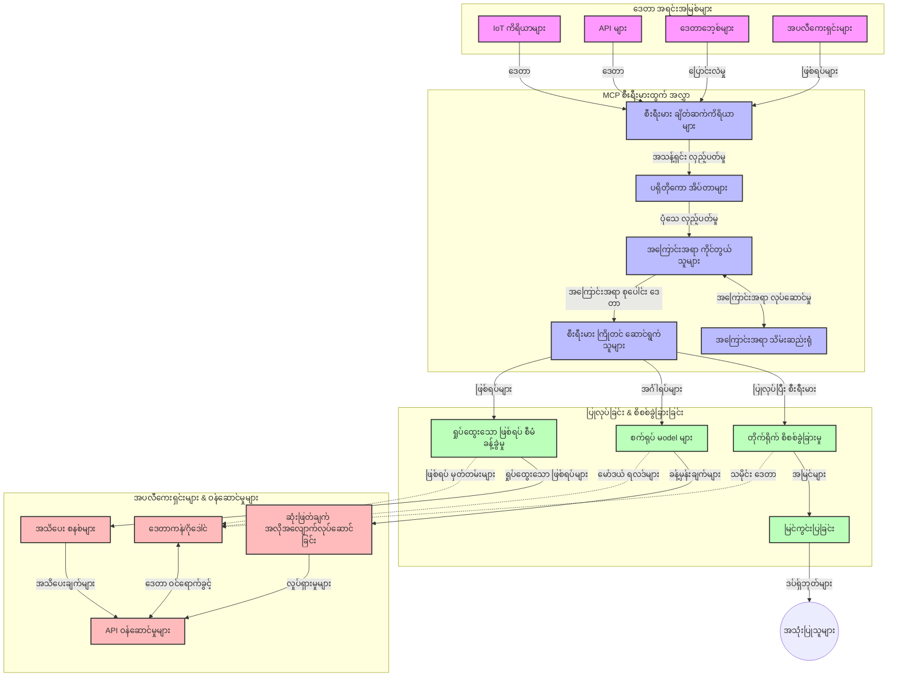

# Real-Time Data Streaming အတွက် Model Context Protocol

## ပြောကြားချက်

ယနေ့ခေတ်၏ ဒေတာအခြေပြု လောက၌၊ စီးပွားရေးလုပ်ငန်းများနှင့် လျင်မြန် စီမံချက်ချ ရေးအတွက် သတင်းအချက်အလက်များကို ချက်ချင်း ရယူရန် လိုအပ်သည်၊ ထိုကြောင့် real-time data streaming သည် မရှိမဖြစ် လိုအပ်လာသည်။ Model Context Protocol (MCP) သည် ဤ real-time streaming လုပ်ငန်းစဉ်များကို အဆင်ပြေပြီးစေပြီး ဒေတာကို ထိရောက်စွာ ပြုလုပ်ခြင်း၊ စနစ် အကျိုးသက်ရောက်မှု တိုးတက်စေရန်နှင့် context တိကျမှု ထိန်းသိမ်းမှုများကို အနည်းဆုံး အပိုင်းပိုင်း ကျဆင်းခြင်း မရှိစေဘဲ တိုးတက်ကောင်းမွန်အောင် ဆောင်ရွက်ပေးသည့် နည်းပညာ တစ်ရပ်ဖြစ်သည်။

ဒီမော်ဂျူးသည် MCP သည် AI မော်ဒယ်များ၊ streaming platforms နှင့် applications များအကြား context ကို စံသတ်မှတ်ချက်ဖြင့် စီမံခန့်ခွဲပုံကို ပံ့ပိုးပေးကာ real-time data streaming ကို ဘယ်လို ပြောင်းလဲတိုးတက်စေသည်ကို ဖော်ပြသည်။

## Real-Time Data Streaming အသိပညာအကြောင်း

Real-time data streaming သည် ဒေတာများကို ဆက်တိုက် ဖြန့်ဝေခြင်း၊ ျပုလုပ်ခြင်းနှင့် စုပေါင်း လေ့လာခြင်းကို ချက်ချင်းလုပ်ဆောင်နိုင်ရန် နည်းပညာ နယ်ပယ်ဖြစ်ပြီး၊ စနစ်များကို ပြောင်းလဲသည့် ဒေတာအသစ်များကို ချက်ချင်း အဖြေပြန်နိုင်စေသည်။ ရိုးရာ batch processing နည်းလမ်းသည် အတည်ပြုထားသော ဒေတာစုကို သုံးစွဲသော်လည်း streaming သည် ဆက်ရောက်လျက်ရှိသော ဒေတာများကို ချက်ချင်း ပြုလုပ်ခြင်းဖြင့် နည်းဗျူဟာကွဲ ပြောဆိုချက်များနှင့် လုပ်ဆောင်ချက်များကို နည်းပညာ အတိုင်းအတာနည်း ဖြစ်စေသည်။

### Real-Time Data Streaming ၏ အခြေခံ အယူအဆများ -

- **ဆက်တိုက် ဒေတာစီးဆင်းမှု**: တစ်ဖြည်းဖြည်း မပြီးဆုံးသော၊ ပွင့်လင်းကြားဖြတ်မှု မရှိသော အဖြစ်ဖြစ်မှုများ သို့မဟုတ် မှတ်တမ်းများကို ဆက်တိုက် ပြုလုပ်ခြင်း
- **နိမ့်ဆုံး နောက်ကျမှု ဖြေရှင်းမှု**: ဒေတာထုတ်လုပ်ခြင်းနှင့် ဖြန့်ဝေပေးခြင်း အကြား ဖြစ်ပေါ်ချိန်ကို အနည်းဆုံးလျှော့ချခြင်း
- **တိုးချဲ့နိုင်မှု**: streaming ဘာသာရပ်သည် ဒေတာ ပမာဏနှင့်မြန်နှုန်း ပြောင်းလဲမှုကို ကိုင်တွယ်နိုင်ဖို့ လိုအပ်သည်
- **ပြဿနာခံနိုင်မှု**: လုပ်ဆောင်ချက်မှားယွင်းမှုများကိုခံနိုင်ရည်ရှိစေကာ ချက်ချင်း ဒေတာလည်ပတ်မှု ချ်နိုင်သော စနစ်ဖြစ်စေရန်လို
- **အခြေအနေထိန်းသိမ်းထားမှု**: အရေးပါသော လေ့လာမှုအတွက် အခြေအနေကို တစ်စဉ်တစ်ခု ပေါ်တွင် ထိန်းသိမ်းထားရမည်။

### Model Context Protocol နှင့် Real-Time Streaming

Model Context Protocol (MCP) သည် real-time streaming ပတ်ဝန်းကျင်များတွင်အရေးကြီးသော ပြဿနာများကိုဖြေရှင်းပေးသည်-

1. **Contextual Continuity**: MCP သည် context ကို တရားဝင်အတိုင်း အချိုးချုပ်ထားခြင်းဖြင့် AI မော်ဒယ်များနှင့် ပြုလုပ်ထုတ်လုပ်ရေး nodes များအကြား သက်ဆိုင်ရာ သမိုင်းတရားနှင့် ပတ်ဝန်းကျင် context ကို ရရှိနိုင်စေသည်။
2. **ထိရောက်သော အခြေအနေစီမံခြင်း**: context ပေးပို့ခြင်းအတွက် စံသတ်မှတ်ခြင်းဖြင့် streaming pipeline တွင် state များကို ထိန်းသိမ်းခြင်း overhead ကို လျော့ချပေးသည်။
3. **သဟဇာတမှု**: MCP သည် အမျိုးမျိုးရှိသော streaming နည်းပညာများနှင့် AI မော်ဒယ်များအကြား context မျှဝေရေးတွင် တူညီသောဘာသာစကားကို ဖန်တီး၍ ပိုမိုတိုးတက်ပြီး ချဲ့ထွင်နိုင်သော ဇစ်လမ်းများ ဖြစ်လာစေသည်။
4. **Streaming အတွက် ပြုပြင်ပြီးသော Context**: MCP လက်တွေ့အသုံးပြုမှုများသည် real-time ဆုံးဖြတ်ချက်များအတွက် သက်ဆိုင်ရာ context အချက်များကို ဦးစားပေးထားနိုင်ပြီး စွမ်းဆောင်ရည်နှင့် တိကျမှုပေါင်းစပ်ပြီး တိုးတက်စေသည်။
5. **အဆင့်မြှင့် ပြုလုပ်မှု**: MCP ၏ သင့်တော်သော context စီမံခန့်ခွဲမှုဖြင့် streaming စနစ်များသည် ဒေတာမှလူ့အခြေအနေများနှင့် ပုံစံများပြောင်းလဲမှုအပေါ်တွင် ဆက်လက်ညီမျှစွာ ပြုပြင်မှု ပြုလုပ်နိုင်စေသည်။

IoT စက်လုံးများမှ စ က ပြီး ငွေကြေးအရောင်းအဝယ်စနစ်များထိ၊ MCP အပြည့်အစုံဖြင့် streaming နည်းပညာကို ပေါင်းစည်းခြင်းဖြင့် ပိုမိုထက်မြက်သော၊ context အသိပညာ နဲ့ပြည့်စုံသော လုပ်ဆောင်ချက်များကို လက်ရှိ ဖြစ်ရပ်များအတွက် အကြောင်းပြု၍ တုံ့ပြန်နိုင်စေသည်။

## သင်ယူစရာ ရည်ရွယ်ချက်များ

ဤ သင်ခန်းစာ အတွင်း သင်သည်-

- real-time data streaming ၏ အခြေခံအဆင့်နှင့် စိန်ခေါ်မှုများကို နားလည်နိုင်မည်
- Model Context Protocol (MCP) သည် real-time data streaming ကို မည်သို့ တိုးတက်စေသည်ဆိုတာ ရှင်းလင်း ပြောကြားနိုင်မည်
- Kafka နှင့် Pulsar ကဲ့သို့ နာမည်ကြီး framework များကို အသုံးပြု၍ MCP အခြေခံ streaming ဖြေရှင်းချက်များ တည်ဆောက်နိုင်မည်
- MCP အသုံးပြု၍ ချို့ယွင်းမှုကိုခံနိုင်ရည်ရှိပြီး၊ အမြန်နှုန်းမြင့် streaming architecture များကို ဒီဇိုင်းပြုပြင် နှင့် မြှင့်တင်နိုင်မည်
- MCP အယူအဆများကို IoT၊ ငွေကြေးကုန်သွယ်မှုနှင့် AI မောင်းနေသော ဒေတာခွဲခြမ်းစိတ်ဖြာမှု အတွက် အထောက်အကူပြုနိုင်မည်
- MCP အခြေပြု streaming နည်းပညာများ၏ အနာဂတ် သွင်ပြင်လက္ခဏာအသစ်များကို သုံးသပ်နိုင်မည်

### ဒီဖinition နှင့် အဓိပ္ပာယ်

Real-time data streaming သည် ဒေတာကို အနည်းဆုံး နောက်ကျမှုဖြင့် ဆက်တိုက်ထုတ်လုပ်၊ ပြုလုပ်ပြီး ပို့ဆောင်ပေးခြင်းဟု ဆိုနိုင်သည်။ batch processing ကဲ့သို့ အုပ်စုလိုက် စုဆောင်း၍ ပြုလုပ်ခြင်းမဟုတ်ဘဲ streaming သည် ပြေးပေါက်လာသည့် ဒေတာကို တစ်ချက်ချင်း အသုံးချနိုင်စေရန် ဖြစ်သည်။

Real-time data streaming ၏ အဓိက လက္ခဏာများမှာ-

- **နိမ့်သော နောက်ကျမှု**: 毫秒 (မီလီစက္ကန့်) မှ စက္ကန့်အတွင်း ဒေတာကို ချက်ချင်း လုပ်ဆောင်ခြင်း
- **ဆက်တိုက်ဒေတာစီးဆင်းမှု**: မတားဆီးသော ဒေတာများ လမ်းကြောင်းမှတဆင့် ထွက်လာခြင်း
- **ချက်ချင်း ပြုလုပ်ခြင်း**: ဒေတာရောက်ချိန်မှ မကြာခင်တွင် စစ်ဆေးခြင်း
- **ဖြစ်စဉ် အခြေပြု လုပ်ဆောင်ချက်**: ဖြစ်စဉ်အဖြစ်များအပေါ် အချက်အလက်ပြန်လည်တုံ့ပြန်ခြင်း

### ရိုးရာ Data Streaming ရှုပ်ထွေးမှုများ

ရိုးရာ streaming နည်းလမ်းများတွင် အောက်ပါ ကန့်သတ်ချက်များ ရှိသည်-

1. **Context ပျောက်ဆုံးခြင်း**: ဖြန့်ဝေထားသောစနစ်များအတွင်း context ထိန်းသိမ်းရာမှာ အခက်အခဲ
2. **တိုးချဲ့နိုင်မှု ပြဿနာများ**: ဒေတာ အမျိုးအစားနှင့် မြန်နှုန်းများမှာ အလွန်မတူညီရန်တွင် တိုးချဲ့ရန် ခက်ခဲမှု
3. **ဆက်သွယ်မှု ရှုပ်ထွေးမှု**: စနစ်ကွာဟထားမှုများကြား အတူတကွလုပ်ဆောင်ရာတွင် ခက်ခဲမှုများ
4. **နောက်ကျမှု စီမံခန့်ခွဲမှု**: throughput နှင့် ရက်ရှည် တုံ့ပြန်ချိန် စီမံရာတွင် ပြဿနာများ
5. **ဒေတာ စည်းကမ်းလိုက်နာမှုပုံစံ**: ဖြန့်ဝေသည့် streaming အတွင်း ဒေတာတိကျမှု နှင့် ပြည့်စုံမှုကို ထိန်းသိမ်းရန်

## Model Context Protocol (MCP) နားလည်ခြင်း

### MCP ဆိုတာဘာလဲ?

Model Context Protocol (MCP) သည် AI မော်ဒယ်များနှင့် applications များအကြား ထိရောက်စွာ ဆက်သွယ်ဆောင်ရွက်နိုင်ရန် စံသတ်မှတ်ထားသော ဆက်သွယ်ရေး protocol ဖြစ်သည်။ real-time data streaming ၏ လောက၌ MCP သည်-

- ဒေတာ pipeline ပိုင်းဆိုင်ရာ context ကို ထိန်းသိမ်းခြင်း
- ဒေတာလဲလှယ်ရေး အမျိုးအစားများကို စံသတ်မှတ်ခြင်း
- အချက်အလက် အများအပြား ပေးပို့မှုကို ထိရောက်စွာ ပြုပြင်ခြင်း
- မော်ဒယ်မှ မော်ဒယ်သို့ နှင့် မော်ဒယ်မှ application သို့ ဆက်သွယ်ရေး တိုးတက်စေရေး

အတိုင်း ဖွဲ့စည်းထားပါသည်။

### အခြေခံ အစိတ်အပိုင်းများနှင့် ဖွဲ့စည်းပုံ

Real-time streaming အတွက် MCP ဖွဲ့စည်းပုံတွင် အဓိကအစိတ်အပိုင်းများမှာ -

1. **Context Handlers**: streaming pipeline အသားပေး context အချက်အလက်များကို စီမံထိန်းသိမ်းသည်။
2. **Stream Processors**: context အသိပညာနဲ့ ညီကိုက်စွာ လက်ခံသည့် ဒေတာ စီးဆင်းမှုများကို ပြုလုပ်သည်။
3. **Protocol Adapters**: မတူညီသော streaming protocols များကို context ထိန်းသိမ်းကာ ပြောင်းလဲပေးသည်။
4. **Context Store**: context အချက်အလက်များကို ထိရောက်စွာ သိမ်းဆည်းထုတ်ယူသည်။
5. **Streaming Connectors**: Kafka, Pulsar, Kinesis စသည့် streaming platform များနှင့် ချိတ်ဆက်ပေးသည်။



### MCP သည် Real-Time Data ကို ဘယ်လိုတိုးတက်စေသလဲ

MCP သည် ရိုးရာ streaming challenges များကို အောက်ပါအတိုင်း ဖြေရှင်းပေးသည်-

- **Contextual Integrity**: ဒေတာအချက်များအတွင်း ဆက်နွယ်မှုများကို အပြည့်အဝ ထိန်းသိမ်းထားသည်။
- **ပြုပြင်စီးပွားမှုတိုးတက်မှု**: context ချိတ်ဆက်မှုအားဖြင့် ဒေတာလဲလှယ် သားလျော့နည်းစေသည်။
- **စံသတ်မှတ် API များ**: streaming component များအတွက် တိကျပြတ်သားသော API များ ပံ့ပိုးပေးသည်။
- **နောက်ကျမှုလျော့ချခြင်း**: context ချိတ်ဆက်မှုကို ထိရောက်စွာ ထိန်းသိမ်း၍ လုပ်ဆောင်ချက်နောက်ကျမှုကို လျော့ချသည်။
- **တိုးချဲ့နိုင်မှုတိုးတက်မှု**: context ထိန်းသိမ်းမှု ပြည့်တင်းစွာ ထိန်းသိမ်းကာ horizontal scaling ကို ပံ့ပိုးသည်။

## ပေါင်းစည်းခြင်းနှင့် အကောင်အထည်ဖော်ခြင်း

Real-time data streaming စနစ်များသည် စွမ်းဆောင်ရည်နှင့် context တိကျမှု ရှိခြင်းတို့ကို ထိန်းသိမ်းရန် ဂရုစိုက် ပြုလုပ်ထားသော ဖွဲ့စည်းပုံနှင့် အကောင်အထည်ဖော်မှု လိုအပ်ပါသည်။ Model Context Protocol သည် AI မော်ဒယ်များ ချိတ်ဆက်၍ streaming နည်းပညာဖြင့် ပိုမိုစဉ်ဆက်မပြတ်၊ context သိရှိသော ပြုလုပ်ချက်တွဲများ ရရှိစေရန် အဆင့်မြင့် စံသတ်မှတ်ချက် ဖြင့် ပံ့ပိုးပေးသည်။

### MCP ကို Streaming Architecture များတွင် ပေါင်းစည်းအသုံးပြုခြင်း အခြေခံအချက်များ

MCP ကို real-time streaming ပတ်ဝန်းကျင်၌ ထည့်သွင်းအသုံးပြုရာတွင် အဓိက ယူဆရမည့် ကိစ္စများမှာ-

1. **Context Serialization နှင့် ပို့ဆောင်ခြင်း**: MCP သည် context ဖြင့်ထည့်သွင်းထားသော ဒေတာ package များကို အဆင်ပြေ ညှိနှိုင်းထားသော serialization ဖော်မတ်အမျိုးမျိုးနှင့် ပို့ဆောင်သည်။

2. **Stateful Stream Processing**: MCP သည် processing nodes များအတွင်း သက်ဆိုင်ရာ context ကို ထိန်းသိမ်းဖို့ အဆင်ပြေခြင်းဖြင့် stateful processing ကို တိုးတက်စေသည်။ ယင်းသည် ဖြန့်ဝေထားသော streaming အင်ဖရာစနစ်များတွင် state များကို ထိန်းသိမ်းရန် အသုံးဝင်သည်။

3. **Event-Time နှင့် Processing-Time ကွာခြားမှု**: MCP သည် ကျင်းပချိန်နှင့် ဖြေရှင်းမှုချိန်တို့ကို သီးခြားစနစ်တကျ ကိုင်တွယ်နိုင်ရန် temporal context ကို ထည့်သွင်းပါသည်။

4. **Backpressure စီမံမှု**: context handling စနစ်တစ်ခုအဖြစ် MCP သည် streaming စနစ်များတွင် backpressure ကို စနစ်တကျ စီမံခန့်ခွဲရန် ပံ့ပိုးပေးသည်။

5. **Context Windowing နှင့် စုစည်းခြင်း**: MCP သည် temporal နှင့် relational context များ၏ ဖော်ပြချက်များအား ဖွဲ့စည်းပေးကာ event streams များအပေါ် ပိုမိုအသုံးဝင်သော aggregate လုပ်ခြင်းများ ပြုလုပ်နိုင်စေသည်။

6. **တိကျမှန်ကန်စွာတစ်ကြိမ်သာ လုပ်ဆောင်ခြင်း**: streaming စနစ်များအတွက် တစ်ကြိမ်တည်း semantics များလိုအပ်သောနေရာ တွင် MCP သည် processing metadata များကို မျှဝေပေးကာ distributed components များအတွက် အခြေအနေ စစ်ဆေးမှု ချက်တင်ပေးပါသည်။

MCP ကို streaming နည်းပညာအမျိုးမျိုးတွင် ထည့်သွင်းအသုံးပြုခြင်းဖြင့် custom integration ကုဒ်ရိုက်စရာ လိုအပ်ချက် လျှော့ချပြီး၊ ဒေတာစီးဆင်းမှုအတွင်း context ကို ဆက်လက် ထိန်းသိမ်းနိုင်စေရန် system ၏ စွမ်းအား တိုးတက်စေသည်။

### MCP ကို ဘယ်လို Streaming Framework များနှင့် ပေါင်းစည်းမလဲ

အောက်ပါ နမူနာများမှာ JSON-RPC အခြေခံ protocol နှင့် ထူးခြားသော ပို့ဆောင်မှုနည်းလမ်းများ အသုံးပြုထားသည့် MCP specification ကို လိုက်နာထားပါသည်။ ဒီကုဒ်များက streaming platforms များဖြစ်သော Kafka နှင့် Pulsar တို့တွင် MCP နှင့်ပေါင်းစည်းအသုံးပြုနိုင်ဖို့ custom transport များ ရေးဆွဲနည်း ပြသထားသည်။

ဒီနမူနာများသည် streaming ပြုလုပ်ခြင်းအတွင်း MCP ၏ context သိရှိမှုကို သိသိသာသာ ထိန်းသိမ်းထားပြီး real-time data process လုပ်နိုင်ရန် streaming platforms များကို MCP နှင့် ပေါင်းစည်းနိုင်မှုကို ပြထားသည်။ ယခုနည်းလမ်းသည် 2025 ခုနှစ် ဇွန်လအချိန်အတိုင်း MCP specification အသစ်နှင့် ကိုက်ညီမှုရှိပါသည်။

MCP ကို နာမည်ကြီး streaming framework များဖြစ်သော -

#### Apache Kafka ပေါင်းစည်းခြင်း

```python
import asyncio
import json
from typing import Dict, Any, Optional
from confluent_kafka import Consumer, Producer, KafkaError
from mcp.client import Client, ClientCapabilities
from mcp.core.message import JsonRpcMessage
from mcp.core.transports import Transport

# MCP နှင့် Kafka ကိုဆက်သွယ်ပေးသော ပုံစံထုတ်ပို့မှုအတန်း
class KafkaMCPTransport(Transport):
    def __init__(self, bootstrap_servers: str, input_topic: str, output_topic: str):
        self.bootstrap_servers = bootstrap_servers
        self.input_topic = input_topic
        self.output_topic = output_topic
        self.producer = Producer({'bootstrap.servers': bootstrap_servers})
        self.consumer = Consumer({
            'bootstrap.servers': bootstrap_servers,
            'group.id': 'mcp-client-group',
            'auto.offset.reset': 'earliest'
        })
        self.message_queue = asyncio.Queue()
        self.running = False
        self.consumer_task = None
        
    async def connect(self):
        """Connect to Kafka and start consuming messages"""
        self.consumer.subscribe([self.input_topic])
        self.running = True
        self.consumer_task = asyncio.create_task(self._consume_messages())
        return self
        
    async def _consume_messages(self):
        """Background task to consume messages from Kafka and queue them for processing"""
        while self.running:
            try:
                msg = self.consumer.poll(1.0)
                if msg is None:
                    await asyncio.sleep(0.1)
                    continue
                
                if msg.error():
                    if msg.error().code() == KafkaError._PARTITION_EOF:
                        continue
                    print(f"Consumer error: {msg.error()}")
                    continue
                
                # မက်ဆေ့ခ်ျတန်ဖိုးကို JSON-RPC အဖြစ်ခွဲဖြတ်ပါ
                try:
                    message_str = msg.value().decode('utf-8')
                    message_data = json.loads(message_str)
                    mcp_message = JsonRpcMessage.from_dict(message_data)
                    await self.message_queue.put(mcp_message)
                except Exception as e:
                    print(f"Error parsing message: {e}")
            except Exception as e:
                print(f"Error in consumer loop: {e}")
                await asyncio.sleep(1)
    
    async def read(self) -> Optional[JsonRpcMessage]:
        """Read the next message from the queue"""
        try:
            message = await self.message_queue.get()
            return message
        except Exception as e:
            print(f"Error reading message: {e}")
            return None
    
    async def write(self, message: JsonRpcMessage) -> None:
        """Write a message to the Kafka output topic"""
        try:
            message_json = json.dumps(message.to_dict())
            self.producer.produce(
                self.output_topic,
                message_json.encode('utf-8'),
                callback=self._delivery_report
            )
            self.producer.poll(0)  # ပြန်လည်ခေါ်ဆောင်မှုများကို လှုံ့ဆော်ပါ
        except Exception as e:
            print(f"Error writing message: {e}")
    
    def _delivery_report(self, err, msg):
        """Kafka producer delivery callback"""
        if err is not None:
            print(f'Message delivery failed: {err}')
        else:
            print(f'Message delivered to {msg.topic()} [{msg.partition()}]')
    
    async def close(self) -> None:
        """Close the transport"""
        self.running = False
        if self.consumer_task:
            self.consumer_task.cancel()
            try:
                await self.consumer_task
            except asyncio.CancelledError:
                pass
        self.consumer.close()
        self.producer.flush()

# Kafka MCP ပုံမှန်ထုတ်ပို့မှုအသုံးပြုမှု ဥပမာ
async def kafka_mcp_example():
    # Kafka ထုတ်ပို့မှုဖြင့် MCP ဖောက်သည် ဖန်တီးပါ
    client = Client(
        {"name": "kafka-mcp-client", "version": "1.0.0"},
        ClientCapabilities({})
    )
    
    # Kafka ထုတ်ပို့မှုကို ဖန်တီးပြီး ချိတ်ဆက်ပါ
    transport = KafkaMCPTransport(
        bootstrap_servers="localhost:9092",
        input_topic="mcp-responses",
        output_topic="mcp-requests"
    )
    
    await client.connect(transport)
    
    try:
        # MCP အစည်းအဝေးကို စတင်ပါ
        await client.initialize()
        
        # MCP ဖြင့် ကိရိယာတစ်ခု စစ်ဆေးသုံးသပ်မှု ဥပမာ
        response = await client.execute_tool(
            "process_data",
            {
                "data": "sample data",
                "metadata": {
                    "source": "sensor-1",
                    "timestamp": "2025-06-12T10:30:00Z"
                }
            }
        )
        
        print(f"Tool execution response: {response}")
        
        # သန့်ရှင်းသော ပိတ်သိမ်းမှု
        await client.shutdown()
    finally:
        await transport.close()

# ဥပမာကို ပြေးပါ
if __name__ == "__main__":
    asyncio.run(kafka_mcp_example())
```

#### Apache Pulsar အကောင်အထည်ဖော်ခြင်း

```python
import asyncio
import json
import pulsar
from typing import Dict, Any, Optional
from mcp.core.message import JsonRpcMessage
from mcp.core.transports import Transport
from mcp.server import Server, ServerOptions
from mcp.server.tools import Tool, ToolExecutionContext, ToolMetadata

# Pulsar ကို အသုံးပြုတဲ့ ကိုယ်ပိုင် MCP သယ်ယူပို့ဆောင်မှုကို ဖန်တီးပါ
class PulsarMCPTransport(Transport):
    def __init__(self, service_url: str, request_topic: str, response_topic: str):
        self.service_url = service_url
        self.request_topic = request_topic
        self.response_topic = response_topic
        self.client = pulsar.Client(service_url)
        self.producer = self.client.create_producer(response_topic)
        self.consumer = self.client.subscribe(
            request_topic,
            "mcp-server-subscription",
            consumer_type=pulsar.ConsumerType.Shared
        )
        self.message_queue = asyncio.Queue()
        self.running = False
        self.consumer_task = None
    
    async def connect(self):
        """Connect to Pulsar and start consuming messages"""
        self.running = True
        self.consumer_task = asyncio.create_task(self._consume_messages())
        return self
    
    async def _consume_messages(self):
        """Background task to consume messages from Pulsar and queue them for processing"""
        while self.running:
            try:
                # ကြာချိန်ကုန်ဆုံးမှုဖြင့် ပိတ်မထားသော လက်ခံမှု
                msg = self.consumer.receive(timeout_millis=500)
                
                # မက်ဆေ့ခ်ျကို စီမံပါ
                try:
                    message_str = msg.data().decode('utf-8')
                    message_data = json.loads(message_str)
                    mcp_message = JsonRpcMessage.from_dict(message_data)
                    await self.message_queue.put(mcp_message)
                    
                    # မက်ဆေ့ခ်ျကို အတည်ပြုပါ
                    self.consumer.acknowledge(msg)
                except Exception as e:
                    print(f"Error processing message: {e}")
                    # အမှားရှိခဲ့ရင် မအတည်ပြုမှု ပြုလုပ်ပါ
                    self.consumer.negative_acknowledge(msg)
            except Exception as e:
                # ကြာချိန်ကုန်ဆုံးမှု သို့မဟုတ် အခြား မမှန်ကန်မှုများကို ကိုင်တွယ်ပါ
                await asyncio.sleep(0.1)
    
    async def read(self) -> Optional[JsonRpcMessage]:
        """Read the next message from the queue"""
        try:
            message = await self.message_queue.get()
            return message
        except Exception as e:
            print(f"Error reading message: {e}")
            return None
    
    async def write(self, message: JsonRpcMessage) -> None:
        """Write a message to the Pulsar output topic"""
        try:
            message_json = json.dumps(message.to_dict())
            self.producer.send(message_json.encode('utf-8'))
        except Exception as e:
            print(f"Error writing message: {e}")
    
    async def close(self) -> None:
        """Close the transport"""
        self.running = False
        if self.consumer_task:
            self.consumer_task.cancel()
            try:
                await self.consumer_task
            except asyncio.CancelledError:
                pass
        self.consumer.close()
        self.producer.close()
        self.client.close()

# စတရီးမယ် ဒေတာကို ကိုင်တွယ်သည့် နမူနာ MCP ကိရိယာကို သတ်မှတ်ပါ
@Tool(
    name="process_streaming_data",
    description="Process streaming data with context preservation",
    metadata=ToolMetadata(
        required_capabilities=["streaming"]
    )
)
async def process_streaming_data(
    ctx: ToolExecutionContext,
    data: str,
    source: str,
    priority: str = "medium"
) -> Dict[str, Any]:
    """
    Process streaming data while preserving context
    
    Args:
        ctx: Tool execution context
        data: The data to process
        source: The source of the data
        priority: Priority level (low, medium, high)
        
    Returns:
        Dict containing processed results and context information
    """
    # MCP အခြေအနေကို အသုံးပြုသော နမူနာ စီမံခန့်ခွဲမှု
    print(f"Processing data from {source} with priority {priority}")
    
    # MCP မှ နည်းနည်းဆက်သွယ်မှုအခြေအနေကို ရယူပါ
    conversation_id = ctx.conversation_id if hasattr(ctx, 'conversation_id') else "unknown"
    
    # တိုးတက်သော အခြေအနေဖြင့် ရလဒ်များကို ပြန်လည်ပေးပါ
    return {
        "processed_data": f"Processed: {data}",
        "context": {
            "conversation_id": conversation_id,
            "source": source,
            "priority": priority,
            "processing_timestamp": ctx.get_current_time_iso()
        }
    }

# Pulsar သယ်ယူပို့ဆောင်မှုဖြင့် MCP ဆာဗာကို သုံးသပ်ဖော်ပြချက်
async def run_mcp_server_with_pulsar():
    # MCP ဆာဗာ ဖန်တီးပါ
    server = Server(
        {"name": "pulsar-mcp-server", "version": "1.0.0"},
        ServerOptions(
            capabilities={"streaming": True}
        )
    )
    
    # ကျွန်ုပ်တို့၏ ကိရိယာကို မှတ်ပုံတင်ပါ
    server.register_tool(process_streaming_data)
    
    # Pulsar သယ်ယူပို့ဆောင်မှုကို ဖန်တီးပြီး ဆက်သွယ်ပါ
    transport = PulsarMCPTransport(
        service_url="pulsar://localhost:6650",
        request_topic="mcp-requests",
        response_topic="mcp-responses"
    )
    
    try:
        # Pulsar သယ်ယူပို့ဆောင်မှုဖြင့် ဆာဗာကို စတင်ပါ
        await server.run(transport)
    finally:
        await transport.close()

# ဆာဗာကို လည်ပတ်ပါ
if __name__ == "__main__":
    asyncio.run(run_mcp_server_with_pulsar())
```

### တင်သွင်းမှုအတွက် အကောင်းဆုံးနည်းလမ်းများ

real-time streaming မှာ MCP အသုံးပြုရာတွင် -

1. **Fault Tolerance အတွက် ဒီဇိုင်းပြုလုပ်ခြင်း**:
   - မှားယွင်းမှုကို ညီညာစွာ စီမံရန်
   - မအောင်မြင်သော စာတိုများအတွက် dead-letter queues အသုံးပြုရန်
   - idempotent processor များဒီဇိုင်း ထားရန်

2. **စွမ်းဆောင်ရည် တိုးတက်စေရန် ထိရောက်အောင် တည်ဆောက်ခြင်း**:
   - buffer size များသင့်တော်စွာ သတ်မှတ်ခြင်း
   - batch လုပ်ငန်းစဉ်များ အသုံးပြုခြင်း
   - backpressure mechanism များတပ်ဆင်ခြင်း

3. **စနစ်ကို ကြည့်ရှု၊ စောင့်ကြည့်ခြင်း**:
   - stream processing metrics များ အတည်ပြုခြင်း
   - context ပေးပို့မှု အခြေအနေများ ကြည့်ရှုခြင်း
   - မှားယွင်းမှုများအတွက် အချက်ပေးစနစ် တပ်ဆင်ခြင်း

4. **သင့်စနစ်ကို လုံခြုံမှု အတွက် စောင့်ကြည့်ခြင်း**:
   - အချက်အလက်ဒေတာကို အချက်လုံခြုံစွာ သို့ ပါကာရာကြည့်ခြင်း
   - authentication နှင့် authorization ကို အသုံးပြုခြင်း
   - သင့်လျော်သော access control များ သတ်မှတ်ခြင်း

### MCP ကို IoT နှင့် Edge Computing တွင် အသုံးပြုခြင်း

MCP သည် IoT စီးရီး streaming ကို အောက်ပါအတိုင်း တိုးတက်စေသည်-

- စက်ပစ္စည်းများ၏ context ကို processing pipeline အတွင်း ထိန်းသိမ်းခြင်း
- သက်ဆိုင်သော edge-to-cloud ဒေတာထုတ်ဝေမှုကို ထိရောက်စွာ ကူညီခြင်း
- IoT ဒေတာ streams တွင် real-time သုံးသပ်သုံးတဲဖြစ်စေခြင်း
- context ဖြင့် device-to-device ဆက်သွယ်ချက်ကို လုပ်ဆောင်နိုင်ခြင်း

ဥပမာ - Smart City Sensor Networks
```
Sensors → Edge Gateways → MCP Stream Processors → Real-time Analytics → Automated Responses
```

### ငွေကြေးလုပ်ငန်းများနှင့် အမြန်သွားလာမှု မိတ်ဆက်ခြင်း

MCP သည် ငွေကြေး ဒေတာ streaming တွင် အရေးကြီးသော အကျိုးများကို ပေးဆောင်ပေးသည်-

- အမြန်ဆုံးဆုံးဖြတ်ချက်များအတွက် Ultra-low latency ပြုလုပ်ခြင်း
- လုပ်ငန်းဆောင်ရွက်မှု အတွင်း transaction context ကို ထိန်းသိမ်းခြင်း
- context သိရှိမှုဖြင့် ပြုလုပ်သော ဖြစ်စဉ်များကို ပြုလုပ်ခြင်း
- ဖြန့်ဝေထားသော စနစ်များအတွင်း ဒေတာတိကျမှုကို သေချာအောင် စောင့်ရှောက်ပေးခြင်း

### AI တို့ရဲ့ ဒေတာ ခွဲခြမ်းစိတ်ဖြာမှုတိုးတက်စေခြင်း

MCP သည် streaming analytics နယ်ပယ်တွင် အသစ်သော အခွင့်အလမ်းများ ဖန်တီးပေးသည်-

- real-time မှတဆင့် မော်ဒယ် လေ့လာမှုနှင့် inference ဆောင်ရွက်မှု
- streaming ဒေတာမှ ဆက်တိုက် သင်ယူမှု
- context သိရှိမှုဖြင့် feature extraction
- Multi-model inference pipelines တွင် context ကို ထိန်းသိမ်းခြင်း

## အနာဂတ် သွင်ပြင်လက္ခဏာများနှင့် နည်းပညာ ပြောင်းလဲမှုများ

### Real-Time ပတ်ဝန်းကျင်အတွင်း MCP ၏ အဆင့်တက်မှု

မကြာခင်သို့ MCP ပြောင်းလဲမှုများ:

- **Quantum Computing ပေါင်းစည်းမှု**: quantum နည်းပညာ ဖြင့် streaming စနစ်များအတွက် ကြိုတင်အဆင်ပြေအောင် ပြင်ဆင်ခြင်း
- **Edge-Native Processing**: Edge စက်ပစ္စည်းများပေါ်တွင် context အသိပညာ ပြင်းထန်စွာ ပြုလုပ်ခြင်း
- **Autonomous Stream Management**: streaming pipelines ကို ကျင့်သုံးသူ အလိုက် မိမိကိုယ်တိုင်တိုးတက်နိုင်သော စနစ်များ
- **Federated Streaming**: ပုဂ္ဂိုလ်ရေး ကာကွယ်မှု ထိန်းသိမ်းထားသောဖြန့်ဝေ စနစ်

### နည်းပညာတိုးတက်မှု ရှေ့ဆက်လမ်း

MCP streaming ၏ အနာဂတ်ကို အကွောငျးသုံးစွဲမည့် နည်းပညာများ

1. **AI-optimized streaming protocol များ**: AI အလုပ်များအတွက် အထူးပြု protocol များ
2. **Neuromorphic Computing ပေါင်းစည်းမှု**: မိသားစုအတုကို အခြေခံပြီး stream သုံး စနစ်
3. **Serverless Streaming**: ပိုမိုတိုးချဲ့နိုင်ပြီး infrastructure မလိုအပ်သော streaming
4. **Distributed Context Stores**: ကမ္ဘာပေါ် အစိတ်အပိုင်းခွဲထားသော်လည်း context consistency မြင့်မားမှု

## လက်တွေ့လေ့ကျင့်ခန်းများ

### လေ့ကျင့်ခန်း ၁: မူလ MCP Streaming Pipeline တည်ဆောက်ခြင်း

ဤလေ့ကျင့်ခန်းတွင် -

- MCP streaming ပတ်ဝန်းကျင် အခြေခံ ပြင်ဆင်နည်း
- stream processing အတွက် context handlers ဖန်တီးနည်း
- context ကို ထိန်းသိမ်းမှုပြုလုပ်နိုင်မှု စမ်းသပ်နှင့် အတည်ပြုခြင်း

### လေ့ကျင့်ခန်း ၂: Real-Time Analytics Dashboard တည်ဆောက်ခြင်း

ပြည့်စုံသော application တစ်ခု ဖန်တီးရန် -

- MCP အသုံးပြု၍ streaming data များကို ဝင်ရောက်ရယူခြင်း
- context ကို ထိန်းသိမ်းထား၍ stream များ ပိုမိုတိကျစွာ ပြုလုပ်ခြင်း
- လက္ရှိအချိန် သုံးရန် visualizations

### လေ့ကျင့်ခန်း ၃: MCP နှင့် တရားဝင် ဖြစ်စဉ်အစီအစဉ် ပြုလုပ်ခြင်း

တိုးတက်သော လေ့ကျင့်ခန်း-

- stream များရှိ pattern ဖော်ထုတ်ခြင်း
- streams များအကြား context တစ်ခုတည်း မှတ်တမ်းသားအဖြစ် ဆက်စပ်မှု
- ရှင်းလင်းစွာ context ထိန်းသိမ်းပြီး ဖြစ်စဉ်များကို ပေးပို့စေခြင်း

## အပိုဆောင်း အရင်းအမြစ်များ

- [Model Context Protocol Specification](https://modelcontextprotocol.io) - MCP ၏ တရားဝင် စံနှင့် စာတမ်းများ
- [Apache Kafka Documentation](https://kafka.apache.org/documentation/) - Kafka နဲ့ streaming ပြုလုပ်ခြင်းသင်ခန်းစာများ
- [Apache Pulsar](https://pulsar.apache.org/) - ပေါင်းစည်း messaging နှင့် streaming ပလက်ဖောင်း
- [Streaming Systems: The What, Where, When, and How of Large-Scale Data Processing](https://www.oreilly.com/library/view/streaming-systems/9781491983867/) - streaming architecture အကြောင်း စာအုပ်လုံး
- [Microsoft Azure Event Hubs](https://learn.microsoft.com/azure/event-hubs/event-hubs-about) - ကိုင်တွယ်ထားပြီးသော event streaming ဝန်ဆောင်မှု
- [MLflow Documentation](https://mlflow.org/docs/latest/index.html) - ML မော်ဒယ် စနစ်သုံး tracking နှင့် deploy ဖော်ပြ
- [Real-Time Analytics with Apache Storm](https://storm.apache.org/releases/current/index.html) - real-time တွက်ချက်ခြင်း framework 
- [Flink ML](https://nightlies.apache.org/flink/flink-ml-docs-master/) - Apache Flink အတွက် machine learning စုစုဝေးမှု
- [LangChain Documentation](https://python.langchain.com/docs/get_started/introduction) - LLMs ဖြင့် application ဖန်တီးခြင်း

## သင်ယူရလဒ်များ

ဤမော်ဂျူးပြီးဆုံးသည့်အချိန်တွင် -

- real-time data streaming အခြေခံ အစိတ်အပိုင်းများနှင့် စိန်ခေါ်မှုများကို နားလည်အောင် ရရှိမည်
- Model Context Protocol (MCP) သည် real-time data streaming ကို မည်သို့ တိုးတက်စေသည်ကို ဖေါ်ပြနိုင်မည်
- MCP ကို Kafka နှင့် Pulsar ကဲ့သို့ နာမည်ကြီး frameworks နှင့် ပေါင်းစပ်အသုံးပြုနည်း ကျွမ်းကျင်သွားမည်
- MCP အသုံးပြု၍ ချို့ယွင်းမှုခံနိုင်ရည်မြင့်ပြီး စွမ်းဆောင်ရည်မြင့် streaming architecture များဒီဇိုင်းပြုလုပ်ကာ တပ်ဆင်နိုင်မည်
- MCP အယူအဆများကို IoT၊ ငွေကြေးကုန်သွယ်ရေးနှင့် AI analytics စသည့် လုပ်ငန်းအကွက်များတွင် အသုံးချနိုင်မည်
- MCP အခြေပြု streaming နည်းပညာများ၏ လူကြိုက်များနေသော အနာဂတ် ပြောင်းလဲမှုများနှင့် ခေတ်မီ ဖွံ့ဖြိုးတိုးတက်မှုများကို သုံးသပ်နိုင်မည်

## နောက်အဆင့်

- [5.11 Realtime Search](../mcp-realtimesearch/README.md)

---

<!-- CO-OP TRANSLATOR DISCLAIMER START -->
**ပြောကြားချက်**
ဤစာတမ်းကို AI ဘာသာပြန်ဝန်ဆောင်မှု [Co-op Translator](https://github.com/Azure/co-op-translator) အသုံးပြု၍ ဘာသာပြန်ထားပါသည်။ ကျွန်ုပ်တို့သည် တိကျမှန်ကန်မှုအတွက် ကြိုးပမ်းနေသော်လည်း၊ စက်ကိရိယာဘာသာပြန်ခြင်းများတွင် အမှားများ သို့မဟုတ် မှားယွင်းချက်များ ပါဝင်နိုင်ကြောင်း သတိပြုပါရန် လိုအပ်ပါသည်။ မူလစာတမ်းကို မူရင်းဘာသာဖြင့်သာ ယုံကြည်စိတ်ချရသော အချက်အလက်အဖြစ် သတ်မှတ်သင့်သည်။ အရေးကြီးသည့် သတင်းအချက်အလက်များအတွက် ပရော်ဖက်ရှင်နယ် လူသားဘာသာပြန်သူဝန်ဆောင်မှုကို အကြံပြုပါသည်။ ဤဘာသာပြန်ချက်ကို အသုံးပြုခြင်းမှ ဖြစ်ပေါ်လာသော နားလည်မှုကွာခြားမှုများ သို့မဟုတ် မမှန်ကန်သော အသုံးပြုမှုများအတွက် ကျွန်ုပ်တို့ တာဝန်မခံပါ။
<!-- CO-OP TRANSLATOR DISCLAIMER END -->