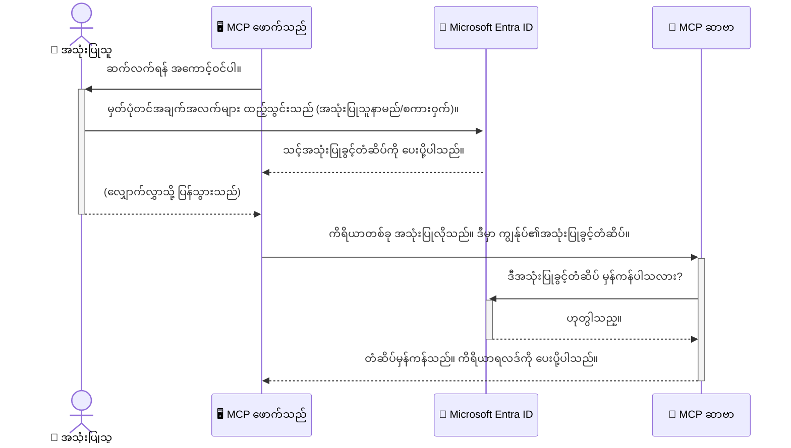

# AI လုပ်ငန်းစဉ်များကိုလုံခြုံစေခြင်း။ Model Context Protocol ဆာဗာများအတွက် Entra ID အတည်ပြုရန်

## နိဒါန်း
သင့် Model Context Protocol (MCP) ဆာဗာကို လုံခြုံစေရန်သည်၊ သင့်အိမ်၏ရှေ့တံခါးကို သော့ကြိုးလှုပ်ထားခြင်းနှင့် အလားတူ အရေးကြီးပါသည်။ MCP ဆာဗာကို ဖွင့်ထားခြင်းသည် သင့်ကိရိယာများနှင့် ဒေတာများကို မမျှတသည့် လက်လှမ်းမရသူများမှ ဝင်ရောက်နိုင်မှုရှိစေပြီး လုံခြုံရေးပြတ်တောက်မှုများ ဖြစ်ပေါ်စေနိုင်သည်။ Microsoft Entra ID သည် တောင့်တင်းကြံ့ခိုင်သော ကမ္ဘာအနှံ့တစ်ဆက်တည်း မ်ားသော ဆိုက်ဘာလုံခြုံရေး၊ အသုံးပြုခွင့်စီမံခန့်ခွဲမှုဖြေရှင်းချက်ဖြစ်ပြီး၊ တရားဝင်အသုံးပြုသူများသာ MCP ဆာဗာနှင့် ဆက်သွယ်နိုင်ရန် အကူအညီပေးသည်။ ဤအခန်းတွင် သင်သည် Entra ID အတည်ပြုမှုကို အသုံးပြု၍ သင့် AI လုပ်ငန်းစဉ်များကို မည်သို လုံခြုံစေမည်ကို သင်ယူမည်ဖြစ်သည်။

## သင်ယူရမည့် ရည်မှန်းချက်များ
ဤအပိုင်းအဆုံးသတ်အထိ သင်သည်:

- MCP ဆာဗာများ လုံခြုံစေရေးအရေးပါမှုကို နားလည်နိုင်မည်။
- Microsoft Entra ID နှင့် OAuth 2.0 အတည်ပြုမှု အခြေခံများကို ရှင်းပြနိုင်မည်။
- အများပြည်သူ client နှင့် လျှို့ဝှက် client များအကြား ကွာခြားချက်ကို သိရှိနိုင်မည်။
- ဒေသတွင်း (အများပြည်သူ client) နှင့် ဝေးလံသော (လျှို့ဝှက် client) MCP ဆာဗာအခြေအနေများတွင် Entra ID အတည်ပြုမှုကို လက်တွေ့အသုံးချနိုင်မည်။
- AI လုပ်ငန်းစဉ်များတည်ဆောက်စဉ် လုံခြုံရေးအကောင်းဆုံးလေ့ကျင့်မှုများကို လိုက်နာနိုင်မည်။

## လုံခြုံရေးနှင့် MCP

သင်၏အိမ်ရှေ့တံခါးကို မသော့ကြိုးလှုပ်လိုက်သလို၊ သင့် MCP ဆာဗာကို မည်သူမဆို ဝင်ရောက်နိုင်ရန် ဖွင့်ထားသင့်သလိုမဟုတ်ပါ။ AI လုပ်ငန်းစဉ်များကို လုံခြုံစေခြင်းသည် တည်ငြိမ်ခိုင်မြဲ၍ ယုံကြည်စိတ်ချရသော၊ လုံခြုံသော အက်ပလီကေးရှင်းများ ဖန်တီးရန် အရေးကြီးပါသည်။ ဤအခန်းတွင် Microsoft Entra ID ကို အသုံးပြု၍ MCP ဆာဗာများကို လုံခြုံစေခြင်းကို မိတ်ဆက်ပေးမည်ဖြစ်သည်၊ ဤပုံစံဖြင့် တရားဝင်အသုံးပြုသူများနှင့် အက်ပလီကေးရှင်းများသာ သင့်ကိရိယာများ နှင့် ဒေတာများနှင့် ပေါင်းသင်းဆက်ဆံနိုင်မည် ဖြစ်ပါသည်။

## MCP ဆာဗာများအတွက် လုံခြုံရေးအရေးကြီးမှု

သင်၏ MCP ဆာဗာတွင် အီးမေးလ်ပို့ခြင်း သို့မဟုတ် ဖောက်သည်ဒေတာဘေ့စ်အား ဝင်ရောက်ကြည့်ရှုနိုင်သည့် ကိရိယာတစ်ခု ရှိသည့်အခါ စဉ်းစားပါ။ ထိုဆာဗာကို မလုံခြုံလျှင် မည်သူမဆို ထိုကိရိယာကို အသုံးပြုနိုင်ကာ၊ မမှန်ကန်သော ဒေတာဝင်ရောက်ခြင်း၊ စပမ်၊ သို့မဟုတ် အခြား မကောင်းမွန်သော လှုပ်ရှားမှုများ ဖြစ်ပေါ်စေနိုင်သည်။

အတည်ပြုမှုကို အသုံးပြုခြင်းဖြင့် သင်သည် ဆာဗာသို့ လာသော တောင်းဆိုမှုအားလုံးကို စစ်မှန်သော အသုံးပြုသူ သို့မဟုတ် အက်ပလီကေးရှင်းမှ ဖြစ်ကြောင်း အတည်ပြု ပြီး ထိုတောင်းဆိုမှုကို လုံခြုံစေသည်။ ၎င်းသည် သင့် AI လုပ်ငန်းစဉ်များကို လုံခြုံစေရာတွင် ပထမဆုံးနှင့် အရေးကြီးဆုံး နည်းလမ်းဖြစ်သည်။

## Microsoft Entra ID ကို နားလည်ခြင်း

[**Microsoft Entra ID**](https://adoption.microsoft.com/microsoft-security/entra/) သည် ကမ္ဘာအနှံ့တစ်ဆက်တည်း အသုံးပြုမှုရှိသော တမူထူးခြားသော အသုံးပြုသူဖော်ထုတ်ခြင်းနှင့် လက်ခုပ်ခွင့်စီမံခန့်ခွဲမှု ဝန်ဆောင်မှုဖြစ်သည်။ ၎င်းကို သင့်အက်ပလီကေးရှင်းများအတွက် အာကာသလုံခြုံရေး မိလ္လာမင်းတစ်ယောက် အဖြစ်စဉ်းစားနိုင်သည်။ အသုံးပြုသူများ၏ ကိုယ်ရေးအချက်အလက်များကို အတည်ပြုခြင်း (Authentication) နှင့် ဘာများဆောင်ရွက်ခွင့်ရှိသည်ကို ဆုံးဖြတ်ခြင်း (Authorization) ကို ကျပန်းကြပ်စွာ စီမံခန့်ခွဲပေးသည်။

Entra ID ကို အသုံးပြုခြင်းဖြင့် သင့်အနေနှင့် -

- အသုံးပြုသူများအား လုံခြုံသော စစ်မှန်မှုဖြင့် ဝင်ရောက်ခွင့်ပြုနိုင်သည်။
- API များနှင့် ဝန်ဆောင်မှုများကို ကာကွယ်ထားသည်။
- အလယ်စင်တစ်နေရာမှ လက်ခုပ်ခွင့်မူဝါဒများကို စီမံခန့်ခွဲနိုင်သည်။

MCP ဆာဗာများအတွက် Entra ID သည် အားခံရသော သာမက ယုံကြည်စိတ်ချရသော ဖြေရှင်းချက်ဖြစ်ပြီး သင့်ဆာဗာ၏ လုပ်ဆောင်ချက်များကို မည်သူအသုံးပြုနိုင်မည်ဆိုတာကို စီမံခန့်ခွဲပေးသည်။

---

## Magic ကို နားလည်ခြင်း။ Entra ID အတည်ပြုမှု မည်သို့ လုပ်ဆောင်သနည်း

Entra ID သည် **OAuth 2.0** ကဲ့သို့သော ပွင့်လင်းစံပြများကို အသုံးပြု၍ အတည်ပြုမှုကို စီမံခန့်ခွဲသည်။ အသေးစိတ်သည် ပြင်းပြင်းထန်ထန်ဖြစ်နိုင်သော်လည်း အဓိကအယူအဆကို နားလည်ရန် ပုံပြင်တစ်ခုပြုရန်လိုအပ်သည်။

### OAuth 2.0 အကြောင်း နွေးထွေးသော မိတ်ဆက်: Valet Key

OAuth 2.0 ကို သင့်ကားအတွက် ကားပါကင်ဝန်ဆောင်မှုတစ်ခုအဖြစ် စဉ်းစားပါ။ သင်စားဆိုင်တစ်ခုသို့ ရောက်သောအခါ ကျွန်ုပ်သည် များစွာထိန်းသိမ်းထားသည့် master key ကိုကားပါကင်ဝန်ထမ်းထံမပေးပါ။ ၎င်း၏ အစား၊ မီးပိတ်နှင့် တံခါးပိတ်နိုင်သော်လည်း ကားတွင်းဂလိုဗ်ကာပ်မင့်တံခါးများ မဖွင့်နိုင်သော **valet key** ကို ပေးပါသည်။

ဤ နမူနာတွင် -

- **သင်သည်** သည် **အသုံးပြုသူဖြစ်သည်**။
- **သင့်ကားသည်** သည် စတင်ထားသည့် MCP ဆာဗာဖြစ်ပြီး မတူညီသော ကိရိယာများနှင့် ဒေတာများ ပါရှိသည်။
- **Valet** သည် **Microsoft Entra ID** ဖြစ်သည်။
- **ကားပါကင်ဝန်ထမ်း** သည် MCP Client (ဆာဗာသို့ ဝင်ရောက်ရန် ကြိုးစားနေသော အက်ပလီကေးရှင်း) ဖြစ်သည်။
- **valet key** သည် **Access Token** ဖြစ်သည်။

Access token သည် MCP client သည် သင့် သ‌ရုပ်မှ လက်မှတ်ထိုးပြီးနောက် Entra ID မှ ရရှိသော ကာကွယ်ရေးထားသော စာသားတန်းဖြစ်သည်။ client သည် ဤ token ကို MCP ဆာဗာအား တောင်းဆိုမှုတိုင်းတွင် တင်ပြသည်။ ဆာဗာတွင် token ကိုစစ်ဆေး၍ ထိုတောင်းဆိုမှုသည် တရားဝင်ဖြစ်ကြောင်းနှင့် client တွင် လိုအပ်သော ခွင့်ပြုချက်များရှိကြောင်း အတည်ပြုနိုင်သည်၊ သင်၏ လျှို့ဝှက်စကားဝှက်ကို မကိုင်တွယ်ဘဲဖြစ်ပါသည်။

### အတည်ပြုမှု လုပ်ငန်းစဥ်

ကျွန်ုပ်တို့ လုပ်ထုံးလုပ်နည်းမှာ -




### Microsoft Authentication Library (MSAL) ကို မိတ်ဆက်ခြင်း

ကုဒ်ရေးသားရန်မစတင်သေးမီ နမူနာများတွင် တွေ့မြင်ရမည့် အရေးပါသော ပစ္စည်းတစ်ခုဖြစ်သော **Microsoft Authentication Library (MSAL)** ကို မိတ်ဆက်ပေးလိုပါသည်။

MSAL သည် Microsoft မှ တီထွင်ထားသော စာကြည့်တိုက်တစ်ခုဖြစ်ပြီး ဒီစာကြည့်တိုက်ထောက်ပံ့မှုကြောင့် ဖွံ့ဖြိုးသူများသည် အတည်ပြုမှုကို လွယ်ကူအောင် ယူဆောင်လာနိုင်သည်။ သင်အနေနှင့် ခက်ခဲသော ကုဒ်များ ရေးသားရန်မလိုဘဲ အတည်ပြု တိုကင်များကို စီမံထိန်းသိမ်းခြင်း၊ စာရင်းသွင်းခြင်းနှင့် session ပြန်လည် အသစ်ပြုလုပ်ခြင်းကို MSAL က ကိုင်တွယ်ပေးသည်။

MSAL ကို အသုံးပြုရန် အကြံပြုသည့် အကြောင်းအရင်းများမှာ -

- **လုံခြုံရေးရှိသည်။** စက်မှုလုပ်ငန်းစံသတ်မှတ်ချက်များနှင့် လုံခြုံရေးအကောင်းဆုံး လေ့ကျင့်မှုများဖြင့် တည်ဆောက်ထား၍ သင့်ကုဒ်ထဲတွင် အကျိုးဆက်များမရှိစေရန် ကာကွယ်သည်။
- **ဖွံ့ဖြိုးရေး လွယ်ကူစေသည်။** OAuth 2.0 နှင့် OpenID Connect စံသတ်မှတ်ချက်များ၏ရှုပ်ထွေးမှုကို ဖုံးကွယ်ပေးသဖြင့် အတည်ပြုရေးကို ရိုးရှင်းသောကုဒ်အတန်းနည်းနည်းဖြင့် ထည့်သွင်းနိုင်သည်။
- **ပြုပြင်ထိန်းသိမ်းမှုရှိသည်။** Microsoft သည် MSAL ကို နမူနာများအတွက် သက်ဆိုင်ရာ လုံခြုံရေး အန္တရာယ်အသစ်များနှင့် စနစ်ပြောင်းလဲမှုများကို ဖြေရှင်းရန် ဆက်လက်ထိန်းသိမ်းနေသည်။

MSAL သည် .NET, JavaScript/TypeScript, Python, Java, Go နှင့် iOS၊ Android ကဲ့သို့ မိုဘိုင်းပလက်ဖောင်းများအပါအဝင် programming language များနှင့် application frameworks မများစွာကို ကူညီပံ့ပိုးပေးသည်။ ထိုကြောင့် သင်၏ နည်းပညာဆက်နွယ်မှု တစ်ခုလုံးတွင် တူညီသော အတည်ပြုမှု စနစ်များကို အသုံးပြုနိုင်သည်။

MSAL အကြောင်း ပိုမိုသိရှိရန် အတည်ပြုရေးများကြည့်ရှုရန်၊ တရားဝင် [MSAL သဘောတူညီချက် စာတမ်း](https://learn.microsoft.com/entra/identity-platform/msal-overview) ကို ကြည့်ရှုနိုင်သည်။

---

## Entra ID ဖြင့် သင့် MCP ဆာဗာကို လုံခြုံစေခြင်း: အဆင့်ဆင့်လမ်းညွှန်

ယခုတွင် `stdio` ဖြင့် ဆက်သွယ်ရာ ဒေသတွင်း MCP ဆာဗာကို Entra ID သုံး၍ မည်သို့ လုံခြုံစေမည်ကို လမ်းညွှန်ထားမည်။ ဤနမူနာတွင် အများပြည်သူ client ကို အသုံးပြုထားပြီး၊ သင့်အသုံးပြုသူ စက်ပေါ်သို့ သင့်လျော်သော desktop app သို့မဟုတ် ဒေသတွင်းဖွံ့ဖြိုးရေးဆာဗာအတွက် သင့်လျော်သည်။

### ကြည့်ရှုရန်အခြေအနေ ၁။ ဒေသတွင်း MCP ဆာဗာ လုံခြုံခြင်း (အများပြည်သူ client ဖြင့်)

ဤအခြေအနေလက်တွေ့သုံး MCP ဆာဗာသည် ဒေသခံတွင် ပြေးဆွဲပြီး `stdio` ဖြင့် ဆက်သွယ်သော ဆာဗာတစ်ခုဖြစ်သည်။ အသုံးပြုသူကို ဝယ်နယ် ID အတည်ပြုမှု ခံပြည့်စီးမခံမီ ကိရိယာများသို့ ဝင်ရောက်ခွင့်ပေးသည်။ ဆာဗာတွင် Microsoft Graph API မှ အသုံးပြုသူ၏ ကိုယ်ရေးအချက်အလက်များကို ယူလာသော ကိရိယာတစ်ခု ပါဝင်ပါသည်။

#### ၁။ Entra ID တွင် အက်ပလီကေးရှင်းရေးသားခြင်း

ကုဒ်ရေးဖွဲ့မပူမိမီ သင့် အက်ပလီကေးရှင်းကို Microsoft Entra ID တွင် မှတ်ပုံတင်ရမည်။ ဤကိစ္စသည် သင့်အက်ပလီကေးရှင်းအကြောင်း သိရှိစေရန်နှင့် အတည်ပြုမှု ဝန်ဆောင်မှုကိုအသုံးပြုခွင့်ကို ပြုလုပ်ခြင်း။

1. **[Microsoft Entra portal](https://entra.microsoft.com/)** ကို သွားပါ။
2. **App registrations** တွင် သွားပြီး **New registration** ကို နှိပ်ပါ။
3. သင့်အက်ပလီကေးရှင်းအတွက် နာမည်သတ်မှတ်ပါ (ဥပမာ- "My Local MCP Server")။
4. **Supported account types** တွင် **Accounts in this organizational directory only** ကို ရွေးပါ။
5. ဤနမူနာအတွက် **Redirect URI** ကို ခြောက်လှန့်ထားနိုင်သည်။
6. **Register** ကို နှိပ်ပြီး မှတ်ပုံတင်မှု ပြီးစီးပါစေ။

မှတ်ပုံတင်ပြီးနောက် **Application (client) ID** နှင့် **Directory (tenant) ID** ကို မှတ်သားပါ။ ၎င်းတို့ကို ကုဒ်ထဲတွင် အသုံးပြုမည် ဖြစ်သည်။

#### ၂။ ကုဒ်ရေးသားမှု – အချက်အလက်များ လေ့လာခြင်း

အတည်ပြုမှုကို ကိုင်တွယ်၍ ကုဒ်၏ အဓိကအပိုင်းများကို ရှုမြင်ကြခြင်း။ ဤနမူနာ၏ ပြည့်စုံကုဒ်ကို [Entra ID - Local - WAM](https://github.com/Azure-Samples/mcp-auth-servers/tree/main/src/entra-id-local-wam) ဖိုလ်ဒါတွင် [mcp-auth-servers GitHub repository](https://github.com/Azure-Samples/mcp-auth-servers) မှ ရယူနိုင်သည်။

**`AuthenticationService.cs`**

ဤ class သည် Entra ID နှင့် ဆက်သွယ်ရာအတွက် တာဝန်ယူသည်။

- **`CreateAsync`**: MSAL (Microsoft Authentication Library) မှ `PublicClientApplication` ကို စတင်နိုင်သည်။ သင့်အက်ပလီကေးရှင်း၏ `clientId` နှင့် `tenantId` ဖြင့် ဖော်ပြထားသည်။
- **`WithBroker`**: Windows Web Account Manager ကဲ့သို့ broker တစ်ခု အသုံးပြုပြီး လုံခြုံပြီး စောင့်ကြည့်လွယ်ကူသော single sign-on အတွေ့အကြုံ ပေးသည်။
- **`AcquireTokenAsync`**: ၎င်းသည် အဓိက method ဖြစ်ပြီး ထိရောက်စွာ token ကို ကြိုးစားကောက်ယူသည် (အသုံးပြုသူတွင် တရားဝင် session ပါက နောက်တစ်ကြိမ် စာရင်းသွင်းရန် မလိုပါ)။ ဖျောလင့် token မရနိုင်ပါက အသုံးပြုသူကို ထပ်မံ စာရင်းသွင်းရန် တောင်းဆိုပါသည်။

```csharp
// Simplified for clarity
public static async Task<AuthenticationService> CreateAsync(ILogger<AuthenticationService> logger)
{
    var msalClient = PublicClientApplicationBuilder
        .Create(_clientId) // Your Application (client) ID
        .WithAuthority(AadAuthorityAudience.AzureAdMyOrg)
        .WithTenantId(_tenantId) // Your Directory (tenant) ID
        .WithBroker(new BrokerOptions(BrokerOptions.OperatingSystems.Windows))
        .Build();

    // ... cache registration ...

    return new AuthenticationService(logger, msalClient);
}

public async Task<string> AcquireTokenAsync()
{
    try
    {
        // Try silent authentication first
        var accounts = await _msalClient.GetAccountsAsync();
        var account = accounts.FirstOrDefault();

        AuthenticationResult? result = null;

        if (account != null)
        {
            result = await _msalClient.AcquireTokenSilent(_scopes, account).ExecuteAsync();
        }
        else
        {
            // If no account, or silent fails, go interactive
            result = await _msalClient.AcquireTokenInteractive(_scopes).ExecuteAsync();
        }

        return result.AccessToken;
    }
    catch (Exception ex)
    {
        _logger.LogError(ex, "An error occurred while acquiring the token.");
        throw; // Optionally rethrow the exception for higher-level handling
    }
}
```


**`Program.cs`**

ဤနေရာတွင် MCP ဆာဗာကို တည်ဆောက်ကာ အတည်ပြုမှု ဝန်ဆောင်မှု ထည့်သွင်းသည်။

- **`AddSingleton<AuthenticationService>`**: `AuthenticationService` ကို dependency injection container တွင် ရှိစေကာ အခြားမူတည်သည့် application အပိုင်းများမှ အသုံးပြုနိုင်စေသည် (သင့်ကိရိယာ အသုံးပြုမှု စသဖြင့်)။
- **`GetUserDetailsFromGraph` ကိရိယာ**: ဤကိရိယာအတွက် `AuthenticationService` ကို လိုအပ်သည်။ မည်သည့်အရာ မဆောင်ရွက်မီ `authService.AcquireTokenAsync()` ကို ခေါ်၍ တရားဝင် access token ရယူသည်။ အတည်ပြုမှုအောင်မြင်ပါက token ဖြင့် Microsoft Graph API ကို ခေါ်ယူကာ အသုံးပြုသူ၏ အသေးစိတ်ကို ရယူသည်။

```csharp
// Simplified for clarity
[McpServerTool(Name = "GetUserDetailsFromGraph")]
public static async Task<string> GetUserDetailsFromGraph(
    AuthenticationService authService)
{
    try
    {
        // This will trigger the authentication flow
        var accessToken = await authService.AcquireTokenAsync();

        // Use the token to create a GraphServiceClient
        var graphClient = new GraphServiceClient(
            new BaseBearerTokenAuthenticationProvider(new TokenProvider(authService)));

        var user = await graphClient.Me.GetAsync();

        return System.Text.Json.JsonSerializer.Serialize(user);
    }
    catch (Exception ex)
    {
        return $"Error: {ex.Message}";
    }
}
```


#### ၃။ အားလုံးသည် မည်သို့ ရောနှောလျက် လုပ်ဆောင်သနည်း

1. MCP client သည် `GetUserDetailsFromGraph` ကိရိယာအသုံးပြုလိုသည့်အခါ အဆိုပါ ကိရိယာသည် ပထမဆုံး `AcquireTokenAsync` ကို ခေါ်သည်။
2. `AcquireTokenAsync` သည် MSAL ကို token ရှိမရှိ စစ်ဆေးရန် ထုတ်ဝေသည်။
3. token မရှိပါက MSAL သည် broker ဖြင့် အသုံးပြုသူအား Entra ID အကောင့်ဖြင့် စာရင်းသွင်းရန် ဖိတ်ခေါ်သည်။
4. အသုံးပြုသူ စာရင်းသွင်းပြီးနောက် Entra ID သည် access token ချမှတ်ပေးသည်။
5. ကိရိယာသည် token ကို ယူကာ Microsoft Graph API ကို လုံခြုံစွာ ခေါ်ယူသည်။
6. အသုံးပြုသူ၏ အသေးစိတ်ကို MCP client သို့ ပြန်လည်ပေးပို့သည်။

ဤလုပ်ငန်းစဉ်အတိုင်း သာ တရားဝင်အသုံးပြုသူများသာ ကိရိယာအသုံးပြုနိုင်ကာ သင့် ဒေသခံ MCP ဆာဗာကို လုံခြုံစေသည်။

### ကြည့်ရှုရန်အခြေအနေ ၂။ ဝေးလံသော MCP ဆာဗာ လုံခြုံခြင်း (လျှို့ဝှက် client ဖြင့်)

MCP ဆာဗာသည် ဝေးလံသော စက်ပေါ်တွင် (ဥပမာ - cloud ဆာဗာ) HTTP Streaming ကဲ့သို့သော protocol ဖြင့် ဆက်သွယ်သောအခါ လုံခြုံရေးလိုအပ်ချက်က မတူသည်။ ဤအချိန်တွင် **confidential client** နှင့် **Authorization Code Flow** ကို အသုံးပြုသင့်သည်။ ၎င်းသည် အရေးကြီးသော security သေချာချက်ဖြစ်သည်၊ အက်ပလီကေးရှင်း၏ လျှို့ဝှက်အချက်များကို ဘရောက်ဇာတွင် မဖော်ပြရန် ဖြစ်သည်။

ဤနမူနာတွင် Express.js ကို အသုံးပြုသော TypeScript အခြေခံ MCP ဆာဗာကို အသုံးပြုသည်။

#### ၁။ Entra ID တွင် အက်ပလီကေးရှင်းရေးသားခြင်း

Entra ID သို့ အက်ပလီကေးရှင်းကို မှတ်ပုံတင်ခြင်းသည် အများပြည်သူ client ဖွဲ့စည်းမှုပုံစံနှင့် တူသည်၊ သို့သော် အဓိကကွာခြားချက် တစ်ချက်မှာ **client secret** ကို ဖြစ်ဖွယ်ရသည်။

1. **[Microsoft Entra portal](https://entra.microsoft.com/)** ကိုသွားပါ။
2. သင့်အက်ပလီကေးရှင်း မှတ်ပုံတင်ထားမှုအတွင်းမှ **Certificates & secrets** tab သို့ ဝင်ပါ။
3. **New client secret** ကို နှိပ်ပြီး ဖော်ပြချက် ထည့်သွင်းပြီး **Add** ကို နှိပ်ပါ။
4. **အရေးကြီးချက်**: တန်ဖိုးကို ချက်ချင်းကော်ပီယူထားပါ။ နောက်တครั้ง မပြန်မြင်ရပါ။
5. သင့်အက်ပလီကေးရှင်းအတွက် **Redirect URI** ကို ဖော်ဆောင်ရမည်။ **Authentication** tab တွင် **Add a platform** ကို နှိပ် ရွေးချယ်မှုတွင် **Web** ကို ရွေးပြီး သင့် app အတွက် redirect URI (ဥပမာ- `http://localhost:3001/auth/callback`) ထည့်သွင်းပါ။

> **⚠️ အရေးကြီးသော လုံခြုံရေး သတိပေးချက်**: ပြုလုပ်မှု application များအတွက် Microsoft သည် **secretless authentication** နည်းလမ်းများဖြစ်သော **Managed Identity** သို့မဟုတ် **Workload Identity Federation** ကို သတိပြု အသုံးပြုရန် အလွန် အကြံပြုသည်။ Client secret များသည် အန္တရာယ်ရှိပြီး ဖေါ်ဖြေပေါ်လာနိုင်သဖြင့် သင့်ကုဒ်သို့မဟုတ် ပြုပြင်ချက်တွင် ဖြည့်သွင်းထားရန် မလိုအပ်ပါ။ Managed identity များ သည် လုံခြုံမှုအရေအတွက် ပိုမိုကောင်းမွန်စေသည်။
>
> Managed identities အကြောင်း ပိုမိုသိရှိရန် [Managed identities for Azure resources overview](https://learn.microsoft.com/entra/identity/managed-identities-azure-resources/overview) ကို ကြည့်ရှုနိုင်ပါသည်။

#### ၂။ ကုဒ်ရေးသားမှု – အချက်အလက်များ လေ့လာခြင်း

ဤနမူနာသည် session-based နည်းလမ်း အသုံးပြုသည်။ အသုံးပြုသူ အတည်ပြုခြင်းပြုလုပ်စဉ်၊ ဆာဗာသည် access token နှင့် refresh token ကို session တွင် သိမ်းဆည်းပြီး အသုံးပြုသူအား session token တစ်ခုပေးသည်။ ၎င်း session token ကို နောက်တိုင် တောင်းဆိုမှုများတွင် အသုံးပြုသည်။ အပြည့်အစုံကုဒ် ကို [Entra ID - Confidential client](https://github.com/Azure-Samples/mcp-auth-servers/tree/main/src/entra-id-cca-session) ဖိုလ်ဒါတွင် [mcp-auth-servers GitHub repository](https://github.com/Azure-Samples/mcp-auth-servers) မှ ရယူနိုင်သည်။

**`Server.ts`**

ဤဖိုင်သည် Express ဆာဗာနှင့် MCP အဆက်အသွယ်အလွှာကို ဖွဲ့စည်းသည်။

- **`requireBearerAuth`**: `/sse` နှင့် `/message` endpoint များကို ကာကွယ်ပေးသော middleware ဖြစ်သည်။ တောင်းဆိုမှု၏ `Authorization` header မှ တရားဝင် bearer token ရှိမရှိ စစ်ဆေးသည်။
- **`EntraIdServerAuthProvider`**: `McpServerAuthorizationProvider` interface ကို အကောင်အထည်ဖော်သော အထူး class ဖြစ်သည်။ OAuth 2.0 လုပ်ငန်းစဉ်ကို ကိုင်တွယ်ရာကို တာဝန်ယူသည်။
- **`/auth/callback`**: အသုံးပြုသူ သင့် Entra ID ဖြင့် အတည်ပြုပြီးနောက် ပြန်လည် ယူသည့် redirect ကို ကိုင်တွယ်သော endpoint ဖြစ်သည်။ authorization code ကို access token နှင့် refresh token သို့ ပြောင်းလဲသည်။

```typescript
// ပို၍ရှင်းလင်းစေရန် လွယ်ကူပြုလုပ်ထားသည်
const app = express();
const { server } = createServer();
const provider = new EntraIdServerAuthProvider();

// SSE endpoint ကို ဂရုစိုက်ကာကွယ်ပါ
app.get("/sse", requireBearerAuth({
  provider,
  requiredScopes: ["User.Read"]
}), async (req, res) => {
  // ... သယ်ယူပို့ဆောင်မှုနှင့် ချိတ်ဆက်ပါ ...
});

// message endpoint ကို ဂရုစိုက်ကာကွယ်ပါ
app.post("/message", requireBearerAuth({
  provider,
  requiredScopes: ["User.Read"]
}), async (req, res) => {
  // ... message ကို ကိုင်တွယ်ဆောင်ရွက်ပါ ...
});

// OAuth 2.0 callback ကို ကိုင်တွယ်ပါ
app.get("/auth/callback", (req, res) => {
  provider.handleCallback(req.query.code, req.query.state)
    .then(result => {
      // ... အောင်မြင်မှု သို့မဟုတ် မအောင်မြင်မှု ကို ကိုင်တွယ်ပါ ...
    });
});
```


**`Tools.ts`**

ဤဖိုင်သည် MCP ဆာဗာ ပေးသော ကိရိယာများကို သတ်မှတ်ထားသည်။ `getUserDetails` ကိရိယာသည် ယခင်နမူနာ၏ ကိရိယာနှင့် ဆင်တူသော် access token ကို session မှ ရယူသည်။

```typescript
// ရှင်းလင်းမှုအတွက် ရိုးရှင်းစေသည်
server.setRequestHandler(CallToolRequestSchema, async (request) => {
  const { name } = request.params;
  const context = request.params?.context as { token?: string } | undefined;
  const sessionToken = context?.token;

  if (name === ToolName.GET_USER_DETAILS) {
    if (!sessionToken) {
      throw new AuthenticationError("Authentication token is missing or invalid. Ensure the token is provided in the request context.");
    }

    // အစည်းအဝေးဆိုင်ရာကိုင်တွယ်မှုမှ Entra ID token ကိုယူပါ
    const tokenData = tokenStore.getToken(sessionToken);
    const entraIdToken = tokenData.accessToken;

    const graphClient = Client.init({
      authProvider: (done) => {
        done(null, entraIdToken);
      }
    });

    const user = await graphClient.api('/me').get();

    // ... အသုံးပြုသူ၏ အသေးစိတ် အချက်အလက်များကို ပြန်လည်ပေးပါ ...
  }
});
```


**`auth/EntraIdServerAuthProvider.ts`**

ဤ class သည် အောက်ပါ လုပ်ငန်းစဉ်များကို ကိုင်တွယ်သည် -

- အသုံးပြုသူအား Entra ID စာရင်းသွင်းစာမျက်နှာသို့ လမ်းပြခြင်း။
- authorization code ကို access token သို့ ပေါင်းလဲခြင်း။
- token များကို `tokenStore` တွင် သိမ်းဆည်းခြင်း။
- access token သက်တမ်းကုန်သည့်အခါ token ပြန်လည်မွမ်းမံခြင်း။

#### ၃။ အားလုံးသည် မည်သို့ ရောနှောလျက် လုပ်ဆောင်သနည်း

1. အသုံးပြုသူသည် ပထမဆုံး MCP ဆာဗာတွင် ဆက်သွယ်ရန် ကြိုးစားသူအဖြစ် `requireBearerAuth` middleware မှ ထိုသူတွင် တရားဝင် session မရှိ၍ Entra ID စာရင်းသွင်းစာမျက်နှာသို့ လမ်းပြသည်။
2. အသုံးပြုသူသည် Entra ID အကောင့်ဖြင့် စာရင်းသွင်းသည်။
3. Entra ID သည် အသုံးပြုသူအား `/auth/callback` endpoint သို့ authorization code နှင့်ပြန်လည်ပြောင်းလဲပေးသည်။
4. ဆာဗာသည် code ကို access token နှင့် refresh token အဖြစ် လဲလှယ်ကာ သိမ်းဆည်းထားပြီး session token တစ်ခုဖန်တီးပြီး client သို့ ပေးပို့သည်။
5. Client သည် ယခု session token ကို MCP ဆာဗာသို့ ထပ်လပ်လာမည့် request အားလုံးတွင် `Authorization` header တွင် အသုံးပြုနိုင်သည်။
6. `getUserDetails` ကိရိယာကိုခေါ်သည့်အခါ၊ session token ဖြင့် Entra ID access token ကို ရှာဖွေပြီး Microsoft Graph API ကိုခေါ်ဆောင်သည်။

ဒီ flow သည် public client flow ထက်ပိုစပ်ဆင်နှစ်ရှိုက်သော်လည်း internet-facing endpoint များအတွက် လိုအပ်သည်။ အပြီး remote MCP ဆာဗာများသည် public internet ပေါ်မှ အကွာအဝေးဖြင့် ဝင်ရောက်နိုင်သဖြင့် unauthorized access နှင့် ဖြစ်ပေါ်နိုင်သည့်တိုက်ခိုက်မှုများမှ ကာကွယ်ရန် ပြင်းထန်သောလုံခြုံရေး စနစ်များ လိုအပ်သည်။


## လုံခြုံရေး လုပ်ထုံးလုပ်နည်းများ

- **မည်သည့်အချိန်တွင်မဆို HTTPS ကိုအသုံးပြုပါ**: Client နှင့် ဆာဗာကြား ဆက်သွယ်မှုကိုစနစ်တကျ ချုပ်ကာ token များ ဖမ်းယူခံမှုပြုမဖြစ်စေရန်။
- **Role-Based Access Control (RBAC) ကို အကောင်အထည်ဖော်ပါ**: အသုံးပြုသူ စစ်ဆေးခြင်းသည် *authenticated ဖြစ်/မဖြစ်* သာမက၊ သူတို့အကန့်အသတ်ထားသည့်အရာများကိုလည်း စစ်ဆေးပါ။ Entra ID တွင် roles များ သတ်မှတ်ပြီး MCP ဆာဗာတွင် စစ်ဆေးနိုင်သည်။
- **ကြည့်ရှုခြင်းနှင့် စစ်ဆေးခြင်း**: အားလုံးသော authentication ဖြစ်ပွါးမှုများကို အသေးစိတ်မှတ်တမ်းတင်ပြီး စွပ်စွဲဖြစ်နိုင်သည့် လှုပ်ရှားမှုများကို ပြသင့်တက်စွာ စောင့်ကြည့်နိုင်ရေး။
- **Rate limiting နှင့် throttle ကို ထိန်းချုပ်ပါ**: Microsoft Graph နှင့် အခြား API များသည် rate limiting ကို အသုံးပြုသည့်အတွက် MCP ဆာဗာတွင် exponential backoff နှင့် retry logic ကို အကောင်အထည်ဖော်ပါ၊ HTTP 429 (Too Many Requests) ထုံးစံ လိုက်စားနိုင်ရန်။ အကြိမ်ကြိမ် အသုံးပြုကြသော ဒေတာများကို cache ထားကာ API ခေါ်ဆိုမှုများလျော့ချရန် စဉ်းစားပါ။
- **Token များကို လုံခြုံစိတ်ချစွာ သိမ်းဆည်းပါ**: Access token နှင့် refresh token များကို လုံခြုံစိတ်ချစွာ သိမ်းဆည်း ရမည်။ ဒေသဆိုင်ရာ (local) application များအတွက် စနစ်၏ လုံခြုံ Storage နည်းလမ်းများကိုအသုံးပြုပါ။ ဆာဗာ application များတွင် Encrypted Storage သို့မဟုတ် Azure Key Vault ကဲ့သို့သော security key management ပူးပေါင်းမှုများ အသုံးပြုဖို့ စဉ်းစားပါ။
- **Token သက်တမ်းကုန်ဆုံးမှုကို စီမံပါ**: Access token များမှာ သက်တမ်းကန့်သတ်ရှိသည်။ Refresh token များကိုအသုံးပြုပြီး စနစ်တကျ token ကို update လုပ်ခြင်းဖြင့် အသုံးပြုသူ မပြန်လည်အတည်ပြုရန်မလိုဘဲ အသုံးပြုမှုကြောင့် အဆိုးသက်သာရှိစေရမည်။
- **Azure API Management ကိုအသုံးပြုရန် စဉ်းစားပါ**: MCP ဆာဗာတွင် လုံခြုံရေးကို တိုက်ရိုက်ထိန်းချုပ်ခြင်းသည် အချို့ control တွေကို ပေးပို့ကာ API Gateway များကမွန်းချက် authentication, authorization, rate limiting, နှင့် monitoring အခက်အခဲများကို အလိုအလျောက် ဖြေရှင်းပေးနိုင်သည်။ ၎င်းသည် clients များနှင့် MCP ဆာဗာများအကြား လုံခြုံရေး အလွှာတစ်ခု ဖြစ်သည်။ MCP နှင့် API Gateway အသုံးပြုခြင်း အကြောင်း အသေးစိတ်အတွက် [Azure API Management Your Auth Gateway For MCP Servers](https://techcommunity.microsoft.com/blog/integrationsonazureblog/azure-api-management-your-auth-gateway-for-mcp-servers/4402690) ကို ကြည့်ပါ။


## အဓိက သင်ယူရမည့် အချက်များ

- MCP ဆာဗာကို လုံခြုံစေခြင်းသည် သင့်ဒေတာနှင့် ကိရိယာများကို ကာကွယ်ရန် အရေးကြီးသည်။
- Microsoft Entra ID သည် authentication နှင့် authorization အတွက် ခိုင်မာပြီး တိုးချဲ့နိုင်သော ဖြေရှင်းချက်ဖြစ်သည်။
- ဒေသဆိုင်ရာ application များအတွက် **public client** ကို အသုံးပြုပြီး ရှေ့တန်း servers အတွက် **confidential client** ကို အသုံးပြုပါ။
- **Authorization Code Flow** သည် web application များအတွက် အကောင်းဆုံး လုံခြုံရေး ရွေးချယ်မှုဖြစ်သည်။


## လေ့လာရေး လေ့ကျင့်ခန်း

1. သင့်တွင် တည်ဆောက်လိုသော MCP ဆာဗာသည် ဒေသဆိုင်ရာ ဆာဗာဖြစ်မဟုတ် remote ဆာဗာဖြစ်မဟုတ် သူတစ်ခု ဖြစ်မည့်အကြောင်းကို စဉ်းစားပါ။
2. သင့်ဖြေချက်အရ public client သို့မဟုတ် confidential client ကို အသုံးပြုမည်နည်း။
3. Microsoft Graph ကို လုပ်ဆောင်ချက်များဆောင်ရွက်ရန် MCP ဆာဗာသို့ မည်သည့် ခွင့်ပြုချက်ကို တောင်းဆိုမည်နည်း။


## လက်တွေ့ လေ့ကျင့်ခန်းများ

### လေ့ကျင့်ခန်း 1: Entra ID တွင် Application တစ်ခုမှတ်ပုံတင်ခြင်း
Microsoft Entra ပေါ်သို့ သွားပါ။
သင့် MCP ဆာဗာအတွက် အသစ်သော Application တစ်ခုမှတ်ပုံတင်ပါ။
Application (client) ID နှင့် Directory (tenant) ID ကို မှတ်သားယူပါ။

### လေ့ကျင့်ခန်း 2: ဒေသဆိုင်ရာ MCP ဆာဗာ ဝှက်မယ် (Public Client)
- အသုံးပြုသူ အတည်ပြုမှုအတွက် MSAL (Microsoft Authentication Library) ကို အတူတကွလုပ်ပါ။
- Microsoft Graph မှ အသုံးပြုသူ အသေးစိတ် ရယူသည့် MCP ကိရိယာကို ခေါ်ပြီး authentication flow ကို စမ်းသပ်ပါ။

### လေ့ကျင့်ခန်း 3: Remote MCP ဆာဗာကို ရှေ့တန်းမယ် (Confidential Client)
- Entra ID တွင် confidential client တစ်ခုမှတ်ပုံတင်ပြီး client secret ဖန်တီးပါ။
- Authorization Code Flow အတွက် Express.js MCP ဆာဗာကို ပြင်ဆင်ပါ။
- ကာကွယ်ထားသော endpoint များကို စမ်းသပ်ပြီး token-based access ကို သေချာပါစေ။

### လေ့ကျင့်ခန်း 4: လုံခြုံရေး လုပ်ထုံးလုပ်နည်းများကို လက်တွေ့အသုံးချခြင်း
- ဒေသဆိုင်ရာ သို့မဟုတ် remote ဆာဗာအတွက် HTTPS ကို ဖွင့်ပါ။
- ဆာဗာ logic တွင် role-based access control (RBAC) ကို ဖြည့်စွက်ပါ။
- Token expiration ကို စီမံခြင်းနှင့် လုံခြုံစိတ်ချ token သိမ်းဆည်းမှုများ ထည့်ပါ။

## အရင်းအမြစ်များ

1. **MSAL အကျဉ်းချုပ် စာတမ်း**  
   Microsoft Authentication Library (MSAL) がプラットフォーム全体で安全にtokenを取得できる方法について学びます。  
   [MSAL Overview on Microsoft Learn](https://learn.microsoft.com/en-gb/entra/msal/overview)

2. **Azure-Samples/mcp-auth-servers GitHub Repository**  
   MCP ဆာဗာ authentication flow များကို ပြထားသည့် ကိုးကားဖိုင်များ။  
   [Azure-Samples/mcp-auth-servers on GitHub](https://github.com/Azure-Samples/mcp-auth-servers)

3. **Managed Identities for Azure Resources အကျဉ်းချုပ်**  
   စနစ် သို့မဟုတ် အသုံးပြုသူ ခန့်အပ်ထားသော managed identities ကို အသုံးပြုပြီး secrets မလိုအပ်ခြင်းကို နားလည်ပါ။  
   [Managed Identities Overview on Microsoft Learn](https://learn.microsoft.com/en-us/entra/identity/managed-identities-azure-resources/)

4. **Azure API Management: MCP ဆာဗာများအတွက် သင့်အတည်ပြု အဆင့်ဆက်**  
   MCP ဆာဗာများအတွက် OAuth2 အကာအကွယ်တားဆီးရေး အနေဖြင့် APIM ကို အသုံးပြုခြင်းနက်ရှိုင်းသောလေ့လာမှု။  
   [Azure API Management Your Auth Gateway For MCP Servers](https://techcommunity.microsoft.com/blog/integrationsonazureblog/azure-api-management-your-auth-gateway-for-mcp-servers/4402690)

5. **Microsoft Graph Permissions အညွှန်း**  
   Microsoft Graph အတွက် delegated နှင့် application ခွင့်ပြုချက်များကို စုံလင်စွာ ဖော်ပြထားသည်။  
   [Microsoft Graph Permissions Reference](https://learn.microsoft.com/zh-tw/graph/permissions-reference)


## သင်ယူရမည့် အကျိုးရလဒ်များ
ဤအပိုင်းကိုပြီးစီးပြီးနောက် သင်သည် -

- MCP ဆာဗာများနှင့် AI workflow များအတွက် authentication အရေးကြီးမှုကို ဖေါ်ပြနိုင်မည်။
- ဒေသဆိုင်ရာနှင့် remote MCP ဆာဗာ နမူနာများအတွက် Entra ID authentication ကို တပ်ဆင်မှုပြုလုပ်နိုင်မည်။
- ဆာဗာ deployment အပေါ်မှီ၍ သင့် client အမျိုးအစား (public သို့မဟုတ် confidential) ကို ရွေးချယ်နိုင်မည်။
- token သိမ်းဆည်းမှုနှင့် role-based authorization အပါအဝင် လုံခြုံရေး ကုဒ်ရေးသားမှု လုပ်ရပ်များကို အကောင်အထည်ဖော်နိုင်မည်။
- MCP ဆာဗာနှင့် ကိရိယာများကို unauthorized access မှ ကာကွယ်နိုင်မည်။

## နောက်တစ်ဆင့်

- [5.13 Model Context Protocol (MCP) Integration with Microsoft Foundry](../mcp-foundry-agent-integration/README.md)

---

<!-- CO-OP TRANSLATOR DISCLAIMER START -->
**ပြောကြားချက်**
ဤစာတမ်းကို AI ဘာသာပြန်ဝန်ဆောင်မှု [Co-op Translator](https://github.com/Azure/co-op-translator) အသုံးပြု၍ ဘာသာပြန်ထားပါသည်။ ကျွန်ုပ်တို့သည် တိကျမှန်ကန်မှုအတွက် ကြိုးပမ်းနေသော်လည်း၊ စက်ကိရိယာဘာသာပြန်ခြင်းများတွင် အမှားများ သို့မဟုတ် မှားယွင်းချက်များ ပါဝင်နိုင်ကြောင်း သတိပြုပါရန် လိုအပ်ပါသည်။ မူလစာတမ်းကို မူရင်းဘာသာဖြင့်သာ ယုံကြည်စိတ်ချရသော အချက်အလက်အဖြစ် သတ်မှတ်သင့်သည်။ အရေးကြီးသည့် သတင်းအချက်အလက်များအတွက် ပရော်ဖက်ရှင်နယ် လူသားဘာသာပြန်သူဝန်ဆောင်မှုကို အကြံပြုပါသည်။ ဤဘာသာပြန်ချက်ကို အသုံးပြုခြင်းမှ ဖြစ်ပေါ်လာသော နားလည်မှုကွာခြားမှုများ သို့မဟုတ် မမှန်ကန်သော အသုံးပြုမှုများအတွက် ကျွန်ုပ်တို့ တာဝန်မခံပါ။
<!-- CO-OP TRANSLATOR DISCLAIMER END -->