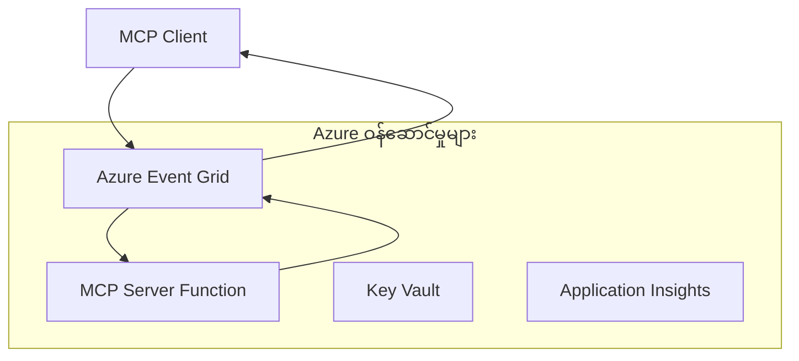

# MCP စိတ်ကြိုက် သယ်ယူပို့ဆောင်မှုများ - အဆင့်မြင့် အကောင်အထည်ဖော်ခြင်း လမ်းညွှန်

Model Context Protocol (MCP) သည် သယ်ယူပို့ဆောင်မှု များတွင် လွတ်လပ်မှုရှိစေပြီး အထူးပြုလုပ်ထားသည့် စီးပွားရေးလုပ်ငန်းပတ်ဝန်းကျင်များအတွက် စိတ်ကြိုက် အကောင်အထည်ဖော်မှုများကို ခွင့်ပြုသည်။ ဤအဆင့်မြင့် လမ်းညွှန်တွင် Azure Event Grid နှင့် Azure Event Hubs တို့ကို အသုံးပြု၍ ထိရောက်စွာ ထောက်ပံ့နိုင်သော cloud-native MCP ဖြေရှင်းချက်များ တည်ဆောက်ခြင်းအတွက် စိတ်ကြိုက် သယ်ယူပို့ဆောင်မှု အကောင်အထည်ဖော်ခြင်းကို လေ့လာပါသည်။  

## မိတ်ဆက်

MCP ၏ စံ သယ်ယူပို့ဆောင်မှုများ (stdio နှင့် HTTP streaming) မှ အများဆုံး အသုံးပြုမှုများကို ထောက်ပံ့ပေမယ့်၊ စီးပွားရေးလုပ်ငန်းပတ်ဝန်းကျင်များတွင် သယ်ယူပို့ဆောင်မှု များ ပိုမိုအဆင့်မြင့် တိုးတက်မှု၊ ယုံကြည်စိတ်ချရမှုနှင့် ရှိပြီးသား cloud အင်ဖရာစကျူတွင်းနှင့် ပေါင်းစပ် အသုံးချနိုင်မှုတို့အတွက် အထူးပြုသည့် သယ်ယူပို့ဆောင်မှု နည်းလမ်းများလိုအပ်သည်။ စိတ်ကြိုက် သယ်ယူပို့ဆောင်မှုများသည် MCP ကို cloud-native သတင်းစကားဝိုင်း ဝန်ဆောင်မှုများဖြင့် asynchronous ဆက်သွယ်မှု၊ event-driven معمွော၊ နှင့် ဖြန့်ဖြူးလုပ်ဆောင်မှု များအတွက် အသုံးပြုနိုင်စေသည်။  

ဤသင်ခန်းစာတွင် နောက်ဆုံးထွက် MCP သတ်မှတ်ချက် (2025-11-25)၊ Azure သတင်းစကား ဝန်ဆောင်မှုများနှင့် ရှိပြီးသား စီးပွားရေး ပေါင်းစည်းရေး ပုံစံများမှ အခြေခံထားသော အဆင့်မြင့် သယ်ယူပို့ဆောင်မှု အကောင်အထည်ဖော်မှုများကို စူးစမ်းသင်ယူမည်ဖြစ်သည်။  

### **MCP သယ်ယူပို့ဆောင်မှု စိတျဆောက်ပုံ**

**MCP သတ်မှတ်ချက် (2025-11-25) မှ:**

- **စံသယ်ယူပို့ဆောင်မှုများ**: stdio (အကြံပြု), HTTP streaming (ပြင်ပ အခြေအနေများအတွက်)
- **စိတ်ကြိုက် သယ်ယူပို့ဆောင်မှုများ**: MCP သတင်းစာ လဲလှယ်မှု ပရိုတိုကော ကို အကောင်အထည်ဖော်သည့် သယ်ယူပို့ဆောင်မှု များ
- **သတင်းစာ ပုံစံ**: JSON-RPC 2.0 MCP-အထူး လက်တွေ့ တိုးချဲ့မှုများ
- **နှစ်ဖက်စလုံး ဆက်သွယ်ရေး**: အသိပေးချက်များနှင့် ပြန်လည်ဖြေကြားမှုများအတွက် ပြည့်စုံသော duplex ဆက်သွယ်မှု

## သင်ယူရမည့် ရည်မှန်းချက်များ

ဤအဆင့်မြင့် သင်ခန်းစာ၏ အဆုံးအထိ သင်သည်:

- **စိတ်ကြိုက် သယ်ယူပို့ဆောင်မှု လိုအပ်ချက်များနားလည်မှု**: MCP ပရိုတိုကော ကို သယ်ယူပို့ဆောင်မှု အတန်းတစ်ခုအားလုံးပေါ်တွင် လိုက်နာအောင် အကောင်အထည်ဖော်နိုင်မည်။
- **Azure Event Grid သယ်ယူပို့ဆောင်မှု တည်ဆောက်မှု**: Serverless scalability အတွက် Azure Event Grid အသုံးပြုသော event-driven MCP ဆာဗာများ ဖန်တီးနိုင်မည်။
- **Azure Event Hubs သယ်ယူပို့ဆောင်မှု အကောင်အထည်ဖော်ခြင်း**: ဖြစ်နိုင်သော အသံပေးစာများ အမြန်နှင့် မြင့်မားသော throughput အတွက် Azure Event Hubs ကို အသုံးပြုပြီး MCP ဖြေရှင်းချက်များဒီဇိုင်းဆွဲနိုင်မည်။
- **စီးပွားရေး ပေါင်းစပ်ပုံများ လျှောက်ထားခြင်း**: ရှိပြီးသား Azure အင်ဖရာစကျူ နှင့်လုံခြုံရေး မော်ဒယ်များနှင့် စိတ်ကြိုက် သယ်ယူပို့ဆောင်မှု များကို ပေါင်းစပ်ထည့်သွင်းနိုင်မည်။
- **သယ်ယူပို့ဆောင်မှု ယုံကြည်မှု ကိုင်တွယ်နိုင်ရေး**: စီးပွားရေးအခြေအနေများအတွက် သတင်းစာ တည်ငြိမ်မှု၊ စဉ်စားမှု နှင့် အမှား ကိုင်တွယ်မှု အကောင်အထည်ဖော်နိုင်မည်။
- **စွမ်းဆောင်ရည် အကောင်းမြှင့်တင်မှု**: သယ်ယူပို့ဆောင်မှု ဖြေရှင်းချက်များအား အရွယ်အစား၊ နောက်ကျမှုနှင့် throughput လိုအပ်ချက်များအတွက် ဒီဇိုင်းတည်ဆောက်နိုင်မည်။

## **သယ်ယူပို့ဆောင်မှု လိုအပ်ချက်များ**

### **MCP သတ်မှတ်ချက် (2025-11-25) မှ အခြေခံလိုအပ်ချက်များ:**

```yaml
Message Protocol:
  format: "JSON-RPC 2.0 with MCP extensions"
  bidirectional: "Full duplex communication required"
  ordering: "Message ordering must be preserved per session"
  
Transport Layer:
  reliability: "Transport MUST handle connection failures gracefully"
  security: "Transport MUST support secure communication"
  identification: "Each session MUST have unique identifier"
  
Custom Transport:
  compliance: "MUST implement complete MCP message exchange"
  extensibility: "MAY add transport-specific features"
  interoperability: "MUST maintain protocol compatibility"
```

## **Azure Event Grid သယ်ယူပို့ဆောင်မှု အကောင်အထည်ဖော်ခြင်း**

Azure Event Grid သည် event-driven MCP စနစ်များအတွက် သင့်တော်သော serverless event routing ဝန်ဆောင်မှုကို ပံ့ပိုးပေးသည်။ ဤအကောင်အထည်ဖော်မှုသည် အဆင့်မြင့်၊ ကြားပေါ်ချိတ်စပ်မှု နည်းပါးသော MCP စနစ်များ ဆောက်လုပ်ပုံကို ပြသသည်။

### **စိတျဆောက်ပုံ အနှံ့အပြား**



### **C# အကောင်အထည်ဖော်မှု - Event Grid သယ်ယူပို့ဆောင်မှု**

```csharp
using Azure.Messaging.EventGrid;
using Microsoft.Extensions.Azure;
using System.Text.Json;

public class EventGridMcpTransport : IMcpTransport
{
    private readonly EventGridPublisherClient _publisher;
    private readonly string _topicEndpoint;
    private readonly string _clientId;
    
    public EventGridMcpTransport(string topicEndpoint, string accessKey, string clientId)
    {
        _publisher = new EventGridPublisherClient(
            new Uri(topicEndpoint), 
            new AzureKeyCredential(accessKey));
        _topicEndpoint = topicEndpoint;
        _clientId = clientId;
    }
    
    public async Task SendMessageAsync(McpMessage message)
    {
        var eventGridEvent = new EventGridEvent(
            subject: $"mcp/{_clientId}",
            eventType: "MCP.MessageReceived",
            dataVersion: "1.0",
            data: JsonSerializer.Serialize(message))
        {
            Id = Guid.NewGuid().ToString(),
            EventTime = DateTimeOffset.UtcNow
        };
        
        await _publisher.SendEventAsync(eventGridEvent);
    }
    
    public async Task<McpMessage> ReceiveMessageAsync(CancellationToken cancellationToken)
    {
        // Event Grid is push-based, so implement webhook receiver
        // This would typically be handled by Azure Functions trigger
        throw new NotImplementedException("Use EventGridTrigger in Azure Functions");
    }
}

// Azure Function for receiving Event Grid events
[FunctionName("McpEventGridReceiver")]
public async Task<IActionResult> HandleEventGridMessage(
    [EventGridTrigger] EventGridEvent eventGridEvent,
    ILogger log)
{
    try
    {
        var mcpMessage = JsonSerializer.Deserialize<McpMessage>(
            eventGridEvent.Data.ToString());
        
        // Process MCP message
        var response = await _mcpServer.ProcessMessageAsync(mcpMessage);
        
        // Send response back via Event Grid
        await _transport.SendMessageAsync(response);
        
        return new OkResult();
    }
    catch (Exception ex)
    {
        log.LogError(ex, "Error processing Event Grid MCP message");
        return new BadRequestResult();
    }
}
```

### **TypeScript အကောင်အထည်ဖော်မှု - Event Grid သယ်ယူပို့ဆောင်မှု**

```typescript
import { EventGridPublisherClient, AzureKeyCredential } from "@azure/eventgrid";
import { McpTransport, McpMessage } from "./mcp-types";

export class EventGridMcpTransport implements McpTransport {
    private publisher: EventGridPublisherClient;
    private clientId: string;
    
    constructor(
        private topicEndpoint: string,
        private accessKey: string,
        clientId: string
    ) {
        this.publisher = new EventGridPublisherClient(
            topicEndpoint,
            new AzureKeyCredential(accessKey)
        );
        this.clientId = clientId;
    }
    
    async sendMessage(message: McpMessage): Promise<void> {
        const event = {
            id: crypto.randomUUID(),
            source: `mcp-client-${this.clientId}`,
            type: "MCP.MessageReceived",
            time: new Date(),
            data: message
        };
        
        await this.publisher.sendEvents([event]);
    }
    
    // Azure Functions မှတဆင့် အဖြစ်အပျက်တွေပေါ် မူတည်၍ လက်ခံခြင်း
    onMessage(handler: (message: McpMessage) => Promise<void>): void {
        // အကောင်အထည်ဖော်မှုမှာ Azure Functions Event Grid တက်ကြွမှုကို အသုံးပြုပါမည်
        // ၎င်းသည် webhook လက်ခံသူအတွက် သဘောတရားဆိုင်ရာ အင်တာဖေ့စ်တစ်ခုဖြစ်သည်
    }
}

// Azure Functions အကောင်အထည်ဖော်မှု
import { app, InvocationContext, EventGridEvent } from "@azure/functions";

app.eventGrid("mcpEventGridHandler", {
    handler: async (event: EventGridEvent, context: InvocationContext) => {
        try {
            const mcpMessage = event.data as McpMessage;
            
            // MCP စာတိုက်ကို ကိုင်တွယ်ဆောင်ရွက်ပါ
            const response = await mcpServer.processMessage(mcpMessage);
            
            // Event Grid ဖြင့် တုံ့ပြန်ချက် ပို့ပေးပါ
            await transport.sendMessage(response);
            
        } catch (error) {
            context.error("Error processing MCP message:", error);
            throw error;
        }
    }
});
```

### **Python အကောင်အထည်ဖော်မှု - Event Grid သယ်ယူပို့ဆောင်မှု**

```python
from azure.eventgrid import EventGridPublisherClient, EventGridEvent
from azure.core.credentials import AzureKeyCredential
import asyncio
import json
from typing import Callable, Optional
import uuid
from datetime import datetime

class EventGridMcpTransport:
    def __init__(self, topic_endpoint: str, access_key: str, client_id: str):
        self.client = EventGridPublisherClient(
            topic_endpoint, 
            AzureKeyCredential(access_key)
        )
        self.client_id = client_id
        self.message_handler: Optional[Callable] = None
    
    async def send_message(self, message: dict) -> None:
        """Send MCP message via Event Grid"""
        event = EventGridEvent(
            data=message,
            subject=f"mcp/{self.client_id}",
            event_type="MCP.MessageReceived",
            data_version="1.0"
        )
        
        await self.client.send(event)
    
    def on_message(self, handler: Callable[[dict], None]) -> None:
        """Register message handler for incoming events"""
        self.message_handler = handler

# Azure Functions အကောင်အထည်ဖော်ခြင်း
import azure.functions as func
import logging

def main(event: func.EventGridEvent) -> None:
    """Azure Functions Event Grid trigger for MCP messages"""
    try:
        # Event Grid အဖြစ်မှ MCP စာတိုများကို ပေါင်းစပ်ခြင်း
        mcp_message = json.loads(event.get_body().decode('utf-8'))
        
        # MCP စာတိုကို ဆက်လက်処理လုပ်ဆောင်ခြင်း
        response = process_mcp_message(mcp_message)
        
        # ပြန်လည်တုန့်ပြန်ချက်ကို Event Grid မှတဆင့် ပို့ဆောင်ခြင်း
        # (အကောင်အထည်ဖော်မှုသည် အသစ်သော Event Grid client ဖန်တီးမည်)
        
    except Exception as e:
        logging.error(f"Error processing MCP Event Grid message: {e}")
        raise
```

## **Azure Event Hubs သယ်ယူပို့ဆောင်မှု အကောင်အထည်ဖော်ခြင်း**

Azure Event Hubs သည် သိပ္ပံနည်းကျ အမြန်နှုန်းမြင့် ဗဟိုပြု streaming ထောက်ပံ့မှု များဖြင့် နောက်ကျမှု နည်းပြီး သတင်းစာ အရေအတွက်မြင့် MCP သဘောတူညီမှုအခြေအနေများအတွက် အသုံးပြုသည်။

### **စိတျဆောက်ပုံ အနှံ့အပြား**

```mermaid
graph TB
    Client[MCP ဖောက်သည်] --> EH[Azure အဖြစ်ဖြစ် အဖြစ်ဖြစ်ဖြစ်ဖြစ်ဖြစ်ဖြစ်ဖြစ်ဖြစ်ဖြစ်ဖြစ်ဖြစ်ဖြစ်ဖြစ်ဖြစ်ဖြစ်ဖြစ်ဖြစ်ဖြစ်ဖြစ်ဖြစ်ဖြစ်ဖြစ်ဖြစ်ဖြစ်ဖြစ်ဖြစ်ဖြစ်ဖြစ်ဖြစ်ဖြစ်ဖြစ်ဖြစ်ဖြစ်ဖြစ်ဖြစ်ဖြစ်ဖြစ်ဖြစ်ဖြစ်ဖြစ်မွ
    EH --> Server[MCP ဆာဗာ]
    Server --> EH
    EH --> Client
    
    subgraph "အဖြစ်ဖြစ်ဖြစ်ဖြစ်မြှား"
        Partition[ပိုင်းခြားခြင်း]
        Retention[ဝတၱရား ထည့်ဆောင်ခြင်း]
        Scaling[အလိုအလျောက် ထိုးထွင်းခြင်း]
    end
    
    EH --> Partition
    EH --> Retention
    EH --> Scaling
```

### **C# အကောင်အထည်ဖော်မှု - Event Hubs သယ်ယူပို့ဆောင်မှု**

```csharp
using Azure.Messaging.EventHubs;
using Azure.Messaging.EventHubs.Producer;
using Azure.Messaging.EventHubs.Consumer;
using System.Text;

public class EventHubsMcpTransport : IMcpTransport, IDisposable
{
    private readonly EventHubProducerClient _producer;
    private readonly EventHubConsumerClient _consumer;
    private readonly string _consumerGroup;
    private readonly CancellationTokenSource _cancellationTokenSource;
    
    public EventHubsMcpTransport(
        string connectionString, 
        string eventHubName,
        string consumerGroup = "$Default")
    {
        _producer = new EventHubProducerClient(connectionString, eventHubName);
        _consumer = new EventHubConsumerClient(
            consumerGroup, 
            connectionString, 
            eventHubName);
        _consumerGroup = consumerGroup;
        _cancellationTokenSource = new CancellationTokenSource();
    }
    
    public async Task SendMessageAsync(McpMessage message)
    {
        var messageBody = JsonSerializer.Serialize(message);
        var eventData = new EventData(Encoding.UTF8.GetBytes(messageBody));
        
        // Add MCP-specific properties
        eventData.Properties.Add("MessageType", message.Method ?? "response");
        eventData.Properties.Add("MessageId", message.Id);
        eventData.Properties.Add("Timestamp", DateTimeOffset.UtcNow);
        
        await _producer.SendAsync(new[] { eventData });
    }
    
    public async Task StartReceivingAsync(
        Func<McpMessage, Task> messageHandler)
    {
        await foreach (PartitionEvent partitionEvent in _consumer.ReadEventsAsync(
            _cancellationTokenSource.Token))
        {
            try
            {
                var messageBody = Encoding.UTF8.GetString(
                    partitionEvent.Data.EventBody.ToArray());
                var mcpMessage = JsonSerializer.Deserialize<McpMessage>(messageBody);
                
                await messageHandler(mcpMessage);
            }
            catch (Exception ex)
            {
                // Handle deserialization or processing errors
                Console.WriteLine($"Error processing message: {ex.Message}");
            }
        }
    }
    
    public void Dispose()
    {
        _cancellationTokenSource?.Cancel();
        _producer?.DisposeAsync().AsTask().Wait();
        _consumer?.DisposeAsync().AsTask().Wait();
        _cancellationTokenSource?.Dispose();
    }
}
```

### **TypeScript အကောင်အထည်ဖော်မှု - Event Hubs သယ်ယူပို့ဆောင်မှု**

```typescript
import { 
    EventHubProducerClient, 
    EventHubConsumerClient, 
    EventData 
} from "@azure/event-hubs";

export class EventHubsMcpTransport implements McpTransport {
    private producer: EventHubProducerClient;
    private consumer: EventHubConsumerClient;
    private isReceiving = false;
    
    constructor(
        private connectionString: string,
        private eventHubName: string,
        private consumerGroup: string = "$Default"
    ) {
        this.producer = new EventHubProducerClient(
            connectionString, 
            eventHubName
        );
        this.consumer = new EventHubConsumerClient(
            consumerGroup,
            connectionString,
            eventHubName
        );
    }
    
    async sendMessage(message: McpMessage): Promise<void> {
        const eventData: EventData = {
            body: JSON.stringify(message),
            properties: {
                messageType: message.method || "response",
                messageId: message.id,
                timestamp: new Date().toISOString()
            }
        };
        
        await this.producer.sendBatch([eventData]);
    }
    
    async startReceiving(
        messageHandler: (message: McpMessage) => Promise<void>
    ): Promise<void> {
        if (this.isReceiving) return;
        
        this.isReceiving = true;
        
        const subscription = this.consumer.subscribe({
            processEvents: async (events, context) => {
                for (const event of events) {
                    try {
                        const messageBody = event.body as string;
                        const mcpMessage: McpMessage = JSON.parse(messageBody);
                        
                        await messageHandler(mcpMessage);
                        
                        // အနည်းဆုံးတစ်ကြိမ် ပို့ဆောင်မှုအတွက် ရပ်ဆိုင်းချက်ကိုအပ်ဒိတ်လုပ်ပါ။
                        await context.updateCheckpoint(event);
                    } catch (error) {
                        console.error("Error processing Event Hubs message:", error);
                    }
                }
            },
            processError: async (err, context) => {
                console.error("Event Hubs error:", err);
            }
        });
    }
    
    async close(): Promise<void> {
        this.isReceiving = false;
        await this.producer.close();
        await this.consumer.close();
    }
}
```

### **Python အကောင်အထည်ဖော်မှု - Event Hubs သယ်ယူပို့ဆောင်မှု**

```python
from azure.eventhub import EventHubProducerClient, EventHubConsumerClient
from azure.eventhub import EventData
import json
import asyncio
from typing import Callable, Dict, Any
import logging

class EventHubsMcpTransport:
    def __init__(
        self, 
        connection_string: str, 
        eventhub_name: str,
        consumer_group: str = "$Default"
    ):
        self.producer = EventHubProducerClient.from_connection_string(
            connection_string, 
            eventhub_name=eventhub_name
        )
        self.consumer = EventHubConsumerClient.from_connection_string(
            connection_string,
            consumer_group=consumer_group,
            eventhub_name=eventhub_name
        )
        self.is_receiving = False
    
    async def send_message(self, message: Dict[str, Any]) -> None:
        """Send MCP message via Event Hubs"""
        event_data = EventData(json.dumps(message))
        
        # MCP အထူးပိုင်ဆိုင်မှုများ ထည့်သွင်းပါ
        event_data.properties = {
            "messageType": message.get("method", "response"),
            "messageId": message.get("id"),
            "timestamp": "2025-01-14T10:30:00Z"  # တိကျသော အချိန်စက ဖိုင်ကို အသုံးပြုပါ
        }
        
        async with self.producer:
            event_data_batch = await self.producer.create_batch()
            event_data_batch.add(event_data)
            await self.producer.send_batch(event_data_batch)
    
    async def start_receiving(
        self, 
        message_handler: Callable[[Dict[str, Any]], None]
    ) -> None:
        """Start receiving MCP messages from Event Hubs"""
        if self.is_receiving:
            return
        
        self.is_receiving = True
        
        async with self.consumer:
            await self.consumer.receive(
                on_event=self._on_event_received(message_handler),
                starting_position="-1"  # အစမှ စတင်ပါ
            )
    
    def _on_event_received(self, handler: Callable):
        """Internal event handler wrapper"""
        async def handle_event(partition_context, event):
            try:
                # Event Hubs အဖြစ်မှ MCP စာတိုက်ကို မျဉ်းၿပင်၍ ဖတ်ပါ
                message_body = event.body_as_str(encoding='UTF-8')
                mcp_message = json.loads(message_body)
                
                # MCP စာတိုက်ကို ကိုင်တွယ်ဆောင်ရွက်ပါ
                await handler(mcp_message)
                
                # အနည်းဆုံး တစ်ကြိမ်ပို့ဆောင်မှုအတွက် checkpoint ကို အပ်ဒိတ်လုပ်ပါ
                await partition_context.update_checkpoint(event)
                
            except Exception as e:
                logging.error(f"Error processing Event Hubs message: {e}")
        
        return handle_event
    
    async def close(self) -> None:
        """Clean up transport resources"""
        self.is_receiving = False
        await self.producer.close()
        await self.consumer.close()
```

## **အဆင့်မြင့် သယ်ယူပို့ဆောင်မှု ပုံစံများ**

### **သတင်းစာ တည်ငြိမ်မှုနှင့် ယုံကြည်စိတ်ချရမှု**

```csharp
// Implementing message durability with retry logic
public class ReliableTransportWrapper : IMcpTransport
{
    private readonly IMcpTransport _innerTransport;
    private readonly RetryPolicy _retryPolicy;
    
    public async Task SendMessageAsync(McpMessage message)
    {
        await _retryPolicy.ExecuteAsync(async () =>
        {
            try
            {
                await _innerTransport.SendMessageAsync(message);
            }
            catch (TransportException ex) when (ex.IsRetryable)
            {
                // Log and retry
                throw;
            }
        });
    }
}
```

### **သယ်ယူပို့ဆောင်မှု လုံခြုံရေး ပေါင်းစည်းမှု**

```csharp
// Integrating Azure Key Vault for transport security
public class SecureTransportFactory
{
    private readonly SecretClient _keyVaultClient;
    
    public async Task<IMcpTransport> CreateEventGridTransportAsync()
    {
        var accessKey = await _keyVaultClient.GetSecretAsync("EventGridAccessKey");
        var topicEndpoint = await _keyVaultClient.GetSecretAsync("EventGridTopic");
        
        return new EventGridMcpTransport(
            topicEndpoint.Value.Value,
            accessKey.Value.Value,
            Environment.MachineName
        );
    }
}
```

### **သယ်ယူပို့ဆောင်မှု စောင့်ကြည့်ခြင်း နှင့် မြင်သာမှု**

```csharp
// Adding telemetry to custom transports
public class ObservableTransport : IMcpTransport
{
    private readonly IMcpTransport _transport;
    private readonly ILogger _logger;
    private readonly TelemetryClient _telemetryClient;
    
    public async Task SendMessageAsync(McpMessage message)
    {
        using var activity = Activity.StartActivity("MCP.Transport.Send");
        activity?.SetTag("transport.type", "EventGrid");
        activity?.SetTag("message.method", message.Method);
        
        var stopwatch = Stopwatch.StartNew();
        
        try
        {
            await _transport.SendMessageAsync(message);
            
            _telemetryClient.TrackDependency(
                "EventGrid",
                "SendMessage",
                DateTime.UtcNow.Subtract(stopwatch.Elapsed),
                stopwatch.Elapsed,
                true
            );
        }
        catch (Exception ex)
        {
            _telemetryClient.TrackException(ex);
            throw;
        }
    }
}
```

## **စီးပွားရေး ပေါင်းစပ်မှု အခြေအနေများ**

### **အခြေအနေ ၁: ဖြန့်ဝေပေးသော MCP လုပ်ငန်းစဉ်**

MCP တောင်းဆိုချက်များကို စနစ်တကျ ဖြန့်ဝေရာအတွက် Azure Event Grid အသုံးပြုခြင်း:

```yaml
Architecture:
  - MCP Client sends requests to Event Grid topic
  - Multiple Azure Functions subscribe to process different tool types
  - Results aggregated and returned via separate response topic
  
Benefits:
  - Horizontal scaling based on message volume
  - Fault tolerance through redundant processors
  - Cost optimization with serverless compute
```

### **အခြေအနေ ၂: အချိန်နှင့်တပြေးညီ MCP Streaming**

မြင့်မားသော အကြိမ်ရေ MCP ဆက်သွယ်မှုများအတွက် Azure Event Hubs ကို အသုံးပြုခြင်း:

```yaml
Architecture:
  - MCP Client streams continuous requests via Event Hubs
  - Stream Analytics processes and routes messages
  - Multiple consumers handle different aspect of processing
  
Benefits:
  - Low latency for real-time scenarios
  - High throughput for batch processing
  - Built-in partitioning for parallel processing
```

### **အခြေအနေ ၃: ပေါင်းစပ် သယ်ယူပို့ဆောင်မှု စိတျဆောက်ပုံ**

အသုံးပြုချက် မတူညီခြင်းအတွက် သယ်ယူပို့ဆောင်မှု များစုပေါင်းခြင်း:

```csharp
public class HybridMcpTransport : IMcpTransport
{
    private readonly IMcpTransport _realtimeTransport; // Event Hubs
    private readonly IMcpTransport _batchTransport;    // Event Grid
    private readonly IMcpTransport _fallbackTransport; // HTTP Streaming
    
    public async Task SendMessageAsync(McpMessage message)
    {
        // Route based on message characteristics
        var transport = message.Method switch
        {
            "tools/call" when IsRealtime(message) => _realtimeTransport,
            "resources/read" when IsBatch(message) => _batchTransport,
            _ => _fallbackTransport
        };
        
        await transport.SendMessageAsync(message);
    }
}
```

## **စွမ်းဆောင်ရည် မြှင့်တင်ခြင်း**

### **Event Grid အတွက် သတင်းစာစုစည်းခြင်း**

```csharp
public class BatchingEventGridTransport : IMcpTransport
{
    private readonly List<McpMessage> _messageBuffer = new();
    private readonly Timer _flushTimer;
    private const int MaxBatchSize = 100;
    
    public async Task SendMessageAsync(McpMessage message)
    {
        lock (_messageBuffer)
        {
            _messageBuffer.Add(message);
            
            if (_messageBuffer.Count >= MaxBatchSize)
            {
                _ = Task.Run(FlushMessages);
            }
        }
    }
    
    private async Task FlushMessages()
    {
        List<McpMessage> toSend;
        lock (_messageBuffer)
        {
            toSend = new List<McpMessage>(_messageBuffer);
            _messageBuffer.Clear();
        }
        
        if (toSend.Any())
        {
            var events = toSend.Select(CreateEventGridEvent);
            await _publisher.SendEventsAsync(events);
        }
    }
}
```

### **Event Hubs အတွက် Partitioning မဟာဗျူဟာ**

```csharp
public class PartitionedEventHubsTransport : IMcpTransport
{
    public async Task SendMessageAsync(McpMessage message)
    {
        // Partition by client ID for session affinity
        var partitionKey = ExtractClientId(message);
        
        var eventData = new EventData(JsonSerializer.SerializeToUtf8Bytes(message))
        {
            PartitionKey = partitionKey
        };
        
        await _producer.SendAsync(new[] { eventData });
    }
}
```

## **စိတ်ကြိုက် သယ်ယူပို့ဆောင်မှုများ စမ်းသပ်ခြင်း**

### **Test Doubles နဲ့ unit စမ်းသပ်ခြင်း**

```csharp
[Test]
public async Task EventGridTransport_SendMessage_PublishesCorrectEvent()
{
    // Arrange
    var mockPublisher = new Mock<EventGridPublisherClient>();
    var transport = new EventGridMcpTransport(mockPublisher.Object);
    var message = new McpMessage { Method = "tools/list", Id = "test-123" };
    
    // Act
    await transport.SendMessageAsync(message);
    
    // Assert
    mockPublisher.Verify(
        x => x.SendEventAsync(
            It.Is<EventGridEvent>(e => 
                e.EventType == "MCP.MessageReceived" &&
                e.Subject == "mcp/test-client"
            )
        ),
        Times.Once
    );
}
```

### **Azure Test Containers နဲ့ ပေါင်းစပ်စမ်းသပ်ခြင်း**

```csharp
[Test]
public async Task EventHubsTransport_IntegrationTest()
{
    // Using Testcontainers for integration testing
    var eventHubsContainer = new EventHubsContainer()
        .WithEventHub("test-hub");
    
    await eventHubsContainer.StartAsync();
    
    var transport = new EventHubsMcpTransport(
        eventHubsContainer.GetConnectionString(),
        "test-hub"
    );
    
    // Test message round-trip
    var sentMessage = new McpMessage { Method = "test", Id = "123" };
    McpMessage receivedMessage = null;
    
    await transport.StartReceivingAsync(msg => {
        receivedMessage = msg;
        return Task.CompletedTask;
    });
    
    await transport.SendMessageAsync(sentMessage);
    await Task.Delay(1000); // Allow for message processing
    
    Assert.That(receivedMessage?.Id, Is.EqualTo("123"));
}
```

## **အကောင်းဆုံး လုပ်ထုံးလုပ်နည်းများ နှင့် လမ်းညွှန်ချက်များ**

### **သယ်ယူပို့ဆောင်မှု ဒီဇိုင်း အကြောင်းအရာများ**

1. **Idempotency**: ပြန်နေကြောင်း message ကို idempotent ဖြစ်အောင် သေချာစေပါ
2. **Error Handling**: ပြည့်စုံသော အမှားကိုင်တွယ်မှုနှင့် dead letter queue များ ထည့်သွင်းပါ
3. **Monitoring**: အသေးစိတ် telemetry နှင့် ကျန်းမာရေး စစ်ဆေးချက်များ ထည့်သွင်းရန်
4. **Security**: managed identities နှင့် အနည်းဆုံး အခွင့်အရေး အသုံးပြုပါ
5. **Performance**: သင့် latency နှင့် throughput လိုအပ်ချက်အတွက် ဒီဇိုင်းဆွဲပါ

### **Azure သီးသန့် အကြံပေးချက်များ**

1. **Managed Identity အသုံးပြုခြင်း**: Production တွင် connection string မပါရှိစေရန်
2. **Circuit Breakers ကို ကာကွယ်ခြင်း**: Azure ဝန်ဆောင်မှု ပျက်ကွက်မှုများကို ကာကွယ်ရန်
3. **ကုန်ကျစရိတ် စောင့်ကြည့်ခြင်း**: သတင်းစာ အရေအတွက်နှင့် ဆောင်ရွက်မှုကုန်ကျစရိတ် ကို ထည့်သွင်းတွက်ချက်ပါ
4. **Scale အတွက် စီမံကိန်းချခြင်း**: partitioning နှင့် scale မဟာဗျူဟာများကို စောင့်ကြည့်အစောပိုင်းတွင် ဒီဇိုင်းဆွဲပါ
5. **စမ်းသပ်မှု ပြည့်စုံစွာ ပြုလုပ်ရန်**: Azure DevTest Labs ကို အသုံးပြု၍ စမ်းသပ်ပါ

## **နိဂုံးချုပ်**

စိတ်ကြိုက် MCP သယ်ယူပို့ဆောင်မှုများသည် Azure သတင်းစကား ဝန်ဆောင်မှုများကို အသုံးပြုပြီး လှုပ်ရှားမှုးအားသာသော စီးပွားရေးပတ်ဝန်းကျင်များအတွက် အင်အားကြီးသော ဖြေရှင်းချက်များ ဖန်တီးနိုင်စေသည်။ Event Grid သို့မဟုတ် Event Hubs သယ်ယူပို့ဆောင်မှုများကို အကောင်အထည်ဖော်ခြင်းအားဖြင့် စီးပွားရေးလိုအပ်ချက်များနှင့် မျှတသော သယ်ယူပို့ဆောင်မှု များကို cloud-native Azure အင်ဖရာစကျူနှင့်ထိပ်တန်းပေါင်းစပ်နိုင်သည်။  

ထုတ်ပိုးထားသော ပုံစံများသည် MCP ပရိုတိုကော လိုက်နာမှုကို ထိန်းသိမ်းရန်နှင့် Azure အကောင်းဆုံး မဟာဗျူဟာများနှင့် ကိုက်ညီသော စိတ်ကြိုက် သယ်ယူပို့ဆောင်မှု ဆောင်ရွက်မှုများအတွက် ထုတ်လုပ်မှု ပြင်ဆင်ထားသော ပုံစံများကို ပြသသည်။  

## **အပိုဆောင်း အရင်းအမြစ်များ**

- [MCP Specification 2025-11-25](https://modelcontextprotocol.io/specification/2025-11-25/)
- [Azure Event Grid Documentation](https://docs.microsoft.com/azure/event-grid/)
- [Azure Event Hubs Documentation](https://docs.microsoft.com/azure/event-hubs/)
- [Azure Functions Event Grid Trigger](https://docs.microsoft.com/azure/azure-functions/functions-bindings-event-grid)
- [Azure SDK for .NET](https://github.com/Azure/azure-sdk-for-net)
- [Azure SDK for TypeScript](https://github.com/Azure/azure-sdk-for-js)
- [Azure SDK for Python](https://github.com/Azure/azure-sdk-for-python)

---

> *ဤလမ်းညွှန်သည် ထုတ်လုပ်မှု MCP စနစ်များအတွက် လက်တွေ့ သယ်ယူပို့ဆောင်မှု ပုံစံများကို အဓိကထားထားသည်။ သယ်ယူပို့ဆောင်မှု အကောင်အထည်ဖော်မှုများကို သင့်လိုအပ်ချက်များနှင့် Azure ဝန်ဆောင်မှု ကန့်သတ်ချက်များနှင့်အညီ မပြောင်းလဲမီအခြေခံစစ်ဆေးပါ။*  
> **လက်ရှိ စံ**: ဤလမ်းညွှန်သည် [MCP Specification 2025-11-25](https://modelcontextprotocol.io/specification/2025-11-25/) သယ်ယူပို့ဆောင်မှု လိုအပ်ချက်များနှင့် စီးပွားရေး လောကအတွက် အဆင့်မြင့် သယ်ယူပို့ဆောင်မှု ပုံစံများကို ဖော်ပြသည်။

## နောက်တစ်ဆင့်
- [6. Community Contributions](../../06-CommunityContributions/README.md)

---

<!-- CO-OP TRANSLATOR DISCLAIMER START -->
**ပြောကြားချက်**
ဤစာတမ်းကို AI ဘာသာပြန်ဝန်ဆောင်မှု [Co-op Translator](https://github.com/Azure/co-op-translator) အသုံးပြု၍ ဘာသာပြန်ထားပါသည်။ ကျွန်ုပ်တို့သည် တိကျမှန်ကန်မှုအတွက် ကြိုးပမ်းနေသော်လည်း၊ စက်ကိရိယာဘာသာပြန်ခြင်းများတွင် အမှားများ သို့မဟုတ် မှားယွင်းချက်များ ပါဝင်နိုင်ကြောင်း သတိပြုပါရန် လိုအပ်ပါသည်။ မူလစာတမ်းကို မူရင်းဘာသာဖြင့်သာ ယုံကြည်စိတ်ချရသော အချက်အလက်အဖြစ် သတ်မှတ်သင့်သည်။ အရေးကြီးသည့် သတင်းအချက်အလက်များအတွက် ပရော်ဖက်ရှင်နယ် လူသားဘာသာပြန်သူဝန်ဆောင်မှုကို အကြံပြုပါသည်။ ဤဘာသာပြန်ချက်ကို အသုံးပြုခြင်းမှ ဖြစ်ပေါ်လာသော နားလည်မှုကွာခြားမှုများ သို့မဟုတ် မမှန်ကန်သော အသုံးပြုမှုများအတွက် ကျွန်ုပ်တို့ တာဝန်မခံပါ။
<!-- CO-OP TRANSLATOR DISCLAIMER END -->