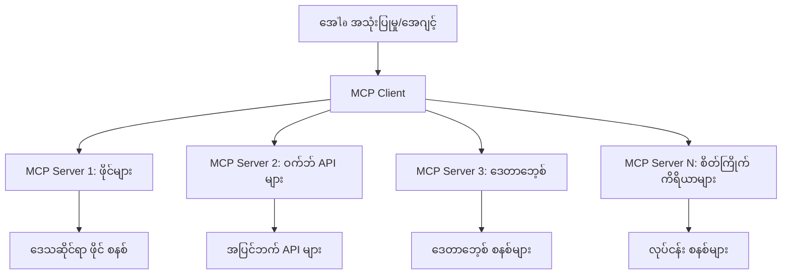

# 🌐 မော်ဒူး ၂: Microsoft Foundry Toolkit မူလအခြေခံအတိုင်အခေါ် MCP

[]()
[]()
[]()

## 📋 သင်ယူရမည့် ရည်မှန်းချက်များ

ဤမော်ဒူး၏ အဆုံးသတ်တွင် သင်မှာ:
- ✅ Model Context Protocol (MCP) စနစ်နှင့် အားသာချက်များကို နားလည်နိုင်မည်
- ✅ Microsoft ၏ MCP ဆာဗာ ပတ်ဝန်းကျင်ကို ရှာဖွေရမည်
- ✅ MCP ဆာဗာများကို Microsoft Foundry Toolkit Agent Builder နှင့် ပေါင်းစပ်နိုင်မည်
- ✅ Playwright MCP အသုံးပြု၍ လုပ်ဆောင်နိုင်သော browser automation agent တစ်ခု တည်ဆောက်နိုင်မည်
- ✅ သင်၏ agent အတွင်း MCP ကိရိယာများကို ပြင်ဆင် စစ်ဆေးနိုင်မည်
- ✅ MCP ပါဝင်သည့် agent များကို ထုတ်ပေး တင်သွင်းအသုံးပြုနိုင်မည်

## 🎯 မော်ဒူး ၁ ကို အခြေခံ၍ တည်ဆောက်ခြင်း

မော်ဒူး ၁ တွင် Microsoft Foundry Toolkit အခြေခံများ အသိပညာရပြီး ကျွန်ုပ်တို့ ပထမဆုံး Python Agent ကို တည်ဆောက်ထားသည်။ ယခုမှာတော့ သင်၏ agent များကို ပြင်ပကိရိယာများနှင့် ဝန်ဆောင်မှုများနှင့် အဆက်အသွယ် ချိတ်ဆက်ပေးသည့် စွမ်းဆောင်ရည်မြင့် **Model Context Protocol (MCP)** ဖြင့် **စွမ်းအားမြှင့်တင်** ကြမည်။

အခြေခံ ကိန်းဂဏန်းကိရိယာမှ စက်ပညာကွန်ပြူတာတစ်လုံး အဖြစ် တိုးတက်အောင်ပြုလုပ်ခြင်းကဲ့သို့၊ သင်၏ AI agent များမှာ အောက်ပါ စွမ်းရည်များ ရရှိပါလိမ့်မည်။
- 🌐 ဝဘ်ဆိုက်များ ရှာဖွေ လုပ်ဆောင်နိုင်ခြင်း
- 📁 ဖိုင်များ အသုံးပြု ပြင်ဆင်နိုင်ခြင်း
- 🔧 ကုမ္ပဏီစနစ်များနှင့် ပေါင်းစည်းချိတ်ဆက်နိုင်ခြင်း
- 📊 API များမှ အချိန်နှင့်တပြေးညီ ဒေတာများကို လုပ်ဆောင်နိုင်ခြင်း

## 🧠 Model Context Protocol (MCP) ကို နားလည်ခြင်း

### 🔍 MCP ရည်ရွယ်ချက်

Model Context Protocol (MCP) သည် **"AI အက်ပ်များအတွက် USB-C"** တစ်ခုဖြစ်ပြီး LLM များကို ပြင်ပကိရိယာများ၊ ဒေတာအရင်းအမြစ်များနှင့် ဝန်ဆောင်မှုများကို ချိတ်ဆက်ပေးသည့် ပေါင်းစည်းမှု ဖွဲ့စည်းမှု အသစ်တစ်ခု ဖြစ်သည်။ USB-C သည် ကေဘယ်အကျိုးအပေါက် မျှမျှတတ ချိတ်ဆက်ပေးသည့် universal connector တစ်ခုကို သတ်မှတ်ခဲ့သလို MCP က AI ပေါင်းစည်းမှု ရှုပ်ထွေးမှုများကို တစ်ခုတည်း သတ်မှတ်ထားသော protocol တစ်ခုဖြင့် ဖယ်ရှားပေးသည်။

### 🎯 MCP ဖြေရှင်းပေးသော ပြဿနာများ

**MCP မရှိခင်:**
- 🔧 ကိုယ်ပိုင် tool များအတွက် စိတ်ကြိုက် ပေါင်းစည်းမှုများ
- 🔄 ကိုယ်ပိုင် vendor များထိန်းချုပ်မှုများ
- 🔒 ဆက်သွယ်မှုအလွယ်တကြား လုံခြုံရေးအန္တရာယ်များ
- ⏱️ အခြေခံ ပေါင်းစည်းမှုများ အတွက် လစဉ်များ အချိန်ယူမှု

**MCP ဖြင့်:**
- ⚡ တန်းတူချိတ်ဆက်နိုင်သော tool plug-and-play
- 🔄 Vendor မပေါ်မူတည်သော ဖွဲ့စည်းမှု
- 🛡️ မဟာဗျူဟာ လုံခြုံရေး အကောင်းဆုံး လုပ်ထုံးလုပ်နည်းများ
- 🚀 လုပ်ဆောင်ချက်အသစ်များ ထည့်သွင်းရရှိရန် မိနစ်ပိုင်းအတွင်း

### 🏗️ MCP ဖွဲ့စည်းမှု ကို ပိုမိုသိမြင်ခြင်း

MCP သည် **client-server ဖွဲ့စည်းမှု** ဖြစ်ပြီး လုံခြုံမှုရှိ၍ တိုးချဲ့နိုင်သော ပတ်ဝန်းကျင်တစ်ခု ဖန်တီးပေးသည်။



**🔧 အဓိက အစိတ်အပိုင်းများ:**

| အစိတ်အပိုင်း | တာဝန် | နမူနာများ |
|-----------|------|----------|
| **MCP Hosts** | MCP ဝန်ဆောင်မှုများ အသုံးပြုသော အက်ပ်များ | Claude Desktop, VS Code, Microsoft Foundry Toolkit |
| **MCP Clients** | Protocol ကို စီမံခန့်ခွဲသူများ (ဆာဗာနှင့် 1:1) | Host အက်ပ်တွင် ထည့်သွင်းထားသည် |
| **MCP Servers** | စနစ်တကျ protocol ဖြင့် စွမ်းဆောင်ရည် ဖော်ပြသူများ | Playwright, Files, Azure, GitHub |
| **Transport Layer** | ဆက်သွယ်မှု နည်းလမ်းများ | stdio, HTTP, WebSockets |


## 🏢 Microsoft ၏ MCP ဆာဗာ ပတ်ဝန်းကျင်

Microsoft သည် MCP ပတ်ဝန်းကျင်ကို စီးပွားရေးလုပ်ငန်းလိုအပ်ချက်များ ဖြေရှင်းပေးနိုင်သည့် စံတိုင်း Enterprise-grade ဆာဗာများကို ချိတ်ဆက်ဦးဆောင်ထားသည်။

### 🌟 ထူးခြားသော Microsoft MCP ဆာဗာများ

#### 1. ☁️ Azure MCP ဆာဗာ
**🔗 Repository**: [azure/azure-mcp](https://github.com/azure/azure-mcp)
**🎯 ရည်ရွယ်ချက်**: AI ပေါင်းစည်းမှုဖြင့် Azure အရင်းအမြစ်စီမံခန့်ခွဲမှု တစ်ခုတည်း

**✨ အဓိက လုပ်ဆောင်ချက်များ:**
- အညွှန်းထုတ် ပြင်ဆင်မှုဖြင့် အခြေခံစက်ရုံ တည်ဆောက်ခြင်း
- အချိန်နှင့်တပြေးညီ အရင်းအမြစ် အခြေအနေ သတိပေးမှု
- ကုန်ကျစရိတ် အထောက်အကူပြု ရှာဖွေ့မှု
- လုံခြုံရေး စည်းမျဉ်းများ စစ်ဆေးခြင်း

**🚀 အသုံးချမှုများ:**
- AI အကူအညီဖြင့် Infrastructure-as-Code
- အလိုအလျောက် အရင်းအမြစ် တိုးမြှင့်မှု
- Cloud ကုန်ကျစရိတ် ထိန်းသိမ်းမှု
- DevOps အလုပ်ဖြင့် စနစ်အလိုအလျောက်

#### 2. 📊 Microsoft Dataverse MCP
**📚 စာတမ်းများ**: [Microsoft Dataverse Integration](https://go.microsoft.com/fwlink/?linkid=2320176)
**🎯 ရည်ရွယ်ချက်**: စီးပွားရေးဒေတာအတွက် သဘာဝဘာသာပြောဆိုမှု အင်တာဖေ့စ်

**✨ အဓိက လုပ်ဆောင်ချက်များ:**
- သဘာဝဘာသာ စာရင်းဇယားမေးခွန်းများ
- စီးပွားရေး အကြောင်းအရာ နားလည်မှု
- သတ်မှတ်ထားသော prompt များ
- စီးပွားရေး ဒေတာ အုပ်ချုပ်မှု

**🚀 အသုံးချမှုများ:**
- စီးပွားရေးသတင်းအချက်အလက် အစီရင်ခံစာ
- ဖောက်သည်ဒေတာ နားလည်မှု
- အရောင်းလမ်းကြောင်း အနိဒါန်း
- ဆိုင်ရာလိုက်နာမှု ဒေတာမေးမြန်းမှု

#### 3. 🌐 Playwright MCP ဆာဗာ
**🔗 Repository**: [microsoft/playwright-mcp](https://github.com/microsoft/playwright-mcp)
**🎯 ရည်ရွယ်ချက်**: Browser Automation နှင့် ဝဘ်အင်တာကစား ပြုလုပ်ရန်

**✨ အဓိက လုပ်ဆောင်ချက်များ:**
- အမျိုးမျိုး browser များကို သွားလာ အလိုအလျောက်လုပ်ဆောင်ခြင်း (Chrome, Firefox, Safari)
- မန်ချက်မြင့်ဖြစ်စေရန် အချက်အလက်များ ရှာဖွေရန်
- Screenshot နှင့် PDF ဖန်တီးမှု
- ကွန်ယက် ထိန်းချုပ်မှု စောင့်ကြည့်မှု

**🚀 အသုံးချမှုများ:**
- အလိုအလျောက် စမ်းသပ်မှုလုပ်ငန်းစဉ်များ
- ဝဘ်မှ ဒေတာအစည်းများ ရယူခြင်း
- UI/UX စောင့်ကြည့်မှု
- ယှဉ်ပြိုင်မှုများ လေ့လာသုံးသပ်ခြင်း

#### 4. 📁 Files MCP ဆာဗာ
**🔗 Repository**: [microsoft/files-mcp-server](https://github.com/microsoft/files-mcp-server)
**🎯 ရည်ရွယ်ချက်**: အချက်အလက်ဖိုင် စနစ် အလိုအလျောက် စီမံခန့်ခွဲမှု

**✨ အဓိက လုပ်ဆောင်ချက်များ:**
- ဖိုင်များကို သတ်မှတ်ချက်ဖြင့် စီမံခြင်း
- အကြောင်းအရာ ကို ချိန်ညှိမှု
- ဗားရှင်းထိန်းချုပ်မှု ပေါင်းစည်းခြင်း
- မီတာဒေတာ ထုတ်ယူခြင်း

**🚀 အသုံးချမှုများ:**
- စာရွက်စာတမ်း စနစ် စီမံခန့်ခွဲမှု
- ကုဒ် Repository စီမံခန့်ခွဲမှု
- အကြောင်းအရာ ထုတ်ဝေမှုလုပ်ငန်းစဉ်များ
- ဒေတာ ချိတ်ဆက်မှု ဖိုင်များ ကိုင်တွယ်ခြင်း

#### 5. 📝 MarkItDown MCP ဆာဗာ
**🔗 Repository**: [microsoft/markitdown](https://github.com/microsoft/markitdown)
**🎯 ရည်ရွယ်ချက်**: Markdown ကို မြှင့်တင်စီမံခြင်းနှင့် ပြုပြင်မှု

**✨ အဓိက လုပ်ဆောင်ချက်များ:**
- မြင့်မားသော Markdown ဖော်ပြချက် ဖတ်ခြင်း
- ပုံစံပြောင်းခြင်း (MD ↔ HTML ↔ PDF)
- အကြောင်းအရာ ဖွဲ့စည်းပုံ ခွဲခြမ်းမှု
- Template ပြုပြင်ခြင်း

**🚀 အသုံးချမှုများ:**
- နည်းပညာစာရင်းဇယား စနစ်များ
- အကြောင်းအရာ စီမံခန့်ခွဲမှု စနစ်များ
- အစီရင်ခံစာ ဖန်တီးခြင်း
- အသိပညာ စုစည်းမှု အလိုအလျောက်

#### 6. 📈 Clarity MCP ဆာဗာ
**📦 Package**: [@microsoft/clarity-mcp-server](https://www.npmjs.com/package/@microsoft/clarity-mcp-server)
**🎯 ရည်ရွယ်ချက်**: ဝဘ်သုံးစွဲသူ လေ့လာမှု နှင့် အပြုအမူ ရှာဖွေရေး

**✨ အဓိက လုပ်ဆောင်ချက်များ:**
- အပူမြေပုံ ဒေတာ ခွဲခြမ်းမှု
- သုံးစွဲသူ အသုံးပြုမှု မှတ်တမ်းများ
- စွမ်းဆောင်ရည် တိုးတက်မှု ခြေရာခံမှု
- ပြောင်းလဲမှု funnel ခွဲခြမ်းခြင်း

**🚀 အသုံးချမှုများ:**
- ဝဘ်ဆိုက် ပြုပြင်မှု
- အသုံးပြုသူ အတွေ့အကြုံ သုတေသန
- A/B စမ်းသပ်မှု ခွဲခြမ်းမှု
- စီးပွားရေးသတင်းအချက်အလက် Dashboard များ

### 🌍 အသိုင်းအဝိုင်း ပတ်ဝန်းကျင်

Microsoft ဆာဗာများ အပြင် MCP ပတ်ဝန်းကျင်တွင်အပါအဝင်သည်
- **🐙 GitHub MCP**: Repository စီမံမှု နှင့် ကုဒ်ခွဲခြမ်းစိတ်ဖြာမှု
- **🗄️ Database MCP များ**: PostgreSQL, MySQL, MongoDB ပေါင်းစည်းမှု
- **☁️ Cloud Provider MCP များ**: AWS, GCP, Digital Ocean ကိရိယာများ
- **📧 ဆက်သွယ်မှု MCP များ**: Slack, Teams, အီးမေးလ် ပေါင်းစည်းမှု

## 🛠️ လက်တွေ့ လက်တွေ့လုပ်ငန်း: Browser Automation Agent တည်ဆောက်ခြင်း

**🎯 စီမံကိန်းရည်မှန်းချက်**: Playwright MCP ဆာဗာကို အသုံးပြု၍ ဝဘ်ဆိုက်သွားလာနိုင်ပြီး ထုတ်ယူနိုင်သော လုပ်ဆောင်ချက်များရှိသော တတ်ကြွသော browser automation agent တစ်ခု တည်ဆောက်ခြင်း။

### 🚀 အဆင့် ၁: Agent အခြေခံ စတင်ခြင်း

#### အဆင့် ၁: သင့်ရဲ့ Agent ကို စတင်ဖန်တီးခြင်း
1. **Microsoft Foundry Toolkit Agent Builder ဖွင့်ပါ**
2. **New Agent ဖန်တီးပါ** အောက်ပါ အချက်အလက်ဖြင့်:
   - **အမည်**: `BrowserAgent`
   - **Model**: GPT-4o ရွေးချယ်ပါ


### 🔧 အဆင့် ၂: MCP ပေါင်းစည်းမှု Workflow

#### အဆင့် ၃: MCP ဆာဗာ ပေါင်းစည်းမှု ထည့်သွင်းပါ
1. **Agent Builder ၏ Tools အပိုင်းသို့ သွားပါ**
2. **"Add Tool" ကိုနှိပ်ပြီး ပေါင်းစည်းမည့် စာရွက်ကို ဖွင့်ပါ**
3. **ရရှိနိုင်သော နယ်ပယ်ကနေ "MCP Server" ကို ရွေးချယ်ပါ**


**🔍 ကိရိယာအမျိုးအစားများ နားလည်ခြင်း**
- **Built-in Tools**: Microsoft Foundry Toolkit ၏ အရင်မှတ် ပုံသေအချက်အလက်အရေအတွက်
- **MCP Servers**: ပြင်ပ ဝန်ဆောင်မှု ပေါင်းစည်းမှုများ
- **Custom APIs**: သင်၏ ကိုယ်ပိုင် ဝန်ဆောင်မှု အချက်အလက်များ
- **Function Calling**: တိုက်ရိုက် မော်ဒယ် function ခေါ်ရန်

#### အဆင့် ၄: MCP ဆာဗာ ရွေးချယ်ခြင်း
1. **"MCP Server" အဖြစ် ရွေးချယ်ပါ**


2. **MCP ကတ်တလောများ တစ်လျှောက် လှည့်ကြည့်ပါ**


### 🎮 အဆင့် ၃: Playwright MCP ပြင်ဆင်ခြင်း

#### အဆင့် ၅: Playwright ရွေးချယ် ပြင်ဆင်ရန်
1. **Microsoft ၏ အတည်ပြုထားသော MCP ဆာဗာများ သို့ ရောက်ရန် "Use Featured MCP Servers" ကို နှိပ်ပါ**
2. **"Playwright" ကို ရွေးချယ်ပါ**
3. **Default MCP ID ခွင့်လွှတ်ပေးခြင်း သို့မဟုတ် သင့်ပတ်ဝန်းကျင်အတွက် စိတ်ကြိုက်ပြင်ဆင်ပါ**


#### အဆင့် ၆: Playwright စွမ်းရည်များ ဖွင့်ပါ
**🔑 အရေးကြီးအဆင့်**: Playwright ၏ လုပ်ဆောင်နိုင်မှု အားလုံးကို ရွေးချယ်ပါ


**🛠️ အဓိက Playwright ကိရိယာများ:**
- **Navigation**: `goto`, `goBack`, `goForward`, `reload`
- **Interaction**: `click`, `fill`, `press`, `hover`, `drag`
- **Extraction**: `textContent`, `innerHTML`, `getAttribute`
- **Validation**: `isVisible`, `isEnabled`, `waitForSelector`
- **Capture**: `screenshot`, `pdf`, `video`
- **Network**: `setExtraHTTPHeaders`, `route`, `waitForResponse`

#### အဆင့် ၇: ပေါင်းစည်းမှုအောင်မြင်မှုကို အတည်ပြုပါ
**✅ အောင်မြင်မှု ပြသချက်များ**:
- Agent Builder အင်တာဖေ့ဆိုက်တွင် ကိရိယာများအားလုံး ပြသခြင်း
- ပေါင်းစည်းမှု panel တွင် အမှား မရှိခြင်း
- Playwright ဆာဗာ တည်နေရာ "Connected" ဟူ၍ ပြသခြင်း


**🔧 မကြာခဏ တွေ့ရသည့် ပြသနာများ နည်းလမ်းများ:**
- **ချိတ်ဆက်မှု မအောင်မြင်တာ**: အင်တာနက် ချိတ်ဆက်မှုနှင့် firewall စနစ်များ စစ်ဆေးပါ
- **ကိရိယာ မပြသခြင်း**: တပ်ဆင်ချိန်တွင် စွမ်းရည်အားလုံး ရွေးချယ်ထားရန် သေချာစေပါ
- **ခွင့်ပြုချက် မှားယွင်းမှု**: VS Code သည် လိုအပ်သော စနစ်ခွင့်ပြုချက်ရှိမရှိ စစ်ဆေးပါ

### 🎯 အဆင့် ၄: မြင့်မားသော Prompt အင်ဂျင်နီယာ

#### အဆင့် ၈: ထက်မြက်သော System Prompt များ တီထွင်ပါ
Playwright ၏ စွမ်းရည်ပြည့်ဝမှုကို အသုံးပြုသည့် ထူးခြားသော prompt များ ဒီဇိုင်းဆွဲပါ

```markdown
# Web Automation Expert System Prompt

## Core Identity
You are an advanced web automation specialist with deep expertise in browser automation, web scraping, and user experience analysis. You have access to Playwright tools for comprehensive browser control.

## Capabilities & Approach
### Navigation Strategy
- Always start with screenshots to understand page layout
- Use semantic selectors (text content, labels) when possible
- Implement wait strategies for dynamic content
- Handle single-page applications (SPAs) effectively

### Error Handling
- Retry failed operations with exponential backoff
- Provide clear error descriptions and solutions
- Suggest alternative approaches when primary methods fail
- Always capture diagnostic screenshots on errors

### Data Extraction
- Extract structured data in JSON format when possible
- Provide confidence scores for extracted information
- Validate data completeness and accuracy
- Handle pagination and infinite scroll scenarios

### Reporting
- Include step-by-step execution logs
- Provide before/after screenshots for verification
- Suggest optimizations and alternative approaches
- Document any limitations or edge cases encountered

## Ethical Guidelines
- Respect robots.txt and rate limiting
- Avoid overloading target servers
- Only extract publicly available information
- Follow website terms of service
```

#### အဆင့် ၉: သွယ်ဝိုက်သော User Prompt များဖန်တီးခြင်း
စွမ်းဆောင်ရည် ကွာခြားခြင်းများကို ပြသသည့် prompt များ ဒီဇိုင်းဆွဲပါ။

**🌐 ဝဘ် စစ်တမ်း ဥပမာ:**
```markdown
Navigate to github.com/kinfey and provide a comprehensive analysis including:
1. Repository structure and organization
2. Recent activity and contribution patterns  
3. Documentation quality assessment
4. Technology stack identification
5. Community engagement metrics
6. Notable projects and their purposes

Include screenshots at key steps and provide actionable insights.
```


### 🚀 အဆင့် ၅: အကောင်အထည်ဖော်ခြင်းနှင့် စမ်းသပ်ခြင်း

#### အဆင့် ၁၀: ပထမဆုံး အလိုအလျောက်လည်ပတ်မှုများ ကို ပြုလုပ်ပါ
1. **"Run" ကို နှိပ်ပြီး အလိုအလျောက်လုပ်ငန်းစဉ် စတင်ပါ**
2. **အချိန်နှင့်တပြေးညီ အကောင်အထည်ဖော်မှုကို ကြည့်ရှုပါ**:
   - Chrome browser ကို အလိုအလျောက် ဖြင့်ဖွင့်ခြင်း
   - Agent သည် သတ်မှတ်ထားသော ဝဘ်ဆိုက်သို့ သွားပါသည်
   - မိမိလုပ်ဆောင်လိုက်သော အဆင့်များကို Screenshot များဖြင့် ဖမ်းယူသည်
   - နောက်ဆုံး အချက်အလက် များ အချိန်နှင့်တပြေးညီ စီးမြောင်းလာသည်


#### အဆင့် ၁၁: ဖြေရှင်းချက်များနှင့် အမြင်များ ခွဲခြမ်းစစ်ဆေးပါ
Agent Builder ၏ အင်တာဖေ့စိတ်တွင် ပြည့်စုံသော ခွဲခြမ်းစိတ်ဖြာမှုကို ပြသပါသည်။


### 🌟 အဆင့် ၆: အဆင့်မြင့် စွမ်းရည်များနှင့် ထုတ်လုပ်မှုသို့ တင်သွင်းခြင်း

#### အဆင့် ၁၂: ထုတ်ပေးခြင်းနှင့် ထုတ်လုပ်မှု တင်သွင်းရေး
Agent Builder သည် မျိုးစုံသော တင်သွင်းခြင်း ရွေးချယ်မှုများကို ထောက်ပံ့ပေးသည်။


## 🎓 မော်ဒူး ၂ အနှစ်ချုပ်နှင့် နောက်တစ်ဆင့်များ

### 🏆 ဆုတံဆိပ် ရရှိပြီးပြီ: MCP ပေါင်းစည်းမှု ကျွမ်းကျင်သူ

**✅ ကျွမ်းကျင်မှုများ:**
- [ ] MCP ဖွဲ့စည်းမှု နှင့် အားသာချက်များ နားလည်ခြင်း
- [ ] Microsoft ၏ MCP ဆာဗာ ပတ်ဝန်းကျင်တွင် လမ်းလျှောက်နိုင်ခြင်း
- [ ] Playwright MCP ကို Microsoft Foundry Toolkit နှင့် ပေါင်းစည်းခြင်း
- [ ] မြင့်မားသော browser automation agent များ ဖန်တီးခြင်း
- [ ] ဝဘ်အလိုအလျောက်လုပ်ဆောင်မှုအတွက် ပရိုမ့်မြောက်အင်ဂျင်နီယာလုပ်ခြင်း

### 📚 ထပ်ဆင့် အရင်းအမြစ်များ

- **🔗 MCP ဖော်ပြချက်**: [တရားဝင် Protocol စာတမ်း](https://modelcontextprotocol.io/)
- **🛠️ Playwright API**: [ပြည့်စုံသော နည်းလမ်းညွှန်](https://playwright.dev/docs/api/class-playwright)
- **🏢 Microsoft MCP ဆာဗာများ**: [စီးပွားရေး ပေါင်းစည်းမှု လမ်းညွှန်](https://github.com/microsoft/mcp-servers)
- **🌍 အသိုင်းအဝိုင်း နမူနာများ**: [MCP ဆာဗာ ပြတိုက်](https://github.com/modelcontextprotocol/servers)

**🎉 ဝမ်းမြောက်ပါတယ်!** သင်သည် MCP ပေါင်းစည်းမှုကို အောင်မြင်စွာ သိရှိပြီး ပြင်ပကိရိယာများနှင့်ပါ ထုတ်လုပ်မှုအဆင့် AI agent များကို ယခုတိုင် ထူထောင်နိုင်ပါပြီ။

### 🔜 နောက်မော်ဒူးသို့ ဆက်လက်တက်ကြွပါ

သင်၏ MCP ကျွမ်းကျင်မှုကို မြှင့်တင်လိုပါသလား? **[Module 3: Microsoft Foundry Toolkit နှင့် အဆင့်မြင့် MCP ဖွံ့ဖြိုးတိုးတက်မှု](../lab3/README.md)** တို့ကို ဆက်လက်သင်ယူပါ။ ဤမှာသင်သည်
- ကိုယ်ပိုင် MCP ဆာဗာများဖန်တီးခြင်း
- အဆင့်မြင့် MCP Python SDK ကို ပြင်ဆင် အသုံးပြုခြင်း
- MCP Inspector ဖြင့် အမှားရှာဖွေရေး သတ်မှတ်ခြင်း
- MCP ဆာဗာ ဖွံ့ဖြိုးတိုးတက်မှု စနစ်များ ကျွမ်းကျင်ခြင်း
- Weather MCP ဆာဗာ ဖန်တီးခြင်း စသည့် အကြောင်းအရာများ သင်ယူ ရရှိမည် ဖြစ်သည်။

---

<!-- CO-OP TRANSLATOR DISCLAIMER START -->
**ပြောကြားချက်**
ဤစာတမ်းကို AI ဘာသာပြန်ဝန်ဆောင်မှု [Co-op Translator](https://github.com/Azure/co-op-translator) အသုံးပြု၍ ဘာသာပြန်ထားပါသည်။ ကျွန်ုပ်တို့သည် တိကျမှန်ကန်မှုအတွက် ကြိုးပမ်းနေသော်လည်း၊ စက်ကိရိယာဘာသာပြန်ခြင်းများတွင် အမှားများ သို့မဟုတ် မှားယွင်းချက်များ ပါဝင်နိုင်ကြောင်း သတိပြုပါရန် လိုအပ်ပါသည်။ မူလစာတမ်းကို မူရင်းဘာသာဖြင့်သာ ယုံကြည်စိတ်ချရသော အချက်အလက်အဖြစ် သတ်မှတ်သင့်သည်။ အရေးကြီးသည့် သတင်းအချက်အလက်များအတွက် ပရော်ဖက်ရှင်နယ် လူသားဘာသာပြန်သူဝန်ဆောင်မှုကို အကြံပြုပါသည်။ ဤဘာသာပြန်ချက်ကို အသုံးပြုခြင်းမှ ဖြစ်ပေါ်လာသော နားလည်မှုကွာခြားမှုများ သို့မဟုတ် မမှန်ကန်သော အသုံးပြုမှုများအတွက် ကျွန်ုပ်တို့ တာဝန်မခံပါ။
<!-- CO-OP TRANSLATOR DISCLAIMER END -->