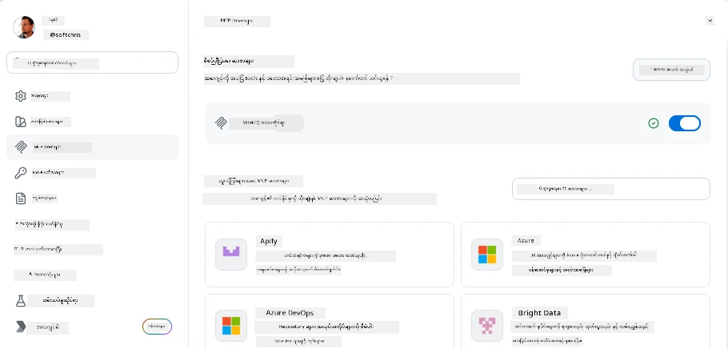
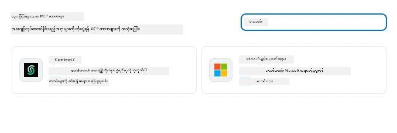
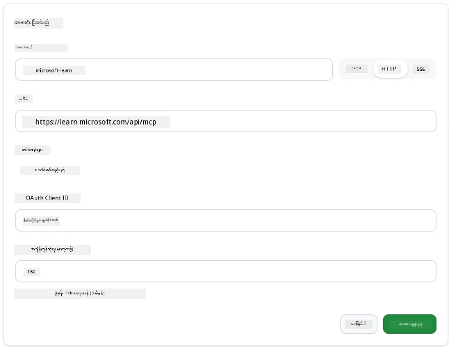
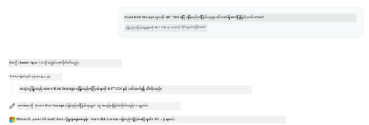
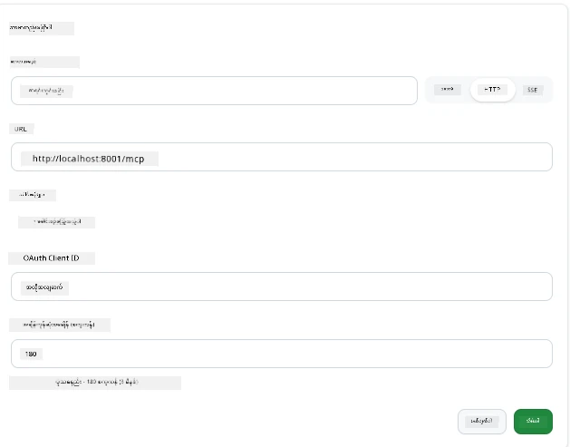
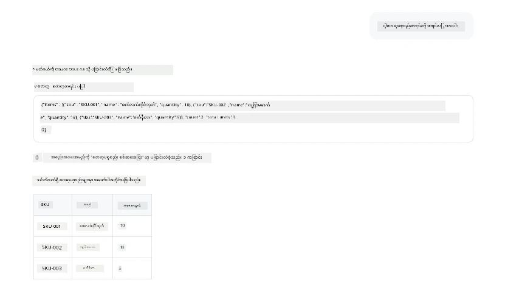
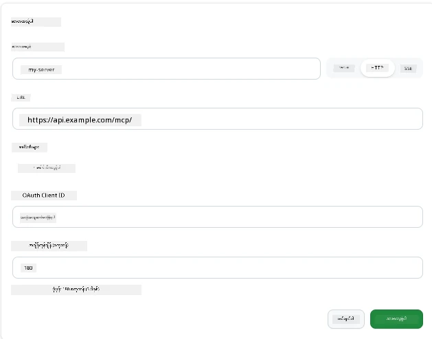
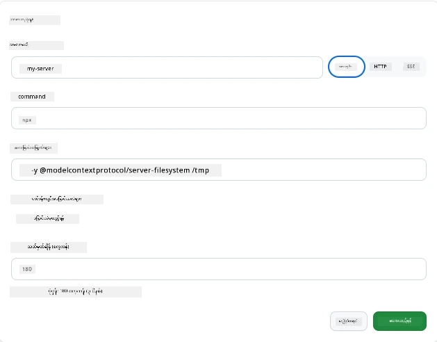

# GitHub Copilot App တွင် MCP Servers အသုံးပြုခြင်း

အခုအချိန်မှာ MCP ဘယ်လိုအလုပ်လုပ်တာကိုသင်သိပြီ။ သင်ဟာ server တွေ တည်ဆောက်ပြီး tools နဲ့ resources တွေ သတ်မှတ်ပြီး clients တွေကို ချိတ်ဆက်ထားပြီ။ သို့သော် သင် server တည်ဆောက်နေသူဖြစ်တာကို လှည့်ပတ်ပြောင်းလဲခြင်း မလုပ်ခဲ့သေးပါဘူး။ MCP ကို ထောက်ပံ့တဲ့ AI-powered app အသုံးပြုသူ အနေနဲ့ *အသုံးပြုသူ* အနေဖြင့် ဘယ်လိုမြင်ရမလဲ?

[GitHub Copilot App](https://github.com/github/app) သည် MCP Servers အသုံးပြုနိုင်သော desktop app တစ်ခုဖြစ်သည်။ MCP servers များကို ယင်းနှင့် ချိတ်ဆက်ခြင်းအားဖြင့် Copilot သည် သင့်စာရွက်စာတမ်းများထဲကို ဝင်ရောက်၍ သင့်အတွင်းပိုင်း API များကို ခေါ်ယူနိုင်ပြီး ဒေတာဘေ့စ် ကိုမေးမြန်းနိုင်သည်။ သို့မဟုတ် သင် server တစ်ခုအဖြစ် ထုပ်ပိုးထားသည့် service များအား ပြောဆိုနိုင်ပါသည်။ အဆိုပါ app သည် host ဖြစ်လာပြီး သင်၏ MCP servers များသည် ၎င်း၏ tools ဖြစ်လာပါသည်။

ဤသင်ခန်းစာသည် MCP settings panel တွေ့ရခြင်း၊ အမှန်တကယ်အသုံးပြုသော documentation server သို့ ချိတ်ဆက်ခြင်းနှင့် မိမိကျတော် server ကို ဆက်လက်ချိတ်ဆက်ခြင်းအထိ အဆုံးသတ် အတွေ့အကြုံကို လမ်းညွှန်ပေးပါသည်။

## သင်ယူရမည့် ရည်ရွယ်ချက်များ

ဤသင်ခန်းစာအပြီးတွင် သင်သည် အောက်ပါအရာများပြုလုပ်နိုင်ပါမည်။

- Copilot App settings တွင် MCP Servers panel ကို သွားရောက် ရှာဖွေနိုင်ခြင်း။
- Hosted documentation server တစ်ခုချိတ်ဆက်ပြီး session တစ်ခုတွင် အသုံးပြုနိုင်ခြင်း။
- Custom server တစ်ခု မှတ်ပုံတင်၍ Copilot သည် ၎င်း၏ tools များကို ခေါ်နိုင်ကြောင်း အတည်ပြုနိုင်ခြင်း။
- Server တစ်ခု ဖုန်းခေါ်ခြင်းကို environment variables သို့မဟုတ် custom headers ဖြင့် ပြင်ဆင်နိုင်ခြင်း (HTTP ဖြစ်ပါက)

## Copilot App ၏ MCP Host အဖြစ်

အဓိကအယူအဆမှာ **Copilot ၏ agent များသည် ဉာဏ်ကြီးပြီး မြင်သာသော်လည်း သင်ကပေးတဲ့ အချက်အလက်ကိုသာ သိရှိနားလည်သည်။** ပုံမှန်အားဖြင့် agent တစ်ခုသည် သင့် workspace ထဲမှ ဖိုင်များကို ဖတ်ရှု၍ terminal command များကို ပြုလုပ်နိုင်သော်လည်း ဒေတာဘေ့စ်ကို မေးမြန်းခြင်း၊ ပြက္ခဒိန် စစ်ဆေးခြင်း၊ သို့မဟုတ် custom API ခေါ်ယူခြင်းများကို မလုပ်နိုင်ပါ။ MCP servers များသည် Copilot နှင့် သင့်စနစ်များ (ဒေတာဘေ့စ်များ၊ version control၊ API များ၊ ဒီဇိုင်း tools များ) ကြား အတားအဆီး ဖြစ်ပြီး agent များအတွက် လိုအပ်သော အချက်အလက်များနှင့် လုပ်ဆောင်ချက်များကို ရရှိစေနိုင်ပါသည်။

စတင်ရအောင်—သင့် app ၏ MCP Servers များကို စီမံခန့်ခွဲရန် setting များကို ရှာကြည့်ရအောင်။

## အဆင့် ၁: MCP settings panel ကို ရှာဖွေခြင်း

Copilot App ကိုဖွင့်ပြီး ဘယ်အောက်ခြမ်းဘက်ရှိ cog ပုံသည်ကို ရှာဖွေရန် နှိပ်ပါ။


"MCP Servers" ကို ရွေးချယ်ပါ၊ သင့်ဖွဲ့စည်းထားသော server များကို အပေါ်ကိုမြင်ရမည်။ အောက်ဘက်တွင် နာမည်ကြီး server များဈေးကွက်၊ အပေါ်ဘက်တွင် "Add Server" ခလုတ်ရပါမည်။



ဤနေရာမှာ သင့်ထိန်းချုပ်ချက်ဗဟိုဖြစ်သည်။ Server များကို ထည့်၊ ဖယ်ရှား၊ ဖွင့်၊ ပိတ်လုပ်နိုင်ပါသည်။ ပြောင်းလဲမှုများသည် session အသစ်များအတွက်သာ လွှဲပြောင်းထိရောက်ပါမည်။ ပြင်ဆင်မှု ပြုလုပ်ပြီးပါက session များဖွင့်ထားလျှင် စတင်အသစ် session အသစ် လုပ်ရန် လိုအပ်ပါမည်။

## အဆင့် ၂: Documentation Server ချိတ်ဆက်ခြင်း

အထိရောက်ဆုံးကို ချက်ချင်းလုပ်ကြည့်ပါ။ Microsoft Docs MCP server သည် Copilot အတွက် Microsoft မှ တရားဝင်စာရွက်စာတမ်းများ (Azure, .NET, TypeScript နှင့် အခြားများ) ကို မေးမြန်းခံယူခွင့် ပေးသည်။ Agent သည် ၎င်း၏ သင်ကြားမှု ဒေတာ (cutoff date ရှိ) မူတည်ခြင်း၏ အစား၊ မေးမြန်းချိန်တွင် လက်ရှိစာရွက်စာတမ်းများကို ရယူနိုင်သည်။

ထည့်သွင်းနည်းမှာ -

1. နာမည်ကြီး server များ စာရင်းတွင် **learn** ဟုပြီး ရိုက်ထည့်ပြီး "Microsoft Learn" ဟုခေါ်သော server ကို ရွေးချယ်ပါ။

   

   နှိပ်သည့်အခါတွင် နာမည်၊ ပို့ဆောင်မှုအမျိုးအစားနှင့် URL များကို မူလတန်ဖိုးဖြင့် ဖြည့်ပြီး "Add Server" ကိုသာ နှိပ်ရပါမည်။

2. "Add Server" ကို နှိပ်ပြီး ချိတ်ဆက်မှုအချိန် ရှိမည်။

   

   ထည့်သွင်းပြီးသော server သည် အပေါ်တွင် တပ်ဆင်ထားသော server အဖြစ် ပြသမည်။ နောက်တစ်ဆင့်မှာ ထို server ကို စမ်းကြည့်ရအောင်။

3. အဆိုပါ dialog ပိတ်ပြီး Quick chat ကို ရွေးချယ်ပါ။

4. အောက်ပါ prompt ကို ရိုက်ထည့်ပြီး Microsoft Learn server ပေါ်ရှိ tool တစ်ခုကို လှမ်းပါ။

   ```text
   What's the current recommended approach for handling Azure Blob Storage 
   retries using the .NET SDK?
   ```

   

သင်အသစ်ထည့်သွင်းသော MCP Server ကို သက်သေပြသည်ကိုမြင်ရပါမည်။

## အဆင့် ၃: Custom stdio Server ချိတ်ဆက်ခြင်း

Presets များသည် သက်သာစေသော် ဒီနည်းလမ်း၏ အားသာချက်သည် ကိုယ့် server များကို ချိတ်ဆက်နိင်ခြင်း ဖြစ်သည်။ သင်၏ internal API သို့မဟုတ် ကုမ္ပဏီအချက်အလက်ဘေ့စ်ကိုထုတ်ဖော်ထားသော server တစ်ခု ရှိတယ်假设ကျင့်ကြည့်ပါ။ ဒီပြဿနာတွင် ကျွန်တော်တို့ လက်ဖြင့် တည်ဆောက်ထားသည့် inventory စီမံခန့်ခွဲမှု MCP Server ကို အသုံးပြုပါမည်။

1. Cog ကိုနှိပ်ပြီး "MCP servers" ကို ထပ်မံရွေးချယ်ပါ။

2. "Add Server" ခလုတ်နှိပ်ပြီး "+ Add Custom server" ကို ရွေး၍ အောက်ပါ အချက်အလက်များဖြည့်ပါ။

   - Name: `Inventory Server`
   - Transport နှင့် optics ထားသည့်အမည် (ညာဘက်တွင်) **http**

   "Add Server" ကို နှိပ်ပြီး သင့် server စာရင်းတွင် ပြသပါမည်။

   

4. စမ်းသပ်ရန် အောက်ပါ prompt ကို အသုံးပြုပါ။

    ```
    list inventory
    ```

   

   သင်၏ ကိုယ်ပိုင် တည်ဆောက်ထားသော server မှ inventory ပစ္စည်းစာရင်းကို ပြန်လည်ရရှိသင့်ပါသည်။

ကောင်းပါပြီ၊ သင်သည် ပေါ်ပြူလာသော server များနှင့် ကိုယ့်စိတ်ကူး MCP server များကို Copilot App တွင် ထည့်သွင်းနည်းကို အထူးကျွမ်းကျင်လာပါပြီ။ နောက်တစ်ခုမှာ secret နှင့် environment variables ကို မည်သို့ ကိုင်တွယ်ရမည်ဆိုတာ ဆွေးနွေးပါမည်။

## အဆင့် ၄: အဆင့်မြင့် ပြင်ဆင်မှုများ

ယာယီအနေဖြင့် သင်သည် server အသစ်ထည့်ရာတွင် နာမည် နှင့် URL ကိုသာ ဖြည့်သည်ကို မြင်ရပါသည်။ ဒါပေမဲ့ သင့် server သည် API key သို့မဟုတ် တခြားတန်ဖိုးတစ်ခု လိုအပ်ပါက? Transport အမျိုးအစားအပေါ် မူတည်၍ လိုအပ်သည့် အချက်အလက်များကို ထည့်သွင်းနိုင်ပါသည်။

- **http သို့မဟုတ် SSE transport**: Headers များကိုလိုက်ဖက်စွာ သတ်မှတ်နိုင်သည်။

   အတည်ပြုချက်အတွက် Authorization header ဖြင့် ထည့်သွင်းနိုင်သည်။ တန်ဖိုးသည် စကားစုတစ်ခု ဖြစ်နိုင်ပါသည်။ OAuth ကို အသုံးပြုလျှင် OAuth client ID ကို တိုက်ရိုက် ပေးနိုင်သည်။

   

- **stdio transport**: Environment variables များ သတ်မှတ်နိုင်သည်။

   Server ကို စတင်တတ်အောင် ပြုလုပ်ရာတွင် လိုအပ်သည့် environment variables များကို ထည့်သွင်းနိုင်သည်။

   

## စာမူအကျဉ်း

Copilot App သည် MCP servers ကို agent ၏ အင်အားများ တိုးမြှင့်ပေးသော extension များအဖြစ် ရုပ်သိမ်းမယ်။ သင်သည် MCP servers များ ထည့်သွင်းသည်မှ စတင်၍ session တွင်အသုံးပြုခြင်းအထိ စီးဆင်းမှုကို ပြည့်စုံကြည့်ရှုနိုင်ခဲ့သည်။ ယခု သင်သည် သင်၏ agent များကို ပြည်တွင်း API များနှင့် custom tool များသို့ ချိတ်ဆက်နိုင်ပြီး လိုအပ်သော အချက်အလက်နှင့် လုပ်ဆောင်ချက်များကို သဟဇာတ ပြုလုပ်ပေးရန် အင်အားရရှိစေပါသည်။

## 📚 အပိုဆောင်း အရင်းအမြစ်များ

### တရားဝင် စာရွက်စာတမ်းများ

- [GitHub Copilot App](https://github.com/github/app)
- [MCP Specification](https://modelcontextprotocol.io/specification/2025-03-26) - Model Context Protocol specification

### အသိုင်းအဝိုင်း
- [MCP Community Discord](https://discord.com/invite/ByRwuEEgH4) - တိုက်ရိုက် ဆွေးနွေးခန်း
- [GitHub Discussions](https://github.com/microsoft/MCP-Server-and-PostgreSQL-Sample-Retail/discussions) - မေးမြန်းခြင်းနှင့် ပြန်လည်မျှဝေခြင်း
- [Stack Overflow](https://stackoverflow.com/questions/tagged/model-context-protocol) - နည်းပညာဆိုင်ရာ မေးခွန်းများ

---

<!-- CO-OP TRANSLATOR DISCLAIMER START -->
**ပြောကြားချက်**
ဤစာတမ်းကို AI ဘာသာပြန်ဝန်ဆောင်မှု [Co-op Translator](https://github.com/Azure/co-op-translator) အသုံးပြု၍ ဘာသာပြန်ထားပါသည်။ ကျွန်ုပ်တို့သည် တိကျမှန်ကန်မှုအတွက် ကြိုးပမ်းနေသော်လည်း၊ စက်ကိရိယာဘာသာပြန်ခြင်းများတွင် အမှားများ သို့မဟုတ် မှားယွင်းချက်များ ပါဝင်နိုင်ကြောင်း သတိပြုပါရန် လိုအပ်ပါသည်။ မူလစာတမ်းကို မူရင်းဘာသာဖြင့်သာ ယုံကြည်စိတ်ချရသော အချက်အလက်အဖြစ် သတ်မှတ်သင့်သည်။ အရေးကြီးသည့် သတင်းအချက်အလက်များအတွက် ပရော်ဖက်ရှင်နယ် လူသားဘာသာပြန်သူဝန်ဆောင်မှုကို အကြံပြုပါသည်။ ဤဘာသာပြန်ချက်ကို အသုံးပြုခြင်းမှ ဖြစ်ပေါ်လာသော နားလည်မှုကွာခြားမှုများ သို့မဟုတ် မမှန်ကန်သော အသုံးပြုမှုများအတွက် ကျွန်ုပ်တို့ တာဝန်မခံပါ။
<!-- CO-OP TRANSLATOR DISCLAIMER END -->