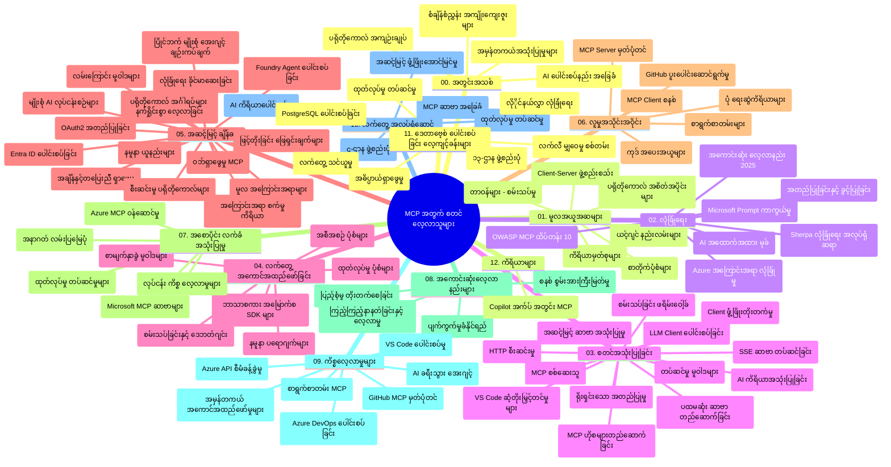

# Model Context Protocol (MCP) for Beginners - သင်ခန်းစာလမ်းညွှန်

ဤသင်ခန်းစာလမ်းညွှန်တွင် "Model Context Protocol (MCP) for Beginners" သင်ရိုးညွှန်းတမ်း၏ ဗဟုသုတဖွံ့ဖြိုးတည်ဆောက်ပုံနှင့် အကြောင်းအရာများအား အနှစ်ချုပ်ပေးထားသည်။ ဤလမ်းညွှန်ကို အသုံးပြု၍ ဗဟုသုတများကို ထိရောက်စွာ ရှာဖွေနိုင်ပြီး ရရှိနိုင်သော အရင်းအမြစ်များကို အကောင်းဆုံးအသုံးချနိုင်ပါသည်။

## Repository အကျဉ်းချုပ်

Model Context Protocol (MCP) သည် AI မော်ဒယ်များနှင့် Client နောက်ခံအပလီကေးရှင်းများအကြား ပေါင်းသင်းဆက်သွယ်မှုဆိုင်ရာ စံချိန်တစ်ခုဖြစ်သည်။ မျိုးဆက်ပန့်သက်သက်ပညာ ကုမ္ပဏီ Anthropic မှ စတင်ဖန်တီးခဲ့ပြီး ယနေ့တွင် MCP အဖွဲ့အစည်း GitHub အဖွဲ့မှ လက်တွဲထိန်းသိမ်းနေသည်။ ဤ repository တွင် C#, Java, JavaScript, Python, နှင့် TypeScript စသည်ဖြင့် AI တီထွင်သူများ၊ စနစ်ဒီဇိုင်နာများ နှင့် ဆော့ဖ်ဝဲအင်ဂျင်နီယာများအတွက် လက်တွေ့လုပ်ငန်းသင်နည်းလမ်းများပါရှိသည်။

## မြင်ကွင်းသင်ရိုးစနစ်ရုပ်ပိုင်းဆိုင်ရာ မြေပုံ

## Repository ဖွဲ့စည်းပုံ

Repository သည် MCP ၏ မျိုးစုံအချက်အလက်များကို အလေးပေးတင်ပြထားသော သုံးဆယ်နှစ်၀က် ခြားခြားနားနား အပိုင်းတွဲငါးဆယ် ခုလို ပါဝင်သည်-

1. **နိဒါန်း (00-Introduction/)**
   - Model Context Protocol ကို အနှစ်ချုပ်
   - AI လုပ်ငန်းစဉ်များတွင် စံနှုန်းတစ်ခုဖြစ်စေရေးအကြောင်း
   - လက်တွေ့အသုံးများနှင့် အကျိုးကျေးဇူးများ

2. **အခြေခံအကြောင်းအရာများ (01-CoreConcepts/)**
   - Client-server ပုံစံ
   - Protocol ၏ အဓိက အစိတ်အပိုင်းများ
   - MCP တွင် အသုံးပြုသည့် ပို့ဆောင်နည်းစနစ်များ

3. **လုံခြုံရေး (02-Security/)**
   - MCP အခြေခံ စနစ်များရှိ လုံခြုံရေး ခြိမ်းခြောက်မှုများ
   - လုံခြုံရေး နည်းလမ်းများ ထိရောက်စွာဆောင်ရွက်နည်း
   - အတည်ပြုမှုနှင့် သတ်မှတ်ခွင့်တင်းကျပ်မှုနည်းလမ်းများ
   - **စကားဝိုင်းလုံခြုံရေးစာတမ်းစုစည်းမှုများ**:
     - MCP Security Best Practices 2025
     - Azure Content Safety Implementation Guide
     - MCP Security Controls and Techniques
     - MCP Best Practices Quick Reference
   - **အဓိက လုံခြုံရေးအကြောင်းအရာများ**:
     - Prompt injection နှင့် tool poisoning ထိမှတ်မှုများ
     - Session hijacking နှင့် confused deputy ပြဿနာများ
     - Token passthrough ချို့ယွင်းချက်များ
     - ခွင့်ပြုပေးမှုများ များလွန်းခြင်းနှင့် access control
     - AI ပစ္စည်းများအတွက် supply chain security
     - Microsoft Prompt Shields ပေါင်းစပ်မှု

4. **စတင်အသုံးပြုခြင်း (03-GettingStarted/)**
   - ပတ်ဝန်းကျင်ပြင်ဆင်ခြင်းနှင့် ဆက်တင်များ ပြင်ဆင်ခြင်း
   - စမ်းသပ် MCP Server နှင့် Client ဖန်တီးခြင်း
   - ရှိပြီးသား အပလီကေးရှင်းများနှင့် ပေါင်းစပ်ဆက်သွယ်ခြင်း
   - အပိုင်းများ ပါဝင်သည်-
     - ပထမဆုံး Server အကောင်အထည်ဖော်ခြင်း
     - Client ဖန်တီးခြင်း
     - LLM client ပေါင်းစပ်ခြင်း
     - VS Code ပေါင်းစပ်ခြင်း
     - Server-Sent Events (SSE) Server
     - အဆင့်မြင့် Server အသုံးပြုခြင်း
     - HTTP streaming
     - AI Toolkit ပေါင်းစပ်ခြင်း
     - စမ်းသပ်နည်းများ
     - တင်ပို့ခြင်း လမ်းညွှန်ချက်များ

5. **လက်တွေ့အသုံးပြုခြင်း (04-PracticalImplementation/)**
   - အမျိုးမျိုးးသော โปรแกรมမင်းဘာသာစကားများ အသုံးပြုပြီး SDK များ အသုံးပြုပုံ
   - Debug, Testing, နှင့် စစ်ဆေးခြင်းနည်းလမ်းများ
   - ပြန်လည်အသုံးပြုနိုင်သော Prompt Template များနှင့် Workflow များ တည်ဆောက်ခြင်း
   - အကောင်အထည်ဖော် ပရောဂျက်နမူနာများ

6. **အဆင့်မြင့်အကြောင်းအရာများ (05-AdvancedTopics/)**
   - Context မြှင့်တင်နည်းပညာများ
   - Foundry agent ပေါင်းစပ်ခြင်း
   - Multi-modal AI workflow များ
   - OAuth2 အတည်ပြုမှု ဗီဇနည်းများ
   - Real-time ရှာဖွေမှု စွမ်းဆောင်ရည်များ
   - Real-time streaming
   - Root contexts စနစ်တည်ဆောက်ခြင်း
   - Routing များ စီမံခန့်ခွဲခြင်း
   - Sampling နည်းပညာများ
   - အတိုင်းအတာချဲ့ထွင်မှု နည်းလမ်းများ
   - လုံခြုံရေးစဉ်းစားချက်များ
   - Entra ID လုံခြုံရေးပေါင်းစည်းခြင်း
   - Web search ပေါင်းစပ်မှု
   - ဆန့်ကျင် Multi-agent reasoning (debate patterns)

7. **သန်းသပ်မှုကျူးလွန်မှုများ (06-CommunityContributions/)**
   - ကွန်မြူနစ်ကဒ်တွင် ကုဒ်များနှင့် စာတမ်းများ ပံ့ပိုးပေးနည်း
   - GitHub မှတဆင့် ပူးပေါင်းဆောင်ရွက်မှု
   - အသိုက်အဝန်းမှ ဗဟိုပြုတိုးတက်မှုများနှင့် တုံ့ပြန်ချက်များ
   - Claude Desktop, Cline, VSCode MCP Client များ အသုံးပြုခြင်း
   - လူကြိုက်များသော MCP Server များနှင့် မျှဝေခြင်း

8. **အစဉ်အလာအရ သင်ခန်းစာများ (07-LessonsfromEarlyAdoption/)**
   - လက်တွေ့ အကောင်အထည်ဖော်မှုများနှင့် အောင်မြင်မှုဇာတ်လမ်းများ
   - MCP အခြေခံ ဖြေရှင်းချက်များ ဖန်တီးတည်ဆောက်ခြင်းနှင့် တင်သွင်းခြင်း
   - လူကြိုက်များလာမည့်နောက်ပေါ် လမ်းပြမြေပုံ
   - **Microsoft MCP Servers လမ်းညွှန်**: ၁၀ ခုအထိ နေရာတော်တော်များများ အသုံးပြုနိုင်သော Microsoft MCP server များနှင့်-
     - Microsoft Learn Docs MCP Server
     - Azure MCP Server (ဆန်းသစ်သော ၁၅+ ချိတ်ဆက်ထားရာ)
     - GitHub MCP Server
     - Azure DevOps MCP Server
     - MarkItDown MCP Server
     - SQL Server MCP Server
     - Playwright MCP Server
     - Dev Box MCP Server
     - Microsoft Foundry MCP Server
     - Microsoft 365 Agents Toolkit MCP Server

9. **အကောင်းဆုံး အပြုအမူများ (08-BestPractices/)**
   - စွမ်းဆောင်ရည် မြှင့်တင်ခြင်းနှင့် ပြင်ဆင်မည့်နည်းလမ်းများ
   - MCP စနစ်များအား Fail-safe လုပ်ရေးနည်း
   - စမ်းသပ်ခြင်းနှင့် ကြံ့ခိုင်မှုနည်းလမ်းများ

10. **အမှုအခြေအနေ သင်ခန်းစာများ (09-CaseStudy/)**
    - **MCP ၏ သယ်ယူနားလည်မှုအတွက် စုံလင်သော အမှုနမူနာ ၇ ခု**-
    - **Azure AI Travel Agents**: Multi-agent အစုလိုက်စီမံခန့်ခွဲမှု Azure OpenAI နှင့် AI Search တွင်
    - **Azure DevOps ပေါင်းစပ်မှု**: YouTube ဒေတာများ အသုံးပြုပြီး workflow များ အလိုအလျောက် ဆောင်ရွက်ခြင်း
    - **အချိန်နှင့်တပြေးညီ စာရွက်စာတမ်း ရှာဖွေမည့်လုပ်ငန်းစဉ်**: Python console client နှင့် HTTP streaming
    - **အပြန်အလှန် ဆွေးနွေးနိုင်သော သင်ခန်းစာ စီမံရေးဆွဲသူ**: Chainlit web app နဲတပ်ဆင်ထားသော AI အသုံးပြုမှု
    - **Editor အတွင်း စာရွက်စာတမ်း ဘက်စုံ အသုံးပြုမှု**: VS Code ပေါင်းတည်ပြီး GitHub Copilot workflow များ
    - **Azure API များ စီမံခန့်ခွဲမှု**: MCP Server ဖန်တီးခြင်း ဖြင့် အကြီးစား API ပေါင်းစပ်မှု
    - **GitHub MCP Registry**: ဧရိယာဖေါ်ဆောင်ရာ ecosystem တည်ဆောက်ခြင်းနှင့် Agentic ပေါင်းစပ်မှု
    - ကုမ္ပဏီတွင်း ပေါင်းစပ်မှု၊ Developer ထုတ်လုပ်မှုနှင့် Ecosystem ဖွံ့ဖြိုးတိုးတက်မှုကိုဖော်ပြသော အသုံးချမှု နမူနာများ

11. **လက်တွေ့အလုပ်ရုံဆောင် (10-StreamliningAIWorkflowsBuildingAnMCPServerWithAIToolkit/)**
    - MCP နှင့် AI Toolkit ပေါင်းစပ်၍ လက်တွေ့အလုပ်ရုံဆောင်
    - AI မော်ဒယ်များအနက်မှ အကောင်းဆုံး အက်ပလီကေးရှင်း အသုံးချမှုတိုးတက်ရန် တည်ဆောက်ခြင်း
    - အခြေခံ ဖွံ့ဖြိုးမှု၊ ပြင်ဆင်မှု နှင့် ထုတ်လုပ်မှု နည်းလမ်းများအား ပါဝင်သော မော်ဂျူးများ
    - **လက်တွေ့ အလုပ်ရုံ သင်တန်း ဖွဲ့စည်းပုံ**:
      - Lab 1: MCP Server အခြေခံများ
      - Lab 2: အဆင့်မြင့် MCP Server ဖန်တီးခြင်း
      - Lab 3: AI Toolkit ပေါင်းစပ်ခြင်း
      - Lab 4: ထုတ်လုပ်မှု တင်ဆက်ခြင်း နှင့် ပမာဏချဲ့ခြင်း
    - သင်တန်း အဆင့်ဆင့် လမ်းညွှန်ချက်များနှင့် လေ့လာမှု

12. **MCP Server Database ပေါင်းစပ်မှု Lab များ (11-MCPServerHandsOnLabs/)**
    - **PostgreSQL ပုံစံနဲ့ ထုတ်လုပ်ရန် အသင့် MCP Server များ တည်ဆောက်ရန် ၁၃ lab သင်တန်းတွဲချက်**
    - **လက်တွေ့ ရောင်းအား စစ်တမ်း Zava Retail နမူနာ သုံးပြီး ပြုလုပ်ခြင်း**
    - **ကုမ္ပဏီအဆင့် ပုံစံများ**: Row Level Security (RLS), Semantic Search နှင့် Multi-tenant Data Access
    - **လက်တွေ့ အလုပ်ရုံ ဖွဲ့စည်းပုံ**:
      - **Labs 00-03: အခြေခံများ** - နိဒါန်း၊ ပုံသဏ္ဍာန်၊ လုံခြုံရေး၊ ပတ်ဝန်းကျင် ပြင်ဆင်ခြင်း
      - **Labs 04-06: MCP Server ဖန်တီးခြင်း** - ဒေတာဘေ့စ် ဒီဇိုင်း၊ Server အကောင်အထည်ဖော်ခြင်း၊ Tool ဖန်တီးခြင်း
      - **Labs 07-09: အဆင့်မြင့် လုပ်ဆောင်ချက်များ** - Semantic Search, စမ်းသပ်ခြင်းနှင့် Debugging, VS Code ပေါင်းစပ်ရေး
      - **Labs 10-12: ထုတ်လုပ်မှု & အကောင်းဆုံး လုပ်ထုံးလုပ်နည်းများ** - Deployment, နောက်ထပ်စောင့်ကြည့်ခြင်း, အပေါ်တင်ခြင်း
    - **နည်းပညာများ**: FastMCP framework, PostgreSQL, Azure OpenAI, Azure Container Apps, Application Insights
    - **သင်ယူဆန်းစစ်ရလဒ်များ**: ထုတ်လုပ်ရန် အသင့် MCP Server များ, Database ပေါင်းစပ်နည်းလမ်းများ, AI စွမ်းဆောင်ရည် စစ်တမ်းများ, ကုမ္ပဏီအဆင့် လုံခြုံရေး

13. **ကိရိယာများ (12-tooling/)**
    - MCP ကို Copilot app နှင့် အခြားကိရိယာများဖြင့် အသုံးပြုနည်း သင်ယူပါ

## ထပ်ဆောင်း အရင်းအမြစ်များ

Repository တွင် ပံ့ပိုးပေးသော အရင်းအမြစ်များပါဝင်သည်-

- **ရုပ်ပုံဖိုင်များ**: သင်ရိုးဇယားများနှင့် ပုံဆွဲပုံများ ပါဝင်သည်
- **ဘာသာပြန်ခြင်းများ**: မတူကွဲပြားသော ဘာသာစကားများအတွက် အလိုအလျောက် ဘာသာပြန်မှုများ
- **တရားဝင် MCP အရင်းအမြစ်များ**:
  - [MCP Documentation](https://modelcontextprotocol.io/)
  - [MCP Specification](https://spec.modelcontextprotocol.io/)
  - [MCP GitHub Repository](https://github.com/modelcontextprotocol)

## Repository ကို မည်သို့ အသုံးပြုမည်နည်း

1. **အတွဲလိုက် သင်ယူမှု**: ချက်(၁)မှ ၁၁ အထိ အပိုင်းဆက်တိုက် လေ့လာပါ။
2. **ဘာသာစကားခြားနားမှုအတွက် စည်းရုံးချက်**: ဘာသာစကားအသီးသီးအပိုင်းများတွင် စိတ်ဝင်စားလျှင် သင်နှစ်သက်ရာ samples ဖိုင်တွဲများကို ရှာဖွေပါ။
3. **လက်တွေ့ အကောင်အထည်ဖော်ခြင်း**: "စတင်အသုံးပြုခြင်း" အပိုင်းမှ စ၍ ပတ်ဝန်းကျင်ပြင်ဆင်ပြီး ပထမဆုံး MCP Server နှင့် Client ဖန်တီးပါ။
4. **အဆင့်မြင့် သုတေသန**: အခြေခံပါးပါးကျော်လွန်ပြီးနောက် သင်၏ သဘောထားကို ကျယ်ပြန့်စေမည့် အပိုင်းများကို လေ့လာပါ။
5. **မဟာမိတ်ပူးပေါင်းခြင်း**: GitHub ပြောကြားပွဲများနှင့် Discord စာရင်းဝင်များမှတဆင့် MCP အသိုက်အဝန်းတွင် ပါဝင်ဆက်သွယ်ပါ။

## MCP Client များနှင့် ကိရိယာများ

သင်ရိုး၌ MCP Client များနှင့် ကိရိယာမျိုးစုံ ပါဝင်သည်-

1. **တရားဝင် Client များ**:
   - Visual Studio Code 
   - MCP in Visual Studio Code
   - Claude Desktop
   - Claude in VSCode 
   - Claude API

2. **အသိုက်အဝန်း Client များ**:
   - Cline (terminal-based)
   - Cursor (code editor)
   - ChatMCP
   - Windsurf

3. **MCP စီမံခန့်ခွဲမှု ကိရိယာများ**:
   - MCP CLI
   - MCP Manager
   - MCP Linker
   - MCP Router

## လူကြိုက်များသော MCP Server များ

Repository တွင် လူကြိုက်များသော MCP Server များကို မိတ်ဆက်ထားသည်-

1. **တရားဝင် Microsoft MCP Server များ**:
   - Microsoft Learn Docs MCP Server
   - Azure MCP Server (ဆန်းသစ်သော ၁၅+ ချိတ်ဆက်မှုများ)
   - GitHub MCP Server
   - Azure DevOps MCP Server
   - MarkItDown MCP Server
   - SQL Server MCP Server
   - Playwright MCP Server
   - Dev Box MCP Server
   - Microsoft Foundry MCP Server
   - Microsoft 365 Agents Toolkit MCP Server

2. **တရားဝင် ကိုးကား Server များ**:
   - Filesystem
   - Fetch
   - Memory
   - Sequential Thinking

3. **ပုံရိပ်ဖန်တီးခြင်း**:
   - Azure OpenAI DALL-E 3
   - Stable Diffusion WebUI
   - Replicate

4. **တီထွင်ရေး ကိရိယာများ**:
   - Git MCP
   - Terminal Control
   - Code Assistant

5. **အထူး အခြေအနေ Server များ**:
   - Salesforce
   - Microsoft Teams
   - Jira & Confluence

## ပံ့ပိုးကူညီမှု

ဤ repository သည် အသိုက်အဝန်းအစိတ်အပိုင်းမှ ကြိုးပမ်းမှုများကို လက်ခံသည်။ MCP စနစ်တွင် ထိရောက်စွာ ပံ့ပိုးစေလိုသူများအတွက် Community Contributions အပိုင်းကို ကြည့်ရှုပါ။

----

*ဤ သင်ခန်းစာလမ်းညွှန်ကို ၂၀၂၆ ခုနှစ်၊ ဖေဖော်ဝါရီလ ၅ ရက်နေ့တွင် နောက်ဆုံးမွမ်းမံခဲ့ပြီး လက်ရှိ MCP Specification ၂၀၂၅-၁၁-၂၅ အထိ ထုတ်ဝေချက်အညီ repository အချက်အလက်များ အနှစ်ချုပ် ပေးထားသည်။ ထိုနေ့အပြီးတွင် repository အချက်အလက်များ ပြန်လည်မွမ်းမံနိုင်သည်။*

---

<!-- CO-OP TRANSLATOR DISCLAIMER START -->
**ပြောကြားချက်**
ဤစာတမ်းကို AI ဘာသာပြန်ဝန်ဆောင်မှု [Co-op Translator](https://github.com/Azure/co-op-translator) အသုံးပြု၍ ဘာသာပြန်ထားပါသည်။ ကျွန်ုပ်တို့သည် တိကျမှန်ကန်မှုအတွက် ကြိုးပမ်းနေသော်လည်း၊ စက်ကိရိယာဘာသာပြန်ခြင်းများတွင် အမှားများ သို့မဟုတ် မှားယွင်းချက်များ ပါဝင်နိုင်ကြောင်း သတိပြုပါရန် လိုအပ်ပါသည်။ မူလစာတမ်းကို မူရင်းဘာသာဖြင့်သာ ယုံကြည်စိတ်ချရသော အချက်အလက်အဖြစ် သတ်မှတ်သင့်သည်။ အရေးကြီးသည့် သတင်းအချက်အလက်များအတွက် ပရော်ဖက်ရှင်နယ် လူသားဘာသာပြန်သူဝန်ဆောင်မှုကို အကြံပြုပါသည်။ ဤဘာသာပြန်ချက်ကို အသုံးပြုခြင်းမှ ဖြစ်ပေါ်လာသော နားလည်မှုကွာခြားမှုများ သို့မဟုတ် မမှန်ကန်သော အသုံးပြုမှုများအတွက် ကျွန်ုပ်တို့ တာဝန်မခံပါ။
<!-- CO-OP TRANSLATOR DISCLAIMER END -->