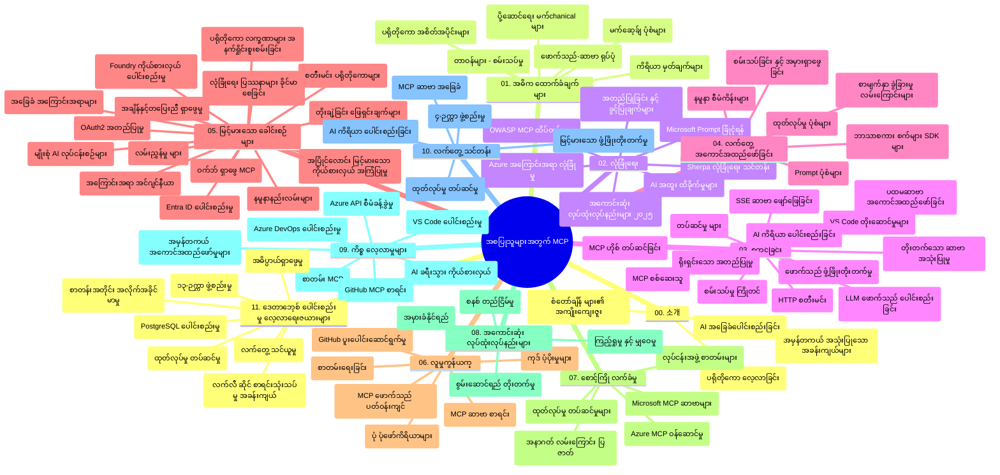

# Model Context Protocol (MCP) အတွက် စတူဒီလမ်းညွှန် - စတင်သူများအတွက်

ဤစတူဒီလမ်းညွှန်သည် "Model Context Protocol (MCP) အတွက် စတင်သူများ" သင်ရိုးညွှန်းတမ်းအတွက် ရေပိုးဇင်ဖိုင်၏ဖွဲ့စည်းပုံနှင့် အကြောင်းအရာများကို အနှစ်ချုပ်ပေးထားသည်။ ဒီလမ်းညွှန်ကို အသုံးပြု၍ ရေပိုးဇင်ဖိုင်ကို ထိရောက်စွာ ဖြတ်သန်းနိုင်ပြီး ရရှိနိုင်သောအရင်းအမြစ်များကို အကောင်းဆုံးအသုံးချနိုင်ပါသည်။

## Repository Overview

Model Context Protocol (MCP) သည် AI မော်ဒယ်များနှင့် client အက်ပလီကေးရှင်းများအကြား ပေါင်းသင်းဆက်ဆံမှုများအတွက် စံထား၍ သတ်မှတ်ထားသော စနစ်တစ်ခုဖြစ်သည်။ မူရင်းအားဖြင့် Anthropic မှဖန်တီးခဲ့ပြီး ယခုအခါ MCP လူထုအသိုင်းအဝိုင်းမှ GitHub အဖွဲ့အစည်းတရပ်ဖြင့် ထိန်းသိမ်း ထားသည်။ ဤ repository တွင် C#၊ Java၊ JavaScript၊ Python နှင့် TypeScript တို့တွင် လက်တွေ့ ကုဒ်နမူနာများ ပါဝင်ပြီး AI ဖန်တီးသူများ၊ စနစ်ပညာရှင်များနှင့် ဆော့ဖ်ဝဲအင်ဂျင်နီယာများအတွက် အပြည့်အစုံ သင်ရိုးညွှန်းတမ်းတစ်ခု ပါဝင်သည်။

## Visual Curriculum Map

## Repository Structure

Repository ကို MCP ၏ အစိတ်အပိုင်း အမျိုးမျိုးအပေါ် အာရုံစူးစိုက်ထားသည့် အဓိက အပိုင်းဆောင်း ၁၁ ခုအလိုက် စုစည်းထားပါသည်-

1. **Introduction (00-Introduction/)**
   - Model Context Protocol အကြောင်းအနှစ်ချုပ်
   - AI pipeline များတွင် စံပြမှု အရေးကြီးမှု
   - လက်တွေ့သုံးစွဲမှုနှင့် အကျိုးကျေးဇူးများ

2. **Core Concepts (01-CoreConcepts/)**
   - Client-server ဖွဲ့စည်းပုံ
   - အဓိက protocol အစိတ်အပိုင်းများ
   - MCP မှာ သတင်းပို့ပုံစံများ

3. **Security (02-Security/)**
   - MCP အခြေပြု စနစ်များ၏ လုံခြုံရေး ခြိမ်းခြောက်ခြင်းများ
   - လုံခြုံရေး အကောင်အထည်ဖော်ရာ သတ်မှတ်ချက်များ
   - အတည်ပြုခြင်းနှင့် ခွင့်ပြုခြင်း မူဝါဒများ
   - **လုံခြုံရေး စာမျက်နှာပြည့်စုံ**:
     - MCP Security Best Practices 2025
     - Azure Content Safety Implementation Guide
     - MCP Security Controls and Techniques
     - MCP Best Practices Quick Reference
   - **အဓိက လုံခြုံရေး ခေါင်းစဉ်များ**:
     - Prompt injection နှင့် tool poisoning အတိုက်ခိုက်မှုများ
     - Session hijacking နှင့် confused deputy ပြဿနာများ
     - Token passthrough အားနည်းချက်များ
     - ခွင့်ပြုချက်အလွန်များနှင့် Access control
     - AI အစိတ်အပိုင်းများ၏ Supply chain လုံခြုံရေး
     - Microsoft Prompt Shields ပေါင်းစည်းမှု

4. **Getting Started (03-GettingStarted/)**
   - ပတ်ဝန်းကျင် ပြင်ဆင်ခြင်းနှင့် တပ်ဆင်ခြင်း
   - အစ စီမံကို MCP servers နှင့် clients တည်ဆောက်ခြင်း
   - ရှိပြီးသား အက်ပလီကေးရှင်းများနှင့် ပေါင်းစည်းခြင်း
   - ပါဝင်သည့် အပိုင်းများ-
     - ပထမဆုံး server တည်ဆောက်ခြင်း
     - Client ဖန်တီးခြင်း
     - LLM client ပေါင်းစည်းခြင်း
     - VS Code ပေါင်းစည်းခြင်း
     - Server-Sent Events (SSE) server
     - အဆင့်မြင့် server အသုံးပြုမှု
     - HTTP streaming
     - AI Toolkit ပေါင်းစည်းခြင်း
     - စမ်းသပ်မှု များ
     - Deployment လမ်းညွှန်

5. **Practical Implementation (04-PracticalImplementation/)**
   - မတူညီသော programming languages အသုံးပြု၍ SDK များအသုံးပြုခြင်း
   - Debugging၊ စမ်းသပ်ခြင်းနှင့် အတည်ပြုခြင်း နည်းစနစ်များ
   - ပြန်လည်အသုံးပြုနိုင်သော prompt templates နှင့် workflows ဖန်တီးခြင်း
   - နမူနာပရောဂျက်များနှင့် အကောင်အထည်ဖော်သည့် နမူနာများ

6. **Advanced Topics (05-AdvancedTopics/)**
   - Context engineering နည်းပညာများ
   - Foundry agent ပေါင်းစည်းခြင်း
   - Multi-modal AI workflows
   - OAuth2 authentication ကိုပြသမှုများ
   - အချိန်နှင့် တ-response ရှာဖွေရေး
   - အချိန်နှင့် တ-response streaming
   - Root contexts အကောင်အထည်ဖော်ခြင်း
   - Routing နည်းဗျူဟာများ
   - Sampling နည်းများ
   - နည်းချဲ့မှုနည်းပညာများ
   - လုံခြုံရေး စဉ်းစားချက်များ
   - Entra ID လုံခြုံရေး ပေါင်းစည်းမှု
   - Web ရှာဖွေရေးပေါင်းစည်းမှု
   - Adversarial multi-agent reasoning (debate နည်းပုံများ)

7. **Community Contributions (06-CommunityContributions/)**
   - ကုဒ်နှင့် စာရွက်စာတမ်း ပံ့ပိုးမှု ပြုလုပ်နည်း
   - GitHub ဖြင့် ပူးပေါင်းဆောင်ရွက်ခြင်း
   - လူထုမှ ဆောင်ရွက်ချက်များနှင့် တုံ့ပြန်ချက်များ
   - မတူသော MCP clients အသုံးပြုနည်းများ (Claude Desktop၊ Cline၊ VSCode)
   - လူကြိုက်များသော MCP servers များနှင့် ပူးပေါင်း အလုပ်လုပ်ခြင်း(ရုပ်ပုံဖန်တီးခြင်းပါ)

8. **Lessons from Early Adoption (07-LessonsfromEarlyAdoption/)**
   - လက်တွေ့ နေရာတိုင်းအတွက် အကောင်အထည်ဖော်မှုများနှင့် အောင်မြင်မှု ရသများ
   - MCP အခြေပြု ဖြေရှင်းချက်များ တည်ဆောက်ခြင်းနှင့် တပ်ဆင်ခြင်း
   - လမ်းညွှန်ခြင်း သော ရှေ့နေရာများနှင့် အနာဂတ် လမ်းကြောင်း
   - **Microsoft MCP Servers Guide**: ထုတ်လုပ်မှုအဆင့် အသင့် Microsoft MCP servers ၁၀ ခုအတွက် လမ်းညွှန်စာအုပ်
     - Microsoft Learn Docs MCP Server
     - Azure MCP Server (ခေါင်းဆောင် ၁၅+) ဆက်စပ် ဖော်ပြချက်များ
     - GitHub MCP Server
     - Azure DevOps MCP Server
     - MarkItDown MCP Server
     - SQL Server MCP Server
     - Playwright MCP Server
     - Dev Box MCP Server
     - Microsoft Foundry MCP Server
     - Microsoft 365 Agents Toolkit MCP Server

9. **Best Practices (08-BestPractices/)**
   - လုပ်ဆောင်မှု ပိုင်းကို တိုးတက်ကောင်းမွန်စေရေး နှင့် ပြုပြင်ထိန်းသိမ်းမှု
   - MCP စနစ်များအား ချို့ယွင်းချက် မရှိ အောင် ဒီဇိုင်းရေးဆွဲခြင်း
   - စမ်းသပ်ခြင်းနှင့် တည်ငြိမ်မှု နည်းလမ်းများ

10. **Case Studies (09-CaseStudy/)**
    - **MCP အမျိုးမျိုးကို အသုံးပြု၍ အနှံပေါက် ရှင်းပြချက်များ ၇ ခု**
    - **Azure AI Travel Agents**: Azure OpenAI နှင့် AI Search တို့ဖြင့် multi-agent လုပ်ငန်းစဉ်လုပ်ငန်းစဉ်များ
    - **Azure DevOps Integration**: YouTube ဒေတာ များဖြင့် workflow အလိုအလျောက်လုပ်ခြင်း
    - **အချိန်နှင့် တ-response စာရွက်ချက် ရယူခြင်း**: Python console client နှင့် HTTP streaming
    - **မေးမြန်းခြင်း Study Plan Generator**: Chainlit web app နှင့် စကားပြော AI ပေါင်းစည်းမှု
    - **Editorတွင်း စာရွက်ချက်များ**: GitHub Copilot workflows နှင့် VS Code ပေါင်းစည်းမှု
    - **Azure API Management**: MCP server တည်ဆောက်မှုဖြင့် စီးပွားရေး API ပေါင်းစည်းမှု
    - **GitHub MCP Registry**: ပတ်ဝန်းကျင် ဖွံ့ဖြိုးတိုးတက်မှုနှင့် agentic ပေါင်းစည်းမှု စခန်း
    - စီးပွားရေး ပတ်ဝန်းကျင် ပေါင်းစည်းမှု၊ ဖန်တီးသူ ထုတ်လုပ်မှုနှင့် ပတ်ဝန်းကျင် ဖွံ့ဖြိုးတိုးတက်မှု စဉ်းစားမှုများအထူးပြု

11. **Hands-on Workshop (10-StreamliningAIWorkflowsBuildingAnMCPServerWithAIToolkit/)**
    - MCP နှင့် AI Toolkit ပေါင်းစည်းထားသော လက်တွေ့ လေ့ကျင့်ရေးဆိုင်ရာ စားပွဲခင်း
    - AI မော်ဒယ်များနှင့် လက်တွေ့ကိရိယာများ တစ်ပြိုင်နက် တည်ဆောက်ခြင်း
    - အခြေခံ သဘောသရုပ်၊ ခြုံငုံ ဖော်ပြချက်၊ စိတ်ကြိုက် server ဖန်တီးခြင်း၊ ထုတ်လုပ်မှုသို့ စေ့စပ်လေ့လာမှုများပါဝင်
    - **Lab ဖွဲ့စည်းပုံ**:
      - Lab 1: MCP Server ဗဟုသုတ အခြေခံ
      - Lab 2: အဆင့်မြင့် MCP Server ဖန်တီးခြင်း
      - Lab 3: AI Toolkit ပေါင်းစည်းခြင်း
      - Lab 4: ထုတ်လုပ်မှု တပ်ဆင်ခြင်းနှင့် နည်းချဲ့မှု
    - Lab အခြေခံ သင်ကြားမှု ကို ညွှန်ကြားချက်များဖြင့် လမ်းညွှန်

12. **MCP Server Database Integration Labs (11-MCPServerHandsOnLabs/)**
    - **အသုံးပြုနိုင်သော ၁၃ lab ဖြင့် ထုတ်လုပ်မှုအဆင့် MCP servers PostgreSQL ပေါင်းစည်းထားမှု**
    - **အမှန်တကယ် လုပ်ငန်းများအတွက် လူသုံး Zava Retail နမူနာလမ်းညွှန်**
    - **စီးပွားရေးအဆင့် စနစ်များ** - Row Level Security (RLS), semantic search နှင့် multi-tenant data access
    - **Lab ဖွဲ့စည်းမှု ပြည့်စုံ**:
      - **Labs 00-03: အခြေခံ** - နိဒါန်း၊ ဖွဲ့စည်းပုံ၊ လုံခြုံရေး၊ ပတ်ဝန်းကျင် ပြင်ဆင်ခြင်း
      - **Labs 04-06: MCP Server ဖန်တီးခြင်း** - ဒေတာဘေ့စ် ဒီဇိုင်း၊ MCP Server အကောင်အထည်ဖော်ခြင်း၊ ကိရိယာ ဖွံ့ဖြိုးတိုးတက်မှု
      - **Labs 07-09: အဆင့်မြင့်နည်းပညာများ** - Semantic Search, စမ်းသပ်မှုနှင့် Debugging, VS Code ပေါင်းစည်းမှု
      - **Labs 10-12: ထုတ်လုပ်မှုနှင့် အကောင်းဆုံး လုပ်ထုံးလုပ်နည်းများ** - Deployment, စောင့်ကြပ်ခြင်း, ထိရောက်မှု မြှင့်တင်ခြင်း
    - **သင်ကြားထားသောနည်းပညာများ**: FastMCP framework, PostgreSQL, Azure OpenAI, Azure Container Apps, Application Insights
    - **သင်ယူရသများ**: ထုတ်လုပ်မှုအဆင့် MCP servers, ဒေတာဘေ့စ် ပေါင်းစည်းမှု နည်းပညာများ, AI ခွန်အား မြှင့်တင်သော စစ်တမ်းများ, စီးပွားရေး လုံခြုံရေး

## ဤရေပိုးဇင်ဖိုင်တွင် ပါဝင်သော အပိုဆောင်း အရင်းအမြစ်များ

Repository တွင် ထောက်ပံ့ပစ္စည်းများဖြစ်သော -

- **ပုံများဖိုဒါ**: သင်ရိုးညွှန်းတမ်းအတွင်း သုံးသော အကြမ်းပုံနှင့် ပုံကြမ်းများ ပါဝင်သည်။
- **ဘာသာပြန်ချက်များ**: စာရွက်စာတမ်း များကို စက်တင်လန်းပြောင်းမှုဖြင့် မြန်မာနှင့် များသောဘာသာစကားများတွင် ထောက်ပံ့သည်။
- **မှန်ကန်သော MCP အရင်းအမြစ်များ**:
  - [MCP Documentation](https://modelcontextprotocol.io/)
  - [MCP Specification](https://spec.modelcontextprotocol.io/)
  - [MCP GitHub Repository](https://github.com/modelcontextprotocol)

## Repository ကို ဘယ်လို အသုံးပြုမလဲ

1. **အစဥ်အတိုင်း သင်ယူခြင်း**: အဆင့်လိုက် (00 မှ 11) နည်းဖြင့် သင်ယူပါ။
2. **ဘာသာစကား အထူးပြု ဂရုစိုက်မှု**: စိတ်ဝင်စားရာ programming language အရ နမူနာ များပါသော ဖိုလ်ဒါများကို ရှာဖွေ လေ့လာပါ။
3. **လက်တွေ့ အကောင်အထည်ဖော်ခြင်း**: "Getting Started" အပိုင်းကနေ သင့်ပတ်ဝန်းကျင် ပြင်ဆင်ပြီး ပထမဆုံး MCP server နှင့် client တည်ဆောက်ပါ။
4. **အဆင့်မြင့် စူးစမ်းလေ့လာမှု**: အခြေခံကို နားလည်ပြီးနောက် အဆင့်မြင့် ခေါင်းစဉ်များသို့ ဝင်ရောက် ရှာဖွေပါ။
5. **လူထုနှင့် ပူးပေါင်းဆောင်ရွက်မှု**: GitHub ဆွေးနွေးပွဲများနှင့် Discord ချန်နယ်များမှတဆင့် MCP လူထုနှင့် ဆက်သွယ် ဆောင်ရွက်ပါ။

## MCP Clients နှင့် ကိရိယာများ

သင်ရိုးညွှန်းတမ်းတွင် ပါဝင်သည့် MCP clients နှင့် ကိရိယာများ-

1. **မှန်ကန်သော Clients**:
   - Visual Studio Code
   - MCP in Visual Studio Code
   - Claude Desktop
   - Claude in VSCode
   - Claude API

2. **လူထု Clients**:
   - Cline (terminal-based)
   - Cursor (code editor)
   - ChatMCP
   - Windsurf

3. **MCP Management Tools**:
   - MCP CLI
   - MCP Manager
   - MCP Linker
   - MCP Router

## လူကြိုက်များသော MCP Servers

Repository တွင် မိတ်ဆက် ပြသထားသော MCP servers များ-

1. **မှန်ကန်သော Microsoft MCP Servers**:
   - Microsoft Learn Docs MCP Server
   - Azure MCP Server (ခေါင်းဆောင် ၁၅ ကျော် ဆက်စပ် connectors)
   - GitHub MCP Server
   - Azure DevOps MCP Server
   - MarkItDown MCP Server
   - SQL Server MCP Server
   - Playwright MCP Server
   - Dev Box MCP Server
   - Microsoft Foundry MCP Server
   - Microsoft 365 Agents Toolkit MCP Server

2. **မှန်ကန်သော ရည်ညွှန်း Servers**:
   - Filesystem
   - Fetch
   - Memory
   - Sequential Thinking

3. **ရုပ်ပုံ ဖန်တီးခြင်း**:
   - Azure OpenAI DALL-E 3
   - Stable Diffusion WebUI
   - Replicate

4. **ဖွံ့ဖြိုးရေး ကိရိယာများ**:
   - Git MCP
   - Terminal Control
   - Code Assistant

5. **အထူးပြု Servers**:
   - Salesforce
   - Microsoft Teams
   - Jira & Confluence

## ပံ့ပိုးမှု ပြုလုပ်ခြင်း

Repository သည် လူထုမှ ပံ့ပိုးမှုများအား ဖိတ်ခေါ်ပါသည်။ MCP ပတ်ဝန်းကျင်တွင် ထိရောက်စွာ ပါဝင်ပံ့ပိုးရန် Community Contributions အပိုင်းကို ကြည့်ရှုပါ။

----

*ဤစတူဒီလမ်းညွှန်ကို နောက်ဆုံး ပြုပြင်သစ်တမ်းတင်ခဲ့သည့် ရက်စွဲမှာ ၂၀၂၆ ပြည့်နှစ် ဖေဖော်ဝါရီလ ၅ ရက် ဖြစ်ပြီး MCP Specification 2025-11-25 တွင် အသစ်ဆုံးအချက်အလက်များကို ကိုက်ညီစွာ ထည့်သွင်းထားသည်။ ဤရက်စွဲမှ နောက်ပိုင်းတွင် Repository အကြောင်းအရာများ ပြင်ဆင် အသစ် ထပ်မံရရှိနိုင်ပါသည်။

---

<!-- CO-OP TRANSLATOR DISCLAIMER START -->
**ပြောကြားချက်**
ဤစာတမ်းကို AI ဘာသာပြန်ဝန်ဆောင်မှု [Co-op Translator](https://github.com/Azure/co-op-translator) အသုံးပြု၍ ဘာသာပြန်ထားပါသည်။ ကျွန်ုပ်တို့သည် တိကျမှန်ကန်မှုအတွက် ကြိုးပမ်းနေသော်လည်း၊ စက်ကိရိယာဘာသာပြန်ခြင်းများတွင် အမှားများ သို့မဟုတ် မှားယွင်းချက်များ ပါဝင်နိုင်ကြောင်း သတိပြုပါရန် လိုအပ်ပါသည်။ မူလစာတမ်းကို မူရင်းဘာသာဖြင့်သာ ယုံကြည်စိတ်ချရသော အချက်အလက်အဖြစ် သတ်မှတ်သင့်သည်။ အရေးကြီးသည့် သတင်းအချက်အလက်များအတွက် ပရော်ဖက်ရှင်နယ် လူသားဘာသာပြန်သူဝန်ဆောင်မှုကို အကြံပြုပါသည်။ ဤဘာသာပြန်ချက်ကို အသုံးပြုခြင်းမှ ဖြစ်ပေါ်လာသော နားလည်မှုကွာခြားမှုများ သို့မဟုတ် မမှန်ကန်သော အသုံးပြုမှုများအတွက် ကျွန်ုပ်တို့ တာဝန်မခံပါ။
<!-- CO-OP TRANSLATOR DISCLAIMER END -->